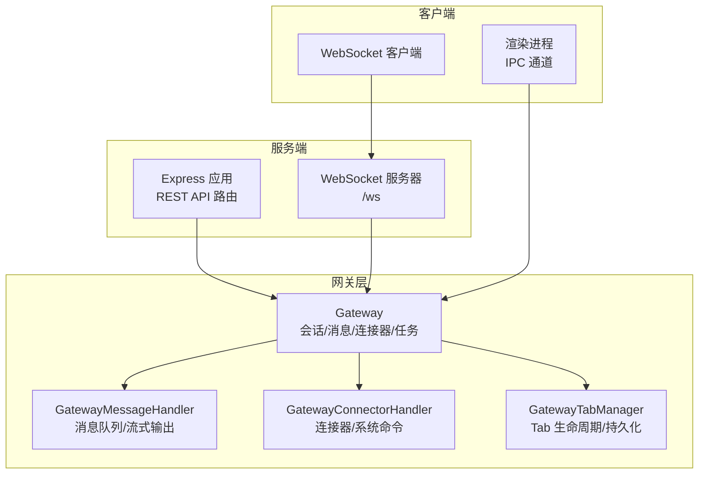
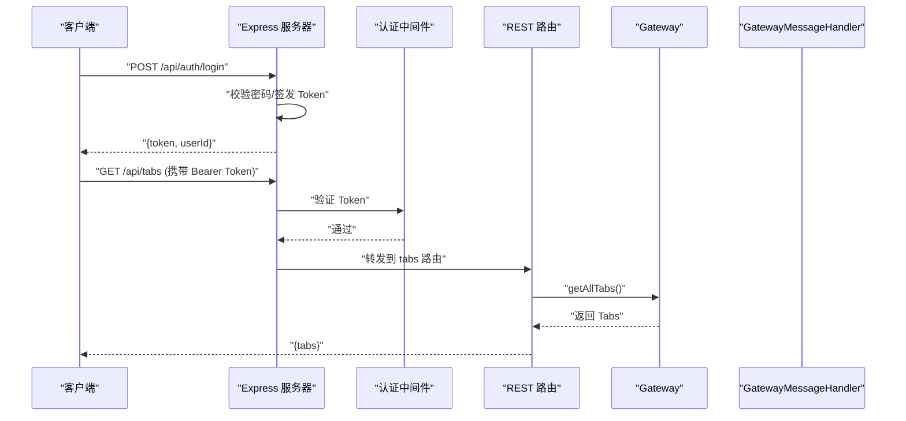
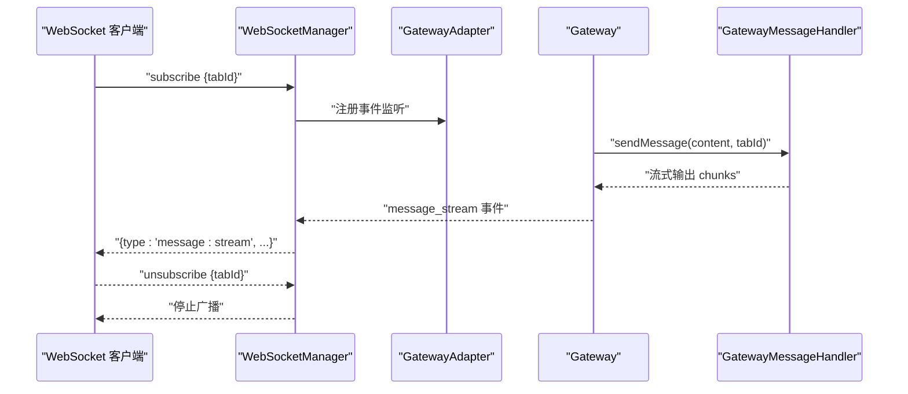
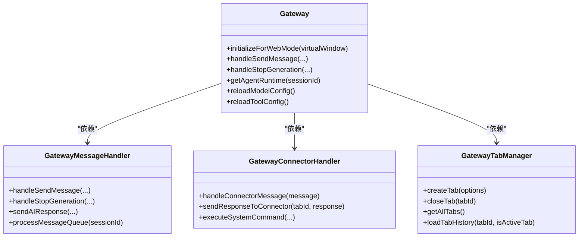

# API 参考文档

<cite>
**本文档引用的文件**
- [src/server/index.ts](file://src/server/index.ts)
- [src/server/websocket-manager.ts](file://src/server/websocket-manager.ts)
- [src/server/middleware/auth.ts](file://src/server/middleware/auth.ts)
- [src/server/routes/config.ts](file://src/server/routes/config.ts)
- [src/server/routes/tabs.ts](file://src/server/routes/tabs.ts)
- [src/server/routes/tools.ts](file://src/server/routes/tools.ts)
- [src/server/types.ts](file://src/server/types.ts)
- [src/main/gateway.ts](file://src/main/gateway.ts)
- [src/main/gateway-connector.ts](file://src/main/gateway-connector.ts)
- [src/main/gateway-message.ts](file://src/main/gateway-message.ts)
- [src/main/gateway-tab.ts](file://src/main/gateway-tab.ts)
</cite>

## 目录
1. [简介](#简介)
2. [项目结构](#项目结构)
3. [核心组件](#核心组件)
4. [架构总览](#架构总览)
5. [详细组件分析](#详细组件分析)
6. [依赖关系分析](#依赖关系分析)
7. [性能考量](#性能考量)
8. [故障排查指南](#故障排查指南)
9. [结论](#结论)
10. [附录](#附录)

## 简介
本文件为 史丽慧小助理 API 的全面参考文档，覆盖以下协议与能力：
- RESTful API：HTTP 方法、URL 模式、请求/响应模式与身份验证
- WebSocket API：连接处理、消息格式、事件类型与实时交互模式
- IPC 通信：数据流、消息传递与进程同步
- 协议特定示例、错误处理策略、安全考虑、速率限制与版本信息
- 常见用例、客户端实现指南与性能优化技巧
- 协议特定调试工具与监控方法

## 项目结构
史丽慧小助理 采用“服务端 + 网关层 + 客户端”的分层架构：
- 服务端（Express + WebSocket）：对外提供 REST API 与 WebSocket 服务
- 网关层（Gateway 及其子处理器）：负责会话管理、消息路由、连接器与系统命令处理、流式响应与队列控制
- 客户端（渲染进程）：通过 IPC 与网关交互，同时通过 WebSocket 接收实时事件

图表来源
- [src/server/index.ts:33-128](file://src/server/index.ts#L33-L128)
- [src/main/gateway.ts:29-114](file://src/main/gateway.ts#L29-L114)
- [src/main/gateway-message.ts:31-64](file://src/main/gateway-message.ts#L31-L64)
- [src/main/gateway-connector.ts:44-88](file://src/main/gateway-connector.ts#L44-L88)
- [src/main/gateway-tab.ts:26-61](file://src/main/gateway-tab.ts#L26-L61)

章节来源
- [src/server/index.ts:33-128](file://src/server/index.ts#L33-L128)
- [src/main/gateway.ts:29-114](file://src/main/gateway.ts#L29-L114)

## 核心组件
- 服务端入口与路由
  - REST API：/api/config、/api/tabs、/api/tools、/api/connectors、/api/tasks、/api/files、/api/skills
  - WebSocket：/ws，心跳与订阅机制
  - 健康检查：/health
- 网关层
  - Gateway：会话生命周期、消息路由、流式响应、多 AgentRuntime 管理
  - GatewayMessageHandler：消息队列、流式输出、错误恢复、执行步骤实时上报
  - GatewayConnectorHandler：连接器消息处理、系统命令执行、进度提醒
  - GatewayTabManager：Tab 创建/关闭/持久化、历史加载、欢迎消息
- 客户端交互
  - REST：受保护路由（需 Token）
  - WebSocket：订阅/取消订阅 Tab，接收流式消息与事件

章节来源
- [src/server/index.ts:75-102](file://src/server/index.ts#L75-L102)
- [src/server/routes/config.ts:10-44](file://src/server/routes/config.ts#L10-L44)
- [src/server/routes/tabs.ts:10-136](file://src/server/routes/tabs.ts#L10-L136)
- [src/server/routes/tools.ts:9-56](file://src/server/routes/tools.ts#L9-L56)
- [src/main/gateway.ts:29-114](file://src/main/gateway.ts#L29-L114)
- [src/main/gateway-message.ts:31-64](file://src/main/gateway-message.ts#L31-L64)
- [src/main/gateway-connector.ts:44-88](file://src/main/gateway-connector.ts#L44-L88)
- [src/main/gateway-tab.ts:26-61](file://src/main/gateway-tab.ts#L26-L61)

## 架构总览
服务端启动后创建 Express 与 WebSocket 服务器，初始化 Gateway 并注入依赖；REST 路由通过认证中间件保护，WebSocket 通过 Token 或密码模式鉴权；Gateway 负责消息与连接器处理，并通过 IPC 事件向渲染进程广播。

图表来源
- [src/server/index.ts:85-95](file://src/server/index.ts#L85-L95)
- [src/server/middleware/auth.ts:22-45](file://src/server/middleware/auth.ts#L22-L45)
- [src/server/routes/tabs.ts:17-24](file://src/server/routes/tabs.ts#L17-L24)

## 详细组件分析

### RESTful API

- 健康检查
  - 方法：GET
  - 路径：/health
  - 响应字段：status、version、uptime、connections
  - 示例：curl http://localhost:3008/health

- 登录与认证
  - 方法：POST
  - 路径：/api/auth/login
  - 请求体：{ password? }
  - 响应体：{ token, userId, expiresIn }
  - 说明：未设置 ACCESS_PASSWORD 时直接放行并签发 Token

- 配置管理
  - GET /api/config：获取系统配置
  - PUT /api/config：更新系统配置
  - 需要 Token

- Tab 管理
  - GET /api/tabs：获取所有 Tab
  - POST /api/tabs：创建新 Tab
  - GET /api/tabs/:tabId：获取指定 Tab
  - DELETE /api/tabs/:tabId：关闭指定 Tab
  - POST /api/tabs/:tabId/messages：发送消息到指定 Tab
  - GET /api/tabs/:tabId/messages：获取 Tab 消息历史（limit, before）
  - POST /api/tabs/stop-generation：停止生成

- 工具
  - POST /api/tools/environment-check：环境检查
  - POST /api/tools/launch-chrome：启动 Chrome 调试

章节来源
- [src/server/index.ts:75-102](file://src/server/index.ts#L75-L102)
- [src/server/middleware/auth.ts:57-90](file://src/server/middleware/auth.ts#L57-L90)
- [src/server/routes/config.ts:10-44](file://src/server/routes/config.ts#L10-L44)
- [src/server/routes/tabs.ts:10-136](file://src/server/routes/tabs.ts#L10-L136)
- [src/server/routes/tools.ts:9-56](file://src/server/routes/tools.ts#L9-L56)

### WebSocket API

- 连接与鉴权
  - 地址：ws://host:port/ws?token=...
  - 鉴权：若设置 ACCESS_PASSWORD，则必须提供有效 JWT Token；否则匿名放行
  - 同一用户多设备登录：新连接将“踢掉”旧连接并发送 {type: "session:kicked"}

- 心跳与订阅
  - 客户端发送：{type: "ping"}；服务端返回 {type: "pong"}
  - 订阅：{type: "subscribe", tabId}
  - 取消订阅：{type: "unsubscribe", tabId}

- 事件类型与消息格式
  - message:stream：流式消息片段与完成信号
  - execution-step:update：执行步骤实时更新
  - agent_status：Agent 状态
  - message:error：错误事件
  - tab:*：Tab 相关事件（创建/更新/清空/历史加载）
  - clear-chat：清空聊天
  - name-config:update / model-config:update / pending-count:update：全局配置变更
  - session:kicked：被踢下线

- 实时交互流程
  - 客户端订阅目标 Tab
  - 服务端监听 Gateway 的 IPC 事件并广播给订阅者
  - 客户端断开连接时，服务端停止对应 Tab 的 Agent 执行

图表来源
- [src/server/websocket-manager.ts:177-201](file://src/server/websocket-manager.ts#L177-L201)
- [src/server/websocket-manager.ts:229-289](file://src/server/websocket-manager.ts#L229-L289)
- [src/main/gateway-message.ts:376-473](file://src/main/gateway-message.ts#L376-L473)

章节来源
- [src/server/websocket-manager.ts:29-125](file://src/server/websocket-manager.ts#L29-L125)
- [src/server/websocket-manager.ts:177-201](file://src/server/websocket-manager.ts#L177-L201)
- [src/server/websocket-manager.ts:229-340](file://src/server/websocket-manager.ts#L229-L340)
- [src/server/types.ts:45-67](file://src/server/types.ts#L45-L67)

### IPC 通信

- 事件来源（GatewayAdapter 监听 Gateway 事件）
  - message_stream：消息流（含执行步骤、完成标记、时长等）
  - execution_step_update：执行步骤更新
  - message_error：错误
  - tab_*：Tab 生命周期与历史
  - clear_chat：清空聊天
  - name_config_update / model_config_update / pending_count_update：全局配置变更
  - tab_created / tab_updated：Tab 创建/更新

- 事件去向（渲染进程）
  - 通过 Electron IPC 通道接收并更新 UI

- 进程同步要点
  - WebSocket 断开时，服务端调用 GatewayAdapter.stopGeneration 停止对应 Tab 的执行
  - 系统配置变更后，Gateway 会触发延迟重置以应用新配置

章节来源
- [src/server/websocket-manager.ts:207-222](file://src/server/websocket-manager.ts#L207-L222)
- [src/main/gateway-message.ts:404-413](file://src/main/gateway-message.ts#L404-L413)
- [src/main/gateway.ts:239-245](file://src/main/gateway.ts#L239-L245)

## 依赖关系分析

图表来源
- [src/main/gateway.ts:337-374](file://src/main/gateway.ts#L337-L374)
- [src/main/gateway-message.ts:50-64](file://src/main/gateway-message.ts#L50-L64)
- [src/main/gateway-connector.ts:66-88](file://src/main/gateway-connector.ts#L66-L88)
- [src/main/gateway-tab.ts:45-61](file://src/main/gateway-tab.ts#L45-L61)

章节来源
- [src/main/gateway.ts:337-374](file://src/main/gateway.ts#L337-L374)
- [src/main/gateway-message.ts:50-64](file://src/main/gateway-message.ts#L50-L64)
- [src/main/gateway-connector.ts:66-88](file://src/main/gateway-connector.ts#L66-L88)
- [src/main/gateway-tab.ts:45-61](file://src/main/gateway-tab.ts#L45-L61)

## 性能考量
- 流式输出与实时步骤
  - GatewayMessageHandler 在发送 AI 响应时逐片推送流式内容，并实时上报执行步骤，避免前端长时间等待
- 队列与并发控制
  - 普通 Tab：Agent 正在生成时将新消息入队，避免并发冲突
  - 定时任务 Tab：等待上一次执行完成后再处理新消息
- 错误恢复
  - 检测 AI 连接错误时自动清理缓存并重置当前 Tab 的 Runtime，减少人工干预
- 连接管理
  - WebSocketManager 支持多设备登录踢人、断线停止执行，保障资源与一致性

章节来源
- [src/main/gateway-message.ts:120-132](file://src/main/gateway-message.ts#L120-L132)
- [src/main/gateway-message.ts:165-196](file://src/main/gateway-message.ts#L165-L196)
- [src/main/gateway-message.ts:246-283](file://src/main/gateway-message.ts#L246-L283)
- [src/server/websocket-manager.ts:52-68](file://src/server/websocket-manager.ts#L52-L68)
- [src/server/websocket-manager.ts:207-222](file://src/server/websocket-manager.ts#L207-L222)

## 故障排查指南
- 认证失败
  - 未设置 ACCESS_PASSWORD：登录接口直接签发 Token
  - 已设置密码：确认请求头 Authorization: Bearer <token> 有效
- WebSocket 连接被踢
  - 多设备登录导致旧连接被踢，需重新鉴权并订阅
- 消息未到达
  - 确认客户端已订阅目标 tabId
  - 检查服务端日志与 Gateway 的消息队列处理
- AI 连接错误
  - 网络波动或 API 配置异常，系统会自动清理缓存并重置 Runtime
- 健康检查
  - 访问 /health 获取运行状态、版本与连接数

章节来源
- [src/server/middleware/auth.ts:22-45](file://src/server/middleware/auth.ts#L22-L45)
- [src/server/websocket-manager.ts:52-68](file://src/server/websocket-manager.ts#L52-L68)
- [src/main/gateway-message.ts:246-283](file://src/main/gateway-message.ts#L246-L283)
- [src/server/index.ts:75-83](file://src/server/index.ts#L75-L83)

## 结论
史丽慧小助理 提供统一的网关层抽象，将 REST API、WebSocket 与 IPC 有机整合，既满足传统 HTTP 交互，又支持实时流式体验。通过严格的队列与错误恢复机制，保证高并发下的稳定性与一致性。

## 附录

### 安全与鉴权
- ACCESS_PASSWORD：未设置则匿名放行；设置后需 JWT Token
- JWT_SECRET：用于签发与验证 Token，默认值仅用于开发环境
- Token 有效期：30 天

章节来源
- [src/server/middleware/auth.ts:12-15](file://src/server/middleware/auth.ts#L12-L15)
- [src/server/middleware/auth.ts:50-52](file://src/server/middleware/auth.ts#L50-L52)

### 版本信息
- 健康检查返回字段包含 version，用于标识当前服务版本

章节来源
- [src/server/index.ts:79](file://src/server/index.ts#L79)

### 常见用例与客户端实现建议
- 客户端实现建议
  - REST：使用 Bearer Token 访问受保护路由
  - WebSocket：连接时附带 token 查询参数，订阅所需 tabId，断开时取消订阅
- 常见用例
  - 实时聊天：订阅 Tab，接收 message:stream 事件，展示流式内容
  - 系统命令：通过 /api/tabs/:tabId/messages 发送 /new、/memory、/history、/stop、/status 等指令
  - 环境检查：POST /api/tools/environment-check 与 POST /api/tools/launch-chrome

章节来源
- [src/server/routes/tabs.ts:79-94](file://src/server/routes/tabs.ts#L79-L94)
- [src/server/routes/tools.ts:16-50](file://src/server/routes/tools.ts#L16-L50)