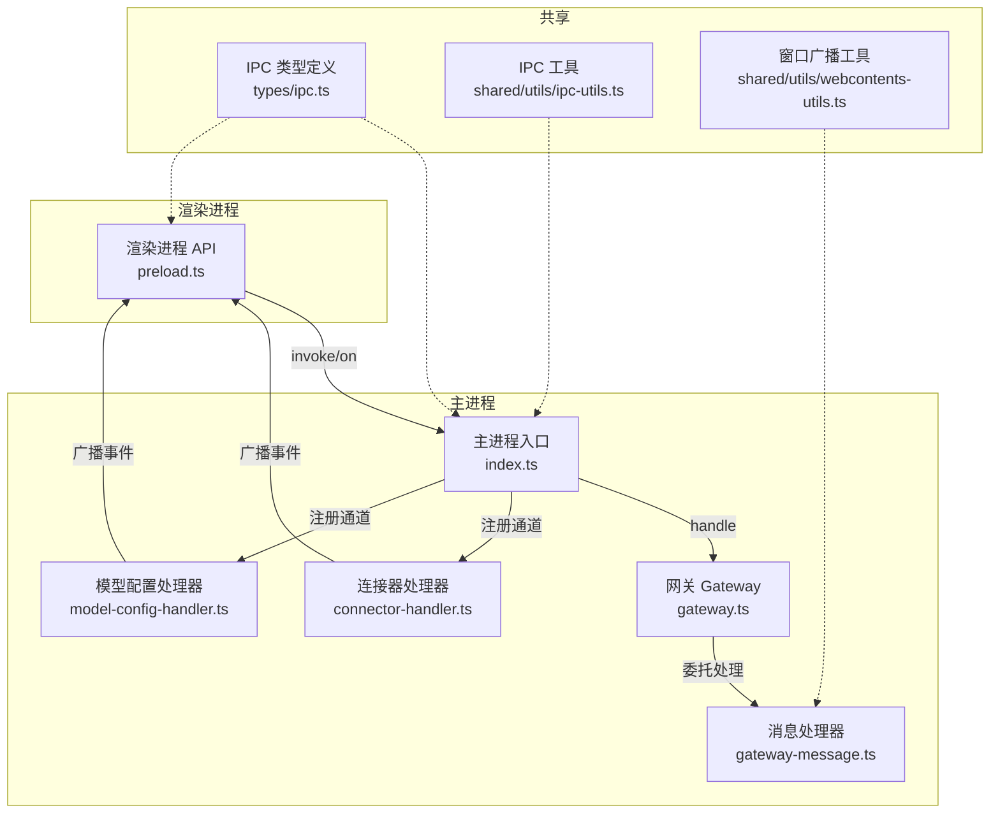
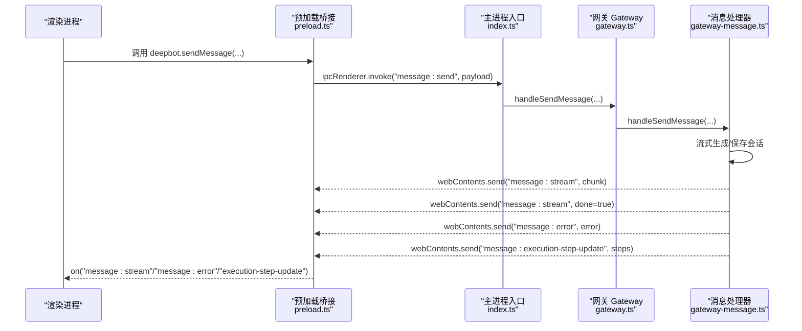
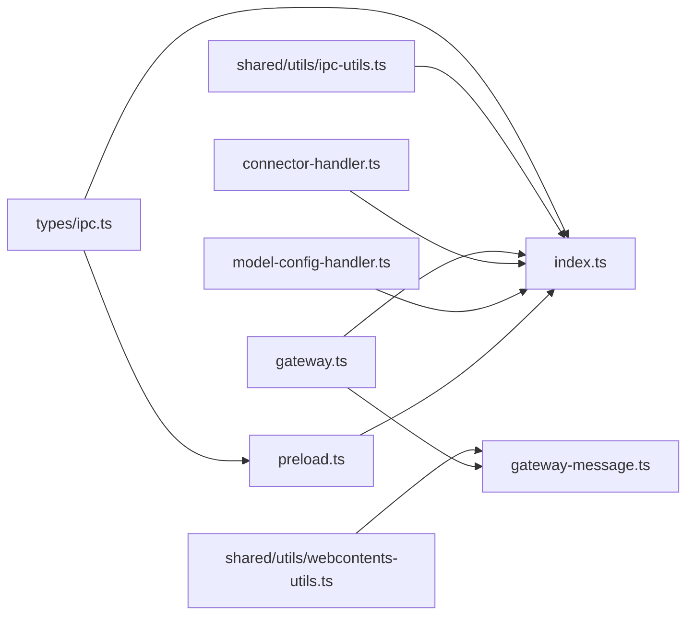

# IPC 通信

<cite>
**本文引用的文件**
- [src/main/ipc/connector-handler.ts](file://src/main/ipc/connector-handler.ts)
- [src/main/ipc/model-config-handler.ts](file://src/main/ipc/model-config-handler.ts)
- [src/shared/utils/ipc-utils.ts](file://src/shared/utils/ipc-utils.ts)
- [src/types/ipc.ts](file://src/types/ipc.ts)
- [src/main/preload.ts](file://src/main/preload.ts)
- [src/main/index.ts](file://src/main/index.ts)
- [src/main/gateway.ts](file://src/main/gateway.ts)
- [src/main/gateway-message.ts](file://src/main/gateway-message.ts)
- [src/shared/utils/webcontents-utils.ts](file://src/shared/utils/webcontents-utils.ts)
</cite>

## 目录
1. [简介](#简介)
2. [项目结构](#项目结构)
3. [核心组件](#核心组件)
4. [架构总览](#架构总览)
5. [详细组件分析](#详细组件分析)
6. [依赖关系分析](#依赖关系分析)
7. [性能考量](#性能考量)
8. [故障排查指南](#故障排查指南)
9. [结论](#结论)
10. [附录](#附录)

## 简介
本文件系统性梳理 DeepBot 的 IPC（进程间通信）机制，覆盖主进程与渲染进程之间的消息传递协议、通道命名规范、数据格式标准、参数传递规则与回调机制，并给出预加载脚本配置、安全沙箱设置以及跨进程数据同步示例。同时解释 IPC 在 DeepBot 架构中的作用与实现细节，帮助开发者快速理解与扩展。

## 项目结构
DeepBot 的 IPC 体系围绕“主进程处理器 + 预加载桥接 + 类型定义 + 事件广播”展开：
- 主进程处理器：集中注册各类 IPC 通道，负责业务处理与错误包装。
- 预加载桥接：通过 contextBridge 暴露受控 API 给渲染进程，统一封装 invoke/on。
- 类型定义：集中声明通道名与请求/响应结构，保证前后端契约一致。
- 事件广播：通过 BrowserWindow/WebContents 将状态变化推送到渲染端。

图表来源
- [src/main/index.ts:336-1218](file://src/main/index.ts#L336-L1218)
- [src/main/gateway.ts:29-772](file://src/main/gateway.ts#L29-L772)
- [src/main/gateway-message.ts:31-525](file://src/main/gateway-message.ts#L31-L525)
- [src/main/ipc/connector-handler.ts:65-405](file://src/main/ipc/connector-handler.ts#L65-L405)
- [src/main/ipc/model-config-handler.ts:40-227](file://src/main/ipc/model-config-handler.ts#L40-L227)
- [src/main/preload.ts:11-427](file://src/main/preload.ts#L11-L427)
- [src/types/ipc.ts:7-110](file://src/types/ipc.ts#L7-L110)
- [src/shared/utils/ipc-utils.ts:71-76](file://src/shared/utils/ipc-utils.ts#L71-L76)
- [src/shared/utils/webcontents-utils.ts:101-144](file://src/shared/utils/webcontents-utils.ts#L101-L144)

章节来源
- [src/main/index.ts:119-331](file://src/main/index.ts#L119-L331)
- [src/main/preload.ts:11-427](file://src/main/preload.ts#L11-L427)
- [src/types/ipc.ts:7-110](file://src/types/ipc.ts#L7-L110)

## 核心组件
- IPC 通道与类型定义：集中于 types/ipc.ts，包含消息、任务监控、工作目录、模型配置、图片/文件上传、工具配置、浏览器工具、名字配置、Tab 管理、连接器管理等通道名与请求/响应结构。
- 主进程处理器注册：index.ts 中集中注册 invoke 处理器；connector-handler.ts 与 model-config-handler.ts 通过 registerIpcHandler 统一包装错误。
- 预加载桥接：preload.ts 通过 contextBridge.exposeInMainWorld 暴露 deepbot 与 electron 对象，封装 invoke/on，提供强类型 API。
- 事件广播：gateway-message.ts 使用 sendToWindow 广播流式消息、错误、执行步骤更新等；connector-handler.ts 使用 BrowserWindow.getAllWindows 广播待授权计数等。

章节来源
- [src/types/ipc.ts:7-110](file://src/types/ipc.ts#L7-L110)
- [src/main/ipc/connector-handler.ts:65-405](file://src/main/ipc/connector-handler.ts#L65-L405)
- [src/main/ipc/model-config-handler.ts:40-227](file://src/main/ipc/model-config-handler.ts#L40-L227)
- [src/main/preload.ts:75-427](file://src/main/preload.ts#L75-L427)
- [src/main/gateway-message.ts:478-511](file://src/main/gateway-message.ts#L478-L511)

## 架构总览
主进程通过 ipcMain.handle 注册通道，渲染进程通过 preload 暴露的 deepbot.electron.ipcRenderer.invoke/on 与之通信。消息处理链路中，index.ts 的通用通道将请求委派给 Gateway/GatewayMessage 等处理器；连接器与模型配置通道通过各自处理器完成业务逻辑，并通过 BrowserWindow/webContents 推送事件。

图表来源
- [src/main/index.ts:338-359](file://src/main/index.ts#L338-L359)
- [src/main/gateway.ts:455-458](file://src/main/gateway.ts#L455-L458)
- [src/main/gateway-message.ts:76-160](file://src/main/gateway-message.ts#L76-L160)
- [src/main/gateway-message.ts:418-473](file://src/main/gateway-message.ts#L418-L473)
- [src/main/preload.ts:340-369](file://src/main/preload.ts#L340-L369)

## 详细组件分析

### 通道命名规范与数据格式标准
- 通道命名采用“域:动作”的层级命名，如 message:send、model-config:get/save/test、connector:get-all 等，便于分组与维护。
- 请求/响应结构统一在 types/ipc.ts 中定义，包含：
  - 请求体：如 SendMessageRequest、GetModelConfigResponse、SaveConnectorConfigRequest 等。
  - 响应体：统一包含 success 字段，错误时携带 error 字段；部分通道还包含 message、data 等字段。
  - 流式消息：StreamMessageChunk 定义了 messageId、content、done、executionSteps、totalDuration、sentAt 等字段，用于前端增量渲染与统计。

章节来源
- [src/types/ipc.ts:112-132](file://src/types/ipc.ts#L112-L132)
- [src/types/ipc.ts:230-266](file://src/types/ipc.ts#L230-L266)
- [src/types/ipc.ts:358-470](file://src/types/ipc.ts#L358-L470)

### 主进程处理器注册与错误包装
- 通用通道注册：index.ts 中集中注册 message:send、message:stop、技能管理、定时任务、环境检查、工作目录、图片/文件上传、工具配置、浏览器工具、名字配置、Tab 管理等通道。
- 连接器与模型配置处理器：connector-handler.ts 与 model-config-handler.ts 通过 registerIpcHandler 包装错误，统一返回 { success, data?, error? } 结构。
- 错误包装工具：shared/utils/ipc-utils.ts 提供 wrapIpcHandler/registerIpcHandler/createSuccessResponse/createErrorResponse，减少重复错误处理代码。

章节来源
- [src/main/index.ts:336-1218](file://src/main/index.ts#L336-L1218)
- [src/main/ipc/connector-handler.ts:65-405](file://src/main/ipc/connector-handler.ts#L65-L405)
- [src/main/ipc/model-config-handler.ts:40-227](file://src/main/ipc/model-config-handler.ts#L40-L227)
- [src/shared/utils/ipc-utils.ts:40-76](file://src/shared/utils/ipc-utils.ts#L40-L76)

### 预加载桥接与安全沙箱
- 预加载脚本通过 contextBridge.exposeInMainWorld 暴露 deepbot 与 electron 对象，渲染进程只能通过这些受控接口访问主进程能力。
- deepbot 对外暴露的方法均通过 ipcRenderer.invoke 调用对应通道；事件监听通过 ipcRenderer.on 注册，返回值为移除监听函数，便于组件卸载时清理。
- electron 对象提供通用的 ipcRenderer.invoke/on/removeListener 封装，便于通用场景调用。

章节来源
- [src/main/preload.ts:75-427](file://src/main/preload.ts#L75-L427)

### 事件广播与跨进程数据同步
- 连接器待授权计数：connector-handler.ts 在状态变化时遍历所有窗口，使用 webContents.send 推送 CONNECTOR_PENDING_COUNT_UPDATED。
- 消息流式推送：gateway-message.ts 在生成过程中实时发送 MESSAGE_STREAM，结束时发送 done=true；同时推送 EXECUTION_STEP_UPDATE 与 MESSAGE_ERROR。
- 窗口广播工具：webcontents-utils.ts 提供 broadcastToWindows/createWindowSender 等工具，简化多窗口广播。

章节来源
- [src/main/ipc/connector-handler.ts:45-60](file://src/main/ipc/connector-handler.ts#L45-L60)
- [src/main/gateway-message.ts:418-473](file://src/main/gateway-message.ts#L418-L473)
- [src/main/gateway-message.ts:478-511](file://src/main/gateway-message.ts#L478-L511)
- [src/shared/utils/webcontents-utils.ts:101-144](file://src/shared/utils/webcontents-utils.ts#L101-L144)

### 消息处理流程与回调机制
- 渲染进程调用 deepbot.sendMessage(...) -> 主进程 index.ts 处理 -> Gateway/GatewayMessage 处理 -> 流式返回 MESSAGE_STREAM -> 渲染进程 on("message:stream") 回调。
- 停止生成：deepbot.stopGeneration(...) -> 主进程处理 -> GatewayMessage.handleStopGeneration -> 重置会话 Runtime。
- 执行步骤更新：GatewayMessage 在运行时设置执行步骤回调，实时推送 EXECUTION_STEP_UPDATE。
- 错误处理：统一通过 MESSAGE_ERROR 推送错误信息，渲染端进行展示与恢复提示。

章节来源
- [src/main/index.ts:338-359](file://src/main/index.ts#L338-L359)
- [src/main/gateway.ts:463-466](file://src/main/gateway.ts#L463-L466)
- [src/main/gateway-message.ts:404-413](file://src/main/gateway-message.ts#L404-L413)
- [src/main/gateway-message.ts:505-511](file://src/main/gateway-message.ts#L505-L511)

### 连接器管理 IPC
- 通道：CONNECTOR_GET_ALL、CONNECTOR_GET_CONFIG、CONNECTOR_SAVE_CONFIG、CONNECTOR_START、CONNECTOR_STOP、CONNECTOR_HEALTH_CHECK、CONNECTOR_GET_PAIRING_RECORDS、CONNECTOR_APPROVE_PAIRING、CONNECTOR_SET_ADMIN_PAIRING、CONNECTOR_DELETE_PAIRING、CONNECTOR_PENDING_COUNT_UPDATED。
- 处理逻辑：
  - 保存配置时若连接器正在运行则先停止并更新状态，再保存配置。
  - 启动/停止连接器时更新 SystemConfigStore 状态。
  - 批准 Pairing 后通知连接器并向渲染端推送待授权计数更新。
- 广播：待授权计数变化通过 BrowserWindow.getAllWindows 遍历推送。

章节来源
- [src/main/ipc/connector-handler.ts:65-405](file://src/main/ipc/connector-handler.ts#L65-L405)

### 模型配置 IPC
- 通道：model-config:get、model-config:save、model-config:test。
- 处理逻辑：
  - 保存时根据模型映射表推断上下文窗口大小，合并到最终配置并保存。
  - 保存后重新加载 Gateway 的模型配置，并通过 event.sender 发送 model-config:updated 事件给渲染端。
  - 测试时动态导入 @mariozechner/pi-ai，构造测试请求并验证响应内容。
- 广播：保存成功后通过事件通道通知前端。

章节来源
- [src/main/ipc/model-config-handler.ts:40-227](file://src/main/ipc/model-config-handler.ts#L40-L227)

## 依赖关系分析
- 主进程入口 index.ts 依赖：
  - types/ipc.ts：通道名与类型定义。
  - gateway.ts：消息路由与会话管理。
  - ipc/connector-handler.ts 与 ipc/model-config-handler.ts：连接器与模型配置处理器。
  - shared/utils/ipc-utils.ts：统一错误包装。
  - shared/utils/webcontents-utils.ts：窗口广播。
- 预加载 bridge 依赖：
  - types/ipc.ts：通道名常量。
  - electron API：ipcRenderer.invoke/on。
- 消息处理器依赖：
  - gateway.ts：AgentRuntime 生命周期与会话管理。
  - shared/utils/webcontents-utils.ts：窗口广播。

图表来源
- [src/main/index.ts:27-36](file://src/main/index.ts#L27-L36)
- [src/main/gateway.ts:12-27](file://src/main/gateway.ts#L12-L27)
- [src/main/gateway-message.ts:12-18](file://src/main/gateway-message.ts#L12-L18)
- [src/main/ipc/connector-handler.ts:6-29](file://src/main/ipc/connector-handler.ts#L6-L29)
- [src/main/ipc/model-config-handler.ts:5-15](file://src/main/ipc/model-config-handler.ts#L5-L15)
- [src/main/preload.ts:12-70](file://src/main/preload.ts#L12-L70)
- [src/types/ipc.ts:8-110](file://src/types/ipc.ts#L8-L110)
- [src/shared/utils/ipc-utils.ts:7-8](file://src/shared/utils/ipc-utils.ts#L7-L8)
- [src/shared/utils/webcontents-utils.ts:110-144](file://src/shared/utils/webcontents-utils.ts#L110-L144)

章节来源
- [src/main/index.ts:27-36](file://src/main/index.ts#L27-L36)
- [src/main/gateway.ts:12-27](file://src/main/gateway.ts#L12-L27)
- [src/main/gateway-message.ts:12-18](file://src/main/gateway-message.ts#L12-L18)
- [src/main/ipc/connector-handler.ts:6-29](file://src/main/ipc/connector-handler.ts#L6-L29)
- [src/main/ipc/model-config-handler.ts:5-15](file://src/main/ipc/model-config-handler.ts#L5-L15)
- [src/main/preload.ts:12-70](file://src/main/preload.ts#L12-L70)
- [src/types/ipc.ts:8-110](file://src/types/ipc.ts#L8-L110)
- [src/shared/utils/ipc-utils.ts:7-8](file://src/shared/utils/ipc-utils.ts#L7-L8)
- [src/shared/utils/webcontents-utils.ts:110-144](file://src/shared/utils/webcontents-utils.ts#L110-L144)

## 性能考量
- 流式推送：MESSAGE_STREAM 采用增量推送，前端可实时渲染，降低一次性渲染压力。
- 执行步骤更新：实时推送 EXECUTION_STEP_UPDATE，避免轮询带来的延迟与开销。
- 队列与并发：当 Agent 正在生成时，普通 Tab 将新消息加入队列等待；定时任务 Tab 等待上一次执行完成后再继续，避免并发冲突。
- 广播优化：广播到所有窗口时过滤已销毁窗口，减少无效发送。

章节来源
- [src/main/gateway-message.ts:120-132](file://src/main/gateway-message.ts#L120-L132)
- [src/main/gateway-message.ts:196-211](file://src/main/gateway-message.ts#L196-L211)
- [src/main/gateway-message.ts:418-473](file://src/main/gateway-message.ts#L418-L473)
- [src/main/ipc/connector-handler.ts:45-60](file://src/main/ipc/connector-handler.ts#L45-L60)

## 故障排查指南
- 通道未注册：确认 index.ts 中是否已注册对应通道；检查 types/ipc.ts 与 index.ts 的通道名一致性。
- invoke 返回 { success: false }：查看 error 字段，结合日志定位具体错误；必要时在处理器中抛出更明确的错误信息。
- 流式消息未到达：确认 MESSAGE_STREAM 事件是否被渲染端 on("message:stream") 监听；检查预加载桥接是否正确暴露 deepbot.onMessageStream。
- 执行步骤未更新：确认 GatewayMessage 是否设置了执行步骤回调；检查 IPC_CHANNELS.EXECUTION_STEP_UPDATE 通道是否正确广播。
- 连接器状态不同步：检查 SystemConfigStore 的 enabled 状态与实际连接器状态是否一致；确认 CONNECTOR_PENDING_COUNT_UPDATED 是否被推送。

章节来源
- [src/main/index.ts:338-359](file://src/main/index.ts#L338-L359)
- [src/main/gateway-message.ts:404-413](file://src/main/gateway-message.ts#L404-L413)
- [src/main/ipc/connector-handler.ts:45-60](file://src/main/ipc/connector-handler.ts#L45-L60)

## 结论
DeepBot 的 IPC 体系通过统一的通道命名、类型定义与错误包装，实现了主/渲染进程间的稳定通信。预加载桥接提供安全可控的 API，消息处理器与事件广播确保前端实时反馈。连接器与模型配置处理器进一步扩展了 IPC 的业务边界，配合 Gateway 的会话与 Agent 生命周期管理，形成完整的消息处理闭环。

## 附录

### 预加载脚本配置与安全沙箱
- contextIsolation: true，禁止渲染进程直接访问 Node.js/Electron API。
- nodeIntegration: false，避免在渲染进程直接启用 Node 集成。
- preload 脚本通过 contextBridge.exposeInMainWorld 暴露受控 API，确保渲染进程只能通过约定通道与主进程交互。

章节来源
- [src/main/index.ts:141-146](file://src/main/index.ts#L141-L146)
- [src/main/preload.ts:75-427](file://src/main/preload.ts#L75-L427)

### 跨进程数据同步示例
- 模型配置更新：主进程保存后通过 event.sender 发送 model-config:updated，渲染端 on("model-config:updated") 监听并刷新 UI。
- 连接器待授权计数：主进程计算 pendingCount 后通过 BrowserWindow.getAllWindows 遍历推送 CONNECTOR_PENDING_COUNT_UPDATED，渲染端 on("connector:pending-count-updated") 更新徽章数量。

章节来源
- [src/main/ipc/model-config-handler.ts:98-100](file://src/main/ipc/model-config-handler.ts#L98-L100)
- [src/main/ipc/connector-handler.ts:45-60](file://src/main/ipc/connector-handler.ts#L45-L60)
- [src/main/preload.ts:214-222](file://src/main/preload.ts#L214-L222)
- [src/main/preload.ts:331-338](file://src/main/preload.ts#L331-L338)