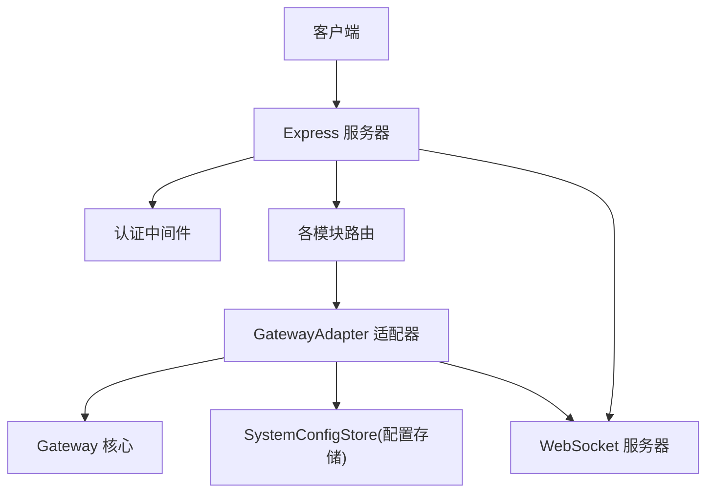
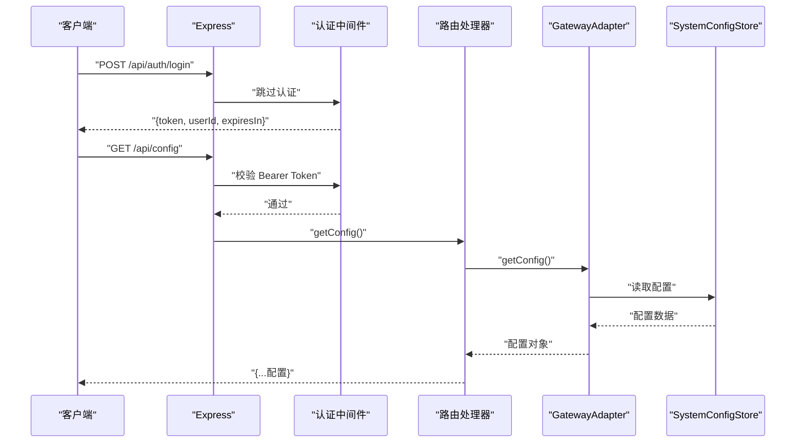
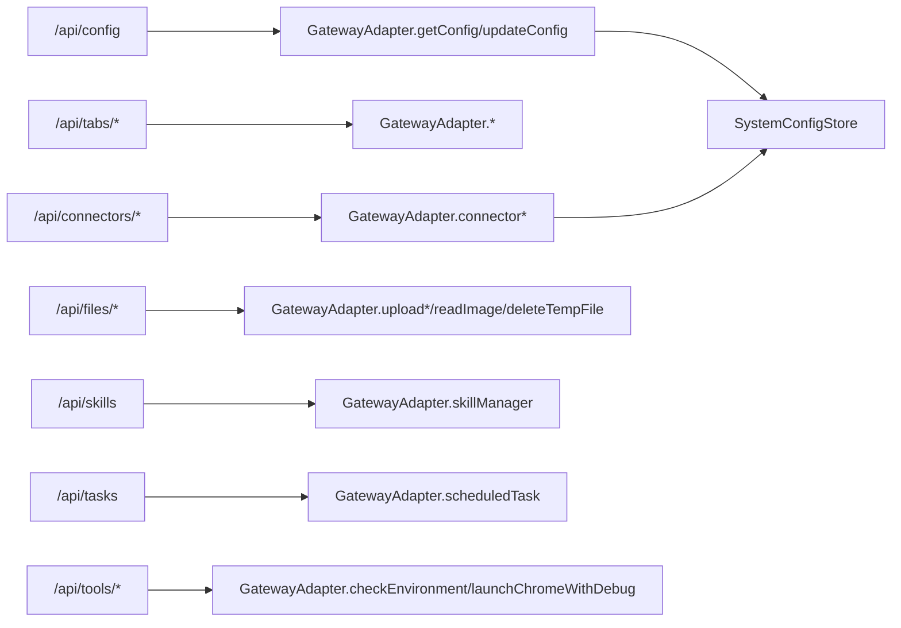

# RESTful API

<cite>
**本文引用的文件**
- [src/server/index.ts](file://src/server/index.ts)
- [src/server/middleware/auth.ts](file://src/server/middleware/auth.ts)
- [src/server/gateway-adapter.ts](file://src/server/gateway-adapter.ts)
- [src/server/routes/config.ts](file://src/server/routes/config.ts)
- [src/server/routes/tabs.ts](file://src/server/routes/tabs.ts)
- [src/server/routes/connectors.ts](file://src/server/routes/connectors.ts)
- [src/server/routes/files.ts](file://src/server/routes/files.ts)
- [src/server/routes/skills.ts](file://src/server/routes/skills.ts)
- [src/server/routes/tasks.ts](file://src/server/routes/tasks.ts)
- [src/server/routes/tools.ts](file://src/server/routes/tools.ts)
- [src/server/types.ts](file://src/server/types.ts)
- [src/shared/utils/error-handler.ts](file://src/shared/utils/error-handler.ts)
- [src/types/agent-tab.ts](file://src/types/agent-tab.ts)
- [src/types/message.ts](file://src/types/message.ts)
- [src/main/database/system-config-store.ts](file://src/main/database/system-config-store.ts)
</cite>

## 目录
1. [简介](#简介)
2. [项目结构](#项目结构)
3. [核心组件](#核心组件)
4. [架构总览](#架构总览)
5. [详细组件分析](#详细组件分析)
6. [依赖关系分析](#依赖关系分析)
7. [性能考量](#性能考量)
8. [故障排查指南](#故障排查指南)
9. [结论](#结论)
10. [附录](#附录)

## 简介
本文件为 DeepBot 的 RESTful API 详细文档，覆盖配置管理、连接器管理、文件操作、技能管理、标签页管理和任务管理等模块的全部 HTTP 端点。内容包括：
- URL 模式与请求方法
- 请求参数与响应格式
- 状态码说明与错误处理策略
- 认证与授权机制
- 各端点功能用途、参数约束与返回值语义
- 与网关适配器及底层实现的关系

## 项目结构
DeepBot Web 服务器基于 Express 提供 REST API，并通过 WebSocket 推送实时事件；所有受保护的 API 均需通过认证中间件校验。

图表来源
- [src/server/index.ts:85-96](file://src/server/index.ts#L85-L96)
- [src/server/middleware/auth.ts:22-45](file://src/server/middleware/auth.ts#L22-L45)
- [src/server/gateway-adapter.ts:45-58](file://src/server/gateway-adapter.ts#L45-L58)

章节来源
- [src/server/index.ts:33-128](file://src/server/index.ts#L33-L128)

## 核心组件
- 认证中间件：支持“无密码保护”和“密码+JWT”两种模式，登录接口返回 JWT Token。
- 网关适配器：将 API 层的请求映射到底层 Gateway 的能力，如消息收发、配置读写、连接器控制、文件上传等。
- 各模块路由：封装具体业务 API，统一错误处理与状态码返回。
- 配置存储：SystemConfigStore 负责模型、工作空间、连接器、工具等配置的持久化。

章节来源
- [src/server/middleware/auth.ts:12-91](file://src/server/middleware/auth.ts#L12-L91)
- [src/server/gateway-adapter.ts:268-337](file://src/server/gateway-adapter.ts#L268-L337)
- [src/main/database/system-config-store.ts:37-77](file://src/main/database/system-config-store.ts#L37-L77)

## 架构总览
以下序列图展示了典型请求流程：客户端发起受保护 API 请求 → 认证中间件校验 → 路由处理 → 网关适配器调用底层能力 → 返回 JSON 响应。

图表来源
- [src/server/index.ts:85-96](file://src/server/index.ts#L85-L96)
- [src/server/middleware/auth.ts:22-91](file://src/server/middleware/auth.ts#L22-L91)
- [src/server/routes/config.ts:17-24](file://src/server/routes/config.ts#L17-L24)
- [src/server/gateway-adapter.ts:268-285](file://src/server/gateway-adapter.ts#L268-L285)
- [src/main/database/system-config-store.ts:268-285](file://src/main/database/system-config-store.ts#L268-L285)

## 详细组件分析

### 认证与授权
- 登录接口
  - 方法与路径：POST /api/auth/login
  - 请求体：可选 password（若未设置 ACCESS_PASSWORD，则直接签发 Token）
  - 成功响应：{ token, userId, expiresIn }
  - 失败响应：401 密码错误；500 服务器错误
- 受保护 API
  - 中间件：authMiddleware
  - 校验规则：Authorization: Bearer <token>；若 ACCESS_PASSWORD 未设置则放行
  - 未认证：401
  - Token 无效/过期：401
- Token 生成与过期：使用 JWT_SECRET，过期时间默认 30 天

章节来源
- [src/server/middleware/auth.ts:12-91](file://src/server/middleware/auth.ts#L12-L91)
- [src/server/index.ts:85-86](file://src/server/index.ts#L85-L86)

### 配置管理
- 获取系统配置
  - 方法与路径：GET /api/config
  - 成功响应：系统配置对象（包含模型、工作空间、名称、连接器、图片生成、网页搜索等）
  - 失败响应：500 错误对象
- 更新系统配置
  - 方法与路径：PUT /api/config
  - 请求体：任意键值对（如 { model, workspace, names, connectors, imageGeneration, webSearch }）
  - 成功响应：{ success: true, message: "配置已更新" }
  - 失败响应：500 错误对象

章节来源
- [src/server/routes/config.ts:17-38](file://src/server/routes/config.ts#L17-L38)
- [src/server/gateway-adapter.ts:268-337](file://src/server/gateway-adapter.ts#L268-L337)
- [src/main/database/system-config-store.ts:268-337](file://src/main/database/system-config-store.ts#L268-L337)

### 标签页管理
- 获取所有标签页
  - 方法与路径：GET /api/tabs
  - 成功响应：{ tabs: AgentTab[] }
  - 失败响应：500 错误对象
- 创建新标签页
  - 方法与路径：POST /api/tabs
  - 请求体：{ title?: string }（可选）
  - 成功响应：{ tab: AgentTab }
  - 失败响应：500 错误对象
- 获取指定标签页
  - 方法与路径：GET /api/tabs/:tabId
  - 成功响应：{ tab: AgentTab }
  - 不存在：404 { error: "Tab 不存在" }
  - 失败响应：500 错误对象
- 关闭指定标签页
  - 方法与路径：DELETE /api/tabs/:tabId
  - 成功响应：{ success: true, message: "Tab 已关闭" }
  - 失败响应：500 错误对象
- 发送消息到指定标签页
  - 方法与路径：POST /api/tabs/:tabId/messages
  - 请求体：{ content: string, clearHistory?: boolean }
  - 成功响应：{ success: true }
  - 缺少 content：400
  - 失败响应：500 错误对象
- 获取标签页消息历史
  - 方法与路径：GET /api/tabs/:tabId/messages
  - 查询参数：limit（默认 50）、before（消息 ID）
  - 成功响应：{ messages: Message[], hasMore: boolean }
  - 失败响应：500 错误对象
- 停止生成
  - 方法与路径：POST /api/tabs/stop-generation
  - 请求体：{ sessionId?: string }
  - 成功响应：{ success: true }
  - 失败响应：500 错误对象

章节来源
- [src/server/routes/tabs.ts:17-125](file://src/server/routes/tabs.ts#L17-L125)
- [src/server/gateway-adapter.ts:201-266](file://src/server/gateway-adapter.ts#L201-L266)
- [src/types/agent-tab.ts:23-46](file://src/types/agent-tab.ts#L23-L46)
- [src/types/message.ts:49-70](file://src/types/message.ts#L49-L70)

### 连接器管理
- 获取所有连接器
  - 方法与路径：GET /api/connectors
  - 成功响应：{ success: true, connectors: [...] }
  - 失败响应：500 错误对象
- 获取连接器配置
  - 方法与路径：GET /api/connectors/:connectorId/config
  - 成功响应：{ success: true, config: object, enabled: boolean }
  - 失败响应：500 错误对象
- 保存连接器配置
  - 方法与路径：POST /api/connectors/:connectorId/config
  - 请求体：配置对象
  - 成功响应：{ success: true, message: "配置已保存" }
  - 失败响应：500 错误对象
- 启动连接器
  - 方法与路径：POST /api/connectors/:connectorId/start
  - 成功响应：{ success: true, message: "连接器已启动" }
  - 失败响应：500 错误对象
- 停止连接器
  - 方法与路径：POST /api/connectors/:connectorId/stop
  - 成功响应：{ success: true, message: "连接器已停止" }
  - 失败响应：500 错误对象
- 连接器健康检查
  - 方法与路径：GET /api/connectors/:connectorId/health
  - 成功响应：{ success: true, status: string, message: string }
  - 失败响应：500 错误对象
- 批准配对
  - 方法与路径：POST /api/connectors/pairing/approve
  - 请求体：{ pairingCode: string }
  - 成功响应：{ success: true, message: "配对已批准" }
  - 失败响应：500 错误对象
- 设置管理员配对
  - 方法与路径：POST /api/connectors/:connectorId/pairing/:userId/admin
  - 请求体：{ isAdmin: boolean }
  - 成功响应：{ success: true, message: "管理员权限已更新" }
  - 失败响应：500 错误对象
- 删除配对
  - 方法与路径：DELETE /api/connectors/:connectorId/pairing/:userId
  - 成功响应：{ success: true, message: "配对已删除" }
  - 失败响应：500 错误对象
- 获取所有配对记录
  - 方法与路径：GET /api/connectors/pairing
  - 成功响应：{ success: true, records: [...] }
  - 失败响应：500 错误对象

章节来源
- [src/server/routes/connectors.ts:16-211](file://src/server/routes/connectors.ts#L16-L211)
- [src/server/gateway-adapter.ts:367-527](file://src/server/gateway-adapter.ts#L367-L527)
- [src/main/database/system-config-store.ts:180-200](file://src/main/database/system-config-store.ts#L180-L200)

### 文件操作
- 上传文件
  - 方法与路径：POST /api/files/upload
  - 请求体：{ fileName: string, dataUrl: string, fileSize: number, fileType: string }
  - 成功响应：{ success: true, file: { id, path, name, size, type } }
  - 缺少参数：400
  - 失败响应：500 错误对象
- 上传图片
  - 方法与路径：POST /api/files/upload-image
  - 请求体：{ fileName: string, dataUrl: string, fileSize: number }
  - 成功响应：{ success: true, image: { id, path, name, size, dataUrl } }
  - 缺少参数：400
  - 失败响应：500 错误对象
- 读取图片
  - 方法与路径：GET /api/files/read-image
  - 查询参数：{ path: string }
  - 成功响应：{ success: true, data: "data:image/...;base64,..." }
  - 缺少参数：400
  - 失败响应：500 错误对象
- 删除临时文件
  - 方法与路径：DELETE /api/files/temp
  - 查询参数：{ path: string }
  - 成功响应：{ success: true }
  - 缺少参数：400
  - 失败响应：500 错误对象

章节来源
- [src/server/routes/files.ts:14-103](file://src/server/routes/files.ts#L14-L103)
- [src/server/gateway-adapter.ts:558-720](file://src/server/gateway-adapter.ts#L558-L720)

### 技能管理
- 统一入口
  - 方法与路径：POST /api/skills
  - 请求体：{ action: string, ...（根据 action 决定其他参数） }
  - 成功响应：{ success: true, ...（由具体动作决定） }
  - 缺少 action：400
  - 失败响应：500 错误对象

章节来源
- [src/server/routes/skills.ts:14-34](file://src/server/routes/skills.ts#L14-L34)
- [src/server/gateway-adapter.ts:725-754](file://src/server/gateway-adapter.ts#L725-L754)

### 任务管理（定时任务）
- 定时任务操作
  - 方法与路径：POST /api/tasks
  - 请求体：{ action: string, ...（根据 action 决定其他参数） }
  - 成功响应：{ success: true, ...（由具体动作决定） }
  - 失败响应：500 错误对象

章节来源
- [src/server/routes/tasks.ts:16-27](file://src/server/routes/tasks.ts#L16-L27)
- [src/server/gateway-adapter.ts:532-539](file://src/server/gateway-adapter.ts#L532-L539)

### 工具相关
- 环境检查
  - 方法与路径：POST /api/tools/environment-check
  - 请求体：{ action: 'check' | 'get_status' }
  - 成功响应：{ success: true, details?: object }
  - 失败响应：500 错误对象
- 启动 Chrome 调试（Web 模式不可用）
  - 方法与路径：POST /api/tools/launch-chrome
  - 请求体：{ port: number }
  - 成功响应：{ success: false, error: "Web 模式暂不支持..." }
  - 失败响应：500 错误对象

章节来源
- [src/server/routes/tools.ts:16-50](file://src/server/routes/tools.ts#L16-L50)
- [src/server/gateway-adapter.ts:342-362](file://src/server/gateway-adapter.ts#L342-L362)

## 依赖关系分析
- 路由到适配器：各路由将请求委托给 GatewayAdapter 的对应方法，后者再调用 Gateway 或 SystemConfigStore。
- 认证链路：受保护路由统一挂载 authMiddleware；登录接口独立处理。
- 错误处理：统一使用 getErrorMessage 包装错误消息；路由层捕获异常并返回 500。

图表来源
- [src/server/routes/config.ts:17-38](file://src/server/routes/config.ts#L17-L38)
- [src/server/routes/tabs.ts:17-125](file://src/server/routes/tabs.ts#L17-L125)
- [src/server/routes/connectors.ts:16-211](file://src/server/routes/connectors.ts#L16-L211)
- [src/server/routes/files.ts:14-103](file://src/server/routes/files.ts#L14-L103)
- [src/server/routes/skills.ts:14-34](file://src/server/routes/skills.ts#L14-L34)
- [src/server/routes/tasks.ts:16-27](file://src/server/routes/tasks.ts#L16-L27)
- [src/server/routes/tools.ts:16-50](file://src/server/routes/tools.ts#L16-L50)
- [src/server/gateway-adapter.ts:268-754](file://src/server/gateway-adapter.ts#L268-L754)
- [src/main/database/system-config-store.ts:37-77](file://src/main/database/system-config-store.ts#L37-L77)

## 性能考量
- 请求体大小限制：Express 默认解析上限为 700MB，满足大文件/图片上传场景。
- 分页与历史加载：消息历史接口支持 limit 与 before 分页，避免一次性传输过多数据。
- 文件上传策略：图片最大 5MB，文件最大 500MB；上传为临时文件，建议及时清理。
- WebSocket：与 REST API 并行提供，适合流式输出与实时事件推送。

章节来源
- [src/server/index.ts:64-65](file://src/server/index.ts#L64-L65)
- [src/server/gateway-adapter.ts:239-266](file://src/server/gateway-adapter.ts#L239-L266)
- [src/server/gateway-adapter.ts:630-643](file://src/server/gateway-adapter.ts#L630-L643)

## 故障排查指南
- 400 错误（请求参数缺失/非法）
  - 示例：上传/读取/删除文件缺少 path 或 fileName；发送消息缺少 content；技能/任务缺少 action。
- 401 错误（未认证/Token 无效）
  - 检查 Authorization 头是否为 Bearer Token；确认 ACCESS_PASSWORD 与 JWT_SECRET 配置。
- 404 错误（资源不存在）
  - 标签页 ID 不存在。
- 500 错误（服务器内部错误）
  - 统一包装为 { error: "..." }；查看服务端日志定位具体异常。
- 常见问题
  - 图片读取失败：确保路径位于允许范围内（工作目录及其子目录）。
  - 连接器健康检查失败：检查连接器实现与网络连通性。
  - Web 模式不支持 Chrome 调试：请使用 Electron 版本。

章节来源
- [src/server/routes/files.ts:18-33](file://src/server/routes/files.ts#L18-L33)
- [src/server/routes/tabs.ts:47-58](file://src/server/routes/tabs.ts#L47-L58)
- [src/server/middleware/auth.ts:30-44](file://src/server/middleware/auth.ts#L30-L44)
- [src/shared/utils/error-handler.ts:8-13](file://src/shared/utils/error-handler.ts#L8-L13)
- [src/server/gateway-adapter.ts:645-682](file://src/server/gateway-adapter.ts#L645-L682)

## 结论
本 RESTful API 以模块化路由组织，统一通过 GatewayAdapter 调用底层能力，并结合 SystemConfigStore 实现配置持久化。认证采用可选的密码保护与 JWT 机制，错误处理标准化，便于集成与扩展。建议在生产环境中设置 ACCESS_PASSWORD 与 JWT_SECRET，并合理规划文件上传与消息历史的分页策略。

## 附录

### 端点一览与状态码
- 认证
  - POST /api/auth/login → 200；401（密码错误）
- 配置
  - GET /api/config → 200；500
  - PUT /api/config → 200；500
- 标签页
  - GET /api/tabs → 200；500
  - POST /api/tabs → 200；500
  - GET /api/tabs/:tabId → 200；404；500
  - DELETE /api/tabs/:tabId → 200；500
  - POST /api/tabs/:tabId/messages → 200；400；500
  - GET /api/tabs/:tabId/messages → 200；500
  - POST /api/tabs/stop-generation → 200；500
- 连接器
  - GET /api/connectors → 200；500
  - GET /api/connectors/:connectorId/config → 200；500
  - POST /api/connectors/:connectorId/config → 200；500
  - POST /api/connectors/:connectorId/start → 200；500
  - POST /api/connectors/:connectorId/stop → 200；500
  - GET /api/connectors/:connectorId/health → 200；500
  - POST /api/connectors/pairing/approve → 200；500
  - POST /api/connectors/:connectorId/pairing/:userId/admin → 200；500
  - DELETE /api/connectors/:connectorId/pairing/:userId → 200；500
  - GET /api/connectors/pairing → 200；500
- 文件
  - POST /api/files/upload → 200；400；500
  - POST /api/files/upload-image → 200；400；500
  - GET /api/files/read-image → 200；400；500
  - DELETE /api/files/temp → 200；400；500
- 技能
  - POST /api/skills → 200；400；500
- 任务
  - POST /api/tasks → 200；500
- 工具
  - POST /api/tools/environment-check → 200；500
  - POST /api/tools/launch-chrome → 200；500

### 请求/响应示例（路径指引）
- 登录获取 Token
  - 请求：POST /api/auth/login，Body: { password?: string }
  - 响应：{ token, userId, expiresIn }
  - 参考：[src/server/middleware/auth.ts:57-90](file://src/server/middleware/auth.ts#L57-L90)
- 获取配置
  - 请求：GET /api/config
  - 响应：{ model, workspace, names, connectors, imageGeneration, webSearch, isDocker }
  - 参考：[src/server/routes/config.ts:17-24](file://src/server/routes/config.ts#L17-L24)，[src/server/gateway-adapter.ts:268-285](file://src/server/gateway-adapter.ts#L268-L285)
- 发送消息到标签页
  - 请求：POST /api/tabs/:tabId/messages，Body: { content, clearHistory? }
  - 响应：{ success: true }
  - 参考：[src/server/routes/tabs.ts:79-94](file://src/server/routes/tabs.ts#L79-L94)
- 上传图片
  - 请求：POST /api/files/upload-image，Body: { fileName, dataUrl, fileSize }
  - 响应：{ success: true, image: { id, path, name, size, dataUrl } }
  - 参考：[src/server/routes/files.ts:37-57](file://src/server/routes/files.ts#L37-L57)
- 技能管理
  - 请求：POST /api/skills，Body: { action, ... }
  - 响应：{ success: true, ... }
  - 参考：[src/server/routes/skills.ts:14-34](file://src/server/routes/skills.ts#L14-L34)