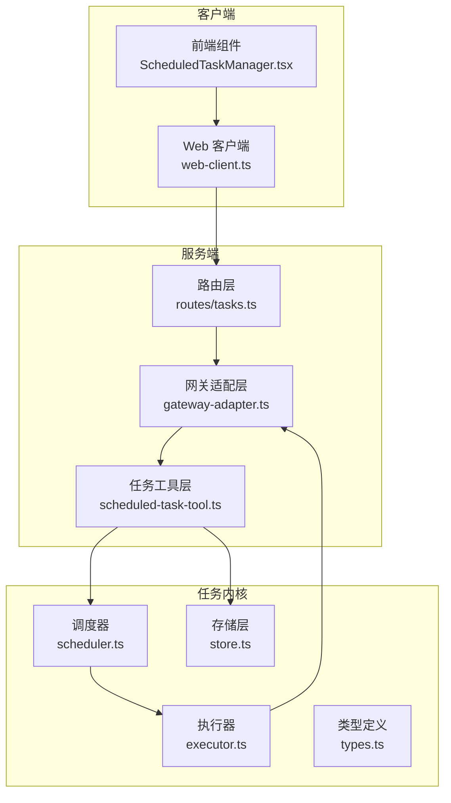
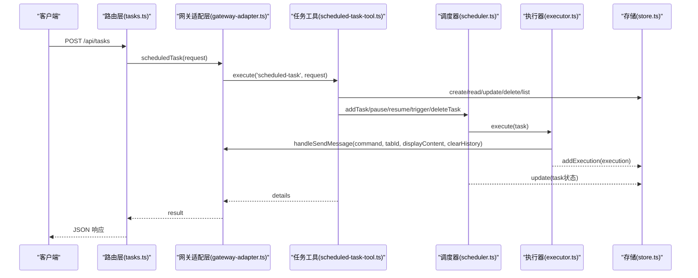
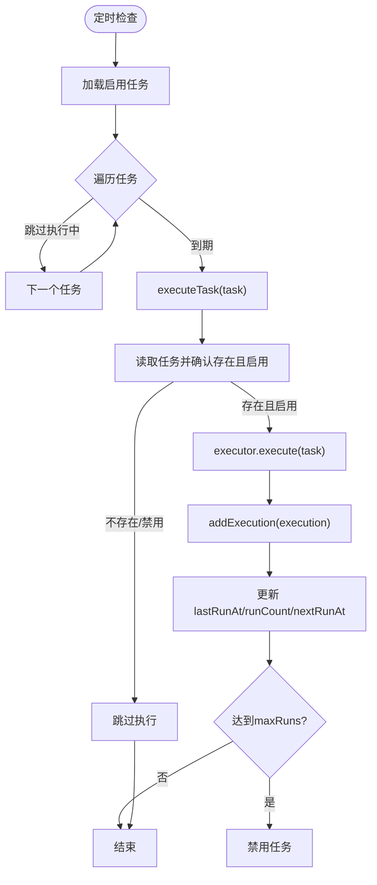
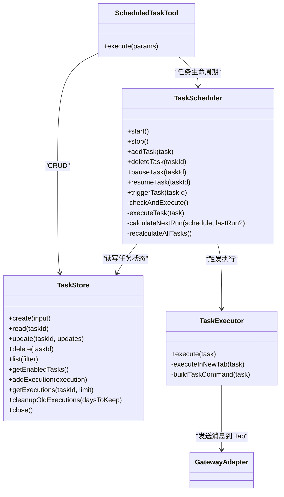

# 任务管理 API

<cite>
**本文引用的文件**
- [tasks.ts](file://src/server/routes/tasks.ts)
- [scheduled-task-tool.ts](file://src/main/tools/scheduled-task-tool.ts)
- [index.ts](file://src/main/scheduled-tasks/index.ts)
- [types.ts](file://src/main/scheduled-tasks/types.ts)
- [store.ts](file://src/main/scheduled-tasks/store.ts)
- [scheduler.ts](file://src/main/scheduled-tasks/scheduler.ts)
- [executor.ts](file://src/main/scheduled-tasks/executor.ts)
- [gateway-adapter.ts](file://src/server/gateway-adapter.ts)
- [web-client.ts](file://src/renderer/api/web-client.ts)
- [ScheduledTaskManager.tsx](file://src/renderer/components/ScheduledTaskManager.tsx)
</cite>

## 目录
1. [简介](#简介)
2. [项目结构](#项目结构)
3. [核心组件](#核心组件)
4. [架构总览](#架构总览)
5. [详细组件分析](#详细组件分析)
6. [依赖关系分析](#依赖关系分析)
7. [性能考量](#性能考量)
8. [故障排查指南](#故障排查指南)
9. [结论](#结论)
10. [附录](#附录)

## 简介
本文件为“任务管理 API”的权威技术文档，覆盖定时任务的创建、查询、更新、删除、暂停/恢复、手动触发、执行历史查询等能力，并详细说明 Cron 表达式解析、任务调度与执行状态监控、任务配置请求格式、错误重试机制、优先级与资源限制、性能优化策略等内容。读者可据此对接 Web 客户端或服务端，实现稳定的定时任务编排与运维。

## 项目结构
定时任务系统由“Web API 路由层”、“网关适配层”、“任务工具层”和“底层调度/存储/执行层”四部分组成，形成清晰的分层架构，便于扩展与维护。

图表来源
- [tasks.ts:1-33](file://src/server/routes/tasks.ts#L1-L33)
- [gateway-adapter.ts:532-539](file://src/server/gateway-adapter.ts#L532-L539)
- [scheduled-task-tool.ts:128-494](file://src/main/tools/scheduled-task-tool.ts#L128-L494)
- [scheduler.ts:12-322](file://src/main/scheduled-tasks/scheduler.ts#L12-L322)
- [executor.ts:17-170](file://src/main/scheduled-tasks/executor.ts#L17-L170)
- [store.ts:23-364](file://src/main/scheduled-tasks/store.ts#L23-L364)
- [types.ts:5-86](file://src/main/scheduled-tasks/types.ts#L5-L86)

章节来源
- [tasks.ts:1-33](file://src/server/routes/tasks.ts#L1-L33)
- [gateway-adapter.ts:532-539](file://src/server/gateway-adapter.ts#L532-L539)
- [scheduled-task-tool.ts:128-494](file://src/main/tools/scheduled-task-tool.ts#L128-L494)
- [scheduler.ts:12-322](file://src/main/scheduled-tasks/scheduler.ts#L12-L322)
- [executor.ts:17-170](file://src/main/scheduled-tasks/executor.ts#L17-L170)
- [store.ts:23-364](file://src/main/scheduled-tasks/store.ts#L23-L364)
- [types.ts:5-86](file://src/main/scheduled-tasks/types.ts#L5-L86)

## 核心组件
- 路由层：提供统一的 HTTP 端点，接收任务操作请求并交由网关适配层处理。
- 网关适配层：将 Web API 的概念映射到 Gateway 接口，负责消息转发、事件广播与工具调用。
- 任务工具层：封装任务生命周期操作（创建、列表、更新、删除、暂停/恢复、手动触发、历史查询），并提供自然语言调度解析与校验。
- 调度器：基于 SQLite 存储的任务状态，按秒级轮询检查到期任务并触发执行。
- 执行器：在专用 Tab 中执行任务，支持等待窗口空闲、发送命令、记录执行结果与错误。
- 存储层：SQLite 持久化任务与执行记录，提供增删改查、索引与历史清理。

章节来源
- [tasks.ts:12-31](file://src/server/routes/tasks.ts#L12-L31)
- [gateway-adapter.ts:532-539](file://src/server/gateway-adapter.ts#L532-L539)
- [scheduled-task-tool.ts:128-494](file://src/main/tools/scheduled-task-tool.ts#L128-L494)
- [scheduler.ts:12-322](file://src/main/scheduled-tasks/scheduler.ts#L12-L322)
- [executor.ts:17-170](file://src/main/scheduled-tasks/executor.ts#L17-L170)
- [store.ts:23-364](file://src/main/scheduled-tasks/store.ts#L23-L364)

## 架构总览
定时任务的请求从 Web 客户端经路由层进入网关适配层，再由任务工具层执行具体操作，最终通过调度器与执行器完成任务的调度与执行，并持久化到 SQLite。

图表来源
- [tasks.ts:16-29](file://src/server/routes/tasks.ts#L16-L29)
- [gateway-adapter.ts:532-539](file://src/server/gateway-adapter.ts#L532-L539)
- [scheduled-task-tool.ts:171-492](file://src/main/tools/scheduled-task-tool.ts#L171-L492)
- [scheduler.ts:118-240](file://src/main/scheduled-tasks/scheduler.ts#L118-L240)
- [executor.ts:86-153](file://src/main/scheduled-tasks/executor.ts#L86-L153)
- [store.ts:133-241](file://src/main/scheduled-tasks/store.ts#L133-L241)

## 详细组件分析

### API 端点与请求格式
- 端点：POST /api/tasks
- 请求体字段（通用）：action（必填，字符串，见下方枚举）
- 其他字段根据 action 动态决定（详见“请求参数与响应”）

章节来源
- [tasks.ts:12-31](file://src/server/routes/tasks.ts#L12-L31)
- [gateway-adapter.ts:532-539](file://src/server/gateway-adapter.ts#L532-L539)

### 请求参数与响应
- action: 'create' | 'list' | 'update' | 'updateSchedule' | 'delete' | 'pause' | 'resume' | 'trigger' | 'history'
- create
  - name: 任务名称（字符串）
  - description: 任务描述（字符串）
  - schedule: 调度配置（见下节）
  - 响应：success、task（含 id、name、description、schedule、enabled、createdAt、nextRunAt）、message
- list
  - enabled: 可选布尔，仅列出启用的任务
  - 响应：success、tasks（数组，含 id、name、description、schedule、enabled、createdAt、lastRunAt、nextRunAt、runCount）、count、message
- update
  - taskId: 任务 ID（字符串）
  - description: 新的任务描述（字符串）
  - 响应：success、message
- updateSchedule
  - taskId: 任务 ID（字符串）
  - scheduleText: 自然语言调度描述（字符串，如“每隔10秒执行一次，最多100次”、“每天早上9点”、“Cron表达式：0 9 * * *”）
  - 响应：success、message
- delete
  - taskId: 任务 ID（字符串）
  - 响应：success、message
- pause
  - taskId: 任务 ID（字符串）
  - 响应：success、message
- resume
  - taskId: 任务 ID（字符串）
  - 响应：success、message
- trigger
  - taskId: 任务 ID（字符串）
  - 响应：success、message
- history
  - taskId: 任务 ID（字符串）
  - limit: 可选数字，历史记录条数，默认10
  - 响应：success、task（含 id、name、runCount）、executions（数组，含 id、startTime、endTime、duration、status、result、error）、count、message

章节来源
- [scheduled-task-tool.ts:134-169](file://src/main/tools/scheduled-task-tool.ts#L134-L169)
- [scheduled-task-tool.ts:180-463](file://src/main/tools/scheduled-task-tool.ts#L180-L463)

### 调度配置与 Cron 表达式
- 调度类型：once（一次性）、interval（周期性）、cron（Cron 表达式）
- once
  - executeAt: 执行时间戳（毫秒）
  - maxRuns: 可选，最大执行次数
- interval
  - intervalMs: 间隔毫秒数（最小 10 秒）
  - startAt: 可选，开始时间戳
  - maxRuns: 可选，最大执行次数
- cron
  - cronExpr: Cron 表达式（如 "0 9 * * *"）
  - timezone: 可选，时区（默认 Asia/Shanghai）
  - maxRuns: 可选，最大执行次数
- 自然语言解析
  - 支持“每隔X秒/分钟/小时”、“每天X点”、“Cron表达式：...”等格式
  - 可选“最多N次”限制

章节来源
- [types.ts:8-24](file://src/main/scheduled-tasks/types.ts#L8-L24)
- [scheduled-task-tool.ts:499-538](file://src/main/tools/scheduled-task-tool.ts#L499-L538)
- [scheduled-task-tool.ts:550-615](file://src/main/tools/scheduled-task-tool.ts#L550-L615)

### 任务生命周期与状态
- 创建：生成任务 ID，写入数据库，计算下次执行时间并存入
- 查询：支持按启用状态与调度类型过滤
- 更新：可更新描述、调度配置
- 删除：移除任务并关闭对应任务 Tab
- 暂停：禁用任务，重置对应 Tab 的 AgentRuntime
- 恢复：启用任务并重新计算下次执行时间，重置执行计数
- 手动触发：异步触发一次执行
- 历史：查询最近执行记录，支持 limit 控制

章节来源
- [store.ts:133-241](file://src/main/scheduled-tasks/store.ts#L133-L241)
- [store.ts:302-323](file://src/main/scheduled-tasks/store.ts#L302-L323)
- [scheduled-task-tool.ts:180-463](file://src/main/tools/scheduled-task-tool.ts#L180-L463)
- [scheduler.ts:67-113](file://src/main/scheduled-tasks/scheduler.ts#L67-L113)

### 调度与执行流程
- 调度器
  - 启动后计算所有任务的下次执行时间
  - 每秒轮询检查到期任务
  - 并发保护：同一任务执行期间跳过重复触发
  - 达到 maxRuns 后自动禁用任务
  - 一次性任务执行完成后自动禁用
- 执行器
  - 获取或创建任务专属 Tab
  - 等待 Tab 空闲（最多 5 分钟）
  - 发送命令到 Tab 执行，显示原始任务内容
  - 记录执行结果或错误，生成执行记录

图表来源
- [scheduler.ts:131-240](file://src/main/scheduled-tasks/scheduler.ts#L131-L240)
- [executor.ts:21-79](file://src/main/scheduled-tasks/executor.ts#L21-L79)
- [store.ts:278-297](file://src/main/scheduled-tasks/store.ts#L278-L297)

章节来源
- [scheduler.ts:12-322](file://src/main/scheduled-tasks/scheduler.ts#L12-L322)
- [executor.ts:17-170](file://src/main/scheduled-tasks/executor.ts#L17-L170)
- [store.ts:23-364](file://src/main/scheduled-tasks/store.ts#L23-L364)

### 数据模型与持久化
- 任务表（tasks）
  - id、name、description、schedule_type、schedule_data、enabled、created_at、updated_at、last_run_at、next_run_at、run_count
- 执行记录表（executions）
  - id、task_id、task_name、start_time、end_time、duration、status、result、error
- 索引
  - idx_tasks_enabled、idx_tasks_next_run、idx_executions_task_id
- 历史清理
  - 可按天数清理旧记录，默认保留 30 天

章节来源
- [store.ts:88-128](file://src/main/scheduled-tasks/store.ts#L88-L128)
- [store.ts:328-337](file://src/main/scheduled-tasks/store.ts#L328-L337)

### 错误重试与异常处理
- 调度器启动
  - 使用重试工具最多 3 次，延迟 1 秒，最终失败静默处理
- 执行等待
  - 等待 Tab 空闲最长 5 分钟，超时抛错
- Cron 表达式
  - 解析失败时记录错误并返回 null（下次不再触发）
- 通用错误
  - 工具层捕获异常，返回 details.error

章节来源
- [scheduled-task-tool.ts:65-85](file://src/main/tools/scheduled-task-tool.ts#L65-L85)
- [executor.ts:104-129](file://src/main/scheduled-tasks/executor.ts#L104-L129)
- [scheduler.ts:284-296](file://src/main/scheduled-tasks/scheduler.ts#L284-L296)
- [scheduled-task-tool.ts:478-491](file://src/main/tools/scheduled-task-tool.ts#L478-L491)

### 优先级管理、资源限制与性能优化
- 优先级
  - 通过调度类型与 maxRuns 控制任务优先级与执行频次
- 资源限制
  - 单机最多 10 个定时任务
  - interval 最小间隔 10 秒
  - 执行等待最长 5 分钟
- 性能优化
  - SQLite WAL 模式提升并发写入性能
  - 每秒轮询，避免高频检查
  - 并发执行保护：同一任务执行中跳过重复触发
  - 历史记录定期清理，避免表膨胀

章节来源
- [scheduled-task-tool.ts:51-51](file://src/main/tools/scheduled-task-tool.ts#L51-L51)
- [scheduler.ts:17-18](file://src/main/scheduled-tasks/scheduler.ts#L17-L18)
- [executor.ts:104-129](file://src/main/scheduled-tasks/executor.ts#L104-L129)
- [store.ts:69-69](file://src/main/scheduled-tasks/store.ts#L69-L69)
- [store.ts:328-337](file://src/main/scheduled-tasks/store.ts#L328-L337)

## 依赖关系分析

图表来源
- [store.ts:23-364](file://src/main/scheduled-tasks/store.ts#L23-L364)
- [scheduler.ts:12-322](file://src/main/scheduled-tasks/scheduler.ts#L12-L322)
- [executor.ts:17-170](file://src/main/scheduled-tasks/executor.ts#L17-L170)
- [scheduled-task-tool.ts:128-494](file://src/main/tools/scheduled-task-tool.ts#L128-L494)

章节来源
- [index.ts:5-8](file://src/main/scheduled-tasks/index.ts#L5-L8)
- [types.ts:5-86](file://src/main/scheduled-tasks/types.ts#L5-L86)

## 性能考量
- 存储层
  - 使用 WAL 模式，减少写入竞争
  - 索引覆盖 enabled 与 next_run_at，加速查询
- 调度层
  - 每秒检查一次，兼顾实时性与 CPU 占用
  - 并发执行保护，避免重复触发
- 执行层
  - 等待窗口空闲最多 5 分钟，防止长时间阻塞
  - 执行记录异步落库，不阻塞调度循环
- 历史清理
  - 默认保留 30 天，避免表过大影响性能

章节来源
- [store.ts:69-128](file://src/main/scheduled-tasks/store.ts#L69-L128)
- [scheduler.ts:17-44](file://src/main/scheduled-tasks/scheduler.ts#L17-L44)
- [executor.ts:104-129](file://src/main/scheduled-tasks/executor.ts#L104-L129)
- [store.ts:328-337](file://src/main/scheduled-tasks/store.ts#L328-L337)

## 故障排查指南
- 调度器启动失败
  - 观察启动重试日志，最多 3 次，最终失败会静默处理
  - 检查数据库初始化是否完成
- 任务无法执行
  - 检查任务是否启用
  - 检查 Cron 表达式是否有效
  - 检查执行等待是否超时（Tab 长时间占用）
- 执行记录缺失
  - 确认执行器是否成功落库
  - 检查历史清理策略是否过早清理
- 前端交互问题
  - 确认 /api/tasks 路由可达
  - 检查认证与 Token 有效性

章节来源
- [scheduled-task-tool.ts:65-85](file://src/main/tools/scheduled-task-tool.ts#L65-L85)
- [scheduler.ts:284-296](file://src/main/scheduled-tasks/scheduler.ts#L284-L296)
- [executor.ts:104-129](file://src/main/scheduled-tasks/executor.ts#L104-L129)
- [store.ts:328-337](file://src/main/scheduled-tasks/store.ts#L328-L337)
- [web-client.ts:37-68](file://src/renderer/api/web-client.ts#L37-L68)

## 结论
本任务管理 API 提供了从创建到执行、从查询到历史的完整闭环，具备良好的扩展性与稳定性。通过 SQLite 持久化、WAL 模式、索引与定期清理等手段保障性能；通过调度器与执行器的协作实现高可靠的任务执行；通过自然语言调度解析与严格的参数校验提升易用性。建议在生产环境中结合业务需求合理设置 maxRuns、interval 与 Cron 表达式，并关注历史清理策略与资源限制。

## 附录

### API 端点一览
- POST /api/tasks
  - 用途：统一的任务操作入口（创建、列表、更新、删除、暂停/恢复、手动触发、历史查询）
  - 请求体：action + 对应参数
  - 响应：success + 业务数据或错误详情

章节来源
- [tasks.ts:12-31](file://src/server/routes/tasks.ts#L12-L31)
- [gateway-adapter.ts:532-539](file://src/server/gateway-adapter.ts#L532-L539)

### 前端集成要点
- 使用 web-client.ts 的 post 方法调用 /api/tasks
- ScheduledTaskManager.tsx 展示任务列表、编辑内容与调度、暂停/恢复、立即执行、删除与历史查询
- 建议每 30 秒刷新一次启用中的任务列表，降低频繁轮询压力

章节来源
- [web-client.ts:213-218](file://src/renderer/api/web-client.ts#L213-L218)
- [ScheduledTaskManager.tsx:50-66](file://src/renderer/components/ScheduledTaskManager.tsx#L50-L66)
- [ScheduledTaskManager.tsx:254-272](file://src/renderer/components/ScheduledTaskManager.tsx#L254-L272)