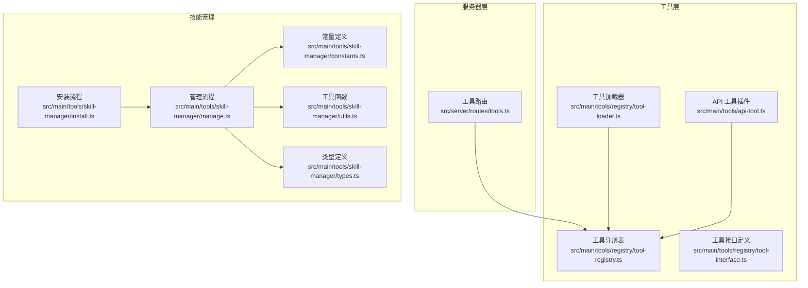
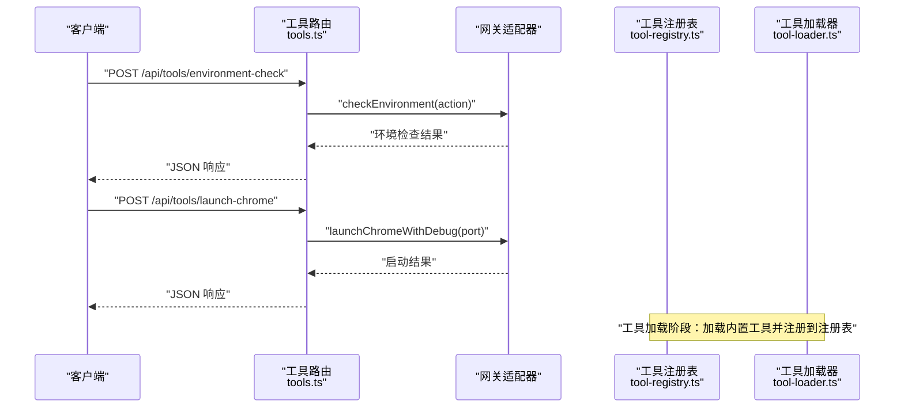
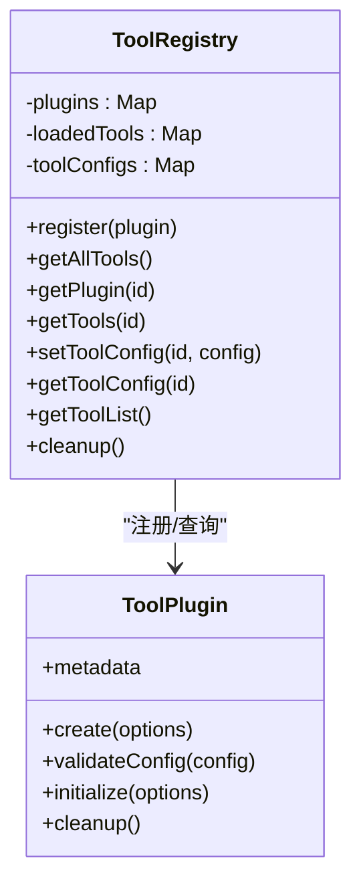
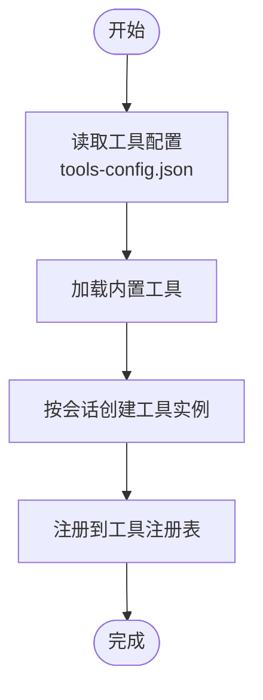
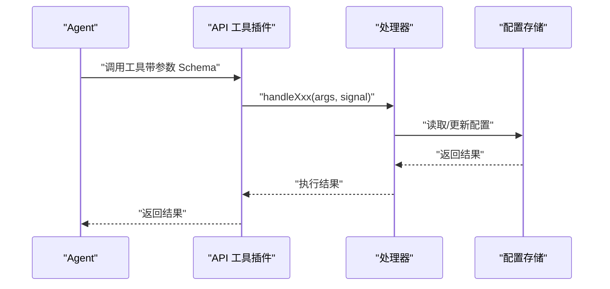
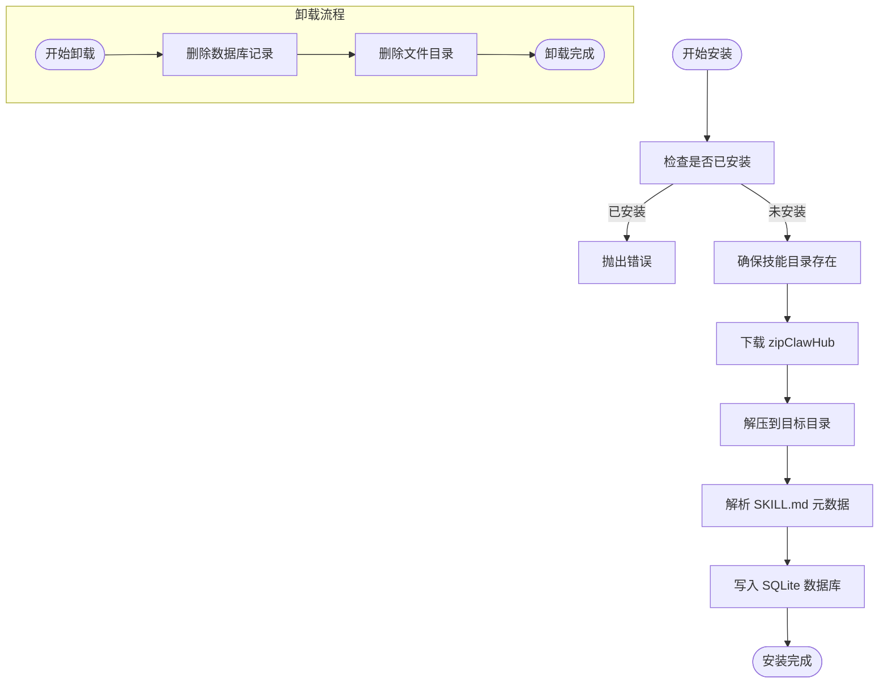
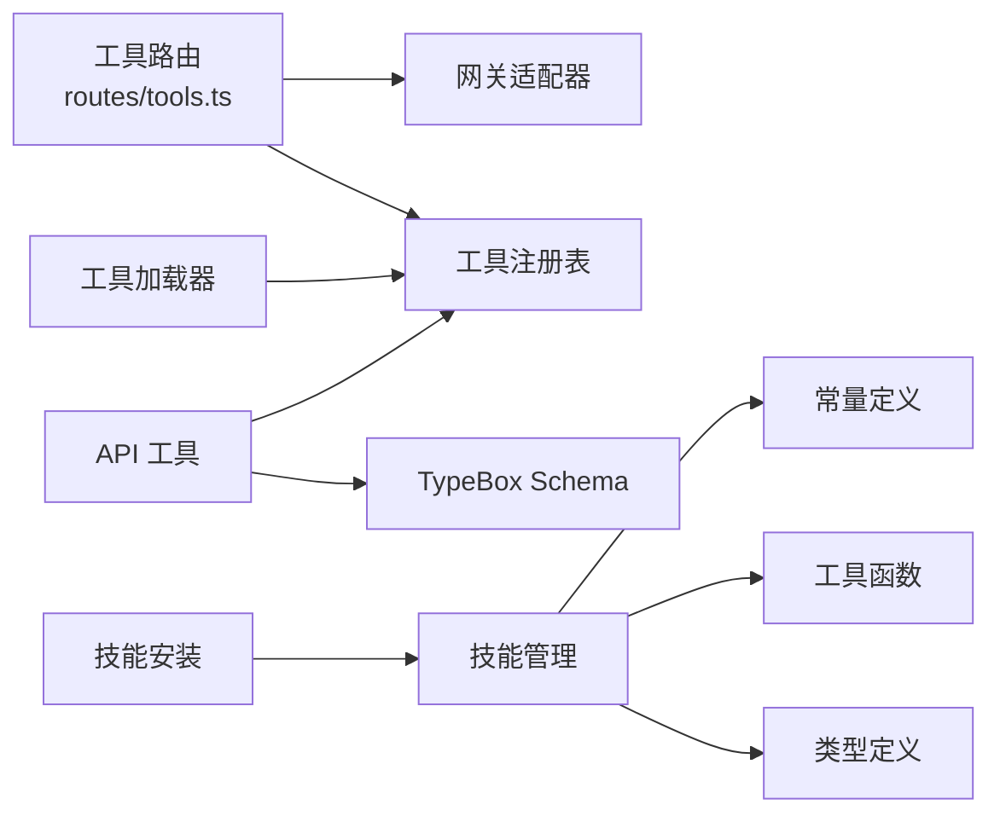

# 工具管理 API

<cite>
**本文引用的文件**
- [src/server/routes/tools.ts](file://src/server/routes/tools.ts)
- [src/main/tools/registry/tool-registry.ts](file://src/main/tools/registry/tool-registry.ts)
- [src/main/tools/registry/tool-loader.ts](file://src/main/tools/registry/tool-loader.ts)
- [src/main/tools/registry/tool-interface.ts](file://src/main/tools/registry/tool-interface.ts)
- [src/main/tools/skill-manager/install.ts](file://src/main/tools/skill-manager/install.ts)
- [src/main/tools/skill-manager/manage.ts](file://src/main/tools/skill-manager/manage.ts)
- [src/main/tools/skill-manager/constants.ts](file://src/main/tools/skill-manager/constants.ts)
- [src/main/tools/skill-manager/utils.ts](file://src/main/tools/skill-manager/utils.ts)
- [src/main/tools/skill-manager/types.ts](file://src/main/tools/skill-manager/types.ts)
- [src/main/tools/api-tool.ts](file://src/main/tools/api-tool.ts)
</cite>

## 目录
1. [简介](#简介)
2. [项目结构](#项目结构)
3. [核心组件](#核心组件)
4. [架构总览](#架构总览)
5. [详细组件分析](#详细组件分析)
6. [依赖关系分析](#依赖关系分析)
7. [性能考量](#性能考量)
8. [故障排查指南](#故障排查指南)
9. [结论](#结论)
10. [附录](#附录)

## 简介
本文件为“工具管理 API”的权威技术文档，面向后端工程师与集成开发者，系统性梳理工具的安装、卸载、配置与调用的 HTTP 接口与内部机制。重点覆盖：
- 工具注册、发现与版本管理的 API 接口
- 工具配置的请求格式、参数校验与执行权限控制
- 工具执行的异步调用、进度查询与结果获取的流程
- 工具的沙箱执行、资源隔离与安全防护机制

说明：当前仓库中工具的 HTTP API 主要集中在工具路由层与工具插件层，技能（Skill）的安装/卸载/管理通过独立模块实现，API 工具用于系统配置的查询与设置。

## 项目结构
工具管理相关代码主要分布在以下模块：
- 服务器路由层：提供 HTTP 接口，转发到网关适配器
- 工具注册与加载：负责工具注册、发现、配置与生命周期管理
- 技能管理：提供技能的安装、卸载、列表与详情查询
- API 工具：提供系统配置的查询与设置能力

图表来源
- [src/server/routes/tools.ts:1-57](file://src/server/routes/tools.ts#L1-L57)
- [src/main/tools/registry/tool-registry.ts:1-328](file://src/main/tools/registry/tool-registry.ts#L1-L328)
- [src/main/tools/registry/tool-loader.ts:1-312](file://src/main/tools/registry/tool-loader.ts#L1-L312)
- [src/main/tools/registry/tool-interface.ts:1-152](file://src/main/tools/registry/tool-interface.ts#L1-L152)
- [src/main/tools/api-tool.ts:1-220](file://src/main/tools/api-tool.ts#L1-L220)
- [src/main/tools/skill-manager/install.ts:1-150](file://src/main/tools/skill-manager/install.ts#L1-L150)
- [src/main/tools/skill-manager/manage.ts:1-281](file://src/main/tools/skill-manager/manage.ts#L1-L281)
- [src/main/tools/skill-manager/constants.ts:1-35](file://src/main/tools/skill-manager/constants.ts#L1-L35)
- [src/main/tools/skill-manager/utils.ts:1-92](file://src/main/tools/skill-manager/utils.ts#L1-L92)
- [src/main/tools/skill-manager/types.ts:1-84](file://src/main/tools/skill-manager/types.ts#L1-L84)

章节来源
- [src/server/routes/tools.ts:1-57](file://src/server/routes/tools.ts#L1-L57)
- [src/main/tools/registry/tool-registry.ts:1-328](file://src/main/tools/registry/tool-registry.ts#L1-L328)
- [src/main/tools/registry/tool-loader.ts:1-312](file://src/main/tools/registry/tool-loader.ts#L1-L312)
- [src/main/tools/registry/tool-interface.ts:1-152](file://src/main/tools/registry/tool-interface.ts#L1-L152)
- [src/main/tools/api-tool.ts:1-220](file://src/main/tools/api-tool.ts#L1-L220)
- [src/main/tools/skill-manager/install.ts:1-150](file://src/main/tools/skill-manager/install.ts#L1-L150)
- [src/main/tools/skill-manager/manage.ts:1-281](file://src/main/tools/skill-manager/manage.ts#L1-L281)
- [src/main/tools/skill-manager/constants.ts:1-35](file://src/main/tools/skill-manager/constants.ts#L1-L35)
- [src/main/tools/skill-manager/utils.ts:1-92](file://src/main/tools/skill-manager/utils.ts#L1-L92)
- [src/main/tools/skill-manager/types.ts:1-84](file://src/main/tools/skill-manager/types.ts#L1-L84)

## 核心组件
- 工具路由层：提供环境检查与调试启动等工具相关 HTTP 接口，内部委托给网关适配器执行
- 工具注册表：集中管理工具插件、工具实例与配置，提供查询、启用/禁用与清理能力
- 工具加载器：负责加载内置工具、读取工具配置，并按会话维度创建工具实例
- API 工具：提供系统配置的查询与设置能力，包含严格的只读/写操作区分与参数校验
- 技能管理：提供技能的安装、卸载、列表、详情与环境变量读写能力，基于 SQLite 数据库存储

章节来源
- [src/server/routes/tools.ts:9-56](file://src/server/routes/tools.ts#L9-L56)
- [src/main/tools/registry/tool-registry.ts:36-310](file://src/main/tools/registry/tool-registry.ts#L36-L310)
- [src/main/tools/registry/tool-loader.ts:40-311](file://src/main/tools/registry/tool-loader.ts#L40-L311)
- [src/main/tools/api-tool.ts:25-219](file://src/main/tools/api-tool.ts#L25-L219)
- [src/main/tools/skill-manager/install.ts:22-80](file://src/main/tools/skill-manager/install.ts#L22-L80)
- [src/main/tools/skill-manager/manage.ts:17-150](file://src/main/tools/skill-manager/manage.ts#L17-L150)

## 架构总览
工具管理的端到端调用链如下：

图表来源
- [src/server/routes/tools.ts:16-50](file://src/server/routes/tools.ts#L16-L50)
- [src/main/tools/registry/tool-registry.ts:46-55](file://src/main/tools/registry/tool-registry.ts#L46-L55)
- [src/main/tools/registry/tool-loader.ts:57-71](file://src/main/tools/registry/tool-loader.ts#L57-L71)

## 详细组件分析

### 工具路由与 HTTP 接口
- 环境检查
  - 方法与路径：POST /api/tools/environment-check
  - 请求体字段：action（字符串，具体语义由网关适配器定义）
  - 响应：成功返回检查结果对象；失败返回包含错误信息的 JSON
- 启动 Chrome 调试
  - 方法与路径：POST /api/tools/launch-chrome
  - 请求体字段：port（数字，调试端口）
  - 响应：成功返回启动结果对象；失败返回包含错误信息的 JSON

章节来源
- [src/server/routes/tools.ts:12-53](file://src/server/routes/tools.ts#L12-L53)

### 工具注册与发现
- 注册机制
  - 工具通过 ToolPlugin 插件形式注册，注册表维护插件映射与工具实例映射
  - 若重复注册同一 ID，将覆盖并输出警告
- 发现与查询
  - 提供获取所有已加载工具、获取插件、获取工具实例、获取工具列表等方法
  - 工具列表包含 ID、名称、描述、版本、启用状态与分类等信息
- 生命周期
  - 支持插件初始化与清理，便于资源回收

图表来源
- [src/main/tools/registry/tool-registry.ts:36-310](file://src/main/tools/registry/tool-registry.ts#L36-L310)
- [src/main/tools/registry/tool-interface.ts:101-134](file://src/main/tools/registry/tool-interface.ts#L101-L134)

章节来源
- [src/main/tools/registry/tool-registry.ts:46-310](file://src/main/tools/registry/tool-registry.ts#L46-L310)
- [src/main/tools/registry/tool-interface.ts:33-134](file://src/main/tools/registry/tool-interface.ts#L33-L134)

### 工具加载与配置
- 加载流程
  - 读取工具配置（用户目录与工作目录中的 tools-config.json），用于启用/禁用工具
  - 加载内置工具，按会话维度创建工具实例，支持异步返回
- 配置存储
  - 工具配置以 ToolConfig 形式存储，包含 enabled 与 config 字段
  - 工具实例创建时注入配置，确保运行期一致性

图表来源
- [src/main/tools/registry/tool-loader.ts:77-109](file://src/main/tools/registry/tool-loader.ts#L77-L109)
- [src/main/tools/registry/tool-loader.ts:109-301](file://src/main/tools/registry/tool-loader.ts#L109-L301)
- [src/main/tools/registry/tool-registry.ts:237-249](file://src/main/tools/registry/tool-registry.ts#L237-L249)

章节来源
- [src/main/tools/registry/tool-loader.ts:57-311](file://src/main/tools/registry/tool-loader.ts#L57-L311)
- [src/main/tools/registry/tool-interface.ts:68-94](file://src/main/tools/registry/tool-interface.ts#L68-L94)

### API 工具：系统配置访问
- 能力范围
  - 查询系统配置（工作目录、模型、工具等）
  - 设置模型配置、图片生成工具配置、Web 搜索工具配置
  - 启用/禁用内置工具、设置飞书连接器配置、启用/禁用连接器
  - 获取/设置配对记录、获取 Tab 列表、获取/设置名称配置
  - 获取会话文件路径、获取日期时间
- 参数校验
  - 使用 TypeBox Schema 对输入参数进行严格校验
- 权限控制
  - 只读操作：查询配置
  - 写操作：更新配置（需要用户确认）

图表来源
- [src/main/tools/api-tool.ts:37-219](file://src/main/tools/api-tool.ts#L37-L219)

章节来源
- [src/main/tools/api-tool.ts:25-219](file://src/main/tools/api-tool.ts#L25-L219)
- [src/main/tools/registry/tool-interface.ts:118-126](file://src/main/tools/registry/tool-interface.ts#L118-L126)

### 技能管理：安装、卸载与查询
- 安装流程
  - 检查是否已安装
  - 确保技能目录存在
  - 从 ClawHub 下载 zip 并解压
  - 解析 SKILL.md 元数据
  - 写入 SQLite 数据库
- 卸载流程
  - 从数据库删除记录
  - 从磁盘删除技能目录
- 查询与详情
  - 列出已安装技能（支持过滤与排序）
  - 获取技能详情（含 README、文件列表、依赖等）
  - 读取/保存技能 .env 环境变量

图表来源
- [src/main/tools/skill-manager/install.ts:22-80](file://src/main/tools/skill-manager/install.ts#L22-L80)
- [src/main/tools/skill-manager/install.ts:85-113](file://src/main/tools/skill-manager/install.ts#L85-L113)
- [src/main/tools/skill-manager/manage.ts:123-150](file://src/main/tools/skill-manager/manage.ts#L123-L150)

章节来源
- [src/main/tools/skill-manager/install.ts:22-150](file://src/main/tools/skill-manager/install.ts#L22-L150)
- [src/main/tools/skill-manager/manage.ts:17-281](file://src/main/tools/skill-manager/manage.ts#L17-L281)
- [src/main/tools/skill-manager/constants.ts:9-35](file://src/main/tools/skill-manager/constants.ts#L9-L35)
- [src/main/tools/skill-manager/utils.ts:28-80](file://src/main/tools/skill-manager/utils.ts#L28-L80)
- [src/main/tools/skill-manager/types.ts:25-84](file://src/main/tools/skill-manager/types.ts#L25-L84)

## 依赖关系分析
- 工具路由依赖网关适配器执行环境检查与调试启动
- 工具注册表与工具加载器共同完成工具的注册与实例化
- API 工具依赖工具接口定义的 Schema 与处理器
- 技能管理模块依赖常量、工具函数与类型定义

图表来源
- [src/server/routes/tools.ts:9-56](file://src/server/routes/tools.ts#L9-L56)
- [src/main/tools/registry/tool-registry.ts:36-310](file://src/main/tools/registry/tool-registry.ts#L36-L310)
- [src/main/tools/registry/tool-loader.ts:40-311](file://src/main/tools/registry/tool-loader.ts#L40-L311)
- [src/main/tools/api-tool.ts:19-21](file://src/main/tools/api-tool.ts#L19-L21)
- [src/main/tools/skill-manager/install.ts:13-15](file://src/main/tools/skill-manager/install.ts#L13-L15)
- [src/main/tools/skill-manager/manage.ts:9-12](file://src/main/tools/skill-manager/manage.ts#L9-L12)
- [src/main/tools/skill-manager/constants.ts:5-7](file://src/main/tools/skill-manager/constants.ts#L5-L7)
- [src/main/tools/skill-manager/utils.ts:8](file://src/main/tools/skill-manager/utils.ts#L8)
- [src/main/tools/skill-manager/types.ts:72-84](file://src/main/tools/skill-manager/types.ts#L72-L84)

章节来源
- [src/server/routes/tools.ts:9-56](file://src/server/routes/tools.ts#L9-L56)
- [src/main/tools/registry/tool-registry.ts:36-310](file://src/main/tools/registry/tool-registry.ts#L36-L310)
- [src/main/tools/registry/tool-loader.ts:40-311](file://src/main/tools/registry/tool-loader.ts#L40-L311)
- [src/main/tools/api-tool.ts:19-21](file://src/main/tools/api-tool.ts#L19-L21)
- [src/main/tools/skill-manager/install.ts:13-15](file://src/main/tools/skill-manager/install.ts#L13-L15)
- [src/main/tools/skill-manager/manage.ts:9-12](file://src/main/tools/skill-manager/manage.ts#L9-L12)
- [src/main/tools/skill-manager/constants.ts:5-7](file://src/main/tools/skill-manager/constants.ts#L5-L7)
- [src/main/tools/skill-manager/utils.ts:8](file://src/main/tools/skill-manager/utils.ts#L8)
- [src/main/tools/skill-manager/types.ts:72-84](file://src/main/tools/skill-manager/types.ts#L72-L84)

## 性能考量
- 工具加载
  - 采用按需加载与配置缓存策略，减少重复 IO
  - 工具实例按会话维度创建，避免全局共享带来的锁竞争
- 技能安装
  - 下载与解压过程涉及磁盘 IO 与网络 IO，建议在后台线程执行并提供进度反馈
  - 解压前清理临时文件，防止磁盘空间占用
- API 工具
  - 参数校验使用 Schema，降低运行期异常开销
  - 写操作需用户确认，避免频繁写入导致的配置抖动

## 故障排查指南
- 工具路由
  - 环境检查与启动 Chrome 失败时，响应体包含错误信息，优先检查网关适配器状态与端口占用
- 工具注册表
  - 重复注册同一 ID 会覆盖，注意日志中的警告信息
  - 清理失败的插件会记录错误，需手动排查资源释放问题
- 工具加载器
  - 配置读取失败不会中断加载，但会记录错误，检查 tools-config.json 格式与权限
- 技能管理
  - 安装失败常见于网络超时或 zip 解压异常，检查下载地址与磁盘空间
  - 卸载失败通常由于目录不存在或权限不足，确认技能目录路径与权限

章节来源
- [src/server/routes/tools.ts:24-29](file://src/server/routes/tools.ts#L24-L29)
- [src/main/tools/registry/tool-registry.ts:49-54](file://src/main/tools/registry/tool-registry.ts#L49-L54)
- [src/main/tools/registry/tool-loader.ts:94-98](file://src/main/tools/registry/tool-loader.ts#L94-L98)
- [src/main/tools/skill-manager/install.ts:76-79](file://src/main/tools/skill-manager/install.ts#L76-L79)
- [src/main/tools/skill-manager/manage.ts:128-131](file://src/main/tools/skill-manager/manage.ts#L128-L131)

## 结论
本文件系统性梳理了工具管理 API 的接口、架构与实现细节。工具路由层提供环境检查与调试启动能力；工具注册表与加载器负责工具的注册、发现与实例化；API 工具提供系统配置的查询与设置；技能管理模块覆盖安装、卸载、列表与详情。整体设计强调可扩展性与安全性，建议在生产环境中结合参数校验、权限控制与资源隔离策略进一步强化。

## 附录

### HTTP 接口清单
- 环境检查
  - 方法：POST
  - 路径：/api/tools/environment-check
  - 请求体：action（字符串）
  - 响应：检查结果对象或错误信息
- 启动 Chrome 调试
  - 方法：POST
  - 路径：/api/tools/launch-chrome
  - 请求体：port（数字）
  - 响应：启动结果对象或错误信息

章节来源
- [src/server/routes/tools.ts:12-53](file://src/server/routes/tools.ts#L12-L53)

### 工具配置请求格式与参数校验
- 工具配置结构
  - enabled：布尔值，控制工具启用/禁用
  - config：对象，工具特定配置
- 参数校验
  - API 工具使用 TypeBox Schema 对输入参数进行严格校验，确保类型与必填项正确

章节来源
- [src/main/tools/registry/tool-interface.ts:68-94](file://src/main/tools/registry/tool-interface.ts#L68-L94)
- [src/main/tools/api-tool.ts:19-21](file://src/main/tools/api-tool.ts#L19-L21)

### 执行权限控制
- API 工具
  - 只读操作：查询配置
  - 写操作：更新配置（需要用户确认）
- 工具加载
  - 通过配置文件控制工具启用/禁用，避免未经许可的工具执行

章节来源
- [src/main/tools/api-tool.ts:11-14](file://src/main/tools/api-tool.ts#L11-L14)
- [src/main/tools/registry/tool-loader.ts:113-114](file://src/main/tools/registry/tool-loader.ts#L113-L114)

### 异步调用、进度查询与结果获取
- 工具路由
  - 当前接口为同步请求，若未来引入长时间运行的任务，建议采用任务队列与状态查询接口
- 技能管理
  - 安装/卸载为同步流程，建议在 UI 层提供进度提示与错误回滚

章节来源
- [src/server/routes/tools.ts:16-50](file://src/server/routes/tools.ts#L16-L50)
- [src/main/tools/skill-manager/install.ts:22-80](file://src/main/tools/skill-manager/install.ts#L22-L80)

### 沙箱执行、资源隔离与安全防护
- 资源隔离
  - 工具按会话维度创建实例，避免跨会话干扰
  - 技能目录独立存储，便于权限控制与审计
- 安全防护
  - API 工具区分只读与写操作，写操作需用户确认
  - 工具加载器读取配置文件时进行格式校验与权限检查

章节来源
- [src/main/tools/registry/tool-loader.ts:187-195](file://src/main/tools/registry/tool-loader.ts#L187-L195)
- [src/main/tools/skill-manager/manage.ts:169-188](file://src/main/tools/skill-manager/manage.ts#L169-L188)
- [src/main/tools/api-tool.ts:11-14](file://src/main/tools/api-tool.ts#L11-L14)