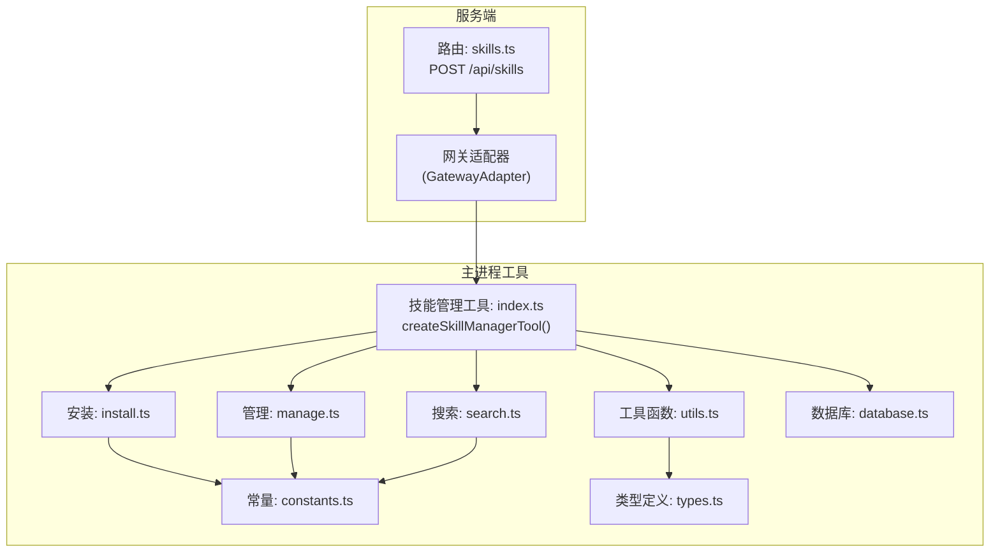
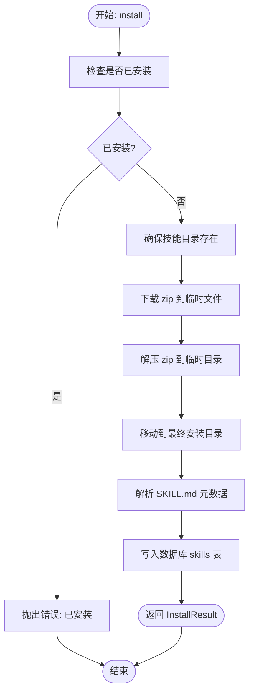
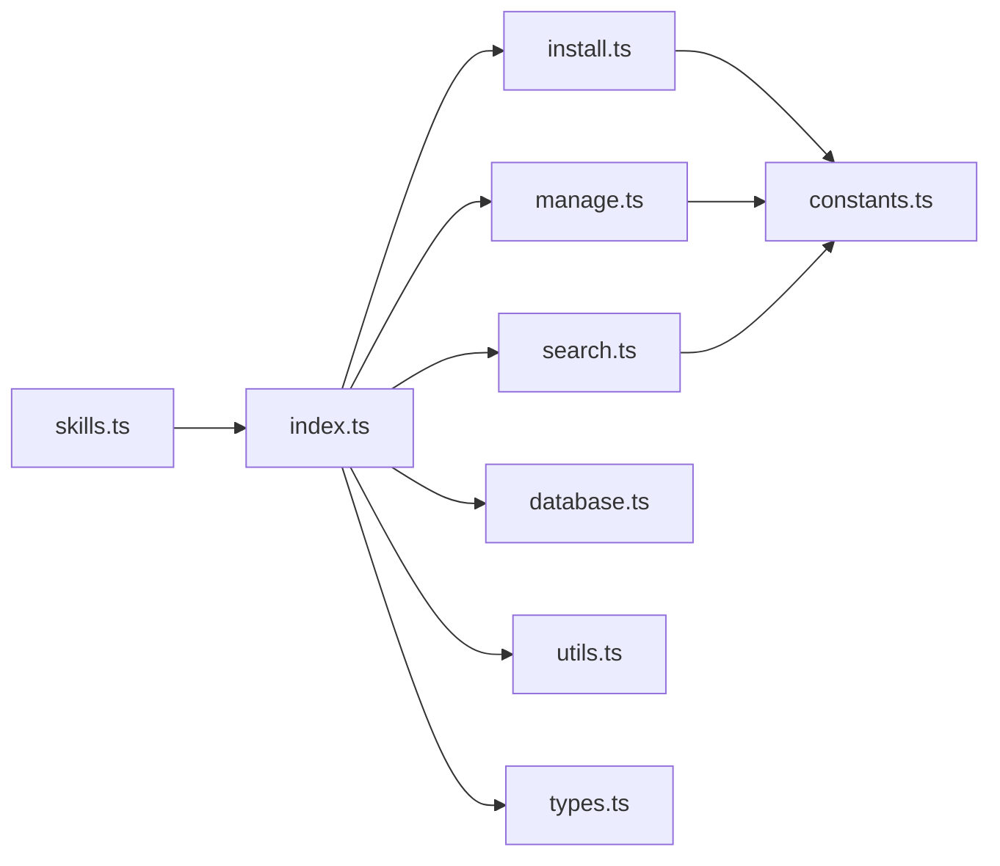
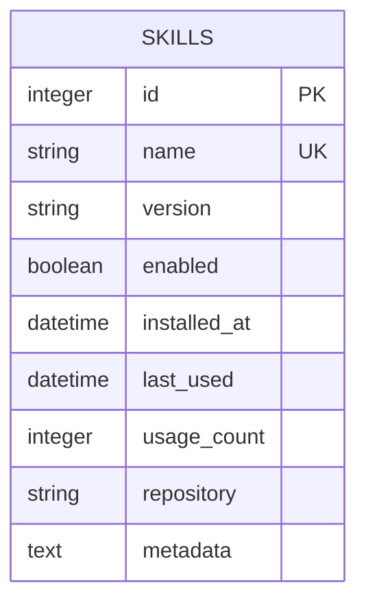

# 技能管理 API

<cite>
**本文引用的文件**
- [src/server/routes/skills.ts](file://src/server/routes/skills.ts)
- [src/main/tools/skill-manager-tool.ts](file://src/main/tools/skill-manager-tool.ts)
- [src/main/tools/skill-manager/index.ts](file://src/main/tools/skill-manager/index.ts)
- [src/main/tools/skill-manager/types.ts](file://src/main/tools/skill-manager/types.ts)
- [src/main/tools/skill-manager/install.ts](file://src/main/tools/skill-manager/install.ts)
- [src/main/tools/skill-manager/manage.ts](file://src/main/tools/skill-manager/manage.ts)
- [src/main/tools/skill-manager/search.ts](file://src/main/tools/skill-manager/search.ts)
- [src/main/tools/skill-manager/utils.ts](file://src/main/tools/skill-manager/utils.ts)
- [src/main/tools/skill-manager/constants.ts](file://src/main/tools/skill-manager/constants.ts)
- [src/main/tools/skill-manager/database.ts](file://src/main/tools/skill-manager/database.ts)
</cite>

## 目录
1. [简介](#简介)
2. [项目结构](#项目结构)
3. [核心组件](#核心组件)
4. [架构总览](#架构总览)
5. [详细组件分析](#详细组件分析)
6. [依赖分析](#依赖分析)
7. [性能考虑](#性能考虑)
8. [故障排查指南](#故障排查指南)
9. [结论](#结论)
10. [附录](#附录)

## 简介
本文件为“技能管理 API”的权威技术文档，覆盖技能的安装、卸载、搜索与管理等 HTTP 端点，以及技能包的上传、验证与部署流程的 API 接口设计建议；同时说明技能配置的请求格式、依赖关系检查与版本兼容性验证策略，并提供技能执行的触发机制、参数传递与结果获取的 API 示例；最后解释技能生命周期管理、性能监控与故障诊断接口。

## 项目结构
技能管理能力由服务端路由与主进程工具共同实现：
- 服务端路由层：统一入口接收请求，转发至网关适配器，再由技能管理工具执行具体动作。
- 技能管理工具层：负责搜索、安装、列表、启用/禁用、卸载、详情查询、环境变量读写等。
- 数据与存储层：SQLite 数据库存储技能元数据；文件系统存储技能包与 .env 配置。
- 外部集成：ClawHub 搜索与下载 API。

图表来源
- [src/server/routes/skills.ts:10-37](file://src/server/routes/skills.ts#L10-L37)
- [src/main/tools/skill-manager/index.ts:27-179](file://src/main/tools/skill-manager/index.ts#L27-L179)
- [src/main/tools/skill-manager/search.ts:29-80](file://src/main/tools/skill-manager/search.ts#L29-L80)
- [src/main/tools/skill-manager/install.ts:22-80](file://src/main/tools/skill-manager/install.ts#L22-L80)
- [src/main/tools/skill-manager/manage.ts:17-118](file://src/main/tools/skill-manager/manage.ts#L17-L118)
- [src/main/tools/skill-manager/utils.ts:28-80](file://src/main/tools/skill-manager/utils.ts#L28-L80)
- [src/main/tools/skill-manager/constants.ts:12-35](file://src/main/tools/skill-manager/constants.ts#L12-L35)
- [src/main/tools/skill-manager/database.ts:13-40](file://src/main/tools/skill-manager/database.ts#L13-L40)

章节来源
- [src/server/routes/skills.ts:10-37](file://src/server/routes/skills.ts#L10-L37)
- [src/main/tools/skill-manager/index.ts:27-179](file://src/main/tools/skill-manager/index.ts#L27-L179)

## 核心组件
- 统一路由与适配
  - 路由：接收 JSON 请求体，要求包含 action 字段；将请求交由网关适配器处理。
  - 网关适配器：负责将请求转交给技能管理工具执行。
- 技能管理工具
  - 功能：find、install、list、enable、disable、uninstall、info、get-env、set-env。
  - 参数校验：TypeBox 定义参数结构，缺失关键参数时抛错。
  - 结果封装：统一返回文本内容与细节对象，便于上层展示或进一步处理。
- 数据与存储
  - SQLite 表 skills：存储技能元数据、启用状态、使用计数、安装时间等。
  - 文件系统：技能包目录、.env 配置文件。
- 外部服务
  - ClawHub 搜索与下载 API：提供技能发现与安装来源。

章节来源
- [src/server/routes/skills.ts:14-34](file://src/server/routes/skills.ts#L14-L34)
- [src/main/tools/skill-manager/index.ts:60-76](file://src/main/tools/skill-manager/index.ts#L60-L76)
- [src/main/tools/skill-manager/database.ts:22-37](file://src/main/tools/skill-manager/database.ts#L22-L37)

## 架构总览
技能管理 API 的调用链路如下：

图表来源
- [src/server/routes/skills.ts:14-34](file://src/server/routes/skills.ts#L14-L34)
- [src/main/tools/skill-manager/index.ts:78-177](file://src/main/tools/skill-manager/index.ts#L78-L177)
- [src/main/tools/skill-manager/search.ts:29-64](file://src/main/tools/skill-manager/search.ts#L29-L64)
- [src/main/tools/skill-manager/install.ts:22-80](file://src/main/tools/skill-manager/install.ts#L22-L80)
- [src/main/tools/skill-manager/manage.ts:17-118](file://src/main/tools/skill-manager/manage.ts#L17-L118)

## 详细组件分析

### HTTP 端点与请求规范
- 统一入口
  - 方法：POST
  - 路径：/api/skills
  - 请求体必须包含 action 字段，其余字段按 action 类型决定。
- 响应
  - 成功：{ success: true, details: any }
  - 失败：{ success: false, error: string }

章节来源
- [src/server/routes/skills.ts:14-34](file://src/server/routes/skills.ts#L14-L34)

### 技能搜索 API（find）
- 功能：通过 ClawHub 搜索可用技能，返回名称、展示名、描述、版本、作者、星数、下载量、更新时间等。
- 请求体
  - action: "find"
  - query: 关键词
- 响应
  - details.skills: SkillSearchResult[]
  - details.count: 数量
  - details.message: 提示语
- 异常
  - 网络不可达时提示检查网络与防火墙。

章节来源
- [src/main/tools/skill-manager/index.ts:84-98](file://src/main/tools/skill-manager/index.ts#L84-L98)
- [src/main/tools/skill-manager/search.ts:29-80](file://src/main/tools/skill-manager/search.ts#L29-L80)

### 技能安装 API（install）
- 功能：从 ClawHub 下载 zip 并解压到技能目录，解析 SKILL.md 元数据，写入数据库。
- 请求体
  - action: "install"
  - name: 技能 slug
- 响应
  - details.success: true/false
  - details.skill: InstalledSkill
  - details.message: 安装结果消息
  - details.installPath: 安装路径
  - details.dependencies: 依赖列表（若存在）
- 流程要点
  - 检查是否已安装
  - 下载 zip（带超时与 User-Agent）
  - 解压到目标目录（处理 zip 内含版本子目录）
  - 解析 SKILL.md frontmatter
  - 写入数据库

图表来源
- [src/main/tools/skill-manager/install.ts:22-80](file://src/main/tools/skill-manager/install.ts#L22-L80)
- [src/main/tools/skill-manager/install.ts:85-113](file://src/main/tools/skill-manager/install.ts#L85-L113)
- [src/main/tools/skill-manager/install.ts:119-149](file://src/main/tools/skill-manager/install.ts#L119-L149)

章节来源
- [src/main/tools/skill-manager/index.ts:101-106](file://src/main/tools/skill-manager/index.ts#L101-L106)
- [src/main/tools/skill-manager/install.ts:22-80](file://src/main/tools/skill-manager/install.ts#L22-L80)

### 技能列表与详情 API（list、info）
- 列表（list）
  - 请求体
    - action: "list"
    - enabled: 可选，布尔值，仅返回启用/禁用的技能
  - 响应
    - details.skills: InstalledSkill[]
    - details.count: 数量
    - details.message: 提示语
  - 实现要点
    - 扫描所有技能路径，匹配 SKILL.md
    - 优先读取数据库记录，缺失则自动注册
    - 支持按启用状态过滤
    - 按使用次数与安装时间排序
- 详情（info）
  - 请求体
    - action: "info"
    - name: 技能名称
  - 响应
    - details.name/description/version/author/repository/installPath
    - details.readme: SKILL.md 内容
    - details.requires.tools/dependencies
    - details.files.scripts/references/assets

章节来源
- [src/main/tools/skill-manager/index.ts:108-118](file://src/main/tools/skill-manager/index.ts#L108-L118)
- [src/main/tools/skill-manager/manage.ts:17-118](file://src/main/tools/skill-manager/manage.ts#L17-L118)
- [src/main/tools/skill-manager/manage.ts:229-280](file://src/main/tools/skill-manager/manage.ts#L229-L280)

### 技能启停与卸载 API（enable、disable、uninstall）
- 启用/禁用
  - 当前工具未暴露 enable/disable 动作；如需实现，可在工具参数与执行分支中新增对应逻辑。
- 卸载（uninstall）
  - 请求体
    - action: "uninstall"
    - name: 技能名称
  - 响应
    - { success: true, message: "已卸载" }
  - 实现要点
    - 删除数据库记录
    - 删除文件目录

章节来源
- [src/main/tools/skill-manager/index.ts:121-127](file://src/main/tools/skill-manager/index.ts#L121-L127)
- [src/main/tools/skill-manager/manage.ts:123-150](file://src/main/tools/skill-manager/manage.ts#L123-L150)

### 技能配置 API（get-env、set-env）
- 获取环境变量（get-env）
  - 请求体
    - action: "get-env"
    - name: 技能名称
  - 响应
    - details.name
    - details.env: .env 文件内容
- 设置环境变量（set-env）
  - 请求体
    - action: "set-env"
    - name: 技能名称
    - env: KEY=VALUE，每行一个（支持 export KEY=VALUE）
  - 响应
    - { success: true, message: "已保存" }
  - 实现要点
    - 自动清理 Shell 路径缓存，确保下次执行生效

章节来源
- [src/main/tools/skill-manager/index.ts:136-148](file://src/main/tools/skill-manager/index.ts#L136-L148)
- [src/main/tools/skill-manager/manage.ts:155-188](file://src/main/tools/skill-manager/manage.ts#L155-L188)

### 技能包上传、验证与部署（设计建议）
- 上传
  - 方法：POST /api/skills/upload
  - 请求体：multipart/form-data，字段 zipFile
  - 校验：文件类型、大小限制、压缩包完整性
- 验证
  - 解析 zip 根目录结构，要求包含 SKILL.md
  - 解析 SKILL.md frontmatter，校验必需字段（name、description）
  - 检查 requires.tools/dependencies 是否满足
- 部署
  - 生成目标目录名（slug 或从元数据推断）
  - 写入数据库记录（version、repository、metadata）
  - 将 zip 解压到技能目录
  - 记录安装时间与使用计数

章节来源
- [src/main/tools/skill-manager/utils.ts:28-80](file://src/main/tools/skill-manager/utils.ts#L28-L80)
- [src/main/tools/skill-manager/constants.ts:12-35](file://src/main/tools/skill-manager/constants.ts#L12-L35)

### 技能执行触发、参数传递与结果获取（设计建议）
- 触发机制
  - 在 Agent 执行流程中，通过工具调用触发技能管理工具的相应 action。
- 参数传递
  - 以 JSON 形式传入 action 与必要参数（如 name、query、env）。
- 结果获取
  - 工具返回统一结构：content（文本）、details（结构化数据）、isError（错误标记）。
  - 上层根据 details 构建 UI 或继续处理。

章节来源
- [src/main/tools/skill-manager/index.ts:78-177](file://src/main/tools/skill-manager/index.ts#L78-L177)

### 生命周期管理、性能监控与故障诊断（设计建议）
- 生命周期
  - 安装：写入数据库 + 解压文件
  - 启用/禁用：可通过扩展参数实现（见上文）
  - 卸载：删除数据库记录 + 文件目录
- 性能监控
  - 记录安装/卸载耗时、下载字节数
  - 统计使用次数与最近使用时间
- 故障诊断
  - 网络异常：区分 DNS/超时/拒绝等场景，给出明确提示
  - 文件系统异常：捕获权限/磁盘空间/路径不存在
  - 数据库异常：回滚事务、重试策略

章节来源
- [src/main/tools/skill-manager/search.ts:65-79](file://src/main/tools/skill-manager/search.ts#L65-L79)
- [src/main/tools/skill-manager/install.ts:76-79](file://src/main/tools/skill-manager/install.ts#L76-L79)
- [src/main/tools/skill-manager/manage.ts:123-150](file://src/main/tools/skill-manager/manage.ts#L123-L150)

## 依赖分析
- 组件耦合
  - 路由依赖网关适配器与技能管理工具
  - 工具依赖搜索、安装、管理模块与数据库
  - 安装与管理模块依赖文件系统与常量
- 外部依赖
  - ClawHub 搜索与下载 API
  - adm-zip 解压
  - SQLite 适配器

图表来源
- [src/server/routes/skills.ts:10-37](file://src/server/routes/skills.ts#L10-L37)
- [src/main/tools/skill-manager/index.ts:18-22](file://src/main/tools/skill-manager/index.ts#L18-L22)
- [src/main/tools/skill-manager/install.ts:12-15](file://src/main/tools/skill-manager/install.ts#L12-L15)
- [src/main/tools/skill-manager/manage.ts:8-12](file://src/main/tools/skill-manager/manage.ts#L8-L12)
- [src/main/tools/skill-manager/search.ts:7-8](file://src/main/tools/skill-manager/search.ts#L7-L8)
- [src/main/tools/skill-manager/utils.ts:7-8](file://src/main/tools/skill-manager/utils.ts#L7-L8)
- [src/main/tools/skill-manager/types.ts:8-20](file://src/main/tools/skill-manager/types.ts#L8-L20)

章节来源
- [src/main/tools/skill-manager/index.ts:18-22](file://src/main/tools/skill-manager/index.ts#L18-L22)
- [src/main/tools/skill-manager/install.ts:12-15](file://src/main/tools/skill-manager/install.ts#L12-L15)
- [src/main/tools/skill-manager/manage.ts:8-12](file://src/main/tools/skill-manager/manage.ts#L8-L12)
- [src/main/tools/skill-manager/search.ts:7-8](file://src/main/tools/skill-manager/search.ts#L7-L8)

## 性能考虑
- I/O 优化
  - 批量扫描技能目录时避免重复 IO，缓存目录结构
  - 解压采用临时目录 + 移动策略，减少跨分区错误
- 网络优化
  - 下载设置合理超时与 User-Agent
  - 搜索 API 增加重试与降级策略
- 数据库优化
  - 为 skills 表建立索引（name、enabled）
  - 合理分页与排序，避免全表扫描

## 故障排查指南
- 无法连接 ClawHub
  - 现象：ENOTFOUND/ETIMEDOUT/ECONNREFUSED/fetch failed
  - 处理：检查网络、代理、防火墙；重试或切换网络
- 技能安装失败
  - 现象：zip 下载为空、解压失败、SKILL.md 缺失或格式不正确
  - 处理：确认 slug 正确、网络稳定、磁盘空间充足
- 卸载后残留
  - 现象：数据库记录已删但目录未清
  - 处理：检查路径拼接与权限，必要时手动清理
- 环境变量未生效
  - 现象：set-env 成功但执行仍读取旧值
  - 处理：确认缓存已清理，重启相关进程

章节来源
- [src/main/tools/skill-manager/search.ts:65-79](file://src/main/tools/skill-manager/search.ts#L65-L79)
- [src/main/tools/skill-manager/install.ts:76-79](file://src/main/tools/skill-manager/install.ts#L76-L79)
- [src/main/tools/skill-manager/manage.ts:155-188](file://src/main/tools/skill-manager/manage.ts#L155-L188)

## 结论
技能管理 API 通过统一路由与工具层实现了完整的技能生命周期管理：从搜索、安装、列表、详情到卸载与配置。结合数据库与文件系统的协同，提供了可靠的技能托管能力。建议在现有基础上补充上传/验证/部署接口与启停控制，并完善监控与告警机制，以支撑生产环境的稳定运行。

## 附录

### 请求与响应示例（路径参考）
- 搜索
  - 请求体：{ "action": "find", "query": "PDF" }
  - 响应详情：details.skills[], details.count, details.message
  - 参考路径：[src/main/tools/skill-manager/index.ts:84-98](file://src/main/tools/skill-manager/index.ts#L84-L98)，[src/main/tools/skill-manager/search.ts:29-64](file://src/main/tools/skill-manager/search.ts#L29-L64)
- 安装
  - 请求体：{ "action": "install", "name": "youtube-watcher" }
  - 响应详情：details.success, details.skill, details.message, details.installPath, details.dependencies
  - 参考路径：[src/main/tools/skill-manager/index.ts:101-106](file://src/main/tools/skill-manager/index.ts#L101-L106)，[src/main/tools/skill-manager/install.ts:22-80](file://src/main/tools/skill-manager/install.ts#L22-L80)
- 列表
  - 请求体：{ "action": "list", "enabled": true }
  - 响应详情：details.skills[], details.count, details.message
  - 参考路径：[src/main/tools/skill-manager/index.ts:108-118](file://src/main/tools/skill-manager/index.ts#L108-L118)，[src/main/tools/skill-manager/manage.ts:17-118](file://src/main/tools/skill-manager/manage.ts#L17-L118)
- 卸载
  - 请求体：{ "action": "uninstall", "name": "pdf-editor" }
  - 响应详情：{ success: true, message: "已卸载" }
  - 参考路径：[src/main/tools/skill-manager/index.ts:121-127](file://src/main/tools/skill-manager/index.ts#L121-L127)，[src/main/tools/skill-manager/manage.ts:123-150](file://src/main/tools/skill-manager/manage.ts#L123-L150)
- 详情
  - 请求体：{ "action": "info", "name": "pdf-editor" }
  - 响应详情：details.name/description/version/author/repository/installPath/readme/requires/files
  - 参考路径：[src/main/tools/skill-manager/index.ts:129-134](file://src/main/tools/skill-manager/index.ts#L129-L134)，[src/main/tools/skill-manager/manage.ts:229-280](file://src/main/tools/skill-manager/manage.ts#L229-L280)
- 获取/设置环境变量
  - 获取：{ "action": "get-env", "name": "tavily-search" }
  - 设置：{ "action": "set-env", "name": "tavily-search", "env": "TAVILY_API_KEY=tvly-xxx" }
  - 响应详情：get-env 返回 .env 内容；set-env 返回成功消息
  - 参考路径：[src/main/tools/skill-manager/index.ts:136-148](file://src/main/tools/skill-manager/index.ts#L136-L148)，[src/main/tools/skill-manager/manage.ts:155-188](file://src/main/tools/skill-manager/manage.ts#L155-L188)

### 数据模型

图表来源
- [src/main/tools/skill-manager/database.ts:22-37](file://src/main/tools/skill-manager/database.ts#L22-L37)