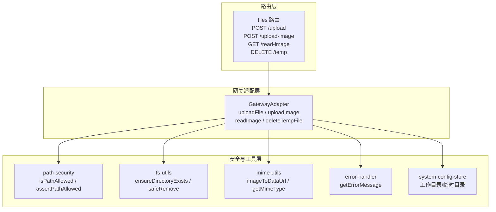
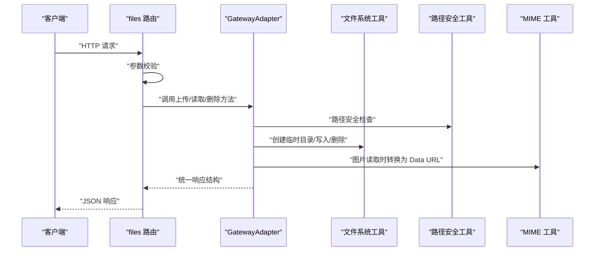
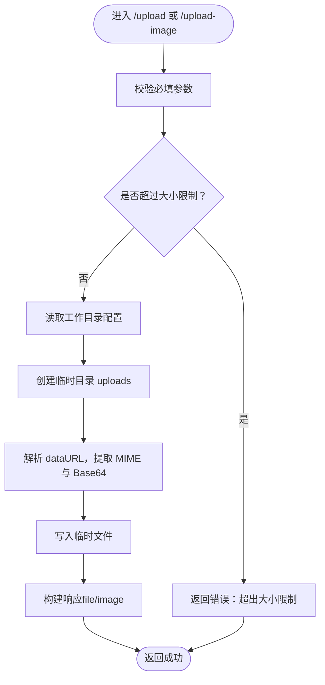
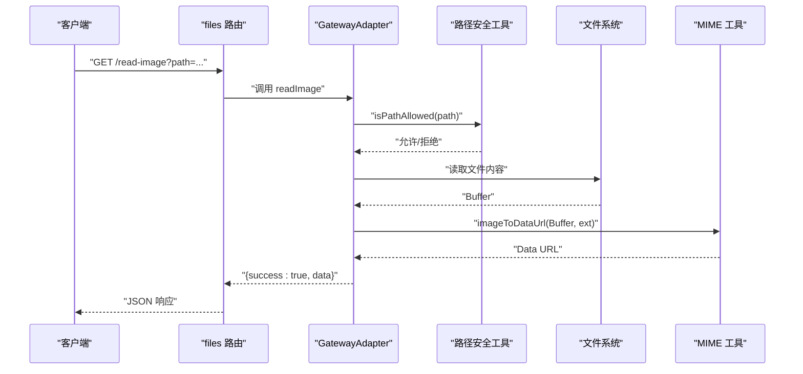
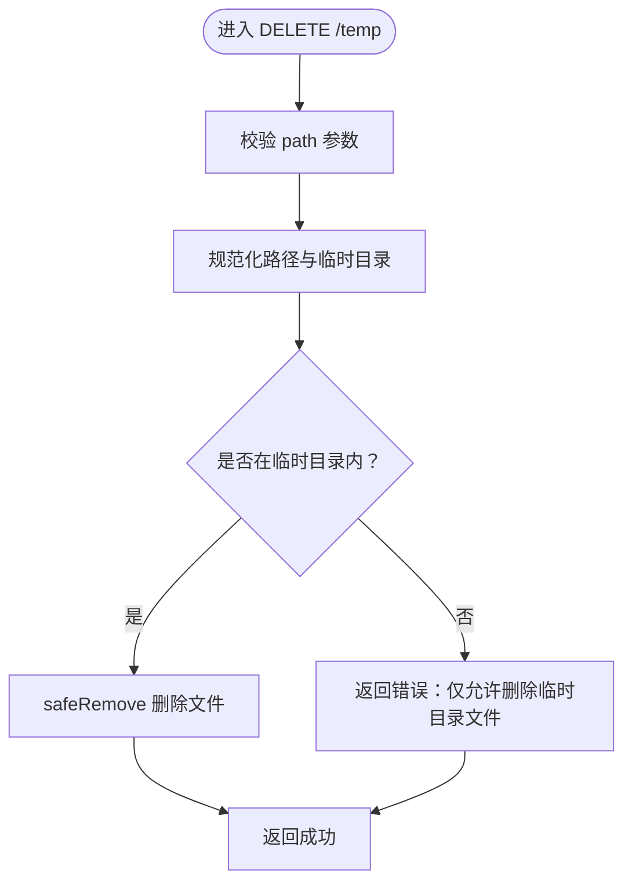
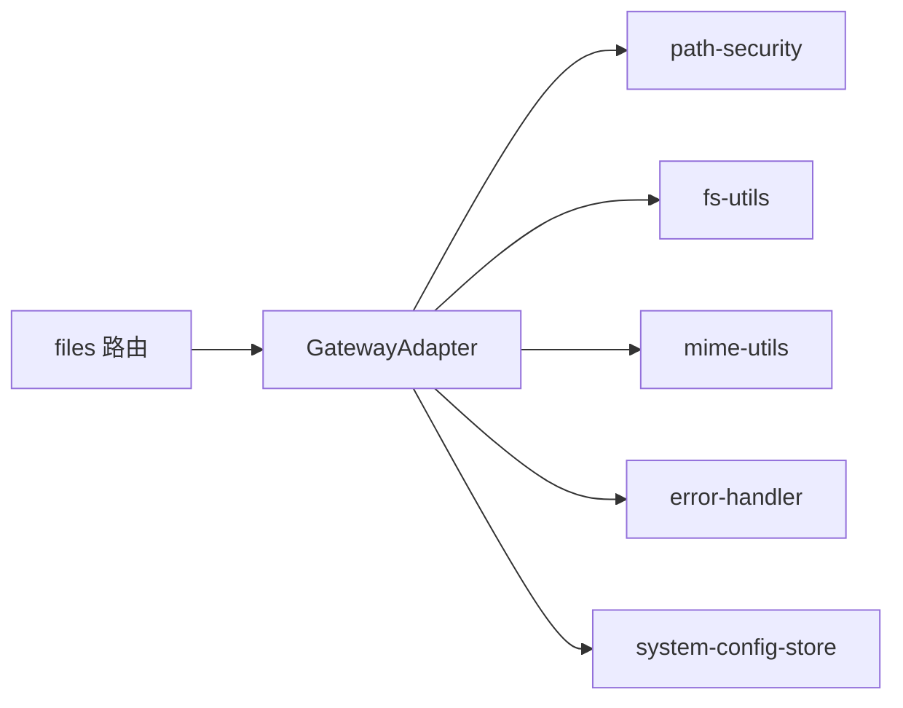

# 文件操作 API

<cite>
**本文引用的文件**
- [src/server/routes/files.ts](file://src/server/routes/files.ts)
- [src/server/gateway-adapter.ts](file://src/server/gateway-adapter.ts)
- [src/server/middleware/auth.ts](file://src/server/middleware/auth.ts)
- [src/main/utils/path-security.ts](file://src/main/utils/path-security.ts)
- [src/shared/utils/fs-utils.ts](file://src/shared/utils/fs-utils.ts)
- [src/shared/utils/mime-utils.ts](file://src/shared/utils/mime-utils.ts)
- [src/shared/utils/error-handler.ts](file://src/shared/utils/error-handler.ts)
- [src/main/database/system-config-store.ts](file://src/main/database/system-config-store.ts)
- [src/renderer/components/FileUploader.tsx](file://src/renderer/components/FileUploader.tsx)
</cite>

## 目录
1. [简介](#简介)
2. [项目结构](#项目结构)
3. [核心组件](#核心组件)
4. [架构总览](#架构总览)
5. [详细组件分析](#详细组件分析)
6. [依赖关系分析](#依赖关系分析)
7. [性能考量](#性能考量)
8. [故障排查指南](#故障排查指南)
9. [结论](#结论)
10. [附录](#附录)

## 简介
本文件操作 API 文档面向后端服务与前端集成方，系统性说明文件上传、图片上传、图片读取与临时文件删除的 HTTP 接口；同时覆盖 multipart/form-data 上传的请求格式、文件大小限制、安全校验（路径白名单）、权限控制与存储策略，并给出文件预览、缩略图生成与批量操作的使用建议及错误处理与异常恢复机制。

## 项目结构
文件操作相关能力由三层协作构成：
- 路由层：暴露 HTTP 接口，接收请求并转发至网关适配器
- 网关适配层：实现具体业务逻辑（上传、读取、删除），并进行安全与存储控制
- 安全与工具层：路径安全检查、文件系统工具、MIME 工具、错误处理与系统配置

图表来源
- [src/server/routes/files.ts:10-106](file://src/server/routes/files.ts#L10-L106)
- [src/server/gateway-adapter.ts:548-720](file://src/server/gateway-adapter.ts#L548-L720)
- [src/main/utils/path-security.ts:48-117](file://src/main/utils/path-security.ts#L48-L117)
- [src/shared/utils/fs-utils.ts:19-161](file://src/shared/utils/fs-utils.ts#L19-L161)
- [src/shared/utils/mime-utils.ts:25-32](file://src/shared/utils/mime-utils.ts#L25-L32)
- [src/shared/utils/error-handler.ts:8-13](file://src/shared/utils/error-handler.ts#L8-L13)
- [src/main/database/system-config-store.ts:37-77](file://src/main/database/system-config-store.ts#L37-L77)

章节来源
- [src/server/routes/files.ts:10-106](file://src/server/routes/files.ts#L10-L106)
- [src/server/gateway-adapter.ts:548-720](file://src/server/gateway-adapter.ts#L548-L720)

## 核心组件
- 文件路由（files 路由）：提供上传、图片上传、图片读取与临时文件删除四个端点，负责参数校验与错误兜底
- 网关适配器（GatewayAdapter）：实现上传、读取、删除的具体逻辑，包含大小限制、临时目录、路径安全与错误处理
- 路径安全工具：统一的路径白名单与断言，确保仅能访问受控目录
- 文件系统工具：目录创建、安全读写、删除等
- MIME 工具：根据扩展名推导 MIME 类型，将图片转为 Data URL
- 错误处理工具：统一提取错误消息
- 系统配置：工作目录与临时目录的持久化配置

章节来源
- [src/server/routes/files.ts:10-106](file://src/server/routes/files.ts#L10-L106)
- [src/server/gateway-adapter.ts:548-720](file://src/server/gateway-adapter.ts#L548-L720)
- [src/main/utils/path-security.ts:48-117](file://src/main/utils/path-security.ts#L48-L117)
- [src/shared/utils/fs-utils.ts:19-161](file://src/shared/utils/fs-utils.ts#L19-L161)
- [src/shared/utils/mime-utils.ts:25-32](file://src/shared/utils/mime-utils.ts#L25-L32)
- [src/shared/utils/error-handler.ts:8-13](file://src/shared/utils/error-handler.ts#L8-L13)
- [src/main/database/system-config-store.ts:37-77](file://src/main/database/system-config-store.ts#L37-L77)

## 架构总览
文件操作的典型流程如下：
- 客户端发起 HTTP 请求到 files 路由
- 路由层进行基础参数校验，随后调用 GatewayAdapter 的对应方法
- GatewayAdapter 执行业务逻辑：参数校验、大小限制、临时目录创建、数据解析与落盘、路径安全检查、MIME 转换等
- 成功时返回统一结构；失败时通过错误处理工具提取错误信息并返回

图表来源
- [src/server/routes/files.ts:14-103](file://src/server/routes/files.ts#L14-L103)
- [src/server/gateway-adapter.ts:558-720](file://src/server/gateway-adapter.ts#L558-L720)
- [src/main/utils/path-security.ts:48-117](file://src/main/utils/path-security.ts#L48-L117)
- [src/shared/utils/mime-utils.ts:25-32](file://src/shared/utils/mime-utils.ts#L25-L32)
- [src/shared/utils/fs-utils.ts:19-161](file://src/shared/utils/fs-utils.ts#L19-L161)

## 详细组件分析

### HTTP 端点定义与请求格式
- 上传文件
  - 方法与路径：POST /upload
  - 请求体字段：fileName（必填）、dataUrl（必填）、fileSize（必填，字节）、fileType（可选）
  - 响应：统一结构，成功时包含 file 字段，失败时包含 error
  - 说明：支持任意文件类型，大小上限为 500 MB
- 上传图片
  - 方法与路径：POST /upload-image
  - 请求体字段：fileName（必填）、dataUrl（必填）、fileSize（必填，字节）
  - 响应：统一结构，成功时包含 image 字段，失败时包含 error
  - 说明：大小上限为 5 MB
- 读取图片
  - 方法与路径：GET /read-image
  - 查询参数：path（必填，图片绝对路径或受控相对路径）
  - 响应：统一结构，成功时包含 data（Data URL），失败时包含 error
- 删除临时文件
  - 方法与路径：DELETE /temp
  - 查询参数：path（必填，临时文件绝对路径）
  - 响应：统一结构，成功时返回成功标记，失败时包含 error

注意
- 当前路由层未使用 multipart/form-data，而是采用 dataURL 形式的 Base64 数据传输。如需使用 multipart/form-data，请在前端将文件编码为 Base64 后提交，或在网关层增加 multipart 解析逻辑。

章节来源
- [src/server/routes/files.ts:14-103](file://src/server/routes/files.ts#L14-L103)

### 上传流程（文件/图片）

图表来源
- [src/server/gateway-adapter.ts:558-625](file://src/server/gateway-adapter.ts#L558-L625)
- [src/main/database/system-config-store.ts:37-77](file://src/main/database/system-config-store.ts#L37-L77)
- [src/shared/utils/fs-utils.ts:19-79](file://src/shared/utils/fs-utils.ts#L19-L79)

章节来源
- [src/server/gateway-adapter.ts:629-643](file://src/server/gateway-adapter.ts#L629-L643)

### 读取图片流程

图表来源
- [src/server/routes/files.ts:60-80](file://src/server/routes/files.ts#L60-L80)
- [src/server/gateway-adapter.ts:645-682](file://src/server/gateway-adapter.ts#L645-L682)
- [src/main/utils/path-security.ts:48-83](file://src/main/utils/path-security.ts#L48-L83)
- [src/shared/utils/mime-utils.ts:25-32](file://src/shared/utils/mime-utils.ts#L25-L32)

章节来源
- [src/server/gateway-adapter.ts:645-682](file://src/server/gateway-adapter.ts#L645-L682)

### 删除临时文件流程

图表来源
- [src/server/routes/files.ts:82-103](file://src/server/routes/files.ts#L82-L103)
- [src/server/gateway-adapter.ts:684-720](file://src/server/gateway-adapter.ts#L684-L720)
- [src/shared/utils/fs-utils.ts:150-161](file://src/shared/utils/fs-utils.ts#L150-L161)

章节来源
- [src/server/gateway-adapter.ts:684-720](file://src/server/gateway-adapter.ts#L684-L720)

### 权限控制与安全检查
- 路径白名单：仅允许访问工作目录、脚本目录、Skill 目录、图片目录、记忆目录、会话目录及其子目录
- Docker 模式：跳过路径检查（容器内目录固定）
- 临时文件删除：严格限定在工作目录下的 .deepbot/temp/uploads 内
- 图片读取：统一使用路径安全检查，防止越权访问

章节来源
- [src/main/utils/path-security.ts:48-117](file://src/main/utils/path-security.ts#L48-L117)
- [src/server/gateway-adapter.ts:645-720](file://src/server/gateway-adapter.ts#L645-L720)

### 存储策略
- 临时目录：工作目录/.deepbot/temp/uploads，按需创建
- 文件命名：随机 ID + 原扩展名，避免冲突
- 图片读取：将二进制内容转换为 Data URL 返回，便于前端直接渲染

章节来源
- [src/server/gateway-adapter.ts:582-602](file://src/server/gateway-adapter.ts#L582-L602)
- [src/shared/utils/mime-utils.ts:25-32](file://src/shared/utils/mime-utils.ts#L25-L32)

### 错误处理与异常恢复
- 统一错误提取：getErrorMessage 将异常转换为字符串
- 路由层：捕获异常并返回 { success: false, error }
- 网关层：对大小超限、路径非法、文件不存在等场景抛出明确错误
- 异常恢复：删除临时文件失败不影响整体流程，前端可重试或清理

章节来源
- [src/shared/utils/error-handler.ts:8-13](file://src/shared/utils/error-handler.ts#L8-L13)
- [src/server/routes/files.ts:27-33](file://src/server/routes/files.ts#L27-L33)
- [src/server/gateway-adapter.ts:620-625](file://src/server/gateway-adapter.ts#L620-L625)

## 依赖关系分析

图表来源
- [src/server/routes/files.ts:10-106](file://src/server/routes/files.ts#L10-L106)
- [src/server/gateway-adapter.ts:548-720](file://src/server/gateway-adapter.ts#L548-L720)
- [src/main/utils/path-security.ts:48-117](file://src/main/utils/path-security.ts#L48-L117)
- [src/shared/utils/fs-utils.ts:19-161](file://src/shared/utils/fs-utils.ts#L19-L161)
- [src/shared/utils/mime-utils.ts:25-32](file://src/shared/utils/mime-utils.ts#L25-L32)
- [src/shared/utils/error-handler.ts:8-13](file://src/shared/utils/error-handler.ts#L8-L13)
- [src/main/database/system-config-store.ts:37-77](file://src/main/database/system-config-store.ts#L37-L77)

## 性能考量
- 上传/读取均为内存中处理，适合中小文件；大文件建议分片或外部对象存储
- 临时目录按需创建，避免频繁 IO
- MIME 转换与 Base64 编解码在内存中完成，注意控制并发与超时

## 故障排查指南
- 400 错误：缺少必要参数（如 fileName、dataUrl）
- 500 错误：服务器内部异常，查看服务端日志
- 路径错误：仅允许访问受控目录，检查工作目录配置
- 大小超限：文件超过 500 MB（文件）或 5 MB（图片）
- 临时文件删除失败：确认路径确实在临时目录内

章节来源
- [src/server/routes/files.ts:18-23](file://src/server/routes/files.ts#L18-L23)
- [src/server/gateway-adapter.ts:572-576](file://src/server/gateway-adapter.ts#L572-L576)
- [src/main/utils/path-security.ts:92-116](file://src/main/utils/path-security.ts#L92-L116)

## 结论
本文件操作 API 通过路由层、网关适配层与安全工具层的协同，提供了简洁可靠的文件上传、图片读取与临时文件删除能力。其路径白名单与大小限制保障了安全性与稳定性；统一的错误处理与响应结构便于前端集成与排错。对于大文件与高并发场景，建议结合外部存储与分片策略进一步优化。

## 附录

### API 使用示例（基于现有能力的实践建议）

- 文件上传（任意文件）
  - 请求：POST /upload，请求体包含 fileName、dataUrl、fileSize、fileType
  - 响应：包含 file 字段（含 id、path、name、size、type）
  - 注意：当前为 dataURL 方式，如需 multipart/form-data，可在前端将文件转为 Base64 后提交
  - 参考路径
    - [src/server/routes/files.ts:14-34](file://src/server/routes/files.ts#L14-L34)
    - [src/server/gateway-adapter.ts:629-636](file://src/server/gateway-adapter.ts#L629-L636)

- 图片上传
  - 请求：POST /upload-image，请求体包含 fileName、dataUrl、fileSize
  - 响应：包含 image 字段（含 id、path、name、size、dataUrl）
  - 参考路径
    - [src/server/routes/files.ts:36-57](file://src/server/routes/files.ts#L36-L57)
    - [src/server/gateway-adapter.ts:641-643](file://src/server/gateway-adapter.ts#L641-L643)

- 图片读取（预览）
  - 请求：GET /read-image，查询参数 path 指向图片绝对路径
  - 响应：包含 data（Data URL），可直接用于 img 标签
  - 参考路径
    - [src/server/routes/files.ts:59-80](file://src/server/routes/files.ts#L59-L80)
    - [src/server/gateway-adapter.ts:645-682](file://src/server/gateway-adapter.ts#L645-L682)
    - [src/shared/utils/mime-utils.ts:25-32](file://src/shared/utils/mime-utils.ts#L25-L32)

- 删除临时文件
  - 请求：DELETE /temp，查询参数 path 指向临时文件绝对路径
  - 响应：成功标记
  - 参考路径
    - [src/server/routes/files.ts:82-103](file://src/server/routes/files.ts#L82-L103)
    - [src/server/gateway-adapter.ts:684-720](file://src/server/gateway-adapter.ts#L684-L720)

- 批量操作建议
  - 前端可维护一个文件队列，逐个调用 /upload 或 /upload-image，完成后统一展示
  - 预览：上传成功后立即调用 /read-image 获取 Data URL 进行展示
  - 清理：在操作结束后调用 /temp 删除临时文件
  - 参考路径
    - [src/renderer/components/FileUploader.tsx:213-237](file://src/renderer/components/FileUploader.tsx#L213-L237)

- 权限与安全
  - 确认工作目录已在系统设置中正确配置，否则路径检查会拒绝访问
  - 参考路径
    - [src/main/utils/path-security.ts:48-83](file://src/main/utils/path-security.ts#L48-L83)
    - [src/main/database/system-config-store.ts:37-77](file://src/main/database/system-config-store.ts#L37-L77)