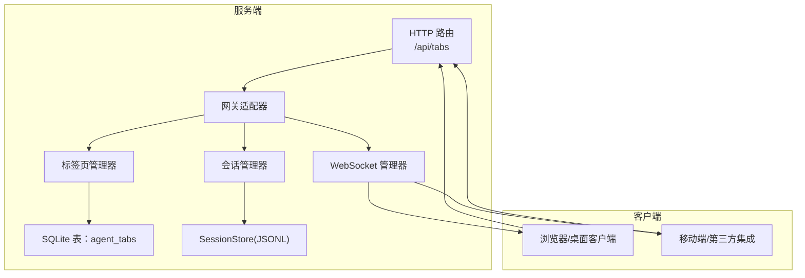
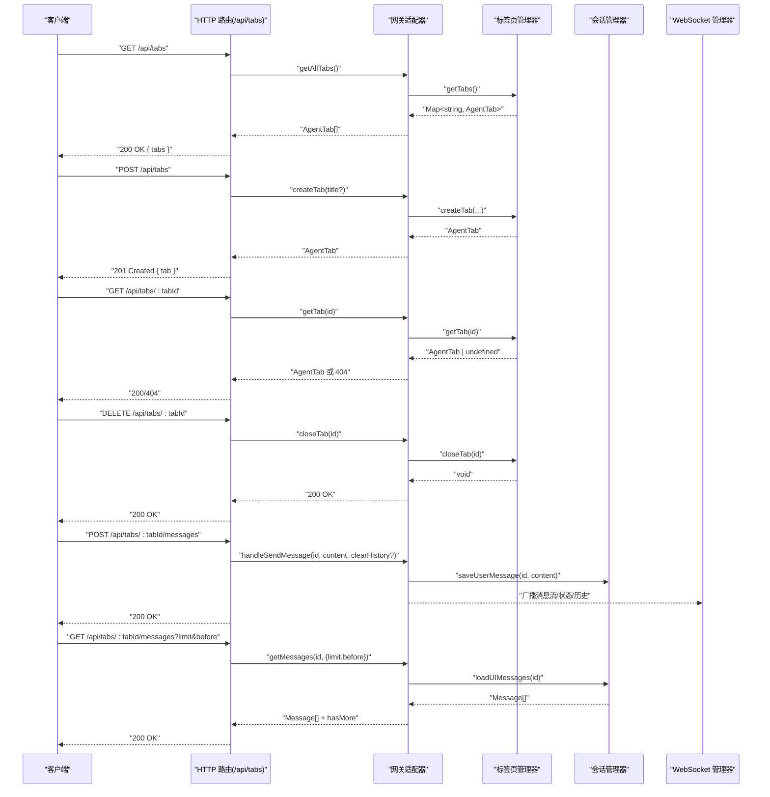
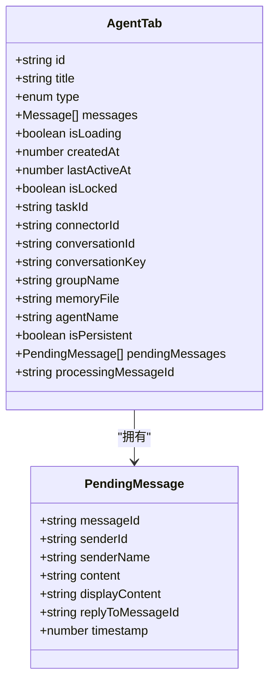
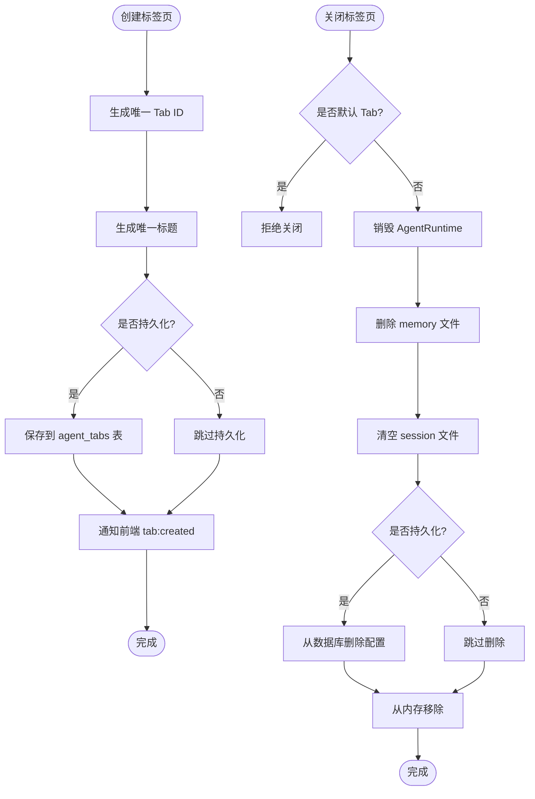
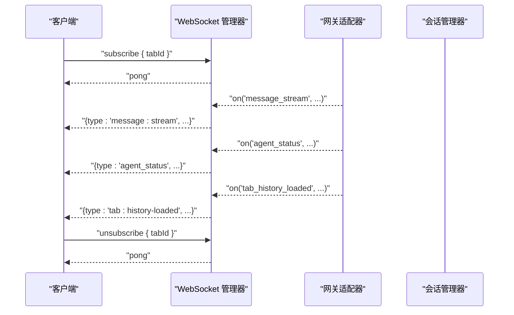
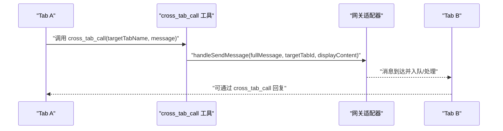
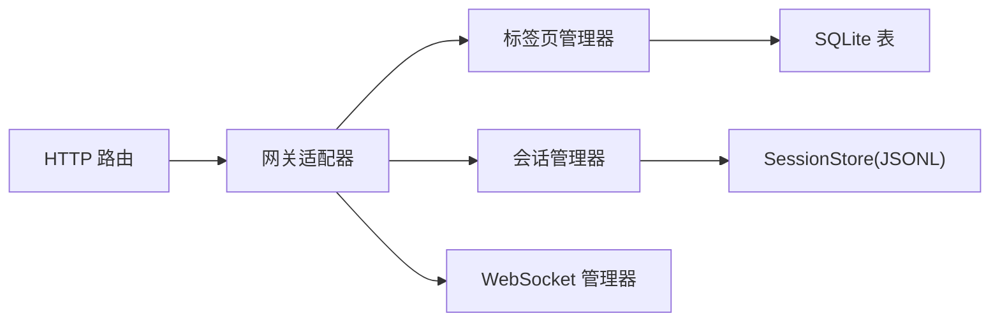

# 标签页管理 API

<cite>
**本文引用的文件**
- [src/server/routes/tabs.ts](file://src/server/routes/tabs.ts)
- [src/types/agent-tab.ts](file://src/types/agent-tab.ts)
- [src/main/gateway-tab.ts](file://src/main/gateway-tab.ts)
- [src/main/session/session-manager.ts](file://src/main/session/session-manager.ts)
- [src/main/session/session-store.ts](file://src/main/session/session-store.ts)
- [src/main/database/tab-config.ts](file://src/main/database/tab-config.ts)
- [src/server/websocket-manager.ts](file://src/server/websocket-manager.ts)
- [src/server/index.ts](file://src/server/index.ts)
- [src/main/tools/cross-tab-call-tool.ts](file://src/main/tools/cross-tab-call-tool.ts)
- [src/main/agent-runtime/agent-runtime.ts](file://src/main/agent-runtime/agent-runtime.ts)
</cite>

## 目录
1. [简介](#简介)
2. [项目结构](#项目结构)
3. [核心组件](#核心组件)
4. [架构总览](#架构总览)
5. [详细组件分析](#详细组件分析)
6. [依赖关系分析](#依赖关系分析)
7. [性能考量](#性能考量)
8. [故障排查指南](#故障排查指南)
9. [结论](#结论)
10. [附录](#附录)

## 简介
本文件为标签页管理 API 的权威文档，覆盖标签页的创建、切换、关闭与状态查询；消息历史的获取；消息同步与状态保持；多标签页并发会话的管理机制、消息路由与状态一致性保障；标签页配置的动态调整、主题切换与个性化设置；以及标签页的内存管理与资源清理机制。读者可据此对接 HTTP API 与 WebSocket，实现稳定可靠的多标签页交互体验。

## 项目结构
标签页管理 API 位于服务端路由层，配合网关适配器、会话存储与 WebSocket 广播，形成完整的前后端交互闭环。关键模块职责如下：
- 路由层：提供 HTTP 接口，统一鉴权与错误处理
- 网关适配器：桥接路由与主进程业务逻辑
- 标签页管理器：负责标签页生命周期、持久化与历史加载
- 会话管理器/存储：负责消息持久化、上下文截取与历史加载
- WebSocket 管理器：负责客户端认证、订阅与消息广播
- 数据库：持久化标签页配置（标题、类型、关联信息等）

图表来源
- [src/server/routes/tabs.ts:10-136](file://src/server/routes/tabs.ts#L10-L136)
- [src/server/websocket-manager.ts:29-380](file://src/server/websocket-manager.ts#L29-L380)
- [src/main/gateway-tab.ts:26-795](file://src/main/gateway-tab.ts#L26-L795)
- [src/main/session/session-manager.ts:17-194](file://src/main/session/session-manager.ts#L17-L194)
- [src/main/session/session-store.ts:46-322](file://src/main/session/session-store.ts#L46-L322)
- [src/main/database/tab-config.ts:46-217](file://src/main/database/tab-config.ts#L46-L217)

章节来源
- [src/server/index.ts:33-128](file://src/server/index.ts#L33-L128)
- [src/server/routes/tabs.ts:10-136](file://src/server/routes/tabs.ts#L10-L136)

## 核心组件
- HTTP 路由层：提供标签页 CRUD、消息收发、历史查询与停止生成等接口
- 网关适配器：封装底层业务调用，暴露统一方法给路由层
- 标签页管理器：维护标签页内存映射、持久化配置、历史加载、标题更新、关闭清理
- 会话管理器/存储：负责消息持久化（JSONL）、UI/上下文消息加载、清空会话
- WebSocket 管理器：客户端认证、订阅/取消订阅、事件广播（消息流、状态、历史等）
- 数据库：维护 agent_tabs 表，保存标签页元数据与关联信息

章节来源
- [src/server/routes/tabs.ts:10-136](file://src/server/routes/tabs.ts#L10-L136)
- [src/main/gateway-tab.ts:26-795](file://src/main/gateway-tab.ts#L26-L795)
- [src/main/session/session-manager.ts:17-194](file://src/main/session/session-manager.ts#L17-L194)
- [src/main/session/session-store.ts:46-322](file://src/main/session/session-store.ts#L46-L322)
- [src/main/database/tab-config.ts:46-217](file://src/main/database/tab-config.ts#L46-L217)
- [src/server/websocket-manager.ts:29-380](file://src/server/websocket-manager.ts#L29-L380)

## 架构总览
标签页管理 API 的请求-响应与事件流如下：

图表来源
- [src/server/routes/tabs.ts:17-133](file://src/server/routes/tabs.ts#L17-L133)
- [src/main/gateway-tab.ts:74-795](file://src/main/gateway-tab.ts#L74-L795)
- [src/main/session/session-manager.ts:103-137](file://src/main/session/session-manager.ts#L103-L137)
- [src/server/websocket-manager.ts:227-340](file://src/server/websocket-manager.ts#L227-L340)

## 详细组件分析

### HTTP 接口规范
- 获取全部标签页
  - 方法与路径：GET /api/tabs
  - 成功响应：200 OK，返回 { tabs: AgentTab[] }
  - 失败响应：500 Internal Server Error，返回 { error }
- 创建标签页
  - 方法与路径：POST /api/tabs
  - 请求体：{ title?: string }
  - 成功响应：201 Created，返回 { tab: AgentTab }
  - 失败响应：500 Internal Server Error，返回 { error }
- 查询单个标签页
  - 方法与路径：GET /api/tabs/:tabId
  - 成功响应：200 OK，返回 { tab: AgentTab }
  - 不存在：404 Not Found，返回 { error }
  - 失败响应：500 Internal Server Error，返回 { error }
- 关闭标签页
  - 方法与路径：DELETE /api/tabs/:tabId
  - 成功响应：200 OK，返回 { success: true, message: "Tab 已关闭" }
  - 失败响应：500 Internal Server Error，返回 { error }
- 发送消息到标签页
  - 方法与路径：POST /api/tabs/:tabId/messages
  - 请求体：{ content: string, clearHistory?: boolean }
  - 成功响应：200 OK，返回 { success: true }
  - 失败响应：500 Internal Server Error，返回 { error }
- 获取标签页消息历史
  - 方法与路径：GET /api/tabs/:tabId/messages?limit&before
  - 查询参数：limit: number，默认 50；before: string（时间戳字符串）
  - 成功响应：200 OK，返回 { messages: Message[], hasMore: boolean }
  - 失败响应：500 Internal Server Error，返回 { error }
- 停止生成
  - 方法与路径：POST /api/tabs/stop-generation
  - 请求体：{ sessionId: string }
  - 成功响应：200 OK，返回 { success: true }
  - 失败响应：500 Internal Server Error，返回 { error }

章节来源
- [src/server/routes/tabs.ts:17-133](file://src/server/routes/tabs.ts#L17-L133)

### 标签页数据模型
- AgentTab 字段概览
  - id: string（唯一标识）
  - title: string（标题）
  - type?: 'normal' | 'connector' | 'scheduled_task'
  - messages: Message[]
  - isLoading: boolean
  - createdAt: number
  - lastActiveAt: number
  - isLocked?: boolean（定时任务专属）
  - taskId?: string（关联任务）
  - connectorId?: string（连接器）
  - conversationId?: string（外部会话）
  - conversationKey?: string（会话唯一键）
  - groupName?: string（飞书群名称）
  - memoryFile?: string | null（独立记忆文件）
  - agentName?: string | null（Agent 名称）
  - isPersistent?: boolean（是否持久化）
  - pendingMessages?: PendingMessage[]（连接器 Tab 的消息队列）
  - processingMessageId?: string（当前处理的消息 ID）

图表来源
- [src/types/agent-tab.ts:23-46](file://src/types/agent-tab.ts#L23-L46)

章节来源
- [src/types/agent-tab.ts:10-46](file://src/types/agent-tab.ts#L10-L46)

### 标签页生命周期与状态保持
- 创建标签页
  - 支持手动创建与任务/连接器类型创建
  - 自动生成唯一标题，必要时追加序号
  - 持久化标签页配置（标题、类型、记忆文件、关联信息）
  - 通知前端“创建”事件
- 历史加载
  - 默认 Tab 与持久化 Tab 均支持历史加载
  - UI 展示最近 100 轮消息，上下文保留最近 10 轮
  - Web 模式下首次连接会触发欢迎消息检查
- 关闭标签页
  - 不允许关闭默认 Tab
  - 任务 Tab 关闭时暂停关联任务
  - 销毁对应 AgentRuntime，删除 memory 文件，清空 session 文件
  - 若为持久化 Tab，从数据库删除配置
- 标题更新
  - 更新后广播“更新”事件
  - 持久化标签页同步更新数据库

图表来源
- [src/main/gateway-tab.ts:492-611](file://src/main/gateway-tab.ts#L492-L611)
- [src/main/gateway-tab.ts:687-761](file://src/main/gateway-tab.ts#L687-L761)
- [src/main/database/tab-config.ts:69-93](file://src/main/database/tab-config.ts#L69-L93)

章节来源
- [src/main/gateway-tab.ts:492-761](file://src/main/gateway-tab.ts#L492-L761)
- [src/main/database/tab-config.ts:69-185](file://src/main/database/tab-config.ts#L69-L185)

### 消息同步与状态一致性
- 消息持久化
  - 用户消息与 AI 响应均以 JSONL 追加写入，支持执行步骤与总耗时字段
  - UI 展示最近 100 轮，上下文最近 10 轮
- WebSocket 广播
  - 客户端通过订阅/取消订阅控制接收范围
  - 广播类型包括：消息流、执行步骤更新、Agent 状态、错误、历史加载、清空聊天、配置更新、Tab 创建/更新
- 并发与一致性
  - 连接断开时自动停止订阅 Tab 的生成
  - 任务 Tab 关闭时暂停关联任务，避免状态冲突
  - 标题更新与历史加载通过事件驱动，确保前端一致

图表来源
- [src/server/websocket-manager.ts:187-201](file://src/server/websocket-manager.ts#L187-L201)
- [src/server/websocket-manager.ts:227-340](file://src/server/websocket-manager.ts#L227-L340)

章节来源
- [src/server/websocket-manager.ts:29-380](file://src/server/websocket-manager.ts#L29-L380)
- [src/main/session/session-manager.ts:103-137](file://src/main/session/session-manager.ts#L103-L137)

### 多标签页并发会话与消息路由
- 跨标签调用
  - 工具 cross_tab_call 支持从一个 Tab 向另一个 Tab 发送消息
  - 自动标记来源与系统提示，避免循环回复
  - 目标 Tab 正在处理时自动排队，消息队列由网关侧处理
- 并发控制
  - 每个标签页维护独立会话与状态
  - WebSocket 订阅粒度精确到 tabId，避免无关广播
  - 连接断开时自动停止对应 Tab 的生成，释放资源

图表来源
- [src/main/tools/cross-tab-call-tool.ts:94-124](file://src/main/tools/cross-tab-call-tool.ts#L94-L124)

章节来源
- [src/main/tools/cross-tab-call-tool.ts:1-165](file://src/main/tools/cross-tab-call-tool.ts#L1-L165)
- [src/main/gateway-tab.ts:492-611](file://src/main/gateway-tab.ts#L492-L611)

### 标签页配置的动态调整与个性化
- 标题与群组名称
  - 支持更新标题与飞书群名称，持久化并广播
- Agent 名称与记忆文件
  - 支持为标签页设置独立记忆文件与 Agent 名称
- 任务与连接器 Tab
  - 任务 Tab 锁定状态，连接器 Tab 维护 conversationKey 与会话标识
- 配置持久化
  - agent_tabs 表保存类型、任务/连接器关联信息、创建/活跃时间等

章节来源
- [src/main/gateway-tab.ts:665-682](file://src/main/gateway-tab.ts#L665-L682)
- [src/main/database/tab-config.ts:12-41](file://src/main/database/tab-config.ts#L12-L41)

### 内存管理与资源清理
- 关闭流程
  - 销毁 AgentRuntime，重置内部状态，避免残留
  - 删除独立 memory 文件
  - 清空 session 文件
  - 移除内存映射，必要时从数据库删除配置
- 资源监控
  - 会话文件大小与消息数量可查询，便于容量规划

章节来源
- [src/main/gateway-tab.ts:723-761](file://src/main/gateway-tab.ts#L723-L761)
- [src/main/agent-runtime/agent-runtime.ts:537-564](file://src/main/agent-runtime/agent-runtime.ts#L537-L564)
- [src/main/session/session-store.ts:252-267](file://src/main/session/session-store.ts#L252-L267)
- [src/main/session/session-store.ts:285-320](file://src/main/session/session-store.ts#L285-L320)

## 依赖关系分析
- 路由层依赖网关适配器，网关适配器进一步依赖标签页管理器与会话管理器
- 标签页管理器依赖会话管理器与数据库（持久化配置）
- WebSocket 管理器依赖网关适配器以订阅事件并广播
- 会话管理器依赖会话存储（JSONL 文件）

图表来源
- [src/server/routes/tabs.ts:10-136](file://src/server/routes/tabs.ts#L10-L136)
- [src/main/gateway-tab.ts:45-61](file://src/main/gateway-tab.ts#L45-L61)
- [src/main/session/session-manager.ts:17-26](file://src/main/session/session-manager.ts#L17-L26)
- [src/server/websocket-manager.ts:29-38](file://src/server/websocket-manager.ts#L29-L38)

章节来源
- [src/server/index.ts:43-59](file://src/server/index.ts#L43-L59)

## 性能考量
- 历史加载优化
  - SessionStore 采用倒序读取与行计数统计，避免全量解析，提升 UI/上下文加载性能
- 广播与订阅
  - WebSocket 管理器按订阅粒度广播，减少无效传输
- 并发与限流
  - 标签页数量上限由常量控制，避免资源耗尽
- 大消息处理
  - HTTP 请求体解析上限较高，满足图片/文件上传场景

章节来源
- [src/main/session/session-store.ts:146-217](file://src/main/session/session-store.ts#L146-L217)
- [src/main/session/session-store.ts:295-320](file://src/main/session/session-store.ts#L295-L320)
- [src/server/index.ts:64-65](file://src/server/index.ts#L64-L65)

## 故障排查指南
- 404 未找到标签页
  - 检查 tabId 是否正确，确认标签页是否存在
- 500 服务器错误
  - 查看服务端日志，定位具体异常（数据库、文件系统、会话存储）
- WebSocket 无法连接
  - 检查 ACCESS_PASSWORD 与 JWT_SECRET 配置，确认 token 有效
- 消息未到达或延迟
  - 确认客户端已订阅对应 tabId，检查网络与心跳
- 关闭标签页失败
  - 默认标签页不可关闭；检查是否已销毁 AgentRuntime、memory 文件与 session 文件

章节来源
- [src/server/routes/tabs.ts:50-53](file://src/server/routes/tabs.ts#L50-L53)
- [src/server/websocket-manager.ts:98-125](file://src/server/websocket-manager.ts#L98-L125)
- [src/main/gateway-tab.ts:689-697](file://src/main/gateway-tab.ts#L689-L697)

## 结论
标签页管理 API 通过清晰的路由层、强健的网关适配器、完善的会话与持久化机制，以及可靠的 WebSocket 广播，实现了多标签页并发会话的高效管理。其设计兼顾性能与一致性，支持动态配置与资源清理，适用于复杂场景下的多标签协作与状态保持。

## 附录
- 健康检查
  - GET /health 返回服务状态、版本、运行时长与当前连接数
- 认证
  - 登录接口：POST /api/auth/login（无需 Token）
  - 受保护接口需携带 Token（受中间件保护）

章节来源
- [src/server/index.ts:75-83](file://src/server/index.ts#L75-L83)
- [src/server/index.ts:85-95](file://src/server/index.ts#L85-L95)