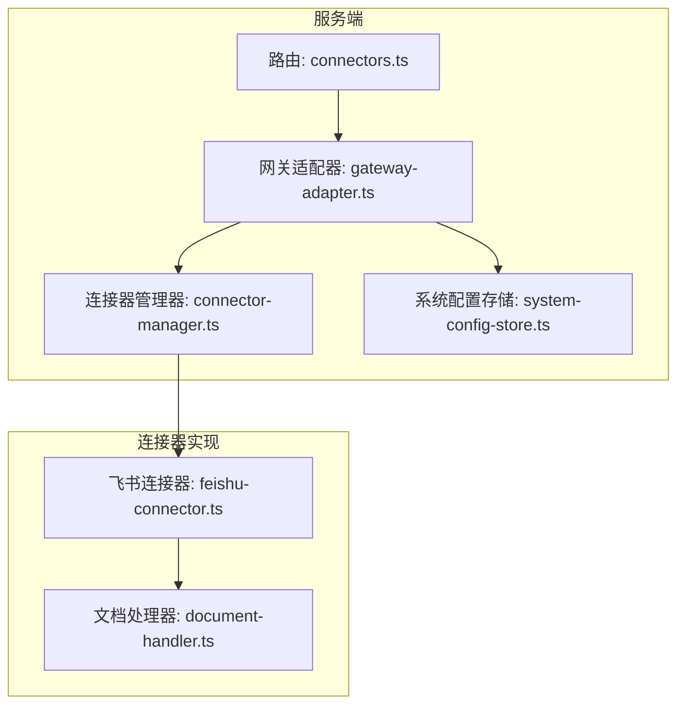
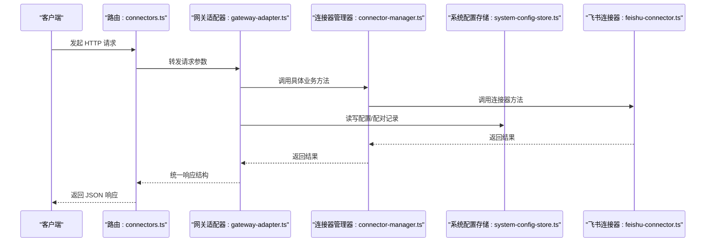
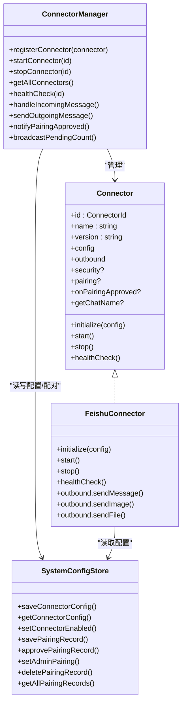

# 连接器管理 API

<cite>
**本文引用的文件**
- [connectors.ts](file://src/server/routes/connectors.ts)
- [gateway-adapter.ts](file://src/server/gateway-adapter.ts)
- [connector-manager.ts](file://src/main/connectors/connector-manager.ts)
- [feishu-connector.ts](file://src/main/connectors/feishu/feishu-connector.ts)
- [connector.ts](file://src/types/connector.ts)
- [system-config-store.ts](file://src/main/database/system-config-store.ts)
- [connector-config.ts](file://src/main/database/connector-config.ts)
- [document-handler.ts](file://src/main/connectors/feishu/document-handler.ts)
- [error-handler.ts](file://src/shared/utils/error-handler.ts)
</cite>

## 目录
1. [简介](#简介)
2. [项目结构](#项目结构)
3. [核心组件](#核心组件)
4. [架构总览](#架构总览)
5. [详细组件分析](#详细组件分析)
6. [依赖关系分析](#依赖关系分析)
7. [性能考量](#性能考量)
8. [故障排查指南](#故障排查指南)
9. [结论](#结论)

## 简介
本文件面向连接器管理 API 的使用者与维护者，系统性梳理连接器的 CRUD 与运行时管理能力，覆盖以下关键主题：
- 连接器的创建、获取、更新与删除（配置层面）
- 连接器生命周期：启动、停止、健康检查
- 配对与权限管理：生成配对码、批准配对、设置管理员、删除配对
- 飞书连接器等具体类型的配置要点与错误处理
- 健康检查机制与故障恢复策略

## 项目结构
连接器管理 API 位于服务端路由层，通过网关适配器对接到连接器管理器与数据库存储，形成“HTTP 路由 → 网关适配器 → 连接器管理器 → 连接器实现/数据库”的清晰分层。

图表来源
- [connectors.ts:1-215](file://src/server/routes/connectors.ts#L1-L215)
- [gateway-adapter.ts:367-527](file://src/server/gateway-adapter.ts#L367-L527)
- [connector-manager.ts:21-379](file://src/main/connectors/connector-manager.ts#L21-L379)
- [system-config-store.ts:444-463](file://src/main/database/system-config-store.ts#L444-L463)
- [feishu-connector.ts:28-50](file://src/main/connectors/feishu/feishu-connector.ts#L28-L50)
- [document-handler.ts:23-28](file://src/main/connectors/feishu/document-handler.ts#L23-L28)

章节来源
- [connectors.ts:1-215](file://src/server/routes/connectors.ts#L1-L215)
- [gateway-adapter.ts:367-527](file://src/server/gateway-adapter.ts#L367-L527)

## 核心组件
- 路由层：提供连接器管理的 HTTP 端点，封装请求参数与响应格式。
- 网关适配器：桥接 HTTP 与连接器管理器，负责调用具体业务方法并返回统一结构。
- 连接器管理器：集中管理连接器实例、生命周期与健康检查。
- 连接器实现：以飞书为例，包含配置加载/校验、消息收发、健康检查等。
- 数据持久化：系统配置存储负责连接器配置与配对记录的增删改查。

章节来源
- [connector-manager.ts:21-379](file://src/main/connectors/connector-manager.ts#L21-L379)
- [feishu-connector.ts:28-50](file://src/main/connectors/feishu/feishu-connector.ts#L28-L50)
- [system-config-store.ts:444-463](file://src/main/database/system-config-store.ts#L444-L463)

## 架构总览
连接器管理 API 的调用链路如下：

图表来源
- [connectors.ts:16-211](file://src/server/routes/connectors.ts#L16-L211)
- [gateway-adapter.ts:367-527](file://src/server/gateway-adapter.ts#L367-L527)
- [connector-manager.ts:45-81](file://src/main/connectors/connector-manager.ts#L45-L81)
- [system-config-store.ts:444-463](file://src/main/database/system-config-store.ts#L444-L463)
- [feishu-connector.ts:89-150](file://src/main/connectors/feishu/feishu-connector.ts#L89-L150)

## 详细组件分析

### API 端点清单与行为
- 获取所有连接器
  - 方法与路径：GET /api/connectors
  - 功能：返回连接器列表（含启用状态与配置存在性）
  - 响应：包含 success 与 connectors 数组
- 获取连接器配置
  - 方法与路径：GET /api/connectors/{connectorId}/config
  - 功能：返回指定连接器的配置与启用状态
  - 响应：包含 success、config、enabled
- 保存连接器配置
  - 方法与路径：POST /api/connectors/{connectorId}/config
  - 请求体：任意 JSON（由连接器实现自行校验）
  - 功能：保存配置并更新启用状态
  - 响应：包含 success 与 message
- 启动连接器
  - 方法与路径：POST /api/connectors/{connectorId}/start
  - 功能：更新启用状态并启动连接器
  - 响应：包含 success 与 message
- 停止连接器
  - 方法与路径：POST /api/connectors/{connectorId}/stop
  - 功能：停止连接器并更新启用状态
  - 响应：包含 success 与 message
- 健康检查
  - 方法与路径：GET /api/connectors/{connectorId}/health
  - 功能：查询连接器健康状态
  - 响应：包含 success、status、message
- 批准配对
  - 方法与路径：POST /api/connectors/pairing/approve
  - 请求体：{ pairingCode: string }
  - 功能：批准配对并通知连接器发送欢迎消息
  - 响应：包含 success 与 message
- 设置管理员
  - 方法与路径：POST /api/connectors/{connectorId}/pairing/{userId}/admin
  - 请求体：{ isAdmin: boolean }
  - 功能：设置/取消用户管理员权限
  - 响应：包含 success 与 message
- 删除配对
  - 方法与路径：DELETE /api/connectors/{connectorId}/pairing/{userId}
  - 功能：删除配对记录并推送待授权计数更新
  - 响应：包含 success 与 message
- 获取配对记录
  - 方法与路径：GET /api/connectors/pairing
  - 功能：获取所有配对记录（可按连接器筛选）
  - 响应：包含 success 与 records 数组

章节来源
- [connectors.ts:16-211](file://src/server/routes/connectors.ts#L16-L211)
- [gateway-adapter.ts:367-527](file://src/server/gateway-adapter.ts#L367-L527)

### 请求体与响应结构
- 通用响应结构
  - 成功响应：{ success: true, ... }
  - 失败响应：{ success: false, error: string }
- 获取连接器配置
  - 请求：路径参数 connectorId
  - 响应：{ success: true, config: object, enabled: boolean }
- 保存连接器配置
  - 请求体：任意 JSON（由连接器实现自行校验）
  - 响应：{ success: true, message: string }
- 启动/停止连接器
  - 请求：路径参数 connectorId
  - 响应：{ success: true, message: string }
- 健康检查
  - 请求：路径参数 connectorId
  - 响应：{ success: true, status: 'healthy'|'unhealthy', message: string }
- 批准配对
  - 请求体：{ pairingCode: string }
  - 响应：{ success: true, message: string }
- 设置管理员
  - 请求体：{ isAdmin: boolean }
  - 响应：{ success: true, message: string }
- 删除配对
  - 请求：路径参数 connectorId, userId
  - 响应：{ success: true, message: string }
- 获取配对记录
  - 请求：可选查询参数 connectorId
  - 响应：{ success: true, records: [...] }

章节来源
- [connectors.ts:16-211](file://src/server/routes/connectors.ts#L16-L211)
- [gateway-adapter.ts:392-527](file://src/server/gateway-adapter.ts#L392-L527)

### 飞书连接器配置示例与要点
- 配置字段（飞书）
  - appId: string（应用 ID）
  - appSecret: string（应用密钥）
  - requirePairing?: boolean（是否需要配对授权，默认 false）
- 配置加载与校验
  - 加载：从系统配置存储读取 JSON 并合并 enabled 字段
  - 校验：appId 与 appSecret 必填
- 健康检查
  - 基于内部状态（是否已启动、WebSocket 是否存在）快速判定
- 消息处理与去重
  - 基于 message_id 与近似内容窗口去重，避免重复处理
- 文档读取
  - 支持 docx/docs/wiki 与 sheets，自动提取 URL 并读取内容
- 发送消息
  - 支持文本、图片、文件；支持回复消息（reply API）

章节来源
- [connector.ts:153-157](file://src/types/connector.ts#L153-L157)
- [feishu-connector.ts:54-80](file://src/main/connectors/feishu/feishu-connector.ts#L54-L80)
- [feishu-connector.ts:235-248](file://src/main/connectors/feishu/feishu-connector.ts#L235-L248)
- [document-handler.ts:40-45](file://src/main/connectors/feishu/document-handler.ts#L40-L45)

### 配对与权限管理
- 生成配对码
  - 飞书：根据用户 ID 生成随机配对码并保存记录
  - 首位用户自动批准并设为管理员
- 批准配对
  - 通过配对码批准，更新记录并通知连接器发送欢迎消息
- 设置管理员
  - 为指定用户设置/取消管理员权限
- 删除配对
  - 删除用户与连接器的配对记录，并推送待授权计数更新
- 查询配对记录
  - 支持按连接器筛选，返回包含审批状态、管理员标记、创建/批准时间等

章节来源
- [gateway-adapter.ts:478-499](file://src/server/gateway-adapter.ts#L478-L499)
- [system-config-store.ts:499-539](file://src/main/database/system-config-store.ts#L499-L539)
- [connector-config.ts:116-132](file://src/main/database/connector-config.ts#L116-L132)
- [connector-config.ts:191-197](file://src/main/database/connector-config.ts#L191-L197)
- [connector-config.ts:202-207](file://src/main/database/connector-config.ts#L202-L207)

### 连接器生命周期与健康检查
- 启动流程
  - 加载配置并校验
  - 初始化连接器（如飞书 SDK Client）
  - 启动长连接（如 WebSocket）
- 停止流程
  - 关闭长连接与轮询任务
  - 更新启用状态
- 健康检查
  - 连接器内部状态检查（如 isStarted、wsClient 存在）
  - 返回统一健康状态结构

章节来源
- [connector-manager.ts:45-103](file://src/main/connectors/connector-manager.ts#L45-L103)
- [feishu-connector.ts:103-175](file://src/main/connectors/feishu/feishu-connector.ts#L103-L175)
- [feishu-connector.ts:235-248](file://src/main/connectors/feishu/feishu-connector.ts#L235-L248)

### 错误处理与统一响应
- 统一错误提取
  - 通过错误处理工具提取 message 字符串
- 路由层错误包装
  - 捕获异常并返回 { success: false, error: string }
- 网关适配器错误包装
  - 健康检查失败时返回 { success: false, status: 'unhealthy', message }

章节来源
- [error-handler.ts:8-13](file://src/shared/utils/error-handler.ts#L8-L13)
- [connectors.ts:20-26](file://src/server/routes/connectors.ts#L20-L26)
- [gateway-adapter.ts:469-475](file://src/server/gateway-adapter.ts#L469-L475)

## 依赖关系分析

图表来源
- [connector.ts:76-146](file://src/types/connector.ts#L76-L146)
- [feishu-connector.ts:28-50](file://src/main/connectors/feishu/feishu-connector.ts#L28-L50)
- [connector-manager.ts:21-379](file://src/main/connectors/connector-manager.ts#L21-L379)
- [system-config-store.ts:444-463](file://src/main/database/system-config-store.ts#L444-L463)

章节来源
- [connector.ts:76-146](file://src/types/connector.ts#L76-L146)
- [connector-manager.ts:21-379](file://src/main/connectors/connector-manager.ts#L21-L379)
- [system-config-store.ts:444-463](file://src/main/database/system-config-store.ts#L444-L463)

## 性能考量
- 飞书连接器的消息去重
  - 基于 message_id 的集合与基于内容的时间窗口去重，避免重复处理与资源浪费
- 健康检查快速判定
  - 直接检查内部状态，避免不必要的网络请求
- 异步处理与及时响应
  - 事件回调中尽快返回成功响应，异步处理后续逻辑，减少超时风险

章节来源
- [feishu-connector.ts:454-486](file://src/main/connectors/feishu/feishu-connector.ts#L454-L486)
- [feishu-connector.ts:235-248](file://src/main/connectors/feishu/feishu-connector.ts#L235-L248)

## 故障排查指南
- 启动失败
  - 检查配置是否加载成功与 enabled 状态
  - 校验连接器实现的 validate 返回值
  - 查看连接器内部日志与异常堆栈
- 健康检查异常
  - 若返回 not_found，确认连接器 ID 是否正确
  - 若返回 unhealthy，查看 message 中的具体原因
- 飞书文档读取失败
  - 检查飞书开放平台权限（docx/document:readonly、drive:drive:readonly、sheets 等）
  - 确认文档 URL 格式与权限范围
- 配对问题
  - 确认配对码是否正确、是否已批准
  - 检查管理员权限与用户 open_id 是否存在
- 统一错误处理
  - 使用错误处理工具提取 message 字符串，便于前端展示与定位

章节来源
- [connector-manager.ts:45-81](file://src/main/connectors/connector-manager.ts#L45-L81)
- [gateway-adapter.ts:454-475](file://src/server/gateway-adapter.ts#L454-L475)
- [document-handler.ts:115-129](file://src/main/connectors/feishu/document-handler.ts#L115-L129)
- [system-config-store.ts:499-539](file://src/main/database/system-config-store.ts#L499-L539)
- [error-handler.ts:8-13](file://src/shared/utils/error-handler.ts#L8-L13)

## 结论
连接器管理 API 通过清晰的路由层、统一的网关适配器与可扩展的连接器实现，提供了完整的连接器生命周期管理能力。配合系统配置存储与配对机制，能够满足多连接器场景下的配置、运行与运维需求。建议在生产环境中：
- 明确各连接器的配置字段与校验规则
- 使用健康检查与日志监控连接器状态
- 严格管理配对与管理员权限，确保安全可控
- 对消息去重与异步处理进行持续优化