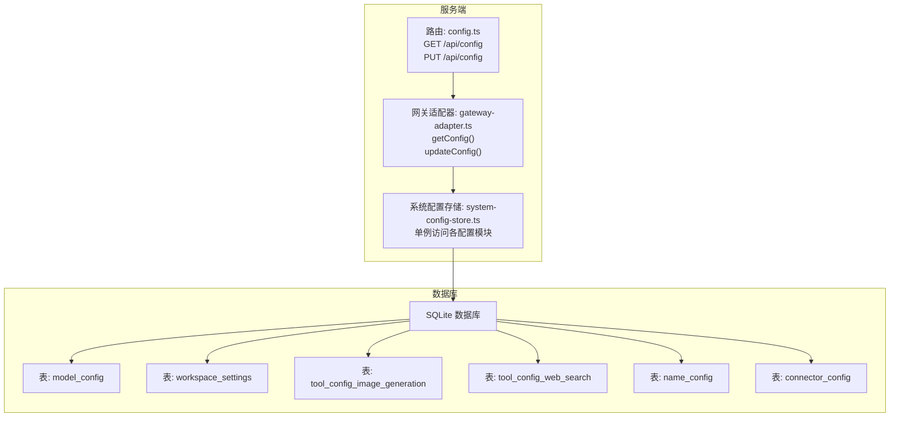
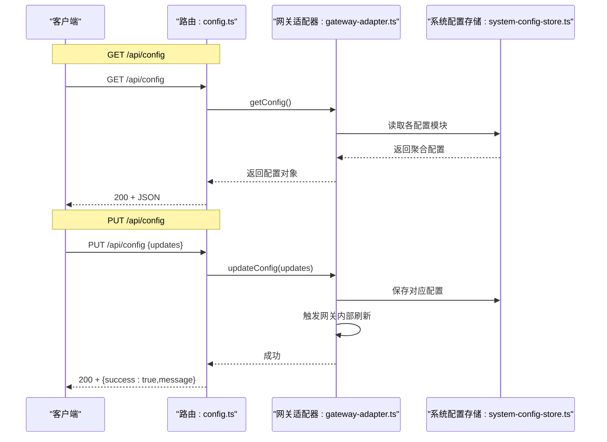
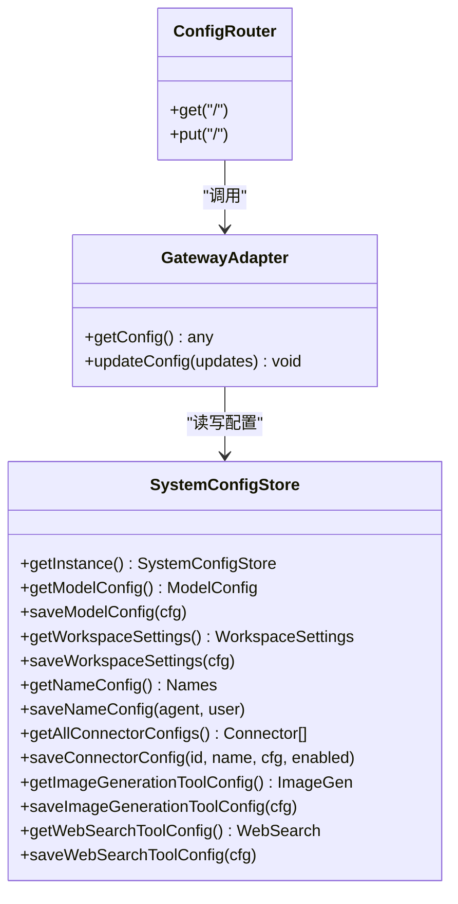

# 配置管理 API

<cite>
**本文引用的文件**
- [src/server/routes/config.ts](file://src/server/routes/config.ts)
- [src/server/gateway-adapter.ts](file://src/server/gateway-adapter.ts)
- [src/main/database/system-config-store.ts](file://src/main/database/system-config-store.ts)
- [src/main/database/config-types.ts](file://src/main/database/config-types.ts)
- [src/main/database/model-config.ts](file://src/main/database/model-config.ts)
- [src/main/database/workspace-config.ts](file://src/main/database/workspace-config.ts)
- [src/main/database/tool-config.ts](file://src/main/database/tool-config.ts)
- [src/main/database/name-config.ts](file://src/main/database/name-config.ts)
- [src/main/database/connector-config.ts](file://src/main/database/connector-config.ts)
- [src/shared/config/default-configs.ts](file://src/shared/config/default-configs.ts)
- [src/shared/utils/error-handler.ts](file://src/shared/utils/error-handler.ts)
- [src/shared/utils/validation.ts](file://src/shared/utils/validation.ts)
</cite>

## 目录
1. [简介](#简介)
2. [项目结构](#项目结构)
3. [核心组件](#核心组件)
4. [架构总览](#架构总览)
5. [详细组件分析](#详细组件分析)
6. [依赖关系分析](#依赖关系分析)
7. [性能考量](#性能考量)
8. [故障排查指南](#故障排查指南)
9. [结论](#结论)

## 简介
本文件为配置管理 API 的详细技术文档，覆盖以下内容：
- GET /api/config：获取系统配置
- PUT /api/config：更新系统配置
- 请求参数、响应格式、错误处理
- 配置项的数据类型、默认值与约束条件
- 配置更新的原子性与事务处理机制说明

## 项目结构
配置管理 API 的实现位于服务端路由层，通过网关适配器对接系统配置存储模块，并最终持久化到 SQLite 数据库。

图表来源
- [src/server/routes/config.ts:10-44](file://src/server/routes/config.ts#L10-L44)
- [src/server/gateway-adapter.ts:268-337](file://src/server/gateway-adapter.ts#L268-L337)
- [src/main/database/system-config-store.ts:37-566](file://src/main/database/system-config-store.ts#L37-L566)

章节来源
- [src/server/routes/config.ts:1-45](file://src/server/routes/config.ts#L1-L45)
- [src/server/gateway-adapter.ts:268-337](file://src/server/gateway-adapter.ts#L268-L337)
- [src/main/database/system-config-store.ts:37-566](file://src/main/database/system-config-store.ts#L37-L566)

## 核心组件
- 路由层：提供 /api/config 的 GET 和 PUT 端点，负责接收请求、解析参数、返回标准 JSON 响应。
- 网关适配器：封装配置读取与更新流程，协调系统配置存储模块与网关内部状态刷新。
- 系统配置存储：以单例方式访问 SQLite，提供各配置模块的读写能力。
- 配置类型定义：统一描述模型、工作空间、工具、名称、连接器等配置的数据结构与约束。
- 默认配置：提供默认值集合，便于前端与后端一致性使用。

章节来源
- [src/server/routes/config.ts:10-44](file://src/server/routes/config.ts#L10-L44)
- [src/server/gateway-adapter.ts:268-337](file://src/server/gateway-adapter.ts#L268-L337)
- [src/main/database/system-config-store.ts:37-566](file://src/main/database/system-config-store.ts#L37-L566)
- [src/main/database/config-types.ts:1-67](file://src/main/database/config-types.ts#L1-L67)
- [src/shared/config/default-configs.ts:1-133](file://src/shared/config/default-configs.ts#L1-L133)

## 架构总览
配置管理 API 的调用链路如下：

图表来源
- [src/server/routes/config.ts:17-38](file://src/server/routes/config.ts#L17-L38)
- [src/server/gateway-adapter.ts:268-337](file://src/server/gateway-adapter.ts#L268-L337)
- [src/main/database/system-config-store.ts:37-566](file://src/main/database/system-config-store.ts#L37-L566)

## 详细组件分析

### GET /api/config
- 功能：获取当前系统配置的完整快照。
- 请求
  - 方法：GET
  - 路径：/api/config
  - 查询参数：无
- 响应
  - 状态码：200
  - 响应体：包含以下键的聚合对象
    - model：模型配置对象
    - workspace：工作目录配置对象
    - names：名称配置对象（agentName、userName）
    - connectors：连接器配置数组（每个元素包含 connectorId、connectorName、config、enabled）
    - imageGeneration：图片生成工具配置对象
    - webSearch：网页搜索工具配置对象
    - isDocker：布尔值，指示运行模式是否为 Docker
- 错误处理
  - 服务器内部错误：返回 500，响应体包含 error 字段
- 示例
  - 请求：GET /api/config
  - 响应（示意）：
    {
      "model": { "providerType":"qwen","baseUrl":"...","modelId":"...","apiKey":"" },
      "workspace": { "workspaceDir":"...","scriptDir":"...","skillDirs":["..."],"defaultSkillDir":"...","imageDir":"...","memoryDir":"...","sessionDir":"..." },
      "names": { "agentName":"matrix","userName":"user" },
      "connectors": [ { "connectorId":"...","connectorName":"...","config":{},"enabled":false } ],
      "imageGeneration": { "provider":"gemini","model":"...","apiUrl":"...","apiKey":"" },
      "webSearch": { "provider":"qwen","model":"...","apiUrl":"...","apiKey":"" },
      "isDocker": false
    }

章节来源
- [src/server/routes/config.ts:17-24](file://src/server/routes/config.ts#L17-L24)
- [src/server/gateway-adapter.ts:268-285](file://src/server/gateway-adapter.ts#L268-L285)

### PUT /api/config
- 功能：批量更新系统配置。请求体为增量更新对象，仅包含需要变更的配置块。
- 请求
  - 方法：PUT
  - 路径：/api/config
  - 请求体：JSON 对象，可包含以下键（任选其一或多个）
    - model：模型配置对象
    - workspace：工作目录配置对象
    - names：名称配置对象（可包含 agentName、userName）
    - connectors：连接器配置数组（每个元素包含 connectorId、connectorName、config、enabled）
    - imageGeneration：图片生成工具配置对象
    - webSearch：网页搜索工具配置对象
- 响应
  - 状态码：200
  - 响应体：包含 success 字段与 message 字段
- 错误处理
  - 服务器内部错误：返回 500，响应体包含 error 字段
- 示例
  - 请求：PUT /api/config
    {
      "model": { "providerType":"qwen","baseUrl":"...","modelId":"...","apiKey":"..." },
      "workspace": { "workspaceDir":"...","scriptDir":"...","skillDirs":["..."],"defaultSkillDir":"...","imageDir":"...","memoryDir":"...","sessionDir":"..." }
    }
  - 响应：
    { "success": true, "message": "配置已更新" }

章节来源
- [src/server/routes/config.ts:30-38](file://src/server/routes/config.ts#L30-L38)
- [src/server/gateway-adapter.ts:288-337](file://src/server/gateway-adapter.ts#L288-L337)

### 配置项数据类型、默认值与约束条件

#### 模型配置（model）
- 数据类型：对象
- 字段
  - providerType：枚举，可选值见类型定义
  - providerId：字符串
  - providerName：字符串
  - baseUrl：字符串
  - modelId：字符串（主模型）
  - modelId2：字符串（快速模型，可选）
  - apiType：字符串
  - apiKey：字符串（建议加密存储）
  - contextWindow：整数（可选）
  - lastFetched：时间戳（可选）
  - fromEnv：布尔值（只读，表示来自环境变量）
- 默认值：来自默认配置集合
- 约束
  - 与环境变量的优先级：数据库配置优先于环境变量
  - 保存时会触发 WAL checkpoint，确保立即落盘
- 参考
  - 类型定义：[config-types.ts:34-46](file://src/main/database/config-types.ts#L34-L46)
  - 默认值：[default-configs.ts:103-112](file://src/shared/config/default-configs.ts#L103-L112)
  - 保存逻辑：[model-config.ts:100-134](file://src/main/database/model-config.ts#L100-L134)

#### 工作目录配置（workspace）
- 数据类型：对象
- 字段
  - workspaceDir：字符串（工作目录）
  - scriptDir：字符串（Python 脚本目录）
  - skillDirs：字符串数组（支持多路径）
  - defaultSkillDir：字符串（默认 Skill 目录）
  - imageDir：字符串（图片生成目录）
  - memoryDir：字符串（记忆管理目录）
  - sessionDir：字符串（会话目录）
- 默认值：根据运行模式（普通/Docker）决定
- 约束
  - Docker 模式下强制使用固定路径，忽略数据库配置
  - 保存时会将数组序列化为 JSON 存储
- 参考
  - 默认值与行为：[workspace-config.ts:17-46](file://src/main/database/workspace-config.ts#L17-L46)
  - 读取逻辑：[workspace-config.ts:51-89](file://src/main/database/workspace-config.ts#L51-L89)
  - 保存逻辑：[workspace-config.ts:94-102](file://src/main/database/workspace-config.ts#L94-L102)

#### 名称配置（names）
- 数据类型：对象
- 字段
  - agentName：字符串（智能体名字）
  - userName：字符串（用户称呼）
- 默认值：agentName 默认 "matrix"，userName 默认 "user"
- 约束
  - 名字长度限制为不超过 10 个字符，且不能为空
- 参考
  - 读取逻辑：[name-config.ts:10-41](file://src/main/database/name-config.ts#L10-L41)
  - 保存逻辑：[name-config.ts:112-139](file://src/main/database/name-config.ts#L112-L139)

#### 连接器配置（connectors）
- 数据类型：数组
- 数组元素对象
  - connectorId：字符串（连接器 ID）
  - connectorName：字符串（连接器名称）
  - config：对象（连接器配置 JSON）
  - enabled：布尔值（是否启用）
- 约束
  - 每个连接器独立保存，支持批量更新
- 参考
  - 保存逻辑：[connector-config.ts:13-38](file://src/main/database/connector-config.ts#L13-L38)
  - 读取逻辑：[connector-config.ts:65-87](file://src/main/database/connector-config.ts#L65-L87)

#### 图片生成工具配置（imageGeneration）
- 数据类型：对象
- 字段
  - provider：字符串（提供商）
  - model：字符串（模型名称）
  - apiUrl：字符串（API 地址）
  - apiKey：字符串（API Key）
- 默认值：来自默认配置集合
- 约束
  - 保存时采用单条记录（id=1）进行替换
- 参考
  - 类型定义：[config-types.ts:51-56](file://src/main/database/config-types.ts#L51-L56)
  - 默认值：[default-configs.ts:117-122](file://src/shared/config/default-configs.ts#L117-L122)
  - 保存逻辑：[tool-config.ts:37-55](file://src/main/database/tool-config.ts#L37-L55)

#### 网页搜索工具配置（webSearch）
- 数据类型：对象
- 字段
  - provider：字符串（提供商）
  - model：字符串（模型名称）
  - apiUrl：字符串（API 地址）
  - apiKey：字符串（API Key）
- 默认值：来自默认配置集合
- 约束
  - 保存时采用单条记录（id=1）进行替换
- 参考
  - 类型定义：[config-types.ts:61-66](file://src/main/database/config-types.ts#L61-L66)
  - 默认值：[default-configs.ts:127-132](file://src/shared/config/default-configs.ts#L127-L132)
  - 保存逻辑：[tool-config.ts:97-116](file://src/main/database/tool-config.ts#L97-L116)

### 配置更新的原子性与事务处理机制
- 当前实现
  - 路由层对单个请求的处理为顺序执行，未显式开启数据库事务。
  - 网关适配器在更新模型与工作空间配置后，会触发网关内部的配置重载，但该过程未包裹在数据库事务中。
- 影响
  - 若某一部分保存成功而后续步骤失败，可能出现部分更新状态。
  - 由于 SQLite 使用 WAL 模式，关键写入会尽快落盘，降低崩溃丢失风险。
- 建议
  - 对于需要强一致性的多步更新，可在网关适配器层引入数据库事务包裹，确保要么全部成功，要么全部回滚。
  - 对于易失败的外部服务校验（如模型连通性），应在事务外进行，避免阻塞数据库提交。

章节来源
- [src/server/routes/config.ts:30-38](file://src/server/routes/config.ts#L30-L38)
- [src/server/gateway-adapter.ts:288-337](file://src/server/gateway-adapter.ts#L288-L337)
- [src/main/database/system-config-store.ts:56-60](file://src/main/database/system-config-store.ts#L56-L60)

## 依赖关系分析

图表来源
- [src/server/routes/config.ts:10-44](file://src/server/routes/config.ts#L10-L44)
- [src/server/gateway-adapter.ts:268-337](file://src/server/gateway-adapter.ts#L268-L337)
- [src/main/database/system-config-store.ts:37-566](file://src/main/database/system-config-store.ts#L37-L566)

章节来源
- [src/server/routes/config.ts:10-44](file://src/server/routes/config.ts#L10-L44)
- [src/server/gateway-adapter.ts:268-337](file://src/server/gateway-adapter.ts#L268-L337)
- [src/main/database/system-config-store.ts:37-566](file://src/main/database/system-config-store.ts#L37-L566)

## 性能考量
- 数据库模式
  - 使用 WAL 模式提升并发写入性能与崩溃恢复能力。
- 缓存策略
  - 模型配置具备内存缓存，减少频繁查询数据库的开销。
- I/O 行为
  - 关键写入后执行 wal_checkpoint，确保数据尽快落盘。
- 建议
  - 对于高频更新场景，可考虑批量合并更新请求，减少多次写入。
  - 对于大型 JSON 配置，建议在客户端进行必要的校验后再提交，减少无效写入。

章节来源
- [src/main/database/system-config-store.ts:56-60](file://src/main/database/system-config-store.ts#L56-L60)
- [src/main/database/model-config.ts:14-16](file://src/main/database/model-config.ts#L14-L16)
- [src/main/database/model-config.ts:121-126](file://src/main/database/model-config.ts#L121-L126)

## 故障排查指南
- 常见错误
  - 服务器内部错误：路由层捕获异常并返回 500，响应体包含 error 字段。
  - 参数校验失败：名称配置保存时若长度超限或为空，会抛出错误。
- 排查步骤
  - 检查请求体结构是否符合各配置模块的类型定义。
  - 查看后端日志中关于配置保存与缓存清除的信息。
  - 确认 Docker 模式下的路径限制与默认值覆盖逻辑。
- 参考
  - 错误提取工具：[error-handler.ts:8-13](file://src/shared/utils/error-handler.ts#L8-L13)
  - 名称配置校验：[name-config.ts:47-55](file://src/main/database/name-config.ts#L47-L55)

章节来源
- [src/server/routes/config.ts:21-23](file://src/server/routes/config.ts#L21-L23)
- [src/shared/utils/error-handler.ts:8-13](file://src/shared/utils/error-handler.ts#L8-L13)
- [src/main/database/name-config.ts:47-55](file://src/main/database/name-config.ts#L47-L55)

## 结论
- GET /api/config 提供了系统配置的完整视图，适合前端初始化与展示。
- PUT /api/config 支持按需增量更新，便于逐步调整配置。
- 当前实现未在路由层引入数据库事务，建议在需要强一致性的场景中增强事务语义。
- 通过类型定义与默认配置，前后端在配置项的数据结构与默认值上保持一致，有利于维护与扩展。