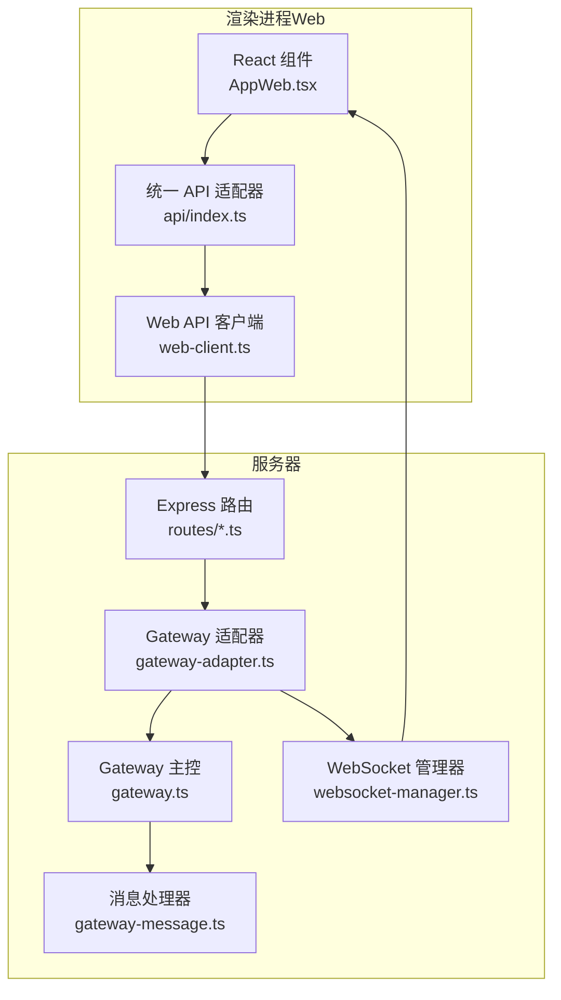
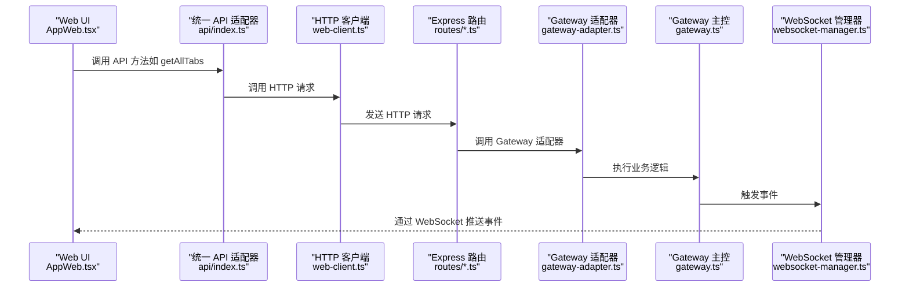
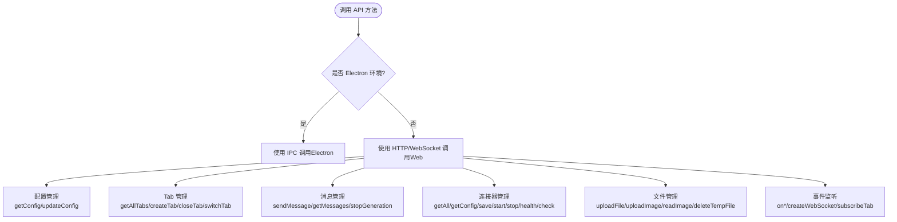
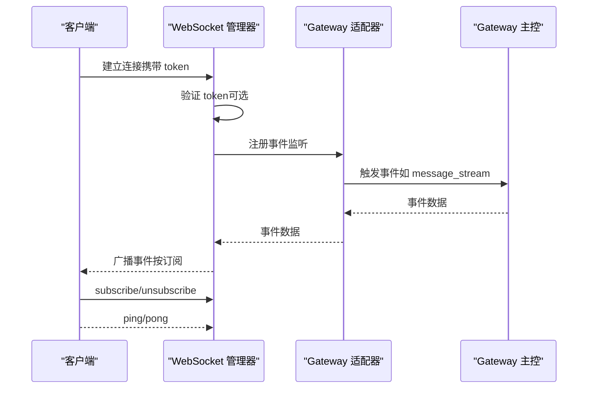
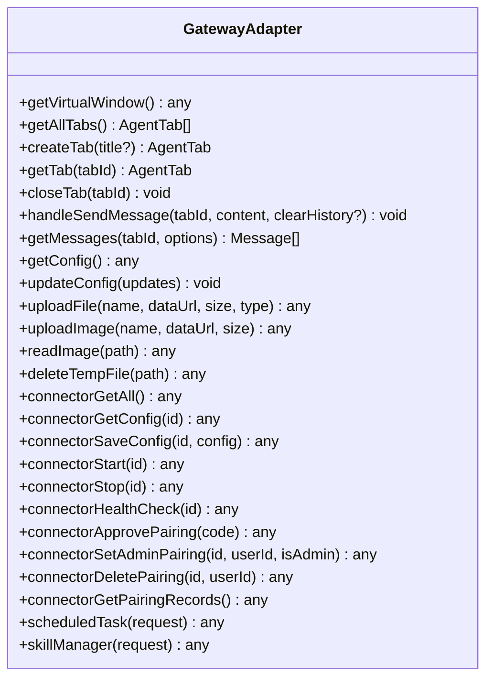
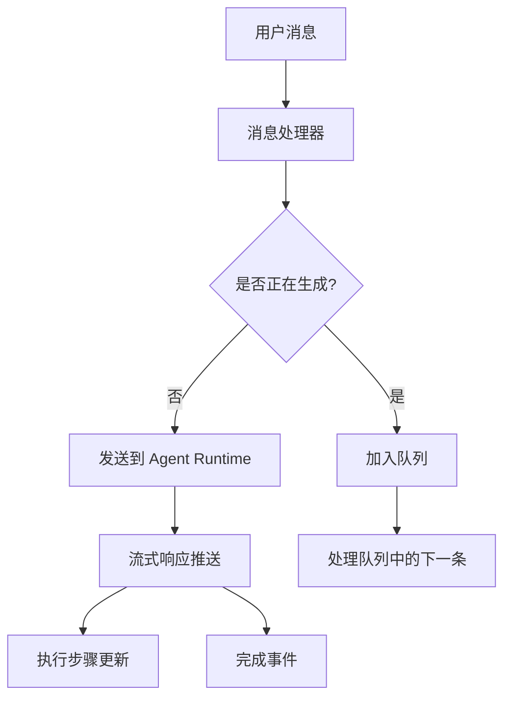
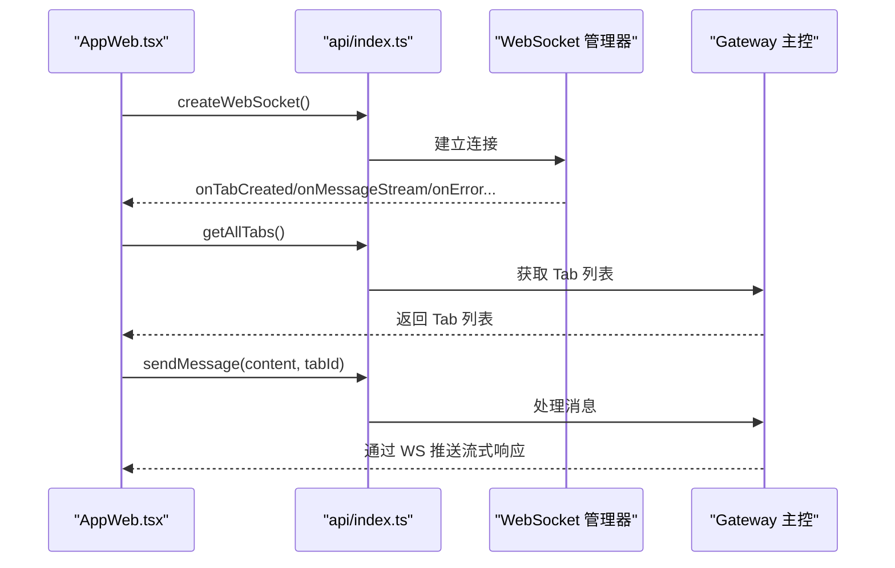
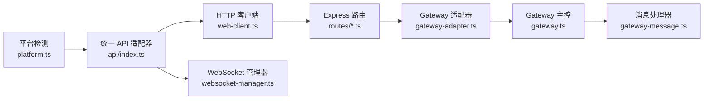

# Web 客户端 API

<cite>
**本文档引用的文件**
- [web-client.ts](file://src/renderer/api/web-client.ts)
- [index.ts](file://src/renderer/api/index.ts)
- [platform.ts](file://src/renderer/utils/platform.ts)
- [gateway-adapter.ts](file://src/server/gateway-adapter.ts)
- [websocket-manager.ts](file://src/server/websocket-manager.ts)
- [config.ts](file://src/server/routes/config.ts)
- [tabs.ts](file://src/server/routes/tabs.ts)
- [gateway.ts](file://src/main/gateway.ts)
- [gateway-message.ts](file://src/main/gateway-message.ts)
- [AppWeb.tsx](file://src/renderer/AppWeb.tsx)
- [package.json](file://package.json)
- [README.md](file://README.md)
</cite>

## 目录
1. [简介](#简介)
2. [项目结构](#项目结构)
3. [核心组件](#核心组件)
4. [架构总览](#架构总览)
5. [详细组件分析](#详细组件分析)
6. [依赖关系分析](#依赖关系分析)
7. [性能考虑](#性能考虑)
8. [故障排除指南](#故障排除指南)
9. [结论](#结论)
10. [附录](#附录)

## 简介
本文件为 史丽慧小助理 Web 客户端 API 的使用文档，面向前端 JavaScript 开发者，详细说明如何通过 HTTP 与 WebSocket 与后端通信。内容涵盖客户端初始化配置、API 调用方法、错误处理与状态管理，并提供完整的前端集成示例、SDK 使用指南与最佳实践。同时解释 Web 客户端与 Electron 版本的差异与兼容性注意事项。

## 项目结构
史丽慧小助理 采用统一 API 适配器，通过运行环境自动选择 IPC（Electron）或 HTTP/WebSocket（Web）。Web 模式下，渲染进程通过统一 API 适配器调用 HTTP 接口与后端交互，并通过 WebSocket 接收实时事件推送。



**图表来源**
- [AppWeb.tsx:1-784](file://src/renderer/AppWeb.tsx#L1-L784)
- [index.ts:1-551](file://src/renderer/api/index.ts#L1-L551)
- [web-client.ts:1-227](file://src/renderer/api/web-client.ts#L1-L227)
- [gateway-adapter.ts:1-763](file://src/server/gateway-adapter.ts#L1-L763)
- [websocket-manager.ts:1-381](file://src/server/websocket-manager.ts#L1-L381)
- [gateway.ts:1-772](file://src/main/gateway.ts#L1-L772)
- [gateway-message.ts:1-525](file://src/main/gateway-message.ts#L1-L525)

**章节来源**
- [AppWeb.tsx:1-784](file://src/renderer/AppWeb.tsx#L1-L784)
- [index.ts:1-551](file://src/renderer/api/index.ts#L1-L551)
- [web-client.ts:1-227](file://src/renderer/api/web-client.ts#L1-L227)

## 核心组件
- Web API 客户端：封装 HTTP 请求与 WebSocket 创建，负责认证令牌管理与错误处理。
- 统一 API 适配器：根据运行环境（Electron/Web）自动选择 IPC 或 HTTP/WebSocket 调用，提供统一的 API 接口。
- WebSocket 管理器：负责连接建立、订阅管理、事件广播与心跳处理。
- Gateway 适配器：将 Electron IPC 概念映射到 Web，将 Gateway 的事件转换为 WebSocket 事件。
- 网关与消息处理器：负责会话管理、消息队列、流式响应与错误恢复。

**章节来源**
- [web-client.ts:1-227](file://src/renderer/api/web-client.ts#L1-L227)
- [index.ts:1-551](file://src/renderer/api/index.ts#L1-L551)
- [websocket-manager.ts:1-381](file://src/server/websocket-manager.ts#L1-L381)
- [gateway-adapter.ts:1-763](file://src/server/gateway-adapter.ts#L1-L763)
- [gateway.ts:1-772](file://src/main/gateway.ts#L1-L772)
- [gateway-message.ts:1-525](file://src/main/gateway-message.ts#L1-L525)

## 架构总览
Web 客户端通过统一 API 适配器与后端交互，HTTP 路由负责配置与 Tab 管理，WebSocket 负责实时事件推送。Gateway 适配器将 Gateway 的事件转换为 WebSocket 事件，确保 Web 端与 Electron 端行为一致。



**图表来源**
- [AppWeb.tsx:1-784](file://src/renderer/AppWeb.tsx#L1-L784)
- [index.ts:1-551](file://src/renderer/api/index.ts#L1-L551)
- [web-client.ts:1-227](file://src/renderer/api/web-client.ts#L1-L227)
- [config.ts:1-45](file://src/server/routes/config.ts#L1-L45)
- [tabs.ts:1-137](file://src/server/routes/tabs.ts#L1-L137)
- [gateway-adapter.ts:1-763](file://src/server/gateway-adapter.ts#L1-L763)
- [websocket-manager.ts:1-381](file://src/server/websocket-manager.ts#L1-L381)

## 详细组件分析

### Web API 客户端（web-client.ts）
- 动态获取 API 基础地址：优先使用环境变量，否则使用当前页面主机地址。
- 认证管理：通过 localStorage 存取 Bearer Token；登录成功保存 token，登出清除 token；HTTP 请求自动附加 Authorization 头。
- HTTP 请求封装：统一错误处理，401 自动清除 token 并抛出错误；非 2xx 响应解析错误信息并抛出。
- 配置管理：获取与更新系统配置。
- Tab 管理：获取所有 Tab、创建新 Tab、获取指定 Tab、关闭 Tab。
- 消息管理：发送消息、获取消息历史。
- WebSocket：创建连接，URL 从 HTTP 基础地址转换为 ws://，附加 token 查询参数。

```mermaid
classDiagram
class WebClient {
+login(password) Promise~{token}~
+logout() void
+isAuthenticated() boolean
+getConfig() Promise~any~
+updateConfig(updates) Promise~void~
+getTabs() Promise~AgentTab[]~
+createTab(title?) Promise~AgentTab~
+getTab(tabId) Promise~AgentTab~
+closeTab(tabId) Promise~void~
+sendMessage(tabId, content, clearHistory?) Promise~void~
+getMessages(tabId, limit, before?) Promise~{messages, hasMore}~
+createWebSocket() WebSocket
+get(endpoint) Promise~any~
+post(endpoint, data) Promise~any~
+delete(endpoint) Promise~any~
}
```

**图表来源**
- [web-client.ts:1-227](file://src/renderer/api/web-client.ts#L1-L227)

**章节来源**
- [web-client.ts:1-227](file://src/renderer/api/web-client.ts#L1-L227)

### 统一 API 适配器（api/index.ts）
- 环境检测：通过平台工具判断是否为 Electron 环境。
- Web 模式适配：在 Web 环境下，使用 HTTP 客户端与后端交互；在 Electron 环境下使用 IPC。
- 认证：Web 模式下调用 HTTP 登录，Electron 模式下抛出错误提示。
- 配置管理：获取与更新系统配置；模型配置、工作目录、图片生成、网页搜索等配置的读取与保存。
- 连接器管理：获取连接器列表、配置、启动/停止、健康检查、配对审批与权限管理。
- 定时任务：提交定时任务请求。
- Tab 管理：获取所有 Tab、创建新 Tab、关闭 Tab、切换 Tab（自动订阅 WebSocket）。
- 消息管理：发送消息、停止生成。
- 文件管理：上传文件/图片、读取图片、删除临时文件。
- 事件监听：注册与注销 WebSocket 事件监听器；提供 Web 模式下的事件分发与订阅管理。
- WebSocket 管理：创建 WebSocket 连接，批量订阅所有 Tab，处理连接、消息、关闭与错误事件。



**图表来源**
- [index.ts:1-551](file://src/renderer/api/index.ts#L1-L551)

**章节来源**
- [index.ts:1-551](file://src/renderer/api/index.ts#L1-L551)

### WebSocket 管理器（websocket-manager.ts）
- 连接管理：验证 Token（可选），建立连接，维护客户端映射与订阅集合。
- 订阅管理：支持订阅/取消订阅指定 Tab，批量订阅所有 Tab。
- 事件广播：将 Gateway 事件转换为 WebSocket 消息并广播至订阅客户端。
- 心跳与错误：处理 ping/pong 心跳，连接断开时停止对应 Tab 的 Agent 执行。
- 踢人机制：同一用户的新连接会踢掉旧连接，并发送被踢事件。



**图表来源**
- [websocket-manager.ts:1-381](file://src/server/websocket-manager.ts#L1-L381)
- [gateway-adapter.ts:1-763](file://src/server/gateway-adapter.ts#L1-L763)
- [gateway.ts:1-772](file://src/main/gateway.ts#L1-L772)

**章节来源**
- [websocket-manager.ts:1-381](file://src/server/websocket-manager.ts#L1-L381)

### Gateway 适配器（gateway-adapter.ts）
- 虚拟窗口：在 Web 模式下模拟 Electron 的 BrowserWindow 与 webContents，将 IPC 消息转换为事件。
- 事件转换：将 IPC 通道映射为 WebSocket 事件（如 message_stream、execution_step_update、tab_created 等）。
- 配置与 Tab 管理：提供获取与更新配置、创建/获取/关闭 Tab、获取消息历史等方法。
- 文件上传与读取：实现文件与图片上传、读取图片为 Data URL、删除临时文件。
- 连接器管理：获取连接器列表、配置、启动/停止、健康检查、配对记录管理。
- 定时任务与技能管理：提交定时任务请求与技能管理请求。



**图表来源**
- [gateway-adapter.ts:1-763](file://src/server/gateway-adapter.ts#L1-L763)

**章节来源**
- [gateway-adapter.ts:1-763](file://src/server/gateway-adapter.ts#L1-L763)

### 网关与消息处理器（gateway.ts, gateway-message.ts）
- 网关主控：管理会话生命周期、消息路由、连接器与定时任务、内存与工作目录配置重载。
- 消息处理器：处理用户消息发送、消息队列、流式响应、错误处理与自动恢复、执行步骤实时更新。
- 事件传播：通过 Gateway 适配器将消息流、执行步骤、错误、Tab 事件等转换为 WebSocket 事件。



**图表来源**
- [gateway.ts:1-772](file://src/main/gateway.ts#L1-L772)
- [gateway-message.ts:1-525](file://src/main/gateway-message.ts#L1-L525)

**章节来源**
- [gateway.ts:1-772](file://src/main/gateway.ts#L1-L772)
- [gateway-message.ts:1-525](file://src/main/gateway-message.ts#L1-L525)

### Web 应用集成（AppWeb.tsx）
- 登录状态管理：检查 localStorage 中的 auth_token，决定是否进入登录流程。
- WebSocket 连接：登录成功后自动建立连接，并监听被踢事件。
- Tab 管理：加载所有 Tab，监听 Tab 创建/更新/消息清空/历史加载等事件，自动订阅新 Tab。
- 消息流处理：监听 message_stream、execution-step:update、message:error 等事件，实时更新 UI。
- 发送消息：校验模型配置，构造包含图片/文件引用的消息，调用 API 发送。
- 停止生成：调用 API 停止当前会话的生成。



**图表来源**
- [AppWeb.tsx:1-784](file://src/renderer/AppWeb.tsx#L1-L784)
- [index.ts:1-551](file://src/renderer/api/index.ts#L1-L551)
- [websocket-manager.ts:1-381](file://src/server/websocket-manager.ts#L1-L381)
- [gateway.ts:1-772](file://src/main/gateway.ts#L1-L772)

**章节来源**
- [AppWeb.tsx:1-784](file://src/renderer/AppWeb.tsx#L1-L784)

## 依赖关系分析
- 运行时环境检测：通过平台工具判断是否为 Electron 环境，从而选择 IPC 或 HTTP/WebSocket。
- HTTP 路由：配置与 Tab 管理路由分别处理 GET/PUT/POST/DELETE 请求。
- WebSocket 管理：集中管理连接、订阅与事件广播。
- Gateway 适配器：作为桥梁，将 Gateway 的事件转换为 WebSocket 事件，保证 Web 与 Electron 的行为一致性。



**图表来源**
- [platform.ts:1-27](file://src/renderer/utils/platform.ts#L1-L27)
- [index.ts:1-551](file://src/renderer/api/index.ts#L1-L551)
- [web-client.ts:1-227](file://src/renderer/api/web-client.ts#L1-L227)
- [websocket-manager.ts:1-381](file://src/server/websocket-manager.ts#L1-L381)
- [gateway-adapter.ts:1-763](file://src/server/gateway-adapter.ts#L1-L763)
- [gateway.ts:1-772](file://src/main/gateway.ts#L1-L772)
- [gateway-message.ts:1-525](file://src/main/gateway-message.ts#L1-L525)

**章节来源**
- [platform.ts:1-27](file://src/renderer/utils/platform.ts#L1-L27)
- [index.ts:1-551](file://src/renderer/api/index.ts#L1-L551)

## 性能考虑
- WebSocket 连接复用：统一 API 适配器维护单例 WebSocket 实例，避免重复连接。
- 批量订阅：连接建立后自动订阅所有 Tab，减少历史消息遗漏风险。
- 事件分发：使用 Map 结构存储事件监听器，便于快速分发与清理。
- 消息队列：消息处理器对并发消息进行队列管理，避免 Agent 状态冲突。
- 自动恢复：AI 连接错误时自动清理缓存并重置 Runtime，提升稳定性。

[本节为通用性能讨论，不直接分析具体文件]

## 故障排除指南
- 401 未授权：HTTP 请求返回 401 时，客户端会清除本地 token 并抛出错误。请重新登录获取有效 token。
- 连接被踢：WebSocket 收到 session:kicked 事件时，UI 展示遮罩层并提供重新连接按钮。
- 模型未配置：发送消息前检查模型配置，若未配置则提示前往系统设置配置。
- 网关未初始化：首次加载 Tab 失败时，UI 会进行重试，等待网关初始化完成。
- 文件上传限制：图片最大 5MB，文件最大 500MB；超出限制会返回错误信息。

**章节来源**
- [web-client.ts:57-68](file://src/renderer/api/web-client.ts#L57-L68)
- [AppWeb.tsx:64-71](file://src/renderer/AppWeb.tsx#L64-L71)
- [AppWeb.tsx:298-321](file://src/renderer/AppWeb.tsx#L298-L321)
- [gateway-adapter.ts:558-625](file://src/server/gateway-adapter.ts#L558-L625)

## 结论
史丽慧小助理 Web 客户端通过统一 API 适配器实现了与 Electron 版本一致的交互体验。Web 模式下，HTTP 与 WebSocket 的组合提供了完善的配置管理、Tab 管理、消息流式传输与事件推送能力。开发者只需关注统一 API 的使用，即可在 Web 环境中实现与桌面版相同的功能与体验。

[本节为总结性内容，不直接分析具体文件]

## 附录

### 环境变量与配置
- VITE_API_URL：HTTP API 基础地址（优先使用），未设置时使用当前页面主机地址。
- ACCESS_PASSWORD/JWT_SECRET：WebSocket 认证相关（可选），未设置时允许匿名连接。
- 端口与部署：默认端口 3008，Docker 环境下可通过 docker-compose 配置。

**章节来源**
- [web-client.ts:10-11](file://src/renderer/api/web-client.ts#L10-L11)
- [websocket-manager.ts:20-21](file://src/server/websocket-manager.ts#L20-L21)
- [README.md:73-98](file://README.md#L73-L98)

### 前端集成示例
- 初始化：在应用启动时检查 localStorage 中的 auth_token，若存在则进入登录状态。
- 建立连接：登录成功后调用 api.createWebSocket() 建立 WebSocket 连接。
- 监听事件：注册 onMessageStream、onExecutionStepUpdate、onTabCreated 等事件监听器。
- 发送消息：调用 api.sendMessage(content, activeTabId)，并在 UI 中展示流式响应。
- 停止生成：调用 api.stopGeneration(activeTabId)。

**章节来源**
- [AppWeb.tsx:42-61](file://src/renderer/AppWeb.tsx#L42-L61)
- [AppWeb.tsx:377-411](file://src/renderer/AppWeb.tsx#L377-L411)
- [AppWeb.tsx:614-678](file://src/renderer/AppWeb.tsx#L614-L678)

### SDK 使用指南与最佳实践
- 使用统一 API 适配器：避免直接调用 Electron IPC，统一通过 api/index.ts 调用。
- 认证与状态：始终检查登录状态，登录成功后再建立 WebSocket 连接。
- 事件监听：在组件卸载时及时注销事件监听器，避免内存泄漏。
- 错误处理：捕获并展示错误信息，必要时引导用户前往系统设置配置模型。
- 文件上传：遵循大小限制，上传后及时清理临时文件。

**章节来源**
- [index.ts:1-551](file://src/renderer/api/index.ts#L1-L551)
- [AppWeb.tsx:344-374](file://src/renderer/AppWeb.tsx#L344-L374)

### Web 与 Electron 差异与兼容性
- 环境检测：通过 isElectron() 判断运行环境，自动选择 IPC 或 HTTP/WebSocket。
- 功能差异：Web 模式不支持 Chrome 调试、打开路径、文件夹选择等仅 Electron 支持的功能。
- 事件一致性：通过 Gateway 适配器将 IPC 事件转换为 WebSocket 事件，保证行为一致。
- 配置差异：Web 模式下从 getConfig 获取 isDocker 标识，用于设置默认工作目录。

**章节来源**
- [platform.ts:1-27](file://src/renderer/utils/platform.ts#L1-L27)
- [index.ts:23-35](file://src/renderer/api/index.ts#L23-L35)
- [index.ts:182-185](file://src/renderer/api/index.ts#L182-L185)
- [gateway-adapter.ts:357-362](file://src/server/gateway-adapter.ts#L357-L362)