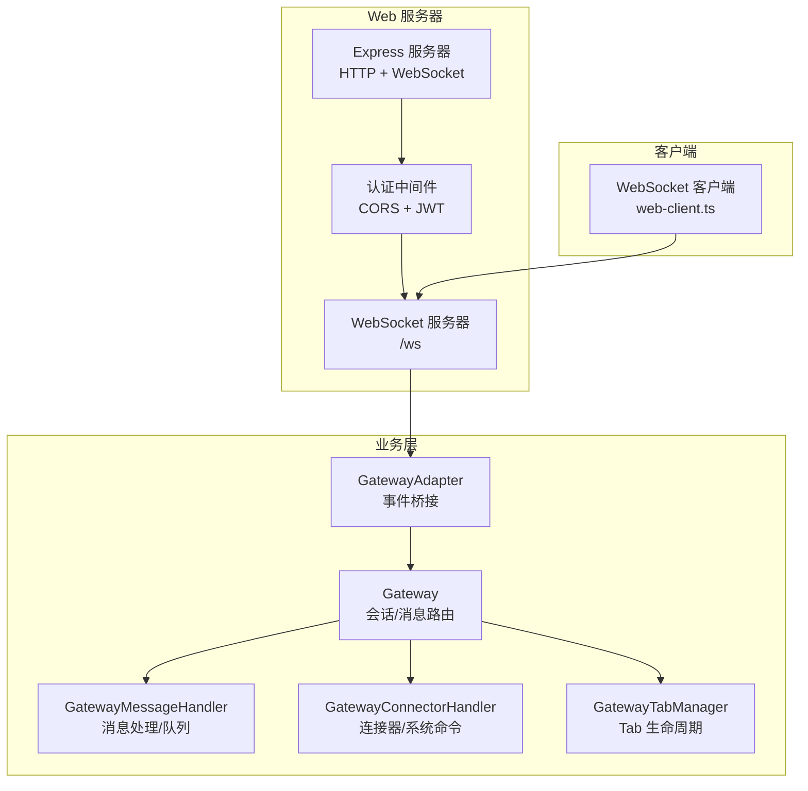
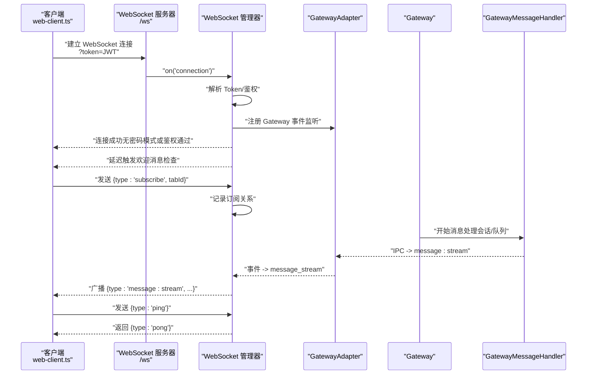
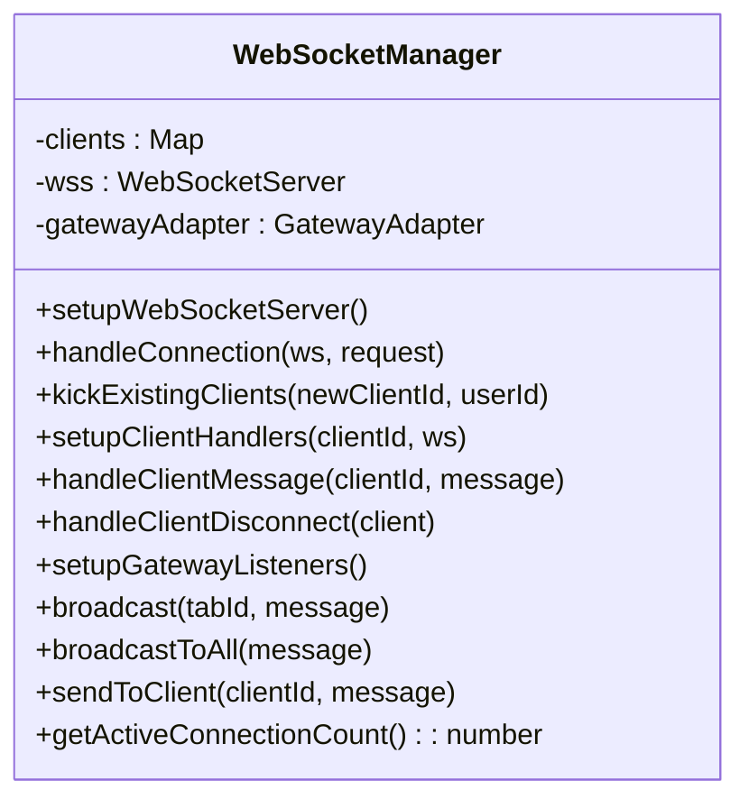
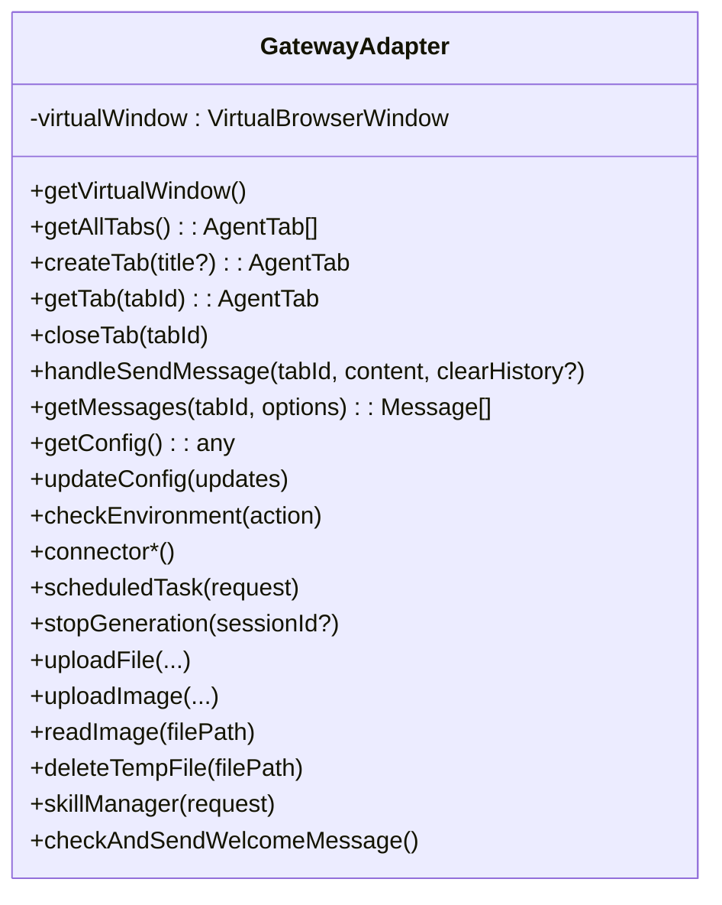
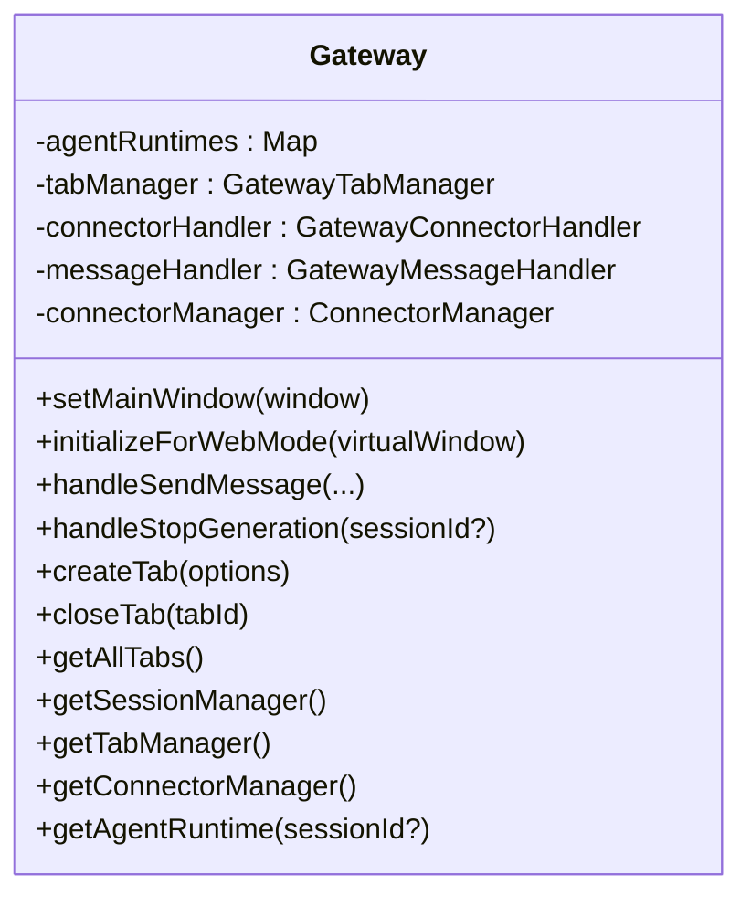
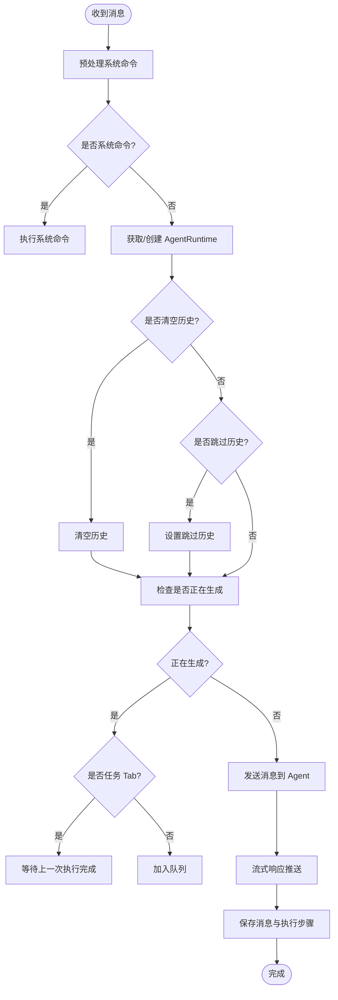
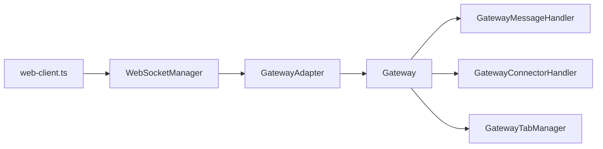

# WebSocket API

<cite>
**本文档引用的文件**
- [websocket-manager.ts](file://src/server/websocket-manager.ts)
- [gateway-adapter.ts](file://src/server/gateway-adapter.ts)
- [gateway.ts](file://src/main/gateway.ts)
- [gateway-message.ts](file://src/main/gateway-message.ts)
- [gateway-connector.ts](file://src/main/gateway-connector.ts)
- [gateway-tab.ts](file://src/main/gateway-tab.ts)
- [types.ts](file://src/server/types.ts)
- [index.ts](file://src/server/index.ts)
- [web-client.ts](file://src/renderer/api/web-client.ts)
- [message.ts](file://src/types/message.ts)
- [agent-tab.ts](file://src/types/agent-tab.ts)
</cite>

## 目录
1. [简介](#简介)
2. [项目结构](#项目结构)
3. [核心组件](#核心组件)
4. [架构总览](#架构总览)
5. [详细组件分析](#详细组件分析)
6. [依赖关系分析](#依赖关系分析)
7. [性能考量](#性能考量)
8. [故障排查指南](#故障排查指南)
9. [结论](#结论)
10. [附录](#附录)

## 简介
本文件为 DeepBot 的 WebSocket API 文档，覆盖连接建立、消息格式、事件类型、消息路由、连接状态管理、错误处理与重连策略、客户端示例、消息收发流程以及实时数据推送机制。文档同时解释 WebSocket 在 DeepBot 中的应用场景与最佳实践，帮助开发者与集成方快速理解并正确使用。

## 项目结构
DeepBot 的 WebSocket 能力由 Web 服务器侧提供，核心模块包括：
- Web 服务器入口与路由：负责启动 HTTP 与 WebSocket 服务、认证中间件与 API 路由
- WebSocket 管理器：负责连接接入、鉴权、订阅管理、消息广播
- Gateway 适配器：将 Gateway 的内部事件转换为 WebSocket 事件
- Gateway 核心：会话管理、消息路由、Agent 执行与状态
- 渲染端 WebSocket 客户端：提供创建连接、订阅/取消订阅、心跳与事件监听的封装

图表来源
- [index.ts:33-128](file://src/server/index.ts#L33-L128)
- [websocket-manager.ts:29-38](file://src/server/websocket-manager.ts#L29-L38)
- [gateway-adapter.ts:45-65](file://src/server/gateway-adapter.ts#L45-L65)
- [gateway.ts:29-114](file://src/main/gateway.ts#L29-L114)
- [gateway-message.ts:31-64](file://src/main/gateway-message.ts#L31-L64)
- [gateway-connector.ts:44-88](file://src/main/gateway-connector.ts#L44-L88)
- [gateway-tab.ts:26-61](file://src/main/gateway-tab.ts#L26-L61)
- [web-client.ts:194-199](file://src/renderer/api/web-client.ts#L194-L199)

章节来源
- [index.ts:33-128](file://src/server/index.ts#L33-L128)

## 核心组件
- WebSocket 管理器：负责连接接入、Token 鉴权、订阅管理、消息广播、断开清理与欢迎消息触发
- Gateway 适配器：将 Gateway 内部事件（消息流、执行步骤、错误、Tab 事件等）转换为 WebSocket 事件
- Gateway：会话生命周期、消息路由、Agent 执行、连接器与系统命令处理
- 渲染端客户端：封装 WebSocket 连接创建、订阅/取消订阅、心跳与事件监听

章节来源
- [websocket-manager.ts:29-38](file://src/server/websocket-manager.ts#L29-L38)
- [gateway-adapter.ts:45-65](file://src/server/gateway-adapter.ts#L45-L65)
- [gateway.ts:29-114](file://src/main/gateway.ts#L29-L114)
- [web-client.ts:194-199](file://src/renderer/api/web-client.ts#L194-L199)

## 架构总览
WebSocket 在 DeepBot 中承担“实时消息通道”的职责，将 Gateway 的内部事件以统一的 WebSocket 消息格式推送到客户端。客户端通过订阅特定 Tab 的消息，实现按需接收实时流式响应与状态更新。

图表来源
- [index.ts:40-60](file://src/server/index.ts#L40-L60)
- [websocket-manager.ts:43-125](file://src/server/websocket-manager.ts#L43-L125)
- [gateway-adapter.ts:70-196](file://src/server/gateway-adapter.ts#L70-L196)
- [gateway-message.ts:376-473](file://src/main/gateway-message.ts#L376-L473)
- [web-client.ts:194-199](file://src/renderer/api/web-client.ts#L194-L199)

## 详细组件分析

### WebSocket 管理器（WebSocketManager）
职责与行为
- 连接接入：监听 WebSocket 连接事件，解析 URL 查询参数中的 Token
- 鉴权：支持无密码模式与 JWT 模式；JWT 通过环境变量密钥校验
- 同用户多设备：新连接到来时，向旧连接推送“被踢”事件并关闭
- 订阅管理：维护客户端与 Tab 的订阅关系，支持 subscribe/unsubscribe
- 消息广播：按订阅关系广播消息，或广播至所有客户端
- 事件监听：注册 GatewayAdapter 的事件监听，将内部事件转为 WebSocket 消息
- 欢迎消息：连接后延迟触发欢迎消息检查
- 断开处理：客户端断开时，停止其订阅的所有 Tab 的 Agent 执行

图表来源
- [websocket-manager.ts:29-381](file://src/server/websocket-manager.ts#L29-L381)

章节来源
- [websocket-manager.ts:43-125](file://src/server/websocket-manager.ts#L43-L125)
- [websocket-manager.ts:177-222](file://src/server/websocket-manager.ts#L177-L222)
- [websocket-manager.ts:227-340](file://src/server/websocket-manager.ts#L227-L340)
- [websocket-manager.ts:366-380](file://src/server/websocket-manager.ts#L366-L380)

### Gateway 适配器（GatewayAdapter）
职责与行为
- 将 Gateway 内部的 IPC 事件转换为 WebSocket 事件
- 虚拟 BrowserWindow/WebContents：在 Web 模式下替代 Electron 的 webContents，将消息转发为 EventEmitter 事件
- 事件映射：message:stream、execution-step-update、agent_status、message:error、tab:* 等
- 提供 Gateway 的 Tab/消息/配置等操作的适配方法（供 Web API 使用）

图表来源
- [gateway-adapter.ts:45-763](file://src/server/gateway-adapter.ts#L45-L763)

章节来源
- [gateway-adapter.ts:70-196](file://src/server/gateway-adapter.ts#L70-L196)
- [gateway-adapter.ts:208-234](file://src/server/gateway-adapter.ts#L208-L234)
- [gateway-adapter.ts:268-285](file://src/server/gateway-adapter.ts#L268-L285)

### Gateway 核心（Gateway）
职责与行为
- 会话生命周期：管理每个 Tab 的 AgentRuntime，支持默认会话与多会话
- 消息路由：将用户消息交由 GatewayMessageHandler 处理，支持队列与重试
- Agent 执行：与 AgentRuntime 交互，处理流式响应与执行步骤
- 连接器与系统命令：GatewayConnectorHandler 负责连接器消息与系统指令
- Tab 管理：GatewayTabManager 负责 Tab 的创建、关闭、历史加载与欢迎消息

图表来源
- [gateway.ts:29-772](file://src/main/gateway.ts#L29-L772)

章节来源
- [gateway.ts:337-382](file://src/main/gateway.ts#L337-L382)
- [gateway.ts:455-466](file://src/main/gateway.ts#L455-L466)
- [gateway.ts:616-635](file://src/main/gateway.ts#L616-L635)

### 消息处理（GatewayMessageHandler）
职责与行为
- 消息发送：预处理系统命令、队列管理、Agent 执行与流式响应
- 队列机制：普通 Tab 在 Agent 正在生成时加入队列，定时任务 Tab 等待完成
- 错误处理：检测 AI 连接错误并自动恢复（重置 Runtime、清理缓存、重试）
- 实时推送：执行步骤实时回调，IPC 推送至前端
- 历史记录：保存用户消息与 AI 响应（跳过任务 Tab 与欢迎消息模式）

图表来源
- [gateway-message.ts:76-160](file://src/main/gateway-message.ts#L76-L160)
- [gateway-message.ts:165-196](file://src/main/gateway-message.ts#L165-L196)
- [gateway-message.ts:288-371](file://src/main/gateway-message.ts#L288-L371)
- [gateway-message.ts:376-473](file://src/main/gateway-message.ts#L376-L473)

章节来源
- [gateway-message.ts:120-132](file://src/main/gateway-message.ts#L120-L132)
- [gateway-message.ts:231-241](file://src/main/gateway-message.ts#L231-L241)
- [gateway-message.ts:246-283](file://src/main/gateway-message.ts#L246-L283)

### 连接器与系统命令（GatewayConnectorHandler）
职责与行为
- 连接器消息：解析外部连接器消息，查找/创建 Tab，构建发送给 Agent 的内容
- 系统命令：/new、/memory、/history、/stop、/status、/reload-env 等
- 进度提醒：长时间执行时定时发送“还在执行中”提醒
- 响应回传：将 Agent 的回复发送回连接器

章节来源
- [gateway-connector.ts:98-296](file://src/main/gateway-connector.ts#L98-L296)
- [gateway-connector.ts:488-538](file://src/main/gateway-connector.ts#L488-L538)
- [gateway-connector.ts:770-798](file://src/main/gateway-connector.ts#L770-L798)

### Tab 生命周期（GatewayTabManager）
职责与行为
- Tab 创建/关闭/查询：支持持久化与非持久化 Tab
- 历史加载：加载 UI 历史消息，支持延迟加载与空历史事件
- 欢迎消息：根据历史情况决定是否发送欢迎消息
- 标题更新：持久化更新并通知前端

章节来源
- [gateway-tab.ts:492-611](file://src/main/gateway-tab.ts#L492-L611)
- [gateway-tab.ts:394-417](file://src/main/gateway-tab.ts#L394-L417)
- [gateway-tab.ts:195-216](file://src/main/gateway-tab.ts#L195-L216)

### 类型定义（消息与事件）
- 客户端消息：ping、subscribe、unsubscribe
- 服务器消息：pong、message:stream、execution-step:update、agent_status、message:error、tab:*、clear-chat、name-config:update、model-config:update、pending-count:update、session:kicked

章节来源
- [types.ts:43-67](file://src/server/types.ts#L43-L67)

## 依赖关系分析
- WebSocket 管理器依赖 WebSocketServer 与 GatewayAdapter
- GatewayAdapter 依赖 Gateway，并通过虚拟窗口桥接 IPC 事件
- Gateway 依赖 GatewayMessageHandler、GatewayConnectorHandler、GatewayTabManager
- 渲染端通过 web-client.ts 创建 WebSocket 连接并订阅 Tab

图表来源
- [websocket-manager.ts:32-38](file://src/server/websocket-manager.ts#L32-L38)
- [gateway-adapter.ts:48-58](file://src/server/gateway-adapter.ts#L48-L58)
- [gateway.ts:53-114](file://src/main/gateway.ts#L53-L114)
- [web-client.ts:194-199](file://src/renderer/api/web-client.ts#L194-L199)

章节来源
- [websocket-manager.ts:32-38](file://src/server/websocket-manager.ts#L32-L38)
- [gateway-adapter.ts:48-58](file://src/server/gateway-adapter.ts#L48-L58)
- [gateway.ts:53-114](file://src/main/gateway.ts#L53-L114)
- [web-client.ts:194-199](file://src/renderer/api/web-client.ts#L194-L199)

## 性能考量
- 连接并发：WebSocketManager 维护客户端集合，广播时按订阅筛选，避免无效推送
- 队列与等待：普通 Tab 使用队列串行处理，任务 Tab 等待上一次执行完成，降低资源竞争
- 实时步骤：执行步骤回调实时推送，减少前端轮询压力
- 欢迎消息延迟：连接后延迟触发欢迎消息检查，避免频繁 IO

## 故障排查指南
常见问题与处理
- 鉴权失败：检查 ACCESS_PASSWORD 与 JWT 密钥配置；确认 token 参数正确
- 连接被踢：同一用户多设备登录，旧连接会被踢出并收到 session:kicked 事件
- 断开清理：客户端断开会停止其订阅的所有 Tab 的 Agent 执行
- AI 连接错误：自动恢复（重置 Runtime、清理缓存、重试），若失败返回错误消息
- 无密码模式：未设置 ACCESS_PASSWORD 时，无需 token 即可连接

章节来源
- [websocket-manager.ts:52-68](file://src/server/websocket-manager.ts#L52-L68)
- [websocket-manager.ts:114-124](file://src/server/websocket-manager.ts#L114-L124)
- [websocket-manager.ts:207-222](file://src/server/websocket-manager.ts#L207-L222)
- [gateway-message.ts:246-283](file://src/main/gateway-message.ts#L246-L283)

## 结论
DeepBot 的 WebSocket API 通过统一的事件桥接与订阅机制，实现了从 Gateway 到客户端的实时消息推送。配合队列与自动恢复机制，保证了在高并发与复杂任务场景下的稳定性与一致性。建议在生产环境中启用 ACCESS_PASSWORD 与合适的 JWT 密钥，合理使用订阅与心跳，确保连接质量与安全性。

## 附录

### 消息格式规范
- 客户端消息
  - ping：心跳请求
  - subscribe：订阅指定 tabId 的消息流
  - unsubscribe：取消订阅指定 tabId 的消息流
- 服务器消息
  - pong：心跳响应
  - message:stream：流式消息，包含 sessionId、messageId、content、done、role、executionSteps、totalDuration、sentAt、isSubAgentResult、subAgentTask
  - execution-step:update：执行步骤更新
  - agent_status：Agent 状态
  - message:error：错误事件
  - tab:messages-cleared：Tab 消息清空
  - tab:history-loaded：Tab 历史加载完成
  - tab:created：Tab 创建
  - tab:updated：Tab 更新
  - clear-chat：清空聊天指令
  - name-config:update：名称配置更新
  - model-config:update：模型配置更新
  - pending-count:update：待授权数量更新
  - session:kicked：被踢下线

章节来源
- [types.ts:43-67](file://src/server/types.ts#L43-L67)

### 事件类型定义
- Message：消息体，包含角色、内容、是否流式、子 Agent 结果标记、执行步骤、上传文件/图片、总执行时间、发送时间戳
- AgentTab：Tab 数据结构，包含类型、消息、加载状态、创建/活跃时间、持久化与队列字段

章节来源
- [message.ts:49-70](file://src/types/message.ts#L49-L70)
- [agent-tab.ts:23-46](file://src/types/agent-tab.ts#L23-L46)

### 客户端连接示例（流程）
- 创建连接：使用 web-client.ts 的 createWebSocket()，自动附加 token 查询参数
- 订阅消息：发送 {type:'subscribe', tabId}，开始接收该 Tab 的流式消息
- 心跳：周期性发送 {type:'ping'}，期望 {type:'pong'} 响应
- 取消订阅：发送 {type:'unsubscribe', tabId}
- 断开处理：监听连接断开事件，必要时执行重连与重新订阅

章节来源
- [web-client.ts:194-199](file://src/renderer/api/web-client.ts#L194-L199)
- [websocket-manager.ts:181-200](file://src/server/websocket-manager.ts#L181-L200)

### 实时数据推送机制
- 流式消息：GatewayMessageHandler 在 Agent 执行过程中实时推送 message:stream，包含增量内容与完成标记
- 执行步骤：实时推送 execution-step:update，前端可即时展示工具执行进度
- Tab 事件：Tab 创建/更新/历史加载等事件通过 gateway-adapter 转换为 WebSocket 事件

章节来源
- [gateway-message.ts:404-413](file://src/main/gateway-message.ts#L404-L413)
- [gateway-adapter.ts:74-108](file://src/server/gateway-adapter.ts#L74-L108)
- [gateway-tab.ts:412-417](file://src/main/gateway-tab.ts#L412-L417)