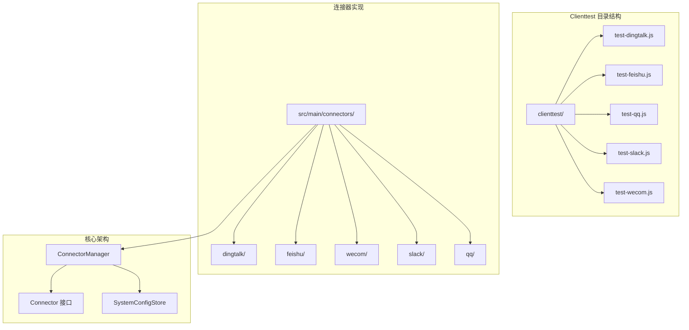
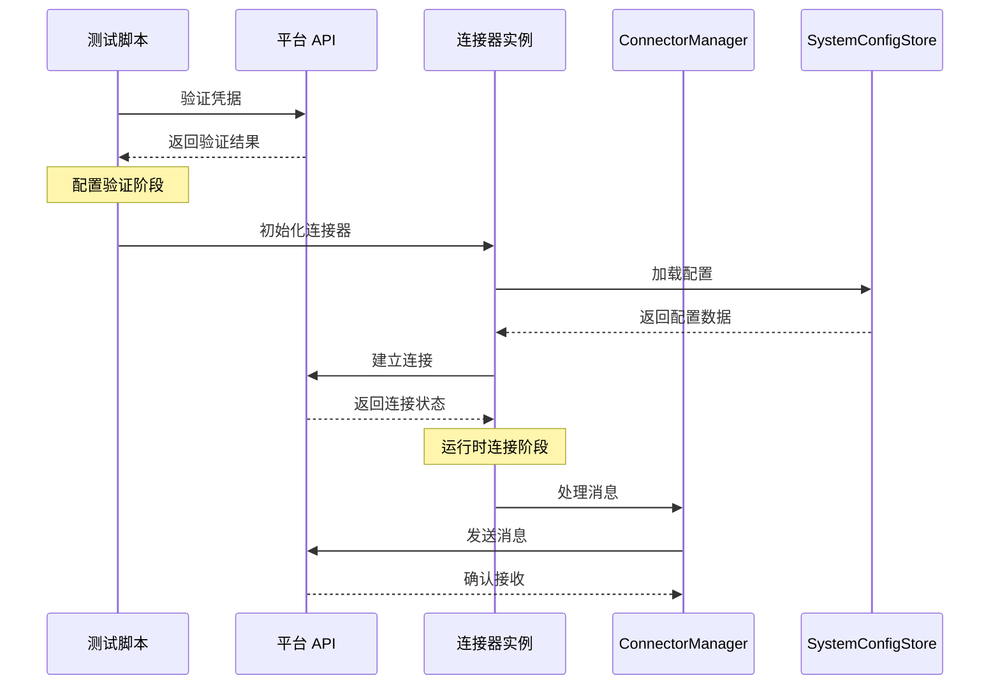
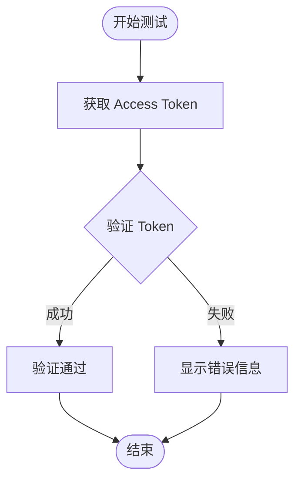
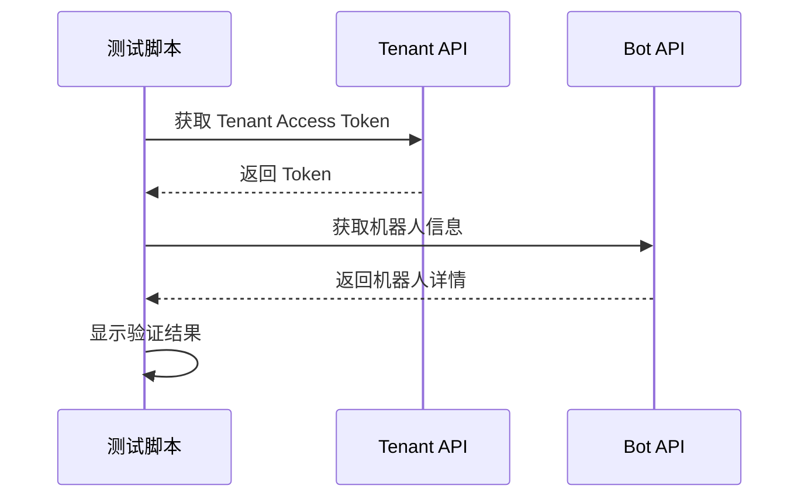
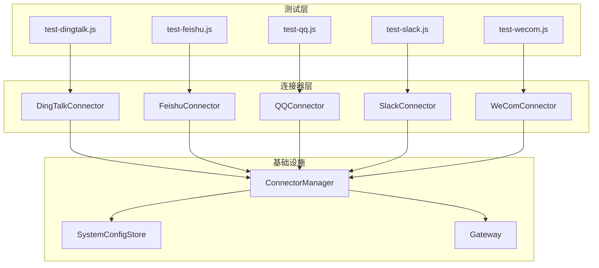

# Clienttest Scripts

<cite>
**本文档引用的文件**
- [test-dingtalk.js](file://clienttest/test-dingtalk.js)
- [test-feishu.js](file://clienttest/test-feishu.js)
- [test-qq.js](file://clienttest/test-qq.js)
- [test-slack.js](file://clienttest/test-slack.js)
- [test-wecom.js](file://clienttest/test-wecom.js)
- [dingtalk-connector.ts](file://src/main/connectors/dingtalk/dingtalk-connector.ts)
- [feishu-connector.ts](file://src/main/connectors/feishu/feishu-connector.ts)
- [wecom-connector.ts](file://src/main/connectors/wecom/wecom-connector.ts)
- [slack-connector.ts](file://src/main/connectors/slack/slack-connector.ts)
- [qq-connector.ts](file://src/main/connectors/qq/qq-connector.ts)
- [connector-manager.ts](file://src/main/connectors/connector-manager.ts)
- [connector.ts](file://src/types/connector.ts)
</cite>

## 目录
1. [简介](#简介)
2. [项目结构](#项目结构)
3. [核心组件](#核心组件)
4. [架构概览](#架构概览)
5. [详细组件分析](#详细组件分析)
6. [依赖关系分析](#依赖关系分析)
7. [性能考虑](#性能考虑)
8. [故障排除指南](#故障排除指南)
9. [结论](#结论)

## 简介

Clienttest 脚本是 DeepBot 项目中的调试工具集合，专门用于验证各种即时通讯平台的连接器配置。这些脚本提供了独立的测试环境，允许开发者在不启动完整应用程序的情况下验证第三方平台的认证凭据和基本连接功能。

每个测试脚本对应一个特定的即时通讯平台，包括钉钉、飞书、QQ、Slack 和企业微信。它们通过模拟连接器的工作流程，验证平台 API 的可用性和认证配置的正确性。

## 项目结构

Clienttest 脚本位于项目的 `clienttest` 目录中，采用模块化设计，每个平台都有独立的测试脚本文件：

**图表来源**
- [test-dingtalk.js:1-48](file://clienttest/test-dingtalk.js#L1-L48)
- [test-feishu.js:1-81](file://clienttest/test-feishu.js#L1-L81)
- [test-qq.js:1-64](file://clienttest/test-qq.js#L1-L64)
- [test-slack.js:1-79](file://clienttest/test-slack.js#L1-L79)
- [test-wecom.js:1-80](file://clienttest/test-wecom.js#L1-L80)

**章节来源**
- [test-dingtalk.js:1-48](file://clienttest/test-dingtalk.js#L1-L48)
- [test-feishu.js:1-81](file://clienttest/test-feishu.js#L1-L81)
- [test-qq.js:1-64](file://clienttest/test-qq.js#L1-L64)
- [test-slack.js:1-79](file://clienttest/test-slack.js#L1-L79)
- [test-wecom.js:1-80](file://clienttest/test-wecom.js#L1-L80)

## 核心组件

Clienttest 脚本系统的核心组件包括：

### 测试脚本架构
每个测试脚本都遵循相同的架构模式：
- **认证验证函数**：验证平台提供的凭据
- **错误处理**：提供详细的错误信息和常见问题排查
- **使用说明**：清晰的配置和使用指导
- **常量定义**：预设的测试凭据模板

### 平台特定功能
- **钉钉**：验证 Client ID 和 Client Secret
- **飞书**：验证 App ID 和 App Secret，获取 Tenant Access Token
- **QQ**：验证 App ID 和 App Secret，获取 Access Token
- **Slack**：验证 Bot Token、App Token 和 Signing Secret
- **企业微信**：验证 CorpId、AgentId 和 Secret

**章节来源**
- [test-dingtalk.js:6-38](file://clienttest/test-dingtalk.js#L6-L38)
- [test-feishu.js:6-67](file://clienttest/test-feishu.js#L6-L67)
- [test-qq.js:6-49](file://clienttest/test-qq.js#L6-L49)
- [test-slack.js:6-61](file://clienttest/test-slack.js#L6-L61)
- [test-wecom.js:6-65](file://clienttest/test-wecom.js#L6-L65)

## 架构概览

Clienttest 脚本与完整连接器系统的架构关系如下：

**图表来源**
- [connector-manager.ts:45-81](file://src/main/connectors/connector-manager.ts#L45-L81)
- [connector.ts:76-146](file://src/types/connector.ts#L76-L146)

## 详细组件分析

### 钉钉连接器测试

钉钉测试脚本专注于验证 OAuth 认证流程：

**图表来源**
- [test-dingtalk.js:10-37](file://clienttest/test-dingtalk.js#L10-L37)

**章节来源**
- [test-dingtalk.js:6-38](file://clienttest/test-dingtalk.js#L6-L38)

### 飞书连接器测试

飞书测试脚本包含多步骤验证流程：

**图表来源**
- [test-feishu.js:9-66](file://clienttest/test-feishu.js#L9-L66)

**章节来源**
- [test-feishu.js:6-67](file://clienttest/test-feishu.js#L6-L67)

### QQ 连接器测试

QQ 测试脚本验证机器人 API 认证：

**章节来源**
- [test-qq.js:6-49](file://clienttest/test-qq.js#L6-L49)

### Slack 连接器测试

Slack 测试脚本验证多种认证方式：

**章节来源**
- [test-slack.js:6-61](file://clienttest/test-slack.js#L6-L61)

### 企业微信连接器测试

企业微信测试脚本验证多参数认证：

**章节来源**
- [test-wecom.js:6-65](file://clienttest/test-wecom.js#L6-L65)

## 依赖关系分析

Clienttest 脚本与连接器系统的依赖关系：

**图表来源**
- [connector-manager.ts:21-38](file://src/main/connectors/connector-manager.ts#L21-L38)
- [connector.ts:76-146](file://src/types/connector.ts#L76-L146)

**章节来源**
- [connector-manager.ts:21-38](file://src/main/connectors/connector-manager.ts#L21-L38)
- [connector.ts:76-146](file://src/types/connector.ts#L76-L146)

## 性能考虑

Clienttest 脚本的设计考虑了以下性能因素：

### 异步处理
- 所有 API 调用都是异步的，避免阻塞主线程
- 使用 Promise 和 async/await 模式

### 错误处理
- 详细的错误信息收集和报告
- 常见错误场景的预定义提示

### 资源管理
- 最小化的内存占用
- 及时的资源清理

## 故障排除指南

### 常见问题诊断

#### 钉钉连接器问题
- **错误码 4013**：Client ID 格式错误
- **错误码 40001**：Client Secret 错误
- **IP 白名单**：确保服务器 IP 在白名单中

#### 飞书连接器问题
- **错误码 99991663**：App ID 或 Secret 错误
- **错误码 99991664**：IP 不在白名单
- **应用未发布**：确保应用已发布到生产环境

#### QQ 连接器问题
- **HTTP 400**：App ID 或 Secret 错误
- **HTTP 401**：应用未发布或未授权

#### Slack 连接器问题
- **Bot Token 无效**：检查 Bot Token 格式
- **App Token 无效**：确保启用了 Socket Mode

#### 企业微信连接器问题
- **错误码 40001**：Corp ID 或 Secret 错误
- **错误码 40014**：Agent ID 不存在

**章节来源**
- [test-feishu.js:54-58](file://clienttest/test-feishu.js#L54-L58)
- [test-qq.js:32-36](file://clienttest/test-qq.js#L32-L36)
- [test-wecom.js:26-31](file://clienttest/test-wecom.js#L26-L31)

## 结论

Clienttest 脚本系统为 DeepBot 项目提供了强大的调试和验证能力。通过独立的测试脚本，开发者可以：

1. **快速验证配置**：在启动完整应用前验证第三方平台的认证配置
2. **隔离问题**：将连接器问题与应用其他部分分离
3. **标准化测试**：提供统一的测试流程和错误处理
4. **降低开发成本**：减少调试时间和复杂度

这些脚本不仅提高了开发效率，还为用户提供了更好的使用体验，确保各种即时通讯平台的连接器能够稳定可靠地工作。