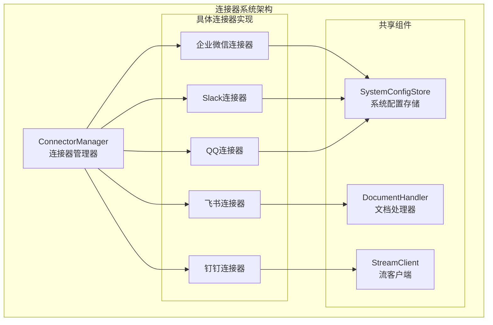
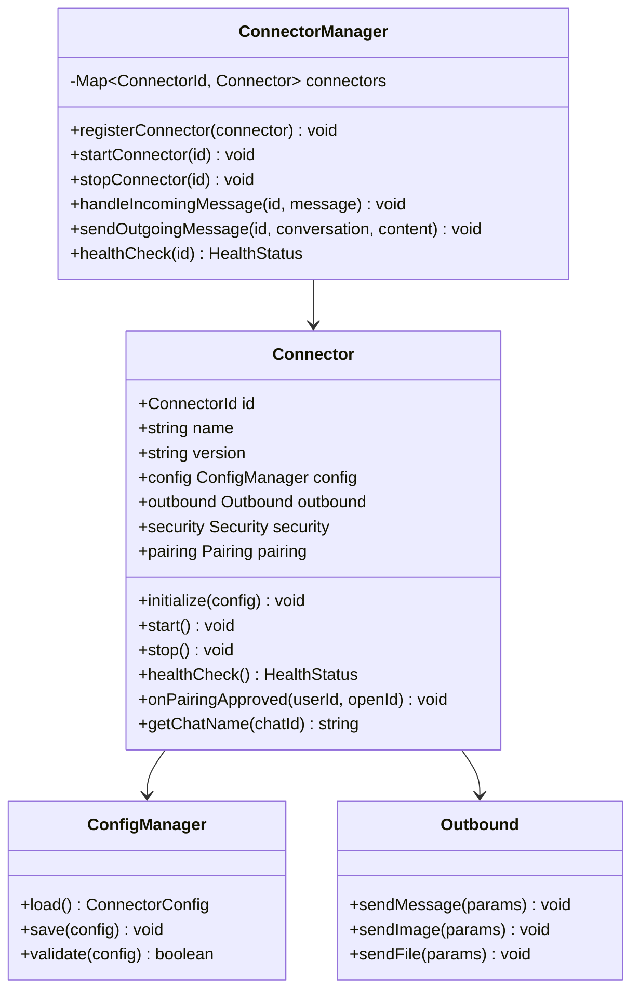
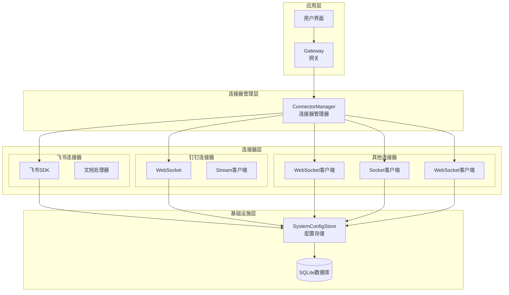
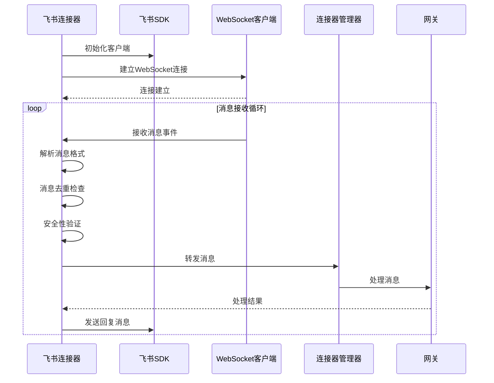
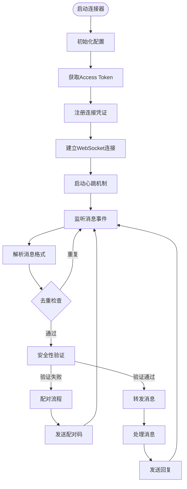
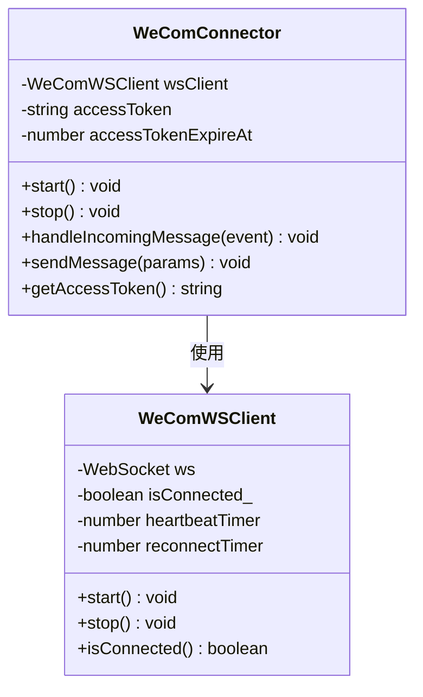
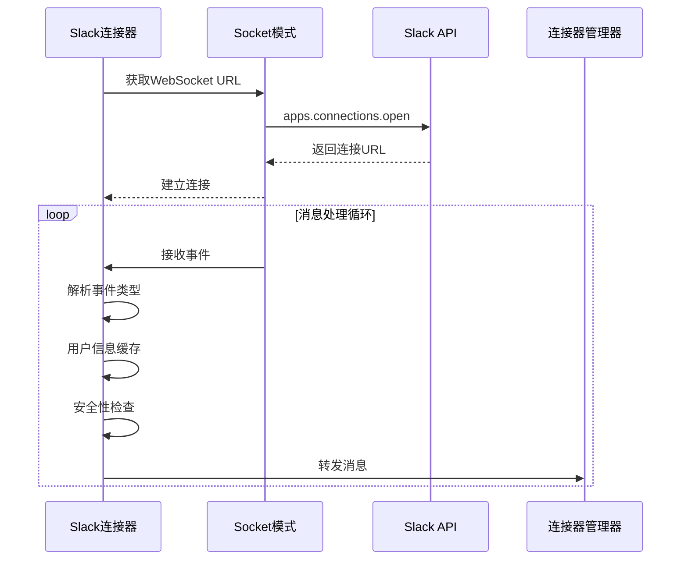
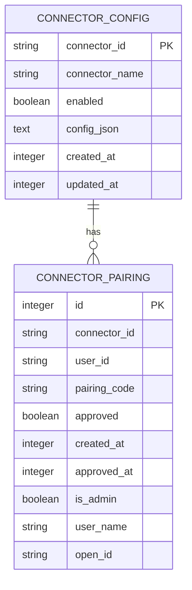

# 连接器类型

<cite>
**本文档引用的文件**
- [src/types/connector.ts](file://src/types/connector.ts)
- [src/main/connectors/index.ts](file://src/main/connectors/index.ts)
- [src/main/connectors/connector-manager.ts](file://src/main/connectors/connector-manager.ts)
- [src/main/connectors/feishu/feishu-connector.ts](file://src/main/connectors/feishu/feishu-connector.ts)
- [src/main/connectors/feishu/document-handler.ts](file://src/main/connectors/feishu/document-handler.ts)
- [src/main/connectors/dingtalk/dingtalk-connector.ts](file://src/main/connectors/dingtalk/dingtalk-connector.ts)
- [src/main/connectors/dingtalk/stream-client.ts](file://src/main/connectors/dingtalk/stream-client.ts)
- [src/main/connectors/wecom/wecom-connector.ts](file://src/main/connectors/wecom/wecom-connector.ts)
- [src/main/connectors/slack/slack-connector.ts](file://src/main/connectors/slack/slack-connector.ts)
- [src/main/connectors/qq/qq-connector.ts](file://src/main/connectors/qq/qq-connector.ts)
- [src/main/database/system-config-store.ts](file://src/main/database/system-config-store.ts)
- [src/main/database/connector-config.ts](file://src/main/database/connector-config.ts)
- [package.json](file://package.json)
</cite>

## 目录
1. [简介](#简介)
2. [项目结构](#项目结构)
3. [核心组件](#核心组件)
4. [架构概览](#架构概览)
5. [详细组件分析](#详细组件分析)
6. [依赖关系分析](#依赖关系分析)
7. [性能考虑](#性能考虑)
8. [故障排除指南](#故障排除指南)
9. [结论](#结论)

## 简介

史丽慧小助理 是一个系统级 AI 助手，专注于企业生产效率提升。该项目的核心特性之一是其多平台连接器系统，支持与多个即时通讯平台的集成。

连接器系统提供了统一的抽象层，使得 史丽慧小助理 能够与不同的即时通讯平台（如飞书、钉钉、企业微信、Slack、QQ）进行交互。每个连接器都实现了相同的接口规范，确保了系统的可扩展性和一致性。

## 项目结构

连接器系统位于 `src/main/connectors/` 目录下，采用模块化设计：



**图表来源**
- [src/main/connectors/connector-manager.ts:21-379](file://src/main/connectors/connector-manager.ts#L21-L379)
- [src/main/connectors/index.ts:1-11](file://src/main/connectors/index.ts#L1-L11)

**章节来源**
- [src/main/connectors/index.ts:1-11](file://src/main/connectors/index.ts#L1-L11)
- [src/main/connectors/connector-manager.ts:1-379](file://src/main/connectors/connector-manager.ts#L1-L379)

## 核心组件

### 连接器接口定义

连接器系统基于统一的接口规范，定义了所有连接器必须实现的标准方法：



**图表来源**
- [src/types/connector.ts:76-146](file://src/types/connector.ts#L76-L146)
- [src/main/connectors/connector-manager.ts:21-379](file://src/main/connectors/connector-manager.ts#L21-L379)

### 支持的连接器类型

系统目前支持以下五种即时通讯平台：

| 连接器ID | 平台名称 | 连接方式 | 特殊功能 |
|---------|----------|----------|----------|
| `feishu` | 飞书 | WebSocket 长连接 | 文档读取、表情回复 |
| `dingtalk` | 钉钉 | Stream 模式 | 消息去重、媒体上传 |
| `wecom` | 企业微信 | WebSocket 长连接 | Access Token 管理 |
| `slack` | Slack | Socket Mode | 用户信息缓存 |
| `qq` | QQ机器人 | WebSocket 长连接 | 多种消息类型 |

**章节来源**
- [src/types/connector.ts:10-10](file://src/types/connector.ts#L10-L10)
- [src/main/connectors/index.ts:5-10](file://src/main/connectors/index.ts#L5-L10)

## 架构概览

连接器系统采用分层架构设计，确保了良好的可维护性和扩展性：



**图表来源**
- [src/main/connectors/connector-manager.ts:11-28](file://src/main/connectors/connector-manager.ts#L11-L28)
- [src/main/database/system-config-store.ts:37-70](file://src/main/database/system-config-store.ts#L37-L70)

## 详细组件分析

### 飞书连接器

飞书连接器是最复杂的连接器实现，具有丰富的功能特性：



**图表来源**
- [src/main/connectors/feishu/feishu-connector.ts:103-150](file://src/main/connectors/feishu/feishu-connector.ts#L103-L150)
- [src/main/connectors/feishu/feishu-connector.ts:368-577](file://src/main/connectors/feishu/feishu-connector.ts#L368-L577)

#### 核心特性

1. **消息去重机制**：使用消息ID和内容双重去重，防止重复处理
2. **文档读取功能**：支持读取飞书文档和电子表格内容
3. **表情回复**：自动回复表情符号，提升用户体验
4. **安全验证**：支持配对授权机制

**章节来源**
- [src/main/connectors/feishu/feishu-connector.ts:40-47](file://src/main/connectors/feishu/feishu-connector.ts#L40-L47)
- [src/main/connectors/feishu/feishu-connector.ts:267-314](file://src/main/connectors/feishu/feishu-connector.ts#L267-L314)
- [src/main/connectors/feishu/document-handler.ts:23-369](file://src/main/connectors/feishu/document-handler.ts#L23-L369)

### 钉钉连接器

钉钉连接器采用 Stream 模式实现，具有高效的实时通信能力：



**图表来源**
- [src/main/connectors/dingtalk/dingtalk-connector.ts:85-124](file://src/main/connectors/dingtalk/dingtalk-connector.ts#L85-L124)
- [src/main/connectors/dingtalk/dingtalk-connector.ts:171-307](file://src/main/connectors/dingtalk/dingtalk-connector.ts#L171-L307)

#### 核心特性

1. **Stream 模式**：使用钉钉官方 Stream API 实现实时通信
2. **媒体文件处理**：支持图片和文件的上传和下载
3. **智能配对**：自动化的用户授权流程
4. **错误重连**：自动重连机制确保连接稳定性

**章节来源**
- [src/main/connectors/dingtalk/dingtalk-connector.ts:27-48](file://src/main/connectors/dingtalk/dingtalk-connector.ts#L27-L48)
- [src/main/connectors/dingtalk/stream-client.ts:32-82](file://src/main/connectors/dingtalk/stream-client.ts#L32-L82)

### 企业微信连接器

企业微信连接器提供稳定的企业级即时通讯解决方案：



**图表来源**
- [src/main/connectors/wecom/wecom-connector.ts:28-48](file://src/main/connectors/wecom/wecom-connector.ts#L28-L48)
- [src/main/connectors/wecom/wecom-connector.ts:584-750](file://src/main/connectors/wecom/wecom-connector.ts#L584-L750)

#### 核心特性

1. **Access Token 管理**：自动化的令牌获取和刷新机制
2. **心跳保持**：维持长期稳定的连接状态
3. **错误恢复**：自动重连和错误处理机制
4. **多会话支持**：同时支持群聊和单聊场景

**章节来源**
- [src/main/connectors/wecom/wecom-connector.ts:161-182](file://src/main/connectors/wecom/wecom-connector.ts#L161-L182)
- [src/main/connectors/wecom/wecom-connector.ts:618-622](file://src/main/connectors/wecom/wecom-connector.ts#L618-L622)

### Slack 连接器

Slack 连接器基于 Slack Bolt 框架实现，提供现代化的开发体验：



**图表来源**
- [src/main/connectors/slack/slack-connector.ts:563-576](file://src/main/connectors/slack/slack-connector.ts#L563-L576)
- [src/main/connectors/slack/slack-connector.ts:607-638](file://src/main/connectors/slack/slack-connector.ts#L607-L638)

#### 核心特性

1. **Socket Mode**：使用 Slack 官方 Socket Mode 实现双向通信
2. **用户信息缓存**：减少 API 调用频率
3. **多事件支持**：支持多种 Slack 事件类型
4. **国际化支持**：支持英文界面提示

**章节来源**
- [src/main/connectors/slack/slack-connector.ts:27-46](file://src/main/connectors/slack/slack-connector.ts#L27-L46)
- [src/main/connectors/slack/slack-connector.ts:314-341](file://src/main/connectors/slack/slack-connector.ts#L314-L341)

### QQ 连接器

QQ 连接器提供完整的 QQ 机器人功能支持：

```mermaid
flowchart LR
subgraph "消息类型处理"
GM[GROUP_AT_MESSAGE_CREATE<br/>群聊@消息]
DM[DIRECT_MESSAGE_CREATE<br/>私聊消息]
C2C[C2C_MESSAGE_CREATE<br/>单聊消息]
end
subgraph "通用处理流程"
Parse[解析消息内容]
Dedup[消息去重]
Security[安全性检查]
Pairing[配对流程]
Forward[转发处理]
end
GM --> Parse
DM --> Parse
C2C --> Parse
Parse --> Dedup
Dedup --> Security
Security --> |通过| Forward
Security --> |失败| Pairing
Pairing --> Forward
```

**图表来源**
- [src/main/connectors/qq/qq-connector.ts:198-213](file://src/main/connectors/qq/qq-connector.ts#L198-L213)
- [src/main/connectors/qq/qq-connector.ts:218-269](file://src/main/connectors/qq/qq-connector.ts#L218-L269)

#### 核心特性

1. **多消息类型支持**：支持群聊、私聊、单聊等多种消息类型
2. **内容清理**：自动移除消息中的 @ 提及标记
3. **配对机制**：完整的用户授权流程
4. **文件传输**：支持图片和文件的上传下载

**章节来源**
- [src/main/connectors/qq/qq-connector.ts:28-48](file://src/main/connectors/qq/qq-connector.ts#L28-L48)
- [src/main/connectors/qq/qq-connector.ts:350-356](file://src/main/connectors/qq/qq-connector.ts#L350-L356)

## 依赖关系分析

连接器系统依赖于多个外部库和内部模块：

```mermaid
graph TB
subgraph "外部依赖"
LSKY[@larksuiteoapi/node-sdk<br/>飞书SDK]
WS[ws<br/>WebSocket库]
EXP[express<br/>HTTP服务器]
ELE[electron<br/>桌面应用框架]
end
subgraph "内部模块"
CM[ConnectorManager<br/>连接器管理器]
SCS[SystemConfigStore<br/>配置存储]
DC[DocumentHandler<br/>文档处理器]
ST[StreamClient<br/>流客户端]
end
subgraph "连接器实现"
FS[飞书连接器]
DT[钉钉连接器]
WC[企业微信连接器]
SL[Slack连接器]
QQ[QQ连接器]
end
FS --> LSKY
DT --> WS
WC --> WS
SL --> WS
QQ --> WS
CM --> SCS
FS --> DC
DT --> ST
CM --> FS
CM --> DT
CM --> WC
CM --> SL
CM --> QQ
```

**图表来源**
- [package.json:47-76](file://package.json#L47-L76)
- [src/main/connectors/feishu/feishu-connector.ts:11-25](file://src/main/connectors/feishu/feishu-connector.ts#L11-L25)
- [src/main/connectors/dingtalk/dingtalk-connector.ts:23-24](file://src/main/connectors/dingtalk/dingtalk-connector.ts#L23-L24)

### 数据持久化

连接器配置和用户配对信息通过 SQLite 数据库存储：



**图表来源**
- [src/main/database/system-config-store.ts:180-225](file://src/main/database/system-config-store.ts#L180-L225)
- [src/main/database/system-config-store.ts:192-220](file://src/main/database/system-config-store.ts#L192-L220)

**章节来源**
- [src/main/database/system-config-store.ts:82-225](file://src/main/database/system-config-store.ts#L82-L225)
- [src/main/database/connector-config.ts:13-109](file://src/main/database/connector-config.ts#L13-L109)

## 性能考虑

### 连接器性能优化

1. **连接池管理**：每个连接器维护独立的连接状态
2. **内存管理**：使用 Set 和 Map 进行消息去重和缓存
3. **异步处理**：采用异步非阻塞的事件处理模型
4. **资源清理**：确保连接断开时及时释放资源

### 缓存策略

- **消息去重缓存**：限制缓存大小，防止内存泄漏
- **用户信息缓存**：减少 API 调用频率
- **Access Token 缓存**：延长令牌有效期，减少刷新频率

## 故障排除指南

### 常见问题诊断

1. **连接器无法启动**
   - 检查配置文件是否正确
   - 验证网络连接状态
   - 查看日志输出获取详细错误信息

2. **消息接收异常**
   - 确认 WebSocket 连接状态
   - 检查消息去重机制是否正常工作
   - 验证安全性检查逻辑

3. **配对授权失败**
   - 检查配对码生成逻辑
   - 验证用户权限状态
   - 确认数据库连接正常

**章节来源**
- [src/main/connectors/connector-manager.ts:341-358](file://src/main/connectors/connector-manager.ts#L341-L358)
- [src/main/connectors/feishu/feishu-connector.ts:235-248](file://src/main/connectors/feishu/feishu-connector.ts#L235-L248)

## 结论

史丽慧小助理 的连接器系统展现了优秀的架构设计和实现质量。通过统一的接口规范和模块化的设计，系统成功地支持了五个不同的即时通讯平台，为用户提供了丰富的企业级 AI 助手功能。

系统的主要优势包括：

1. **高度可扩展性**：统一的接口设计使得添加新平台变得简单
2. **强大的功能集**：每个连接器都针对特定平台的特点进行了优化
3. **健壮的错误处理**：完善的异常处理和重连机制
4. **良好的性能表现**：通过缓存和异步处理确保高效运行

未来的发展方向可能包括支持更多即时通讯平台、增强 AI 集成能力、以及进一步优化性能和用户体验。