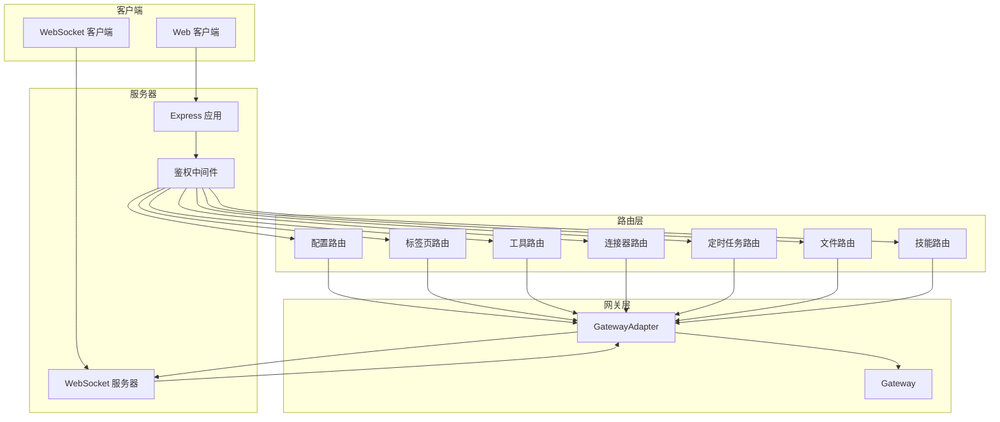
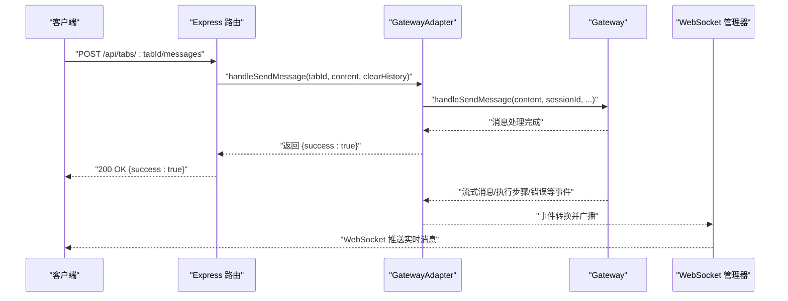
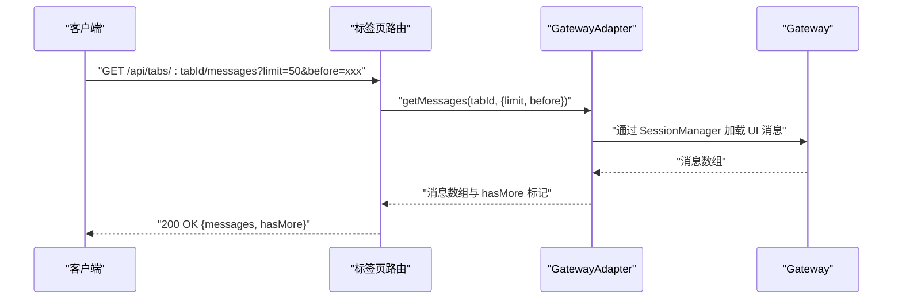
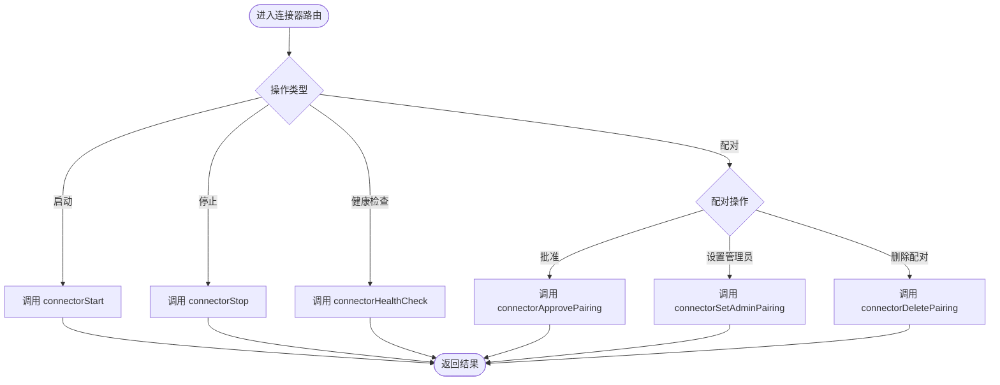
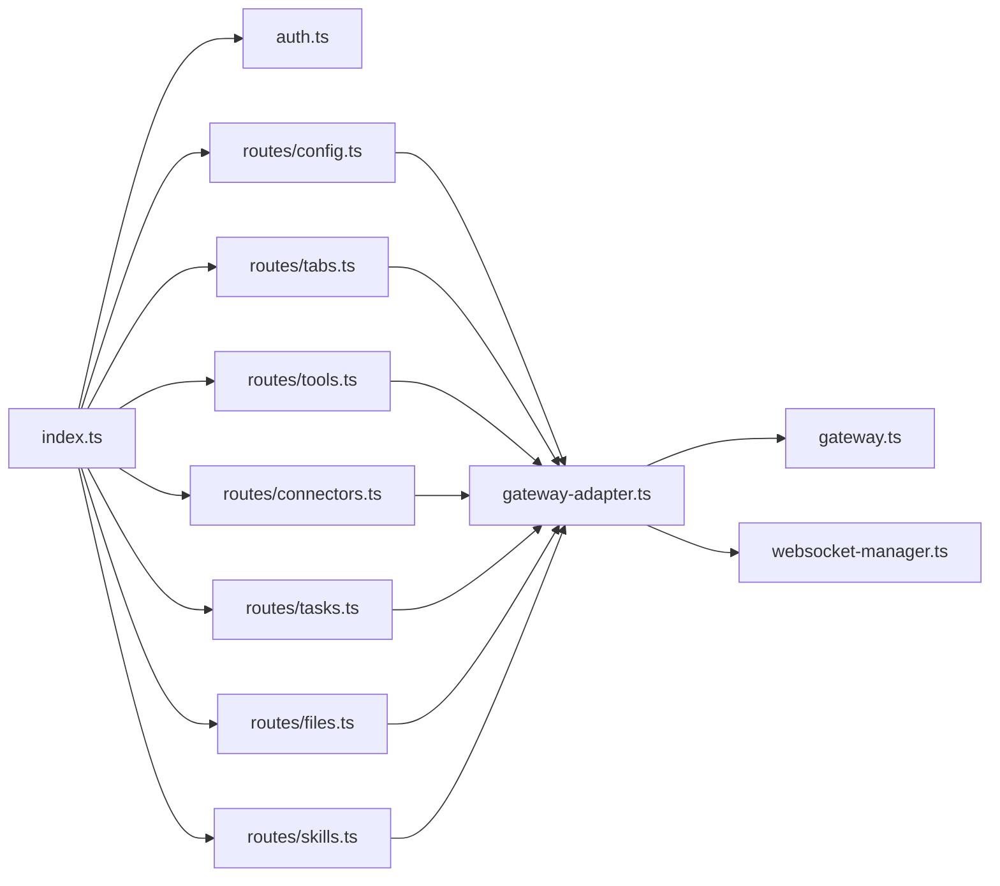

# API 路由系统

<cite>
**本文引用的文件**
- [src/server/index.ts](file://src/server/index.ts)
- [src/server/gateway-adapter.ts](file://src/server/gateway-adapter.ts)
- [src/server/websocket-manager.ts](file://src/server/websocket-manager.ts)
- [src/server/middleware/auth.ts](file://src/server/middleware/auth.ts)
- [src/server/routes/config.ts](file://src/server/routes/config.ts)
- [src/server/routes/tabs.ts](file://src/server/routes/tabs.ts)
- [src/server/routes/tools.ts](file://src/server/routes/tools.ts)
- [src/server/routes/connectors.ts](file://src/server/routes/connectors.ts)
- [src/server/routes/tasks.ts](file://src/server/routes/tasks.ts)
- [src/server/routes/files.ts](file://src/server/routes/files.ts)
- [src/server/routes/skills.ts](file://src/server/routes/skills.ts)
- [src/server/types.ts](file://src/server/types.ts)
- [src/main/gateway.ts](file://src/main/gateway.ts)
- [src/shared/constants/version.ts](file://src/shared/constants/version.ts)
- [src/shared/utils/error-handler.ts](file://src/shared/utils/error-handler.ts)
- [package.json](file://package.json)
</cite>

## 目录
1. [简介](#简介)
2. [项目结构](#项目结构)
3. [核心组件](#核心组件)
4. [架构总览](#架构总览)
5. [详细组件分析](#详细组件分析)
6. [依赖关系分析](#依赖关系分析)
7. [性能考量](#性能考量)
8. [故障排查指南](#故障排查指南)
9. [结论](#结论)
10. [附录](#附录)

## 简介
本文件面向 DeepBot 的 Web 服务器与 API 路由系统，系统采用 Express 提供 REST API，并通过 WebSocket 实现实时消息推送。API 路由围绕“配置管理、标签页管理、工具调用、连接器操作、定时任务、文件管理、技能管理”等模块组织，遵循 RESTful 设计原则，结合 JWT 令牌与可选密码保护机制实现鉴权。路由层通过 GatewayAdapter 将 API 请求桥接到 Gateway，后者负责会话生命周期、消息路由与运行时管理。

## 项目结构
- 服务器入口与中间件
  - 服务器入口：负责创建 Express、WS、初始化 Gateway 与 WebSocket 管理器，挂载路由与静态资源。
  - 鉴权中间件：支持无密码单用户直通与带密码 JWT 鉴权两种模式。
- 路由模块
  - 配置管理、标签页、工具、连接器、定时任务、文件、技能等路由，均以统一的错误处理与响应结构返回。
- 网关与适配器
  - Gateway：会话与消息的核心编排者；GatewayAdapter：将 Gateway 能力暴露为 API，并将 Gateway 事件映射为 WebSocket 事件。
- WebSocket 管理
  - 负责连接建立、订阅管理、心跳、广播与断连清理。

图表来源
- [src/server/index.ts:83-96](file://src/server/index.ts#L83-L96)
- [src/server/middleware/auth.ts:22-45](file://src/server/middleware/auth.ts#L22-L45)
- [src/server/routes/config.ts:10-44](file://src/server/routes/config.ts#L10-L44)
- [src/server/routes/tabs.ts:10-136](file://src/server/routes/tabs.ts#L10-L136)
- [src/server/routes/tools.ts:9-56](file://src/server/routes/tools.ts#L9-L56)
- [src/server/routes/connectors.ts:9-214](file://src/server/routes/connectors.ts#L9-L214)
- [src/server/routes/tasks.ts:9-32](file://src/server/routes/tasks.ts#L9-L32)
- [src/server/routes/files.ts:10-106](file://src/server/routes/files.ts#L10-L106)
- [src/server/routes/skills.ts:10-37](file://src/server/routes/skills.ts#L10-L37)
- [src/server/gateway-adapter.ts:45-762](file://src/server/gateway-adapter.ts#L45-L762)
- [src/main/gateway.ts:29-772](file://src/main/gateway.ts#L29-L772)
- [src/server/websocket-manager.ts:29-381](file://src/server/websocket-manager.ts#L29-L381)

章节来源
- [src/server/index.ts:33-128](file://src/server/index.ts#L33-L128)
- [src/server/middleware/auth.ts:17-45](file://src/server/middleware/auth.ts#L17-L45)

## 核心组件
- 服务器入口与路由挂载
  - 创建 Express、HTTP 与 WebSocket 服务器，初始化 Gateway 与 WebSocket 管理器。
  - 挂载 /api/* 路由并应用鉴权中间件；生产环境提供静态页面与 SPA 回退。
- 鉴权中间件
  - 支持无密码直通与 JWT 鉴权；登录接口根据 ACCESS_PASSWORD 决定是否校验密码并签发 Token。
- 网关适配器
  - 将 Gateway 的能力暴露为 API；将 Gateway 事件转换为 WebSocket 事件；提供文件上传/读取/删除等工具方法。
- WebSocket 管理器
  - 管理连接、订阅、心跳、广播与断连清理；支持同一用户多端互斥登录。

章节来源
- [src/server/index.ts:33-128](file://src/server/index.ts#L33-L128)
- [src/server/middleware/auth.ts:17-91](file://src/server/middleware/auth.ts#L17-L91)
- [src/server/gateway-adapter.ts:45-762](file://src/server/gateway-adapter.ts#L45-L762)
- [src/server/websocket-manager.ts:29-381](file://src/server/websocket-manager.ts#L29-L381)

## 架构总览
- REST API 层：各路由模块负责参数解析、调用 GatewayAdapter 并返回统一结构。
- 网关层：Gateway 负责会话、消息与运行时管理；GatewayAdapter 作为适配器桥接 API 与 Gateway。
- 实时通信层：WebSocket 管理器监听 GatewayAdapter 事件并广播到订阅客户端。
- 鉴权层：登录接口与鉴权中间件保障访问安全。

图表来源
- [src/server/routes/tabs.ts:79-94](file://src/server/routes/tabs.ts#L79-L94)
- [src/server/gateway-adapter.ts:231-234](file://src/server/gateway-adapter.ts#L231-L234)
- [src/main/gateway.ts:455-458](file://src/main/gateway.ts#L455-L458)
- [src/server/websocket-manager.ts:229-243](file://src/server/websocket-manager.ts#L229-L243)

## 详细组件分析

### 配置管理 API（/api/config）
- 功能
  - 获取系统配置：返回模型、工作空间、名称、连接器、图片生成、网页搜索等配置聚合。
  - 更新系统配置：接收增量更新，分别写入对应配置存储并触发 Gateway 重载。
- 路由与处理
  - GET /api/config：调用 GatewayAdapter.getConfig。
  - PUT /api/config：调用 GatewayAdapter.updateConfig。
- 错误处理
  - 统一捕获异常并通过错误处理器提取错误信息。
- 响应结构
  - 成功：JSON 结构；失败：{ error: string }。
- 版本与兼容性
  - 配置字段随版本演进，建议客户端在更新后兼容新增字段。

章节来源
- [src/server/routes/config.ts:10-44](file://src/server/routes/config.ts#L10-L44)
- [src/server/gateway-adapter.ts:268-337](file://src/server/gateway-adapter.ts#L268-L337)

### 标签页管理 API（/api/tabs）
- 功能
  - 获取所有标签页、创建新标签页、获取指定标签页、关闭标签页。
  - 向指定标签页发送消息、获取消息历史、停止生成。
- 路由与处理
  - GET /api/tabs：GatewayAdapter.getAllTabs。
  - POST /api/tabs：GatewayAdapter.createTab。
  - GET /api/tabs/:tabId：GatewayAdapter.getTab。
  - DELETE /api/tabs/:tabId：GatewayAdapter.closeTab。
  - POST /api/tabs/:tabId/messages：GatewayAdapter.handleSendMessage。
  - GET /api/tabs/:tabId/messages：GatewayAdapter.getMessages（支持 limit、before 分页）。
  - POST /api/tabs/stop-generation：GatewayAdapter.stopGeneration。
- 错误处理
  - 404：标签页不存在；400：消息内容为空；其余异常统一返回 500。
- 响应结构
  - 成功：JSON；失败：{ error: string }。

图表来源
- [src/server/routes/tabs.ts:100-111](file://src/server/routes/tabs.ts#L100-L111)
- [src/server/gateway-adapter.ts:239-266](file://src/server/gateway-adapter.ts#L239-L266)
- [src/main/gateway.ts:455-458](file://src/main/gateway.ts#L455-L458)

章节来源
- [src/server/routes/tabs.ts:10-136](file://src/server/routes/tabs.ts#L10-L136)
- [src/server/gateway-adapter.ts:201-266](file://src/server/gateway-adapter.ts#L201-L266)

### 工具调用 API（/api/tools）
- 功能
  - 环境检查：调用环境检查工具并返回检查结果。
  - 启动 Chrome 调试：Web 模式下返回不支持提示。
- 路由与处理
  - POST /api/tools/environment-check：GatewayAdapter.checkEnvironment。
  - POST /api/tools/launch-chrome：GatewayAdapter.launchChromeWithDebug。
- 响应结构
  - 成功：工具返回结构；失败：{ success: false, error: string }。

章节来源
- [src/server/routes/tools.ts:9-56](file://src/server/routes/tools.ts#L9-L56)
- [src/server/gateway-adapter.ts:342-362](file://src/server/gateway-adapter.ts#L342-L362)

### 连接器管理 API（/api/connectors）
- 功能
  - 获取连接器列表、获取/保存连接器配置、启动/停止连接器、健康检查。
  - 配对管理：批准配对、设置管理员、删除配对、获取配对记录。
- 路由与处理
  - GET /api/connectors：GatewayAdapter.connectorGetAll。
  - GET /api/connectors/:connectorId/config：GatewayAdapter.connectorGetConfig。
  - POST /api/connectors/:connectorId/config：GatewayAdapter.connectorSaveConfig。
  - POST /api/connectors/:connectorId/start：GatewayAdapter.connectorStart。
  - POST /api/connectors/:connectorId/stop：GatewayAdapter.connectorStop。
  - GET /api/connectors/:connectorId/health：GatewayAdapter.connectorHealthCheck。
  - POST /api/connectors/pairing/approve：GatewayAdapter.connectorApprovePairing。
  - POST /api/connectors/:connectorId/pairing/:userId/admin：GatewayAdapter.connectorSetAdminPairing。
  - DELETE /api/connectors/:connectorId/pairing/:userId：GatewayAdapter.connectorDeletePairing。
  - GET /api/connectors/pairing：GatewayAdapter.connectorGetPairingRecords。
- 响应结构
  - 成功：{ success: true, ... }；失败：{ success: false, error: string }。

图表来源
- [src/server/routes/connectors.ts:12-214](file://src/server/routes/connectors.ts#L12-L214)
- [src/server/gateway-adapter.ts:430-527](file://src/server/gateway-adapter.ts#L430-L527)

章节来源
- [src/server/routes/connectors.ts:9-214](file://src/server/routes/connectors.ts#L9-L214)
- [src/server/gateway-adapter.ts:367-527](file://src/server/gateway-adapter.ts#L367-L527)

### 定时任务 API（/api/tasks）
- 功能
  - 统一入口处理定时任务的列表、创建、更新、删除等操作。
- 路由与处理
  - POST /api/tasks：GatewayAdapter.scheduledTask。
- 响应结构
  - 成功：工具返回结构；失败：{ success: false, error: string }。

章节来源
- [src/server/routes/tasks.ts:9-32](file://src/server/routes/tasks.ts#L9-L32)
- [src/server/gateway-adapter.ts:532-539](file://src/server/gateway-adapter.ts#L532-L539)

### 文件管理 API（/api/files）
- 功能
  - 上传文件、上传图片、读取图片、删除临时文件。
- 路由与处理
  - POST /api/files/upload：GatewayAdapter.uploadFile。
  - POST /api/files/upload-image：GatewayAdapter.uploadImage。
  - GET /api/files/read-image：GatewayAdapter.readImage。
  - DELETE /api/files/temp：GatewayAdapter.deleteTempFile。
- 响应结构
  - 成功：{ success: true, file/image: ... }；失败：{ success: false, error: string }。
- 安全与限制
  - 上传大小限制：文件最大 500MB，图片最大 5MB。
  - 读取与删除路径受工作目录限制，防止越权访问。

章节来源
- [src/server/routes/files.ts:10-106](file://src/server/routes/files.ts#L10-L106)
- [src/server/gateway-adapter.ts:558-720](file://src/server/gateway-adapter.ts#L558-L720)

### 技能管理 API（/api/skills）
- 功能
  - 统一入口处理技能的列表、搜索、安装、卸载、信息查询等操作。
- 路由与处理
  - POST /api/skills：GatewayAdapter.skillManager。
- 响应结构
  - 成功：{ success: true, ... }；失败：{ success: false, error: string }。

章节来源
- [src/server/routes/skills.ts:10-37](file://src/server/routes/skills.ts#L10-L37)
- [src/server/gateway-adapter.ts:725-754](file://src/server/gateway-adapter.ts#L725-L754)

### 认证与登录（/api/auth/login）
- 功能
  - 在未设置密码时直接签发 Token；设置密码时校验密码后签发 Token。
- 路由与处理
  - POST /api/auth/login：loginHandler。
- 响应结构
  - 成功：{ token, userId, expiresIn }；失败：{ error: string }。

章节来源
- [src/server/index.ts:86-86](file://src/server/index.ts#L86-L86)
- [src/server/middleware/auth.ts:57-90](file://src/server/middleware/auth.ts#L57-L90)

## 依赖关系分析

图表来源
- [src/server/index.ts:89-95](file://src/server/index.ts#L89-L95)
- [src/server/routes/config.ts:10](file://src/server/routes/config.ts#L10)
- [src/server/routes/tabs.ts:10](file://src/server/routes/tabs.ts#L10)
- [src/server/routes/tools.ts:9](file://src/server/routes/tools.ts#L9)
- [src/server/routes/connectors.ts:9](file://src/server/routes/connectors.ts#L9)
- [src/server/routes/tasks.ts:9](file://src/server/routes/tasks.ts#L9)
- [src/server/routes/files.ts:10](file://src/server/routes/files.ts#L10)
- [src/server/routes/skills.ts:10](file://src/server/routes/skills.ts#L10)
- [src/server/gateway-adapter.ts:45](file://src/server/gateway-adapter.ts#L45)
- [src/main/gateway.ts:29](file://src/main/gateway.ts#L29)
- [src/server/websocket-manager.ts:29](file://src/server/websocket-manager.ts#L29)

章节来源
- [src/server/index.ts:89-95](file://src/server/index.ts#L89-L95)

## 性能考量
- 请求体大小
  - Express 配置支持最大 700MB 的 JSON/URL 编码请求体，满足图片（约 667MB base64）与大文件上传需求。
- WebSocket 广播
  - 广播前按订阅筛选，避免无效推送；断连时清理订阅并停止对应会话的生成。
- 文件上传
  - 上传至工作目录下的临时目录，使用随机文件名与安全路径校验，避免覆盖与越权访问。
- 会话与运行时
  - Gateway 为每个 Tab 维护独立 AgentRuntime，重置策略避免中断进行中的任务。

章节来源
- [src/server/index.ts:64-65](file://src/server/index.ts#L64-L65)
- [src/server/websocket-manager.ts:366-372](file://src/server/websocket-manager.ts#L366-L372)
- [src/server/gateway-adapter.ts:558-720](file://src/server/gateway-adapter.ts#L558-L720)
- [src/main/gateway.ts:430-450](file://src/main/gateway.ts#L430-L450)

## 故障排查指南
- 常见错误与定位
  - 401 未授权：检查 ACCESS_PASSWORD 与 JWT Token；确认登录接口返回有效 Token。
  - 500 服务器错误：查看路由层与适配器层异常捕获与错误消息提取。
  - 404 标签页不存在：确认 tabId 是否正确；检查 Gateway 是否存在该 Tab。
  - 文件读取失败：确认路径在工作目录范围内；检查文件是否存在。
- 日志与监控
  - 服务器启动日志包含服务地址、WebSocket 地址与健康检查地址。
  - WebSocket 管理器记录连接、订阅、断连与广播事件。
- 建议排查步骤
  - 确认鉴权流程与 Token 有效性。
  - 检查 GatewayAdapter 的方法调用链路与返回值。
  - 观察 WebSocket 广播是否到达客户端。

章节来源
- [src/server/index.ts:111-128](file://src/server/index.ts#L111-L128)
- [src/server/websocket-manager.ts:144-172](file://src/server/websocket-manager.ts#L144-L172)
- [src/shared/utils/error-handler.ts:8-13](file://src/shared/utils/error-handler.ts#L8-L13)

## 结论
DeepBot 的 API 路由系统以清晰的模块划分与统一的错误处理为基础，通过 GatewayAdapter 将 API 与核心业务解耦，配合 WebSocket 实现高效实时通信。路由遵循 RESTful 设计，参数与响应结构统一，便于客户端集成。版本管理与向后兼容可通过配置字段扩展与客户端容错实现。

## 附录

### API 版本管理与向后兼容
- 版本常量
  - 应用版本号与名称定义于常量文件中，建议与 package.json 保持一致。
- 兼容性建议
  - 新增配置字段时保持默认值；客户端在解析响应时忽略未知字段。
  - 路由新增端点时保留旧端点一段时间并标注废弃。

章节来源
- [src/shared/constants/version.ts:6-22](file://src/shared/constants/version.ts#L6-L22)
- [package.json:3](file://package.json#L3)

### API 使用示例与集成指南
- 鉴权
  - 未设置密码：直接访问受保护 API。
  - 设置密码：调用登录接口获取 Token，在后续请求头中携带 Bearer Token。
- 标签页消息
  - 向指定标签页发送消息：POST /api/tabs/:tabId/messages，请求体包含 content 与可选 clearHistory。
  - 获取历史消息：GET /api/tabs/:tabId/messages?limit=50&before=xxx。
- 连接器
  - 获取连接器列表：GET /api/connectors。
  - 启动连接器：POST /api/connectors/:connectorId/start。
- 文件
  - 上传图片：POST /api/files/upload-image，请求体包含 fileName、dataUrl、fileSize。
  - 读取图片：GET /api/files/read-image?path=xxx。
- 技能
  - 统一入口：POST /api/skills，请求体包含 action 与所需参数。

章节来源
- [src/server/middleware/auth.ts:57-90](file://src/server/middleware/auth.ts#L57-L90)
- [src/server/routes/tabs.ts:79-111](file://src/server/routes/tabs.ts#L79-L111)
- [src/server/routes/connectors.ts:12-214](file://src/server/routes/connectors.ts#L12-L214)
- [src/server/routes/files.ts:14-103](file://src/server/routes/files.ts#L14-L103)
- [src/server/routes/skills.ts:14-34](file://src/server/routes/skills.ts#L14-L34)