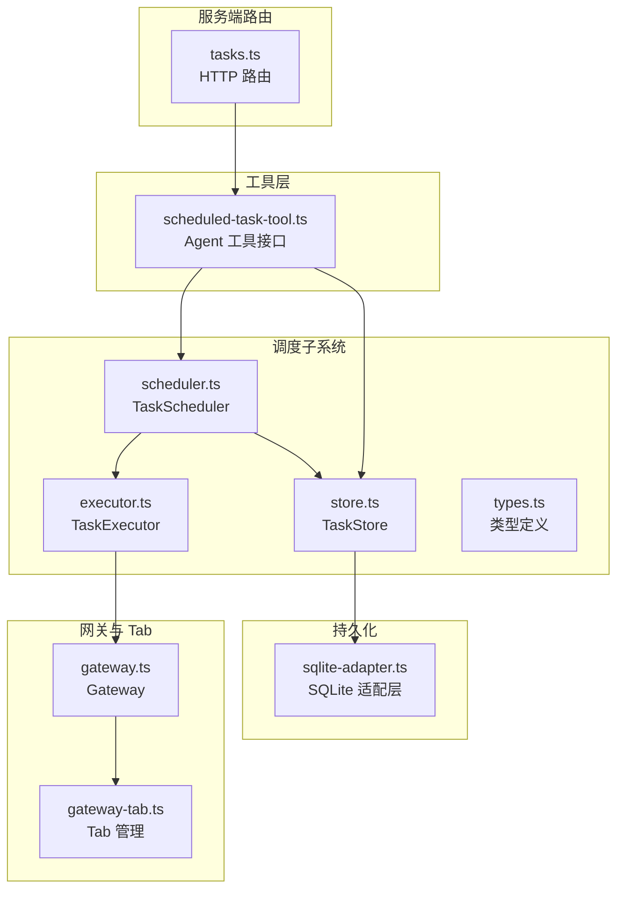
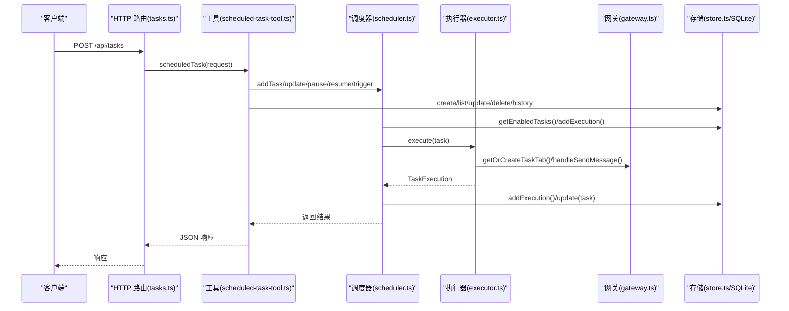
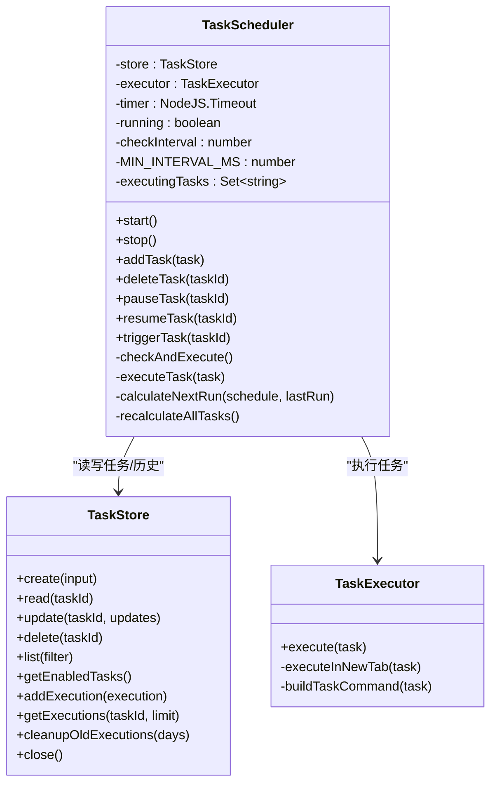
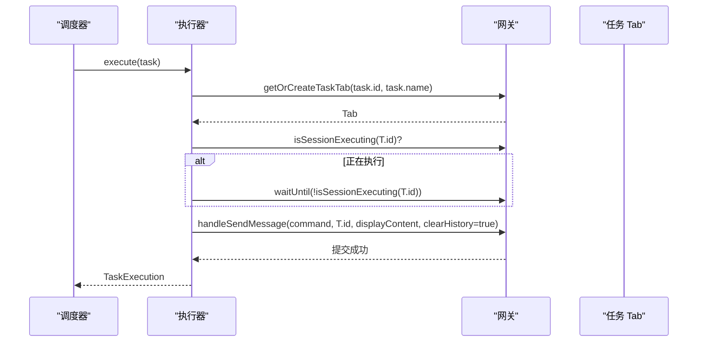
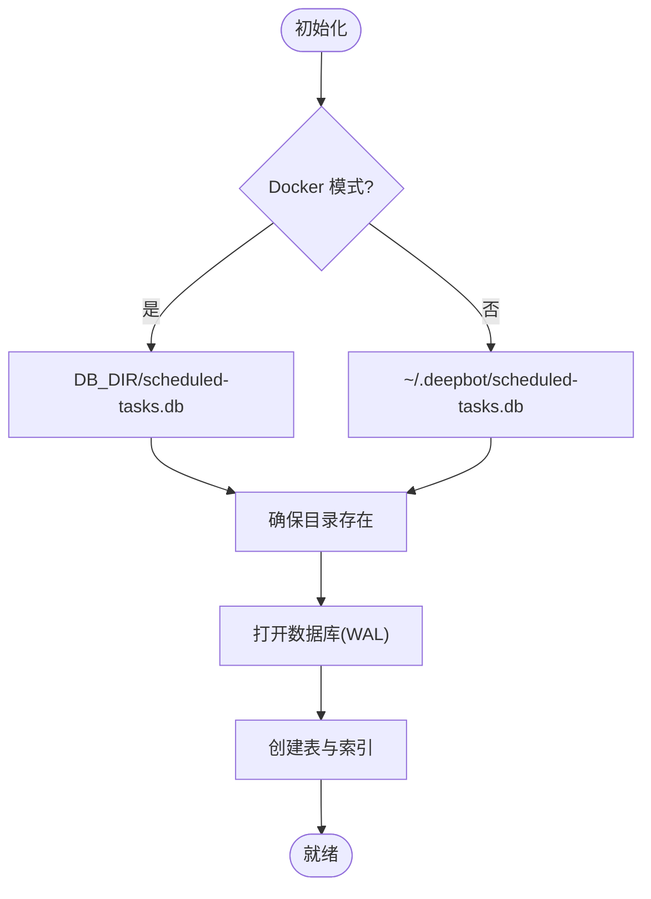
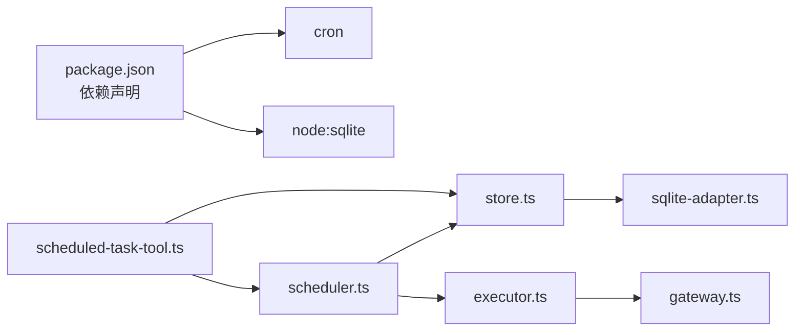

# 任务调度 API

<cite>
**本文档引用的文件**
- [index.ts](file://src/main/scheduled-tasks/index.ts)
- [scheduler.ts](file://src/main/scheduled-tasks/scheduler.ts)
- [store.ts](file://src/main/scheduled-tasks/store.ts)
- [types.ts](file://src/main/scheduled-tasks/types.ts)
- [executor.ts](file://src/main/scheduled-tasks/executor.ts)
- [scheduled-task-tool.ts](file://src/main/tools/scheduled-task-tool.ts)
- [tasks.ts](file://src/server/routes/tasks.ts)
- [sqlite-adapter.ts](file://src/shared/utils/sqlite-adapter.ts)
- [gateway.ts](file://src/main/gateway.ts)
- [gateway-tab.ts](file://src/main/gateway-tab.ts)
- [step-tracker.ts](file://src/main/agent-runtime/step-tracker.ts)
- [package.json](file://package.json)
</cite>

## 目录
1. [简介](#简介)
2. [项目结构](#项目结构)
3. [核心组件](#核心组件)
4. [架构总览](#架构总览)
5. [详细组件分析](#详细组件分析)
6. [依赖关系分析](#依赖关系分析)
7. [性能考量](#性能考量)
8. [故障排查指南](#故障排查指南)
9. [结论](#结论)
10. [附录](#附录)

## 简介
本文件面向 DeepBot 的“任务调度 API”，系统性阐述定时任务的架构设计、调度机制与 API 实现，覆盖以下主题：
- 任务路由与 API 设计
- 定时任务的创建、修改、删除、暂停/恢复、查询与手动触发
- Cron 表达式解析与调度算法
- 任务执行历史记录与状态跟踪
- 任务优先级与并发控制策略
- 失败重试与异常处理
- 任务持久化与系统重启后的状态恢复
- 最佳实践与性能优化建议

## 项目结构
DeepBot 的任务调度系统围绕“工具 + 路由 + 存储 + 调度器 + 执行器”五部分构建，采用模块化组织，便于扩展与维护。

图表来源
- [tasks.ts:1-33](file://src/server/routes/tasks.ts#L1-L33)
- [scheduled-task-tool.ts:128-494](file://src/main/tools/scheduled-task-tool.ts#L128-L494)
- [scheduler.ts:12-322](file://src/main/scheduled-tasks/scheduler.ts#L12-L322)
- [executor.ts:17-170](file://src/main/scheduled-tasks/executor.ts#L17-L170)
- [store.ts:23-364](file://src/main/scheduled-tasks/store.ts#L23-L364)
- [sqlite-adapter.ts:14-102](file://src/shared/utils/sqlite-adapter.ts#L14-L102)
- [gateway.ts:33-200](file://src/main/gateway.ts#L33-L200)
- [gateway-tab.ts:26-200](file://src/main/gateway-tab.ts#L26-L200)

章节来源
- [tasks.ts:1-33](file://src/server/routes/tasks.ts#L1-L33)
- [scheduled-task-tool.ts:128-494](file://src/main/tools/scheduled-task-tool.ts#L128-L494)
- [scheduler.ts:12-322](file://src/main/scheduled-tasks/scheduler.ts#L12-L322)
- [executor.ts:17-170](file://src/main/scheduled-tasks/executor.ts#L17-L170)
- [store.ts:23-364](file://src/main/scheduled-tasks/store.ts#L23-L364)
- [sqlite-adapter.ts:14-102](file://src/shared/utils/sqlite-adapter.ts#L14-L102)
- [gateway.ts:33-200](file://src/main/gateway.ts#L33-L200)
- [gateway-tab.ts:26-200](file://src/main/gateway-tab.ts#L26-L200)

## 核心组件
- 调度器（TaskScheduler）：负责定时检查、触发任务、计算下次执行时间、并发控制与状态更新。
- 执行器（TaskExecutor）：负责在独立 Tab 中执行任务，等待窗口空闲，发送消息并收集执行结果。
- 存储（TaskStore）：基于 SQLite 的持久化存储，提供任务 CRUD、执行历史记录与清理。
- 工具（Scheduled Task Tool）：对外暴露 Agent 工具接口，封装 API 操作（创建、列表、更新、暂停/恢复、手动触发、历史查询等）。
- 路由（tasks.ts）：HTTP 路由入口，转发请求到工具层。
- 类型（types.ts）：统一的任务与调度数据结构定义。
- 网关（Gateway）：提供任务专属 Tab、会话管理与消息路由能力。

章节来源
- [scheduler.ts:12-322](file://src/main/scheduled-tasks/scheduler.ts#L12-L322)
- [executor.ts:17-170](file://src/main/scheduled-tasks/executor.ts#L17-L170)
- [store.ts:23-364](file://src/main/scheduled-tasks/store.ts#L23-L364)
- [scheduled-task-tool.ts:128-494](file://src/main/tools/scheduled-task-tool.ts#L128-L494)
- [tasks.ts:1-33](file://src/server/routes/tasks.ts#L1-L33)
- [types.ts:8-86](file://src/main/scheduled-tasks/types.ts#L8-L86)
- [gateway.ts:33-200](file://src/main/gateway.ts#L33-L200)

## 架构总览
任务调度 API 的工作流如下：
- HTTP 请求经由路由进入工具层；
- 工具层根据 action 调用调度器或存储；
- 调度器根据任务调度类型计算下次执行时间，并在到期时触发执行器；
- 执行器在独立 Tab 中执行任务，等待窗口空闲后发送消息；
- 执行结果写入执行历史表；
- 系统重启后，调度器从存储中加载任务并恢复状态。

图表来源
- [tasks.ts:16-29](file://src/server/routes/tasks.ts#L16-L29)
- [scheduled-task-tool.ts:171-492](file://src/main/tools/scheduled-task-tool.ts#L171-L492)
- [scheduler.ts:67-126](file://src/main/scheduled-tasks/scheduler.ts#L67-L126)
- [executor.ts:21-79](file://src/main/scheduled-tasks/executor.ts#L21-L79)
- [store.ts:133-241](file://src/main/scheduled-tasks/store.ts#L133-L241)

## 详细组件分析

### 调度器（TaskScheduler）
职责与特性：
- 启动/停止：每秒轮询检查到期任务，支持并发执行去重。
- 任务管理：添加、删除、暂停、恢复、手动触发。
- 调度算法：支持一次性、周期性、Cron 三种类型；Cron 使用 cron 库解析；周期性任务支持最小间隔限制。
- 并发控制：使用集合标记正在执行的任务 ID，避免重复执行。
- 状态更新：执行完成后更新 lastRunAt、nextRunAt、runCount；达到 maxRuns 自动禁用；一次性任务执行后禁用。
- 容错：执行前后均进行任务存在性与启用状态校验，防止竞态条件。

图表来源
- [scheduler.ts:12-322](file://src/main/scheduled-tasks/scheduler.ts#L12-L322)
- [store.ts:23-364](file://src/main/scheduled-tasks/store.ts#L23-L364)
- [executor.ts:17-170](file://src/main/scheduled-tasks/executor.ts#L17-L170)

章节来源
- [scheduler.ts:12-322](file://src/main/scheduled-tasks/scheduler.ts#L12-L322)

### 执行器（TaskExecutor）
职责与特性：
- 在独立 Tab 中执行任务，避免与其他会话冲突。
- 等待目标 Tab 空闲（最长等待 5 分钟），防止并发冲突。
- 构造明确的系统前缀命令，避免 AI 将定时任务误认为“创建任务”的请求。
- 记录执行开始/结束时间、耗时、状态（成功/失败）、结果或错误信息。

图表来源
- [executor.ts:86-153](file://src/main/scheduled-tasks/executor.ts#L86-L153)
- [gateway.ts:33-200](file://src/main/gateway.ts#L33-L200)
- [gateway-tab.ts:26-200](file://src/main/gateway-tab.ts#L26-L200)

章节来源
- [executor.ts:17-170](file://src/main/scheduled-tasks/executor.ts#L17-L170)

### 存储（TaskStore）
职责与特性：
- 单例模式，支持 Docker 与普通模式下的数据库路径选择。
- 初始化任务表与执行历史表，建立索引以提升查询性能。
- 提供任务 CRUD、按启用状态与调度类型过滤、列出任务、获取执行历史、清理旧记录。
- 使用 WAL 模式提升并发读写性能；启动时清理孤立的 -shm/-wal 文件。

图表来源
- [store.ts:27-73](file://src/main/scheduled-tasks/store.ts#L27-L73)
- [sqlite-adapter.ts:14-70](file://src/shared/utils/sqlite-adapter.ts#L14-L70)

章节来源
- [store.ts:23-364](file://src/main/scheduled-tasks/store.ts#L23-L364)
- [sqlite-adapter.ts:14-102](file://src/shared/utils/sqlite-adapter.ts#L14-L102)

### 工具层（Scheduled Task Tool）
职责与特性：
- 对外提供统一的 Agent 工具接口，支持多种操作：create、list、update、updateSchedule、delete、pause、resume、trigger、history。
- 参数校验与调度配置解析：支持自然语言描述解析为调度配置（如“每隔 X 秒/分钟/小时”、“每天 X 点”、“Cron 表达式”）。
- 任务数量限制（默认最多 10 个）。
- 与调度器集成：创建任务后添加到调度器；更新调度后重新计算下次执行时间；暂停/恢复任务时同步调度器状态。
- 与网关集成：删除/暂停任务时可关闭/重置对应任务 Tab 的会话运行时。

章节来源
- [scheduled-task-tool.ts:128-494](file://src/main/tools/scheduled-task-tool.ts#L128-L494)

### 路由层（tasks.ts）
职责与特性：
- 提供 /api/tasks POST 接口，接收请求体并调用 GatewayAdapter 的 scheduledTask 方法，返回 JSON 响应。
- 统一错误处理，捕获异常并返回错误信息。

章节来源
- [tasks.ts:1-33](file://src/server/routes/tasks.ts#L1-L33)

### 类型定义（types.ts）
职责与特性：
- 统一的任务与调度数据结构：任务、调度配置、执行记录、过滤器、创建/更新输入。
- 支持三种调度类型：once（一次性）、interval（周期性）、cron（Cron 表达式）。
- 支持最大执行次数限制（可选）。

章节来源
- [types.ts:8-86](file://src/main/scheduled-tasks/types.ts#L8-L86)

### 网关与 Tab（Gateway/GatewayTab）
职责与特性：
- Gateway 提供任务专属 Tab 的创建与管理，以及消息路由能力。
- GatewayTab 管理 Tab 生命周期、持久化与历史加载。
- 执行器通过网关获取/创建任务 Tab，并在 Tab 空闲后发送消息执行。

章节来源
- [gateway.ts:33-200](file://src/main/gateway.ts#L33-L200)
- [gateway-tab.ts:26-200](file://src/main/gateway-tab.ts#L26-L200)

## 依赖关系分析
- 外部依赖：cron 用于 Cron 表达式解析；node:sqlite 作为 SQLite 适配层；better-sqlite3 兼容 API。
- 内部耦合：工具层依赖调度器与存储；调度器依赖存储与执行器；执行器依赖网关；路由依赖工具层。

图表来源
- [package.json:45-77](file://package.json#L45-L77)
- [scheduled-task-tool.ts:36-41](file://src/main/tools/scheduled-task-tool.ts#L36-L41)
- [scheduler.ts:7-10](file://src/main/scheduled-tasks/scheduler.ts#L7-L10)
- [executor.ts:8-11](file://src/main/scheduled-tasks/executor.ts#L8-L11)
- [sqlite-adapter.ts:9](file://src/shared/utils/sqlite-adapter.ts#L9)

章节来源
- [package.json:45-77](file://package.json#L45-L77)

## 性能考量
- 轮询频率：调度器每秒检查一次到期任务，平衡实时性与 CPU 开销。
- 并发控制：使用 Set 标记正在执行的任务 ID，避免重复执行；执行器等待目标 Tab 空闲，防止并发冲突。
- 数据库优化：WAL 模式、索引（tasks.enabled、tasks.next_run_at、executions.task_id）提升查询性能。
- 最小间隔限制：周期性任务最小间隔为 10 秒，避免过于频繁的调度。
- 历史清理：支持按天清理旧执行记录，控制数据库膨胀。

章节来源
- [scheduler.ts:17-19](file://src/main/scheduled-tasks/scheduler.ts#L17-L19)
- [scheduler.ts:263-266](file://src/main/scheduled-tasks/scheduler.ts#L263-L266)
- [store.ts:123-127](file://src/main/scheduled-tasks/store.ts#L123-L127)
- [store.ts:328-337](file://src/main/scheduled-tasks/store.ts#L328-L337)

## 故障排查指南
常见问题与处理建议：
- 任务未执行
  - 检查任务是否启用、是否存在；确认 nextRunAt 是否已到达；查看调度器日志。
  - 章节来源: [scheduler.ts:131-151](file://src/main/scheduled-tasks/scheduler.ts#L131-L151)
- Cron 表达式无效
  - 调度器会记录错误并返回 null；请修正表达式格式。
  - 章节来源: [scheduler.ts:284-296](file://src/main/scheduled-tasks/scheduler.ts#L284-L296)
- 执行器报错“Gateway 实例未设置”
  - 确保在 Gateway 初始化后正确设置执行器的网关实例。
  - 章节来源: [executor.ts:87-89](file://src/main/scheduled-tasks/executor.ts#L87-L89)
- Tab 空闲等待超时
  - 执行器等待目标 Tab 空闲最长 5 分钟；若长时间占用，需检查该 Tab 的会话状态。
  - 章节来源: [executor.ts:104-129](file://src/main/scheduled-tasks/executor.ts#L104-L129)
- 数据库异常
  - 启动时会清理孤立的 -shm/-wal 文件；若仍异常，检查数据库路径权限与磁盘空间。
  - 章节来源: [store.ts:40-65](file://src/main/scheduled-tasks/store.ts#L40-L65)

## 结论
DeepBot 的任务调度 API 通过清晰的分层设计与完善的持久化机制，实现了稳定、可扩展的定时任务能力。其调度算法简洁可靠，执行器与网关深度集成，确保任务在隔离环境中安全执行。配合历史记录与清理策略，系统在长期运行中保持良好性能与可观测性。

## 附录

### API 定义与使用说明
- 路由：POST /api/tasks
- 请求体字段（示例）
  - action: 操作类型（create、list、update、updateSchedule、delete、pause、resume、trigger、history）
  - 其他字段随 action 变化（如 taskId、name、description、schedule、scheduleText、limit 等）
- 响应
  - 成功：success: true 与具体结果
  - 失败：success: false 与错误信息

章节来源
- [tasks.ts:16-29](file://src/server/routes/tasks.ts#L16-L29)
- [scheduled-task-tool.ts:171-492](file://src/main/tools/scheduled-task-tool.ts#L171-L492)

### 调度类型与参数
- once
  - executeAt: 执行时间戳
  - maxRuns: 最大执行次数（可选）
- interval
  - intervalMs: 间隔毫秒数
  - startAt: 开始时间戳（可选）
  - maxRuns: 最大执行次数（可选）
- cron
  - cronExpr: Cron 表达式
  - timezone: 时区（默认 Asia/Shanghai）
  - maxRuns: 最大执行次数（可选）

章节来源
- [types.ts:8-24](file://src/main/scheduled-tasks/types.ts#L8-L24)
- [scheduler.ts:245-302](file://src/main/scheduled-tasks/scheduler.ts#L245-L302)

### 任务优先级与并发控制
- 优先级：系统未提供显式优先级字段；可通过任务类型与间隔策略间接控制。
- 并发控制：
  - 调度器：Set 标记执行中任务 ID，避免重复执行。
  - 执行器：等待目标 Tab 空闲，最长等待 5 分钟。
  - 一次性任务：执行完成后自动禁用。
  - 达到 maxRuns：自动禁用任务。

章节来源
- [scheduler.ts:19](file://src/main/scheduled-tasks/scheduler.ts#L19)
- [scheduler.ts:156-240](file://src/main/scheduled-tasks/scheduler.ts#L156-L240)
- [executor.ts:97-129](file://src/main/scheduled-tasks/executor.ts#L97-L129)

### 失败重试与异常处理
- 执行器对任务执行进行 try/catch，记录状态与错误信息。
- 调度器在执行前后进行任务存在性与启用状态校验，避免竞态。
- 工具层对参数进行严格校验与调度解析，自然语言描述解析失败会抛出错误。

章节来源
- [executor.ts:34-78](file://src/main/scheduled-tasks/executor.ts#L34-L78)
- [scheduler.ts:160-170](file://src/main/scheduled-tasks/scheduler.ts#L160-L170)
- [scheduled-task-tool.ts:499-538](file://src/main/tools/scheduled-task-tool.ts#L499-L538)

### 任务持久化与状态恢复
- 存储：SQLite（WAL 模式），任务表与执行历史表。
- 启动流程：调度器启动时重新计算所有启用任务的 nextRunAt。
- 系统重启：数据库文件持久化，重启后恢复任务与历史记录。

章节来源
- [store.ts:69](file://src/main/scheduled-tasks/store.ts#L69)
- [scheduler.ts:307-320](file://src/main/scheduled-tasks/scheduler.ts#L307-L320)

### 最佳实践与性能优化建议
- 调度策略
  - 避免过于频繁的周期性任务（间隔不低于 10 秒）。
  - 使用 Cron 表达式精确控制执行时间，减少资源争用。
- 并发与资源
  - 合理设置任务数量上限（默认 10），避免过多任务导致资源紧张。
  - 使用一次性任务替代高频周期任务时，结合 Cron 精准调度。
- 可观测性
  - 定期清理执行历史（默认保留 30 天），控制数据库体积。
  - 关注调度器与执行器日志，及时发现异常。
- 安全与稳定性
  - 任务描述中包含明确的系统前缀，避免 AI 将定时任务误判为“创建任务”的请求。
  - 暂停/恢复任务时同步调度器状态，必要时重置对应 Tab 的会话运行时。

章节来源
- [scheduler.ts:263-266](file://src/main/scheduled-tasks/scheduler.ts#L263-L266)
- [scheduled-task-tool.ts:51](file://src/main/tools/scheduled-task-tool.ts#L51)
- [store.ts:328-337](file://src/main/scheduled-tasks/store.ts#L328-L337)
- [executor.ts:162-168](file://src/main/scheduled-tasks/executor.ts#L162-L168)