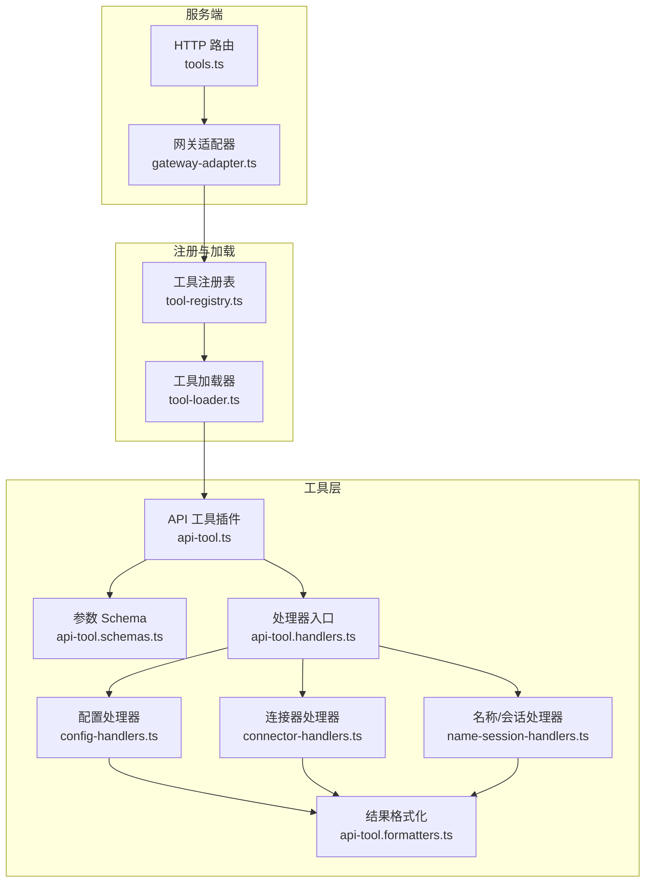
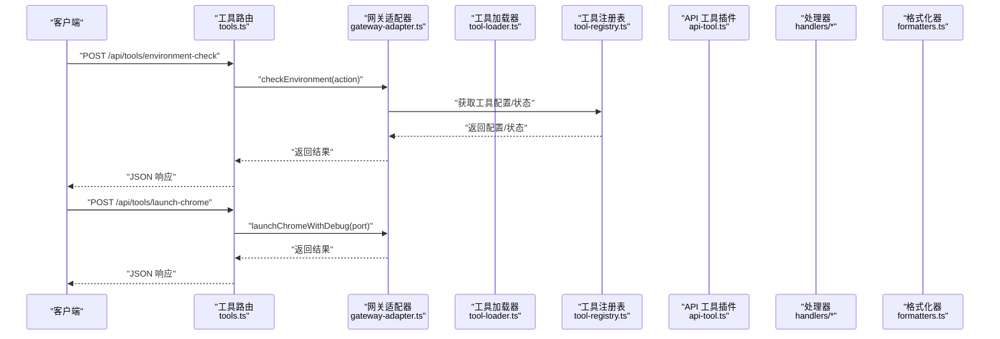
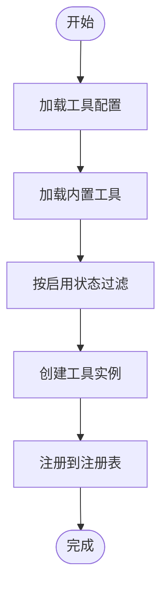
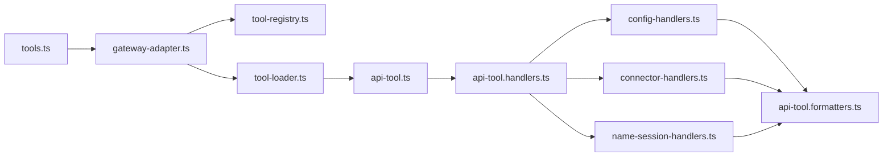

# 工具调用 API

<cite>
**本文引用的文件**
- [tools.ts](file://src/server/routes/tools.ts)
- [gateway-adapter.ts](file://src/server/gateway-adapter.ts)
- [api-tool.ts](file://src/main/tools/api-tool.ts)
- [api-tool.handlers.ts](file://src/main/tools/api-tool.handlers.ts)
- [api-tool.schemas.ts](file://src/main/tools/api-tool.schemas.ts)
- [api-tool.formatters.ts](file://src/main/tools/api-tool.formatters.ts)
- [config-handlers.ts](file://src/main/tools/handlers/config-handlers.ts)
- [connector-handlers.ts](file://src/main/tools/handlers/connector-handlers.ts)
- [name-session-handlers.ts](file://src/main/tools/handlers/name-session-handlers.ts)
- [tool-registry.ts](file://src/main/tools/registry/tool-registry.ts)
- [tool-loader.ts](file://src/main/tools/registry/tool-loader.ts)
</cite>

## 目录
1. [简介](#简介)
2. [项目结构](#项目结构)
3. [核心组件](#核心组件)
4. [架构总览](#架构总览)
5. [详细组件分析](#详细组件分析)
6. [依赖关系分析](#依赖关系分析)
7. [性能考量](#性能考量)
8. [故障排查指南](#故障排查指南)
9. [结论](#结论)
10. [附录](#附录)

## 简介
本文件面向 DeepBot 的“工具调用 API”，系统性阐述工具路由设计、工具发现与加载、工具执行与状态查询、参数校验与序列化、执行结果与错误处理、配置管理与版本控制、性能监控与资源统计、沙箱执行与安全隔离，以及最佳实践与故障排查建议。读者可据此快速理解并正确使用工具调用 API。

## 项目结构
围绕工具调用 API 的关键文件分布如下：
- 服务端路由层：负责对外暴露 HTTP 接口，转发至网关适配器
- 网关适配器：桥接 Web 模式与 Gateway，统一事件与配置访问
- 工具层：API 工具插件定义工具清单、参数 Schema 与执行处理器
- 处理器层：按功能拆分的处理函数，负责业务逻辑与结果格式化
- 注册表与加载器：负责工具注册、启用/禁用、加载与装配

图表来源
- [tools.ts:1-57](file://src/server/routes/tools.ts#L1-L57)
- [gateway-adapter.ts:1-763](file://src/server/gateway-adapter.ts#L1-L763)
- [api-tool.ts:1-220](file://src/main/tools/api-tool.ts#L1-L220)
- [api-tool.handlers.ts:1-44](file://src/main/tools/api-tool.handlers.ts#L1-L44)
- [config-handlers.ts:1-322](file://src/main/tools/handlers/config-handlers.ts#L1-L322)
- [connector-handlers.ts:1-337](file://src/main/tools/handlers/connector-handlers.ts#L1-L337)
- [name-session-handlers.ts:1-361](file://src/main/tools/handlers/name-session-handlers.ts#L1-L361)
- [api-tool.schemas.ts:1-258](file://src/main/tools/api-tool.schemas.ts#L1-L258)
- [api-tool.formatters.ts:1-437](file://src/main/tools/api-tool.formatters.ts#L1-L437)
- [tool-registry.ts:1-328](file://src/main/tools/registry/tool-registry.ts#L1-L328)
- [tool-loader.ts:1-312](file://src/main/tools/registry/tool-loader.ts#L1-L312)

章节来源
- [tools.ts:1-57](file://src/server/routes/tools.ts#L1-L57)
- [gateway-adapter.ts:1-763](file://src/server/gateway-adapter.ts#L1-L763)
- [api-tool.ts:1-220](file://src/main/tools/api-tool.ts#L1-L220)
- [tool-loader.ts:1-312](file://src/main/tools/registry/tool-loader.ts#L1-L312)
- [tool-registry.ts:1-328](file://src/main/tools/registry/tool-registry.ts#L1-L328)

## 核心组件
- 工具路由与网关适配器
  - 路由层提供环境检查与 Chrome 调试等工具相关接口，内部委托网关适配器执行
  - 网关适配器在 Web 模式下模拟 Electron 的窗口与 IPC，将内部事件转换为 WebSocket 事件
- API 工具插件
  - 定义工具清单、参数 Schema 与执行函数，覆盖配置查询/设置、连接器管理、名称与会话、Tab 查询、日期时间等能力
- 处理器与格式化
  - 按功能拆分处理器，统一返回结构与错误处理，并通过格式化模块输出用户友好消息
- 注册表与加载器
  - 注册工具插件、维护工具配置、按启用状态装配工具集合

章节来源
- [tools.ts:12-56](file://src/server/routes/tools.ts#L12-L56)
- [gateway-adapter.ts:45-196](file://src/server/gateway-adapter.ts#L45-L196)
- [api-tool.ts:25-218](file://src/main/tools/api-tool.ts#L25-L218)
- [api-tool.handlers.ts:13-44](file://src/main/tools/api-tool.handlers.ts#L13-L44)
- [tool-registry.ts:36-310](file://src/main/tools/registry/tool-registry.ts#L36-L310)
- [tool-loader.ts:40-311](file://src/main/tools/registry/tool-loader.ts#L40-L311)

## 架构总览
工具调用 API 的整体流程如下：
- 客户端通过 HTTP 路由发起请求
- 路由层解析请求并调用网关适配器
- 网关适配器根据业务选择对应工具或处理器
- 工具执行完成后，通过格式化模块生成人类可读消息与结构化数据
- 结果通过统一响应返回客户端

图表来源
- [tools.ts:9-56](file://src/server/routes/tools.ts#L9-L56)
- [gateway-adapter.ts:342-362](file://src/server/gateway-adapter.ts#L342-L362)
- [tool-loader.ts:57-71](file://src/main/tools/registry/tool-loader.ts#L57-L71)
- [tool-registry.ts:201-209](file://src/main/tools/registry/tool-registry.ts#L201-L209)
- [api-tool.ts:25-218](file://src/main/tools/api-tool.ts#L25-L218)

## 详细组件分析

### 工具路由与环境检查
- 环境检查接口
  - 路径：POST /api/tools/environment-check
  - 请求体：action（字符串）
  - 行为：调用网关适配器执行环境检查工具，返回详细状态
- Chrome 调试接口
  - 路径：POST /api/tools/launch-chrome
  - 请求体：port（数字）
  - 行为：尝试启动带调试端口的 Chrome（Web 模式下返回不支持提示）

章节来源
- [tools.ts:12-56](file://src/server/routes/tools.ts#L12-L56)
- [gateway-adapter.ts:342-362](file://src/server/gateway-adapter.ts#L342-L362)

### API 工具插件与工具清单
- 插件元数据：包含 id、名称、版本、描述、作者、分类、标签、是否需要配置等
- 工具清单（节选）
  - 获取系统配置：按类型查询工作目录、模型、工具等配置
  - 设置模型配置：提供商、模型、API 地址、API Key、上下文窗口等
  - 设置图片生成工具配置：模型、API 地址、API Key
  - 设置 Web 搜索工具配置：提供商、模型、API 地址、API Key
  - 启用/禁用内置工具：图片生成、Web 搜索、浏览器、日历读取/创建
  - 设置飞书连接器配置：App ID、App Secret、启用状态
  - 启用/禁用连接器：飞书
  - 获取配对记录、审核/拒绝配对请求
  - 获取 Tab 列表、获取名称配置、设置名称配置（区分全局与当前 Tab）
  - 获取 Session 文件路径、获取日期时间（多种格式与时区）

章节来源
- [api-tool.ts:25-218](file://src/main/tools/api-tool.ts#L25-L218)
- [api-tool.schemas.ts:9-258](file://src/main/tools/api-tool.schemas.ts#L9-L258)

### 参数验证与序列化
- 使用 TypeBox 定义 Schema，确保参数类型、必填项、枚举值、范围约束等
- 常见约束
  - 字符串长度限制（如名称配置最大长度）
  - 数值范围限制（如上下文窗口）
  - 枚举值限定（如提供商、工具名称）
  - 正则表达式（如配对码格式）
- 执行前进行 AbortSignal 检查，支持取消

章节来源
- [api-tool.schemas.ts:9-258](file://src/main/tools/api-tool.schemas.ts#L9-L258)
- [config-handlers.ts:32-83](file://src/main/tools/handlers/config-handlers.ts#L32-L83)
- [connector-handlers.ts:127-173](file://src/main/tools/handlers/connector-handlers.ts#L127-L173)
- [name-session-handlers.ts:27-45](file://src/main/tools/handlers/name-session-handlers.ts#L27-L45)

### 工具发现与加载
- 工具加载器负责扫描并加载内置工具，按启用状态装配
- 工具注册表维护插件与实例映射，支持配置读取与清理
- 工具配置可通过工具目录下的配置文件动态读取

图表来源
- [tool-loader.ts:57-71](file://src/main/tools/registry/tool-loader.ts#L57-L71)
- [tool-loader.ts:109-301](file://src/main/tools/registry/tool-loader.ts#L109-L301)
- [tool-registry.ts:36-55](file://src/main/tools/registry/tool-registry.ts#L36-L55)
- [tool-registry.ts:201-209](file://src/main/tools/registry/tool-registry.ts#L201-L209)

章节来源
- [tool-loader.ts:57-301](file://src/main/tools/registry/tool-loader.ts#L57-L301)
- [tool-registry.ts:36-310](file://src/main/tools/registry/tool-registry.ts#L36-L310)

### 工具执行与状态查询
- 执行流程
  - 路由层接收请求
  - 网关适配器根据业务选择工具或处理器
  - 处理器执行业务逻辑，必要时调用 Gateway 重载配置或广播事件
  - 格式化器生成人类可读消息与结构化数据
- 状态查询
  - 环境检查：返回详细状态信息
  - 连接器健康检查：返回状态与消息
  - 配对记录：支持统计与详情展示
  - 浏览器工具状态：检测 Chrome 安装与路径

章节来源
- [gateway-adapter.ts:342-362](file://src/server/gateway-adapter.ts#L342-L362)
- [gateway-adapter.ts:454-476](file://src/server/gateway-adapter.ts#L454-L476)
- [connector-handlers.ts:127-173](file://src/main/tools/handlers/connector-handlers.ts#L127-L173)
- [config-handlers.ts:71-74](file://src/main/tools/handlers/config-handlers.ts#L71-L74)

### 配置管理与版本控制
- 配置查询与设置
  - 获取配置：支持按类型或全部查询，包含禁用工具状态与连接器配置
  - 设置配置：工作目录、模型、图片生成、Web 搜索等，部分变更即时生效，部分需重启会话
- 版本控制
  - 工具插件元数据包含版本号，便于追踪与升级
  - 工具启用/禁用采用延迟重置策略，避免中断当前任务

章节来源
- [api-tool.ts:25-218](file://src/main/tools/api-tool.ts#L25-L218)
- [config-handlers.ts:145-202](file://src/main/tools/handlers/config-handlers.ts#L145-L202)
- [config-handlers.ts:250-280](file://src/main/tools/handlers/config-handlers.ts#L250-L280)
- [gateway-adapter.ts:268-337](file://src/server/gateway-adapter.ts#L268-L337)

### 执行结果获取与错误处理
- 统一响应结构
  - 成功：包含人类可读消息与结构化数据
  - 失败：包含错误信息，HTTP 状态码 500
- 错误处理
  - 处理器内部捕获异常并返回标准化错误
  - 网关适配器在上传/读取等场景中进行路径安全检查与大小限制

章节来源
- [tools.ts:16-30](file://src/server/routes/tools.ts#L16-L30)
- [tools.ts:36-50](file://src/server/routes/tools.ts#L36-L50)
- [config-handlers.ts:80-82](file://src/main/tools/handlers/config-handlers.ts#L80-L82)
- [gateway-adapter.ts:558-625](file://src/server/gateway-adapter.ts#L558-L625)

### 性能监控与资源统计
- 工具执行过程中的事件推送
  - 流式消息、执行步骤更新、错误事件等通过网关适配器转换为 WebSocket 事件
- 资源使用
  - 文件上传/读取/删除具备大小限制与路径白名单校验，防止滥用
  - 连接器启停与健康检查返回状态，便于监控

章节来源
- [gateway-adapter.ts:70-196](file://src/server/gateway-adapter.ts#L70-L196)
- [gateway-adapter.ts:629-720](file://src/server/gateway-adapter.ts#L629-L720)
- [gateway-adapter.ts:454-476](file://src/server/gateway-adapter.ts#L454-L476)

### 沙箱执行与安全隔离
- 路径安全
  - 读取图片时强制路径白名单校验，仅允许工作目录及其子目录
- 文件上传
  - 限制最大文件大小，写入临时目录，提供删除接口
- 连接器配置
  - 飞书 App ID/Secret 等敏感信息保存于系统配置存储，启用前需配置
- 取消与超时
  - 执行前检查 AbortSignal，支持取消

章节来源
- [gateway-adapter.ts:645-682](file://src/server/gateway-adapter.ts#L645-L682)
- [gateway-adapter.ts:629-643](file://src/server/gateway-adapter.ts#L629-L643)
- [connector-handlers.ts:26-59](file://src/main/tools/handlers/connector-handlers.ts#L26-L59)
- [config-handlers.ts:39-39](file://src/main/tools/handlers/config-handlers.ts#L39-L39)

### 工具调用最佳实践
- 参数校验优先：在调用前确保参数满足 Schema 约束
- 分步设置：涉及全局配置变更时，注意生效时机与会话重启
- 安全上传：遵守文件大小限制与临时目录约定
- 连接器管理：先配置后启用，关注健康检查与待授权数量
- 取消机制：长耗时任务应支持取消信号

### 工具调用 API 一览（摘要）
- 环境检查
  - 方法：POST
  - 路径：/api/tools/environment-check
  - 请求体：action（字符串）
  - 响应：success、details 或 error
- 启动 Chrome 调试
  - 方法：POST
  - 路径：/api/tools/launch-chrome
  - 请求体：port（数字）
  - 响应：success、error（Web 模式提示不支持）

章节来源
- [tools.ts:12-56](file://src/server/routes/tools.ts#L12-L56)
- [gateway-adapter.ts:357-362](file://src/server/gateway-adapter.ts#L357-L362)

## 依赖关系分析
- 路由层依赖网关适配器
- 网关适配器依赖注册表与加载器以获取工具状态与执行工具
- API 工具插件依赖处理器与格式化模块
- 处理器依赖系统配置存储与 Gateway 实例

图表来源
- [tools.ts:9-56](file://src/server/routes/tools.ts#L9-L56)
- [gateway-adapter.ts:268-337](file://src/server/gateway-adapter.ts#L268-L337)
- [tool-loader.ts:57-71](file://src/main/tools/registry/tool-loader.ts#L57-L71)
- [tool-registry.ts:201-209](file://src/main/tools/registry/tool-registry.ts#L201-L209)
- [api-tool.ts:25-218](file://src/main/tools/api-tool.ts#L25-L218)
- [api-tool.handlers.ts:13-44](file://src/main/tools/api-tool.handlers.ts#L13-L44)
- [config-handlers.ts:1-322](file://src/main/tools/handlers/config-handlers.ts#L1-L322)
- [connector-handlers.ts:1-337](file://src/main/tools/handlers/connector-handlers.ts#L1-L337)
- [name-session-handlers.ts:1-361](file://src/main/tools/handlers/name-session-handlers.ts#L1-L361)
- [api-tool.formatters.ts:1-437](file://src/main/tools/api-tool.formatters.ts#L1-L437)

## 性能考量
- 工具加载与装配：按启用状态过滤，减少无效工具实例化
- 配置变更：部分配置即时生效，部分延迟生效，避免阻塞当前任务
- 文件操作：上传/读取/删除均有限制与白名单校验，降低 IO 压力
- 事件驱动：通过网关适配器推送事件，避免轮询带来的开销

## 故障排查指南
- 环境检查失败
  - 检查 action 参数与系统环境
  - 查看返回的详细状态信息
- 连接器问题
  - 先确认配置是否保存且 enabled
  - 执行健康检查，查看状态与消息
  - 关注待授权数量广播
- 文件上传失败
  - 检查文件大小是否超过限制
  - 确认数据格式为 base64
  - 校验临时目录路径
- 配置未生效
  - 确认是否属于需要重启会话才生效的配置
  - 检查工具启用状态与延迟重置标记

章节来源
- [gateway-adapter.ts:342-362](file://src/server/gateway-adapter.ts#L342-L362)
- [gateway-adapter.ts:454-476](file://src/server/gateway-adapter.ts#L454-L476)
- [gateway-adapter.ts:558-625](file://src/server/gateway-adapter.ts#L558-L625)
- [config-handlers.ts:267-271](file://src/main/tools/handlers/config-handlers.ts#L267-L271)

## 结论
DeepBot 的工具调用 API 通过清晰的路由层、强大的网关适配器、模块化的工具与处理器，以及严格的参数校验与安全策略，提供了稳定、可扩展且易用的工具访问能力。配合完善的错误处理与事件推送机制，能够满足复杂场景下的工具集成需求。

## 附录
- 工具名称常量与工具清单可参考 API 工具插件定义
- Schema 与格式化模块为扩展新工具提供一致的契约与输出规范