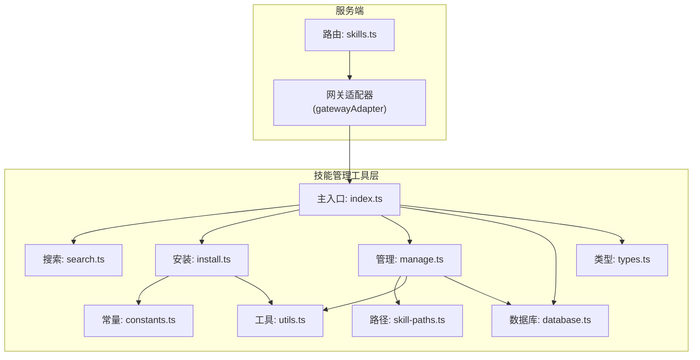
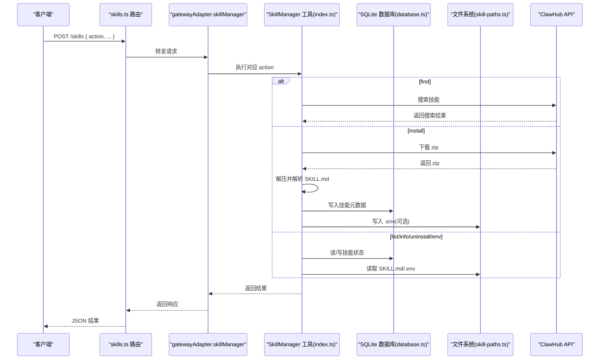
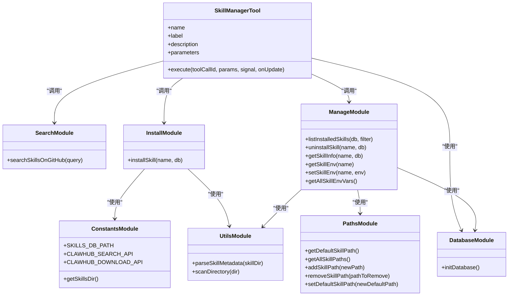
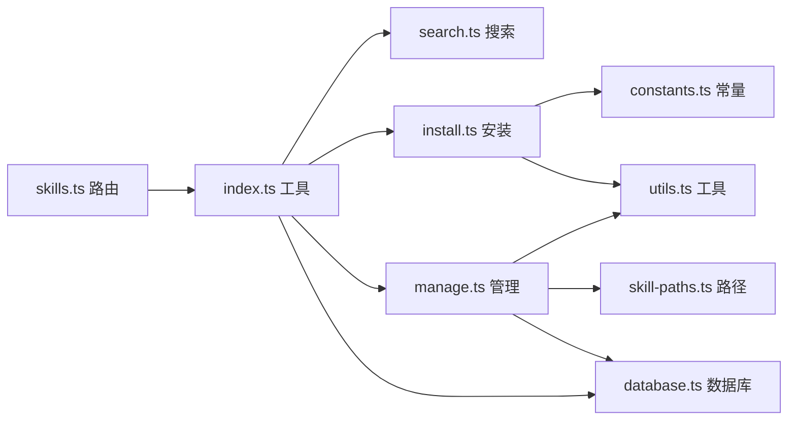

# 技能管理 API

<cite>
**本文引用的文件**
- [src/server/routes/skills.ts](file://src/server/routes/skills.ts)
- [src/main/tools/skill-manager/index.ts](file://src/main/tools/skill-manager/index.ts)
- [src/main/tools/skill-manager/manage.ts](file://src/main/tools/skill-manager/manage.ts)
- [src/main/tools/skill-manager/install.ts](file://src/main/tools/skill-manager/install.ts)
- [src/main/tools/skill-manager/search.ts](file://src/main/tools/skill-manager/search.ts)
- [src/main/tools/skill-manager/types.ts](file://src/main/tools/skill-manager/types.ts)
- [src/main/tools/skill-manager/constants.ts](file://src/main/tools/skill-manager/constants.ts)
- [src/main/tools/skill-manager/utils.ts](file://src/main/tools/skill-manager/utils.ts)
- [src/main/tools/skill-manager/database.ts](file://src/main/tools/skill-manager/database.ts)
- [src/main/config/skill-paths.ts](file://src/main/config/skill-paths.ts)
</cite>

## 目录
1. [简介](#简介)
2. [项目结构](#项目结构)
3. [核心组件](#核心组件)
4. [架构总览](#架构总览)
5. [详细组件分析](#详细组件分析)
6. [依赖分析](#依赖分析)
7. [性能考虑](#性能考虑)
8. [故障排查指南](#故障排查指南)
9. [结论](#结论)
10. [附录](#附录)

## 简介
本文件面向 史丽慧小助理 的“技能管理 API”，系统性阐述技能路由的架构设计、技能生命周期管理、安装/卸载/搜索/配置等接口实现、技能包验证与部署流程、版本管理机制、依赖关系与冲突检测能力、配置管理与个性化定制、性能监控与使用统计、热更新与动态加载机制，以及技能开发与集成的最佳实践。

## 项目结构
技能管理相关代码主要分布在以下模块：
- 服务端路由层：统一入口接收技能请求并转发至网关适配器
- 技能管理工具层：封装 find/install/list/uninstall/info/env 等操作
- 数据与存储层：SQLite 数据库存储技能元数据与状态
- 路径与常量层：技能目录、ClawHub API 常量、默认路径解析
- 工具与扫描层：SKILL.md 元数据解析、目录扫描、ZIP 下载与解压

图表来源
- [src/server/routes/skills.ts:1-38](file://src/server/routes/skills.ts#L1-L38)
- [src/main/tools/skill-manager/index.ts:1-180](file://src/main/tools/skill-manager/index.ts#L1-L180)
- [src/main/tools/skill-manager/search.ts:1-81](file://src/main/tools/skill-manager/search.ts#L1-L81)
- [src/main/tools/skill-manager/install.ts:1-150](file://src/main/tools/skill-manager/install.ts#L1-L150)
- [src/main/tools/skill-manager/manage.ts:1-281](file://src/main/tools/skill-manager/manage.ts#L1-L281)
- [src/main/tools/skill-manager/utils.ts:1-92](file://src/main/tools/skill-manager/utils.ts#L1-L92)
- [src/main/tools/skill-manager/database.ts:1-41](file://src/main/tools/skill-manager/database.ts#L1-L41)
- [src/main/tools/skill-manager/constants.ts:1-35](file://src/main/tools/skill-manager/constants.ts#L1-L35)
- [src/main/config/skill-paths.ts:1-69](file://src/main/config/skill-paths.ts#L1-L69)

章节来源
- [src/server/routes/skills.ts:1-38](file://src/server/routes/skills.ts#L1-L38)
- [src/main/tools/skill-manager/index.ts:1-180](file://src/main/tools/skill-manager/index.ts#L1-L180)
- [src/main/tools/skill-manager/database.ts:1-41](file://src/main/tools/skill-manager/database.ts#L1-L41)
- [src/main/config/skill-paths.ts:1-69](file://src/main/config/skill-paths.ts#L1-L69)

## 核心组件
- 技能管理路由：统一入口，接收 action 参数并调用网关适配器的 skillManager 处理
- 技能管理工具：封装 find/install/list/uninstall/info/get-env/set-env 等动作；参数校验与错误处理
- 数据库：skills 表存储技能元数据、启用状态、使用计数、最后使用时间等
- 路径与常量：技能目录、ClawHub 搜索/下载 API、数据库路径
- 工具函数：SKILL.md 元数据解析、目录扫描、ZIP 下载与解压

章节来源
- [src/server/routes/skills.ts:10-37](file://src/server/routes/skills.ts#L10-L37)
- [src/main/tools/skill-manager/index.ts:27-179](file://src/main/tools/skill-manager/index.ts#L27-L179)
- [src/main/tools/skill-manager/database.ts:13-40](file://src/main/tools/skill-manager/database.ts#L13-L40)
- [src/main/tools/skill-manager/constants.ts:9-35](file://src/main/tools/skill-manager/constants.ts#L9-L35)
- [src/main/tools/skill-manager/utils.ts:28-80](file://src/main/tools/skill-manager/utils.ts#L28-L80)

## 架构总览
技能管理采用“路由 -> 工具 -> 存储/外部服务”的分层架构。客户端通过统一路由提交 action，工具层根据 action 分派到具体功能模块，数据库持久化技能状态，必要时访问 ClawHub API 进行搜索或下载。

图表来源
- [src/server/routes/skills.ts:14-36](file://src/server/routes/skills.ts#L14-L36)
- [src/main/tools/skill-manager/index.ts:78-177](file://src/main/tools/skill-manager/index.ts#L78-L177)
- [src/main/tools/skill-manager/search.ts:29-80](file://src/main/tools/skill-manager/search.ts#L29-L80)
- [src/main/tools/skill-manager/install.ts:22-80](file://src/main/tools/skill-manager/install.ts#L22-L80)
- [src/main/tools/skill-manager/manage.ts:17-281](file://src/main/tools/skill-manager/manage.ts#L17-L281)
- [src/main/tools/skill-manager/database.ts:13-40](file://src/main/tools/skill-manager/database.ts#L13-L40)

## 详细组件分析

### 路由层：技能统一入口
- 责任：接收请求、校验 action、调用网关适配器、返回结果
- 错误处理：缺失 action 返回 400；异常捕获返回 500
- 参考路径：[src/server/routes/skills.ts:14-36](file://src/server/routes/skills.ts#L14-L36)

章节来源
- [src/server/routes/skills.ts:10-37](file://src/server/routes/skills.ts#L10-L37)

### 工具层：技能管理主入口
- 功能清单：find、install、list、enable、disable、uninstall、info、get-env、set-env
- 参数校验：TypeBox 定义参数结构，缺失关键参数抛错
- 执行流程：按 action 分派到对应模块，组装结果并返回
- 参考路径：
  - [src/main/tools/skill-manager/index.ts:27-179](file://src/main/tools/skill-manager/index.ts#L27-L179)

章节来源
- [src/main/tools/skill-manager/index.ts:27-179](file://src/main/tools/skill-manager/index.ts#L27-L179)

### 搜索 API：ClawHub 搜索
- 输入：query 关键词
- 流程：调用搜索 API -> 校验响应 -> 映射为内部结构
- 输出：技能列表（含名称、展示名、描述、版本、作者、星数、下载量、最后更新时间、仓库链接）
- 参考路径：
  - [src/main/tools/skill-manager/search.ts:29-80](file://src/main/tools/skill-manager/search.ts#L29-L80)
  - [src/main/tools/skill-manager/types.ts:8-20](file://src/main/tools/skill-manager/types.ts#L8-L20)

章节来源
- [src/main/tools/skill-manager/search.ts:29-80](file://src/main/tools/skill-manager/search.ts#L29-L80)
- [src/main/tools/skill-manager/types.ts:8-20](file://src/main/tools/skill-manager/types.ts#L8-L20)

### 安装 API：下载与部署
- 输入：name（技能 slug）
- 流程：
  - 检查是否已安装
  - 确保技能目录存在
  - 从 ClawHub 下载 zip（带超时与 User-Agent）
  - 临时解压 -> 自动识别根目录 -> 移动到目标目录
  - 解析 SKILL.md 元数据
  - 写入 SQLite（启用状态、版本、仓库、元数据）
- 输出：安装结果（成功标志、技能信息、安装路径、依赖列表）
- 参考路径：
  - [src/main/tools/skill-manager/install.ts:22-80](file://src/main/tools/skill-manager/install.ts#L22-L80)
  - [src/main/tools/skill-manager/constants.ts:27-35](file://src/main/tools/skill-manager/constants.ts#L27-L35)
  - [src/main/tools/skill-manager/utils.ts:28-80](file://src/main/tools/skill-manager/utils.ts#L28-L80)

章节来源
- [src/main/tools/skill-manager/install.ts:22-80](file://src/main/tools/skill-manager/install.ts#L22-L80)
- [src/main/tools/skill-manager/constants.ts:27-35](file://src/main/tools/skill-manager/constants.ts#L27-L35)
- [src/main/tools/skill-manager/utils.ts:28-80](file://src/main/tools/skill-manager/utils.ts#L28-L80)

### 管理 API：列表、详情、卸载、环境变量
- 列表：扫描所有技能路径，匹配 SKILL.md，读取数据库或自动注册，支持 enabled 过滤，按使用次数与安装时间排序
- 详情：读取数据库记录与 SKILL.md，扫描 scripts/references/assets 目录
- 卸载：删除数据库记录并移除文件目录
- 环境变量：读取/写入 .env；支持合并所有技能 .env，解析 export 与 KEY=VALUE
- 参考路径：
  - [src/main/tools/skill-manager/manage.ts:17-281](file://src/main/tools/skill-manager/manage.ts#L17-L281)
  - [src/main/config/skill-paths.ts:31-41](file://src/main/config/skill-paths.ts#L31-L41)

章节来源
- [src/main/tools/skill-manager/manage.ts:17-281](file://src/main/tools/skill-manager/manage.ts#L17-L281)
- [src/main/config/skill-paths.ts:31-41](file://src/main/config/skill-paths.ts#L31-L41)

### 数据库与类型
- 数据库：skills 表，包含唯一 name、版本、启用状态、安装时间、最后使用时间、使用计数、仓库、元数据；建立索引
- 类型：搜索结果、已安装技能、安装结果、技能详情、元数据
- 参考路径：
  - [src/main/tools/skill-manager/database.ts:13-40](file://src/main/tools/skill-manager/database.ts#L13-L40)
  - [src/main/tools/skill-manager/types.ts:5-84](file://src/main/tools/skill-manager/types.ts#L5-L84)

章节来源
- [src/main/tools/skill-manager/database.ts:13-40](file://src/main/tools/skill-manager/database.ts#L13-L40)
- [src/main/tools/skill-manager/types.ts:5-84](file://src/main/tools/skill-manager/types.ts#L5-L84)

### 路径与常量
- 技能目录：从系统配置读取，默认路径展开 ~；支持多路径
- 数据库路径：Docker 模式与普通模式分别指向不同位置
- ClawHub API：搜索与下载地址
- 参考路径：
  - [src/main/config/skill-paths.ts:16-41](file://src/main/config/skill-paths.ts#L16-L41)
  - [src/main/tools/skill-manager/constants.ts:9-35](file://src/main/tools/skill-manager/constants.ts#L9-L35)

章节来源
- [src/main/config/skill-paths.ts:16-41](file://src/main/config/skill-paths.ts#L16-L41)
- [src/main/tools/skill-manager/constants.ts:9-35](file://src/main/tools/skill-manager/constants.ts#L9-L35)

### 工具函数：元数据解析与扫描
- SKILL.md 解析：提取 YAML frontmatter 中 name/description/version/author/repository/tags/等
- 目录扫描：返回 scripts/references/assets 下文件列表
- 参考路径：
  - [src/main/tools/skill-manager/utils.ts:28-80](file://src/main/tools/skill-manager/utils.ts#L28-L80)

章节来源
- [src/main/tools/skill-manager/utils.ts:28-80](file://src/main/tools/skill-manager/utils.ts#L28-L80)

### 类图：技能管理核心类与关系

图表来源
- [src/main/tools/skill-manager/index.ts:27-179](file://src/main/tools/skill-manager/index.ts#L27-L179)
- [src/main/tools/skill-manager/search.ts:29-80](file://src/main/tools/skill-manager/search.ts#L29-L80)
- [src/main/tools/skill-manager/install.ts:22-80](file://src/main/tools/skill-manager/install.ts#L22-L80)
- [src/main/tools/skill-manager/manage.ts:17-281](file://src/main/tools/skill-manager/manage.ts#L17-L281)
- [src/main/tools/skill-manager/database.ts:13-40](file://src/main/tools/skill-manager/database.ts#L13-L40)
- [src/main/tools/skill-manager/utils.ts:28-80](file://src/main/tools/skill-manager/utils.ts#L28-L80)
- [src/main/tools/skill-manager/constants.ts:9-35](file://src/main/tools/skill-manager/constants.ts#L9-L35)
- [src/main/config/skill-paths.ts:16-41](file://src/main/config/skill-paths.ts#L16-L41)

## 依赖分析
- 外部依赖：ClawHub 搜索/下载 API、adm-zip 解压、SQLite
- 内部依赖：工具层对数据库、路径、工具函数的依赖；管理模块对路径与工具函数的依赖
- 数据一致性：安装时写入数据库；列表时优先读数据库，缺失则扫描并注册；卸载时删除数据库记录与文件

图表来源
- [src/server/routes/skills.ts:10-37](file://src/server/routes/skills.ts#L10-L37)
- [src/main/tools/skill-manager/index.ts:27-179](file://src/main/tools/skill-manager/index.ts#L27-L179)
- [src/main/tools/skill-manager/search.ts:29-80](file://src/main/tools/skill-manager/search.ts#L29-L80)
- [src/main/tools/skill-manager/install.ts:22-80](file://src/main/tools/skill-manager/install.ts#L22-L80)
- [src/main/tools/skill-manager/manage.ts:17-281](file://src/main/tools/skill-manager/manage.ts#L17-L281)
- [src/main/tools/skill-manager/constants.ts:9-35](file://src/main/tools/skill-manager/constants.ts#L9-L35)
- [src/main/tools/skill-manager/utils.ts:28-80](file://src/main/tools/skill-manager/utils.ts#L28-L80)
- [src/main/tools/skill-manager/database.ts:13-40](file://src/main/tools/skill-manager/database.ts#L13-L40)
- [src/main/config/skill-paths.ts:31-41](file://src/main/config/skill-paths.ts#L31-L41)

章节来源
- [src/main/tools/skill-manager/index.ts:27-179](file://src/main/tools/skill-manager/index.ts#L27-L179)
- [src/main/tools/skill-manager/manage.ts:17-281](file://src/main/tools/skill-manager/manage.ts#L17-L281)

## 性能考虑
- 列表排序：按使用次数降序、安装时间降序，便于快速定位高频技能
- 数据库索引：对 name 与 enabled 建立索引，提升查询效率
- I/O 优化：解压阶段使用临时目录与复制移动策略，避免跨文件系统重命名错误
- 网络超时：ClawHub 搜索与下载设置合理超时，避免阻塞
- 缓存与刷新：设置环境变量后重置 Shell 路径缓存，确保下次执行生效

章节来源
- [src/main/tools/skill-manager/manage.ts:109-117](file://src/main/tools/skill-manager/manage.ts#L109-L117)
- [src/main/tools/skill-manager/database.ts:22-37](file://src/main/tools/skill-manager/database.ts#L22-L37)
- [src/main/tools/skill-manager/install.ts:89-113](file://src/main/tools/skill-manager/install.ts#L89-L113)
- [src/main/tools/skill-manager/index.ts:146-147](file://src/main/tools/skill-manager/index.ts#L146-L147)

## 故障排查指南
- 缺少 action 参数：路由层返回 400，提示缺少 action
- 网络异常（ClawHub）：搜索/下载失败时区分 DNS/超时/拒绝等场景，给出明确提示
- 技能不存在：卸载/详情/环境变量读取前检查数据库与文件是否存在
- ZIP 解压失败：检查临时目录权限与磁盘空间
- 权限问题：确保技能目录可写，Docker 模式下挂载持久化卷

章节来源
- [src/server/routes/skills.ts:18-32](file://src/server/routes/skills.ts#L18-L32)
- [src/main/tools/skill-manager/search.ts:65-79](file://src/main/tools/skill-manager/search.ts#L65-L79)
- [src/main/tools/skill-manager/manage.ts:123-150](file://src/main/tools/skill-manager/manage.ts#L123-L150)
- [src/main/tools/skill-manager/install.ts:119-149](file://src/main/tools/skill-manager/install.ts#L119-L149)

## 结论
史丽慧小助理 技能管理 API 以清晰的分层架构实现了从搜索、安装、管理到配置的完整闭环。通过 SQLite 持久化与多路径扫描，结合 ClawHub 的生态，提供了可扩展、可维护的技能体系。未来可在依赖冲突检测、热更新与动态加载方面进一步增强，以满足更复杂的生产场景。

## 附录

### API 规范与行为摘要
- 统一入口：POST /skills，请求体需包含 action 字段
- 支持动作：
  - find：关键词搜索，返回技能列表
  - install：按 slug 安装技能
  - list：列出已安装技能，支持 enabled 过滤
  - uninstall：按 name 卸载技能
  - info：查看技能详情（含 README、文件列表、依赖）
  - get-env：读取技能 .env
  - set-env：写入技能 .env，并重置 Shell 路径缓存
- 返回结构：success/message/details/content 等字段，错误时 details.error

章节来源
- [src/server/routes/skills.ts:14-36](file://src/server/routes/skills.ts#L14-L36)
- [src/main/tools/skill-manager/index.ts:36-179](file://src/main/tools/skill-manager/index.ts#L36-L179)

### 技能包验证与部署流程
- 验证：安装前检查是否已安装；解析 SKILL.md 必备字段；校验下载响应
- 部署：下载 zip -> 临时解压 -> 识别根目录 -> 移动到目标目录 -> 注册数据库
- 版本管理：从 SKILL.md 读取 version，未提供时回退为 1.0.0

章节来源
- [src/main/tools/skill-manager/install.ts:29-79](file://src/main/tools/skill-manager/install.ts#L29-L79)
- [src/main/tools/skill-manager/utils.ts:28-80](file://src/main/tools/skill-manager/utils.ts#L28-L80)

### 依赖关系与冲突检测
- 依赖声明：SKILL.md 的 requires.tools 与 requires.dependencies 字段
- 冲突检测：当前实现未内置冲突检测逻辑，建议在工具层扩展基于 requires 的依赖图与冲突分析

章节来源
- [src/main/tools/skill-manager/utils.ts:79-80](file://src/main/tools/skill-manager/utils.ts#L79-L80)
- [src/main/tools/skill-manager/manage.ts:274-277](file://src/main/tools/skill-manager/manage.ts#L274-L277)

### 配置管理与个性化定制
- 环境变量：每个技能独立 .env 文件，支持 KEY=VALUE 与 export KEY=VALUE
- 合并读取：getAllSkillEnvVars 合并所有技能 .env，构建运行时环境
- 个性化：set-env 后重置缓存，确保下次执行生效

章节来源
- [src/main/tools/skill-manager/manage.ts:155-188](file://src/main/tools/skill-manager/manage.ts#L155-L188)
- [src/main/tools/skill-manager/manage.ts:193-226](file://src/main/tools/skill-manager/manage.ts#L193-L226)

### 性能监控与使用统计
- 使用统计：skills 表包含 usage_count 与 last_used 字段
- 排序策略：列表按使用次数与安装时间排序
- 建议：在工具执行前后更新 usage_count 与 last_used，完善统计维度

章节来源
- [src/main/tools/skill-manager/database.ts:22-37](file://src/main/tools/skill-manager/database.ts#L22-L37)
- [src/main/tools/skill-manager/manage.ts:109-117](file://src/main/tools/skill-manager/manage.ts#L109-L117)

### 热更新与动态加载机制
- 当前实现：安装/卸载涉及文件系统变更与数据库同步；环境变量变更后重置缓存
- 建议：在 Agent Runtime 层增加技能热加载/卸载钩子，结合文件系统监听与版本比对，实现最小化停机更新

章节来源
- [src/main/tools/skill-manager/index.ts:146-147](file://src/main/tools/skill-manager/index.ts#L146-L147)
- [src/main/tools/skill-manager/manage.ts:123-150](file://src/main/tools/skill-manager/manage.ts#L123-L150)

### 最佳实践指南
- 开发者规范：在 SKILL.md 中提供完整 frontmatter（name/description/version/author/repository/tags），并在 README 中说明依赖与配置
- 用户集成：通过 set-env 为技能配置密钥；使用 list/enable/disable 控制技能可用性
- 运维建议：定期备份 skills.db；在 Docker 环境挂载持久化卷；监控网络连通性以保障 ClawHub 访问

章节来源
- [src/main/tools/skill-manager/utils.ts:46-79](file://src/main/tools/skill-manager/utils.ts#L46-L79)
- [src/main/tools/skill-manager/constants.ts:19-21](file://src/main/tools/skill-manager/constants.ts#L19-L21)