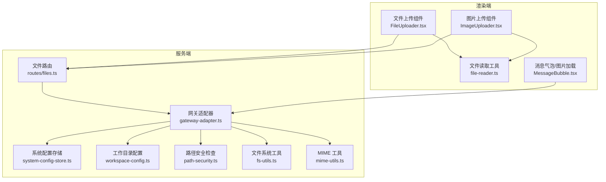
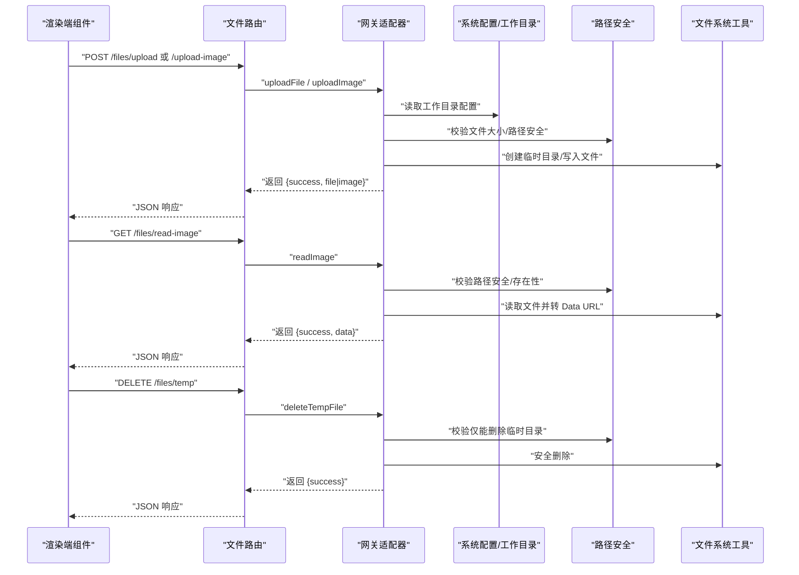
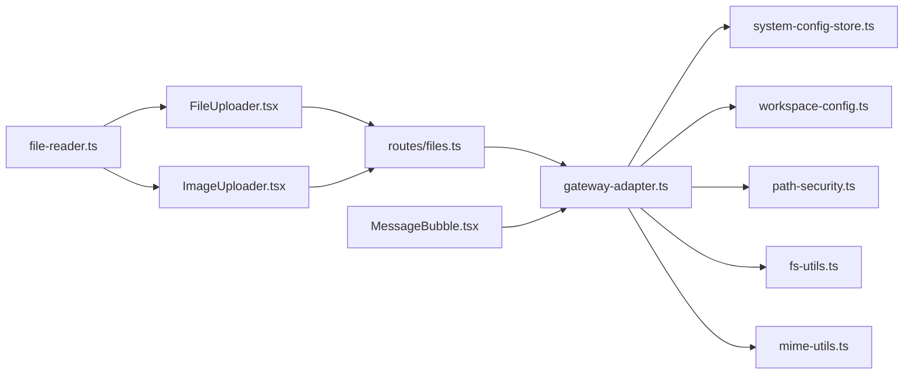
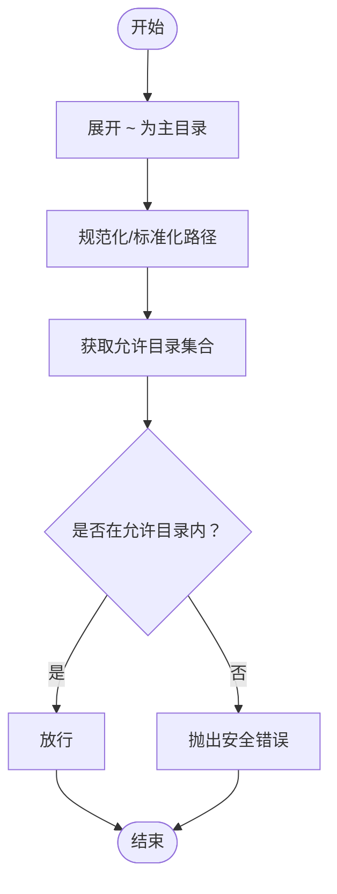

# 文件管理 API

<cite>
**本文引用的文件**
- [src/server/routes/files.ts](file://src/server/routes/files.ts)
- [src/server/gateway-adapter.ts](file://src/server/gateway-adapter.ts)
- [src/main/utils/path-security.ts](file://src/main/utils/path-security.ts)
- [src/shared/utils/fs-utils.ts](file://src/shared/utils/fs-utils.ts)
- [src/shared/utils/path-utils.ts](file://src/shared/utils/path-utils.ts)
- [src/shared/utils/mime-utils.ts](file://src/shared/utils/mime-utils.ts)
- [src/main/database/system-config-store.ts](file://src/main/database/system-config-store.ts)
- [src/main/database/workspace-config.ts](file://src/main/database/workspace-config.ts)
- [src/shared/utils/error-handler.ts](file://src/shared/utils/error-handler.ts)
- [src/main/gateway.ts](file://src/main/gateway.ts)
- [src/renderer/components/FileUploader.tsx](file://src/renderer/components/FileUploader.tsx)
- [src/renderer/components/ImageUploader.tsx](file://src/renderer/components/ImageUploader.tsx)
- [src/renderer/utils/file-reader.ts](file://src/renderer/utils/file-reader.ts)
- [src/renderer/components/MessageBubble.tsx](file://src/renderer/components/MessageBubble.tsx)
</cite>

## 目录
1. [简介](#简介)
2. [项目结构](#项目结构)
3. [核心组件](#核心组件)
4. [架构总览](#架构总览)
5. [详细组件分析](#详细组件分析)
6. [依赖关系分析](#依赖关系分析)
7. [性能考量](#性能考量)
8. [故障排查指南](#故障排查指南)
9. [结论](#结论)
10. [附录](#附录)

## 简介
本文件面向 史丽慧小助理 的文件管理 API，系统性阐述文件路由的架构设计与文件操作机制，覆盖文件上传、图片上传、图片读取、临时文件删除等能力；解释文件路径安全验证与访问权限控制策略；说明文件元数据管理与批量操作思路；提供文件预览与内容检索的 API 说明；并给出文件存储优化与缓存策略、大文件上传的分片与断点续传建议、安全最佳实践与性能优化指南。

## 项目结构
史丽慧小助理 的文件管理 API 采用“路由层 -> 网关适配器 -> 系统配置/路径安全/文件系统工具”的分层设计：
- 路由层：提供 HTTP 接口，接收客户端请求并调用网关适配器。
- 网关适配器：封装文件上传、图片读取、临时文件删除等操作，并进行尺寸校验、临时目录管理、路径安全检查与错误处理。
- 系统配置：提供工作目录、脚本目录、技能目录、图片目录、记忆目录、会话目录等配置项，作为路径白名单与存储根目录。
- 路径安全：统一的路径展开、规范化与白名单检查，防止越权访问。
- 文件系统工具：提供安全的目录创建、文件读写、复制、删除等通用能力。
- MIME 工具：根据扩展名推导 MIME 类型，支持 Data URL 转换。
- 渲染端组件：提供文件与图片上传组件、Data URL 读取工具、图片加载缓存等前端能力。

图表来源
- [src/server/routes/files.ts:10-106](file://src/server/routes/files.ts#L10-L106)
- [src/server/gateway-adapter.ts:548-720](file://src/server/gateway-adapter.ts#L548-L720)
- [src/main/database/system-config-store.ts:37-70](file://src/main/database/system-config-store.ts#L37-L70)
- [src/main/database/workspace-config.ts:17-46](file://src/main/database/workspace-config.ts#L17-L46)
- [src/main/utils/path-security.ts:29-83](file://src/main/utils/path-security.ts#L29-L83)
- [src/shared/utils/fs-utils.ts:19-79](file://src/shared/utils/fs-utils.ts#L19-L79)
- [src/shared/utils/mime-utils.ts:8-32](file://src/shared/utils/mime-utils.ts#L8-L32)
- [src/renderer/components/FileUploader.tsx:47-97](file://src/renderer/components/FileUploader.tsx#L47-L97)
- [src/renderer/components/ImageUploader.tsx:47-93](file://src/renderer/components/ImageUploader.tsx#L47-L93)
- [src/renderer/utils/file-reader.ts:16-22](file://src/renderer/utils/file-reader.ts#L16-L22)
- [src/renderer/components/MessageBubble.tsx:40-78](file://src/renderer/components/MessageBubble.tsx#L40-L78)

章节来源
- [src/server/routes/files.ts:10-106](file://src/server/routes/files.ts#L10-L106)
- [src/server/gateway-adapter.ts:548-720](file://src/server/gateway-adapter.ts#L548-L720)
- [src/main/database/system-config-store.ts:37-70](file://src/main/database/system-config-store.ts#L37-L70)
- [src/main/database/workspace-config.ts:17-46](file://src/main/database/workspace-config.ts#L17-L46)
- [src/main/utils/path-security.ts:29-83](file://src/main/utils/path-security.ts#L29-L83)
- [src/shared/utils/fs-utils.ts:19-79](file://src/shared/utils/fs-utils.ts#L19-L79)
- [src/shared/utils/mime-utils.ts:8-32](file://src/shared/utils/mime-utils.ts#L8-L32)
- [src/renderer/components/FileUploader.tsx:47-97](file://src/renderer/components/FileUploader.tsx#L47-L97)
- [src/renderer/components/ImageUploader.tsx:47-93](file://src/renderer/components/ImageUploader.tsx#L47-L93)
- [src/renderer/utils/file-reader.ts:16-22](file://src/renderer/utils/file-reader.ts#L16-L22)
- [src/renderer/components/MessageBubble.tsx:40-78](file://src/renderer/components/MessageBubble.tsx#L40-L78)

## 核心组件
- 文件路由（HTTP 接口）
  - 提供上传文件、上传图片、读取图片、删除临时文件四个接口，均通过网关适配器执行具体逻辑。
- 网关适配器（业务编排）
  - 封装上传文件/图片的尺寸校验、临时目录创建、唯一文件名生成、base64 解析与落盘、返回结构化结果。
  - 封装读取图片的路径安全检查、文件存在性校验、MIME 推导与 Data URL 转换。
  - 封装删除临时文件的路径白名单校验与安全删除。
- 路径安全与系统配置
  - 统一的路径展开、规范化与白名单检查，限定可访问目录集合。
  - 工作目录配置支持 Docker 与非 Docker 模式差异，提供默认路径与用户自定义路径。
- 文件系统与 MIME 工具
  - 安全的目录创建、文件读写、复制、删除等通用能力。
  - 根据扩展名推导 MIME 类型，支持图片 Data URL 转换。
- 渲染端上传与预览
  - 文件/图片上传组件负责读取本地文件为 Data URL 并调用后端接口。
  - 图片加载组件支持缓存与路径处理，避免重复请求。

章节来源
- [src/server/routes/files.ts:14-103](file://src/server/routes/files.ts#L14-L103)
- [src/server/gateway-adapter.ts:558-720](file://src/server/gateway-adapter.ts#L558-L720)
- [src/main/utils/path-security.ts:29-117](file://src/main/utils/path-security.ts#L29-L117)
- [src/main/database/workspace-config.ts:17-46](file://src/main/database/workspace-config.ts#L17-L46)
- [src/shared/utils/fs-utils.ts:19-161](file://src/shared/utils/fs-utils.ts#L19-L161)
- [src/shared/utils/mime-utils.ts:8-32](file://src/shared/utils/mime-utils.ts#L8-L32)
- [src/renderer/components/FileUploader.tsx:47-97](file://src/renderer/components/FileUploader.tsx#L47-L97)
- [src/renderer/components/ImageUploader.tsx:47-93](file://src/renderer/components/ImageUploader.tsx#L47-L93)
- [src/renderer/utils/file-reader.ts:16-22](file://src/renderer/utils/file-reader.ts#L16-L22)
- [src/renderer/components/MessageBubble.tsx:40-78](file://src/renderer/components/MessageBubble.tsx#L40-L78)

## 架构总览
文件管理 API 的调用链路如下：
- 客户端通过渲染端组件发起上传/读取/删除请求。
- 路由层解析请求参数并调用网关适配器对应方法。
- 网关适配器执行业务逻辑：参数校验、尺寸限制、路径安全检查、临时目录管理、文件读写与返回结果。
- 系统配置与路径安全模块提供白名单与默认路径保障。
- 渲染端组件负责 Data URL 读取与图片缓存，提升用户体验。

图表来源
- [src/server/routes/files.ts:14-103](file://src/server/routes/files.ts#L14-L103)
- [src/server/gateway-adapter.ts:630-720](file://src/server/gateway-adapter.ts#L630-L720)
- [src/main/database/system-config-store.ts:341-347](file://src/main/database/system-config-store.ts#L341-L347)
- [src/main/database/workspace-config.ts:51-88](file://src/main/database/workspace-config.ts#L51-L88)
- [src/main/utils/path-security.ts:59-83](file://src/main/utils/path-security.ts#L59-L83)
- [src/shared/utils/fs-utils.ts:19-79](file://src/shared/utils/fs-utils.ts#L19-L79)

## 详细组件分析

### 文件路由（HTTP 接口）
- 上传文件
  - 路径：POST /files/upload
  - 参数：fileName、dataUrl、fileSize、fileType
  - 行为：校验必填参数，调用网关适配器上传文件，返回统一结构。
- 上传图片
  - 路径：POST /files/upload-image
  - 参数：fileName、dataUrl、fileSize
  - 行为：校验必填参数，调用网关适配器上传图片，返回统一结构。
- 读取图片
  - 路径：GET /files/read-image
  - 查询参数：path
  - 行为：校验路径参数，调用网关适配器读取图片并返回 Data URL。
- 删除临时文件
  - 路径：DELETE /files/temp
  - 查询参数：path
  - 行为：校验路径参数，调用网关适配器删除临时目录中的文件。

章节来源
- [src/server/routes/files.ts:14-103](file://src/server/routes/files.ts#L14-L103)

### 网关适配器（文件操作编排）
- 上传文件/图片
  - 尺寸限制：文件最大 500MB，图片最大 5MB。
  - 临时目录：工作目录下 .slhbot/temp/uploads。
  - 唯一文件名：随机十六进制字符串 + 原扩展名。
  - base64 解析：正则提取 MIME 与 base64 数据，Buffer 写盘。
  - 返回结构：包含 id、path、name、size、type（文件）、dataUrl（图片）。
- 读取图片
  - 路径安全：isPathAllowed 校验仅允许工作目录及其子目录。
  - 存在性：文件不存在返回错误。
  - MIME 推导：根据扩展名推导 MIME，转换为 Data URL。
- 删除临时文件
  - 白名单：仅允许删除临时目录下的文件。
  - 安全删除：safeRemove 包装，异常捕获与错误返回。

章节来源
- [src/server/gateway-adapter.ts:558-625](file://src/server/gateway-adapter.ts#L558-L625)
- [src/server/gateway-adapter.ts:630-643](file://src/server/gateway-adapter.ts#L630-L643)
- [src/server/gateway-adapter.ts:645-682](file://src/server/gateway-adapter.ts#L645-L682)
- [src/server/gateway-adapter.ts:684-720](file://src/server/gateway-adapter.ts#L684-L720)

### 路径安全与访问控制
- 路径展开与规范化
  - 支持 ~ 展开为主目录，路径规范化与标准化。
- 允许目录集合
  - 工作目录 workspaceDir、脚本目录 scriptDir、技能目录 skillDirs、图片目录 imageDir、记忆目录 memoryDir、会话目录 sessionDir。
- Docker 模式
  - 跳过路径检查（容器内目录固定），或使用固定 /data/* 路径。
- 断言与错误
  - assertPathAllowed：不在白名单则抛出带允许目录列表的错误信息。

章节来源
- [src/main/utils/path-security.ts:17-22](file://src/main/utils/path-security.ts#L17-L22)
- [src/main/utils/path-security.ts:29-44](file://src/main/utils/path-security.ts#L29-L44)
- [src/main/utils/path-security.ts:59-83](file://src/main/utils/path-security.ts#L59-L83)
- [src/main/utils/path-security.ts:91-117](file://src/main/utils/path-security.ts#L91-L117)

### 系统配置与默认路径
- 默认路径（非 Docker）
  - 工作目录：用户主目录
  - 脚本目录：~/.slhbot/scripts
  - 技能目录：~/.agents/skills
  - 图片目录：~/.slhbot/generated-images
  - 记忆目录：~/.slhbot/memory
  - 会话目录：~/.slhbot/sessions
- Docker 模式
  - 固定 /data/* 路径，可通过环境变量覆盖。
- 配置持久化
  - 使用 SQLite 存储工作目录配置，提供读取、保存、新增/删除技能目录等操作。

章节来源
- [src/main/database/workspace-config.ts:17-46](file://src/main/database/workspace-config.ts#L17-L46)
- [src/main/database/workspace-config.ts:51-88](file://src/main/database/workspace-config.ts#L51-L88)
- [src/main/database/workspace-config.ts:94-158](file://src/main/database/workspace-config.ts#L94-L158)
- [src/main/database/system-config-store.ts:341-347](file://src/main/database/system-config-store.ts#L341-L347)

### 文件系统与 MIME 工具
- 文件系统工具
  - 目录创建、安全读取、安全写入、目录/文件判断、递归复制、安全删除。
- MIME 工具
  - 扩展名到 MIME 映射，图片 Buffer 转 Data URL。

章节来源
- [src/shared/utils/fs-utils.ts:19-161](file://src/shared/utils/fs-utils.ts#L19-L161)
- [src/shared/utils/mime-utils.ts:8-32](file://src/shared/utils/mime-utils.ts#L8-L32)

### 渲染端上传与预览
- 文件上传组件
  - 限制数量与大小，读取为 Data URL，调用后端上传接口，合并结果。
- 图片上传组件
  - 限制数量、类型与大小，读取为 Data URL，调用后端上传接口。
- 文件读取工具
  - FileReader.readAsDataURL 将 File 转为 Data URL。
- 图片加载与缓存
  - 路径处理（file://、URL 解码、相对路径补全 ~），立即检查缓存避免闪烁。

章节来源
- [src/renderer/components/FileUploader.tsx:47-97](file://src/renderer/components/FileUploader.tsx#L47-L97)
- [src/renderer/components/ImageUploader.tsx:47-93](file://src/renderer/components/ImageUploader.tsx#L47-L93)
- [src/renderer/utils/file-reader.ts:16-22](file://src/renderer/utils/file-reader.ts#L16-L22)
- [src/renderer/components/MessageBubble.tsx:40-78](file://src/renderer/components/MessageBubble.tsx#L40-L78)

## 依赖关系分析
- 路由依赖网关适配器，网关适配器依赖系统配置、路径安全、文件系统与 MIME 工具。
- 渲染端组件依赖文件读取工具与后端接口。
- 网关适配器在上传/读取/删除流程中按需动态导入模块，保证运行时灵活性。

图表来源
- [src/server/routes/files.ts:10-106](file://src/server/routes/files.ts#L10-L106)
- [src/server/gateway-adapter.ts:548-720](file://src/server/gateway-adapter.ts#L548-L720)
- [src/main/database/system-config-store.ts:37-70](file://src/main/database/system-config-store.ts#L37-L70)
- [src/main/database/workspace-config.ts:17-46](file://src/main/database/workspace-config.ts#L17-L46)
- [src/main/utils/path-security.ts:29-83](file://src/main/utils/path-security.ts#L29-L83)
- [src/shared/utils/fs-utils.ts:19-79](file://src/shared/utils/fs-utils.ts#L19-L79)
- [src/shared/utils/mime-utils.ts:8-32](file://src/shared/utils/mime-utils.ts#L8-L32)
- [src/renderer/components/FileUploader.tsx:47-97](file://src/renderer/components/FileUploader.tsx#L47-L97)
- [src/renderer/components/ImageUploader.tsx:47-93](file://src/renderer/components/ImageUploader.tsx#L47-L93)
- [src/renderer/utils/file-reader.ts:16-22](file://src/renderer/utils/file-reader.ts#L16-L22)
- [src/renderer/components/MessageBubble.tsx:40-78](file://src/renderer/components/MessageBubble.tsx#L40-L78)

## 性能考量
- 上传性能
  - 建议前端在上传前进行文件大小与类型校验，避免超限请求。
  - 服务端已内置大小限制与 base64 解析，建议控制并发与队列长度。
- 存储与临时文件
  - 临时目录位于工作目录下，注意磁盘空间与清理策略；提供删除接口仅限临时目录。
- MIME 与 Data URL
  - 图片读取转换为 Data URL，适合前端展示；对于大图片建议考虑 CDN 或分片预览。
- 缓存策略
  - 渲染端图片加载组件具备缓存，减少重复请求；建议结合 ETag/Last-Modified 实现服务端缓存。

[本节为通用性能建议，不直接分析具体文件，故无章节来源]

## 故障排查指南
- 常见错误与定位
  - 参数缺失：路由层返回“缺少必要参数”。
  - 路径不在白名单：路径安全模块抛出明确允许目录列表。
  - 文件大小超限：网关适配器返回“大小不能超过 X MB”。
  - 文件不存在：读取图片时返回“文件不存在”。
  - 非法删除：仅允许删除临时目录文件，否则报错。
- 统一错误处理
  - 使用 getErrorMessage 提取错误消息，确保响应一致性。
- 日志与可观测性
  - 关键流程打印日志，便于定位问题；错误捕获后返回统一结构。

章节来源
- [src/server/routes/files.ts:18-32](file://src/server/routes/files.ts#L18-L32)
- [src/server/gateway-adapter.ts:573-576](file://src/server/gateway-adapter.ts#L573-L576)
- [src/main/utils/path-security.ts:91-117](file://src/main/utils/path-security.ts#L91-L117)
- [src/shared/utils/error-handler.ts:8-13](file://src/shared/utils/error-handler.ts#L8-L13)

## 结论
史丽慧小助理 的文件管理 API 通过清晰的分层设计实现了安全、可控的文件操作能力。路由层提供简洁的 HTTP 接口，网关适配器承担业务编排与安全校验，系统配置与路径安全模块确保访问边界，文件系统与 MIME 工具提供稳健的底层能力。渲染端组件完善了上传与预览体验。整体架构兼顾安全性与易用性，适合在桌面与 Web 场景下稳定运行。

[本节为总结性内容，不直接分析具体文件，故无章节来源]

## 附录

### API 定义与行为说明
- 上传文件
  - 方法与路径：POST /files/upload
  - 请求体字段：fileName、dataUrl、fileSize、fileType
  - 成功返回：包含 id、path、name、size、type 的结构
  - 错误返回：统一 {success:false, error: "..."} 结构
- 上传图片
  - 方法与路径：POST /files/upload-image
  - 请求体字段：fileName、dataUrl、fileSize
  - 成功返回：包含 id、path、name、size、dataUrl 的结构
  - 错误返回：统一 {success:false, error: "..."} 结构
- 读取图片
  - 方法与路径：GET /files/read-image
  - 查询参数：path
  - 成功返回：包含 data（Data URL）的结构
  - 错误返回：统一 {success:false, error: "..."} 结构
- 删除临时文件
  - 方法与路径：DELETE /files/temp
  - 查询参数：path
  - 成功返回：{success:true}
  - 错误返回：统一 {success:false, error: "..."} 结构

章节来源
- [src/server/routes/files.ts:14-103](file://src/server/routes/files.ts#L14-L103)
- [src/server/gateway-adapter.ts:630-643](file://src/server/gateway-adapter.ts#L630-L643)
- [src/server/gateway-adapter.ts:645-682](file://src/server/gateway-adapter.ts#L645-L682)
- [src/server/gateway-adapter.ts:684-720](file://src/server/gateway-adapter.ts#L684-L720)

### 文件路径安全与访问控制流程

图表来源
- [src/main/utils/path-security.ts:63-83](file://src/main/utils/path-security.ts#L63-L83)
- [src/main/utils/path-security.ts:91-117](file://src/main/utils/path-security.ts#L91-L117)

### 大文件上传与分片/断点续传建议
- 当前实现
  - 服务端对文件大小进行限制（文件≤500MB，图片≤5MB），并以 Data URL 形式接收与保存。
- 建议方案
  - 分片上传：前端将文件切分为固定大小的块，携带分片序号与文件标识，服务端按序接收并校验完整性。
  - 断点续传：服务端记录已接收分片清单，客户端断线后仅需补齐缺失分片。
  - 完成合并：所有分片接收完成后，服务端合并为完整文件并清理临时分片。
  - 安全与校验：引入哈希校验（如 SHA-256）与白名单路径检查，确保仅写入允许目录。
  - 缓存与进度：结合前端缓存与进度回调，提升用户体验。

[本节为概念性建议，不直接映射到具体源码，故无图表来源与章节来源]

### 文件元数据管理与批量操作
- 元数据
  - 上传接口返回 id、path、name、size、type（文件）或 dataUrl（图片）。
- 批量操作
  - 建议在路由层增加批量上传/删除接口，统一参数校验与错误处理。
  - 批量操作中逐条处理并聚合结果，支持事务回滚与幂等性保障。

[本节为通用设计建议，不直接分析具体文件，故无章节来源]

### 文件预览与内容检索
- 预览
  - 图片读取接口返回 Data URL，前端可直接渲染。
  - 渲染端组件支持缓存与路径处理，减少重复请求。
- 内容检索
  - 文本文件读取建议通过专用工具或接口实现，避免在图片读取中混入二进制数据。
  - 对于大文件，建议提供分片读取与流式传输能力。

章节来源
- [src/server/gateway-adapter.ts:645-682](file://src/server/gateway-adapter.ts#L645-L682)
- [src/renderer/components/MessageBubble.tsx:40-78](file://src/renderer/components/MessageBubble.tsx#L40-L78)

### 安全最佳实践
- 路径安全
  - 始终使用路径安全检查，禁止越权访问系统目录。
  - Docker 模式下谨慎放宽限制，优先使用固定 /data/* 路径。
- 上传限制
  - 前端与服务端双重限制文件大小与类型。
  - 临时目录仅允许删除，避免误删生产文件。
- 错误处理
  - 使用统一错误提取与日志记录，便于审计与排障。
- 配置管理
  - 工作目录与技能目录支持多路径配置，建议定期备份与迁移。

章节来源
- [src/main/utils/path-security.ts:59-83](file://src/main/utils/path-security.ts#L59-L83)
- [src/server/gateway-adapter.ts:573-576](file://src/server/gateway-adapter.ts#L573-L576)
- [src/shared/utils/error-handler.ts:8-13](file://src/shared/utils/error-handler.ts#L8-L13)
- [src/main/database/workspace-config.ts:51-88](file://src/main/database/workspace-config.ts#L51-L88)

### 性能优化指南
- 上传优化
  - 前端预压缩与分片上传（参考“大文件上传与分片/断点续传建议”）。
  - 服务端并发控制与队列限流，避免磁盘抖动。
- 存储优化
  - 合理规划工作目录与临时目录磁盘空间，定期清理临时文件。
- 缓存优化
  - 前端图片缓存与懒加载，服务端结合 ETag/Last-Modified 实现条件请求。
- I/O 优化
  - 使用安全写入工具，避免频繁小文件写入；批量写入时合并操作。

[本节为通用性能建议，不直接分析具体文件，故无章节来源]