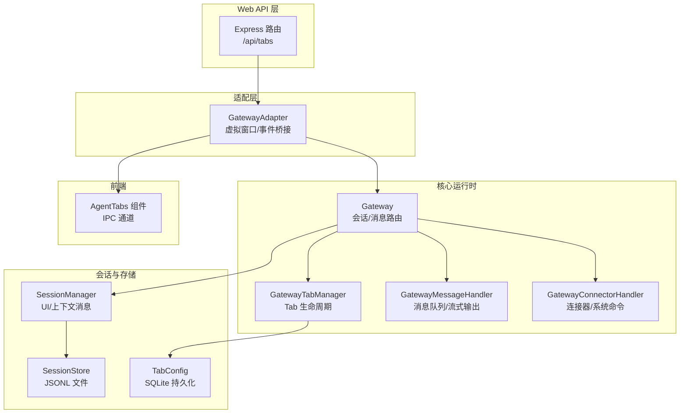
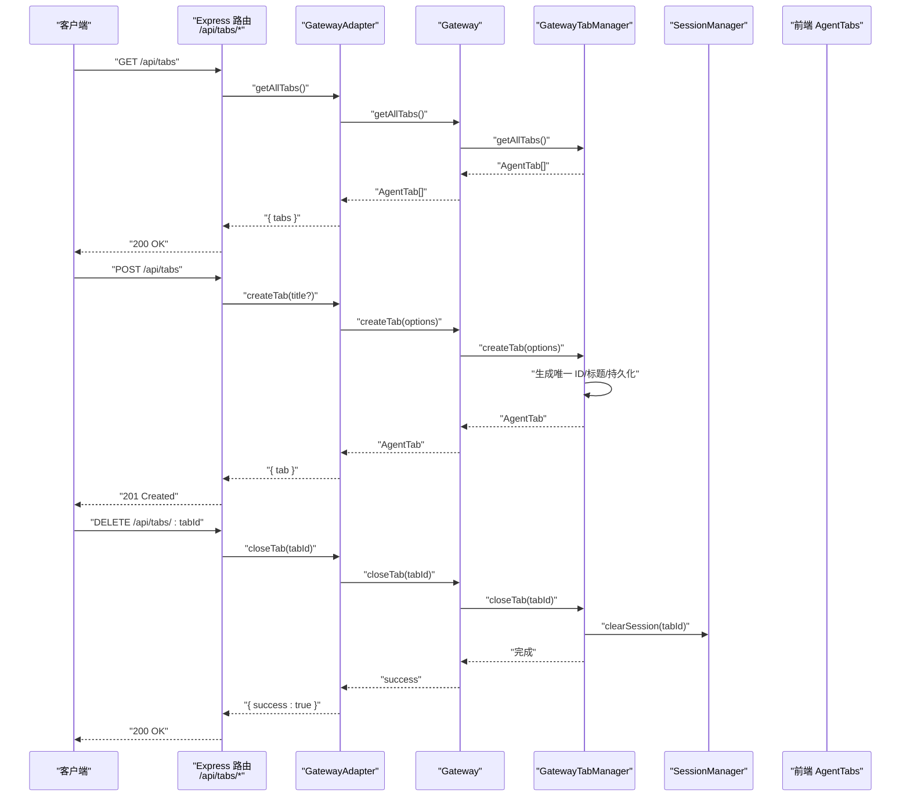
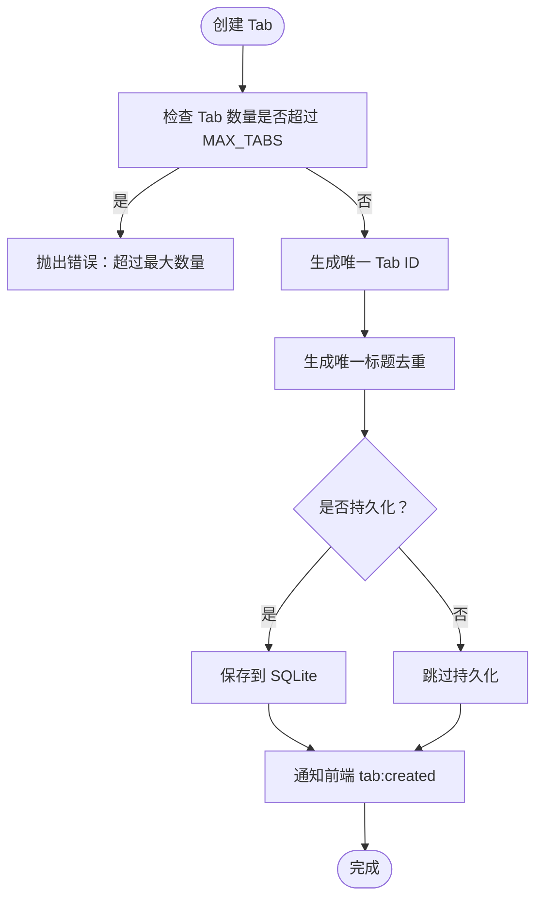
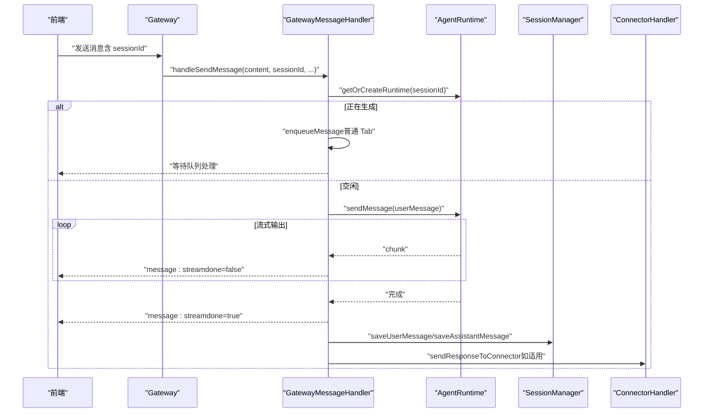

# 标签页管理 API

<cite>
**本文档引用的文件**
- [src/server/routes/tabs.ts](file://src/server/routes/tabs.ts)
- [src/server/gateway-adapter.ts](file://src/server/gateway-adapter.ts)
- [src/main/gateway.ts](file://src/main/gateway.ts)
- [src/main/gateway-tab.ts](file://src/main/gateway-tab.ts)
- [src/main/gateway-connector.ts](file://src/main/gateway-connector.ts)
- [src/main/gateway-message.ts](file://src/main/gateway-message.ts)
- [src/main/session/session-manager.ts](file://src/main/session/session-manager.ts)
- [src/main/session/session-store.ts](file://src/main/session/session-store.ts)
- [src/main/database/tab-config.ts](file://src/main/database/tab-config.ts)
- [src/types/agent-tab.ts](file://src/types/agent-tab.ts)
- [src/types/ipc.ts](file://src/types/ipc.ts)
- [src/shared/constants/version.ts](file://src/shared/constants/version.ts)
- [src/renderer/components/AgentTabs.tsx](file://src/renderer/components/AgentTabs.tsx)
</cite>

## 目录
1. [简介](#简介)
2. [项目结构](#项目结构)
3. [核心组件](#核心组件)
4. [架构总览](#架构总览)
5. [详细组件分析](#详细组件分析)
6. [依赖关系分析](#依赖关系分析)
7. [性能考量](#性能考量)
8. [故障排查指南](#故障排查指南)
9. [结论](#结论)
10. [附录](#附录)

## 简介
本文件面向 DeepBot 的标签页（Tab）管理 API，系统性阐述其路由架构、状态管理机制、消息传递与同步、历史记录与会话恢复、配置与个性化设置、并发控制与资源限制、生命周期管理与内存优化，并提供完整的使用示例与集成指南。读者无需深入底层实现，亦可理解并正确使用标签页相关能力。

## 项目结构
标签页管理涉及三层：Web API 层（Express 路由）、适配层（GatewayAdapter）与核心运行时（Gateway）。会话历史存储在 SessionManager/SessionStore 中，持久化配置由 tab-config 管理；前端通过 IPC 通道与主进程交互，实现标签页 UI 的创建、切换、关闭与消息展示。



**图表来源**
- [src/server/routes/tabs.ts:10-136](file://src/server/routes/tabs.ts#L10-L136)
- [src/server/gateway-adapter.ts:45-762](file://src/server/gateway-adapter.ts#L45-L762)
- [src/main/gateway.ts:33-772](file://src/main/gateway.ts#L33-L772)
- [src/main/gateway-tab.ts:26-795](file://src/main/gateway-tab.ts#L26-L795)
- [src/main/gateway-message.ts:31-524](file://src/main/gateway-message.ts#L31-L524)
- [src/main/gateway-connector.ts:44-813](file://src/main/gateway-connector.ts#L44-L813)
- [src/main/session/session-manager.ts:17-194](file://src/main/session/session-manager.ts#L17-L194)
- [src/main/session/session-store.ts:46-200](file://src/main/session/session-store.ts#L46-L200)
- [src/main/database/tab-config.ts:46-217](file://src/main/database/tab-config.ts#L46-L217)
- [src/renderer/components/AgentTabs.tsx:19-64](file://src/renderer/components/AgentTabs.tsx#L19-L64)

**章节来源**
- [src/server/routes/tabs.ts:10-136](file://src/server/routes/tabs.ts#L10-L136)
- [src/server/gateway-adapter.ts:45-762](file://src/server/gateway-adapter.ts#L45-L762)
- [src/main/gateway.ts:33-772](file://src/main/gateway.ts#L33-L772)

## 核心组件
- Express 路由层：提供 /api/tabs 的 REST 接口，负责参数校验、错误处理与响应封装。
- GatewayAdapter：在 Web 模式下将 IPC 事件转换为 WebSocket 事件，桥接前端与主进程。
- Gateway：协调 Tab、消息、连接器与会话管理，统一对外暴露 Tab 管理方法。
- GatewayTabManager：负责 Tab 的创建、关闭、查询、历史加载、持久化与标题更新。
- GatewayMessageHandler：负责消息发送、队列管理、流式输出、错误恢复与执行步骤回调。
- GatewayConnectorHandler：处理连接器消息、系统命令、进度提醒与响应回推。
- SessionManager/SessionStore：负责消息持久化（JSONL）、UI 历史加载、上下文截断。
- TabConfig：SQLite 表结构与 CRUD，管理 Tab 的持久化配置（标题、类型、记忆文件等）。
- 前端 AgentTabs：渲染标签页 UI，触发创建、切换、关闭等动作并通过 IPC 与主进程通信。

**章节来源**
- [src/types/agent-tab.ts:23-46](file://src/types/agent-tab.ts#L23-L46)
- [src/shared/constants/version.ts:19-21](file://src/shared/constants/version.ts#L19-L21)
- [src/renderer/components/AgentTabs.tsx:19-64](file://src/renderer/components/AgentTabs.tsx#L19-L64)

## 架构总览
标签页管理 API 的调用链路如下：



**图表来源**
- [src/server/routes/tabs.ts:17-73](file://src/server/routes/tabs.ts#L17-L73)
- [src/server/gateway-adapter.ts:200-226](file://src/server/gateway-adapter.ts#L200-L226)
- [src/main/gateway.ts:638-675](file://src/main/gateway.ts#L638-L675)
- [src/main/gateway-tab.ts:492-761](file://src/main/gateway-tab.ts#L492-L761)
- [src/main/session/session-manager.ts:135-144](file://src/main/session/session-manager.ts#L135-L144)

## 详细组件分析

### 1) 路由层：/api/tabs REST API
- GET /api/tabs：获取所有 Tab，返回 AgentTab 列表。
- POST /api/tabs：创建新 Tab，支持传入可选标题；未传入时由 Gateway 自动生成唯一标题。
- GET /api/tabs/:tabId：获取指定 Tab 信息，若不存在返回 404。
- DELETE /api/tabs/:tabId：关闭指定 Tab，禁止关闭默认 Tab。
- POST /api/tabs/:tabId/messages：向指定 Tab 发送消息，必填 content；支持可选 clearHistory 控制定时任务模式下的历史清空。
- GET /api/tabs/:tabId/messages：获取 Tab 的消息历史，支持 limit 与 before 查询参数。
- POST /api/tabs/stop-generation：停止生成（针对 sessionId）。

错误处理：统一捕获异常并返回 JSON 错误信息；400/404/500 状态码语义化。

**章节来源**
- [src/server/routes/tabs.ts:17-133](file://src/server/routes/tabs.ts#L17-L133)

### 2) 适配层：GatewayAdapter（Web 模式桥接）
- 将主进程的 IPC 事件转换为 WebSocket 事件，供前端订阅：
  - tab_created、tab_updated、tab_history_loaded、tab_messages_cleared、message_stream、execution_step_update、message_error、agent_status、name_config_update、model_config_update、connector_pending_count_updated 等。
- 提供与 Gateway 的对接方法：getAllTabs、createTab、getTab、closeTab、handleSendMessage、getMessages、stopGeneration 等。
- 通过虚拟窗口（VirtualBrowserWindow/VirtualWebContents）在 Web 模式下模拟 Electron 的 webContents，将 IPC 事件转为 EventEmitter 事件。

**章节来源**
- [src/server/gateway-adapter.ts:45-196](file://src/server/gateway-adapter.ts#L45-L196)
- [src/server/gateway-adapter.ts:200-266](file://src/server/gateway-adapter.ts#L200-L266)
- [src/server/gateway-adapter.ts:544-546](file://src/server/gateway-adapter.ts#L544-L546)

### 3) 核心运行时：Gateway 与 Tab 生命周期
- Gateway 暴露统一的 Tab 管理方法：createTab、closeTab、getAllTabs、getTab、updateTabActivity、getOrCreateTaskTab 等。
- 依赖注入：setDependencies 将主窗口、SessionManager、handleSendMessage、destroySessionRuntime、getIsWebMode 等回调注入到各处理器。
- 默认 Tab：启动时创建 id='default' 的默认 Tab，并异步加载历史消息；Web 模式下加载策略不同（见下节）。

**章节来源**
- [src/main/gateway.ts:638-684](file://src/main/gateway.ts#L638-L684)
- [src/main/gateway.ts:361-398](file://src/main/gateway.ts#L361-L398)

### 4) Tab 生命周期与状态管理：GatewayTabManager
- 创建：支持 normal/connector/scheduled_task 三种类型；生成唯一 Tab ID；为持久化 Tab 生成 memory 文件；写入 SQLite；通知前端 tab:created。
- 关闭：禁止关闭默认 Tab；销毁对应 AgentRuntime；删除 memory 文件；清空 session；从 SQLite 删除持久化配置；从 Map 中移除。
- 查询：getTab、getAllTabs；findTabByConversationKey 基于 conversationKey 查找。
- 历史加载：loadTabHistory；loadDefaultTabHistory；pushAllTabHistories（Web 模式刷新后恢复）；checkAndSendWelcomeMessage（模型配置后判断是否发送欢迎消息）。
- 标题更新：updateTabTitle；持久化 Tab 同步更新 SQLite。
- 任务 Tab：getOrCreateTaskTab 为定时任务创建锁定的 Tab（isLocked=true）。
- 并发限制：MAX_TABS（默认 25）限制最大 Tab 数量。



**图表来源**
- [src/main/gateway-tab.ts:504-611](file://src/main/gateway-tab.ts#L504-L611)
- [src/shared/constants/version.ts:19-21](file://src/shared/constants/version.ts#L19-L21)

**章节来源**
- [src/main/gateway-tab.ts:492-761](file://src/main/gateway-tab.ts#L492-L761)
- [src/main/database/tab-config.ts:69-93](file://src/main/database/tab-config.ts#L69-L93)

### 5) 消息传递与状态同步：GatewayMessageHandler
- 消息发送：handleSendMessage 支持系统命令预处理（/new、/memory、/history、/reload-env）；普通消息进入 AgentRuntime 流式输出。
- 队列管理：当 Agent 正在生成时，普通 Tab 将消息加入队列；定时任务 Tab 等待上一次执行完成。
- 流式输出：实时发送 message:stream（done=false 片段，done=true 结束），并发送 execution_step_update。
- 错误恢复：检测 AI 连接错误，自动清理缓存并重置当前 Tab 的 Runtime，再重试。
- 会话持久化：保存用户消息与 AI 响应（含执行步骤、总耗时、sentAt）至 SessionStore（JSONL）。
- 连接器回推：连接器 Tab 在 AI 响应完成后回推到连接器。



**图表来源**
- [src/main/gateway-message.ts:76-160](file://src/main/gateway-message.ts#L76-L160)
- [src/main/gateway-message.ts:376-473](file://src/main/gateway-message.ts#L376-L473)
- [src/main/gateway-connector.ts:427-483](file://src/main/gateway-connector.ts#L427-L483)

**章节来源**
- [src/main/gateway-message.ts:76-160](file://src/main/gateway-message.ts#L76-L160)
- [src/main/gateway-message.ts:246-283](file://src/main/gateway-message.ts#L246-L283)
- [src/main/gateway-message.ts:478-500](file://src/main/gateway-message.ts#L478-L500)

### 6) 历史记录与会话恢复：SessionManager/SessionStore
- SessionStore：以 JSONL 持久化每条消息（role/content/timestamp/executionSteps/totalDuration/sentAt），提供 appendMessage、loadAllMessages、loadRecentMessages。
- SessionManager：封装 UI 显示（最近 100 轮）与上下文（最近 10 轮）加载；clearSession 清空；getMessageCount；convertToUIMessages 过滤系统提示。
- 历史加载策略：
  - 默认 Tab：首次加载后，若应发送欢迎消息则发送；否则推送历史到前端。
  - Web 模式：刷新后通过 pushAllTabHistories 推送所有 Tab 历史。
  - 连接器 Tab：按 conversationKey 查找或创建，支持飞书群名称动态更新。

**章节来源**
- [src/main/session/session-store.ts:46-200](file://src/main/session/session-store.ts#L46-L200)
- [src/main/session/session-manager.ts:103-151](file://src/main/session/session-manager.ts#L103-L151)
- [src/main/gateway-tab.ts:137-235](file://src/main/gateway-tab.ts#L137-L235)

### 7) 配置管理与个性化设置
- Tab 独立配置字段（AgentTab）：
  - memoryFile：Tab 独立记忆文件路径（null 表示使用默认）。
  - agentName：Tab 独立 Agent 名称（null 表示继承主 Agent）。
  - isPersistent：是否持久化（手动创建的 Tab 为 true）。
  - pendingMessages/processingMessageId：连接器 Tab 的消息队列与当前处理消息 ID。
- SQLite 持久化（TabConfig）：
  - 表 agent_tabs：id/title/type/memory_file/agent_name/is_persistent/created_at/last_active_at/task_id/connector_id/conversation_id。
  - CRUD：initTabConfigTable/saveTabConfig/getTabConfig/getAllPersistentTabs/updateTabLastActive/updateTabTitle/updateTabAgentName/deleteTabConfig/deleteNonPersistentTabs。
- 名称配置（GatewayAdapter.getConfig/getNameConfig）：返回模型、工作目录、名称、连接器、图片生成、网页搜索等配置，前端据此渲染 UI。

**章节来源**
- [src/types/agent-tab.ts:38-46](file://src/types/agent-tab.ts#L38-L46)
- [src/main/database/tab-config.ts:46-217](file://src/main/database/tab-config.ts#L46-L217)
- [src/server/gateway-adapter.ts:271-285](file://src/server/gateway-adapter.ts#L271-L285)

### 8) 并发控制与资源限制
- 并发模型：
  - 普通 Tab：Agent 正在生成时，后续消息进入队列；队列逐条处理，实时发送执行步骤更新。
  - 定时任务 Tab：等待上一次执行完成后再处理新消息，避免竞争。
- 资源限制：
  - MAX_TABS：限制最大 Tab 数量（默认 25）。
  - 消息轮次：UI 最多 100 轮，上下文最多 10 轮，减少内存占用。
  - 文件大小：上传文件最大 500MB，图片最大 5MB。
- 自动恢复：AI 连接错误时自动清理缓存并重置当前 Tab 的 Runtime，再重试。

**章节来源**
- [src/shared/constants/version.ts:19-21](file://src/shared/constants/version.ts#L19-L21)
- [src/main/gateway-message.ts:121-132](file://src/main/gateway-message.ts#L121-L132)
- [src/main/gateway-message.ts:246-283](file://src/main/gateway-message.ts#L246-L283)
- [src/main/gateway-connector.ts:369-425](file://src/main/gateway-connector.ts#L369-L425)

### 9) 生命周期管理与内存优化
- 生命周期：
  - 创建：生成唯一 ID/标题，必要时持久化，通知前端。
  - 活跃：updateTabActivity 更新 lastActiveAt；Web 模式下定期推送历史。
  - 关闭：销毁 Runtime、删除 memory 文件、清空 session、删除 SQLite 配置。
- 内存优化：
  - SessionStore 倒序读取 JSONL，仅加载需要的最近轮次。
  - UI 与上下文分别限制轮次（100 vs 10）。
  - 定时任务 Tab 跳过历史保存，避免冗余 IO。

**章节来源**
- [src/main/gateway-tab.ts:777-782](file://src/main/gateway-tab.ts#L777-L782)
- [src/main/session/session-store.ts:179-200](file://src/main/session/session-store.ts#L179-L200)
- [src/main/session/session-manager.ts:21-22](file://src/main/session/session-manager.ts#L21-L22)

### 10) 前端集成与使用示例
- 前端组件：AgentTabs 渲染标签页，支持点击切换、关闭（非默认 Tab），以及创建新 Tab。
- IPC 通道：前端通过 IPC_CHANNELS 与主进程交互，如 tab:created、tab:updated、tab:history-loaded、message:stream 等。
- 使用流程示例（伪代码思路）：
  - 创建 Tab：POST /api/tabs，获得 tab；前端监听 tab:created，更新 UI。
  - 切换 Tab：点击 AgentTabs 中的 Tab，前端更新活动状态。
  - 发送消息：POST /api/tabs/:tabId/messages，前端监听 message:stream，实时展示。
  - 关闭 Tab：DELETE /api/tabs/:tabId，前端监听 tab:updated/tab:history-loaded，更新 UI。

**章节来源**
- [src/renderer/components/AgentTabs.tsx:19-64](file://src/renderer/components/AgentTabs.tsx#L19-L64)
- [src/types/ipc.ts:86-110](file://src/types/ipc.ts#L86-L110)

## 依赖关系分析

```mermaid
classDiagram
class Express_Router {
"+GET /api/tabs"
"+POST /api/tabs"
"+GET /api/tabs/ : tabId"
"+DELETE /api/tabs/ : tabId"
"+POST /api/tabs/ : tabId/messages"
"+GET /api/tabs/ : tabId/messages"
"+POST /api/tabs/stop-generation"
}
class GatewayAdapter {
"+getAllTabs()"
"+createTab()"
"+getTab()"
"+closeTab()"
"+handleSendMessage()"
"+getMessages()"
"+stopGeneration()"
}
class Gateway {
"+createTab()"
"+closeTab()"
"+getAllTabs()"
"+handleSendMessage()"
"+handleStopGeneration()"
}
class GatewayTabManager {
"+createTab()"
"+closeTab()"
"+getAllTabs()"
"+loadTabHistory()"
"+updateTabTitle()"
}
class GatewayMessageHandler {
"+handleSendMessage()"
"+processMessageQueue()"
"+sendStreamChunk()"
}
class SessionManager {
"+loadUIMessages()"
"+saveUserMessage()"
"+saveAssistantMessage()"
"+clearSession()"
}
class SessionStore {
"+appendMessage()"
"+loadRecentMessages()"
}
class TabConfig {
"+saveTabConfig()"
"+getAllPersistentTabs()"
"+updateTabTitle()"
"+deleteTabConfig()"
}
Express_Router --> GatewayAdapter : "调用"
GatewayAdapter --> Gateway : "委托"
Gateway --> GatewayTabManager : "依赖"
Gateway --> GatewayMessageHandler : "依赖"
Gateway --> SessionManager : "依赖"
SessionManager --> SessionStore : "使用"
GatewayTabManager --> TabConfig : "持久化"
```

**图表来源**
- [src/server/routes/tabs.ts:10-136](file://src/server/routes/tabs.ts#L10-L136)
- [src/server/gateway-adapter.ts:200-266](file://src/server/gateway-adapter.ts#L200-L266)
- [src/main/gateway.ts:638-684](file://src/main/gateway.ts#L638-L684)
- [src/main/gateway-tab.ts:492-761](file://src/main/gateway-tab.ts#L492-L761)
- [src/main/gateway-message.ts:76-160](file://src/main/gateway-message.ts#L76-L160)
- [src/main/session/session-manager.ts:103-151](file://src/main/session/session-manager.ts#L103-L151)
- [src/main/session/session-store.ts:75-100](file://src/main/session/session-store.ts#L75-L100)
- [src/main/database/tab-config.ts:69-185](file://src/main/database/tab-config.ts#L69-L185)

**章节来源**
- [src/main/gateway.ts:361-398](file://src/main/gateway.ts#L361-L398)
- [src/main/gateway-tab.ts:492-761](file://src/main/gateway-tab.ts#L492-L761)

## 性能考量
- I/O 优化：SessionStore 倒序读取 JSONL，仅加载最近轮次，避免全量解析。
- 内存控制：UI 与上下文轮次上限，定时任务 Tab 跳过历史保存。
- 并发控制：普通 Tab 队列串行处理，定时任务 Tab 等待完成，避免竞争。
- 错误恢复：AI 连接错误自动清理缓存并重置当前 Tab 的 Runtime，降低全局影响。

[本节为通用指导，无需特定文件引用]

## 故障排查指南
- 400 错误：发送消息时 content 为空。
- 404 错误：查询不存在的 Tab。
- 500 错误：服务器内部异常，检查路由层与适配层的错误捕获与日志。
- 消息未显示：确认前端已监听 message:stream 与 tab:history-loaded；检查 GatewayAdapter 的事件桥接是否生效。
- Tab 无法关闭：默认 Tab 不可关闭；检查 Tab 是否存在且非任务 Tab（任务 Tab 关闭会暂停关联任务）。
- 历史丢失：确认 SessionStore 文件存在且可读；检查 clearSession 是否被意外调用；Web 模式下刷新后应通过 pushAllTabHistories 恢复。

**章节来源**
- [src/server/routes/tabs.ts:84-93](file://src/server/routes/tabs.ts#L84-L93)
- [src/server/routes/tabs.ts:50-53](file://src/server/routes/tabs.ts#L50-L53)
- [src/main/gateway-tab.ts:687-761](file://src/main/gateway-tab.ts#L687-L761)
- [src/main/gateway-connector.ts:427-483](file://src/main/gateway-connector.ts#L427-L483)

## 结论
DeepBot 的标签页管理 API 通过清晰的分层设计实现了稳定的标签页生命周期管理、消息传递与状态同步、历史记录与会话恢复、配置与个性化设置、并发控制与资源限制、生命周期管理与内存优化。结合前端 IPC 通道与 Web 模式的事件桥接，开发者可以便捷地集成标签页功能并获得良好的用户体验。

[本节为总结性内容，无需特定文件引用]

## 附录

### A. API 定义与参数说明
- GET /api/tabs
  - 响应：{ tabs: AgentTab[] }
- POST /api/tabs
  - 请求体：{ title?: string }
  - 响应：{ tab: AgentTab }
- GET /api/tabs/:tabId
  - 响应：{ tab: AgentTab } 或 { error: string }（404）
- DELETE /api/tabs/:tabId
  - 响应：{ success: true, message: string }
- POST /api/tabs/:tabId/messages
  - 请求体：{ content: string, clearHistory?: boolean }
  - 响应：{ success: true }
- GET /api/tabs/:tabId/messages
  - 查询参数：limit（默认 50）、before（消息 ID）
  - 响应：{ messages: Message[], hasMore: boolean }
- POST /api/tabs/stop-generation
  - 请求体：{ sessionId?: string }
  - 响应：{ success: true }

**章节来源**
- [src/server/routes/tabs.ts:17-133](file://src/server/routes/tabs.ts#L17-L133)

### B. 关键类型与字段说明
- AgentTab：包含 id/title/type/messages/isLoading/createdAt/lastActiveAt 等；新增 memoryFile/agentName/isPersistent/pendingMessages/processingMessageId 等。
- Message：包含 role/content/timestamp/executionSteps/totalDuration/sentAt。
- IPC 通道：tab:*、message:*、connector:*、name-config:*、model-config:* 等。

**章节来源**
- [src/types/agent-tab.ts:23-46](file://src/types/agent-tab.ts#L23-L46)
- [src/types/ipc.ts:8-110](file://src/types/ipc.ts#L8-L110)