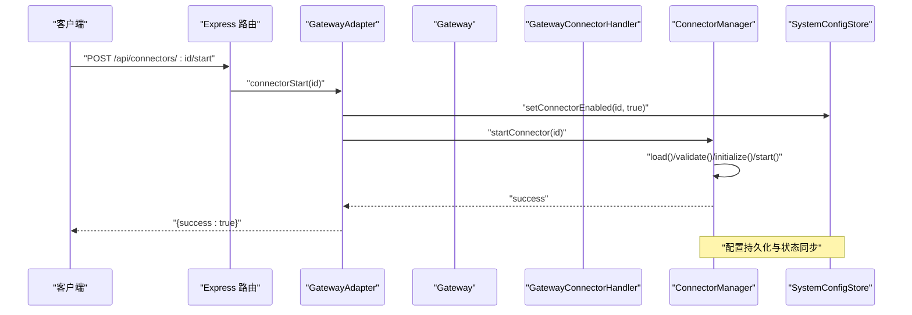
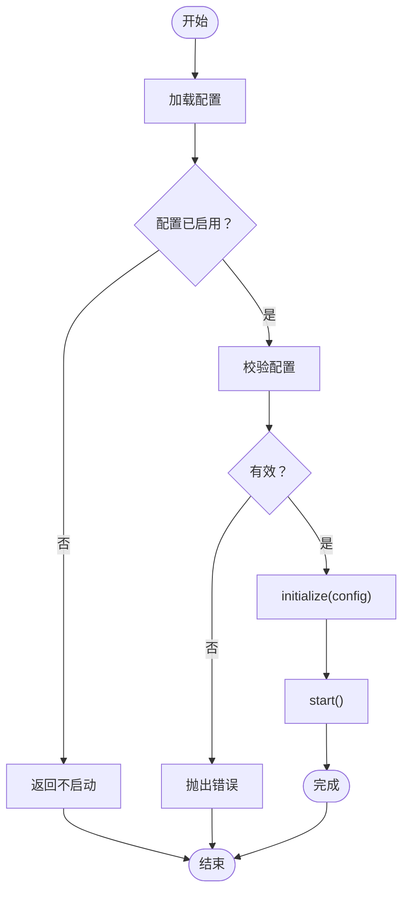
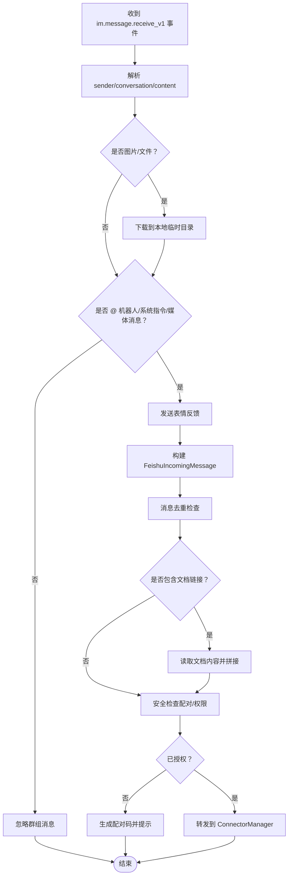
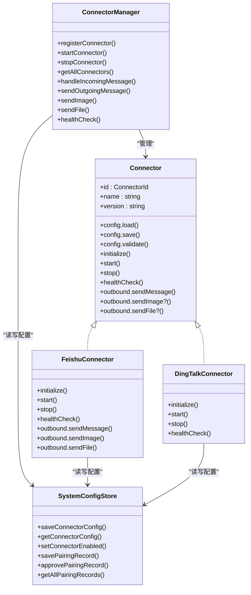

# 连接器管理 API

<cite>
**本文引用的文件**
- [src/main/connectors/connector-manager.ts](file://src/main/connectors/connector-manager.ts)
- [src/main/connectors/index.ts](file://src/main/connectors/index.ts)
- [src/main/connectors/feishu/feishu-connector.ts](file://src/main/connectors/feishu/feishu-connector.ts)
- [src/main/connectors/feishu/document-handler.ts](file://src/main/connectors/feishu/document-handler.ts)
- [src/main/connectors/dingtalk/dingtalk-connector.ts](file://src/main/connectors/dingtalk/dingtalk-connector.ts)
- [src/types/connector.ts](file://src/types/connector.ts)
- [src/main/database/connector-config.ts](file://src/main/database/connector-config.ts)
- [src/main/database/system-config-store.ts](file://src/main/database/system-config-store.ts)
- [src/server/routes/connectors.ts](file://src/server/routes/connectors.ts)
- [src/server/gateway-adapter.ts](file://src/server/gateway-adapter.ts)
- [src/main/ipc/connector-handler.ts](file://src/main/ipc/connector-handler.ts)
- [src/main/gateway.ts](file://src/main/gateway.ts)
- [src/main/gateway-connector.ts](file://src/main/gateway-connector.ts)
- [src/main/tools/connector-tool.ts](file://src/main/tools/connector-tool.ts)
</cite>

## 目录
1. [简介](#简介)
2. [项目结构](#项目结构)
3. [核心组件](#核心组件)
4. [架构总览](#架构总览)
5. [详细组件分析](#详细组件分析)
6. [依赖关系分析](#依赖关系分析)
7. [性能考虑](#性能考虑)
8. [故障排查指南](#故障排查指南)
9. [结论](#结论)
10. [附录](#附录)

## 简介
本文件面向 DeepBot 的连接器管理 API，系统性阐述连接器路由的架构设计与实现原理，覆盖连接器的注册、配置与管理、状态查询、连接建立与断开、配置验证与持久化、测试与健康检查、错误处理与重连策略，以及集成示例与最佳实践。读者可据此理解从 Web API 到连接器实例的完整调用链路，并掌握如何扩展新的连接器。

## 项目结构
DeepBot 的连接器体系采用“类型抽象 + 管理器 + 具体实现 + 存储”的分层设计：
- 类型层：定义连接器接口、消息格式与配置类型，确保不同连接器的一致性。
- 管理层：ConnectorManager 负责连接器生命周期、消息路由与外部消息转发。
- 实现层：各平台连接器（飞书、钉钉、企业微信、Slack、QQ）实现具体协议与消息处理。
- 存储层：SystemConfigStore + connector-config 模块负责连接器配置与配对记录的持久化。
- 服务层：Express 路由与 GatewayAdapter 提供 Web API；IPC 层提供 Electron 模式下的原生通道。
- 网关层：Gateway 负责会话管理、消息路由与与连接器的交互。

```mermaid
graph TB
subgraph "服务层"
R["Express 路由<br/>/api/connectors/*"]
GA["GatewayAdapter"]
end
subgraph "网关层"
GW["Gateway"]
GCH["GatewayConnectorHandler"]
end
subgraph "管理层"
CM["ConnectorManager"]
end
subgraph "实现层"
FC["飞书连接器"]
DC["钉钉连接器"]
WC["企业微信连接器"]
SC["Slack 连接器"]
QC["QQ 连接器"]
end
subgraph "存储层"
SCS["SystemConfigStore"]
SCC["connector-config 模块"]
end
R --> GA --> GW --> GCH --> CM
CM --> FC
CM --> DC
CM --> WC
CM --> SC
CM --> QC
SCS < --> SCC
CM --> SCS
```

图表来源
- [src/server/routes/connectors.ts:9-214](file://src/server/routes/connectors.ts#L9-L214)
- [src/server/gateway-adapter.ts:367-527](file://src/server/gateway-adapter.ts#L367-L527)
- [src/main/gateway.ts:686-742](file://src/main/gateway.ts#L686-L742)
- [src/main/gateway-connector.ts:97-190](file://src/main/gateway-connector.ts#L97-L190)
- [src/main/connectors/connector-manager.ts:21-379](file://src/main/connectors/connector-manager.ts#L21-L379)
- [src/main/database/system-config-store.ts:444-539](file://src/main/database/system-config-store.ts#L444-L539)
- [src/main/database/connector-config.ts:13-109](file://src/main/database/connector-config.ts#L13-L109)

章节来源
- [src/main/connectors/index.ts:1-11](file://src/main/connectors/index.ts#L1-L11)
- [src/types/connector.ts:76-146](file://src/types/connector.ts#L76-L146)

## 核心组件
- 连接器接口与类型：统一定义配置、生命周期、消息发送与安全控制等能力，保证多平台一致性。
- ConnectorManager：集中管理连接器实例，负责启动/停止、配置加载/校验、消息转发与健康检查。
- 各平台连接器：以飞书为例，实现 WebSocket 长连接、消息去重、媒体下载、文档读取、配对与欢迎消息等。
- SystemConfigStore 与 connector-config：提供连接器配置与配对记录的增删改查与持久化。
- Express 路由与 GatewayAdapter：对外暴露 RESTful API，桥接 Web 请求与 Gateway/ConnectorManager。
- GatewayConnectorHandler：将连接器消息映射到会话 Tab，解析系统指令并驱动 Agent 执行。

章节来源
- [src/types/connector.ts:15-146](file://src/types/connector.ts#L15-L146)
- [src/main/connectors/connector-manager.ts:21-379](file://src/main/connectors/connector-manager.ts#L21-L379)
- [src/main/connectors/feishu/feishu-connector.ts:28-175](file://src/main/connectors/feishu/feishu-connector.ts#L28-L175)
- [src/main/database/system-config-store.ts:444-539](file://src/main/database/system-config-store.ts#L444-L539)
- [src/server/routes/connectors.ts:9-214](file://src/server/routes/connectors.ts#L9-L214)
- [src/server/gateway-adapter.ts:367-527](file://src/server/gateway-adapter.ts#L367-L527)
- [src/main/gateway-connector.ts:97-190](file://src/main/gateway-connector.ts#L97-L190)

## 架构总览
连接器管理 API 的请求流转如下：
- Web 请求进入 Express 路由，由 GatewayAdapter 转发至 Gateway/ConnectorManager。
- ConnectorManager 负责实际的连接器操作（启动/停止/健康检查/消息发送）。
- SystemConfigStore 负责配置与配对记录的持久化。
- GatewayConnectorHandler 将连接器消息映射到会话 Tab，解析系统指令并驱动 Agent 执行。



图表来源
- [src/server/routes/connectors.ts:67-84](file://src/server/routes/connectors.ts#L67-L84)
- [src/server/gateway-adapter.ts:430-440](file://src/server/gateway-adapter.ts#L430-L440)
- [src/main/connectors/connector-manager.ts:45-81](file://src/main/connectors/connector-manager.ts#L45-L81)
- [src/main/database/system-config-store.ts:518-525](file://src/main/database/system-config-store.ts#L518-L525)

## 详细组件分析

### 连接器管理器（ConnectorManager）
职责与能力：
- 注册/获取连接器实例，维护 Map 映射。
- 启动/停止连接器：加载配置、校验、初始化、启动/停止。
- 外部消息处理：将外部平台消息转换为 GatewayMessage 并转发给 Gateway。
- 消息发送：支持文本、图片、文件发送，区分 reply 场景。
- 健康检查：委托连接器实现健康检查。
- 配对通知与待授权计数广播：通知连接器配对批准并推送前端。

关键流程（启动连接器）：


图表来源
- [src/main/connectors/connector-manager.ts:45-81](file://src/main/connectors/connector-manager.ts#L45-L81)

章节来源
- [src/main/connectors/connector-manager.ts:21-379](file://src/main/connectors/connector-manager.ts#L21-L379)

### 飞书连接器（FeishuConnector）
特性与实现要点：
- 使用官方 Node.js SDK 建立 WebSocket 长连接，监听 im.message.receive_v1 事件。
- 消息去重：基于 message_id 与基于内容的时间窗口去重，防止重复处理。
- 媒体处理：下载图片/文件到本地临时目录，再通过飞书 API 发送。
- 文档读取：解析消息中的飞书文档链接，读取 docx/wiki/sheets 内容并拼接到消息中。
- 配对与欢迎：私聊未配对时生成配对码，批准后通知连接器发送欢迎消息。
- 健康检查：检查内部 isStarted 与 WS 客户端状态。

关键流程（接收消息处理）：


图表来源
- [src/main/connectors/feishu/feishu-connector.ts:368-577](file://src/main/connectors/feishu/feishu-connector.ts#L368-L577)
- [src/main/connectors/feishu/document-handler.ts:40-93](file://src/main/connectors/feishu/document-handler.ts#L40-L93)

章节来源
- [src/main/connectors/feishu/feishu-connector.ts:28-175](file://src/main/connectors/feishu/feishu-connector.ts#L28-L175)
- [src/main/connectors/feishu/document-handler.ts:23-369](file://src/main/connectors/feishu/document-handler.ts#L23-L369)

### 钉钉连接器（DingTalkConnector）
特性与实现要点：
- 使用 Stream 模式建立 WebSocket 长连接，接收消息事件。
- 消息去重与内容去重策略与飞书类似。
- 支持图片/文件消息的处理与转发。
- 健康检查：检查 isStarted 与连接状态。

章节来源
- [src/main/connectors/dingtalk/dingtalk-connector.ts:27-141](file://src/main/connectors/dingtalk/dingtalk-connector.ts#L27-L141)

### 配置与持久化（SystemConfigStore + connector-config）
- SystemConfigStore：SQLite 单例，封装各类配置的读写与迁移。
- connector-config：专门处理连接器配置与配对记录的 CRUD。
- 飞书配置示例：appId/appSecret/requirePairing 等字段，启用开关与 JSON 存储。

章节来源
- [src/main/database/system-config-store.ts:444-539](file://src/main/database/system-config-store.ts#L444-L539)
- [src/main/database/connector-config.ts:13-109](file://src/main/database/connector-config.ts#L13-L109)

### Web API 路由与适配（Express + GatewayAdapter）
- 路由定义：/api/connectors 支持获取列表、获取/保存配置、启动/停止、健康检查、配对管理等。
- GatewayAdapter：将 Web 请求转换为 Gateway/ConnectorManager 的内部调用，返回统一结构。
- IPC 适配：Electron 模式下通过 IPC 通道与 Gateway 通信，行为与 Web 模式保持一致。

章节来源
- [src/server/routes/connectors.ts:9-214](file://src/server/routes/connectors.ts#L9-L214)
- [src/server/gateway-adapter.ts:367-527](file://src/server/gateway-adapter.ts#L367-L527)
- [src/main/ipc/connector-handler.ts:65-404](file://src/main/ipc/connector-handler.ts#L65-L404)

### 网关与消息路由（Gateway + GatewayConnectorHandler）
- Gateway：注册多种连接器，自动启动已启用的连接器，管理会话与消息路由。
- GatewayConnectorHandler：根据消息来源创建/定位 Tab，解析系统指令（/new、/stop、/memory 等），并将 AI 响应回写到连接器。

章节来源
- [src/main/gateway.ts:686-742](file://src/main/gateway.ts#L686-L742)
- [src/main/gateway-connector.ts:97-190](file://src/main/gateway-connector.ts#L97-L190)

### 连接器工具（ConnectorTool）
- 提供向已配对用户发送消息/图片/文件的能力，支持 chatId、userId、tabName 等多种目标解析方式。
- 统一通过 ConnectorManager 或连接器 outbound 发送，自动选择 chat_id/open_id 模式。

章节来源
- [src/main/tools/connector-tool.ts:54-200](file://src/main/tools/connector-tool.ts#L54-L200)

## 依赖关系分析



图表来源
- [src/types/connector.ts:76-146](file://src/types/connector.ts#L76-L146)
- [src/main/connectors/connector-manager.ts:21-379](file://src/main/connectors/connector-manager.ts#L21-L379)
- [src/main/connectors/feishu/feishu-connector.ts:28-175](file://src/main/connectors/feishu/feishu-connector.ts#L28-L175)
- [src/main/connectors/dingtalk/dingtalk-connector.ts:27-141](file://src/main/connectors/dingtalk/dingtalk-connector.ts#L27-L141)
- [src/main/database/system-config-store.ts:444-539](file://src/main/database/system-config-store.ts#L444-L539)

## 性能考虑
- 消息去重：基于 Set 与 Map 的去重窗口，避免重复处理与资源浪费。
- 异步处理：收到事件后立即返回，异步处理消息，减少平台重推风险。
- 媒体处理：下载到本地临时目录，避免在主流程中阻塞。
- 健康检查：轻量状态检查，避免频繁网络请求。
- 连接器自动启动：仅对已启用的连接器进行启动，减少初始化开销。

## 故障排查指南
常见问题与处理建议：
- 启动失败：检查配置有效性与网络连通性；查看 ConnectorManager 的启动日志与错误堆栈。
- 健康检查异常：确认连接器内部状态（如 isStarted、WS 客户端）；必要时重启连接器。
- 媒体发送失败：检查文件路径与权限、上传响应码与 image_key/file_key；确认 reply 场景的 message_id 有效。
- 配对问题：核对配对码、批准状态与管理员权限；检查待授权计数推送是否正常。
- IPC/Web 模式差异：确保 GatewayAdapter 的虚拟窗口与事件转发逻辑正确。

章节来源
- [src/main/connectors/connector-manager.ts:77-80](file://src/main/connectors/connector-manager.ts#L77-L80)
- [src/main/connectors/feishu/feishu-connector.ts:235-248](file://src/main/connectors/feishu/feishu-connector.ts#L235-L248)
- [src/server/gateway-adapter.ts:454-476](file://src/server/gateway-adapter.ts#L454-L476)
- [src/main/ipc/connector-handler.ts:199-231](file://src/main/ipc/connector-handler.ts#L199-L231)

## 结论
DeepBot 的连接器管理 API 通过清晰的类型抽象、统一的管理器与存储层，实现了跨平台连接器的标准化接入与管理。Web API 与 IPC 通道保持一致行为，配合健康检查、配对与消息路由机制，能够稳定支撑多平台消息流转与业务指令执行。建议在扩展新连接器时遵循现有接口与流程，确保配置验证、持久化与错误处理的一致性。

## 附录

### API 端点一览（节选）
- GET /api/connectors：获取所有连接器列表
- GET /api/connectors/:connectorId/config：获取连接器配置
- POST /api/connectors/:connectorId/config：保存连接器配置
- POST /api/connectors/:connectorId/start：启动连接器
- POST /api/connectors/:connectorId/stop：停止连接器
- GET /api/connectors/:connectorId/health：健康检查
- POST /api/connectors/pairing/approve：批准配对
- POST /api/connectors/:connectorId/pairing/:userId/admin：设置管理员
- DELETE /api/connectors/:connectorId/pairing/:userId：删除配对
- GET /api/connectors/pairing：获取所有配对记录

章节来源
- [src/server/routes/connectors.ts:12-211](file://src/server/routes/connectors.ts#L12-L211)

### 连接器集成最佳实践
- 配置验证：在保存前调用 config.validate，确保关键字段齐全。
- 启停顺序：先更新数据库状态，再执行 start/stop，保证状态一致性。
- 健康检查：定期调用 healthCheck，结合告警与自动重启策略。
- 媒体处理：统一使用临时目录，注意文件大小限制与清理。
- 配对管理：严格控制配对码与管理员权限，及时推送待授权计数。
- 日志与监控：在关键路径增加日志，便于问题定位与性能分析。