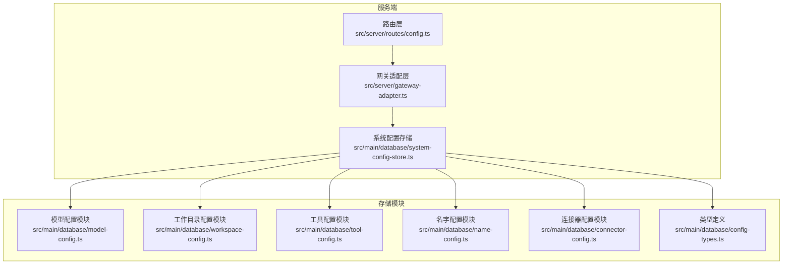
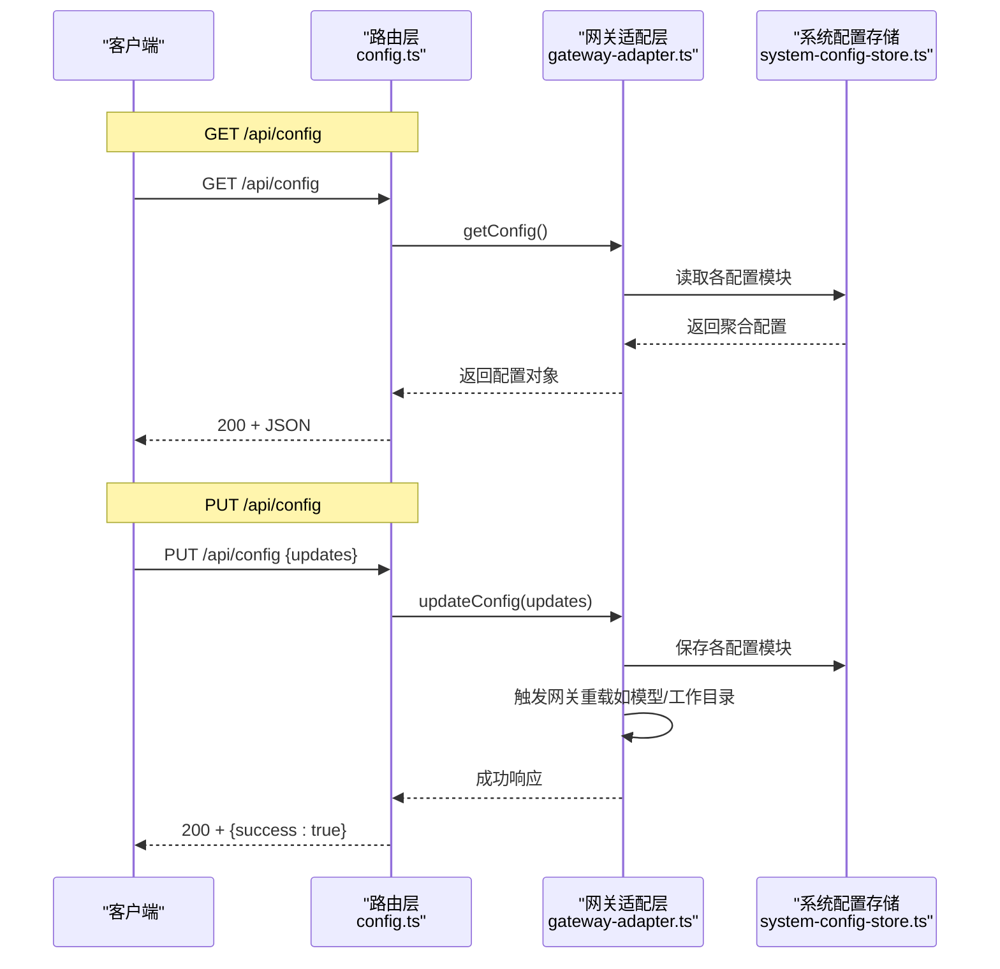
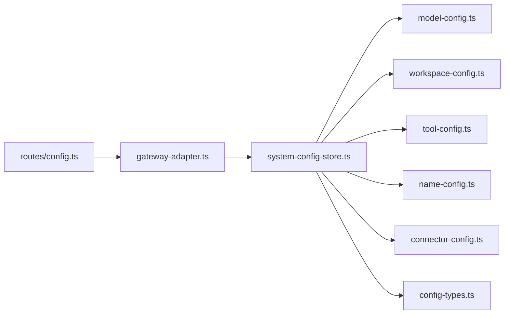

# 配置管理 API

<cite>
**本文引用的文件**
- [src/server/routes/config.ts](file://src/server/routes/config.ts)
- [src/server/gateway-adapter.ts](file://src/server/gateway-adapter.ts)
- [src/main/database/system-config-store.ts](file://src/main/database/system-config-store.ts)
- [src/main/database/config-types.ts](file://src/main/database/config-types.ts)
- [src/main/database/model-config.ts](file://src/main/database/model-config.ts)
- [src/main/database/workspace-config.ts](file://src/main/database/workspace-config.ts)
- [src/main/database/tool-config.ts](file://src/main/database/tool-config.ts)
- [src/main/database/name-config.ts](file://src/main/database/name-config.ts)
- [src/main/database/connector-config.ts](file://src/main/database/connector-config.ts)
- [src/shared/config/default-configs.ts](file://src/shared/config/default-configs.ts)
- [src/server/middleware/auth.ts](file://src/server/middleware/auth.ts)
- [src/shared/utils/validation.ts](file://src/shared/utils/validation.ts)
</cite>

## 目录
1. [简介](#简介)
2. [项目结构](#项目结构)
3. [核心组件](#核心组件)
4. [架构总览](#架构总览)
5. [详细组件分析](#详细组件分析)
6. [依赖关系分析](#依赖关系分析)
7. [性能考量](#性能考量)
8. [故障排查指南](#故障排查指南)
9. [结论](#结论)
10. [附录](#附录)

## 简介
本文件面向 DeepBot 的配置管理 API，聚焦于两个核心路由：
- GET /api/config：获取系统配置快照
- PUT /api/config：更新系统配置

文档将深入解析路由实现、数据结构与默认值处理、参数校验与持久化流程、错误处理机制、安全性与访问控制、配置变更通知与缓存策略，并提供请求/响应示例与错误码说明。

## 项目结构
配置管理 API 的关键位置与职责如下：
- 路由层：定义 /api/config 的 GET/PUT 路由，负责接收请求与返回响应
- 网关适配层：将 API 请求映射到网关能力，协调配置读取与更新
- 存储层：以 SQLite 为核心的数据持久化，按配置类别拆分为多个模块
- 类型与默认值：统一的类型定义与默认配置常量，保证前后端一致性

图表来源
- [src/server/routes/config.ts:10-44](file://src/server/routes/config.ts#L10-L44)
- [src/server/gateway-adapter.ts:268-337](file://src/server/gateway-adapter.ts#L268-L337)
- [src/main/database/system-config-store.ts:37-566](file://src/main/database/system-config-store.ts#L37-L566)

章节来源
- [src/server/routes/config.ts:10-44](file://src/server/routes/config.ts#L10-L44)
- [src/server/gateway-adapter.ts:268-337](file://src/server/gateway-adapter.ts#L268-L337)
- [src/main/database/system-config-store.ts:37-566](file://src/main/database/system-config-store.ts#L37-L566)

## 核心组件
- 路由层
  - GET /api/config：调用网关适配器获取完整配置对象
  - PUT /api/config：接收请求体，调用网关适配器进行配置更新
- 网关适配层
  - getConfig：聚合模型、工作目录、名字、连接器、图片生成、网页搜索等配置，附加 Docker 模式标识
  - updateConfig：根据请求体字段分别更新对应配置，并触发网关侧重载（如模型/工作目录）
- 存储层
  - SystemConfigStore：单例数据库访问入口，按模块组织 CRUD
  - 各配置模块：模型、工作目录、工具、名字、连接器等独立模块，负责具体表结构与读写

章节来源
- [src/server/routes/config.ts:17-41](file://src/server/routes/config.ts#L17-L41)
- [src/server/gateway-adapter.ts:268-337](file://src/server/gateway-adapter.ts#L268-L337)
- [src/main/database/system-config-store.ts:37-566](file://src/main/database/system-config-store.ts#L37-L566)

## 架构总览
配置管理 API 的调用链路如下：

图表来源
- [src/server/routes/config.ts:17-41](file://src/server/routes/config.ts#L17-L41)
- [src/server/gateway-adapter.ts:268-337](file://src/server/gateway-adapter.ts#L268-L337)
- [src/main/database/system-config-store.ts:37-566](file://src/main/database/system-config-store.ts#L37-L566)

## 详细组件分析

### GET /api/config 实现细节
- 路由处理
  - 调用网关适配器的 getConfig，捕获异常并返回 500 错误
- 网关适配器
  - 读取 SystemConfigStore 单例，聚合以下配置：
    - 模型配置（providerType/providerId/providerName/baseUrl/modelId/apiType/modelId2/apiKey/contextWindow/lastFetched/fromEnv）
    - 工作目录配置（workspaceDir/scriptDir/skillDirs/defaultSkillDir/imageDir/memoryDir/sessionDir）
    - 名字配置（agentName/userName）
    - 连接器配置（数组，每项含 connectorId/connectorName/config/enabled）
    - 图片生成工具配置（provider/model/apiUrl/apiKey）
    - 网页搜索工具配置（provider/model/apiUrl/apiKey）
    - Docker 模式标识（isDocker）
- 默认值与回退
  - 模型配置优先使用数据库；若无则回退至环境变量（AI_*）构建配置
  - 工作目录配置在 Docker 模式下强制使用固定路径
  - 名字配置缺失时返回默认值
- 响应结构
  - 返回聚合后的配置对象（见“附录：请求/响应示例”）

章节来源
- [src/server/routes/config.ts:17-24](file://src/server/routes/config.ts#L17-L24)
- [src/server/gateway-adapter.ts:268-285](file://src/server/gateway-adapter.ts#L268-L285)
- [src/main/database/model-config.ts:55-95](file://src/main/database/model-config.ts#L55-L95)
- [src/main/database/workspace-config.ts:48-89](file://src/main/database/workspace-config.ts#L48-L89)
- [src/main/database/name-config.ts:7-41](file://src/main/database/name-config.ts#L7-L41)

### PUT /api/config 实现细节
- 路由处理
  - 从请求体提取 updates，调用网关适配器 updateConfig，捕获异常并返回 500 错误
- 网关适配器更新流程
  - 模型配置：若存在 updates.model，则保存并触发网关重载模型配置
  - 工作目录配置：若存在 updates.workspace，则保存并触发网关重载工作目录
  - 名字配置：分别处理 agentName 与 userName 的保存
  - 连接器配置：遍历 updates.connectors，逐条保存
  - 图片生成/网页搜索工具配置：分别保存
- 参数验证与错误处理
  - 当前路由层未做参数校验，建议在网关适配层或存储模块增加校验
  - 错误统一通过错误处理器转换为可读消息

章节来源
- [src/server/routes/config.ts:30-38](file://src/server/routes/config.ts#L30-L38)
- [src/server/gateway-adapter.ts:288-337](file://src/server/gateway-adapter.ts#L288-L337)

### 配置数据结构与字段定义
- 模型配置（ModelConfig）
  - providerType：提供商标识（枚举）
  - providerId/providerName/baseUrl/modelId/apiType
  - modelId2（可选，快速模型）
  - apiKey（敏感信息，建议加密存储）
  - contextWindow/lastFetched（可选）
  - fromEnv（是否来自环境变量）
- 工作目录配置（WorkspaceSettings）
  - workspaceDir/scriptDir/skillDirs/defaultSkillDir/imageDir/memoryDir/sessionDir
- 名字配置（agentName/userName）
  - 长度限制与非空校验
- 连接器配置（数组项）
  - connectorId/connectorName/config/enabled
- 工具配置
  - 图片生成：provider/model/apiUrl/apiKey
  - 网页搜索：provider/model/apiUrl/apiKey

章节来源
- [src/main/database/config-types.ts:34-66](file://src/main/database/config-types.ts#L34-L66)
- [src/main/database/model-config.ts:34-46](file://src/main/database/model-config.ts#L34-L46)
- [src/main/database/workspace-config.ts:21-29](file://src/main/database/workspace-config.ts#L21-L29)
- [src/main/database/name-config.ts:10-16](file://src/main/database/name-config.ts#L10-L16)
- [src/main/database/tool-config.ts:51-66](file://src/main/database/tool-config.ts#L51-L66)
- [src/main/database/tool-config.ts:82-91](file://src/main/database/tool-config.ts#L82-L91)

### 默认值处理
- 默认配置常量
  - 提供商预设（qwen/deepseek/gemini/minimax/custom）
  - 图片生成/网页搜索提供商预设
  - 默认模型/图片生成/网页搜索工具配置
- 回退策略
  - 模型配置：数据库无配置时回退到环境变量（AI_*）
  - 工作目录：Docker 模式下强制固定路径
  - 名字配置：缺失返回默认值

章节来源
- [src/shared/config/default-configs.ts:11-54](file://src/shared/config/default-configs.ts#L11-L54)
- [src/shared/config/default-configs.ts:117-132](file://src/shared/config/default-configs.ts#L117-L132)
- [src/main/database/model-config.ts:24-52](file://src/main/database/model-config.ts#L24-L52)
- [src/main/database/workspace-config.ts:17-46](file://src/main/database/workspace-config.ts#L17-L46)
- [src/main/database/name-config.ts:19-40](file://src/main/database/name-config.ts#L19-L40)

### 参数验证与错误处理
- 当前实现
  - 路由层未进行参数校验
  - 网关适配层未进行参数校验
  - 存储模块对部分字段做了约束（如名字长度、非空）
- 建议增强
  - 在网关适配层引入统一校验工具（参考 validation.ts）
  - 对敏感字段（如 apiKey）进行脱敏与最小长度校验
  - 对枚举字段进行白名单校验

章节来源
- [src/shared/utils/validation.ts:8-72](file://src/shared/utils/validation.ts#L8-L72)
- [src/main/database/name-config.ts:47-107](file://src/main/database/name-config.ts#L47-L107)

### 安全性考虑与访问控制
- 身份验证中间件
  - 支持两种模式：无密码（单用户直通）与密码保护（JWT）
  - 未设置 ACCESS_PASSWORD 时自动放行
  - 设置后要求 Authorization: Bearer <token>
- 建议
  - 生产环境务必设置 ACCESS_PASSWORD 与强 JWT_SECRET
  - 对敏感配置（如 apiKey）进行访问控制与审计

章节来源
- [src/server/middleware/auth.ts:22-44](file://src/server/middleware/auth.ts#L22-L44)
- [src/server/middleware/auth.ts:57-90](file://src/server/middleware/auth.ts#L57-L90)

### 配置变更通知机制与缓存策略
- 通知机制
  - 网关适配层在配置更新后触发网关重载（如 reloadModelConfig/reloadWorkspaceConfig）
  - 适配层将内部事件转换为 WebSocket 事件（如 model_config_update、name_config_update）
- 缓存策略
  - 模型配置模块使用内存缓存，保存/删除后清空缓存，下次读取重新加载
  - 其他配置模块未见显式缓存，建议对热点配置（如模型配置）引入缓存与失效策略

章节来源
- [src/server/gateway-adapter.ts:297-304](file://src/server/gateway-adapter.ts#L297-L304)
- [src/main/database/model-config.ts:14-16](file://src/main/database/model-config.ts#L14-L16)
- [src/main/database/model-config.ts:124-125](file://src/main/database/model-config.ts#L124-L125)

## 依赖关系分析
- 路由层依赖网关适配层
- 网关适配层依赖系统配置存储与各配置模块
- 系统配置存储依赖 SQLite 适配器与各配置模块
- 类型定义贯穿存储与适配层

图表来源
- [src/server/routes/config.ts:10-44](file://src/server/routes/config.ts#L10-L44)
- [src/server/gateway-adapter.ts:268-337](file://src/server/gateway-adapter.ts#L268-L337)
- [src/main/database/system-config-store.ts:37-566](file://src/main/database/system-config-store.ts#L37-L566)

章节来源
- [src/server/routes/config.ts:10-44](file://src/server/routes/config.ts#L10-L44)
- [src/server/gateway-adapter.ts:268-337](file://src/server/gateway-adapter.ts#L268-L337)
- [src/main/database/system-config-store.ts:37-566](file://src/main/database/system-config-store.ts#L37-L566)

## 性能考量
- 数据库 WAL 模式与主动 checkpoint：模型配置保存后主动触发 wal_checkpoint，确保写入及时
- 内存缓存：模型配置模块缓存读取结果，减少数据库访问
- Docker 模式下的路径固定：避免动态解析带来的额外开销
- 建议
  - 对频繁读取的配置引入 LRU 缓存
  - 分批更新配置时合并事务，减少 WAL 刷新次数

章节来源
- [src/main/database/model-config.ts:121-125](file://src/main/database/model-config.ts#L121-L125)
- [src/main/database/model-config.ts:14-16](file://src/main/database/model-config.ts#L14-L16)

## 故障排查指南
- 常见错误与定位
  - 500 服务器错误：通常由网关适配层或存储模块抛出异常引起
  - 401 未认证：未设置 ACCESS_PASSWORD 或 Token 无效/过期
  - 配置保存失败：检查字段约束（如名字长度、非空）、数据库权限与 WAL 写入
- 建议排查步骤
  - 查看服务端日志（SystemConfigStore 与 GatewayAdapter 的日志输出）
  - 确认 Docker 模式与路径配置
  - 校验请求体字段类型与枚举值

章节来源
- [src/server/routes/config.ts:21-23](file://src/server/routes/config.ts#L21-L23)
- [src/server/middleware/auth.ts:32-44](file://src/server/middleware/auth.ts#L32-L44)
- [src/main/database/name-config.ts:47-107](file://src/main/database/name-config.ts#L47-L107)

## 结论
配置管理 API 采用“路由层 -> 网关适配层 -> 存储层”的清晰分层，具备良好的可扩展性。当前实现侧重功能完备性，建议在参数校验、敏感字段保护与缓存策略方面进一步完善，以提升安全性与性能。

## 附录

### 请求/响应示例
- GET /api/config
  - 请求：无请求体
  - 响应体字段
    - model：模型配置对象
    - workspace：工作目录配置对象
    - names：{ agentName, userName }
    - connectors：连接器配置数组
    - imageGeneration：图片生成工具配置对象
    - webSearch：网页搜索工具配置对象
    - isDocker：布尔值，指示是否为 Docker 模式
  - 示例（示意）
    - {
        "model": { "providerType":"qwen", "providerId":"qwen", "baseUrl":"...", "modelId":"qwen3.5-plus", "apiKey":"" },
        "workspace": { "workspaceDir":"/home/user/.deepbot", "scriptDir":"...", "skillDirs":["..."], "defaultSkillDir":"...", "imageDir":"...", "memoryDir":"...", "sessionDir":"..." },
        "names": { "agentName":"matrix", "userName":"user" },
        "connectors": [ { "connectorId":"feishu", "connectorName":"飞书", "config":{...}, "enabled":true } ],
        "imageGeneration": { "provider":"gemini", "model":"gemini-3.1-flash-image-preview", "apiUrl":"...", "apiKey":"" },
        "webSearch": { "provider":"qwen", "model":"qwen3.5-plus", "apiUrl":"...", "apiKey":"" },
        "isDocker": false
      }

- PUT /api/config
  - 请求体字段（可选组合）
    - model/workspace/names/connectors/imageGeneration/webSearch
  - 响应
    - { "success": true, "message": "配置已更新" }

- 错误响应
  - 401 未认证：{ "error":"需要身份验证" 或 "Token 无效或已过期" }
  - 500 服务器错误：{ "error":"错误描述" }

章节来源
- [src/server/routes/config.ts:17-38](file://src/server/routes/config.ts#L17-L38)
- [src/server/gateway-adapter.ts:268-337](file://src/server/gateway-adapter.ts#L268-L337)

### 错误码说明
- 200：成功
- 401：未认证或 Token 无效
- 500：服务器内部错误（异常被捕获并转换为可读消息）

章节来源
- [src/server/routes/config.ts:21-23](file://src/server/routes/config.ts#L21-L23)
- [src/server/middleware/auth.ts:32-44](file://src/server/middleware/auth.ts#L32-L44)