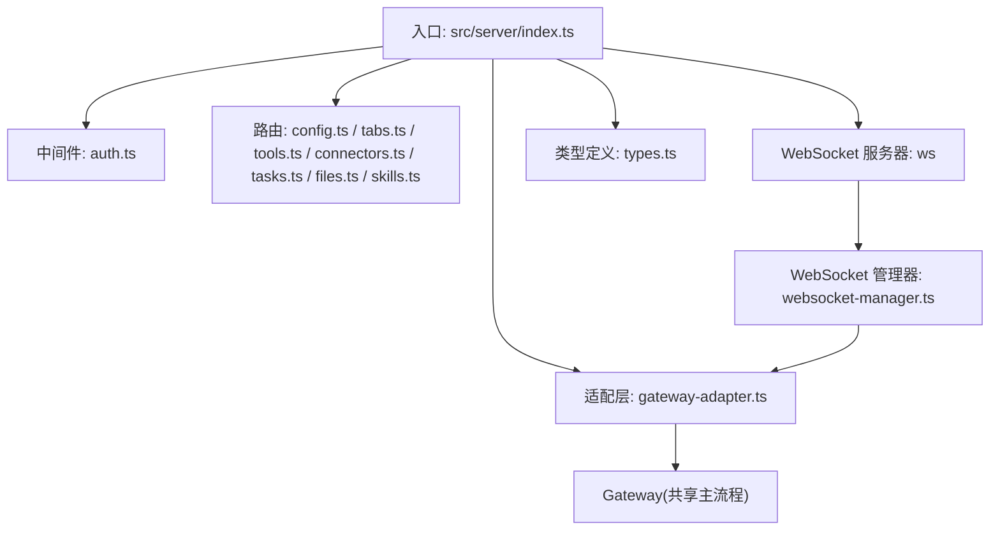
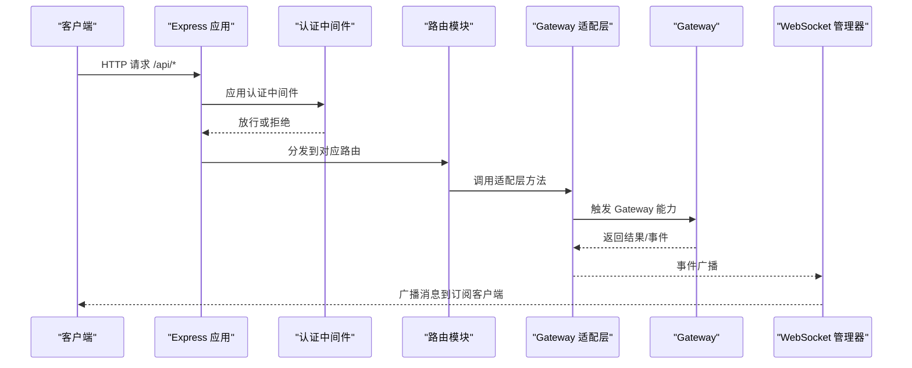
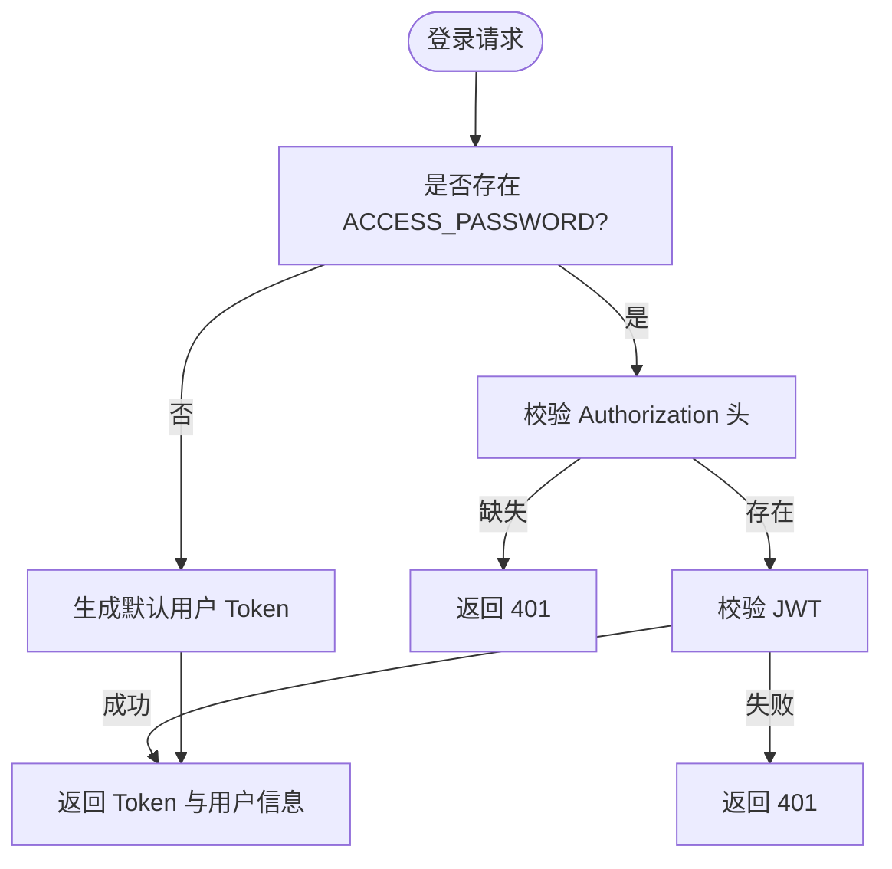
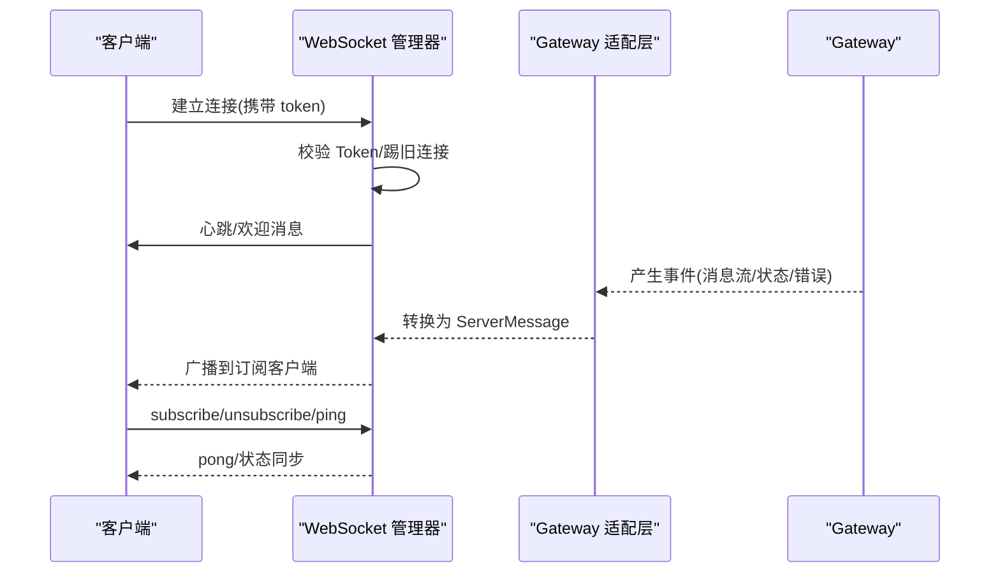
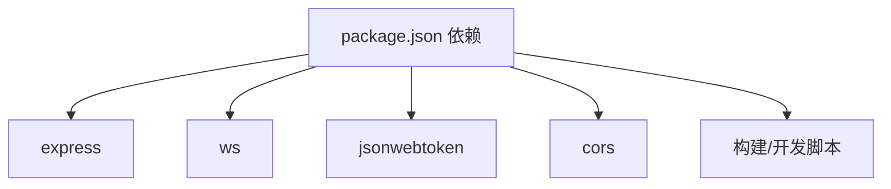

# Web 服务器架构

<cite>
**本文引用的文件**
- [src/server/index.ts](file://src/server/index.ts)
- [src/server/middleware/auth.ts](file://src/server/middleware/auth.ts)
- [src/server/websocket-manager.ts](file://src/server/websocket-manager.ts)
- [src/server/gateway-adapter.ts](file://src/server/gateway-adapter.ts)
- [src/server/types.ts](file://src/server/types.ts)
- [src/server/routes/config.ts](file://src/server/routes/config.ts)
- [src/server/routes/tabs.ts](file://src/server/routes/tabs.ts)
- [src/server/routes/tools.ts](file://src/server/routes/tools.ts)
- [src/server/routes/connectors.ts](file://src/server/routes/connectors.ts)
- [src/server/routes/tasks.ts](file://src/server/routes/tasks.ts)
- [src/server/routes/files.ts](file://src/server/routes/files.ts)
- [src/server/routes/skills.ts](file://src/server/routes/skills.ts)
- [src/shared/utils/logger.ts](file://src/shared/utils/logger.ts)
- [src/shared/utils/error-handler.ts](file://src/shared/utils/error-handler.ts)
- [package.json](file://package.json)
</cite>

## 目录
1. [简介](#简介)
2. [项目结构](#项目结构)
3. [核心组件](#核心组件)
4. [架构总览](#架构总览)
5. [详细组件分析](#详细组件分析)
6. [依赖关系分析](#依赖关系分析)
7. [性能考量](#性能考量)
8. [故障排查指南](#故障排查指南)
9. [结论](#结论)
10. [附录](#附录)

## 简介
本文件面向 史丽慧小助理 的 Web 服务器架构，系统性阐述基于 Express 的 HTTP API 与 WebSocket 集成方案，覆盖中间件体系、路由设计、认证与安全策略、消息流与事件广播、错误处理与日志记录，并提供 API 端点说明与扩展指南，帮助开发者在 Web 模式下进行二次开发与集成。

## 项目结构
Web 服务器位于 src/server 目录，采用“入口文件 + 中间件 + 路由模块 + 适配层 + WebSocket 管理器”的分层组织方式。入口文件负责创建 Express、HTTP 与 WebSocket 服务器、挂载中间件与路由、静态资源与 SPA 回退；适配层将 Gateway 的能力映射为 Web API；WebSocket 管理器负责连接生命周期、鉴权、订阅与事件广播。

图表来源
- [src/server/index.ts:33-128](file://src/server/index.ts#L33-L128)
- [src/server/middleware/auth.ts:22-45](file://src/server/middleware/auth.ts#L22-L45)
- [src/server/gateway-adapter.ts:45-58](file://src/server/gateway-adapter.ts#L45-L58)
- [src/server/websocket-manager.ts:29-38](file://src/server/websocket-manager.ts#L29-L38)

章节来源
- [src/server/index.ts:33-128](file://src/server/index.ts#L33-L128)

## 核心组件
- Express 应用与 HTTP 服务：创建应用、注册 CORS、JSON/URL 编码解析、静态资源、健康检查、认证 API、受保护 API 路由、SPA 回退、全局错误处理。
- WebSocket 服务器与管理器：基于 ws，负责连接鉴权、心跳、订阅管理、事件广播、优雅断开与资源回收。
- 中间件：CORS、JSON 解析、认证中间件与登录处理器。
- 路由系统：按领域拆分，分别处理配置、标签页、工具、连接器、定时任务、文件与技能。
- 适配层：将 Gateway 的 Tab、消息、配置、连接器等能力映射为 Web API，并通过事件驱动向 WebSocket 广播。
- 类型系统：统一定义认证请求/响应、Token 负载、WebSocket 消息类型。
- 日志与错误处理：统一错误提取与错误响应，日志工具支持文件落盘与安全输出。

章节来源
- [src/server/index.ts:33-128](file://src/server/index.ts#L33-L128)
- [src/server/websocket-manager.ts:29-38](file://src/server/websocket-manager.ts#L29-L38)
- [src/server/middleware/auth.ts:22-45](file://src/server/middleware/auth.ts#L22-L45)
- [src/server/gateway-adapter.ts:45-58](file://src/server/gateway-adapter.ts#L45-L58)
- [src/server/types.ts:13-68](file://src/server/types.ts#L13-L68)
- [src/shared/utils/logger.ts:16-145](file://src/shared/utils/logger.ts#L16-L145)
- [src/shared/utils/error-handler.ts:8-50](file://src/shared/utils/error-handler.ts#L8-L50)

## 架构总览
下图展示 Web 服务器从请求进入、中间件处理、路由分发、适配层调用到 WebSocket 广播的整体流程。

图表来源
- [src/server/index.ts:88-95](file://src/server/index.ts#L88-L95)
- [src/server/middleware/auth.ts:22-45](file://src/server/middleware/auth.ts#L22-L45)
- [src/server/gateway-adapter.ts:201-234](file://src/server/gateway-adapter.ts#L201-L234)
- [src/server/websocket-manager.ts:227-340](file://src/server/websocket-manager.ts#L227-L340)

## 详细组件分析

### Express 服务器与中间件
- 服务器初始化：创建 Express、HTTP Server、WebSocketServer，注入 CORS、JSON/URL 编码解析。
- 静态资源与 SPA 回退：生产环境提供 dist-web 静态页面，开发环境通过 Vite 提供前端。
- 健康检查：/health 返回运行状态、版本、运行时长与活动连接数。
- 认证 API：POST /api/auth/login 支持无密码单用户模式与密码保护模式。
- 受保护 API：以 /api/* 开头的路由均需通过 authMiddleware 鉴权。
- 全局错误处理：统一捕获异常并返回 500 JSON。
- 优雅关闭：SIGINT 时关闭 WebSocket 与 HTTP 服务器，超时强制退出。

章节来源
- [src/server/index.ts:33-128](file://src/server/index.ts#L33-L128)
- [src/server/middleware/auth.ts:57-90](file://src/server/middleware/auth.ts#L57-L90)

### 认证机制与安全策略
- 单用户 + 密码保护模式：若未设置 ACCESS_PASSWORD，则默认放行；否则要求 Bearer Token。
- JWT 签发与校验：登录成功签发 Token，默认有效期 30 天；WebSocket 连接同样校验 Token。
- Token 覆盖策略：同一用户新连接会踢掉旧连接，保证会话安全。
- 安全建议：生产环境务必设置 ACCESS_PASSWORD 与强 JWT_SECRET，避免明文传输密码。

图表来源
- [src/server/middleware/auth.ts:22-45](file://src/server/middleware/auth.ts#L22-L45)
- [src/server/middleware/auth.ts:57-90](file://src/server/middleware/auth.ts#L57-L90)

章节来源
- [src/server/middleware/auth.ts:22-45](file://src/server/middleware/auth.ts#L22-L45)
- [src/server/middleware/auth.ts:57-90](file://src/server/middleware/auth.ts#L57-L90)

### WebSocket 集成与消息广播
- 连接建立：从 URL 查询参数获取 token，校验后建立连接并踢掉同用户旧连接。
- 心跳与订阅：支持 ping/pong，客户端可订阅/取消订阅特定 tabId。
- 事件广播：适配层将 Gateway 的消息流、执行步骤、Agent 状态、错误、Tab 事件等转换为统一 ServerMessage 广播。
- 断开处理：断开时停止该客户端订阅的所有 Tab 的生成任务，避免资源泄漏。

图表来源
- [src/server/websocket-manager.ts:73-125](file://src/server/websocket-manager.ts#L73-L125)
- [src/server/websocket-manager.ts:144-201](file://src/server/websocket-manager.ts#L144-L201)
- [src/server/websocket-manager.ts:227-340](file://src/server/websocket-manager.ts#L227-L340)

章节来源
- [src/server/websocket-manager.ts:29-38](file://src/server/websocket-manager.ts#L29-L38)
- [src/server/websocket-manager.ts:73-125](file://src/server/websocket-manager.ts#L73-L125)
- [src/server/websocket-manager.ts:227-340](file://src/server/websocket-manager.ts#L227-L340)

### API 路由系统设计与实现
- 配置 API：GET /api/config 获取系统配置；PUT /api/config 更新配置。
- 标签页 API：GET /api/tabs 列表；POST /api/tabs 创建；GET /api/tabs/:tabId 获取；DELETE /api/tabs/:tabId 关闭；POST /api/tabs/:tabId/messages 发送消息；GET /api/tabs/:tabId/messages 获取历史；POST /api/tabs/stop-generation 停止生成。
- 工具 API：POST /api/tools/environment-check 环境检查；POST /api/tools/launch-chrome Chrome 调试（Web 模式提示不支持）。
- 连接器 API：GET /api/connectors 列表；GET/POST /api/connectors/:id/config 配置读写；POST /api/connectors/:id/start/stop 启停；GET /api/connectors/:id/health 健康检查；POST /api/connectors/pairing/approve 批准配对；POST /api/connectors/:id/pairing/:userId/admin 管理员设置；DELETE /api/connectors/:id/pairing/:userId 删除配对；GET /api/connectors/pairing 获取配对记录。
- 定时任务 API：POST /api/tasks 执行任务操作。
- 文件 API：POST /api/files/upload 上传文件；POST /api/files/upload-image 上传图片；GET /api/files/read-image 读取图片；DELETE /api/files/temp 删除临时文件。
- 技能 API：POST /api/skills 统一入口，支持列表、搜索、安装、卸载、信息查询等。

章节来源
- [src/server/routes/config.ts:10-44](file://src/server/routes/config.ts#L10-L44)
- [src/server/routes/tabs.ts:10-136](file://src/server/routes/tabs.ts#L10-L136)
- [src/server/routes/tools.ts:9-56](file://src/server/routes/tools.ts#L9-L56)
- [src/server/routes/connectors.ts:9-214](file://src/server/routes/connectors.ts#L9-L214)
- [src/server/routes/tasks.ts:9-32](file://src/server/routes/tasks.ts#L9-L32)
- [src/server/routes/files.ts:10-106](file://src/server/routes/files.ts#L10-L106)
- [src/server/routes/skills.ts:10-37](file://src/server/routes/skills.ts#L10-L37)

### 类型系统与消息契约
- 认证扩展请求：AuthRequest 带 userId。
- Token 负载：TokenPayload 包含 userId。
- 登录请求/响应：LoginRequest/LoginResponse。
- WebSocket 消息：ClientMessage 支持 ping、subscribe、unsubscribe；ServerMessage 覆盖消息流、执行步骤、Agent 状态、错误、Tab 事件、清空聊天、配置更新、会话被踢等。

章节来源
- [src/server/types.ts:13-68](file://src/server/types.ts#L13-L68)

### 适配层：Gateway 到 Web API 的桥梁
- 虚拟窗口：在 Web 模式下模拟 Electron 的 BrowserWindow/webContents，将 IPC 消息转换为 EventEmitter 事件。
- 事件映射：将 Gateway 的消息流、执行步骤、Agent 状态、错误、Tab 事件、配置更新等映射为 WebSocket 事件。
- 能力暴露：对外提供获取/创建/关闭 Tab、发送消息、获取历史、环境检查、连接器管理、文件上传/读取/删除、技能管理、停止生成等方法。
- 安全与限制：Web 模式不支持 Chrome 调试，会返回明确提示。

章节来源
- [src/server/gateway-adapter.ts:45-58](file://src/server/gateway-adapter.ts#L45-L58)
- [src/server/gateway-adapter.ts:70-196](file://src/server/gateway-adapter.ts#L70-L196)
- [src/server/gateway-adapter.ts:201-234](file://src/server/gateway-adapter.ts#L201-L234)
- [src/server/gateway-adapter.ts:342-362](file://src/server/gateway-adapter.ts#L342-L362)

## 依赖关系分析
- Express 依赖：cors、express、ws。
- 认证依赖：jsonwebtoken。
- 构建与脚本：Vite、TypeScript、concurrently、nodemon、dotenv 等。
- 开发与打包：Electron、electron-builder、wait-on 等。

图表来源
- [package.json:45-107](file://package.json#L45-L107)

章节来源
- [package.json:45-107](file://package.json#L45-L107)

## 性能考量
- 请求体大小：JSON/URL 编码解析上限 700MB，满足大文件与图片上传场景。
- 连接管理：WebSocket 管理器维护客户端集合与订阅集合，断开时主动停止订阅 Tab 的生成，避免资源浪费。
- 事件广播：仅向订阅目标广播，减少不必要的网络负载。
- 优雅关闭：SIGINT 时有序关闭，防止数据丢失与资源泄露。
- 建议：生产环境开启 ACCESS_PASSWORD 与强 JWT_SECRET，合理设置超时与并发限制，监控 /health 接口与连接数。

章节来源
- [src/server/index.ts:64-65](file://src/server/index.ts#L64-L65)
- [src/server/websocket-manager.ts:207-222](file://src/server/websocket-manager.ts#L207-L222)
- [src/server/index.ts:131-148](file://src/server/index.ts#L131-L148)

## 故障排查指南
- 认证失败
  - 现象：401 未授权。
  - 排查：确认 Authorization 头是否为 Bearer Token；核对 ACCESS_PASSWORD 与 JWT_SECRET；检查 Token 是否过期。
- WebSocket 连接被拒
  - 现象：连接立即关闭，错误码 1008。
  - 排查：确认 URL 查询参数 token 是否正确；核对 ACCESS_PASSWORD 与 JWT 校验。
- 会话冲突被踢
  - 现象：收到 type 为 session:kicked 的消息。
  - 排查：同一用户在新设备登录导致旧连接被踢，属预期行为。
- 文件上传失败
  - 现象：返回错误信息。
  - 排查：确认文件大小未超过限制；dataUrl 格式正确；工作目录权限正常。
- 日志定位
  - 控制台：统一使用错误处理工具提取错误消息。
  - 文件：可启用文件日志，日志目录位于用户主目录下的 ~/.slhbot/logs。

章节来源
- [src/server/middleware/auth.ts:37-44](file://src/server/middleware/auth.ts#L37-L44)
- [src/server/websocket-manager.ts:99-102](file://src/server/websocket-manager.ts#L99-L102)
- [src/server/websocket-manager.ts:56-66](file://src/server/websocket-manager.ts#L56-L66)
- [src/server/routes/files.ts:14-34](file://src/server/routes/files.ts#L14-L34)
- [src/shared/utils/error-handler.ts:8-13](file://src/shared/utils/error-handler.ts#L8-L13)
- [src/shared/utils/logger.ts:32-49](file://src/shared/utils/logger.ts#L32-L49)

## 结论
史丽慧小助理 Web 服务器以 Express 为核心，结合自研适配层与 WebSocket 管理器，实现了从 API 到实时消息的完整闭环。认证与安全策略简单可靠，适合单用户或轻量多用户场景；路由按领域清晰拆分，便于扩展；日志与错误处理完善，利于运维与排障。建议在生产环境启用密码保护与强密钥，并结合监控与日志策略持续优化。

## 附录

### API 端点一览与使用要点
- 认证
  - POST /api/auth/login：登录获取 Token；无 ACCESS_PASSWORD 时自动放行。
- 配置
  - GET /api/config：获取系统配置。
  - PUT /api/config：更新系统配置。
- 标签页
  - GET /api/tabs：获取所有 Tab。
  - POST /api/tabs：创建新 Tab。
  - GET /api/tabs/:tabId：获取指定 Tab。
  - DELETE /api/tabs/:tabId：关闭指定 Tab。
  - POST /api/tabs/:tabId/messages：向指定 Tab 发送消息。
  - GET /api/tabs/:tabId/messages：获取消息历史。
  - POST /api/tabs/stop-generation：停止生成。
- 工具
  - POST /api/tools/environment-check：环境检查。
  - POST /api/tools/launch-chrome：启动 Chrome 调试（Web 模式提示不支持）。
- 连接器
  - GET /api/connectors：获取连接器列表。
  - GET /api/connectors/:id/config：获取连接器配置。
  - POST /api/connectors/:id/config：保存连接器配置。
  - POST /api/connectors/:id/start：启动连接器。
  - POST /api/connectors/:id/stop：停止连接器。
  - GET /api/connectors/:id/health：健康检查。
  - POST /api/connectors/pairing/approve：批准配对。
  - POST /api/connectors/:id/pairing/:userId/admin：设置管理员。
  - DELETE /api/connectors/:id/pairing/:userId：删除配对。
  - GET /api/connectors/pairing：获取配对记录。
- 定时任务
  - POST /api/tasks：执行任务操作。
- 文件
  - POST /api/files/upload：上传文件。
  - POST /api/files/upload-image：上传图片。
  - GET /api/files/read-image：读取图片。
  - DELETE /api/files/temp：删除临时文件。
- 技能
  - POST /api/skills：统一入口，支持技能管理。

章节来源
- [src/server/routes/config.ts:10-44](file://src/server/routes/config.ts#L10-L44)
- [src/server/routes/tabs.ts:10-136](file://src/server/routes/tabs.ts#L10-L136)
- [src/server/routes/tools.ts:9-56](file://src/server/routes/tools.ts#L9-L56)
- [src/server/routes/connectors.ts:9-214](file://src/server/routes/connectors.ts#L9-L214)
- [src/server/routes/tasks.ts:9-32](file://src/server/routes/tasks.ts#L9-L32)
- [src/server/routes/files.ts:10-106](file://src/server/routes/files.ts#L10-L106)
- [src/server/routes/skills.ts:10-37](file://src/server/routes/skills.ts#L10-L37)

### 开发者扩展指南（Web 模式）
- 新增路由
  - 在 src/server/routes 下新增模块，导出 createXxxRouter(gatewayAdapter)，并在入口文件中挂载到 /api/x。
- 新增适配方法
  - 在 GatewayAdapter 中新增方法，必要时扩展事件映射与 WebSocket 广播。
- 新增 WebSocket 事件
  - 在 types.ts 中扩展 ServerMessage 类型，在 WebSocketManager 中增加事件监听与广播。
- 安全加固
  - 设置 ACCESS_PASSWORD 与强 JWT_SECRET；限制请求体大小；对敏感操作增加权限校验。
- 日志与监控
  - 使用统一错误处理与日志工具；在关键路径埋点；定期检查 /health 与连接数。

章节来源
- [src/server/index.ts:88-95](file://src/server/index.ts#L88-L95)
- [src/server/gateway-adapter.ts:45-58](file://src/server/gateway-adapter.ts#L45-L58)
- [src/server/websocket-manager.ts:227-340](file://src/server/websocket-manager.ts#L227-L340)
- [src/shared/utils/logger.ts:16-145](file://src/shared/utils/logger.ts#L16-L145)
- [src/shared/utils/error-handler.ts:8-50](file://src/shared/utils/error-handler.ts#L8-L50)