# Web 服务器设计

<cite>
**本文档引用的文件**
- [src/server/index.ts](file://src/server/index.ts)
- [src/server/gateway-adapter.ts](file://src/server/gateway-adapter.ts)
- [src/server/websocket-manager.ts](file://src/server/websocket-manager.ts)
- [src/server/middleware/auth.ts](file://src/server/middleware/auth.ts)
- [src/server/routes/config.ts](file://src/server/routes/config.ts)
- [src/server/types.ts](file://src/server/types.ts)
- [src/main/gateway.ts](file://src/main/gateway.ts)
- [src/main/gateway-connector.ts](file://src/main/gateway-connector.ts)
- [src/main/gateway-tab.ts](file://src/main/gateway-tab.ts)
- [src/main/config/timeouts.ts](file://src/main/config/timeouts.ts)
- [package.json](file://package.json)
- [README.md](file://README.md)
</cite>

## 目录
1. [简介](#简介)
2. [项目结构](#项目结构)
3. [核心组件](#核心组件)
4. [架构概览](#架构概览)
5. [详细组件分析](#详细组件分析)
6. [依赖关系分析](#依赖关系分析)
7. [性能考虑](#性能考虑)
8. [故障排除指南](#故障排除指南)
9. [结论](#结论)

## 简介

DeepBot Web 服务器是一个基于 Express.js 和 WebSocket 的现代化 Web 应用程序，专门为 DeepBot AI 助手提供 Web 访问能力。该服务器实现了完整的会话管理、消息路由、文件上传和外部连接器集成功能，支持多用户并发访问和实时消息推送。

该服务器的核心创新在于将 Electron 环境下的 Gateway 适配器无缝复用到 Web 模式中，通过虚拟窗口机制实现了跨平台的一致性体验。

## 项目结构

DeepBot 采用模块化架构，Web 服务器位于 `src/server/` 目录下，与主进程代码分离，确保了清晰的职责划分和良好的可维护性。

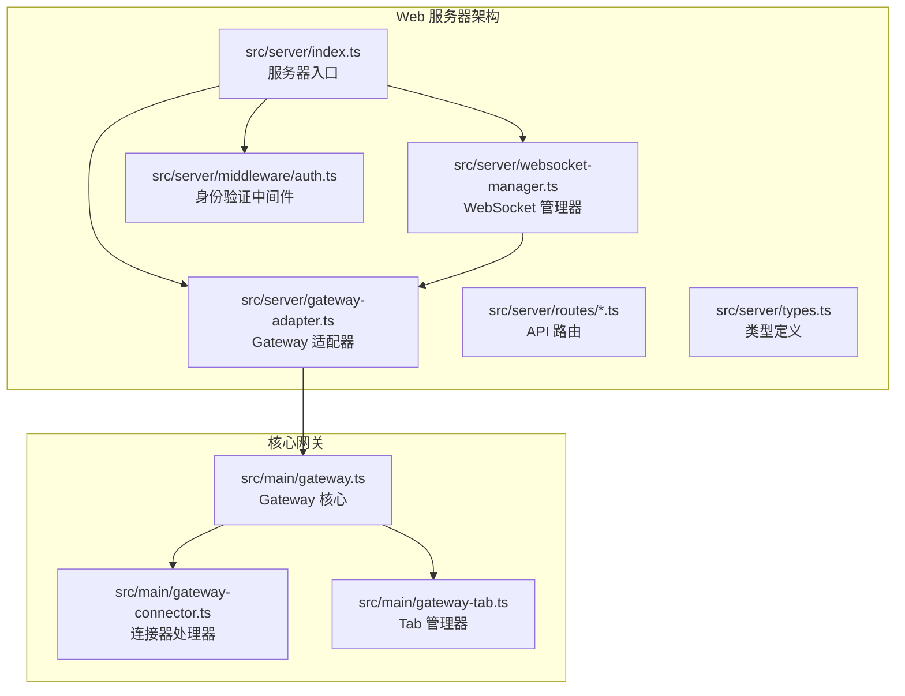

**图表来源**
- [src/server/index.ts:1-156](file://src/server/index.ts#L1-L156)
- [src/server/gateway-adapter.ts:1-763](file://src/server/gateway-adapter.ts#L1-L763)
- [src/main/gateway.ts:1-772](file://src/main/gateway.ts#L1-L772)

**章节来源**
- [src/server/index.ts:1-156](file://src/server/index.ts#L1-L156)
- [src/server/gateway-adapter.ts:1-763](file://src/server/gateway-adapter.ts#L1-L763)
- [src/main/gateway.ts:1-772](file://src/main/gateway.ts#L1-L772)

## 核心组件

### Express 服务器初始化

Web 服务器采用模块化设计，通过单一入口文件 `index.ts` 管理整个服务器的初始化过程。

**服务器初始化流程**：
1. **环境变量读取**：从进程环境中读取端口、环境模式等配置
2. **Express 应用创建**：初始化 Express 应用实例
3. **HTTP 服务器创建**：基于 Express 应用创建 HTTP 服务器
4. **WebSocket 服务器初始化**：创建 WebSocket 服务器实例
5. **Gateway 初始化**：创建并初始化 Gateway 实例
6. **适配器创建**：创建 Gateway 适配器并设置虚拟窗口
7. **WebSocket 管理器初始化**：设置 WebSocket 事件监听和消息路由

**章节来源**
- [src/server/index.ts:33-149](file://src/server/index.ts#L33-L149)

### Gateway 适配器

Gateway 适配器是 Web 服务器的核心组件，负责将 Electron 环境下的 Gateway 功能适配到 Web 模式中。

#### 虚拟窗口机制

适配器通过虚拟窗口机制实现了与 Electron 环境的完全兼容：

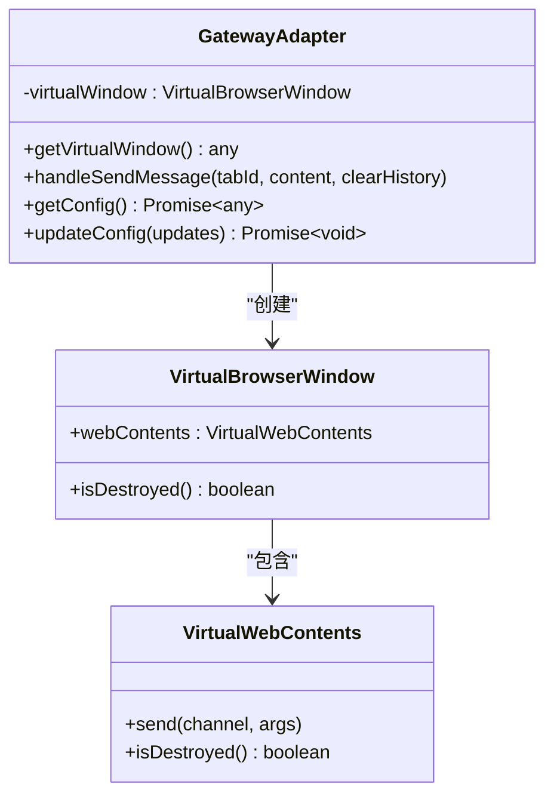

**图表来源**
- [src/server/gateway-adapter.ts:17-43](file://src/server/gateway-adapter.ts#L17-L43)
- [src/server/gateway-adapter.ts:45-65](file://src/server/gateway-adapter.ts#L45-L65)

#### 适配器功能

Gateway 适配器提供了完整的 API 接口，包括：

- **Tab 管理**：创建、获取、关闭 Tab
- **消息处理**：发送消息、获取历史消息
- **配置管理**：获取和更新系统配置
- **文件操作**：文件上传、图片上传、文件读取
- **连接器管理**：连接器配置、启动、停止
- **技能管理**：技能安装、卸载、管理

**章节来源**
- [src/server/gateway-adapter.ts:201-762](file://src/server/gateway-adapter.ts#L201-L762)

### WebSocket 管理器

WebSocket 管理器负责处理实时通信，实现了完整的客户端连接管理、消息路由和状态同步功能。

#### 连接管理

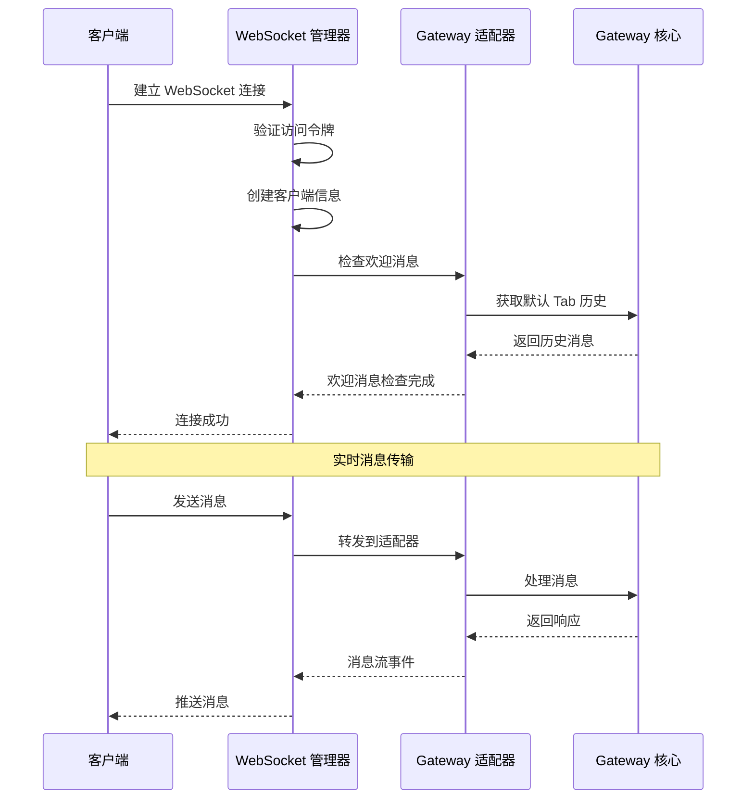

**图表来源**
- [src/server/websocket-manager.ts:73-125](file://src/server/websocket-manager.ts#L73-L125)
- [src/server/websocket-manager.ts:227-340](file://src/server/websocket-manager.ts#L227-L340)

**章节来源**
- [src/server/websocket-manager.ts:29-381](file://src/server/websocket-manager.ts#L29-L381)

### 身份验证系统

Web 服务器实现了灵活的身份验证机制，支持无密码模式和密码保护模式：

#### 认证流程

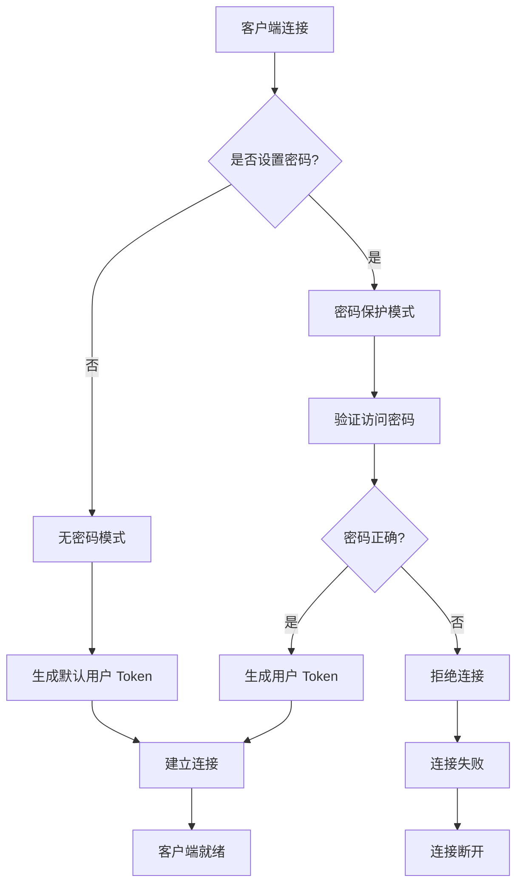

**图表来源**
- [src/server/middleware/auth.ts:22-45](file://src/server/middleware/auth.ts#L22-L45)
- [src/server/middleware/auth.ts:57-90](file://src/server/middleware/auth.ts#L57-L90)

**章节来源**
- [src/server/middleware/auth.ts:1-91](file://src/server/middleware/auth.ts#L1-L91)

## 架构概览

DeepBot Web 服务器采用了分层架构设计，确保了各组件之间的松耦合和高内聚。

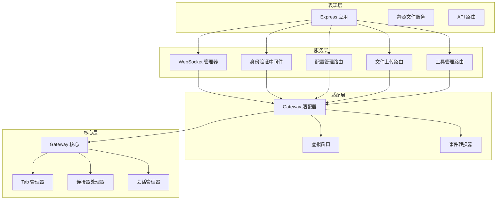

**图表来源**
- [src/server/index.ts:36-102](file://src/server/index.ts#L36-L102)
- [src/server/gateway-adapter.ts:45-58](file://src/server/gateway-adapter.ts#L45-L58)
- [src/main/gateway.ts:29-114](file://src/main/gateway.ts#L29-L114)

## 详细组件分析

### Express 服务器初始化流程

服务器启动过程遵循严格的初始化顺序，确保所有依赖项正确加载和配置。

#### 初始化阶段

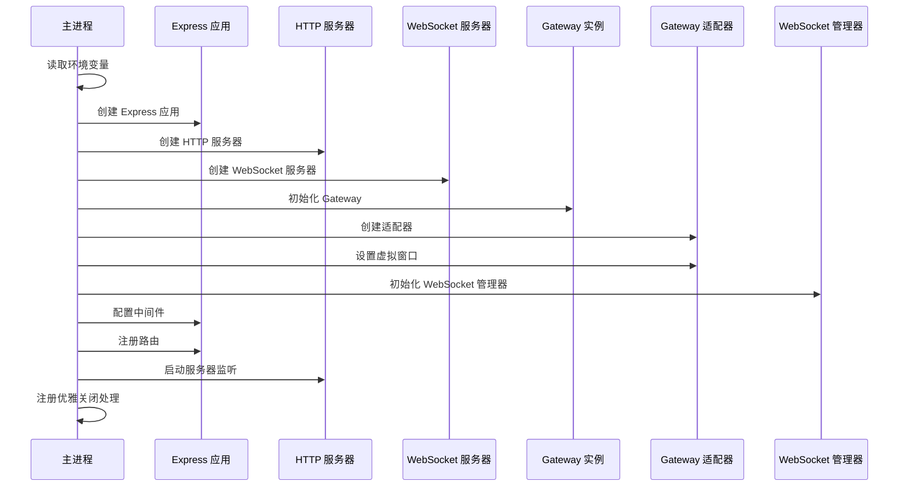

**图表来源**
- [src/server/index.ts:33-149](file://src/server/index.ts#L33-L149)

#### 配置选项详解

服务器支持多种配置选项：

| 配置项 | 默认值 | 说明 |
|--------|--------|------|
| PORT | 3008 | 服务器监听端口 |
| NODE_ENV | development | 运行环境模式 |
| ACCESS_PASSWORD | 未设置 | 访问密码（可选） |
| JWT_SECRET | deepbot-default-secret-change-in-production | JWT 密钥 |
| ACCESS_TOKEN | 未设置 | 访问令牌（可选） |

**章节来源**
- [src/server/index.ts:29-31](file://src/server/index.ts#L29-L31)
- [src/server/websocket-manager.ts:20-21](file://src/server/websocket-manager.ts#L20-L21)
- [src/server/middleware/auth.ts:12-15](file://src/server/middleware/auth.ts#L12-L15)

### Gateway 适配器实现机制

Gateway 适配器通过虚拟窗口机制实现了与 Electron 环境的完全兼容，这是 Web 模式的关键创新。

#### 虚拟窗口类设计

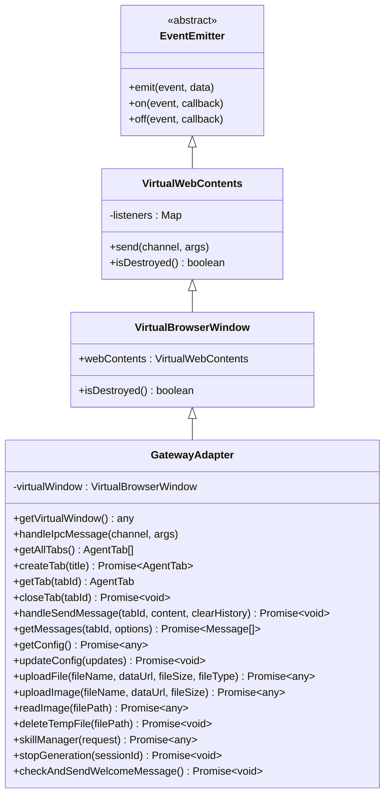

**图表来源**
- [src/server/gateway-adapter.ts:17-65](file://src/server/gateway-adapter.ts#L17-L65)

#### IPC 消息转换

适配器实现了完整的 IPC 消息到 WebSocket 事件的转换机制：

| IPC 频道 | WebSocket 事件 | 用途 |
|----------|----------------|------|
| message:stream | message:stream | 流式消息传输 |
| message:execution-step-update | execution-step:update | 执行步骤更新 |
| command:clear-chat | clear-chat | 清空聊天指令 |
| name-config:updated | name-config:update | 名称配置更新 |
| model-config:updated | model-config:update | 模型配置更新 |
| connector:pending-count-updated | pending-count:update | 待授权数量更新 |
| agent:status | agent_status | Agent 状态更新 |
| message:error | message:error | 错误消息 |
| tab:messages-cleared | tab:messages-cleared | Tab 消息清空 |
| tab:history-loaded | tab:history-loaded | Tab 历史加载完成 |
| tab:created | tab:created | Tab 创建 |
| tab:updated | tab:updated | Tab 更新 |

**章节来源**
- [src/server/gateway-adapter.ts:70-196](file://src/server/gateway-adapter.ts#L70-L196)

### WebSocket 实时通信

WebSocket 管理器实现了完整的实时通信功能，支持多客户端连接和消息路由。

#### 连接生命周期管理

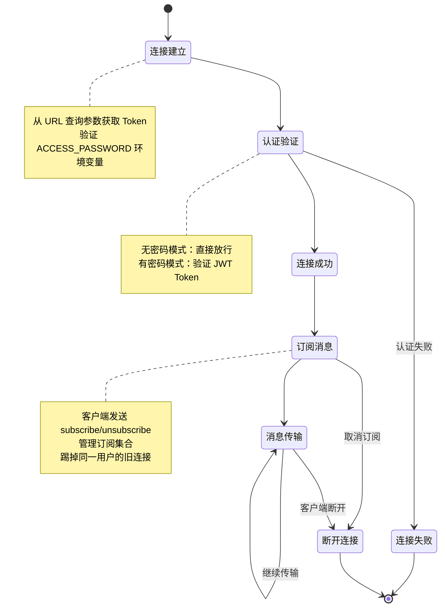

**图表来源**
- [src/server/websocket-manager.ts:73-125](file://src/server/websocket-manager.ts#L73-L125)
- [src/server/websocket-manager.ts:177-201](file://src/server/websocket-manager.ts#L177-L201)

#### 消息广播机制

WebSocket 管理器实现了智能的消息广播机制：

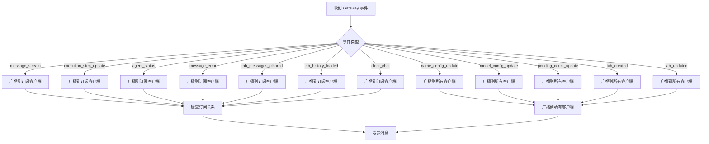

**图表来源**
- [src/server/websocket-manager.ts:227-340](file://src/server/websocket-manager.ts#L227-L340)

**章节来源**
- [src/server/websocket-manager.ts:29-381](file://src/server/websocket-manager.ts#L29-L381)

### API 路由系统

Web 服务器提供了完整的 RESTful API 接口，支持配置管理、文件操作、工具管理等功能。

#### 配置管理 API

| 端点 | 方法 | 功能 | 认证 |
|------|------|------|------|
| /api/config | GET | 获取系统配置 | 是 |
| /api/config | PUT | 更新系统配置 | 是 |
| /api/tabs | GET | 获取所有 Tab | 是 |
| /api/tabs/:id | GET | 获取指定 Tab | 是 |
| /api/tabs/:id | DELETE | 关闭 Tab | 是 |
| /api/tools | GET | 获取工具列表 | 是 |
| /api/connectors | GET | 获取连接器列表 | 是 |
| /api/tasks | GET | 获取定时任务 | 是 |
| /api/files | POST | 文件上传 | 是 |
| /api/skills | POST | 技能管理 | 是 |

**章节来源**
- [src/server/routes/config.ts:10-44](file://src/server/routes/config.ts#L10-L44)

### 文件上传处理

Web 服务器实现了完整的文件上传功能，支持图片和普通文件的上传处理。

#### 文件上传流程

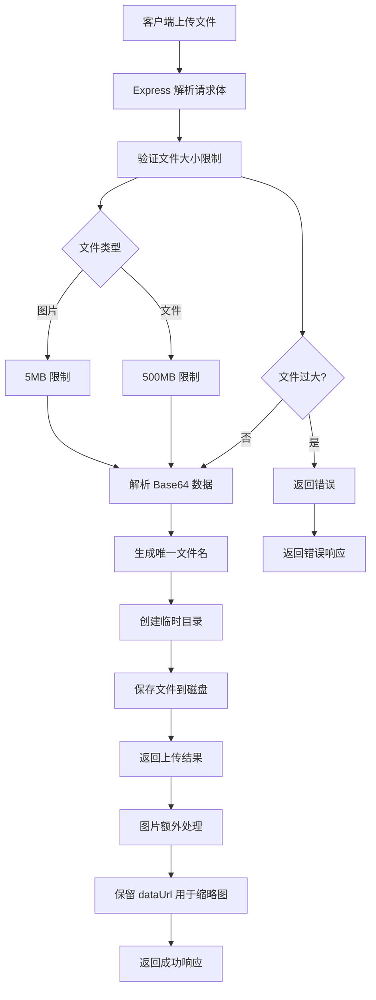

**图表来源**
- [src/server/gateway-adapter.ts:558-625](file://src/server/gateway-adapter.ts#L558-L625)

**章节来源**
- [src/server/gateway-adapter.ts:630-720](file://src/server/gateway-adapter.ts#L630-L720)

## 依赖关系分析

### 外部依赖

Web 服务器依赖于多个关键的第三方库：

```mermaid
graph TB
subgraph "核心框架"
A[express ^5.2.1]
B[ws ^8.19.0]
C[cors ^2.8.5]
D[jsonwebtoken ^9.0.2]
end
subgraph "工具库"
E[dotenv ^16.4.7]
F[ws ^8.19.0]
G[zod ^3.22.0]
H[axios ^1.6.0]
end
subgraph "开发工具"
I[@types/express ^5.0.6]
J[@types/ws ^8.18.1]
K[@types/jsonwebtoken ^9.0.5]
L[typescript ^5.3.0]
end
A --> E
B --> F
D --> G
A --> I
B --> J
D --> K
A --> L
```

**图表来源**
- [package.json:45-77](file://package.json#L45-L77)
- [package.json:78-107](file://package.json#L78-L107)

### 内部模块依赖

服务器内部模块之间存在清晰的依赖关系：

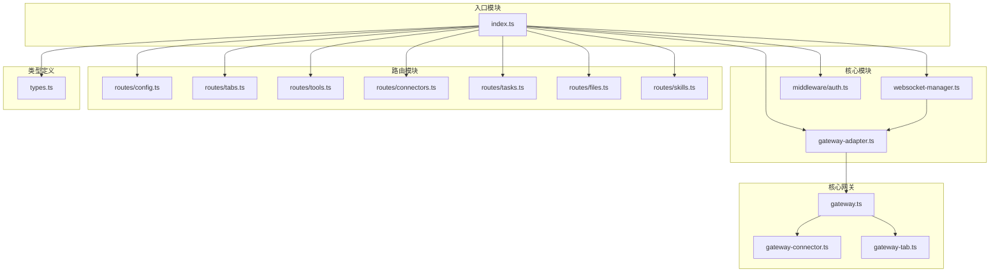

**图表来源**
- [src/server/index.ts:16-27](file://src/server/index.ts#L16-L27)
- [src/server/gateway-adapter.ts:8-11](file://src/server/gateway-adapter.ts#L8-L11)
- [src/main/gateway.ts:13-27](file://src/main/gateway.ts#L13-L27)

**章节来源**
- [package.json:1-235](file://package.json#L1-L235)

## 性能考虑

### 超时配置

服务器实现了全面的超时配置机制，确保长时间操作的稳定性和响应性：

| 超时类型 | 默认值 | 用途 |
|----------|--------|------|
| AGENT_MESSAGE_TIMEOUT | 30分钟 | 主 Agent 消息超时 |
| WEBSOCKET_WELCOME_DELAY | 500ms | WebSocket 欢迎消息延迟 |
| SERVER_GRACEFUL_SHUTDOWN | 10秒 | 服务器优雅关闭超时 |
| SESSION_MANAGER_INIT_TIMEOUT | 5秒 | SessionManager 初始化超时 |
| BROWSER_DEFAULT_TIMEOUT | 30秒 | 浏览器默认超时 |
| HTTP_REQUEST_TIMEOUT | 5秒 | HTTP 请求超时 |

**章节来源**
- [src/main/config/timeouts.ts:9-53](file://src/main/config/timeouts.ts#L9-L53)

### 内存管理

服务器采用了多种内存管理策略：

1. **连接池管理**：WebSocket 连接的生命周期管理
2. **会话清理**：定期清理过期的会话数据
3. **文件上传清理**：临时文件的自动清理机制
4. **缓存策略**：配置和状态的内存缓存

### 并发处理

服务器支持多用户并发访问，通过以下机制保证性能：

- **事件驱动架构**：基于事件的异步处理
- **连接池管理**：高效的连接复用
- **消息队列**：有序的消息处理机制
- **资源限制**：文件大小和请求体大小限制

## 故障排除指南

### 常见启动问题

#### 端口占用问题

**症状**：服务器启动失败，显示端口已被占用

**解决方案**：
1. 检查端口使用情况：`lsof -i :3008`
2. 修改端口配置：设置 `PORT` 环境变量
3. 终止占用进程：`kill -9 $(lsof -t -i :3008)`

#### 依赖缺失问题

**症状**：启动时报错缺少依赖模块

**解决方案**：
1. 安装依赖：`pnpm install`
2. 清理缓存：`pnpm cache clean`
3. 重新安装：`pnpm install --force`

### 连接问题

#### WebSocket 连接失败

**症状**：客户端无法建立 WebSocket 连接

**排查步骤**：
1. 检查服务器日志：查看连接错误信息
2. 验证 Token：确认 ACCESS_PASSWORD 配置
3. 检查防火墙：确保端口 3008 可访问
4. 测试连接：使用 `wscat` 工具测试连接

#### 认证失败

**症状**：API 请求返回 401 错误

**解决方案**：
1. 检查访问密码：确认 ACCESS_PASSWORD 设置
2. 验证 JWT 令牌：检查令牌格式和有效期
3. 检查密钥配置：确认 JWT_SECRET 设置

### 性能问题

#### 服务器响应缓慢

**症状**：API 响应时间过长

**优化建议**：
1. 检查服务器负载：监控 CPU 和内存使用率
2. 优化数据库查询：检查慢查询日志
3. 调整超时配置：根据实际情况调整超时时间
4. 增加服务器资源：考虑升级硬件配置

**章节来源**
- [src/server/index.ts:130-148](file://src/server/index.ts#L130-L148)
- [src/server/websocket-manager.ts:168-172](file://src/server/websocket-manager.ts#L168-L172)

## 结论

DeepBot Web 服务器设计展现了现代 Web 应用的最佳实践，通过精心设计的架构实现了以下关键目标：

### 架构优势

1. **模块化设计**：清晰的职责分离和模块化组织
2. **跨平台兼容**：通过虚拟窗口机制实现 Electron 和 Web 的无缝切换
3. **实时通信**：完善的 WebSocket 实现实时消息推送
4. **安全性**：多层次的身份验证和访问控制机制
5. **可扩展性**：灵活的插件系统和配置机制

### 技术创新

1. **Gateway 适配器**：将桌面应用的核心功能移植到 Web 环境
2. **虚拟窗口机制**：实现了与原生 Electron 环境的完全兼容
3. **智能消息路由**：基于订阅模式的高效消息分发机制
4. **文件上传处理**：完整的文件处理和存储机制

### 未来发展

该服务器架构为 DeepBot 的进一步发展奠定了坚实基础，支持的功能包括：

- **多平台部署**：支持 Docker 和传统服务器部署
- **微服务架构**：可扩展为分布式微服务架构
- **云原生支持**：支持 Kubernetes 和容器化部署
- **监控和日志**：完善的监控和日志系统

通过持续的优化和改进，DeepBot Web 服务器将成为企业级 AI 助手部署的理想选择，为企业数字化转型提供强有力的技术支撑。