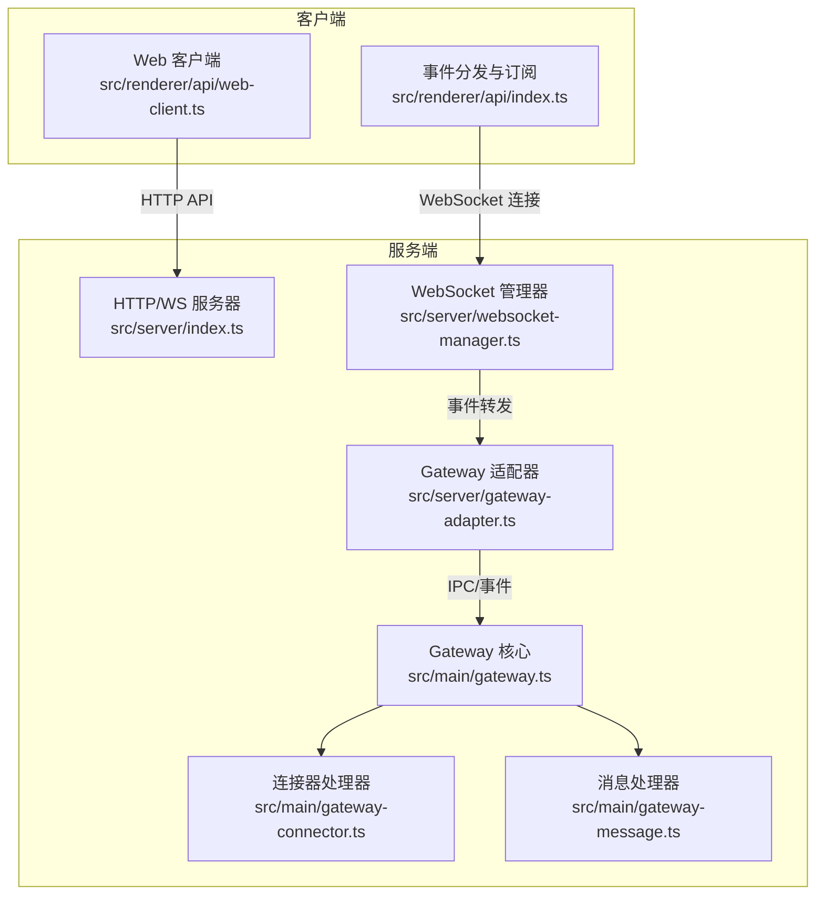
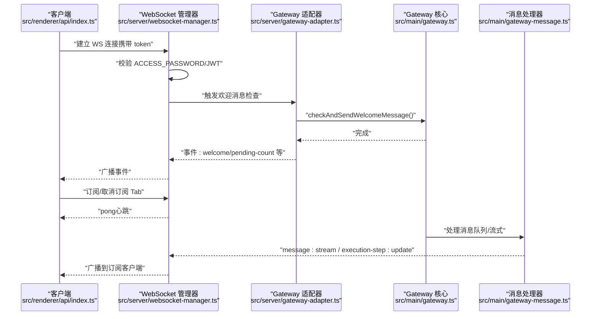
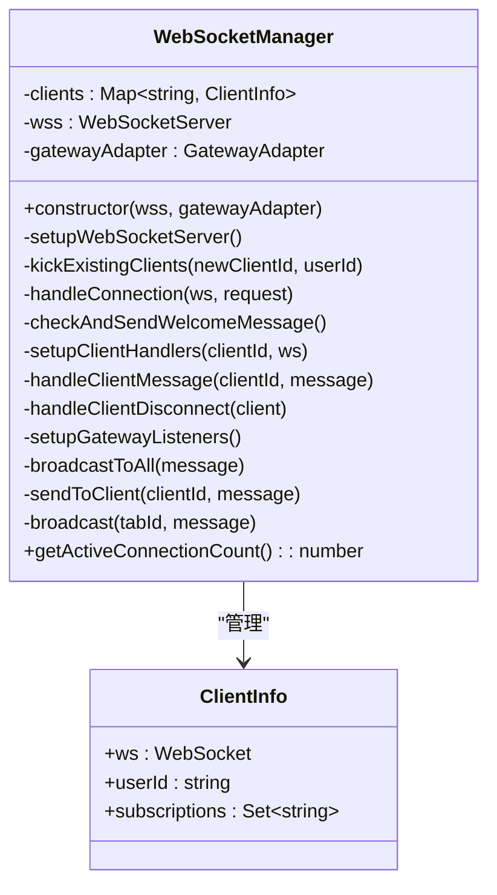
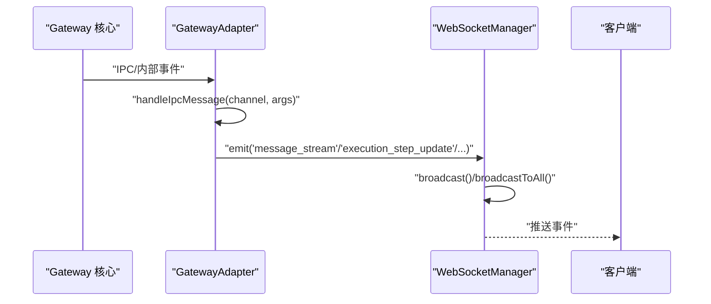
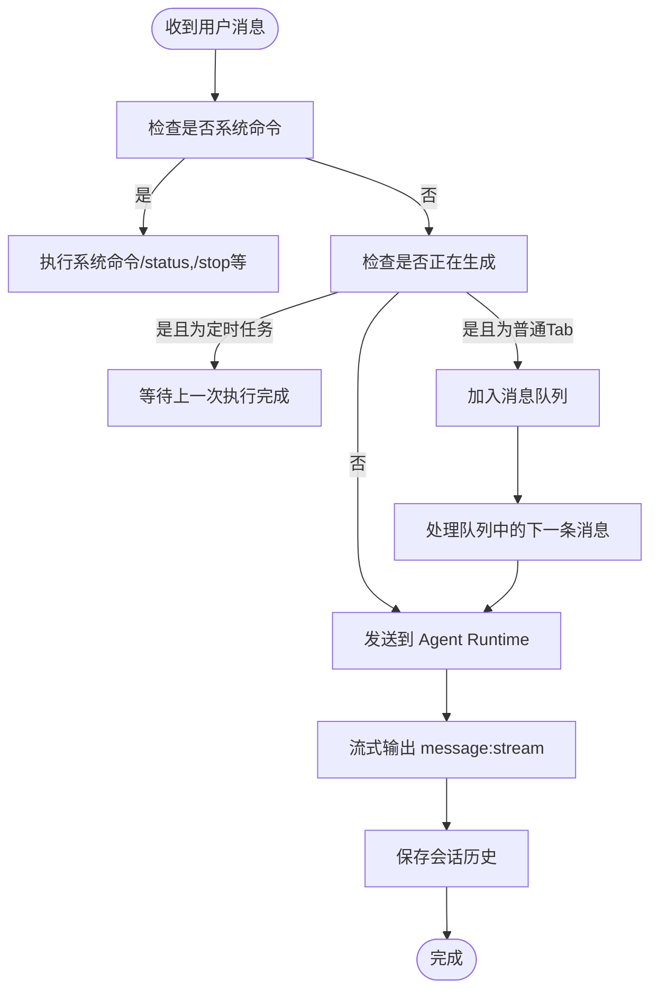
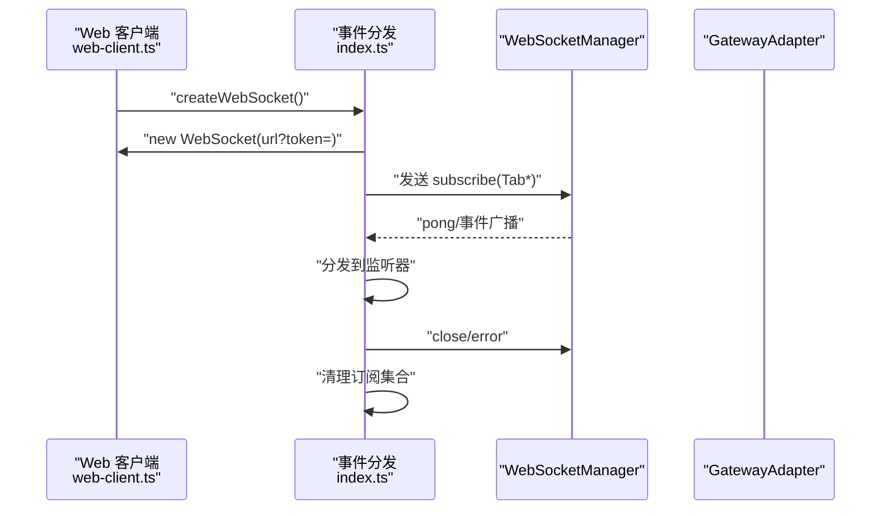
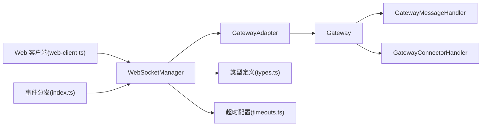

# WebSocket 集成

<cite>
**本文档引用的文件**
- [src/server/websocket-manager.ts](file://src/server/websocket-manager.ts)
- [src/server/gateway-adapter.ts](file://src/server/gateway-adapter.ts)
- [src/main/gateway.ts](file://src/main/gateway.ts)
- [src/main/gateway-connector.ts](file://src/main/gateway-connector.ts)
- [src/main/gateway-message.ts](file://src/main/gateway-message.ts)
- [src/server/types.ts](file://src/server/types.ts)
- [src/main/config/timeouts.ts](file://src/main/config/timeouts.ts)
- [src/server/index.ts](file://src/server/index.ts)
- [src/renderer/api/web-client.ts](file://src/renderer/api/web-client.ts)
- [src/renderer/api/index.ts](file://src/renderer/api/index.ts)
</cite>

## 目录
1. [简介](#简介)
2. [项目结构](#项目结构)
3. [核心组件](#核心组件)
4. [架构总览](#架构总览)
5. [详细组件分析](#详细组件分析)
6. [依赖关系分析](#依赖关系分析)
7. [性能考量](#性能考量)
8. [故障排查指南](#故障排查指南)
9. [结论](#结论)
10. [附录](#附录)

## 简介
本文件面向 史丽慧小助理 的 WebSocket 集成功能，系统性阐述 WebSocket 服务器的创建与配置、连接管理、消息路由与状态维护；深入解析 WebSocketManager 的设计与实现（连接池管理、消息广播、客户端状态跟踪）；说明 WebSocket 与 Gateway 的集成机制（消息适配与双向通信）；覆盖连接建立、心跳检测、断线重连与错误恢复；提供 API 使用示例与最佳实践，并讨论性能优化与连接数限制。

## 项目结构
史丽慧小助理 的 WebSocket 集成位于服务端模块，核心文件如下：
- 服务器入口与启动：src/server/index.ts
- WebSocket 管理器：src/server/websocket-manager.ts
- Gateway 适配器：src/server/gateway-adapter.ts
- Gateway 核心：src/main/gateway.ts
- 连接器与消息处理：src/main/gateway-connector.ts、src/main/gateway-message.ts
- 类型定义：src/server/types.ts
- 超时配置：src/main/config/timeouts.ts
- Web 客户端与事件分发：src/renderer/api/web-client.ts、src/renderer/api/index.ts

图表来源
- [src/server/index.ts:33-128](file://src/server/index.ts#L33-L128)
- [src/server/websocket-manager.ts:29-38](file://src/server/websocket-manager.ts#L29-L38)
- [src/server/gateway-adapter.ts:45-58](file://src/server/gateway-adapter.ts#L45-L58)
- [src/main/gateway.ts:29-114](file://src/main/gateway.ts#L29-L114)
- [src/main/gateway-connector.ts:44-88](file://src/main/gateway-connector.ts#L44-L88)
- [src/main/gateway-message.ts:31-64](file://src/main/gateway-message.ts#L31-L64)
- [src/renderer/api/web-client.ts:195-199](file://src/renderer/api/web-client.ts#L195-L199)
- [src/renderer/api/index.ts:412-486](file://src/renderer/api/index.ts#L412-L486)

章节来源
- [src/server/index.ts:33-128](file://src/server/index.ts#L33-L128)
- [src/server/websocket-manager.ts:29-38](file://src/server/websocket-manager.ts#L29-L38)
- [src/server/gateway-adapter.ts:45-58](file://src/server/gateway-adapter.ts#L45-L58)
- [src/main/gateway.ts:29-114](file://src/main/gateway.ts#L29-L114)
- [src/main/gateway-connector.ts:44-88](file://src/main/gateway-connector.ts#L44-L88)
- [src/main/gateway-message.ts:31-64](file://src/main/gateway-message.ts#L31-L64)
- [src/renderer/api/web-client.ts:195-199](file://src/renderer/api/web-client.ts#L195-L199)
- [src/renderer/api/index.ts:412-486](file://src/renderer/api/index.ts#L412-L486)

## 核心组件
- WebSocketManager：负责连接接入、鉴权、订阅管理、心跳、断线处理、消息广播与欢迎消息触发。
- GatewayAdapter：将 Gateway 的内部事件转换为 WebSocket 事件，同时提供虚拟窗口以适配 Web 模式下的消息通道。
- Gateway：会话与消息路由中枢，协调 AgentRuntime、连接器与消息处理器。
- 连接器与消息处理器：分别处理连接器消息与用户消息的队列、流式输出与错误恢复。
- 类型定义与超时配置：统一消息协议与超时策略，保障稳定性与可观测性。
- Web 客户端与事件分发：负责连接建立、订阅管理、事件分发与断线重连。

章节来源
- [src/server/websocket-manager.ts:29-381](file://src/server/websocket-manager.ts#L29-L381)
- [src/server/gateway-adapter.ts:45-762](file://src/server/gateway-adapter.ts#L45-L762)
- [src/main/gateway.ts:29-772](file://src/main/gateway.ts#L29-L772)
- [src/main/gateway-connector.ts:44-800](file://src/main/gateway-connector.ts#L44-L800)
- [src/main/gateway-message.ts:31-525](file://src/main/gateway-message.ts#L31-L525)
- [src/server/types.ts:43-68](file://src/server/types.ts#L43-L68)
- [src/main/config/timeouts.ts:9-53](file://src/main/config/timeouts.ts#L9-L53)
- [src/renderer/api/web-client.ts:195-199](file://src/renderer/api/web-client.ts#L195-L199)
- [src/renderer/api/index.ts:412-486](file://src/renderer/api/index.ts#L412-L486)

## 架构总览
WebSocket 集成采用“服务器-适配器-Gateway-处理器”的分层设计：
- 服务器入口创建 HTTP/WS 服务，初始化 Gateway 与 WebSocketManager。
- WebSocketManager 负责连接接入、鉴权与订阅管理，并将 Gateway 事件广播至订阅的客户端。
- GatewayAdapter 将 Gateway 的内部事件映射为 WebSocket 事件，同时提供虚拟窗口以适配 Web 模式。
- Gateway 协调消息与连接器处理，消息处理器负责队列、流式输出与错误恢复，连接器处理器负责连接器消息与系统命令。

图表来源
- [src/server/index.ts:58-60](file://src/server/index.ts#L58-L60)
- [src/server/websocket-manager.ts:73-125](file://src/server/websocket-manager.ts#L73-L125)
- [src/server/websocket-manager.ts:130-139](file://src/server/websocket-manager.ts#L130-L139)
- [src/server/gateway-adapter.ts:759-761](file://src/server/gateway-adapter.ts#L759-L761)
- [src/main/gateway.ts:207-213](file://src/main/gateway.ts#L207-L213)
- [src/main/gateway-message.ts:376-473](file://src/main/gateway-message.ts#L376-L473)
- [src/server/websocket-manager.ts:229-242](file://src/server/websocket-manager.ts#L229-L242)

章节来源
- [src/server/index.ts:58-60](file://src/server/index.ts#L58-L60)
- [src/server/websocket-manager.ts:73-125](file://src/server/websocket-manager.ts#L73-L125)
- [src/server/websocket-manager.ts:130-139](file://src/server/websocket-manager.ts#L130-L139)
- [src/server/gateway-adapter.ts:759-761](file://src/server/gateway-adapter.ts#L759-L761)
- [src/main/gateway.ts:207-213](file://src/main/gateway.ts#L207-L213)
- [src/main/gateway-message.ts:376-473](file://src/main/gateway-message.ts#L376-L473)
- [src/server/websocket-manager.ts:229-242](file://src/server/websocket-manager.ts#L229-L242)

## 详细组件分析

### WebSocketManager 设计与实现
职责与能力
- 连接接入与鉴权：支持无密码直连与 JWT 鉴权；同一用户新连接会踢掉旧连接。
- 订阅管理：维护每个客户端的订阅集合，支持订阅/取消订阅。
- 心跳与断线：处理 ping/pong、close/error；断线时停止对应客户端订阅的 Tab 的生成。
- 消息广播：支持广播到所有客户端、广播到订阅某 Tab 的客户端、定向发送。
- 欢迎消息：连接后延时触发欢迎消息检查，确保订阅完成后再推送。

关键流程
- 连接建立：解析 URL 查询参数 token，校验 ACCESS_PASSWORD/JWT，生成 clientId，建立 ClientInfo，设置消息与关闭/错误处理。
- 订阅管理：解析客户端消息，处理 subscribe/unsubscribe，维护 Set 集合。
- 广播策略：按订阅集合筛选目标客户端，保证只推送到订阅者。
- 断线处理：遍历客户端订阅的 Tab，调用 GatewayAdapter 停止对应生成，清理客户端状态。

图表来源
- [src/server/websocket-manager.ts:29-381](file://src/server/websocket-manager.ts#L29-L381)

章节来源
- [src/server/websocket-manager.ts:29-381](file://src/server/websocket-manager.ts#L29-L381)

### Gateway 与 GatewayAdapter 的集成
职责与适配
- GatewayAdapter：继承 EventEmitter，将 Gateway 内部事件转换为 WebSocket 事件；在 Web 模式下提供虚拟窗口，将 IPC 消息转换为事件。
- Gateway：作为会话与消息路由中枢，初始化各处理器，提供消息发送、停止生成、配置更新等能力；Web 模式下通过 initializeForWebMode 注入虚拟窗口。

事件映射要点
- 流式消息：用户消息、AI 响应片段、完成信号均映射为 message:stream。
- 执行步骤：execution-step:update。
- Agent 状态：agent_status。
- 错误：message:error。
- Tab 生命周期：tab:created、tab:updated、tab:messages-cleared、tab:history-loaded。
- 全局配置：name-config:update、model-config:update、pending-count:update。
- 清空聊天：clear-chat。

图表来源
- [src/server/gateway-adapter.ts:70-196](file://src/server/gateway-adapter.ts#L70-L196)
- [src/server/websocket-manager.ts:229-340](file://src/server/websocket-manager.ts#L229-L340)

章节来源
- [src/server/gateway-adapter.ts:45-762](file://src/server/gateway-adapter.ts#L45-L762)
- [src/server/websocket-manager.ts:229-340](file://src/server/websocket-manager.ts#L229-L340)

### 连接器与消息处理
- 连接器处理器：负责连接器消息的接收、Tab 的查找/创建、系统命令解析（/status、/stop 等）、进度提醒定时器、响应回传。
- 消息处理器：负责用户消息的队列管理、流式输出、错误恢复（AI 连接错误自动重试）、执行步骤实时更新、保存会话历史、发送到连接器。

图表来源
- [src/main/gateway-message.ts:76-160](file://src/main/gateway-message.ts#L76-L160)
- [src/main/gateway-message.ts:376-473](file://src/main/gateway-message.ts#L376-L473)
- [src/main/gateway-connector.ts:98-296](file://src/main/gateway-connector.ts#L98-L296)

章节来源
- [src/main/gateway-message.ts:76-160](file://src/main/gateway-message.ts#L76-L160)
- [src/main/gateway-message.ts:376-473](file://src/main/gateway-message.ts#L376-L473)
- [src/main/gateway-connector.ts:98-296](file://src/main/gateway-connector.ts#L98-L296)

### 客户端连接与订阅
- Web 客户端：通过 webClient.createWebSocket 建立 WS 连接，携带 token。
- 事件分发：在 open 事件后批量订阅所有 Tab，随后按事件类型分发到监听器。
- 断线处理：close 时清理订阅集合，便于重连后重新订阅。

图表来源
- [src/renderer/api/web-client.ts:195-199](file://src/renderer/api/web-client.ts#L195-L199)
- [src/renderer/api/index.ts:412-486](file://src/renderer/api/index.ts#L412-L486)
- [src/server/websocket-manager.ts:182-200](file://src/server/websocket-manager.ts#L182-L200)

章节来源
- [src/renderer/api/web-client.ts:195-199](file://src/renderer/api/web-client.ts#L195-L199)
- [src/renderer/api/index.ts:412-486](file://src/renderer/api/index.ts#L412-L486)
- [src/server/websocket-manager.ts:182-200](file://src/server/websocket-manager.ts#L182-L200)

## 依赖关系分析
- WebSocketManager 依赖 WebSocketServer、GatewayAdapter、类型定义与超时配置。
- GatewayAdapter 依赖 Gateway，并通过虚拟窗口桥接事件。
- Gateway 依赖消息与连接器处理器、会话管理器、连接器管理器等。
- 客户端依赖 web-client 与事件分发模块。

图表来源
- [src/server/websocket-manager.ts:11-18](file://src/server/websocket-manager.ts#L11-L18)
- [src/server/gateway-adapter.ts:8-26](file://src/server/gateway-adapter.ts#L8-L26)
- [src/main/gateway.ts:13-27](file://src/main/gateway.ts#L13-L27)
- [src/main/gateway-message.ts:11-18](file://src/main/gateway-message.ts#L11-L18)
- [src/main/gateway-connector.ts:10-21](file://src/main/gateway-connector.ts#L10-L21)
- [src/server/types.ts:5-8](file://src/server/types.ts#L5-L8)
- [src/main/config/timeouts.ts:9-53](file://src/main/config/timeouts.ts#L9-L53)
- [src/renderer/api/web-client.ts:10-11](file://src/renderer/api/web-client.ts#L10-L11)
- [src/renderer/api/index.ts:412-486](file://src/renderer/api/index.ts#L412-L486)

章节来源
- [src/server/websocket-manager.ts:11-18](file://src/server/websocket-manager.ts#L11-L18)
- [src/server/gateway-adapter.ts:8-26](file://src/server/gateway-adapter.ts#L8-L26)
- [src/main/gateway.ts:13-27](file://src/main/gateway.ts#L13-L27)
- [src/main/gateway-message.ts:11-18](file://src/main/gateway-message.ts#L11-L18)
- [src/main/gateway-connector.ts:10-21](file://src/main/gateway-connector.ts#L10-L21)
- [src/server/types.ts:5-8](file://src/server/types.ts#L5-L8)
- [src/main/config/timeouts.ts:9-53](file://src/main/config/timeouts.ts#L9-L53)
- [src/renderer/api/web-client.ts:10-11](file://src/renderer/api/web-client.ts#L10-L11)
- [src/renderer/api/index.ts:412-486](file://src/renderer/api/index.ts#L412-L486)

## 性能考量
- 连接池与广播：WebSocketManager 使用 Map 存储客户端，广播时按订阅集合筛选，避免对非订阅客户端发送，降低带宽与 CPU 开销。
- 心跳与断线：客户端定期发送 ping，服务端返回 pong；断线时及时清理订阅并停止对应 Tab 的生成，避免资源泄漏。
- 队列与流式：消息处理器采用队列与流式输出，减少阻塞；错误恢复时自动重试并清理缓存，提升稳定性。
- 超时配置：统一的超时常量（如 AGENT_MESSAGE_TIMEOUT、WEBSOCKET_WELCOME_DELAY）便于调优与一致性控制。
- 大文件上传：服务器 JSON 限制较大（700MB），满足图片（5MB）与文件（500MB）上传需求。

章节来源
- [src/server/websocket-manager.ts:345-371](file://src/server/websocket-manager.ts#L345-L371)
- [src/main/gateway-message.ts:120-160](file://src/main/gateway-message.ts#L120-L160)
- [src/main/config/timeouts.ts:9-53](file://src/main/config/timeouts.ts#L9-L53)
- [src/server/index.ts:64-65](file://src/server/index.ts#L64-L65)

## 故障排查指南
常见问题与定位
- 连接失败（需要身份验证/Token 无效或已过期）：检查 ACCESS_PASSWORD 与 JWT_SECRET，确认 token 生成与传递。
- 被踢下线：同一用户新连接会踢掉旧连接，客户端需重新鉴权与订阅。
- 心跳异常：客户端未发送 ping 或服务端未返回 pong，检查网络与客户端心跳逻辑。
- 断线重连：客户端 close 时清理订阅集合，需重新订阅；建议在重连后主动拉取 Tab 列表并批量订阅。
- 欢迎消息未推送：检查 WEBSOCKET_WELCOME_DELAY 与客户端订阅完成时机。
- 错误恢复：消息处理器对 AI 连接错误进行自动恢复，若失败需检查网络与模型配置。

章节来源
- [src/server/websocket-manager.ts:99-124](file://src/server/websocket-manager.ts#L99-L124)
- [src/server/websocket-manager.ts:52-68](file://src/server/websocket-manager.ts#L52-L68)
- [src/server/websocket-manager.ts:182-185](file://src/server/websocket-manager.ts#L182-L185)
- [src/renderer/api/index.ts:475-480](file://src/renderer/api/index.ts#L475-L480)
- [src/server/websocket-manager.ts:130-139](file://src/server/websocket-manager.ts#L130-L139)
- [src/main/gateway-message.ts:246-283](file://src/main/gateway-message.ts#L246-L283)

## 结论
史丽慧小助理 的 WebSocket 集成通过清晰的分层设计实现了稳定的连接管理、消息路由与状态维护。WebSocketManager 作为桥梁，将 Gateway 的内部事件以统一协议广播至客户端；GatewayAdapter 在 Web 模式下提供虚拟窗口与事件适配；消息与连接器处理器保障了队列、流式输出与错误恢复。配合心跳、断线重连与超时配置，整体具备良好的可靠性与扩展性。

## 附录

### WebSocket API 使用示例与最佳实践
- 建立连接：使用 webClient.createWebSocket 生成 WS 连接，携带 token。
- 订阅管理：连接建立后发送 subscribe/unsubscribe 消息；批量订阅所有 Tab 以避免历史消息遗漏。
- 心跳检测：客户端定期发送 ping，服务端返回 pong；建议在客户端实现心跳保活。
- 断线重连：监听 close/error，清理订阅集合并在重连后重新订阅；必要时触发欢迎消息检查。
- 错误处理：捕获服务端错误事件，提示用户并引导检查网络与配置。

章节来源
- [src/renderer/api/web-client.ts:195-199](file://src/renderer/api/web-client.ts#L195-L199)
- [src/renderer/api/index.ts:412-486](file://src/renderer/api/index.ts#L412-L486)
- [src/server/websocket-manager.ts:182-185](file://src/server/websocket-manager.ts#L182-L185)
- [src/server/websocket-manager.ts:130-139](file://src/server/websocket-manager.ts#L130-L139)

### 类型定义概览
- 客户端消息：ping、subscribe、unsubscribe。
- 服务器消息：pong、message:stream、execution-step:update、agent_status、message:error、tab:*、clear-chat、name-config:update、model-config:update、pending-count:update、session:kicked。

章节来源
- [src/server/types.ts:43-68](file://src/server/types.ts#L43-L68)