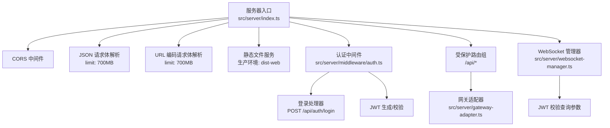
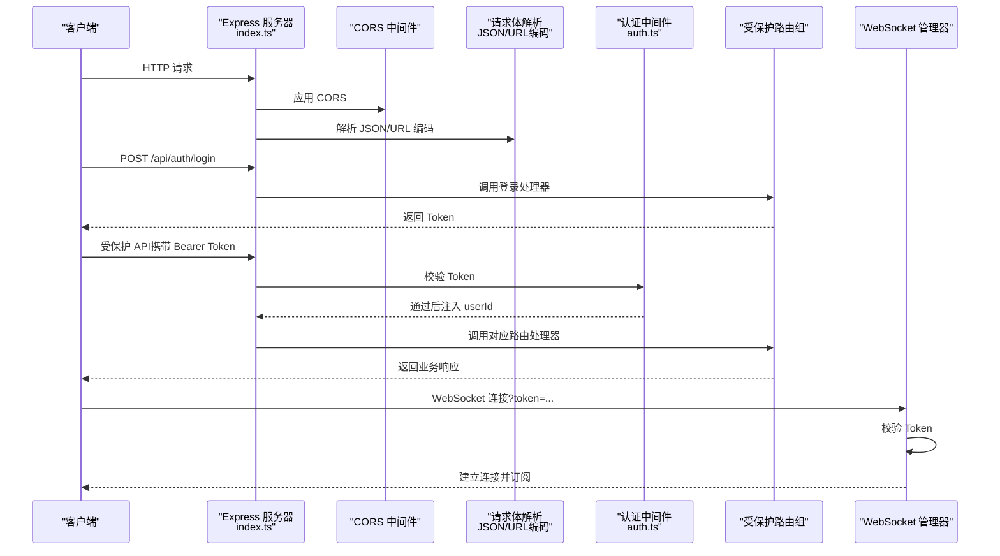
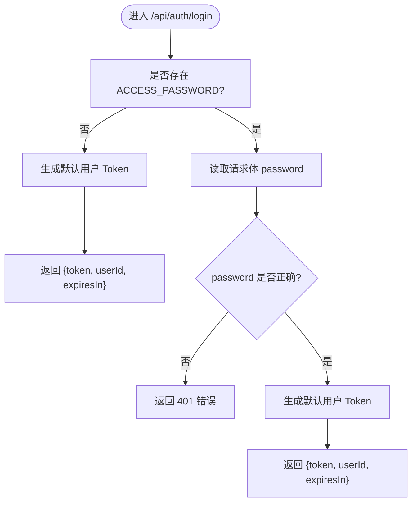
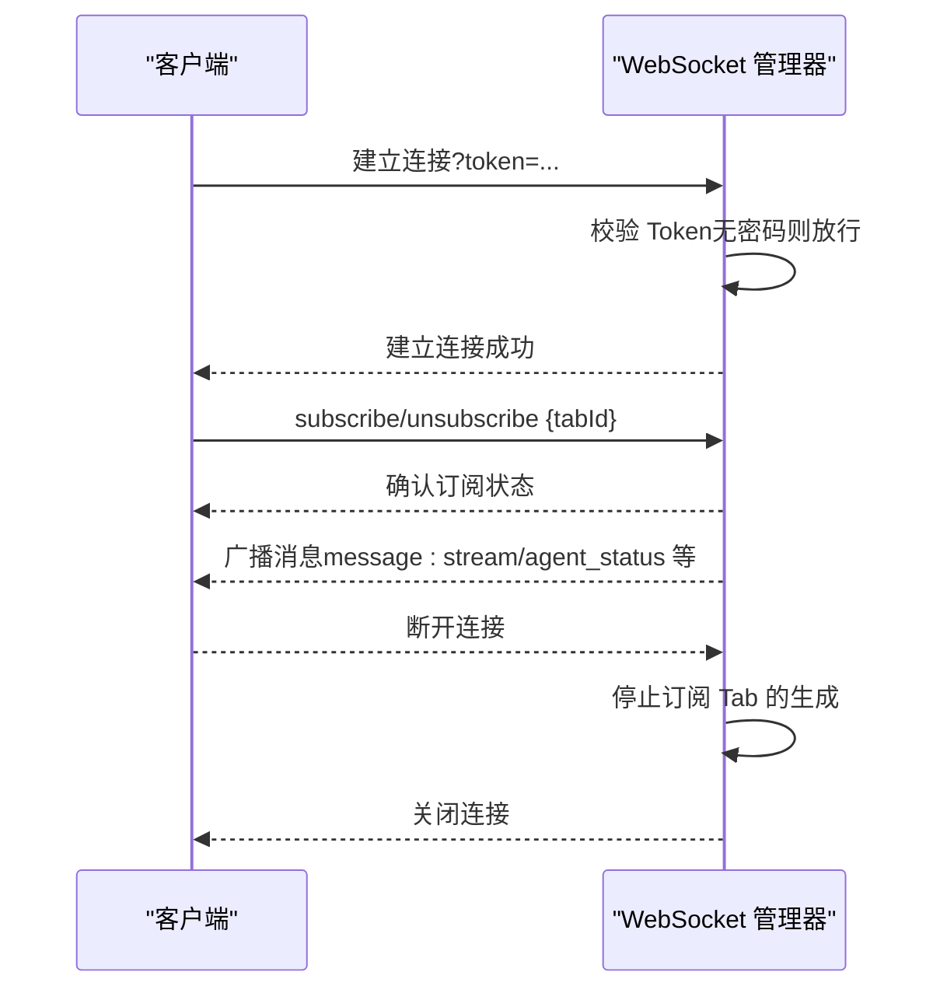
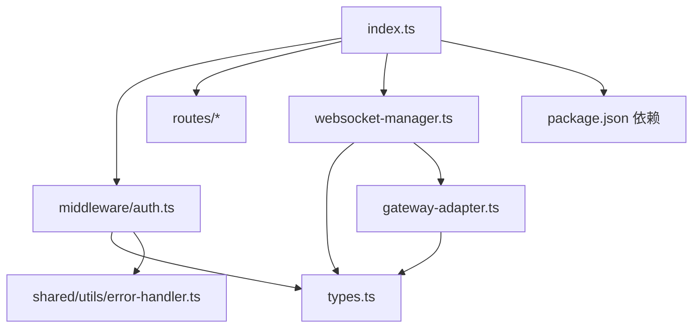

# 中间件系统

<cite>
**本文引用的文件**
- [src/server/index.ts](file://src/server/index.ts)
- [src/server/middleware/auth.ts](file://src/server/middleware/auth.ts)
- [src/server/types.ts](file://src/server/types.ts)
- [src/server/websocket-manager.ts](file://src/server/websocket-manager.ts)
- [src/server/gateway-adapter.ts](file://src/server/gateway-adapter.ts)
- [src/shared/utils/error-handler.ts](file://src/shared/utils/error-handler.ts)
- [src/main/config/timeouts.ts](file://src/main/config/timeouts.ts)
- [package.json](file://package.json)
</cite>

## 目录
1. [简介](#简介)
2. [项目结构](#项目结构)
3. [核心组件](#核心组件)
4. [架构总览](#架构总览)
5. [详细组件分析](#详细组件分析)
6. [依赖关系分析](#依赖关系分析)
7. [性能考量](#性能考量)
8. [故障排查指南](#故障排查指南)
9. [结论](#结论)
10. [附录](#附录)

## 简介
本文件面向 DeepBot 的中间件系统，重点覆盖以下方面：
- 认证中间件：登录验证、Token 生成与校验流程
- CORS 配置与跨域策略
- JSON 与 URL 编码请求体解析的配置与限制
- 静态文件服务与生产环境部署注意事项
- 中间件使用示例与自定义中间件开发指南
- 安全策略、性能优化与错误处理最佳实践

## 项目结构
服务器入口负责初始化 Express、CORS、请求体解析、静态文件服务、路由挂载与错误处理；认证中间件与登录处理器位于独立模块；WebSocket 管理器负责连接鉴权、订阅管理与消息广播；类型定义集中于 types；错误处理工具提供统一错误提取。

图表来源
- [src/server/index.ts:62-108](file://src/server/index.ts#L62-L108)
- [src/server/middleware/auth.ts:22-90](file://src/server/middleware/auth.ts#L22-L90)
- [src/server/websocket-manager.ts:43-125](file://src/server/websocket-manager.ts#L43-L125)
- [src/server/gateway-adapter.ts:45-58](file://src/server/gateway-adapter.ts#L45-L58)

章节来源
- [src/server/index.ts:62-108](file://src/server/index.ts#L62-L108)
- [src/server/middleware/auth.ts:22-90](file://src/server/middleware/auth.ts#L22-L90)
- [src/server/websocket-manager.ts:43-125](file://src/server/websocket-manager.ts#L43-L125)
- [src/server/gateway-adapter.ts:45-58](file://src/server/gateway-adapter.ts#L45-L58)

## 核心组件
- 认证中间件与登录处理器：基于环境变量 ACCESS_PASSWORD 决定是否启用密码保护；使用 JWT 作为 Token 机制；提供登录接口生成 Token。
- CORS：默认启用 cors()，允许跨域请求。
- 请求体解析：express.json({ limit: '700mb' }) 与 express.urlencoded({ extended: true, limit: '700mb' }) 支持大文件上传场景。
- 静态文件服务：生产环境将 dist-web 作为静态资源根目录；SPA 回退路由在生产环境生效。
- WebSocket 管理器：在连接建立时从查询参数中获取 Token 并校验；支持订阅/取消订阅 Tab 消息；断开连接时停止对应 Tab 的生成任务。
- 类型与错误处理：统一的错误消息提取工具；认证请求扩展类型定义；WebSocket 消息类型定义。

章节来源
- [src/server/index.ts:62-108](file://src/server/index.ts#L62-L108)
- [src/server/middleware/auth.ts:22-90](file://src/server/middleware/auth.ts#L22-L90)
- [src/server/websocket-manager.ts:43-125](file://src/server/websocket-manager.ts#L43-L125)
- [src/server/types.ts:13-40](file://src/server/types.ts#L13-L40)
- [src/shared/utils/error-handler.ts:8-50](file://src/shared/utils/error-handler.ts#L8-L50)

## 架构总览
下图展示服务器启动、中间件链路、路由与 WebSocket 的交互关系。

图表来源
- [src/server/index.ts:62-108](file://src/server/index.ts#L62-L108)
- [src/server/middleware/auth.ts:22-90](file://src/server/middleware/auth.ts#L22-L90)
- [src/server/websocket-manager.ts:73-125](file://src/server/websocket-manager.ts#L73-L125)

## 详细组件分析

### 认证中间件与登录流程
- 环境变量
  - ACCESS_PASSWORD：若未设置，则视为“无密码模式”，直接放行并注入默认用户 ID。
  - JWT_SECRET：用于签名与校验 Token，默认值仅用于开发，生产需替换。
  - JWT_EXPIRES_IN：Token 有效期（示例为 30 天）。
- 认证中间件行为
  - 若未设置 ACCESS_PASSWORD：直接将 userId 设为默认值并放行。
  - 若设置密码：要求请求头 Authorization: Bearer <token>；校验失败返回 401。
- 登录处理器
  - 无 ACCESS_PASSWORD：直接签发默认用户 Token。
  - 有 ACCESS_PASSWORD：校验请求体 password 与 ACCESS_PASSWORD 是否一致，一致则签发 Token。
  - 异常统一通过错误处理工具提取消息并返回 500。
- Token 生成与校验
  - 生成：使用 JWT 签名，载荷包含 userId，过期时间由配置决定。
  - 校验：使用相同密钥与过期策略进行验证。

图表来源
- [src/server/middleware/auth.ts:57-90](file://src/server/middleware/auth.ts#L57-L90)

章节来源
- [src/server/middleware/auth.ts:13-15](file://src/server/middleware/auth.ts#L13-L15)
- [src/server/middleware/auth.ts:22-45](file://src/server/middleware/auth.ts#L22-L45)
- [src/server/middleware/auth.ts:57-90](file://src/server/middleware/auth.ts#L57-L90)
- [src/server/types.ts:13-40](file://src/server/types.ts#L13-L40)
- [src/shared/utils/error-handler.ts:8-13](file://src/shared/utils/error-handler.ts#L8-L13)

### CORS 配置与跨域策略
- 默认启用 cors()，允许浏览器跨域访问 API。
- 生产环境建议结合反向代理（如 Nginx）进一步收紧策略，例如：
  - 指定允许的源（Origin）
  - 显式允许的方法与头字段
  - 控制凭据（credentials）传递
- 在本仓库中未看到显式的 cors 配置对象，因此默认行为遵循 cors() 的宽松策略。

章节来源
- [src/server/index.ts:63](file://src/server/index.ts#L63)

### 请求体解析配置与限制
- JSON 解析：express.json({ limit: '700mb' })
- URL 编码解析：express.urlencoded({ extended: true, limit: '700mb' })
- 用途：支持大文件上传（图片约 5MB、文件约 500MB，base64 编码后约 667MB），满足前端上传场景。
- 安全建议：
  - 生产环境建议根据实际业务调整 limit，并配合速率限制与文件类型白名单。
  - 对于文件上传，建议在路由层增加更细粒度的校验（大小、类型、签名等）。

章节来源
- [src/server/index.ts:64-65](file://src/server/index.ts#L64-L65)

### 静态文件服务与生产部署
- 开启条件：NODE_ENV === 'production'
- 静态目录：dist-web（编译后的前端产物）
- SPA 回退：生产环境下，除以 /api 开头的路由外，其他请求均返回 index.html，便于前端路由运行。
- 部署建议：
  - 将 dist-web 与后端二进制打包至同一镜像或静态托管平台。
  - 反向代理统一暴露端口，开启 HTTPS 与缓存策略。
  - 确保 /api 与静态资源路径不冲突。

章节来源
- [src/server/index.ts:67-73](file://src/server/index.ts#L67-L73)
- [src/server/index.ts:97-102](file://src/server/index.ts#L97-L102)

### WebSocket 认证与订阅管理
- 连接鉴权：从 URL 查询参数 token 获取并校验 JWT；未设置 ACCESS_PASSWORD 时直接放行。
- 连接生命周期：
  - 建立连接后，若存在旧连接且同一用户登录，旧连接会被踢出（4001）。
  - 心跳：客户端发送 ping，服务端返回 pong。
  - 订阅管理：支持 subscribe/unsubscribe 指定 tabId，仅向订阅者广播对应消息。
- 断开处理：断开连接时，停止该客户端订阅的所有 Tab 的生成任务，避免资源泄漏。
- 消息广播：根据订阅集合精准广播，减少无效传输。

图表来源
- [src/server/websocket-manager.ts:73-125](file://src/server/websocket-manager.ts#L73-L125)
- [src/server/websocket-manager.ts:177-222](file://src/server/websocket-manager.ts#L177-L222)
- [src/server/websocket-manager.ts:366-372](file://src/server/websocket-manager.ts#L366-L372)

章节来源
- [src/server/websocket-manager.ts:20-27](file://src/server/websocket-manager.ts#L20-L27)
- [src/server/websocket-manager.ts:73-125](file://src/server/websocket-manager.ts#L73-L125)
- [src/server/websocket-manager.ts:177-222](file://src/server/websocket-manager.ts#L177-L222)
- [src/server/websocket-manager.ts:366-372](file://src/server/websocket-manager.ts#L366-L372)

### 类型与错误处理
- 类型定义
  - AuthRequest：扩展 Express Request，新增 userId 字段。
  - TokenPayload：JWT 载荷结构。
  - 登录请求/响应：LoginRequest/LoginResponse。
  - WebSocket 消息类型：ClientMessage/ServerMessage。
- 错误处理
  - getErrorMessage：从 Error 或任意值提取字符串错误消息。
  - 统一错误响应：createErrorResponse。
  - Express 错误中间件：捕获异常并返回 500。

章节来源
- [src/server/types.ts:13-40](file://src/server/types.ts#L13-L40)
- [src/shared/utils/error-handler.ts:8-50](file://src/shared/utils/error-handler.ts#L8-L50)
- [src/server/index.ts:104-108](file://src/server/index.ts#L104-L108)

## 依赖关系分析
- 服务器入口依赖：
  - cors、express、ws、jsonwebtoken、网关适配器与各路由工厂。
- 认证中间件依赖：
  - jsonwebtoken、错误处理工具、类型定义。
- WebSocket 管理器依赖：
  - ws、jsonwebtoken、类型定义、网关适配器、ID 生成器、超时配置。
- 网关适配器：
  - 作为 WebSocket 事件与后端 Gateway 的桥接层，负责消息转换与能力暴露。

图表来源
- [src/server/index.ts:19-26](file://src/server/index.ts#L19-L26)
- [src/server/middleware/auth.ts:7-10](file://src/server/middleware/auth.ts#L7-L10)
- [src/server/websocket-manager.ts:11-18](file://src/server/websocket-manager.ts#L11-L18)
- [src/server/gateway-adapter.ts:7-11](file://src/server/gateway-adapter.ts#L7-L11)
- [package.json:59-76](file://package.json#L59-L76)

章节来源
- [src/server/index.ts:19-26](file://src/server/index.ts#L19-L26)
- [src/server/middleware/auth.ts:7-10](file://src/server/middleware/auth.ts#L7-L10)
- [src/server/websocket-manager.ts:11-18](file://src/server/websocket-manager.ts#L11-L18)
- [src/server/gateway-adapter.ts:7-11](file://src/server/gateway-adapter.ts#L7-L11)
- [package.json:59-76](file://package.json#L59-L76)

## 性能考量
- 请求体大小限制：JSON/URL 编码解析上限为 700MB，适合大文件上传；建议结合业务场景评估并设置更严格的限制。
- WebSocket 广播：按订阅集合广播，避免对未订阅客户端的无效传输。
- 连接管理：同一用户多设备登录时，旧连接被踢出，避免资源浪费与状态混乱。
- 超时配置：提供统一的超时常量（如消息超时、会话清理、优雅关闭等），可通过环境变量覆盖。
- 静态资源：生产环境启用静态文件服务与 SPA 回退，减少前端二次请求。

章节来源
- [src/server/index.ts:64-65](file://src/server/index.ts#L64-L65)
- [src/server/websocket-manager.ts:52-68](file://src/server/websocket-manager.ts#L52-L68)
- [src/main/config/timeouts.ts:9-53](file://src/main/config/timeouts.ts#L9-L53)

## 故障排查指南
- 登录 401
  - 确认 ACCESS_PASSWORD 是否正确设置。
  - 确认请求体包含 password 字段。
- Token 无效或过期
  - 检查 JWT_SECRET 是否与签发时一致。
  - 确认 Authorization 头格式为 Bearer <token>。
- CORS 问题
  - 默认允许跨域，若前端无法访问，检查反向代理或浏览器同源策略。
- 请求体过大
  - 确认 JSON/URL 编码解析的 limit 设置是否足够。
- WebSocket 无法连接
  - 确认查询参数 token 是否正确传递。
  - 检查服务端日志中关于 Token 校验与连接建立的信息。
- 服务器异常
  - 查看统一错误中间件返回的 500 错误与日志输出。

章节来源
- [src/server/middleware/auth.ts:36-44](file://src/server/middleware/auth.ts#L36-L44)
- [src/server/websocket-manager.ts:98-124](file://src/server/websocket-manager.ts#L98-L124)
- [src/server/index.ts:104-108](file://src/server/index.ts#L104-L108)

## 结论
DeepBot 的中间件系统围绕“简单易用”与“可扩展性”设计：
- 认证中间件与登录处理器提供了灵活的密码保护与 Token 策略。
- CORS、请求体解析与静态文件服务满足现代 Web 场景需求。
- WebSocket 管理器在连接鉴权、订阅与广播方面具备良好扩展性。
- 建议在生产环境中强化安全配置（CORS 白名单、密钥轮换、限流与文件校验），并结合监控与日志体系持续优化。

## 附录

### 使用示例与最佳实践
- 登录获取 Token
  - POST /api/auth/login，请求体包含 password（若启用 ACCESS_PASSWORD）。
  - 成功后获得 token、userId 与 expiresIn。
- 调用受保护 API
  - 在请求头添加 Authorization: Bearer <token>。
- WebSocket 连接
  - ws://host/ws?token=<your-jwt>
  - 发送 {type: 'subscribe', tabId} 订阅消息，发送 {type: 'unsubscribe', tabId} 取消订阅。
- 自定义中间件开发
  - 参考认证中间件的结构：读取环境变量、校验请求、注入上下文、调用 next 或返回错误。
  - 在服务器入口 app.use(...) 中按顺序挂载，注意受保护路由前缀与放行规则。

章节来源
- [src/server/index.ts:85-95](file://src/server/index.ts#L85-L95)
- [src/server/middleware/auth.ts:22-45](file://src/server/middleware/auth.ts#L22-L45)
- [src/server/websocket-manager.ts:73-125](file://src/server/websocket-manager.ts#L73-L125)