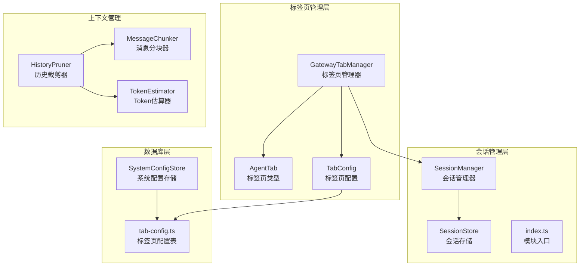
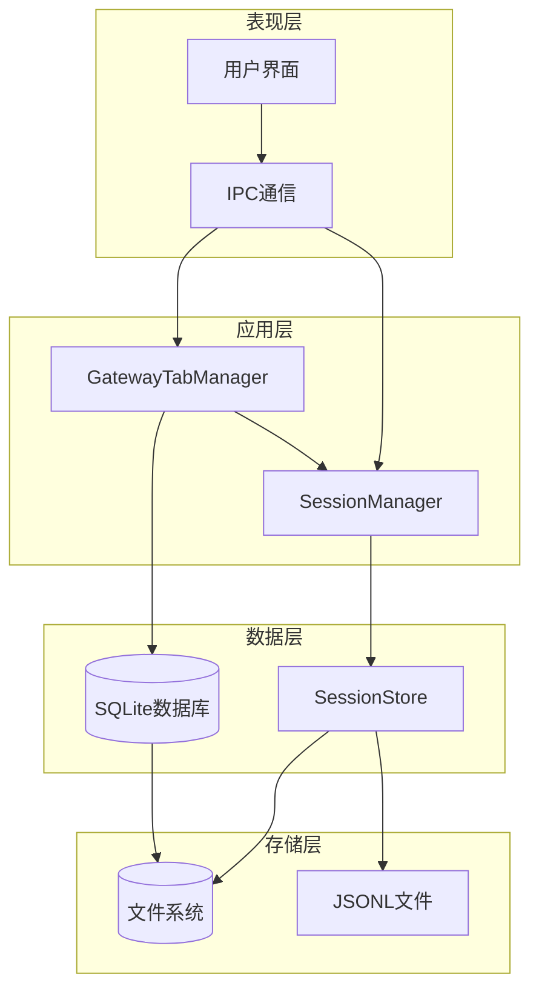
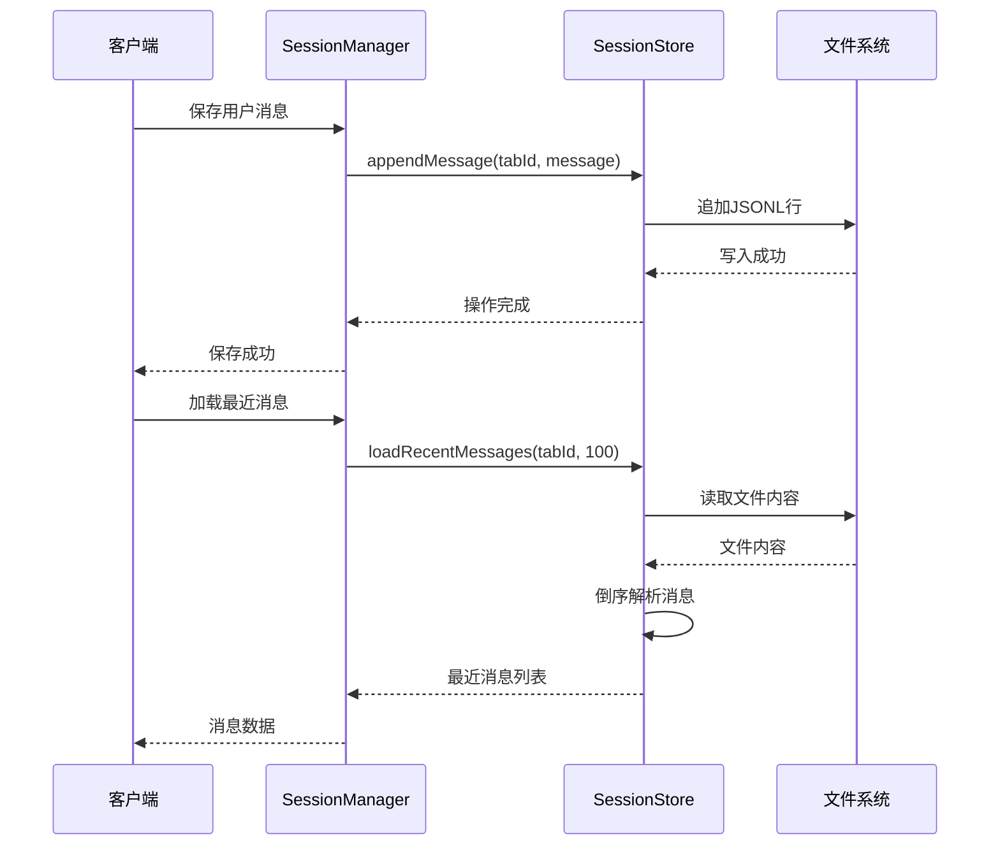
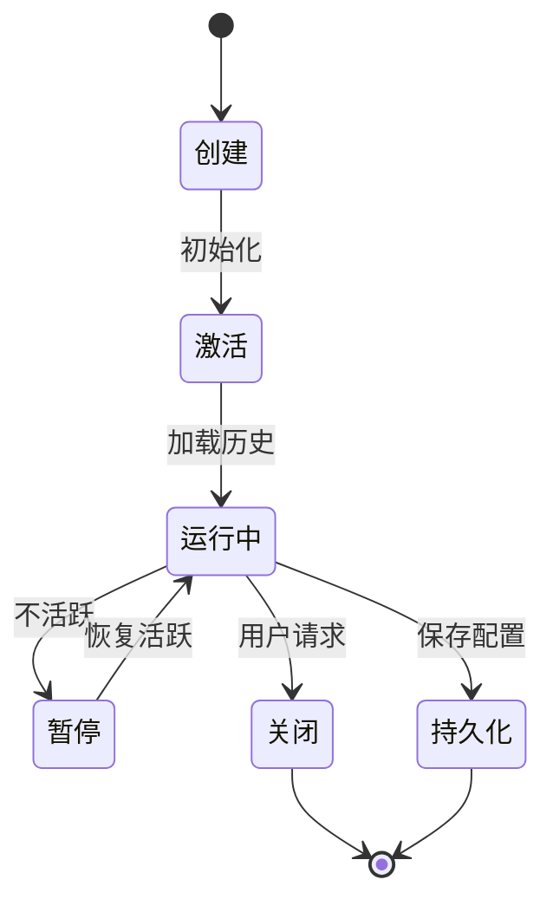
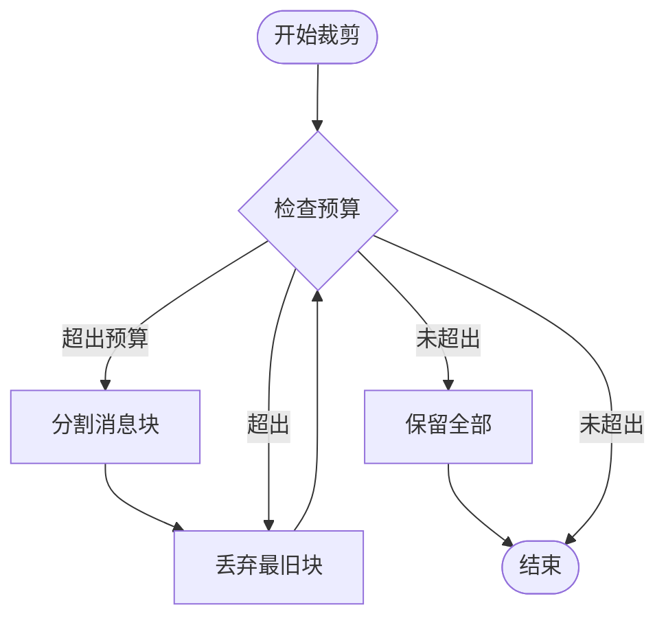
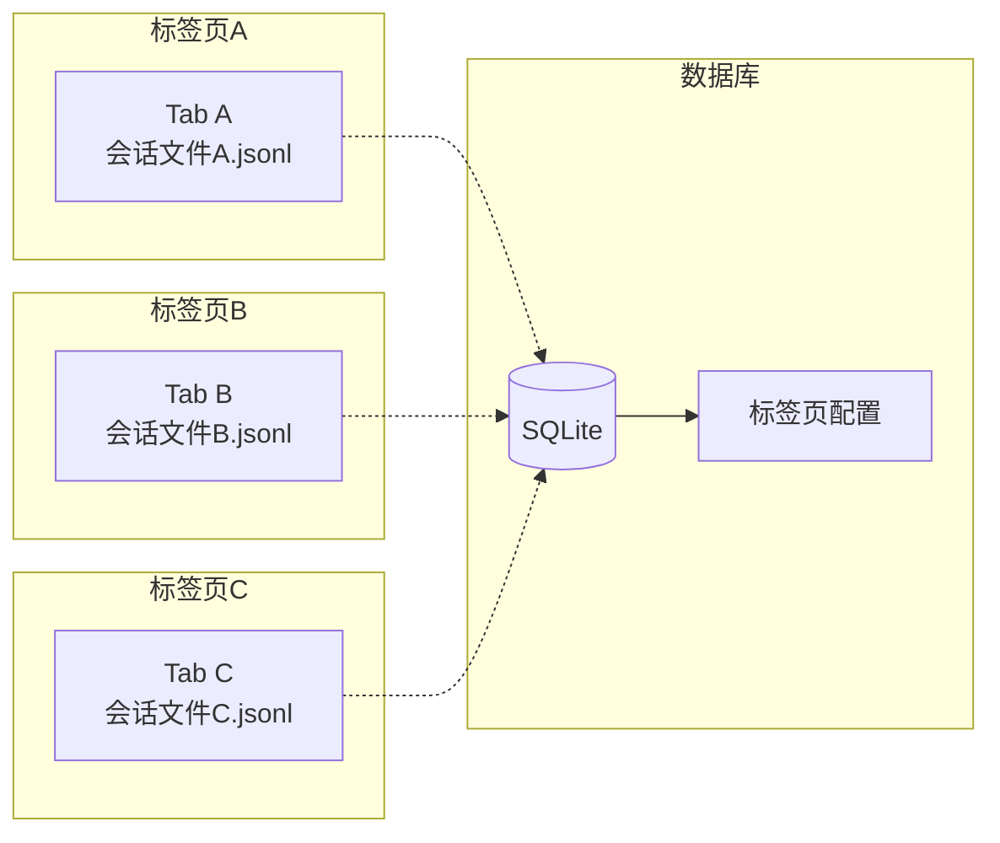
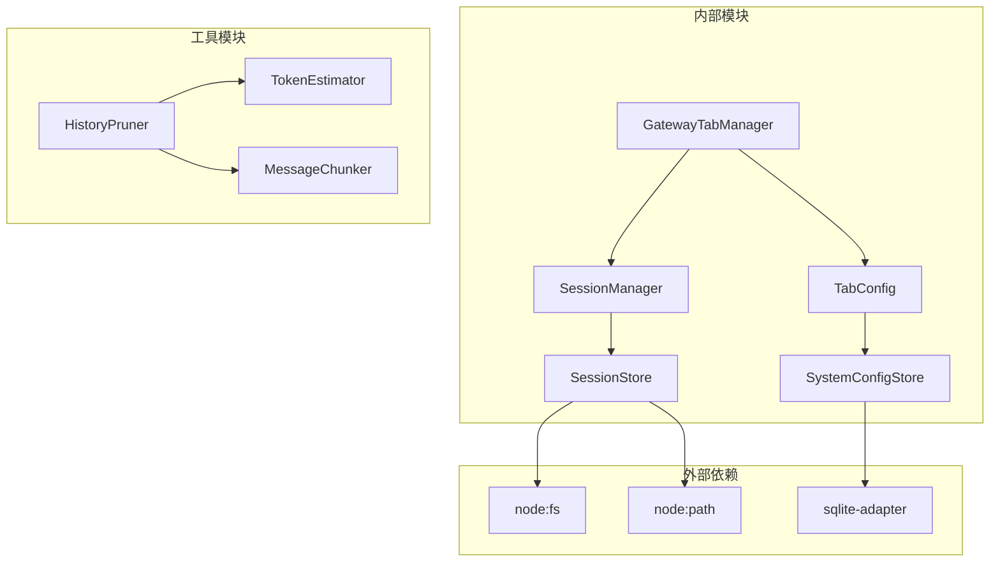

# 会话和标签页管理

<cite>
**本文档引用的文件**
- [src/main/session/index.ts](file://src/main/session/index.ts)
- [src/main/session/session-manager.ts](file://src/main/session/session-manager.ts)
- [src/main/session/session-store.ts](file://src/main/session/session-store.ts)
- [src/main/gateway-tab.ts](file://src/main/gateway-tab.ts)
- [src/main/database/tab-config.ts](file://src/main/database/tab-config.ts)
- [src/main/database/system-config-store.ts](file://src/main/database/system-config-store.ts)
- [src/main/context/history-pruner.ts](file://src/main/context/history-pruner.ts)
- [src/main/utils/message-chunker.ts](file://src/main/utils/message-chunker.ts)
- [src/main/utils/token-estimator.ts](file://src/main/utils/token-estimator.ts)
- [src/types/agent-tab.ts](file://src/types/agent-tab.ts)
</cite>

## 目录
1. [简介](#简介)
2. [项目结构](#项目结构)
3. [核心组件](#核心组件)
4. [架构概览](#架构概览)
5. [详细组件分析](#详细组件分析)
6. [依赖关系分析](#依赖关系分析)
7. [性能考虑](#性能考虑)
8. [故障排除指南](#故障排除指南)
9. [结论](#结论)

## 简介

DeepBot 的会话和标签页管理系统是一个完整的多标签页对话管理解决方案，支持实时对话、历史记录持久化、多标签页并发会话以及智能的历史消息管理。该系统采用模块化设计，将会话管理、标签页生命周期管理和历史消息裁剪等功能分离，实现了高内聚低耦合的架构。

系统的核心特性包括：
- 基于 JSONL 格式的高效会话存储
- 多标签页并发会话管理
- 智能历史消息裁剪和优化
- 完整的会话状态持久化和恢复机制
- 高性能的倒序读取算法
- 内存友好的消息管理策略

## 项目结构

会话和标签页管理系统的文件组织遵循功能模块化原则：

**图表来源**
- [src/main/session/index.ts:1-8](file://src/main/session/index.ts#L1-L8)
- [src/main/gateway-tab.ts:26-40](file://src/main/gateway-tab.ts#L26-L40)
- [src/main/database/tab-config.ts:46-64](file://src/main/database/tab-config.ts#L46-L64)

**章节来源**
- [src/main/session/index.ts:1-8](file://src/main/session/index.ts#L1-L8)
- [src/main/session/session-manager.ts:1-195](file://src/main/session/session-manager.ts#L1-L195)
- [src/main/session/session-store.ts:1-323](file://src/main/session/session-store.ts#L1-L323)

## 核心组件

### 会话管理器 (SessionManager)

SessionManager 是会话管理的核心控制器，负责协调会话存储和提供对外接口：

- **职责**：管理 SessionStore 实例、提供消息持久化和加载接口、管理上下文消息
- **配置**：MAX_UI_ROUNDS=100（UI显示最多100轮）、MAX_CONTEXT_ROUNDS=10（Agent上下文最多10轮）
- **接口**：保存用户消息、AI响应、系统消息；加载UI消息和上下文消息；清空会话、检查会话存在性

### 会话存储 (SessionStore)

SessionStore 实现了基于JSONL格式的高效会话存储：

- **存储格式**：每个标签页对应一个 .jsonl 文件，每行一条JSON消息
- **性能优化**：倒序读取算法，只读取需要的消息数量
- **功能**：消息追加、批量追加、最近消息加载、会话清空、存在性检查

### 标签页管理器 (GatewayTabManager)

GatewayTabManager 管理标签页的完整生命周期：

- **创建**：生成唯一Tab ID、确定Tab类型、生成默认标题
- **持久化**：SQLite数据库存储标签页配置
- **生命周期**：加载、更新、关闭标签页
- **并发支持**：多标签页并发会话管理

**章节来源**
- [src/main/session/session-manager.ts:17-195](file://src/main/session/session-manager.ts#L17-L195)
- [src/main/session/session-store.ts:46-323](file://src/main/session/session-store.ts#L46-L323)
- [src/main/gateway-tab.ts:26-795](file://src/main/gateway-tab.ts#L26-L795)

## 架构概览

系统采用分层架构设计，各层职责明确：

**图表来源**
- [src/main/gateway-tab.ts:45-61](file://src/main/gateway-tab.ts#L45-L61)
- [src/main/session/session-manager.ts:24-26](file://src/main/session/session-manager.ts#L24-L26)
- [src/main/session/session-store.ts:49-51](file://src/main/session/session-store.ts#L49-L51)

## 详细组件分析

### 会话存储机制

会话存储采用JSONL（JSON Lines）格式，每个标签页一个文件：

**图表来源**
- [src/main/session/session-manager.ts:38-47](file://src/main/session/session-manager.ts#L38-L47)
- [src/main/session/session-store.ts:75-85](file://src/main/session/session-store.ts#L75-L85)
- [src/main/session/session-store.ts:146-165](file://src/main/session/session-store.ts#L146-L165)

#### 性能优化策略

1. **倒序读取算法**：从文件末尾开始读取，只读取需要的消息数量
2. **流式处理**：避免一次性加载整个文件到内存
3. **消息分块**：支持按轮次分块处理，提高查询效率

**章节来源**
- [src/main/session/session-store.ts:179-217](file://src/main/session/session-store.ts#L179-L217)
- [src/main/session/session-store.ts:299-320](file://src/main/session/session-store.ts#L299-L320)

### 标签页生命周期管理

标签页管理器提供完整的生命周期管理：

**图表来源**
- [src/main/gateway-tab.ts:492-611](file://src/main/gateway-tab.ts#L492-L611)
- [src/main/gateway-tab.ts:687-761](file://src/main/gateway-tab.ts#L687-L761)

#### 标签页类型和配置

标签页支持多种类型和配置选项：

| 类型 | 描述 | 特殊属性 |
|------|------|----------|
| normal | 普通对话标签页 | 标准消息处理 |
| connector | 连接器标签页 | 外部连接器集成 |
| scheduled_task | 定时任务标签页 | 自动任务执行 |

**章节来源**
- [src/main/gateway-tab.ts:492-611](file://src/main/gateway-tab.ts#L492-L611)
- [src/types/agent-tab.ts:23-46](file://src/types/agent-tab.ts#L23-L46)

### 历史消息管理

系统提供多种历史消息管理策略：

**图表来源**
- [src/main/context/history-pruner.ts:51-88](file://src/main/context/history-pruner.ts#L51-L88)
- [src/main/context/history-pruner.ts:195-298](file://src/main/context/history-pruner.ts#L195-L298)

#### 裁剪策略

1. **按上下文份额裁剪**：根据上下文限制计算可使用的token份额
2. **智能裁剪**：保护重要消息（第一条用户消息和最后N条消息）
3. **简单裁剪**：直接丢弃最旧的消息

**章节来源**
- [src/main/context/history-pruner.ts:46-88](file://src/main/context/history-pruner.ts#L46-L88)
- [src/main/context/history-pruner.ts:195-298](file://src/main/context/history-pruner.ts#L195-L298)

### 多标签页并发会话

系统支持多标签页并发会话，每个标签页独立管理：

**图表来源**
- [src/main/gateway-tab.ts:575-605](file://src/main/gateway-tab.ts#L575-L605)
- [src/main/database/tab-config.ts:69-93](file://src/main/database/tab-config.ts#L69-L93)

#### 内存管理策略

1. **延迟加载**：标签页历史消息按需加载
2. **缓存控制**：UI显示和上下文消息分别设置不同的缓存限制
3. **资源清理**：关闭标签页时清理相关资源

**章节来源**
- [src/main/gateway-tab.ts:723-746](file://src/main/gateway-tab.ts#L723-L746)
- [src/main/session/session-manager.ts:21-22](file://src/main/session/session-manager.ts#L21-L22)

## 依赖关系分析

系统采用模块化设计，各组件之间的依赖关系清晰：

**图表来源**
- [src/main/session/session-manager.ts:10-12](file://src/main/session/session-manager.ts#L10-L12)
- [src/main/gateway-tab.ts:11-21](file://src/main/gateway-tab.ts#L11-L21)
- [src/main/database/system-config-store.ts:11-15](file://src/main/database/system-config-store.ts#L11-L15)

### 关键依赖链

1. **会话管理依赖链**：SessionManager → SessionStore → 文件系统
2. **标签页管理依赖链**：GatewayTabManager → SessionManager → SessionStore
3. **配置管理依赖链**：SystemConfigStore → SQLite数据库

**章节来源**
- [src/main/session/session-manager.ts:10-12](file://src/main/session/session-manager.ts#L10-L12)
- [src/main/gateway-tab.ts:11-21](file://src/main/gateway-tab.ts#L11-L21)
- [src/main/database/system-config-store.ts:37-77](file://src/main/database/system-config-store.ts#L37-L77)

## 性能考虑

### 存储性能优化

1. **JSONL格式优势**：
   - 逐行存储，支持随机访问
   - 轻量级格式，解析开销小
   - 便于增量更新

2. **倒序读取算法**：
   - 时间复杂度：O(n)，其中n为需要读取的消息数
   - 空间复杂度：O(1)，只缓存必要的消息
   - 避免全文件扫描

3. **消息分块策略**：
   - 按轮次分块，每轮包含用户消息和AI响应
   - 支持部分轮次加载，提高响应速度

### 内存管理策略

1. **按需加载**：
   - UI显示：最多100轮消息
   - Agent上下文：最多10轮消息
   - 避免一次性加载所有历史

2. **资源清理**：
   - 关闭标签页时清理内存
   - 定期清理非持久化标签页
   - 控制文件句柄数量

3. **缓存机制**：
   - 最近使用消息缓存
   - 配置信息缓存
   - 避免重复数据库查询

### 并发处理

1. **异步操作**：
   - 所有文件操作都是异步的
   - 避免阻塞主线程
   - 支持多标签页并发

2. **锁机制**：
   - 文件写入使用原子操作
   - 避免数据竞争
   - 支持崩溃恢复

## 故障排除指南

### 常见问题及解决方案

#### 会话文件损坏

**症状**：加载历史消息时报错，返回空列表

**原因**：
- JSONL文件格式错误
- 文件被意外修改
- 磁盘空间不足

**解决方案**：
1. 检查文件完整性
2. 重新创建会话文件
3. 清理磁盘空间

#### 标签页配置丢失

**症状**：重启后标签页配置消失

**原因**：
- SQLite数据库损坏
- 配置表初始化失败
- 权限问题

**解决方案**：
1. 检查数据库文件权限
2. 重新初始化配置表
3. 恢复备份数据

#### 内存泄漏

**症状**：长时间运行后内存占用持续增长

**原因**：
- 标签页历史消息未及时清理
- 事件监听器未正确移除
- 缓存数据未定期清理

**解决方案**：
1. 实施定期清理机制
2. 确保事件监听器正确移除
3. 监控内存使用情况

### 调试工具

系统提供多种调试工具：

1. **日志系统**：详细的错误日志和调试信息
2. **状态监控**：实时监控系统状态
3. **性能分析**：分析存储和内存使用情况

**章节来源**
- [src/main/session/session-store.ts:82-84](file://src/main/session/session-store.ts#L82-L84)
- [src/main/gateway-tab.ts:485-486](file://src/main/gateway-tab.ts#L485-L486)

## 结论

DeepBot 的会话和标签页管理系统通过模块化设计实现了高效、可靠的多标签页对话管理。系统的主要优势包括：

1. **高性能存储**：基于JSONL格式的高效存储和倒序读取算法
2. **完整的生命周期管理**：从创建到销毁的完整标签页生命周期
3. **智能历史管理**：多种裁剪策略适应不同场景需求
4. **内存友好**：按需加载和资源清理机制
5. **并发支持**：多标签页并发会话管理

该系统为DeepBot提供了坚实的基础，支持复杂的多标签页应用场景，同时保持了良好的性能和可维护性。通过持续的优化和改进，系统能够满足不断增长的用户需求。