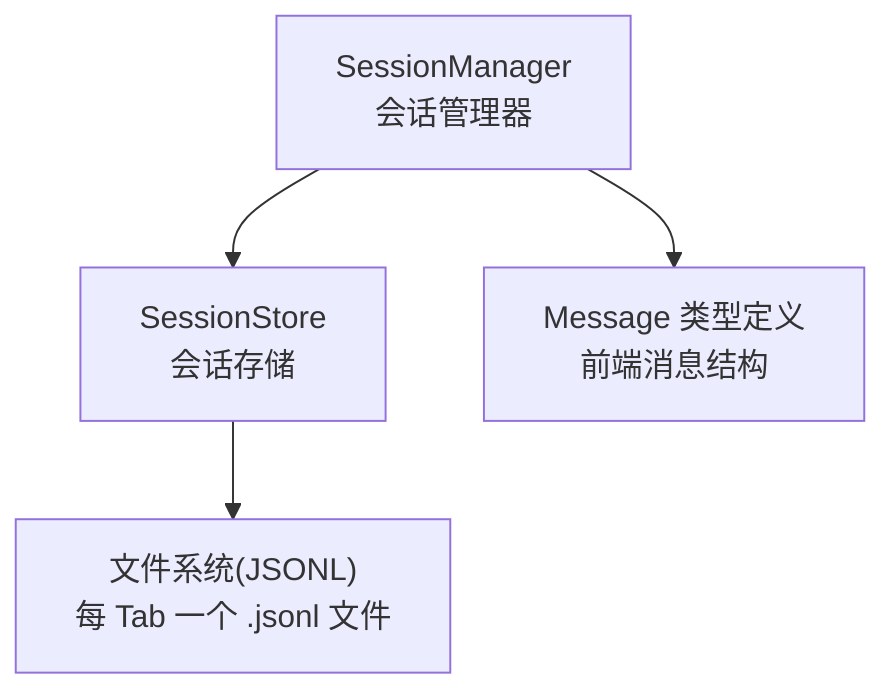
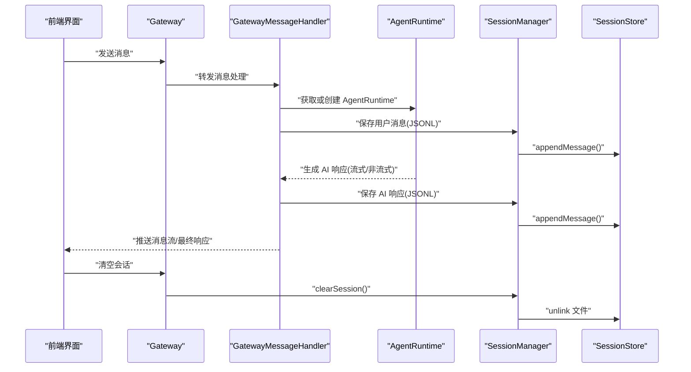
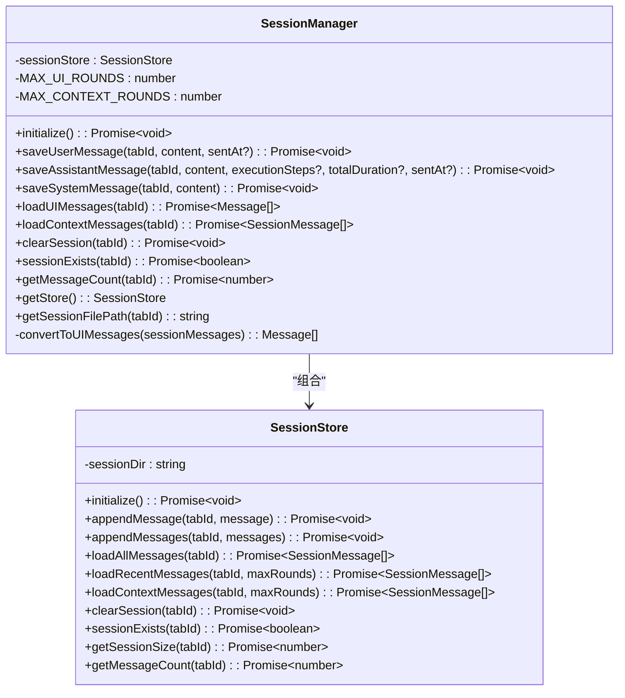
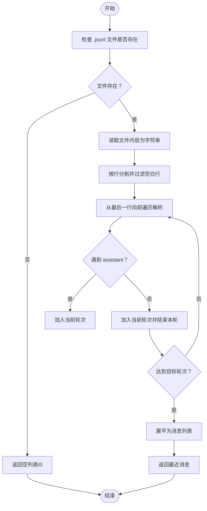
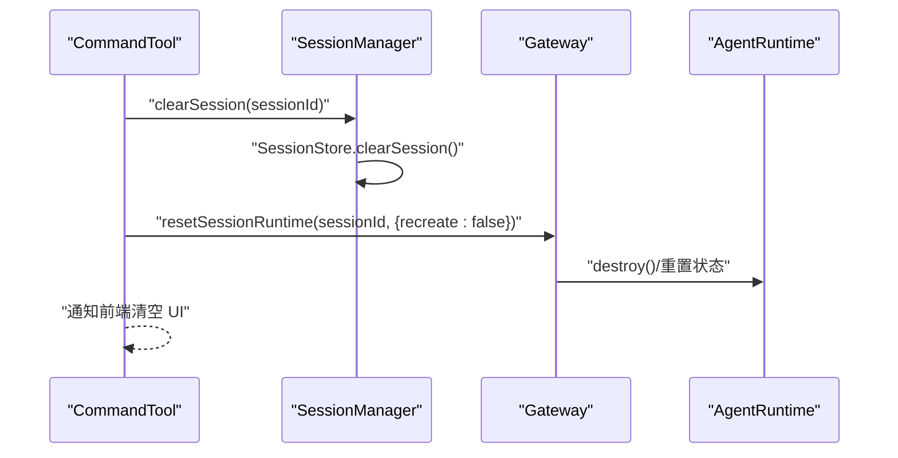
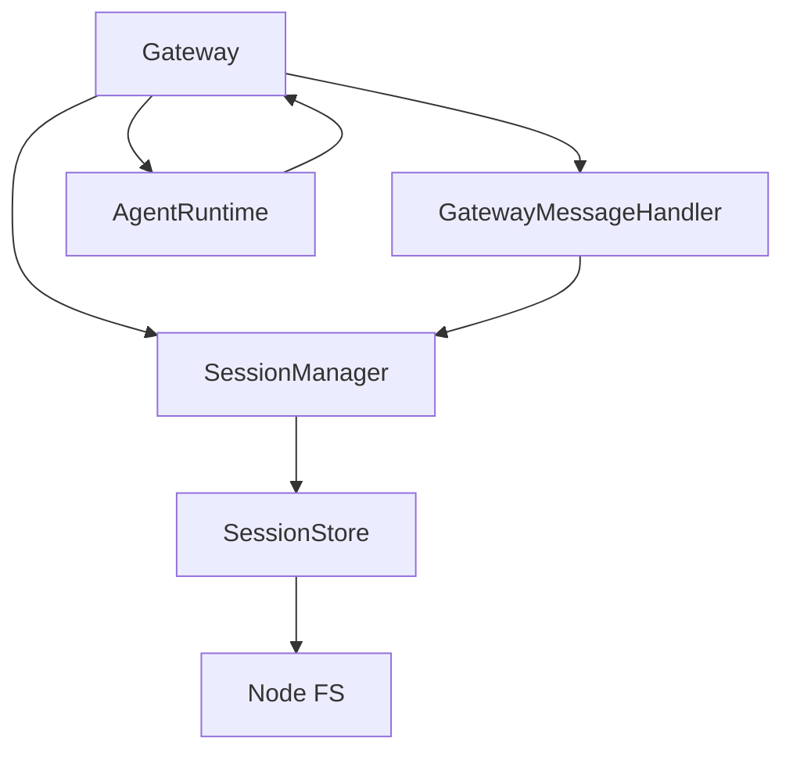

# 会话管理系统

<cite>
**本文引用的文件**
- [src/main/session/session-manager.ts](file://src/main/session/session-manager.ts)
- [src/main/session/session-store.ts](file://src/main/session/session-store.ts)
- [src/main/session/index.ts](file://src/main/session/index.ts)
- [src/types/message.ts](file://src/types/message.ts)
- [src/main/context/history-pruner.ts](file://src/main/context/history-pruner.ts)
- [src/main/gateway.ts](file://src/main/gateway.ts)
- [src/main/gateway-message.ts](file://src/main/gateway-message.ts)
- [src/main/gateway-tab.ts](file://src/main/gateway-tab.ts)
- [src/main/tools/command-tool.ts](file://src/main/tools/command-tool.ts)
- [src/main/agent-runtime/agent-runtime.ts](file://src/main/agent-runtime/agent-runtime.ts)
- [src/main/context/context-manager.ts](file://src/main/context/context-manager.ts)
- [src/main/config/constants.ts](file://src/main/config/constants.ts)
</cite>

## 目录
1. [简介](#简介)
2. [项目结构](#项目结构)
3. [核心组件](#核心组件)
4. [架构总览](#架构总览)
5. [详细组件分析](#详细组件分析)
6. [依赖关系分析](#依赖关系分析)
7. [性能考量](#性能考量)
8. [故障排查指南](#故障排查指南)
9. [结论](#结论)
10. [附录](#附录)

## 简介
本文件面向 史丽慧小助理 的会话管理系统，围绕 SessionManager 类的设计与实现进行深入解析，覆盖以下主题：
- 会话存储机制：以 JSONL 文本格式持久化消息，支持用户消息、AI 响应与系统消息三类。
- 消息序列化与反序列化流程：逐条写入与按轮次解析，兼顾性能与容错。
- 不同消息类型的处理方式：用户消息、AI 响应（含执行步骤与总耗时）、系统消息。
- 会话生命周期管理：初始化、消息持久化、加载、清空、存在性与数量查询。
- 消息数量限制与内存优化：UI 最多 100 轮、Agent 上下文最多 10 轮；倒序读取、行数统计等优化策略。
- 会话状态查询、清空与恢复：通过 SessionManager 与 SessionStore 提供的方法实现。
- 错误处理机制与性能优化建议。

## 项目结构
会话管理位于 src/main/session 目录，核心文件如下：
- session-manager.ts：对外暴露的会话管理器，负责消息持久化、加载与转换。
- session-store.ts：底层存储实现，负责 JSONL 文件的读写、倒序解析与统计。
- index.ts：导出 SessionManager 与 SessionStore 类型。
- types/message.ts：前端消息类型定义，包含执行步骤、上传附件、总耗时、发送时间等字段。

图表来源
- [src/main/session/session-manager.ts:17-195](file://src/main/session/session-manager.ts#L17-L195)
- [src/main/session/session-store.ts:46-323](file://src/main/session/session-store.ts#L46-L323)
- [src/types/message.ts:49-80](file://src/types/message.ts#L49-L80)

章节来源
- [src/main/session/session-manager.ts:1-195](file://src/main/session/session-manager.ts#L1-L195)
- [src/main/session/session-store.ts:1-323](file://src/main/session/session-store.ts#L1-L323)
- [src/main/session/index.ts:1-8](file://src/main/session/index.ts#L1-L8)
- [src/types/message.ts:1-80](file://src/types/message.ts#L1-L80)

## 核心组件
- SessionManager
  - 负责管理 SessionStore 实例，提供消息持久化与加载接口。
  - 内置 UI 最多 100 轮与 Agent 上下文最多 10 轮的限制。
  - 提供保存用户消息、AI 响应、系统消息的方法，并将 SessionMessage 转换为前端 Message。
  - 提供清空会话、存在性检查、消息数量查询与获取底层 SessionStore 的能力。
- SessionStore
  - 以 JSONL 文本格式存储每 Tab 的对话历史。
  - 支持追加单条/批量消息、加载全部消息、加载最近 N 轮（UI/上下文）。
  - 提供清空会话、存在性检查、文件大小与消息数量统计。
  - 采用倒序读取与行数统计等性能优化策略。
- Message 类型定义
  - 定义前端消息结构，包含角色、内容、时间戳、执行步骤、上传附件、总耗时、发送时间等字段。

章节来源
- [src/main/session/session-manager.ts:17-195](file://src/main/session/session-manager.ts#L17-L195)
- [src/main/session/session-store.ts:46-323](file://src/main/session/session-store.ts#L46-L323)
- [src/types/message.ts:49-80](file://src/types/message.ts#L49-L80)

## 架构总览
会话管理贯穿 Gateway、GatewayMessageHandler、AgentRuntime 与 SessionManager/SessionStore 的协作链路：

图表来源
- [src/main/gateway.ts:29-147](file://src/main/gateway.ts#L29-L147)
- [src/main/gateway-message.ts:76-160](file://src/main/gateway-message.ts#L76-L160)
- [src/main/agent-runtime/agent-runtime.ts:65-188](file://src/main/agent-runtime/agent-runtime.ts#L65-L188)
- [src/main/session/session-manager.ts:38-98](file://src/main/session/session-manager.ts#L38-L98)
- [src/main/session/session-store.ts:75-100](file://src/main/session/session-store.ts#L75-L100)

## 详细组件分析

### SessionManager 设计与实现
- 角色与职责
  - 管理 SessionStore 实例，提供消息持久化与加载接口。
  - 维护 UI 与上下文的消息轮次上限（100 轮 vs 10 轮）。
  - 将 SessionMessage 转换为前端 Message，过滤系统指令与提示，恢复执行步骤、总耗时与发送时间。
- 关键方法
  - initialize：初始化 SessionStore。
  - saveUserMessage/saveAssistantMessage/saveSystemMessage：分别保存三类消息。
  - loadUIMessages/loadContextMessages：分别加载 UI 显示与 Agent 上下文所需的消息。
  - clearSession/sessionExists/getMessageCount：清空、存在性检查与消息数量查询。
  - getStore/getSessionFilePath：获取底层存储与文件路径。
- 转换与过滤
  - convertToUIMessages：对内容进行系统指令/提示的二次过滤，保证 UI 展示干净。
  - 保留 executionSteps、totalDuration、sentAt 等字段，便于前端展示与统计。

图表来源
- [src/main/session/session-manager.ts:17-195](file://src/main/session/session-manager.ts#L17-L195)
- [src/main/session/session-store.ts:46-323](file://src/main/session/session-store.ts#L46-L323)

章节来源
- [src/main/session/session-manager.ts:17-195](file://src/main/session/session-manager.ts#L17-L195)

### SessionStore 存储与读取机制
- JSONL 文件格式
  - 每个 Tab 对应一个 .jsonl 文件，文件名为 {tabId}.jsonl。
  - 每条消息为一行 JSON，包含 role、content、timestamp、executionSteps、totalDuration、sentAt 等字段。
- 写入流程
  - appendMessage：将单条消息序列化为 JSON 并追加到文件末尾。
  - appendMessages：批量消息拼接后一次性写入，减少 IO 次数。
- 读取流程
  - loadAllMessages：读取全部内容，逐行解析为 SessionMessage[]。
  - loadRecentMessages/loadContextMessages：采用倒序读取策略，从文件末尾向前解析，按“用户-助手”轮次聚合，达到目标轮次后停止，避免全量解析。
- 统计与清理
  - getMessageCount：通过统计行数估算消息数量，不解析 JSON 内容，降低开销。
  - clearSession：删除对应 .jsonl 文件。
  - sessionExists/getSessionSize：检查存在性与文件大小。

图表来源
- [src/main/session/session-store.ts:146-217](file://src/main/session/session-store.ts#L146-L217)

章节来源
- [src/main/session/session-store.ts:46-323](file://src/main/session/session-store.ts#L46-L323)

### 消息类型与序列化/反序列化
- SessionMessage（存储层）
  - 字段：role、content、timestamp、executionSteps（仅 assistant）、totalDuration（仅 assistant）、sentAt（用户/助手共享）。
- Message（UI 层）
  - 字段：id、role、content、timestamp、isStreaming、isSubAgentResult、subAgentTask、executionSteps、uploadedImages、uploadedFiles、totalDuration、sentAt。
- 序列化/反序列化
  - 写入：将 SessionMessage JSON 序列化为单行文本并追加。
  - 读取：按行读取并 JSON 反序列化；倒序解析时按“用户-助手”配对形成轮次，达到上限后停止。
- 转换
  - SessionManager 在返回 UI 前，将 SessionMessage 转换为 Message，并进行系统指令/提示的二次过滤。

章节来源
- [src/main/session/session-store.ts:19-41](file://src/main/session/session-store.ts#L19-L41)
- [src/types/message.ts:49-80](file://src/types/message.ts#L49-L80)
- [src/main/session/session-manager.ts:156-173](file://src/main/session/session-manager.ts#L156-L173)

### 会话生命周期管理
- 初始化
  - Gateway 初始化时创建 SessionManager，并将其注入到 Tab 管理器、连接器处理器与消息处理器。
- 消息持久化
  - 用户消息：GatewayMessageHandler 在发送用户消息时调用 SessionManager.saveUserMessage。
  - AI 响应：生成完成后调用 SessionManager.saveAssistantMessage。
  - 系统消息：通过 saveSystemMessage 或命令工具触发。
- 加载与恢复
  - GatewayTabManager 在启动时加载默认 Tab 的历史消息，或在 Web 模式下发送空历史事件。
- 清空与重置
  - 命令工具执行 /new 时，调用 SessionManager.clearSession 并通过 Gateway 重置 AgentRuntime 上下文。
  - Gateway 提供 destroySessionRuntime 与 resetSessionRuntime，用于销毁或重置 AgentRuntime。

图表来源
- [src/main/tools/command-tool.ts:88-122](file://src/main/tools/command-tool.ts#L88-L122)
- [src/main/gateway.ts:498-514](file://src/main/gateway.ts#L498-L514)
- [src/main/agent-runtime/agent-runtime.ts:537-564](file://src/main/agent-runtime/agent-runtime.ts#L537-L564)

章节来源
- [src/main/gateway.ts:129-147](file://src/main/gateway.ts#L129-L147)
- [src/main/gateway-tab.ts:160-216](file://src/main/gateway-tab.ts#L160-L216)
- [src/main/tools/command-tool.ts:88-122](file://src/main/tools/command-tool.ts#L88-L122)
- [src/main/gateway.ts:498-514](file://src/main/gateway.ts#L498-L514)
- [src/main/agent-runtime/agent-runtime.ts:537-564](file://src/main/agent-runtime/agent-runtime.ts#L537-L564)

### 消息数量限制与内存优化策略
- 限制
  - UI 最多 100 轮：SessionManager 使用 MAX_UI_ROUNDS=100。
  - Agent 上下文最多 10 轮：SessionManager 使用 MAX_CONTEXT_ROUNDS=10。
- 优化
  - 倒序读取：loadRecentMessagesFromFile 从文件末尾向前解析，遇到足够轮次后立即停止，避免全量解析。
  - 行数统计：getMessageCount 仅读取文件并统计行数，不解析 JSON，显著降低开销。
  - 批量写入：appendMessages 将多条消息拼接后一次性写入，减少磁盘 IO。
- 上下文压缩（Agent 侧）
  - history-pruner：按 token 份额裁剪历史消息，支持简单丢弃最旧消息、按 token 限制裁剪、智能保护策略。
  - context-manager：统一入口，结合工具结果裁剪与历史裁剪，控制上下文占用比例与预留 token。

章节来源
- [src/main/session/session-manager.ts:21-22](file://src/main/session/session-manager.ts#L21-L22)
- [src/main/session/session-store.ts:146-217](file://src/main/session/session-store.ts#L146-L217)
- [src/main/session/session-store.ts:299-320](file://src/main/session/session-store.ts#L299-L320)
- [src/main/session/session-store.ts:90-100](file://src/main/session/session-store.ts#L90-L100)
- [src/main/context/history-pruner.ts:46-299](file://src/main/context/history-pruner.ts#L46-L299)
- [src/main/context/context-manager.ts:100-200](file://src/main/context/context-manager.ts#L100-L200)

### 会话状态查询、清空与恢复
- 查询
  - sessionExists：检查 .jsonl 文件是否存在。
  - getMessageCount：返回消息数量（行数）。
  - loadUIMessages/loadContextMessages：分别返回 UI 与上下文所需的消息列表。
- 清空
  - clearSession：删除 .jsonl 文件。
- 恢复
  - Gateway 初始化 SessionManager 并注入各模块。
  - GatewayTabManager 在启动时加载默认 Tab 历史，或在 Web 模式下发送空历史事件。
  - 命令工具执行 /new 时，清空会话并重置 AgentRuntime，随后通知前端清空 UI。

章节来源
- [src/main/session/session-store.ts:272-280](file://src/main/session/session-store.ts#L272-L280)
- [src/main/session/session-store.ts:299-320](file://src/main/session/session-store.ts#L299-L320)
- [src/main/session/session-store.ts:252-267](file://src/main/session/session-store.ts#L252-L267)
- [src/main/gateway.ts:129-147](file://src/main/gateway.ts#L129-L147)
- [src/main/gateway-tab.ts:160-216](file://src/main/gateway-tab.ts#L160-L216)
- [src/main/tools/command-tool.ts:88-122](file://src/main/tools/command-tool.ts#L88-L122)

## 依赖关系分析
- SessionManager 依赖 SessionStore 与错误处理工具。
- SessionStore 依赖 Node 文件系统、路径工具与 FS 工具。
- Gateway 负责初始化 SessionManager 并注入到各子模块。
- GatewayMessageHandler 在消息发送流程中调用 SessionManager 保存用户消息与 AI 响应。
- AgentRuntime 与 Gateway 配合，支持销毁与重置会话运行时，配合会话清空实现上下文清理。

图表来源
- [src/main/gateway.ts:29-147](file://src/main/gateway.ts#L29-L147)
- [src/main/gateway-message.ts:31-71](file://src/main/gateway-message.ts#L31-L71)
- [src/main/agent-runtime/agent-runtime.ts:65-188](file://src/main/agent-runtime/agent-runtime.ts#L65-L188)
- [src/main/session/session-manager.ts:17-26](file://src/main/session/session-manager.ts#L17-L26)
- [src/main/session/session-store.ts:46-51](file://src/main/session/session-store.ts#L46-L51)

章节来源
- [src/main/gateway.ts:29-147](file://src/main/gateway.ts#L29-L147)
- [src/main/gateway-message.ts:31-71](file://src/main/gateway-message.ts#L31-L71)
- [src/main/agent-runtime/agent-runtime.ts:65-188](file://src/main/agent-runtime/agent-runtime.ts#L65-L188)
- [src/main/session/session-manager.ts:17-26](file://src/main/session/session-manager.ts#L17-L26)
- [src/main/session/session-store.ts:46-51](file://src/main/session/session-store.ts#L46-L51)

## 性能考量
- 倒序读取与轮次聚合：loadRecentMessagesFromFile 从文件末尾开始解析，遇到足够轮次后立即停止，避免全量解析。
- 行数统计：getMessageCount 仅统计行数，不解析 JSON，显著降低 CPU 与内存消耗。
- 批量写入：appendMessages 将多条消息拼接后一次性写入，减少磁盘 IO 次数。
- 上下文压缩：history-pruner 与 context-manager 提供多种裁剪策略，控制上下文占用比例与预留 token，避免超出模型上下文窗口。
- 常量配置：MAX_MESSAGES_IN_MEMORY=100 用于内存中消息上限的参考与协调。

章节来源
- [src/main/session/session-store.ts:146-217](file://src/main/session/session-store.ts#L146-L217)
- [src/main/session/session-store.ts:299-320](file://src/main/session/session-store.ts#L299-L320)
- [src/main/session/session-store.ts:90-100](file://src/main/session/session-store.ts#L90-L100)
- [src/main/context/history-pruner.ts:46-299](file://src/main/context/history-pruner.ts#L46-L299)
- [src/main/context/context-manager.ts:100-200](file://src/main/context/context-manager.ts#L100-L200)
- [src/main/config/constants.ts:6](file://src/main/config/constants.ts#L6)

## 故障排查指南
- 初始化失败
  - SessionStore.initialize：若目录创建失败，抛出错误并记录日志。
- 读取失败
  - loadAllMessages/loadRecentMessages/loadContextMessages：捕获错误并返回空结果或记录日志。
  - loadRecentMessagesFromFile：逐行解析时跳过无效行，保证健壮性。
- 写入失败
  - appendMessage/appendMessages：捕获错误并抛出，便于上层处理。
- 清空失败
  - clearSession：若文件不存在则忽略；否则删除文件并记录错误。
- 前端交互
  - GatewayMessageHandler：在 AI 连接错误时尝试自动恢复，清理 AI 缓存并重置 AgentRuntime，必要时向前端发送错误提示。
  - CommandTool：执行 /new 时清空会话并通知前端清空 UI。

章节来源
- [src/main/session/session-store.ts:56-63](file://src/main/session/session-store.ts#L56-L63)
- [src/main/session/session-store.ts:131-135](file://src/main/session/session-store.ts#L131-L135)
- [src/main/session/session-store.ts:179-217](file://src/main/session/session-store.ts#L179-L217)
- [src/main/session/session-store.ts:252-267](file://src/main/session/session-store.ts#L252-L267)
- [src/main/gateway-message.ts:246-283](file://src/main/gateway-message.ts#L246-L283)
- [src/main/tools/command-tool.ts:88-122](file://src/main/tools/command-tool.ts#L88-L122)

## 结论
史丽慧小助理 的会话管理系统通过 SessionManager 与 SessionStore 的清晰分工，实现了：
- 以 JSONL 为载体的可靠持久化，支持三类消息的序列化与倒序解析。
- UI 与 Agent 上下文的差异化轮次限制与内存优化策略。
- 从初始化、消息持久化、加载、清空到恢复的完整生命周期管理。
- 与 Gateway、GatewayMessageHandler、AgentRuntime 的紧密协作，保障消息流转与上下文一致性。
- 面向错误的稳健处理与自动恢复机制，提升系统可用性。

## 附录
- 相关文件索引
  - [src/main/session/session-manager.ts](file://src/main/session/session-manager.ts)
  - [src/main/session/session-store.ts](file://src/main/session/session-store.ts)
  - [src/main/session/index.ts](file://src/main/session/index.ts)
  - [src/types/message.ts](file://src/types/message.ts)
  - [src/main/context/history-pruner.ts](file://src/main/context/history-pruner.ts)
  - [src/main/gateway.ts](file://src/main/gateway.ts)
  - [src/main/gateway-message.ts](file://src/main/gateway-message.ts)
  - [src/main/gateway-tab.ts](file://src/main/gateway-tab.ts)
  - [src/main/tools/command-tool.ts](file://src/main/tools/command-tool.ts)
  - [src/main/agent-runtime/agent-runtime.ts](file://src/main/agent-runtime/agent-runtime.ts)
  - [src/main/context/context-manager.ts](file://src/main/context/context-manager.ts)
  - [src/main/config/constants.ts](file://src/main/config/constants.ts)