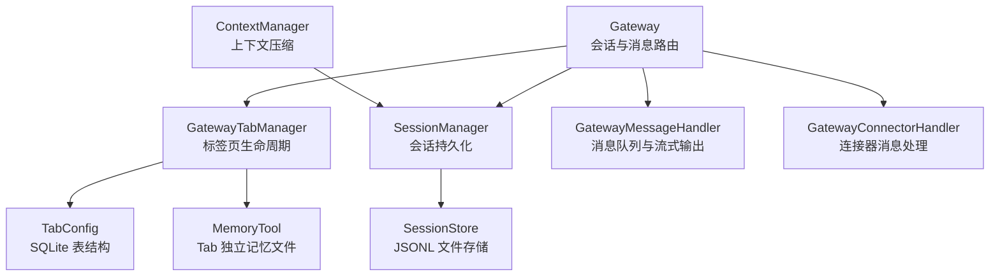
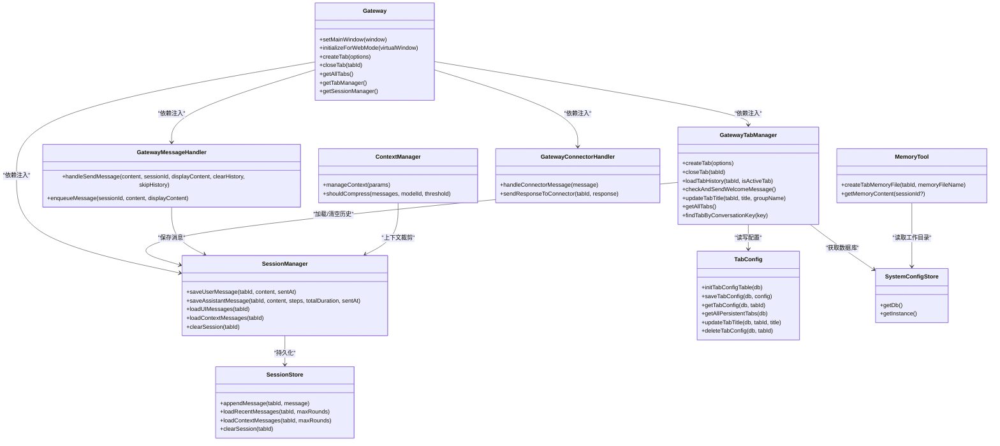
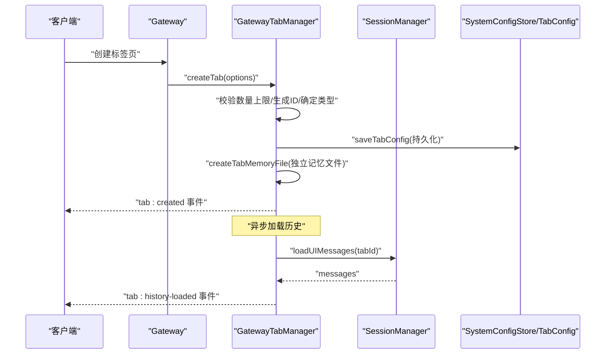
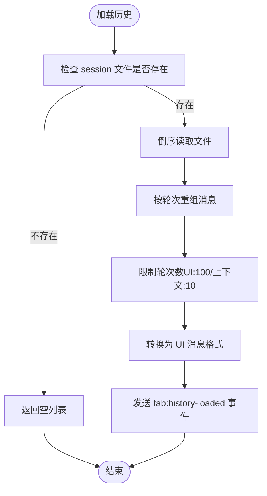
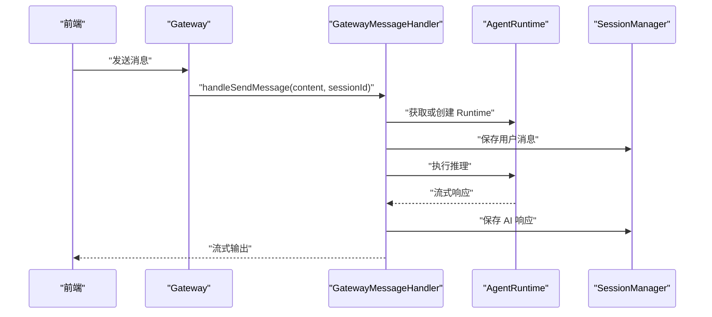
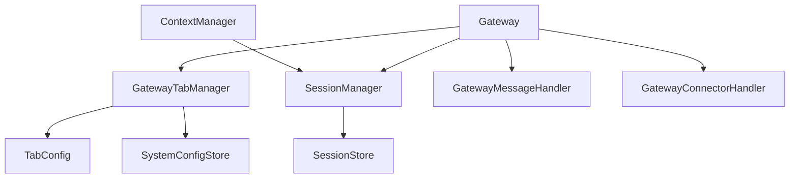

# 标签页管理系统

<cite>
**本文档引用的文件**
- [gateway-tab.ts](file://src/main/gateway-tab.ts)
- [agent-tab.ts](file://src/types/agent-tab.ts)
- [session-manager.ts](file://src/main/session/session-manager.ts)
- [session-store.ts](file://src/main/session/session-store.ts)
- [tab-config.ts](file://src/main/database/tab-config.ts)
- [system-config-store.ts](file://src/main/database/system-config-store.ts)
- [context-manager.ts](file://src/main/context/context-manager.ts)
- [gateway.ts](file://src/main/gateway.ts)
- [tabs.ts](file://src/server/routes/tabs.ts)
- [version.ts](file://src/shared/constants/version.ts)
- [gateway-connector.ts](file://src/main/gateway-connector.ts)
- [gateway-message.ts](file://src/main/gateway-message.ts)
- [memory-tool.ts](file://src/main/tools/memory-tool.ts)
</cite>

## 目录
1. [简介](#简介)
2. [项目结构](#项目结构)
3. [核心组件](#核心组件)
4. [架构总览](#架构总览)
5. [详细组件分析](#详细组件分析)
6. [依赖关系分析](#依赖关系分析)
7. [性能考虑](#性能考虑)
8. [故障排查指南](#故障排查指南)
9. [结论](#结论)
10. [附录](#附录)

## 简介
本文件面向 DeepBot 的标签页管理系统，围绕 GatewayTab 类展开，系统性阐述标签页生命周期管理、创建/激活/关闭/销毁流程、配置与持久化、历史消息与上下文管理、与会话系统的集成以及性能优化策略。文档旨在帮助开发者与使用者全面理解标签页在多会话并发场景下的行为与实现。

## 项目结构
标签页管理涉及主进程核心类、会话持久化、数据库配置、上下文压缩、以及服务端路由等模块。关键文件分布如下：
- 主进程标签页管理：src/main/gateway-tab.ts
- 类型定义：src/types/agent-tab.ts
- 会话管理：src/main/session/session-manager.ts、src/main/session/session-store.ts
- 数据库配置：src/main/database/tab-config.ts、src/main/database/system-config-store.ts
- 上下文压缩：src/main/context/context-manager.ts
- 网关集成：src/main/gateway.ts
- 服务端路由：src/server/routes/tabs.ts
- 版本与限制：src/shared/constants/version.ts
- 连接器与消息处理：src/main/gateway-connector.ts、src/main/gateway-message.ts
- 记忆工具：src/main/tools/memory-tool.ts

图表来源
- [gateway.ts:29-114](file://src/main/gateway.ts#L29-L114)
- [gateway-tab.ts:26-61](file://src/main/gateway-tab.ts#L26-L61)
- [session-manager.ts:17-26](file://src/main/session/session-manager.ts#L17-L26)
- [session-store.ts:46-51](file://src/main/session/session-store.ts#L46-L51)
- [tab-config.ts:46-64](file://src/main/database/tab-config.ts#L46-L64)
- [context-manager.ts:27-46](file://src/main/context/context-manager.ts#L27-L46)

章节来源
- [gateway.ts:29-114](file://src/main/gateway.ts#L29-L114)
- [gateway-tab.ts:26-61](file://src/main/gateway-tab.ts#L26-L61)
- [session-manager.ts:17-26](file://src/main/session/session-manager.ts#L17-L26)
- [session-store.ts:46-51](file://src/main/session/session-store.ts#L46-L51)
- [tab-config.ts:46-64](file://src/main/database/tab-config.ts#L46-L64)
- [context-manager.ts:27-46](file://src/main/context/context-manager.ts#L27-L46)

## 核心组件
- GatewayTabManager：负责标签页的创建、关闭、查询、历史加载、欢迎消息、标题更新与持久化。
- AgentTab 类型：定义标签页的数据结构，包含消息历史、状态、持久化字段、以及连接器/任务相关的标识。
- SessionManager/SessionStore：负责会话消息的持久化与加载，支持 UI 显示与上下文使用的分页读取。
- TabConfig/SystemConfigStore：负责标签页配置的持久化与读取，以及数据库表初始化。
- Gateway：作为网关，协调各组件，提供对外 API 与生命周期管理。
- ContextManager：对上下文进行压缩与裁剪，控制 Token 使用率。
- GatewayMessageHandler/GatewayConnectorHandler：分别处理普通消息与连接器消息，支持队列与并发控制。
- MemoryTool：为每个标签页提供独立记忆文件，支持继承与合并。

章节来源
- [gateway-tab.ts:26-795](file://src/main/gateway-tab.ts#L26-L795)
- [agent-tab.ts:23-46](file://src/types/agent-tab.ts#L23-L46)
- [session-manager.ts:17-193](file://src/main/session/session-manager.ts#L17-L193)
- [session-store.ts:46-321](file://src/main/session/session-store.ts#L46-L321)
- [tab-config.ts:46-217](file://src/main/database/tab-config.ts#L46-L217)
- [system-config-store.ts:37-225](file://src/main/database/system-config-store.ts#L37-L225)
- [context-manager.ts:100-303](file://src/main/context/context-manager.ts#L100-L303)
- [gateway.ts:29-114](file://src/main/gateway.ts#L29-L114)
- [gateway-connector.ts:44-88](file://src/main/gateway-connector.ts#L44-L88)
- [gateway-message.ts:31-71](file://src/main/gateway-message.ts#L31-L71)
- [memory-tool.ts:114-138](file://src/main/tools/memory-tool.ts#L114-L138)

## 架构总览
Gateway 作为中枢，初始化 SessionManager，并将依赖注入到 GatewayTabManager、GatewayConnectorHandler、GatewayMessageHandler。GatewayTabManager 负责标签页生命周期与持久化；SessionManager/SessionStore 负责消息持久化；TabConfig/SystemConfigStore 负责标签页配置持久化；ContextManager 控制上下文长度；MemoryTool 为每个标签页提供独立记忆文件。

图表来源
- [gateway.ts:337-374](file://src/main/gateway.ts#L337-L374)
- [gateway-tab.ts:45-61](file://src/main/gateway-tab.ts#L45-L61)
- [session-manager.ts:103-137](file://src/main/session/session-manager.ts#L103-L137)
- [session-store.ts:75-99](file://src/main/session/session-store.ts#L75-L99)
- [tab-config.ts:69-93](file://src/main/database/tab-config.ts#L69-L93)
- [system-config-store.ts:75-77](file://src/main/database/system-config-store.ts#L75-L77)
- [context-manager.ts:100-169](file://src/main/context/context-manager.ts#L100-L169)
- [gateway-message.ts:76-160](file://src/main/gateway-message.ts#L76-L160)
- [gateway-connector.ts:100-178](file://src/main/gateway-connector.ts#L100-L178)
- [memory-tool.ts:114-138](file://src/main/tools/memory-tool.ts#L114-L138)

## 详细组件分析

### GatewayTabManager：标签页生命周期与配置管理
- 职责
  - 创建/关闭/查询标签页
  - 加载默认标签页历史与欢迎消息
  - 加载持久化标签页并恢复历史
  - 更新标签页标题并同步持久化
  - 任务专属标签页管理（锁定、复用）
  - 基于 conversationKey 查找标签页
- 关键流程
  - 创建标签页：校验数量上限、生成唯一 ID、确定类型与标题、持久化配置、创建独立 memory 文件、通知前端
  - 关闭标签页：禁止关闭默认标签页、暂停任务（如适用）、销毁会话 Runtime、删除 memory 文件、清空 session、删除持久化配置、从内存移除
  - 历史加载：按需延迟加载，UI 场景延迟，非激活标签页延迟，空历史也发送事件避免前端卡死
  - 欢迎消息：根据会话历史判断是否发送，Web 模式下特殊处理
  - 标题更新：内存更新 + 数据库同步（仅持久化标签页）

图表来源
- [gateway-tab.ts:492-611](file://src/main/gateway-tab.ts#L492-L611)
- [gateway-tab.ts:422-487](file://src/main/gateway-tab.ts#L422-L487)
- [session-manager.ts:103-115](file://src/main/session/session-manager.ts#L103-L115)
- [tab-config.ts:69-93](file://src/main/database/tab-config.ts#L69-L93)
- [memory-tool.ts:114-138](file://src/main/tools/memory-tool.ts#L114-L138)

章节来源
- [gateway-tab.ts:492-611](file://src/main/gateway-tab.ts#L492-L611)
- [gateway-tab.ts:687-761](file://src/main/gateway-tab.ts#L687-L761)
- [gateway-tab.ts:394-417](file://src/main/gateway-tab.ts#L394-L417)
- [gateway-tab.ts:195-216](file://src/main/gateway-tab.ts#L195-L216)
- [gateway-tab.ts:665-682](file://src/main/gateway-tab.ts#L665-L682)
- [gateway-tab.ts:787-794](file://src/main/gateway-tab.ts#L787-L794)

### AgentTab 类型与状态维护
- 字段说明
  - id/title/type/messages/isLoading/createdAt/lastActiveAt：基础元信息与状态
  - isLocked/taskId/connectorId/conversationId/conversationKey/groupName：任务/连接器/群组相关标识
  - memoryFile/agentName/isPersistent：独立记忆与持久化配置
  - pendingMessages/processingMessageId：连接器多消息处理队列
- 状态更新
  - 最后活跃时间 updateTabActivity
  - 标题更新 updateTabTitle（持久化同步）

章节来源
- [agent-tab.ts:23-46](file://src/types/agent-tab.ts#L23-L46)
- [gateway-tab.ts:777-782](file://src/main/gateway-tab.ts#L777-L782)
- [gateway-tab.ts:665-682](file://src/main/gateway-tab.ts#L665-L682)

### 历史消息管理与上下文切换
- 历史加载
  - UI 显示：SessionManager.loadUIMessages 返回最近 100 轮消息
  - 上下文使用：SessionManager.loadContextMessages 返回最近 10 轮消息
  - SessionStore.loadRecentMessages/loadContextMessages 采用倒序流式读取，提升性能
- 上下文压缩
  - ContextManager 基于 Token 估算与阈值进行工具结果裁剪与历史消息裁剪
  - 支持统计信息输出，便于监控与优化

图表来源
- [session-store.ts:146-217](file://src/main/session/session-store.ts#L146-L217)
- [session-manager.ts:103-130](file://src/main/session/session-manager.ts#L103-L130)
- [context-manager.ts:100-303](file://src/main/context/context-manager.ts#L100-L303)

章节来源
- [session-store.ts:146-217](file://src/main/session/session-store.ts#L146-L217)
- [session-manager.ts:103-130](file://src/main/session/session-manager.ts#L103-L130)
- [context-manager.ts:100-303](file://src/main/context/context-manager.ts#L100-L303)

### 标题生成算法与命名策略
- 默认标签页：使用系统配置中的智能体名称作为标题
- 持久化标签页：若为任务/连接器类型，生成不重复的“Agent X”名称；否则使用系统配置中的智能体名称并保证唯一
- 唯一性：遍历现有标题集合，从 tabCounter+1 开始递增，直到找到不重复名称
- 群组连接器：飞书群组标题以 FS- 前缀，动态更新群名称

章节来源
- [gateway-tab.ts:88-108](file://src/main/gateway-tab.ts#L88-L108)
- [gateway-tab.ts:114-132](file://src/main/gateway-tab.ts#L114-L132)
- [gateway-tab.ts:521-538](file://src/main/gateway-tab.ts#L521-L538)
- [gateway-connector.ts:135-189](file://src/main/gateway-connector.ts#L135-L189)

### 多标签页并发会话与资源分配
- 并发模型
  - 每个标签页对应一个 AgentRuntime 实例，独立上下文与内存
  - 普通标签页：消息进入队列，串行处理，避免并发冲突
  - 任务标签页：等待上一次执行完成，强制停止后继续处理新消息
- 资源管理
  - 销毁会话 Runtime：resetSessionRuntime/destroySessionRuntime
  - 清空会话文件：clearSession
  - 删除独立 memory 文件：createTabMemoryFile 与关闭时删除
- 限制与保护
  - 最大标签页数量限制（MAX_TABS）
  - 任务标签页锁定，防止被意外关闭

章节来源
- [gateway.ts:430-450](file://src/main/gateway.ts#L430-L450)
- [gateway-message.ts:120-132](file://src/main/gateway-message.ts#L120-L132)
- [gateway-message.ts:165-196](file://src/main/gateway-message.ts#L165-L196)
- [gateway.ts:528-557](file://src/main/gateway.ts#L528-L557)
- [gateway-tab.ts:504-507](file://src/main/gateway-tab.ts#L504-L507)
- [gateway-tab.ts:699-721](file://src/main/gateway-tab.ts#L699-L721)
- [version.ts](file://src/shared/constants/version.ts#L21)

### 标签页与会话系统的集成与数据流
- 数据流
  - 用户消息：GatewayMessageHandler.handleSendMessage -> AgentRuntime -> SessionManager 持久化 -> 前端流式输出
  - 连接器消息：GatewayConnectorHandler.handleConnectorMessage -> GatewayTabManager.createTab/findTab -> 生成/复用标签页 -> 消息路由
  - 历史加载：GatewayTabManager.loadTabHistory -> SessionManager.loadUIMessages -> 前端渲染
- 状态同步
  - 标题更新：updateTabTitle -> 数据库同步 -> 前端 tab:updated
  - 活跃时间：updateTabActivity -> 数据库 last_active_at 更新
  - 欢迎消息：checkAndSendWelcomeMessage -> 清空历史 + 发送欢迎消息

图表来源
- [gateway.ts:455-458](file://src/main/gateway.ts#L455-L458)
- [gateway-message.ts:76-160](file://src/main/gateway-message.ts#L76-L160)
- [session-manager.ts:38-85](file://src/main/session/session-manager.ts#L38-L85)

章节来源
- [gateway.ts:455-458](file://src/main/gateway.ts#L455-L458)
- [gateway-message.ts:76-160](file://src/main/gateway-message.ts#L76-L160)
- [session-manager.ts:38-85](file://src/main/session/session-manager.ts#L38-L85)

### 持久化存储与配置管理
- 表结构与初始化
  - agent_tabs 表：id/title/type/memory_file/agent_name/is_persistent/created_at/last_active_at/task_id/connector_id/conversation_id
  - 初始化：SystemConfigStore.initTables -> initTabConfigTable
- 操作接口
  - 保存：saveTabConfig
  - 查询：getTabConfig/getAllPersistentTabs
  - 更新：updateTabTitle/updateTabAgentName/updateTabLastActive
  - 删除：deleteTabConfig/deleteNonPersistentTabs
- 与标签页生命周期联动
  - 创建标签页时持久化配置并创建独立 memory 文件
  - 关闭标签页时删除持久化配置与 memory 文件
  - 加载持久化标签页时恢复标题、类型、记忆文件等配置

章节来源
- [tab-config.ts:46-64](file://src/main/database/tab-config.ts#L46-L64)
- [tab-config.ts:69-93](file://src/main/database/tab-config.ts#L69-L93)
- [tab-config.ts:115-125](file://src/main/database/tab-config.ts#L115-L125)
- [tab-config.ts:143-153](file://src/main/database/tab-config.ts#L143-L153)
- [tab-config.ts:177-185](file://src/main/database/tab-config.ts#L177-L185)
- [system-config-store.ts:206-225](file://src/main/database/system-config-store.ts#L206-L225)
- [gateway-tab.ts:575-605](file://src/main/gateway-tab.ts#L575-L605)
- [gateway-tab.ts:748-756](file://src/main/gateway-tab.ts#L748-L756)

### 记忆系统与状态同步
- 独立记忆文件
  - 每个标签页可拥有独立 memory 文件（如 memory-tab-1.md），默认继承主 memory.md
  - 创建标签页时自动生成独立 memory 文件
  - 关闭标签页时删除独立 memory 文件
- 记忆更新与合并
  - 支持提炼与合并，自动去重与分类整理
  - 更新后可触发系统提示词重新加载，确保上下文一致性

章节来源
- [memory-tool.ts:114-138](file://src/main/tools/memory-tool.ts#L114-L138)
- [memory-tool.ts:521-621](file://src/main/tools/memory-tool.ts#L521-L621)
- [memory-tool.ts:710-762](file://src/main/tools/memory-tool.ts#L710-L762)
- [gateway-tab.ts:728-736](file://src/main/gateway-tab.ts#L728-L736)

## 依赖关系分析
- 组件耦合
  - Gateway 作为中枢，依赖注入 GatewayTabManager、SessionManager、GatewayMessageHandler、GatewayConnectorHandler
  - GatewayTabManager 依赖 SystemConfigStore 获取数据库句柄，依赖 TabConfig 进行持久化
  - SessionManager 依赖 SessionStore 进行文件读写
  - ContextManager 依赖 SessionManager 的消息读取能力
- 外部依赖
  - Electron BrowserWindow（主窗口）
  - SQLite 数据库（SystemConfigStore）
  - JSONL 文件系统（SessionStore）

图表来源
- [gateway.ts:337-374](file://src/main/gateway.ts#L337-L374)
- [gateway-tab.ts:45-61](file://src/main/gateway-tab.ts#L45-L61)
- [session-manager.ts:17-26](file://src/main/session/session-manager.ts#L17-L26)
- [session-store.ts:46-51](file://src/main/session/session-store.ts#L46-L51)
- [tab-config.ts:46-64](file://src/main/database/tab-config.ts#L46-L64)
- [system-config-store.ts:75-77](file://src/main/database/system-config-store.ts#L75-L77)
- [context-manager.ts:100-169](file://src/main/context/context-manager.ts#L100-L169)

章节来源
- [gateway.ts:337-374](file://src/main/gateway.ts#L337-L374)
- [gateway-tab.ts:45-61](file://src/main/gateway-tab.ts#L45-L61)
- [session-manager.ts:17-26](file://src/main/session/session-manager.ts#L17-L26)
- [session-store.ts:46-51](file://src/main/session/session-store.ts#L46-L51)
- [tab-config.ts:46-64](file://src/main/database/tab-config.ts#L46-L64)
- [system-config-store.ts:75-77](file://src/main/database/system-config-store.ts#L75-L77)
- [context-manager.ts:100-169](file://src/main/context/context-manager.ts#L100-L169)

## 性能考虑
- 历史加载优化
  - SessionStore.loadRecentMessages/loadContextMessages 采用倒序流式读取，避免一次性加载整个文件
  - UI 显示限制为 100 轮，上下文限制为 10 轮
- 上下文压缩
  - ContextManager 基于 Token 估算与阈值进行裁剪，减少上下文长度
  - 支持软裁剪（工具结果）与硬裁剪（历史消息），并输出统计信息
- 并发控制
  - 普通标签页消息排队串行处理，任务标签页等待上一次执行完成
  - 限制最大标签页数量，避免资源耗尽
- I/O 优化
  - JSONL 文件追加写入，批量写入接口减少磁盘压力
  - 会话文件按 Tab 分离，避免跨标签页竞争

章节来源
- [session-store.ts:146-217](file://src/main/session/session-store.ts#L146-L217)
- [session-manager.ts:103-130](file://src/main/session/session-manager.ts#L103-L130)
- [context-manager.ts:221-273](file://src/main/context/context-manager.ts#L221-L273)
- [gateway-message.ts:120-132](file://src/main/gateway-message.ts#L120-L132)
- [gateway-message.ts:165-196](file://src/main/gateway-message.ts#L165-L196)
- [version.ts](file://src/shared/constants/version.ts#L21)

## 故障排查指南
- 标签页创建失败
  - 检查 MAX_TABS 限制与依赖注入是否正确
  - 确认 SystemConfigStore 初始化与数据库可用
- 历史加载异常
  - 检查 SessionStore 文件是否存在与可读
  - 确认 SessionManager.loadUIMessages/loadContextMessages 调用链路
- 欢迎消息未触发
  - 检查会话历史是否为空或仅含系统消息
  - Web 模式下需等待 WebSocket 首次连接
- 标题更新未持久化
  - 确认 isPersistent 为真且数据库写入成功
  - 检查 updateTabTitle 调用与数据库事务
- 记忆文件异常
  - 检查 memory 文件路径与权限
  - 关闭标签页时确认 memory 文件删除逻辑

章节来源
- [gateway-tab.ts:504-507](file://src/main/gateway-tab.ts#L504-L507)
- [gateway-tab.ts:422-487](file://src/main/gateway-tab.ts#L422-L487)
- [session-store.ts:105-135](file://src/main/session/session-store.ts#L105-L135)
- [session-manager.ts:103-115](file://src/main/session/session-manager.ts#L103-L115)
- [gateway-tab.ts:195-216](file://src/main/gateway-tab.ts#L195-L216)
- [gateway-tab.ts:665-682](file://src/main/gateway-tab.ts#L665-L682)
- [memory-tool.ts:114-138](file://src/main/tools/memory-tool.ts#L114-L138)
- [gateway-tab.ts:728-736](file://src/main/gateway-tab.ts#L728-L736)

## 结论
GatewayTabManager 通过完善的生命周期管理、配置与持久化、历史与上下文处理、以及与会话系统的深度集成，实现了稳定可靠的多标签页并发会话能力。配合 SessionStore 的 I/O 优化、ContextManager 的上下文压缩与 MemoryTool 的独立记忆文件，系统在性能与可维护性之间取得良好平衡。建议在部署时关注数据库初始化、文件权限与并发控制策略，以确保大规模场景下的稳定性。

## 附录
- API 路由（服务端）
  - GET /api/tabs：获取所有标签页
  - POST /api/tabs：创建新标签页
  - GET /api/tabs/:tabId：获取指定标签页
  - DELETE /api/tabs/:tabId：关闭指定标签页
  - POST /api/tabs/:tabId/messages：向指定标签页发送消息
  - GET /api/tabs/:tabId/messages：获取标签页消息历史
  - POST /api/tabs/stop-generation：停止生成

章节来源
- [tabs.ts:17-133](file://src/server/routes/tabs.ts#L17-L133)