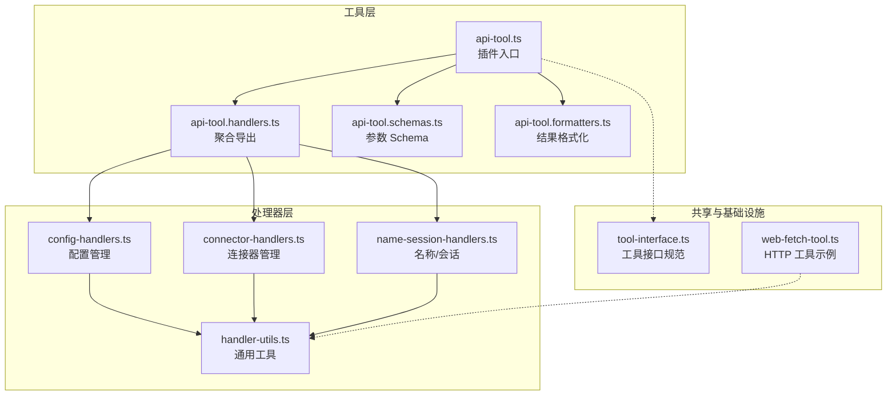
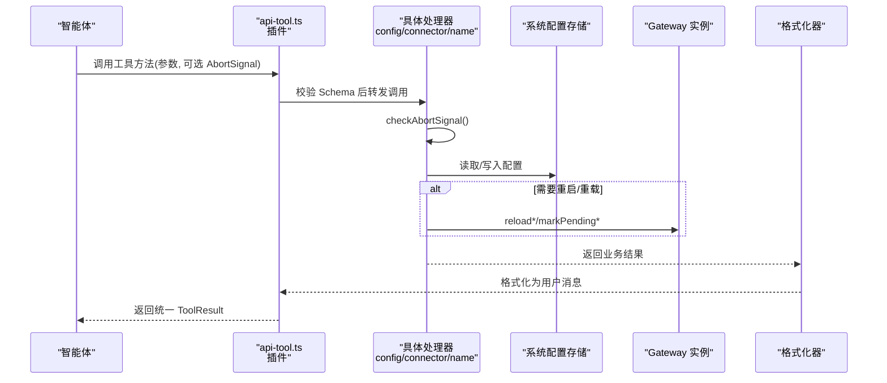
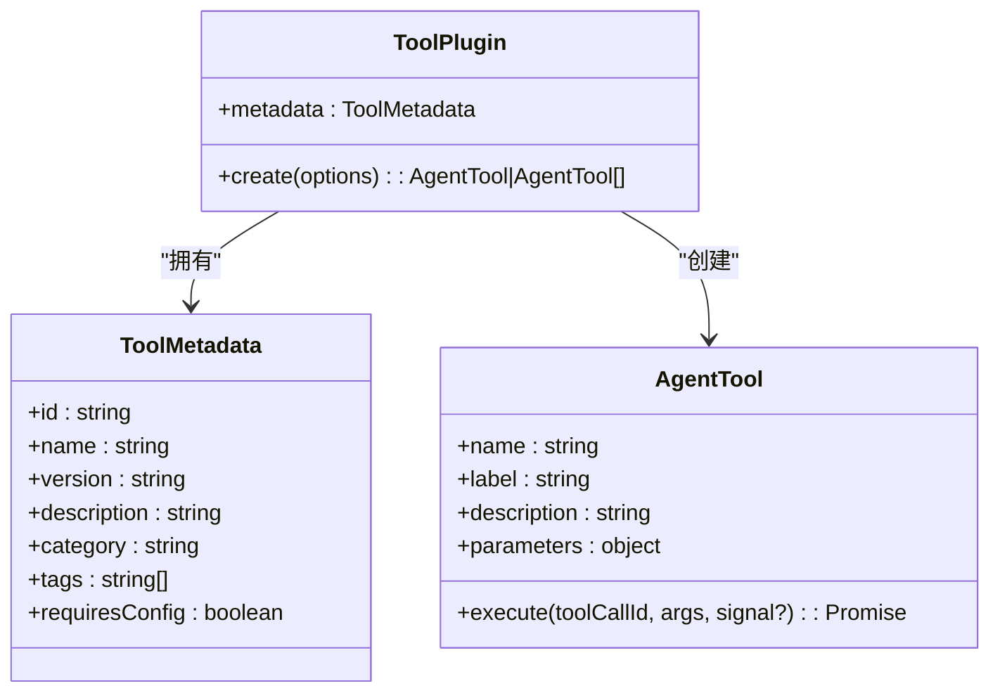
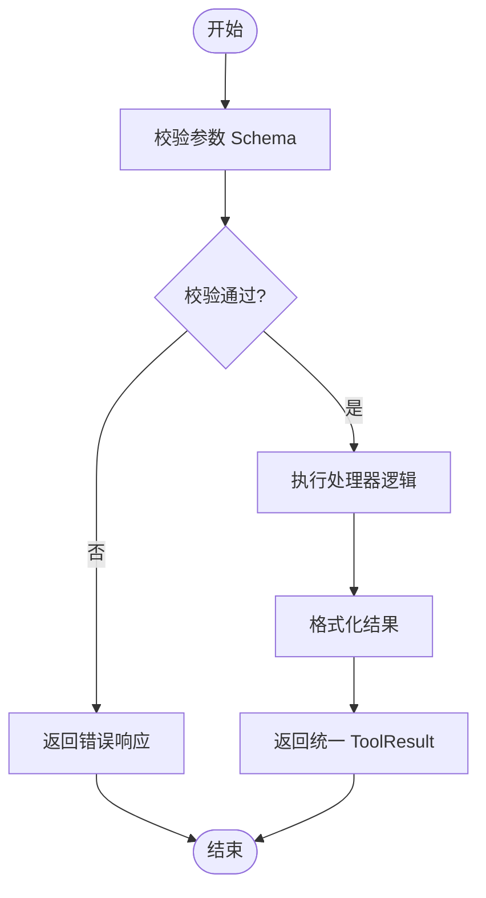
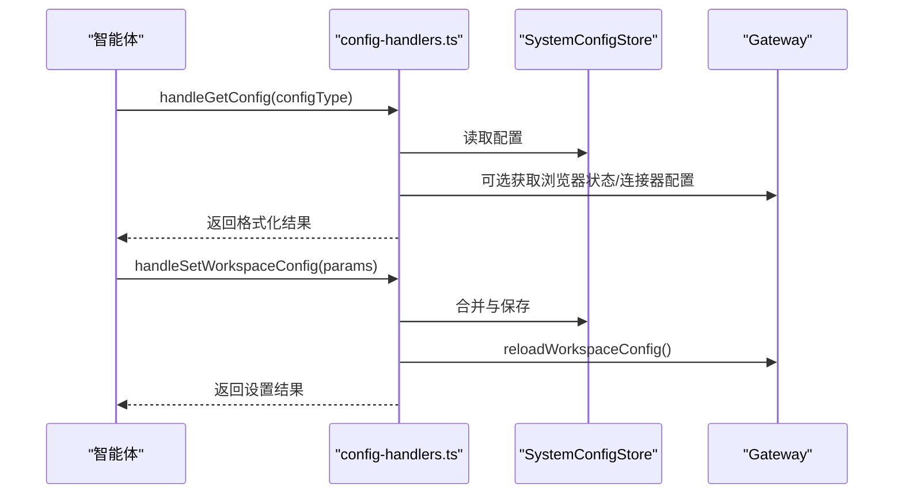
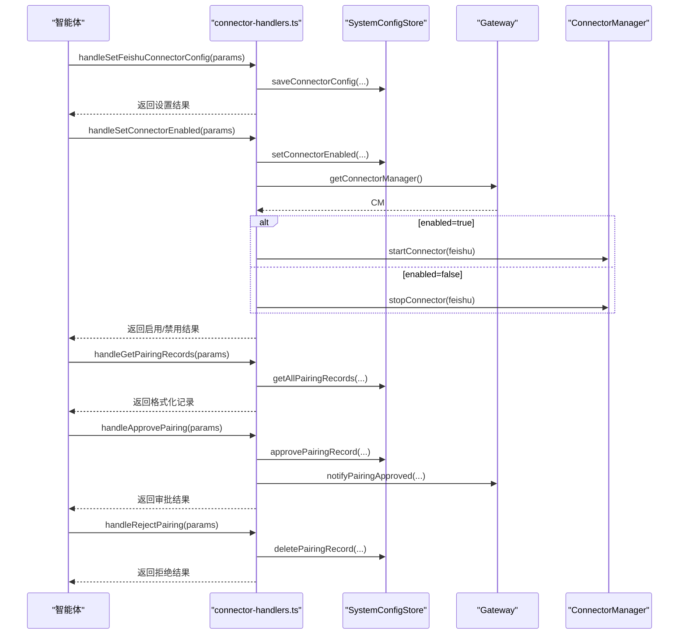
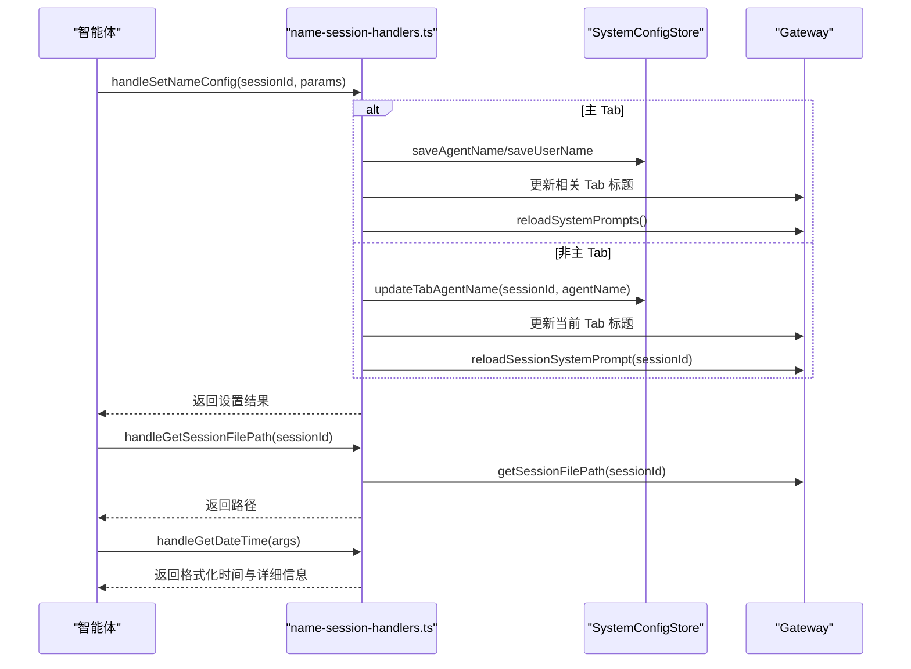
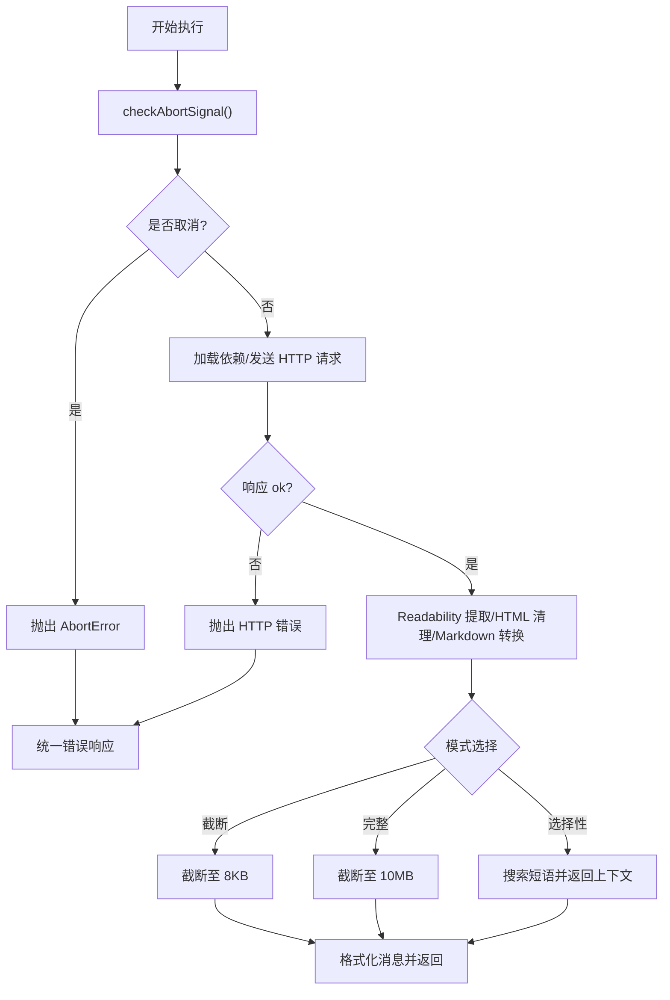
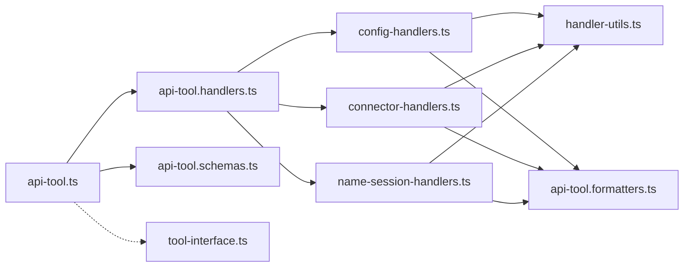

# API 工具系统

<cite>
**本文档引用的文件**
- [api-tool.ts](file://src/main/tools/api-tool.ts)
- [api-tool.handlers.ts](file://src/main/tools/api-tool.handlers.ts)
- [api-tool.formatters.ts](file://src/main/tools/api-tool.formatters.ts)
- [api-tool.schemas.ts](file://src/main/tools/api-tool.schemas.ts)
- [tool-interface.ts](file://src/main/tools/registry/tool-interface.ts)
- [config-handlers.ts](file://src/main/tools/handlers/config-handlers.ts)
- [connector-handlers.ts](file://src/main/tools/handlers/connector-handlers.ts)
- [name-session-handlers.ts](file://src/main/tools/handlers/name-session-handlers.ts)
- [handler-utils.ts](file://src/main/tools/handlers/handler-utils.ts)
- [web-fetch-tool.ts](file://src/main/tools/web-fetch-tool.ts)
</cite>

## 目录
1. [简介](#简介)
2. [项目结构](#项目结构)
3. [核心组件](#核心组件)
4. [架构总览](#架构总览)
5. [详细组件分析](#详细组件分析)
6. [依赖关系分析](#依赖关系分析)
7. [性能考虑](#性能考虑)
8. [故障排查指南](#故障排查指南)
9. [结论](#结论)
10. [附录](#附录)

## 简介
本文件为 DeepBot API 工具系统的功能文档，聚焦于系统配置访问能力与工具接口设计。API 工具允许智能体查询与设置工作目录、模型、内置工具（图片生成、Web 搜索）、连接器（飞书）以及名称配置等，同时提供统一的响应格式化与错误处理机制。文档涵盖：
- HTTP 请求处理与响应格式化
- 错误处理与中断信号（AbortSignal）支持
- 参数校验与数据格式化
- 请求拦截、重试与超时策略
- 扩展接口与自定义格式化器开发指南

## 项目结构
API 工具系统采用“插件 + 分层处理器 + Schema + 格式化器”的组织方式：
- 插件入口：定义工具元数据与工具方法清单
- 处理器层：按功能拆分（配置、连接器、名称/会话）
- Schema 层：基于 TypeBox 的参数校验
- 格式化器层：将业务结果转为用户可读消息
- 工具接口：统一的 ToolPlugin 规范

**图表来源**
- [api-tool.ts:1-220](file://src/main/tools/api-tool.ts#L1-L220)
- [api-tool.handlers.ts:1-44](file://src/main/tools/api-tool.handlers.ts#L1-L44)
- [api-tool.schemas.ts:1-258](file://src/main/tools/api-tool.schemas.ts#L1-L258)
- [api-tool.formatters.ts:1-437](file://src/main/tools/api-tool.formatters.ts#L1-L437)
- [config-handlers.ts:1-322](file://src/main/tools/handlers/config-handlers.ts#L1-L322)
- [connector-handlers.ts:1-337](file://src/main/tools/handlers/connector-handlers.ts#L1-L337)
- [name-session-handlers.ts:1-361](file://src/main/tools/handlers/name-session-handlers.ts#L1-L361)
- [handler-utils.ts:1-90](file://src/main/tools/handlers/handler-utils.ts#L1-L90)
- [tool-interface.ts:1-152](file://src/main/tools/registry/tool-interface.ts#L1-L152)
- [web-fetch-tool.ts:1-743](file://src/main/tools/web-fetch-tool.ts#L1-L743)

**章节来源**
- [api-tool.ts:1-220](file://src/main/tools/api-tool.ts#L1-L220)
- [tool-interface.ts:1-152](file://src/main/tools/registry/tool-interface.ts#L1-L152)

## 核心组件
- 工具插件（ToolPlugin）
  - 元数据：id、name、version、description、category、tags、requiresConfig
  - 工具方法：查询配置、设置模型/图片生成/Web 搜索配置、启用/禁用内置工具、设置连接器配置、启用/禁用连接器、配对记录管理、Tab 列表查询、名称配置、会话文件路径、日期时间
- 处理器（Handlers）
  - 配置管理：获取/设置工作目录、模型、图片生成、Web 搜索、工具启用状态
  - 连接器管理：飞书连接器配置、启用/禁用、配对记录、审批/拒绝、Tab 列表
  - 名称/会话：获取/设置名称、获取会话文件路径、获取日期时间
- Schema（TypeBox）
  - 对每个工具方法的参数进行强类型校验，包含枚举、可选字段、默认值与约束
- 格式化器（Formatters）
  - 将业务结果格式化为用户可读的消息，覆盖配置查询、设置、配对、Tab 列表等场景
- 通用工具（Handler Utils）
  - 统一的成功/失败响应结构、AbortSignal 检查、系统配置存储访问、Gateway 实例获取、前端事件发送

**章节来源**
- [api-tool.ts:25-219](file://src/main/tools/api-tool.ts#L25-L219)
- [api-tool.schemas.ts:7-258](file://src/main/tools/api-tool.schemas.ts#L7-L258)
- [api-tool.formatters.ts:10-437](file://src/main/tools/api-tool.formatters.ts#L10-L437)
- [handler-utils.ts:11-90](file://src/main/tools/handlers/handler-utils.ts#L11-L90)

## 架构总览
API 工具的调用流程遵循“参数校验 → 处理器执行 → 结果格式化 → 统一响应”的闭环。

**图表来源**
- [api-tool.ts:48-216](file://src/main/tools/api-tool.ts#L48-L216)
- [config-handlers.ts:32-83](file://src/main/tools/handlers/config-handlers.ts#L32-L83)
- [connector-handlers.ts:26-120](file://src/main/tools/handlers/connector-handlers.ts#L26-L120)
- [name-session-handlers.ts:27-45](file://src/main/tools/handlers/name-session-handlers.ts#L27-L45)
- [handler-utils.ts:26-64](file://src/main/tools/handlers/handler-utils.ts#L26-L64)
- [api-tool.formatters.ts:10-121](file://src/main/tools/api-tool.formatters.ts#L10-L121)

## 详细组件分析

### 工具插件与接口设计
- 插件元数据与工具方法
  - 元数据包含 id、name、version、description、author、category、tags、requiresConfig
  - 工具方法通过 create(options) 返回 AgentTool 数组，每个方法包含 name、label、description、parameters(Schema)、execute 回调
- 会话与上下文
  - 通过 options.sessionId 识别会话，用于区分全局与局部配置（如名称配置）

**图表来源**
- [tool-interface.ts:101-134](file://src/main/tools/registry/tool-interface.ts#L101-L134)
- [tool-interface.ts:33-63](file://src/main/tools/registry/tool-interface.ts#L33-L63)
- [api-tool.ts:37-219](file://src/main/tools/api-tool.ts#L37-L219)

**章节来源**
- [api-tool.ts:25-219](file://src/main/tools/api-tool.ts#L25-L219)
- [tool-interface.ts:101-134](file://src/main/tools/registry/tool-interface.ts#L101-L134)

### 参数验证与数据格式化
- 参数验证
  - 使用 TypeBox Schema 对每个工具方法进行参数校验，支持枚举、可选字段、默认值、最小/最大值、正则约束等
- 数据格式化
  - 格式化器将业务结果转为人类可读消息，覆盖配置查询、设置、配对、Tab 列表、名称变更等场景

**图表来源**
- [api-tool.schemas.ts:12-258](file://src/main/tools/api-tool.schemas.ts#L12-L258)
- [api-tool.formatters.ts:10-437](file://src/main/tools/api-tool.formatters.ts#L10-L437)
- [handler-utils.ts:45-64](file://src/main/tools/handlers/handler-utils.ts#L45-L64)

**章节来源**
- [api-tool.schemas.ts:12-258](file://src/main/tools/api-tool.schemas.ts#L12-L258)
- [api-tool.formatters.ts:10-437](file://src/main/tools/api-tool.formatters.ts#L10-L437)

### 配置管理处理器
- 获取配置
  - 支持按类型（workspace/model/image-generation/web-search/all）查询，并附加工具禁用状态、连接器配置、浏览器工具状态
- 设置配置
  - 工作目录：合并当前设置与新参数，保存后触发 Gateway 重载工作目录
  - 模型：合并默认值与当前配置，保存后触发 Gateway 重载模型配置
  - 图片生成/Web 搜索：合并默认值与当前配置并保存
  - 工具启用/禁用：标记延迟重置，等待当前执行完成后重载工具列表

**图表来源**
- [config-handlers.ts:32-83](file://src/main/tools/handlers/config-handlers.ts#L32-L83)
- [config-handlers.ts:88-140](file://src/main/tools/handlers/config-handlers.ts#L88-L140)
- [config-handlers.ts:145-202](file://src/main/tools/handlers/config-handlers.ts#L145-L202)
- [config-handlers.ts:207-242](file://src/main/tools/handlers/config-handlers.ts#L207-L242)
- [config-handlers.ts:250-280](file://src/main/tools/handlers/config-handlers.ts#L250-L280)
- [config-handlers.ts:285-322](file://src/main/tools/handlers/config-handlers.ts#L285-L322)

**章节来源**
- [config-handlers.ts:32-322](file://src/main/tools/handlers/config-handlers.ts#L32-L322)

### 连接器管理处理器
- 飞书连接器配置
  - 保存 appId/appSecret，支持启用/禁用标志
- 启用/禁用连接器
  - 检查是否已配置，调用 Gateway 的 ConnectorManager 启动/停止连接器
- 配对管理
  - 获取配对记录、按配对码审批、按用户拒绝；审批后通知连接器并向前端广播待授权数量

**图表来源**
- [connector-handlers.ts:26-59](file://src/main/tools/handlers/connector-handlers.ts#L26-L59)
- [connector-handlers.ts:64-120](file://src/main/tools/handlers/connector-handlers.ts#L64-L120)
- [connector-handlers.ts:127-173](file://src/main/tools/handlers/connector-handlers.ts#L127-L173)
- [connector-handlers.ts:178-231](file://src/main/tools/handlers/connector-handlers.ts#L178-L231)
- [connector-handlers.ts:236-274](file://src/main/tools/handlers/connector-handlers.ts#L236-L274)

**章节来源**
- [connector-handlers.ts:26-337](file://src/main/tools/handlers/connector-handlers.ts#L26-L337)

### 名称与会话处理器
- 获取/设置名称
  - 主 Tab 支持全局设置 agentName、userName；非主 Tab 仅支持设置 agentName，userName 仅能在主 Tab 设置
  - 全局设置会更新所有相关 Tab 的标题并触发系统提示词重载；局部设置仅更新当前 Tab
- 会话文件路径
  - 通过 Gateway 的 SessionManager 获取当前 Tab 的 Session 文件路径
- 日期时间
  - 支持多种格式（完整、仅日期、仅时间、日期时间、ISO、时间戳），并返回详细时区信息

**图表来源**
- [name-session-handlers.ts:56-233](file://src/main/tools/handlers/name-session-handlers.ts#L56-L233)
- [name-session-handlers.ts:238-267](file://src/main/tools/handlers/name-session-handlers.ts#L238-L267)
- [name-session-handlers.ts:272-361](file://src/main/tools/handlers/name-session-handlers.ts#L272-L361)

**章节来源**
- [name-session-handlers.ts:27-361](file://src/main/tools/handlers/name-session-handlers.ts#L27-L361)

### HTTP 请求处理与错误处理
- 统一错误处理
  - 通过 createErrorResponse 包装错误消息，返回统一 ToolResult 结构
- 中断信号支持
  - checkAbortSignal 在处理器入口检查 AbortSignal，若被取消抛出 AbortError
- HTTP 工具示例（Web Fetch）
  - 使用 httpGet 发起请求，设置超时、User-Agent、Accept 等头部
  - SSRF 防护：协议限制、内网地址禁止
  - Readability 内容提取与 HTML 清理，Markdown 转换与不可见字符过滤
  - 支持三种模式：完整（最多 10MB）、截断（前 8KB）、选择性（搜索短语）

**图表来源**
- [handler-utils.ts:26-64](file://src/main/tools/handlers/handler-utils.ts#L26-L64)
- [web-fetch-tool.ts:577-742](file://src/main/tools/web-fetch-tool.ts#L577-L742)
- [web-fetch-tool.ts:58-101](file://src/main/tools/web-fetch-tool.ts#L58-L101)
- [web-fetch-tool.ts:140-202](file://src/main/tools/web-fetch-tool.ts#L140-L202)
- [web-fetch-tool.ts:207-250](file://src/main/tools/web-fetch-tool.ts#L207-L250)

**章节来源**
- [handler-utils.ts:26-64](file://src/main/tools/handlers/handler-utils.ts#L26-L64)
- [web-fetch-tool.ts:577-742](file://src/main/tools/web-fetch-tool.ts#L577-L742)

## 依赖关系分析
- 插件与处理器
  - api-tool.ts 通过 api-tool.handlers.ts 聚合导出，再由各处理器模块实现具体功能
- 处理器与工具接口
  - 所有处理器均遵循 ToolPlugin 接口规范，统一返回 ToolResult
- 处理器与通用工具
  - 处理器依赖 handler-utils 提供的统一工具函数（AbortSignal 检查、响应封装、配置存储访问、Gateway 获取、前端事件发送）
- 处理器与格式化器
  - 处理器将业务结果交由 api-tool.formatters.ts 格式化为用户消息
- 处理器与 Schema
  - 每个工具方法的参数由 api-tool.schemas.ts 定义的 TypeBox Schema 校验

**图表来源**
- [api-tool.ts:19-21](file://src/main/tools/api-tool.ts#L19-L21)
- [api-tool.handlers.ts:16-41](file://src/main/tools/api-tool.handlers.ts#L16-L41)
- [config-handlers.ts:10-21](file://src/main/tools/handlers/config-handlers.ts#L10-L21)
- [connector-handlers.ts:6-15](file://src/main/tools/handlers/connector-handlers.ts#L6-L15)
- [name-session-handlers.ts:6-16](file://src/main/tools/handlers/name-session-handlers.ts#L6-L16)
- [handler-utils.ts:6-8](file://src/main/tools/handlers/handler-utils.ts#L6-L8)
- [api-tool.formatters.ts:1-6](file://src/main/tools/api-tool.formatters.ts#L1-L6)
- [tool-interface.ts:28-29](file://src/main/tools/registry/tool-interface.ts#L28-L29)

**章节来源**
- [api-tool.ts:19-21](file://src/main/tools/api-tool.ts#L19-L21)
- [api-tool.handlers.ts:16-41](file://src/main/tools/api-tool.handlers.ts#L16-L41)

## 性能考虑
- 依赖懒加载与缓存
  - Web Fetch 工具对 linkedom 与 Readability 采用单例模式的动态加载，避免重复开销
- 超时与大小限制
  - HTTP 请求设置超时；HTML 大小与嵌套深度存在上限，超过时降级为 Markdown 转换
- 中断与取消
  - 在关键节点检查 AbortSignal，及时中断长耗时操作
- 配置重载策略
  - 工具启用/禁用采用延迟重置，避免中断当前执行流程

[本节为通用指导，无需列出具体文件来源]

## 故障排查指南
- 常见错误类型
  - 参数校验失败：检查 Schema 定义与传参
  - 连接器未配置即启用：先配置再启用
  - 配对码不存在或已过期：确认配对码有效性
  - Gateway 未初始化：确保应用已正确启动
- 统一错误响应
  - 所有处理器通过 createErrorResponse 返回统一结构，包含 success:false 与 error 字段
- 建议排查步骤
  - 查看处理器日志（logger）
  - 确认 SystemConfigStore 状态
  - 检查 Gateway 实例与 ConnectorManager 状态
  - 验证 AbortSignal 是否被意外触发

**章节来源**
- [handler-utils.ts:55-64](file://src/main/tools/handlers/handler-utils.ts#L55-L64)
- [connector-handlers.ts:78-82](file://src/main/tools/handlers/connector-handlers.ts#L78-L82)
- [connector-handlers.ts:191-199](file://src/main/tools/handlers/connector-handlers.ts#L191-L199)
- [name-session-handlers.ts:247-249](file://src/main/tools/handlers/name-session-handlers.ts#L247-L249)

## 结论
API 工具系统通过清晰的分层设计与严格的参数校验，提供了稳定、可扩展的系统配置访问能力。其统一的响应格式化与错误处理机制，使得工具调用体验一致且易于维护。结合 HTTP 工具示例，系统具备良好的可扩展性，便于开发者新增自定义格式化器与扩展接口。

[本节为总结性内容，无需列出具体文件来源]

## 附录

### API 工具方法一览（按功能分组）
- 配置查询与设置
  - 获取系统配置（workspace/model/image-generation/web-search/all）
  - 设置工作目录配置（workspaceDir/scriptDir/skillDirs/defaultSkillDir/imageDir/memoryDir/sessionDir）
  - 设置模型配置（providerType/providerId/providerName/baseUrl/modelId/modelId2/apiType/apiKey/contextWindow）
  - 设置图片生成工具配置（model/apiUrl/apiKey）
  - 设置 Web 搜索工具配置（provider/model/apiUrl/apiKey）
  - 设置工具启用/禁用（image_generation/web_search/browser/calendar_*）
- 连接器管理
  - 设置飞书连接器配置（appId/appSecret/enabled）
  - 启用/禁用连接器（connectorId/enabled）
  - 获取配对记录（connectorId?）
  - 审核配对请求（pairingCode）
  - 拒绝配对请求（connectorId/userId）
  - 获取 Tab 列表（groupNameQuery?）
- 名称与会话
  - 获取名字配置（空参数）
  - 设置名字配置（agentName/userName）
  - 获取会话文件路径（空参数）
  - 获取日期时间（format/timezone）

**章节来源**
- [api-tool.ts:44-216](file://src/main/tools/api-tool.ts#L44-L216)
- [api-tool.schemas.ts:12-258](file://src/main/tools/api-tool.schemas.ts#L12-L258)

### 自定义格式化器开发指南
- 目标
  - 为新的工具方法或现有方法扩展更丰富的用户消息
- 步骤
  - 在 api-tool.formatters.ts 中新增格式化函数，返回字符串消息
  - 在对应处理器中调用格式化函数，将业务结果传入
  - 保持返回消息简洁、明确，必要时提供“注意/提示”信息
- 最佳实践
  - 与 Schema 保持一致的字段命名
  - 对敏感信息（如 API Key）进行脱敏处理
  - 提供多语言友好提示（如 emoji、分隔线）

**章节来源**
- [api-tool.formatters.ts:10-437](file://src/main/tools/api-tool.formatters.ts#L10-L437)

### 扩展接口与自定义工具开发
- 开发步骤
  - 在 src/main/tools 下创建新工具文件，实现 ToolPlugin 接口
  - 在工具中定义 Schema 与处理器，复用 handler-utils 的工具函数
  - 在工具中引入格式化器，保证输出一致性
  - 在工具加载器中注册新工具（参考现有工具）
- 注意事项
  - 严格遵守 AbortSignal 检查
  - 对外部依赖采用动态 require 或懒加载
  - 对外部请求添加超时与防护（如 SSRF）

**章节来源**
- [tool-interface.ts:101-134](file://src/main/tools/registry/tool-interface.ts#L101-L134)