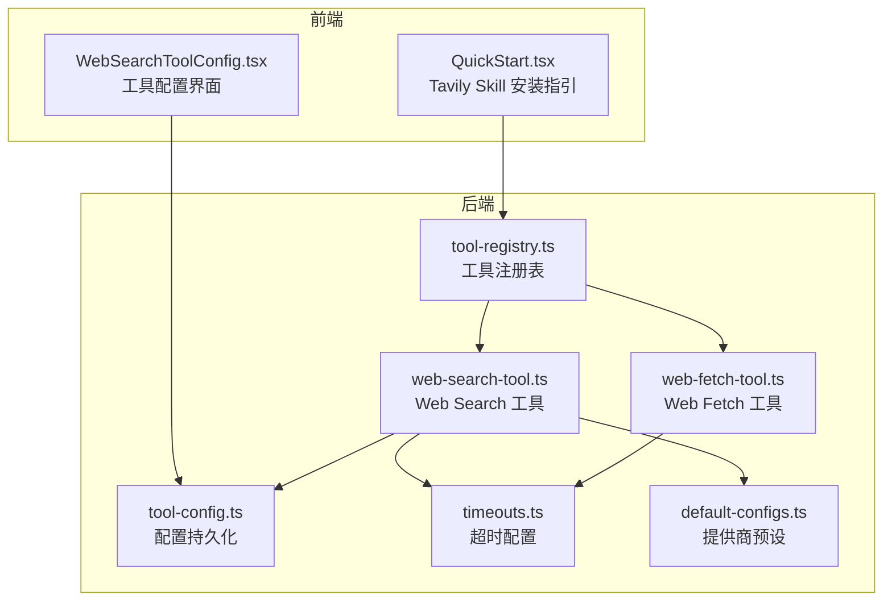
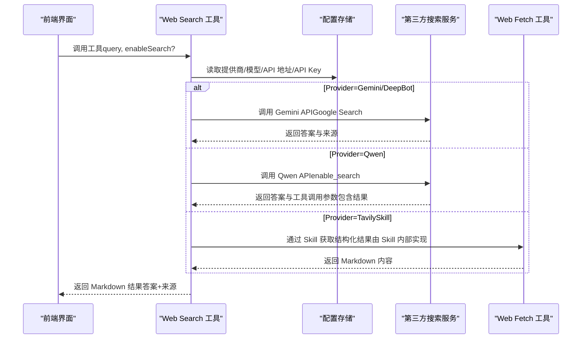
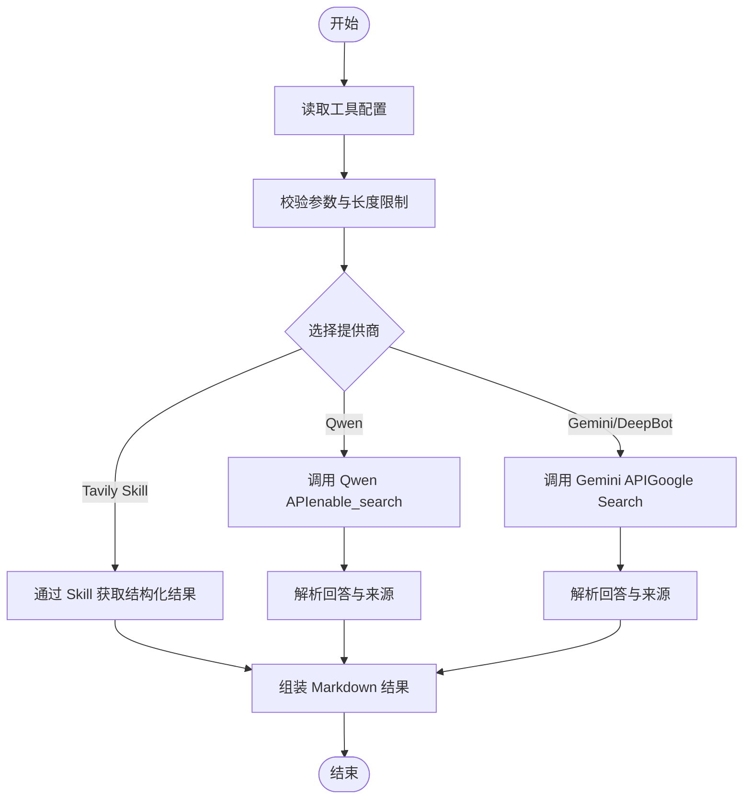
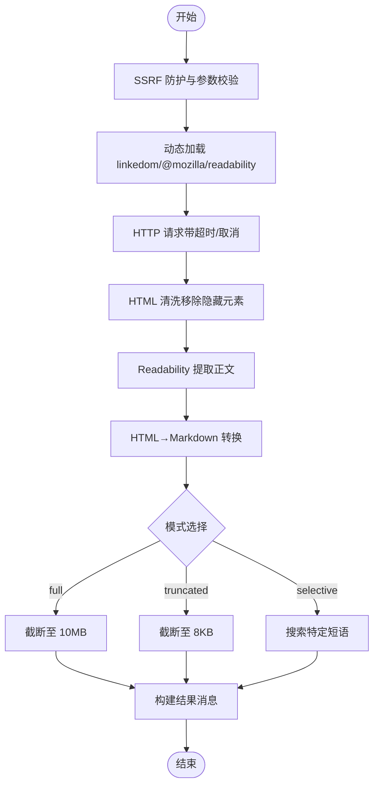
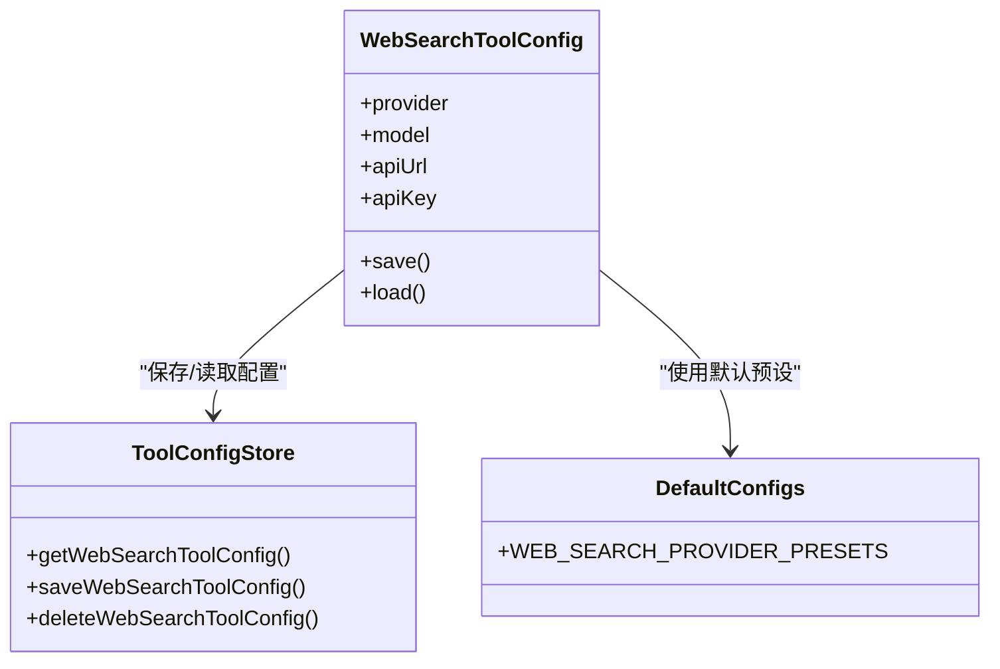
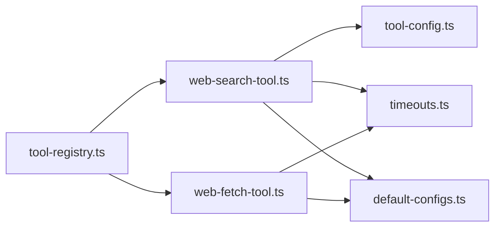

# Web 搜索工具

<cite>
**本文引用的文件**
- [web-search-tool.ts](file://src/main/tools/web-search-tool.ts)
- [web-fetch-tool.ts](file://src/main/tools/web-fetch-tool.ts)
- [WebSearchToolConfig.tsx](file://src/renderer/components/settings/WebSearchToolConfig.tsx)
- [default-configs.ts](file://src/shared/config/default-configs.ts)
- [timeouts.ts](file://src/main/config/timeouts.ts)
- [tool-config.ts](file://src/main/database/tool-config.ts)
- [tool-registry.ts](file://src/main/tools/registry/tool-registry.ts)
- [QuickStart.tsx](file://src/renderer/components/settings/QuickStart.tsx)
</cite>

## 目录
1. [简介](#简介)
2. [项目结构](#项目结构)
3. [核心组件](#核心组件)
4. [架构总览](#架构总览)
5. [详细组件分析](#详细组件分析)
6. [依赖关系分析](#依赖关系分析)
7. [性能考量](#性能考量)
8. [故障排查指南](#故障排查指南)
9. [结论](#结论)
10. [附录](#附录)

## 简介
本文件面向 DeepBot 的 Web 搜索工具，系统性阐述其基于 Tavily API 的网络搜索能力（通过 Skill 扩展接入），以及与之配套的网页内容抓取与内容提取能力。文档涵盖以下主题：
- 搜索查询处理、结果获取与内容提取的完整流程
- 工具的 API 接口、参数配置与搜索策略
- 结果处理与“缓存”机制（以会话与工具结果裁剪为主）
- 搜索优化与结果质量控制的最佳实践
- 具体的代码示例路径（以文件与行号定位）

注意：当前仓库中 Web Search 工具默认实现基于 Qwen 与 Gemini 提供商；Tavily 搜索能力通过 Skill 扩展提供，安装与配置流程已在前端向导中给出。

## 项目结构
Web 搜索工具相关的核心位置如下：
- 后端工具实现：src/main/tools/web-search-tool.ts
- 网页内容抓取与提取：src/main/tools/web-fetch-tool.ts
- 工具配置 UI：src/renderer/components/settings/WebSearchToolConfig.tsx
- 默认配置与提供商预设：src/shared/config/default-configs.ts
- 超时配置：src/main/config/timeouts.ts
- 工具配置持久化：src/main/database/tool-config.ts
- 工具注册表：src/main/tools/registry/tool-registry.ts
- Tavily Skill 安装指引：src/renderer/components/settings/QuickStart.tsx

**图表来源**
- [web-search-tool.ts:1-533](file://src/main/tools/web-search-tool.ts#L1-L533)
- [web-fetch-tool.ts:1-743](file://src/main/tools/web-fetch-tool.ts#L1-L743)
- [WebSearchToolConfig.tsx:1-184](file://src/renderer/components/settings/WebSearchToolConfig.tsx#L1-L184)
- [default-configs.ts:1-133](file://src/shared/config/default-configs.ts#L1-L133)
- [timeouts.ts:1-78](file://src/main/config/timeouts.ts#L1-L78)
- [tool-config.ts:1-128](file://src/main/database/tool-config.ts#L1-L128)
- [tool-registry.ts:1-328](file://src/main/tools/registry/tool-registry.ts#L1-L328)
- [QuickStart.tsx:969-1014](file://src/renderer/components/settings/QuickStart.tsx#L969-L1014)

**章节来源**
- [web-search-tool.ts:1-533](file://src/main/tools/web-search-tool.ts#L1-L533)
- [web-fetch-tool.ts:1-743](file://src/main/tools/web-fetch-tool.ts#L1-L743)
- [WebSearchToolConfig.tsx:1-184](file://src/renderer/components/settings/WebSearchToolConfig.tsx#L1-L184)
- [default-configs.ts:1-133](file://src/shared/config/default-configs.ts#L1-L133)
- [timeouts.ts:1-78](file://src/main/config/timeouts.ts#L1-L78)
- [tool-config.ts:1-128](file://src/main/database/tool-config.ts#L1-L128)
- [tool-registry.ts:1-328](file://src/main/tools/registry/tool-registry.ts#L1-L328)
- [QuickStart.tsx:969-1014](file://src/renderer/components/settings/QuickStart.tsx#L969-L1014)

## 核心组件
- Web Search 工具（Qwen/Gemini/Tavily Skill）
  - 支持提供商切换：Qwen（enable_search）、Gemini（Grounding with Google Search）、Tavily（通过 Skill 扩展）
  - 参数：query（必填，搜索词）、enableSearch（可选，默认启用网络搜索）
  - 输出：Markdown 格式的回答与来源列表
- Web Fetch 工具
  - 从 URL 抓取网页内容，使用 Readability 提取正文，HTML→Markdown 转换
  - 模式：full（完整，最多 10MB）、truncated（截断，前 8KB）、selective（搜索特定短语）
  - 安全防护：SSRF 防护、HTML 清理、不可见字符过滤
- 工具配置与持久化
  - 前端配置页面：WebSearchToolConfig.tsx
  - 默认提供商预设：default-configs.ts
  - 数据库存储：tool-config.ts
- 超时与取消
  - 超时配置：timeouts.ts（WEB_SEARCH_TIMEOUT=30s）
  - 取消信号：AbortSignal 支持，工具在关键点检查取消并抛出 AbortError

**章节来源**
- [web-search-tool.ts:59-66](file://src/main/tools/web-search-tool.ts#L59-L66)
- [web-search-tool.ts:409-532](file://src/main/tools/web-search-tool.ts#L409-L532)
- [web-fetch-tool.ts:31-44](file://src/main/tools/web-fetch-tool.ts#L31-L44)
- [web-fetch-tool.ts:569-742](file://src/main/tools/web-fetch-tool.ts#L569-L742)
- [WebSearchToolConfig.tsx:13-33](file://src/renderer/components/settings/WebSearchToolConfig.tsx#L13-L33)
- [default-configs.ts:80-98](file://src/shared/config/default-configs.ts#L80-L98)
- [tool-config.ts:73-116](file://src/main/database/tool-config.ts#L73-L116)
- [timeouts.ts:41-43](file://src/main/config/timeouts.ts#L41-L43)

## 架构总览
Web 搜索工具的调用链路如下：

**图表来源**
- [web-search-tool.ts:409-532](file://src/main/tools/web-search-tool.ts#L409-L532)
- [web-fetch-tool.ts:569-742](file://src/main/tools/web-fetch-tool.ts#L569-L742)
- [tool-config.ts:73-116](file://src/main/database/tool-config.ts#L73-L116)

## 详细组件分析

### Web Search 工具（Qwen/Gemini/Tavily Skill）
- 功能要点
  - 参数校验与长度限制（最大约 10K 字符）
  - 支持提供商切换：gemini/deepbot（Gemini）、qwen（enable_search）、其他（通过 Skill 扩展）
  - 结果格式：Markdown 文本，包含“搜索结果”和“参考来源”
  - 错误处理：统一捕获并返回结构化错误信息
- 关键流程（Qwen/Gemini）
  - 读取配置（provider/model/apiUrl/apiKey）
  - 构造请求体（messages/enable_search 或 tools: google_search）
  - 发送 HTTPS 请求（带超时与 AbortSignal）
  - 解析响应，提取 answer 与 sources
  - 组装 Markdown 结果返回

**图表来源**
- [web-search-tool.ts:409-532](file://src/main/tools/web-search-tool.ts#L409-L532)
- [web-search-tool.ts:77-235](file://src/main/tools/web-search-tool.ts#L77-L235)
- [web-search-tool.ts:238-404](file://src/main/tools/web-search-tool.ts#L238-L404)

**章节来源**
- [web-search-tool.ts:24-54](file://src/main/tools/web-search-tool.ts#L24-L54)
- [web-search-tool.ts:59-66](file://src/main/tools/web-search-tool.ts#L59-L66)
- [web-search-tool.ts:77-235](file://src/main/tools/web-search-tool.ts#L77-L235)
- [web-search-tool.ts:238-404](file://src/main/tools/web-search-tool.ts#L238-L404)
- [web-search-tool.ts:409-532](file://src/main/tools/web-search-tool.ts#L409-L532)

### Web Fetch 工具（网页内容抓取与提取）
- 功能要点
  - SSRF 防护：协议限制、内网地址拦截
  - 依赖动态加载：linkedom、@mozilla/readability
  - Readability 提取正文，HTML→Markdown 转换
  - 模式处理：full/truncated/selective
  - 安全清洗：移除隐藏元素、不可见字符过滤
- 关键流程
  - 参数校验与模式选择
  - SSRF 检查
  - HTTP 请求（带超时与 AbortSignal）
  - HTML 清洗与 Readability 解析
  - Markdown 转换与模式裁剪
  - 组装结果返回

**图表来源**
- [web-fetch-tool.ts:569-742](file://src/main/tools/web-fetch-tool.ts#L569-L742)
- [web-fetch-tool.ts:57-101](file://src/main/tools/web-fetch-tool.ts#L57-L101)
- [web-fetch-tool.ts:105-135](file://src/main/tools/web-fetch-tool.ts#L105-L135)
- [web-fetch-tool.ts:140-202](file://src/main/tools/web-fetch-tool.ts#L140-L202)
- [web-fetch-tool.ts:207-250](file://src/main/tools/web-fetch-tool.ts#L207-L250)
- [web-fetch-tool.ts:531-565](file://src/main/tools/web-fetch-tool.ts#L531-L565)

**章节来源**
- [web-fetch-tool.ts:57-101](file://src/main/tools/web-fetch-tool.ts#L57-L101)
- [web-fetch-tool.ts:105-135](file://src/main/tools/web-fetch-tool.ts#L105-L135)
- [web-fetch-tool.ts:140-202](file://src/main/tools/web-fetch-tool.ts#L140-L202)
- [web-fetch-tool.ts:207-250](file://src/main/tools/web-fetch-tool.ts#L207-L250)
- [web-fetch-tool.ts:531-565](file://src/main/tools/web-fetch-tool.ts#L531-L565)
- [web-fetch-tool.ts:569-742](file://src/main/tools/web-fetch-tool.ts#L569-L742)

### 工具配置与持久化
- 前端配置页面
  - 支持提供商选择（deepbot/qwen/gemini）
  - 自动填充默认模型与基础地址
  - 保存配置到后端
- 默认提供商预设
  - WEB_SEARCH_PROVIDER_PRESETS 提供默认模型与地址
- 数据库存储
  - get/save/delete Web Search 工具配置
- 工具注册表
  - 工具加载与注册（用于扩展与管理）

**图表来源**
- [WebSearchToolConfig.tsx:13-33](file://src/renderer/components/settings/WebSearchToolConfig.tsx#L13-L33)
- [tool-config.ts:73-116](file://src/main/database/tool-config.ts#L73-L116)
- [default-configs.ts:80-98](file://src/shared/config/default-configs.ts#L80-L98)

**章节来源**
- [WebSearchToolConfig.tsx:13-33](file://src/renderer/components/settings/WebSearchToolConfig.tsx#L13-L33)
- [tool-config.ts:73-116](file://src/main/database/tool-config.ts#L73-L116)
- [default-configs.ts:80-98](file://src/shared/config/default-configs.ts#L80-L98)

### Tavily 搜索 Skill（通过 Skill 扩展）
- 安装与配置流程
  - 在聊天界面的 [skill] 中搜索「Tavily Search」并安装
  - 访问 app.tavily.com 注册账号并获取 API Key
  - 在对话中告知 DeepBot 已配置好 API Key
- 作用
  - 为 DeepBot 提供高质量、结构化的搜索结果，降低幻觉风险
  - 支持深度搜索与快速搜索，免费额度满足日常使用

**章节来源**
- [QuickStart.tsx:969-1014](file://src/renderer/components/settings/QuickStart.tsx#L969-L1014)

## 依赖关系分析
- Web Search 工具依赖
  - 配置存储：读取/写入工具配置
  - 超时配置：WEB_SEARCH_TIMEOUT=30s
  - 提供商预设：默认模型与地址
  - 取消信号：AbortSignal 支持
- Web Fetch 工具依赖
  - 超时配置：HTTP_REQUEST_TIMEOUT
  - 动态依赖：linkedom、@mozilla/readability
  - 安全清洗与 HTML 规范化
- 工具注册表
  - 管理工具插件注册与加载（含 Skill 扩展）

**图表来源**
- [web-search-tool.ts:10-14](file://src/main/tools/web-search-tool.ts#L10-L14)
- [web-search-tool.ts:441-442](file://src/main/tools/web-search-tool.ts#L441-L442)
- [web-fetch-tool.ts:17-20](file://src/main/tools/web-fetch-tool.ts#L17-L20)
- [tool-config.ts:73-116](file://src/main/database/tool-config.ts#L73-L116)
- [timeouts.ts:41-43](file://src/main/config/timeouts.ts#L41-L43)
- [default-configs.ts:80-98](file://src/shared/config/default-configs.ts#L80-L98)
- [tool-registry.ts:1-328](file://src/main/tools/registry/tool-registry.ts#L1-L328)

**章节来源**
- [web-search-tool.ts:10-14](file://src/main/tools/web-search-tool.ts#L10-L14)
- [web-search-tool.ts:441-442](file://src/main/tools/web-search-tool.ts#L441-L442)
- [web-fetch-tool.ts:17-20](file://src/main/tools/web-fetch-tool.ts#L17-L20)
- [tool-config.ts:73-116](file://src/main/database/tool-config.ts#L73-L116)
- [timeouts.ts:41-43](file://src/main/config/timeouts.ts#L41-L43)
- [default-configs.ts:80-98](file://src/shared/config/default-configs.ts#L80-L98)
- [tool-registry.ts:1-328](file://src/main/tools/registry/tool-registry.ts#L1-L328)

## 性能考量
- 超时与取消
  - Web Search 超时：30 秒；Web Fetch 超时：5 秒；工具应在关键点检查 AbortSignal 并及时退出
- 查询长度限制
  - Web Search 对 query 长度进行限制（约 10K 字符），避免 API 调用失败或超时
- 内容大小与模式
  - Web Fetch 支持 full/truncated/selective，合理选择模式以平衡性能与信息量
- 依赖加载
  - Web Fetch 动态加载 linkedom 与 Readability，首次使用会有延迟，建议在空闲时段预热或复用会话
- SSRF 与安全
  - Web Fetch 强化 SSRF 防护与 HTML 清洗，避免低效与安全风险

**章节来源**
- [timeouts.ts:27-43](file://src/main/config/timeouts.ts#L27-L43)
- [web-search-tool.ts:72](file://src/main/tools/web-search-tool.ts#L72)
- [web-search-tool.ts:88-92](file://src/main/tools/web-search-tool.ts#L88-L92)
- [web-fetch-tool.ts:569-742](file://src/main/tools/web-fetch-tool.ts#L569-L742)

## 故障排查指南
- 常见错误与处理
  - 未配置 API Key 或 API 地址：工具会在启动时抛错并提示在系统设置中配置
  - 查询过长：超过字符限制会报错，建议缩短查询或分段处理
  - 请求超时：检查网络与代理，确认超时时间（30 秒）与提供商可用性
  - SSRF 防护触发：仅允许 http/https，禁止 localhost 与内网地址
  - 读取/保存配置失败：检查数据库权限与文件系统权限
- 建议排查步骤
  - 确认工具配置（提供商、模型、API 地址、API Key）
  - 检查网络连通性与代理设置
  - 减少查询长度或拆分查询
  - 使用 truncated 模式先验证结果质量
  - 查看后端日志中的错误堆栈与状态码

**章节来源**
- [web-search-tool.ts:32-53](file://src/main/tools/web-search-tool.ts#L32-L53)
- [web-search-tool.ts:433-439](file://src/main/tools/web-search-tool.ts#L433-L439)
- [web-search-tool.ts:191-194](file://src/main/tools/web-search-tool.ts#L191-L194)
- [web-fetch-tool.ts:58-101](file://src/main/tools/web-fetch-tool.ts#L58-L101)
- [tool-config.ts:73-116](file://src/main/database/tool-config.ts#L73-L116)

## 结论
DeepBot 的 Web 搜索工具提供了灵活的搜索能力：既可以直接调用 Qwen/Gemini 的网络搜索能力，也支持通过 Skill 扩展接入 Tavily 等第三方搜索引擎。配合 Web Fetch 工具，用户可以获得从“搜索—抓取—提取—格式化”的完整链路体验。通过合理的参数配置、超时与取消机制、以及安全与性能优化策略，可以在保证稳定性的同时提升搜索结果的质量与效率。

## 附录
- 代码示例路径（以文件与行号定位）
  - Web Search 工具入口与执行逻辑：[web-search-tool.ts:409-532](file://src/main/tools/web-search-tool.ts#L409-L532)
  - Qwen API 调用与结果解析：[web-search-tool.ts:77-235](file://src/main/tools/web-search-tool.ts#L77-L235)
  - Gemini API 调用与结果解析：[web-search-tool.ts:238-404](file://src/main/tools/web-search-tool.ts#L238-L404)
  - Web Fetch 工具入口与执行逻辑：[web-fetch-tool.ts:569-742](file://src/main/tools/web-fetch-tool.ts#L569-L742)
  - SSRF 防护与 HTML 清洗：[web-fetch-tool.ts:57-101](file://src/main/tools/web-fetch-tool.ts#L57-L101)、[web-fetch-tool.ts:377-397](file://src/main/tools/web-fetch-tool.ts#L377-L397)
  - 工具配置 UI 与保存逻辑：[WebSearchToolConfig.tsx:62-81](file://src/renderer/components/settings/WebSearchToolConfig.tsx#L62-L81)
  - 默认提供商预设（Web Search）：[default-configs.ts:80-98](file://src/shared/config/default-configs.ts#L80-L98)
  - 超时配置（Web Search）：[timeouts.ts:41-43](file://src/main/config/timeouts.ts#L41-L43)
  - 工具配置持久化（读取/保存）：[tool-config.ts:73-116](file://src/main/database/tool-config.ts#L73-L116)
  - 工具注册表（工具加载与管理）：[tool-registry.ts:1-328](file://src/main/tools/registry/tool-registry.ts#L1-L328)
  - Tavily Skill 安装指引：[QuickStart.tsx:969-1014](file://src/renderer/components/settings/QuickStart.tsx#L969-L1014)