# 内置工具详解

<cite>
**本文档引用的文件**
- [api-tool.ts](file://src/main/tools/api-tool.ts)
- [browser-tool.ts](file://src/main/tools/browser-tool.ts)
- [calendar-tool.ts](file://src/main/tools/calendar-tool.ts)
- [chat-tool.ts](file://src/main/tools/chat-tool.ts)
- [command-tool.ts](file://src/main/tools/command-tool.ts)
- [connector-tool.ts](file://src/main/tools/connector-tool.ts)
- [cross-tab-call-tool.ts](file://src/main/tools/cross-tab-call-tool.ts)
- [email-tool.ts](file://src/main/tools/email-tool.ts)
- [environment-check-tool.ts](file://src/main/tools/environment-check-tool.ts)
- [exec-tool.ts](file://src/main/tools/exec-tool.ts)
- [feishu-doc-tool.ts](file://src/main/tools/feishu-doc-tool.ts)
- [file-tool.ts](file://src/main/tools/file-tool.ts)
- [image-generation-tool.ts](file://src/main/tools/image-generation-tool.ts)
- [memory-tool.ts](file://src/main/tools/memory-tool.ts)
- [scheduled-task-tool.ts](file://src/main/tools/scheduled-task-tool.ts)
- [web-fetch-tool.ts](file://src/main/tools/web-fetch-tool.ts)
- [web-search-tool.ts](file://src/main/tools/web-search-tool.ts)
- [tool-names.ts](file://src/main/tools/tool-names.ts)
- [tool-interface.ts](file://src/main/tools/registry/tool-interface.ts)
- [tool-registry.ts](file://src/main/tools/registry/tool-registry.ts)
- [tool-loader.ts](file://src/main/tools/registry/tool-loader.ts)
- [TOOL_NAMES 常量](file://src/main/tools/tool-names.ts)
</cite>

## 目录
1. [简介](#简介)
2. [项目结构](#项目结构)
3. [核心组件](#核心组件)
4. [架构概览](#架构概览)
5. [详细组件分析](#详细组件分析)
6. [依赖分析](#依赖分析)
7. [性能考虑](#性能考虑)
8. [故障排除指南](#故障排除指南)
9. [结论](#结论)
10. [附录](#附录)

## 简介
本文件为 DeepBot 内置工具系统的权威技术文档，面向开发者与高级用户，系统性阐述 14 个内置工具的功能特性、参数配置、执行流程、返回结果、安全机制与协作关系。文档同时提供扩展指南、最佳实践与故障排除建议，帮助读者高效集成与定制工具。

## 项目结构
DeepBot 的内置工具位于 `src/main/tools` 目录，采用“按功能模块划分”的组织方式：
- 工具插件：每个工具以独立文件实现，遵循统一的 ToolPlugin 接口规范
- 工具注册：通过工具注册中心集中管理与加载
- 工具命名：统一维护在 `tool-names.ts` 中，便于跨模块引用
- 工具接口：定义工具元数据、参数校验与执行约定

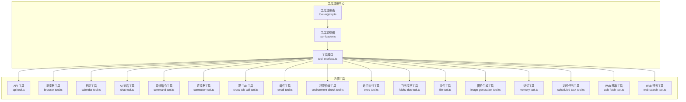

**图表来源**
- [tool-registry.ts](file://src/main/tools/registry/tool-registry.ts)
- [tool-loader.ts](file://src/main/tools/registry/tool-loader.ts)
- [tool-interface.ts](file://src/main/tools/registry/tool-interface.ts)
- [api-tool.ts](file://src/main/tools/api-tool.ts)
- [browser-tool.ts](file://src/main/tools/browser-tool.ts)
- [calendar-tool.ts](file://src/main/tools/calendar-tool.ts)
- [chat-tool.ts](file://src/main/tools/chat-tool.ts)
- [command-tool.ts](file://src/main/tools/command-tool.ts)
- [connector-tool.ts](file://src/main/tools/connector-tool.ts)
- [cross-tab-call-tool.ts](file://src/main/tools/cross-tab-call-tool.ts)
- [email-tool.ts](file://src/main/tools/email-tool.ts)
- [environment-check-tool.ts](file://src/main/tools/environment-check-tool.ts)
- [exec-tool.ts](file://src/main/tools/exec-tool.ts)
- [feishu-doc-tool.ts](file://src/main/tools/feishu-doc-tool.ts)
- [file-tool.ts](file://src/main/tools/file-tool.ts)
- [image-generation-tool.ts](file://src/main/tools/image-generation-tool.ts)
- [memory-tool.ts](file://src/main/tools/memory-tool.ts)
- [scheduled-task-tool.ts](file://src/main/tools/scheduled-task-tool.ts)
- [web-fetch-tool.ts](file://src/main/tools/web-fetch-tool.ts)
- [web-search-tool.ts](file://src/main/tools/web-search-tool.ts)

**章节来源**
- [tool-registry.ts](file://src/main/tools/registry/tool-registry.ts)
- [tool-loader.ts](file://src/main/tools/registry/tool-loader.ts)
- [tool-interface.ts](file://src/main/tools/registry/tool-interface.ts)

## 核心组件
- 工具接口与元数据：定义工具的元信息（id、name、version、description、author、category、tags、requiresConfig）与参数 Schema，确保统一的参数校验与执行协议。
- 工具注册中心：集中管理工具的生命周期、加载与卸载，支持按需启用/禁用工具。
- 工具命名常量：统一维护工具名称常量，避免硬编码，便于跨模块引用与调试。
- 工具插件实现：每个工具以独立插件形式实现，遵循统一的 create 回调，返回一组可执行的工具方法。

**章节来源**
- [tool-interface.ts](file://src/main/tools/registry/tool-interface.ts)
- [tool-names.ts](file://src/main/tools/tool-names.ts)
- [tool-registry.ts](file://src/main/tools/registry/tool-registry.ts)

## 架构概览
内置工具系统采用“插件化 + 注册中心 + 统一接口”的架构设计，确保：
- 可扩展性：新增工具只需实现 ToolPlugin 接口并注册即可
- 可维护性：参数校验、错误处理、安全检查集中在统一框架
- 可观测性：每个工具的执行过程、返回结果与错误信息均可追踪

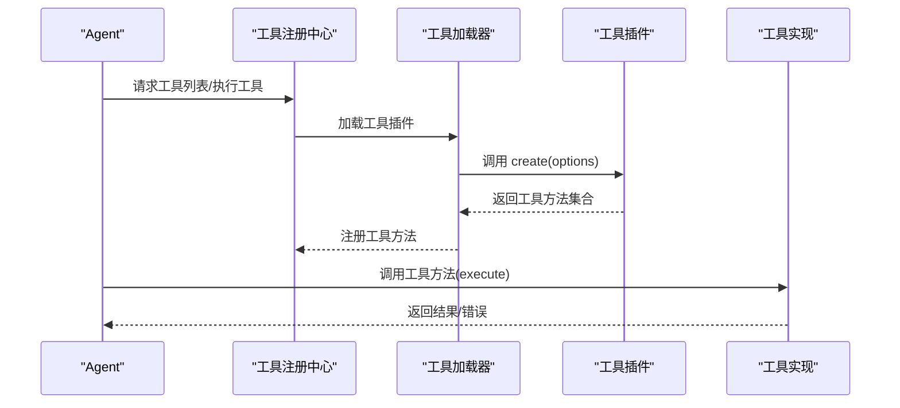

**图表来源**
- [tool-registry.ts](file://src/main/tools/registry/tool-registry.ts)
- [tool-loader.ts](file://src/main/tools/registry/tool-loader.ts)
- [tool-interface.ts](file://src/main/tools/registry/tool-interface.ts)

## 详细组件分析

### API 工具（系统配置访问）
- 功能概述：提供对 DeepBot 系统配置的只读查询与受限写入能力，包括工作目录、模型配置、工具配置、连接器配置、配对记录、Tab 列表、名称配置、会话文件路径、日期时间等。
- 参数与返回：
  - 查询类：GetConfigSchema（返回系统配置对象）
  - 配置类：SetModelConfigSchema、SetImageGenerationConfigSchema、SetWebSearchConfigSchema、SetFeishuConnectorConfigSchema
  - 开关类：SetToolEnabledSchema、SetConnectorEnabledSchema
  - 审核类：GetPairingRecordsSchema、ApprovePairingSchema、RejectPairingSchema
  - 信息类：GetTabsSchema、GetNameConfig、SetNameConfig、GetSessionFilePathSchema、GetDateTimeSchema
- 安全机制：写操作需用户确认；工作目录配置仅能通过系统设置界面修改，不开放 Agent 直接调用。
- 使用场景：系统运维、配置管理、连接器配对与审核、会话分析与时间获取。

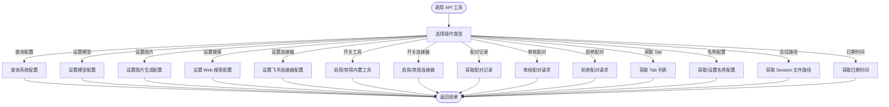

**图表来源**
- [api-tool.ts](file://src/main/tools/api-tool.ts)

**章节来源**
- [api-tool.ts](file://src/main/tools/api-tool.ts)

### 浏览器工具（自动化）
- 功能概述：基于 agent-browser CLI 实现浏览器自动化，支持打开网页、快照、点击、填充、截图、标签页管理等操作。使用 @ref 系统进行元素定位。
- 参数与返回：
  - action: open、snapshot、click、dblclick、fill、type、press、hover、check、uncheck、select、scroll、scrollintoview、get、screenshot、back、forward、reload、wait、tab、close
  - 返回包含 content（文本描述）与 details（结构化结果，如 URL、元素列表、截图路径等）
- 安全与环境：
  - Docker 模式：自动启动 Playwright Chromium（headless），暴露 CDP 端口
  - 非 Docker 模式：连接系统 Chrome，支持用户数据目录隔离
- 使用场景：网页自动化、数据采集、UI 操作、截图与快照分析。

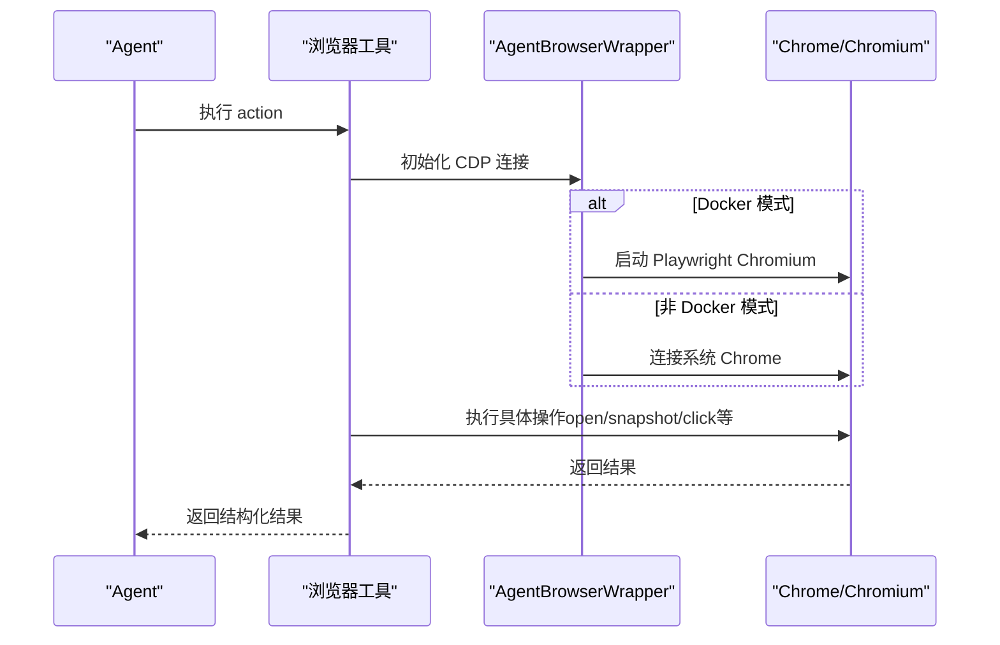

**图表来源**
- [browser-tool.ts](file://src/main/tools/browser-tool.ts)

**章节来源**
- [browser-tool.ts](file://src/main/tools/browser-tool.ts)

### 日历工具（macOS）
- 功能概述：通过 AppleScript 与 macOS Calendar 交互，支持读取日历事件与创建新事件。仅支持 macOS 平台。
- 参数与返回：
  - 读取：dateRange（today/tomorrow/this week/YYYY-MM-DD/"YYYY-MM-DD to YYYY-MM-DD"）、calendarName（可选）
  - 创建：title、startDate、endDate、location（可选）、notes（可选）、calendarName（可选）
- 权限要求：需要授予 DeepBot Automation 权限以控制 Calendar.app。
- 使用场景：日程管理、会议安排、事件提醒。

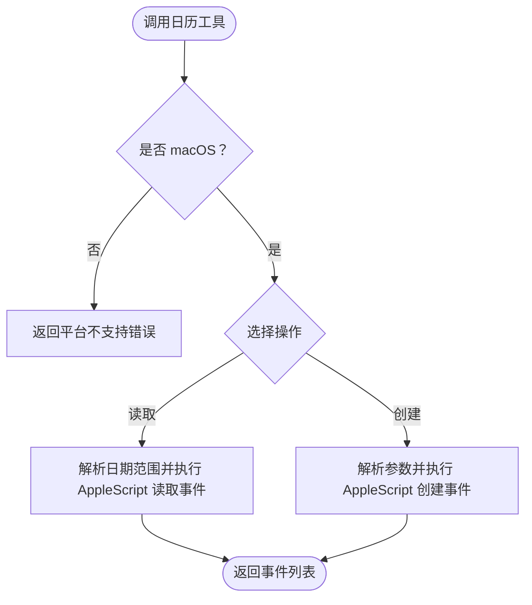

**图表来源**
- [calendar-tool.ts](file://src/main/tools/calendar-tool.ts)

**章节来源**
- [calendar-tool.ts](file://src/main/tools/calendar-tool.ts)

### AI 对话工具
- 功能概述：调用 AI 模型进行对话、翻译、总结、改写等任务，支持长文本自动分段与流式输出。
- 参数与返回：
  - prompt（必需）、content（可选）、systemPrompt（可选）、maxChunkSize（可选）
  - 返回流式更新与最终结果，details 包含分段数量、总长度、是否流式等
- 性能优化：根据模型 contextWindow 动态计算分段大小，预留 40% 输入空间，字符数按保守 1:2 估算。
- 使用场景：内容生成、信息摘要、多轮对话、长文本处理。

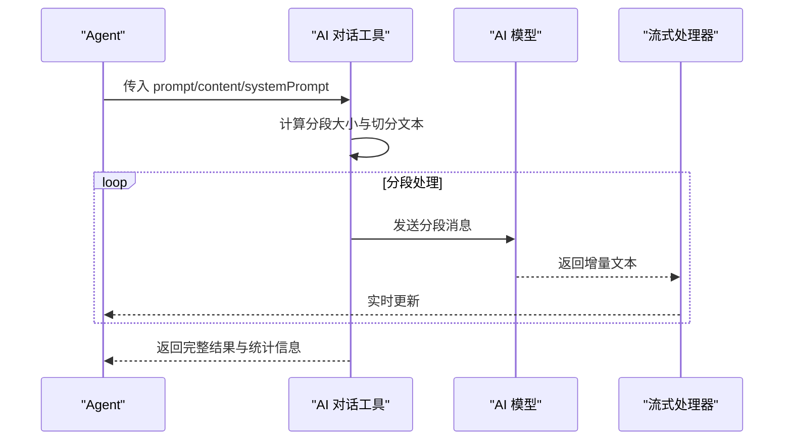

**图表来源**
- [chat-tool.ts](file://src/main/tools/chat-tool.ts)

**章节来源**
- [chat-tool.ts](file://src/main/tools/chat-tool.ts)

### 系统指令工具
- 功能概述：处理系统级指令，如 /new 清空会话历史。
- 参数与返回：
  - command: new（清空当前会话历史，开始新对话）
  - 返回成功/失败与错误信息
- 使用场景：会话重置、快速清理历史。

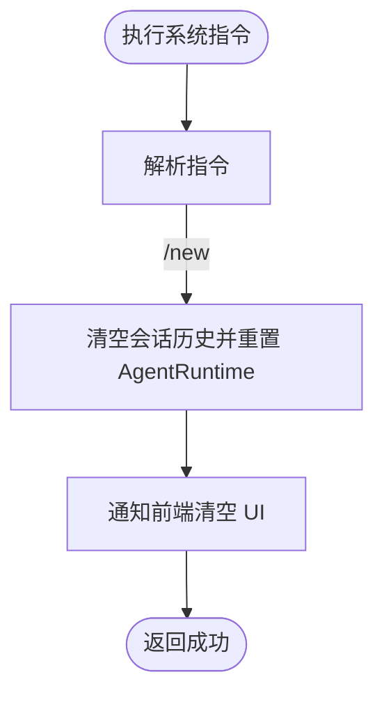

**图表来源**
- [command-tool.ts](file://src/main/tools/command-tool.ts)

**章节来源**
- [command-tool.ts](file://src/main/tools/command-tool.ts)

### 连接器工具（飞书）
- 功能概述：向飞书用户或群组发送消息、图片、文件；支持连接器会话与普通 Tab。
- 参数与返回：
  - 发送消息：message、userId（可选）、chatId（可选）、tabName（可选）
  - 发送图片：imagePath、caption（可选）、userId/chatId/tabName（可选）
  - 发送文件：filePath、fileName（可选）、userId/chatId/tabName（可选）
- 目标解析优先级：chatId > tabName > 当前连接器 Tab > userId（通过配对记录 open_id）
- 使用场景：消息推送、文件分发、群组通知。

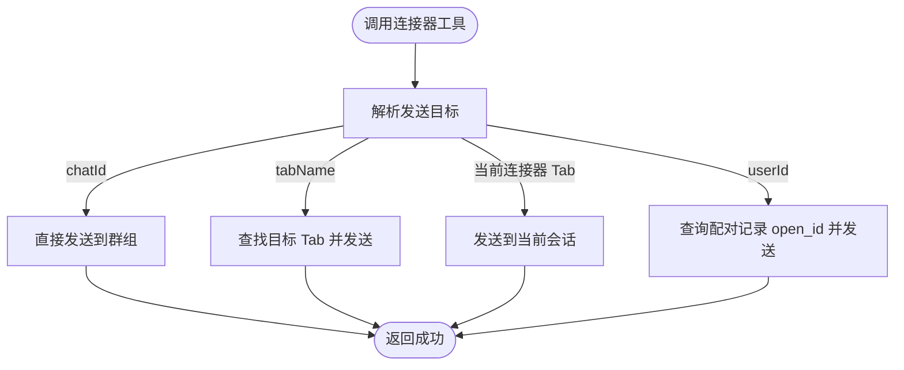

**图表来源**
- [connector-tool.ts](file://src/main/tools/connector-tool.ts)

**章节来源**
- [connector-tool.ts](file://src/main/tools/connector-tool.ts)

### 跨 Tab 调用工具
- 功能概述：允许不同 Tab 之间互相发送消息进行协作，支持标记来源与系统提示。
- 参数与返回：
  - targetTabName（目标 Tab 名称）、message（消息内容）、senderTabName（由系统注入）
- 使用场景：多 Agent 协作、任务分发、信息同步。

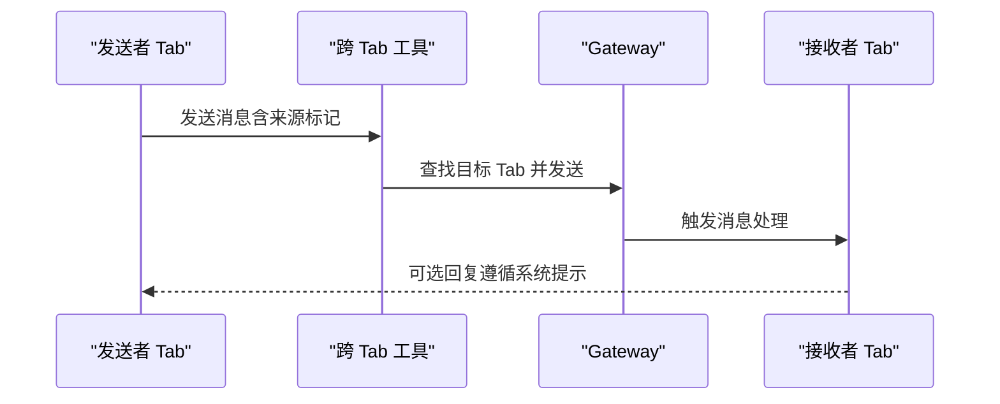

**图表来源**
- [cross-tab-call-tool.ts](file://src/main/tools/cross-tab-call-tool.ts)

**章节来源**
- [cross-tab-call-tool.ts](file://src/main/tools/cross-tab-call-tool.ts)

### 邮件工具（SMTP）
- 功能概述：通过 SMTP 发送邮件，支持纯文本/HTML、附件、抄送、密送，兼容主流邮件服务商。
- 参数与返回：
  - to、subject、body/bodyFile（二选一）、html（可选）、attachments（可选）、cc/bcc（可选）
  - 返回发送状态、Message ID、附件数量等
- 配置加载：优先项目级配置，其次用户级配置，支持 ~ 符号展开。
- 使用场景：邮件发送、报告投递、通知分发。

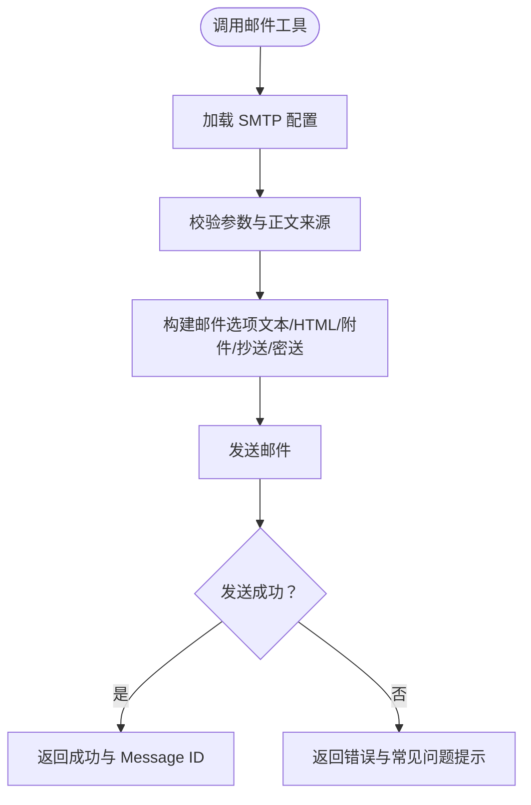

**图表来源**
- [email-tool.ts](file://src/main/tools/email-tool.ts)

**章节来源**
- [email-tool.ts](file://src/main/tools/email-tool.ts)

### 环境检查工具
- 功能概述：检查系统环境依赖（如 Python），并将结果保存到数据库；支持刷新环境变量。
- 参数与返回：
  - action: check（检查环境）、get_status（获取状态）、refresh（刷新环境变量）
  - 返回安装状态、版本、路径、错误信息等
- 安全机制：将 Python 路径添加到 PATH，确保命令可执行。
- 使用场景：依赖检测、环境诊断、路径修复。

**章节来源**
- [environment-check-tool.ts](file://src/main/tools/environment-check-tool.ts)

### 命令执行工具
- 功能概述：执行 shell 命令，统一超时控制（120 秒），危险命令拦截，输出截断，路径安全检查。
- 参数与返回：
  - command（必需）、env（可选，动态注入完整环境变量）
  - 返回命令执行状态、输出（必要时截断）、成功提示（无输出时）
- 安全机制：
  - 黑名单与正则匹配拦截危险命令
  - 严格路径安全检查（assertPathAllowed）
  - Windows 中文编码处理（chcp 65001 + iconv-lite 转码）
- 使用场景：系统运维、脚本执行、环境诊断。

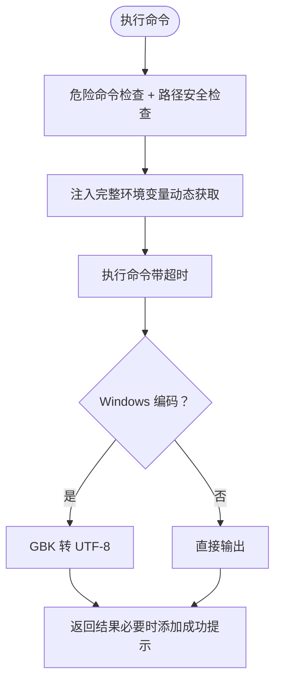

**图表来源**
- [exec-tool.ts](file://src/main/tools/exec-tool.ts)

**章节来源**
- [exec-tool.ts](file://src/main/tools/exec-tool.ts)

### 飞书文档工具
- 功能概述：操作飞书云文档（docx），支持创建、读取、获取块、更新块、删除块、添加评论、删除文件、下载云空间文件、插入丰富格式内容与嵌套块。
- 参数与返回：
  - 创建：title、folder_token（可选）
  - 读取：document_id
  - 获取块：document_id
  - 更新块：document_id、block_id、content
  - 删除块：document_id、parent_block_id（可选）、start_index、end_index
  - 添加评论：document_id、content
  - 删除文件：document_id
  - 下载文件：file_token、file_name（可选）
- 安全与缓存：使用 appId/appSecret 作为缓存 key，配置变更时自动重建客户端实例。
- 使用场景：文档自动化、知识管理、报告生成。

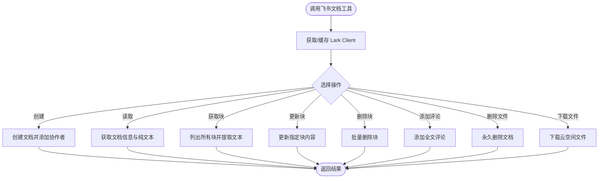

**图表来源**
- [feishu-doc-tool.ts](file://src/main/tools/feishu-doc-tool.ts)

**章节来源**
- [feishu-doc-tool.ts](file://src/main/tools/feishu-doc-tool.ts)

### 文件工具
- 功能概述：文件系统操作（读取、写入、编辑），支持 Claude 风格参数规范化与安全路径检查。
- 参数与返回：
  - 读取：path（file_path）、返回文件存在性与大小信息（避免传输大文件）
  - 写入：path、内容
  - 编辑：path、oldText、newText
- 安全机制：assertPathAllowed 严格限制访问范围，避免越权访问。
- 使用场景：文件读写、内容编辑、路径安全检查。

**章节来源**
- [file-tool.ts](file://src/main/tools/file-tool.ts)

### 图片生成工具
- 功能概述：多提供商图片生成工具，支持 Gemini 与 Qwen 图像模型；可选参考图片、宽高比、分辨率、输出路径。
- 参数与返回：
  - action: generate（默认）、analyze（解析图片生成提示词）
  - generate：prompt、aspectRatio、resolution、referenceImages（最多5张）、outputPath（可选）
  - analyze：imagePath、analysisPrompt（可选）
  - 返回保存路径、尺寸、提供商信息等
- 使用场景：图像生成、图片解析、风格参考。

**章节来源**
- [image-generation-tool.ts](file://src/main/tools/image-generation-tool.ts)

### 记忆工具
- 功能概述：管理智能体的核心记忆，支持读取、更新（通过大模型提炼）、合并指定 Tab 的记忆；自动分类与去重。
- 参数与返回：
  - action: read、update、merge
  - update：userMessage（必需）、context（可选）、updateMainMemory（可选）
  - merge：sourceTabName（可选，默认主记忆）
- 安全与限制：记忆文件最大 20000 字符；严格禁止记录任何名字相关信息。
- 使用场景：长期记忆、上下文增强、跨 Tab 记忆同步。

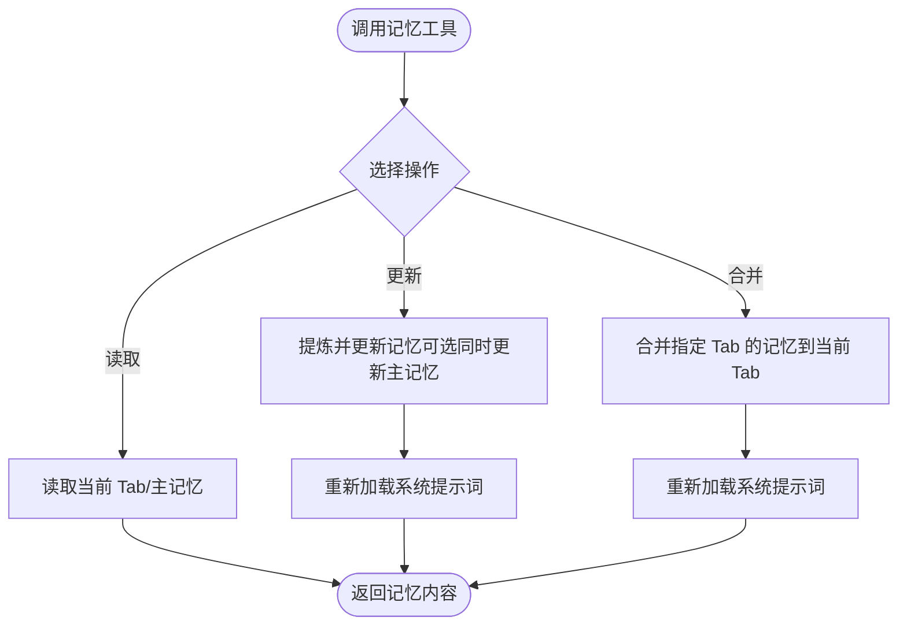

**图表来源**
- [memory-tool.ts](file://src/main/tools/memory-tool.ts)

**章节来源**
- [memory-tool.ts](file://src/main/tools/memory-tool.ts)

### 定时任务工具
- 功能概述：创建、管理与执行定时任务，支持一次性、间隔重复、Cron 表达式；支持暂停/恢复、手动触发、查看执行历史。
- 参数与返回：
  - create：name、description、schedule（type、executeAt/intervalMs/cronExpr、timezone、maxRuns）
  - list：enabled（可选）
  - delete/pause/resume/trigger/history：taskId（必需）、limit（可选）
  - update/updateSchedule：taskId、description/scheduleText
- 安全与限制：最多 10 个任务；Cron 表达式格式校验；最短间隔 10 秒。
- 使用场景：定期报告、数据同步、周期性维护。

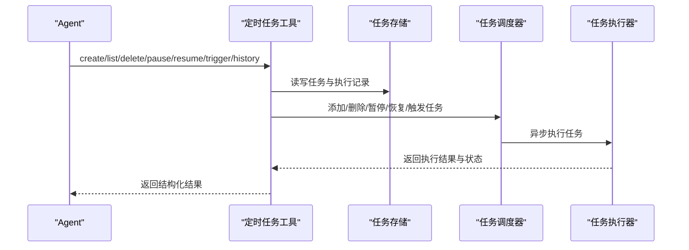

**图表来源**
- [scheduled-task-tool.ts](file://src/main/tools/scheduled-task-tool.ts)

**章节来源**
- [scheduled-task-tool.ts](file://src/main/tools/scheduled-task-tool.ts)

### Web 获取工具
- 功能概述：从 URL 获取网页内容并提取主要内容，转换为 Markdown 格式；支持 full、truncated、selective 三种模式。
- 参数与返回：
  - url（必需）、mode（可选，默认 truncated）、searchPhrase（selective 模式必需）
  - 返回标题、URL、模式、长度、截断标志与内容
- 安全与防护：SSRF 防护（禁止访问内网）、HTML 清理、不可见字符过滤、超时控制。
- 使用场景：内容抓取、信息摘要、特定内容检索。

**章节来源**
- [web-fetch-tool.ts](file://src/main/tools/web-fetch-tool.ts)

### Web 搜索工具
- 功能概述：提供 Web 搜索能力，支持多种搜索引擎配置与结果解析。
- 参数与返回：搜索关键词、结果数量、过滤条件等（具体参数以实现为准）。
- 使用场景：信息检索、竞品分析、知识获取。

**章节来源**
- [web-search-tool.ts](file://src/main/tools/web-search-tool.ts)

## 依赖分析
- 工具接口与注册：所有工具共享统一的 ToolPlugin 接口与注册机制，确保一致性与可扩展性。
- 工具命名：统一维护在 tool-names.ts，避免硬编码与命名冲突。
- 工具加载：通过 tool-loader.ts 动态加载工具插件，支持按需启用/禁用。
- 外部依赖：部分工具依赖第三方库（如 nodemailer、@larksuiteoapi/node-sdk、linkedom、@mozilla/readability 等），采用动态导入与缓存策略，减少打包体积与启动时间。

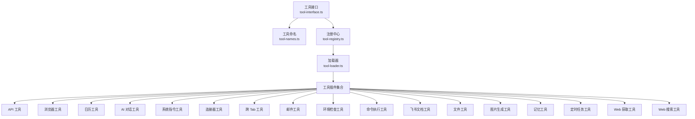

**图表来源**
- [tool-interface.ts](file://src/main/tools/registry/tool-interface.ts)
- [tool-names.ts](file://src/main/tools/tool-names.ts)
- [tool-registry.ts](file://src/main/tools/registry/tool-registry.ts)
- [tool-loader.ts](file://src/main/tools/registry/tool-loader.ts)

**章节来源**
- [tool-interface.ts](file://src/main/tools/registry/tool-interface.ts)
- [tool-names.ts](file://src/main/tools/tool-names.ts)
- [tool-registry.ts](file://src/main/tools/registry/tool-registry.ts)
- [tool-loader.ts](file://src/main/tools/registry/tool-loader.ts)

## 性能考虑
- 流式输出：AI 对话工具支持流式增量返回，提升用户体验与响应速度。
- 分段处理：长文本自动分段，避免超出模型上下文窗口；合理设置分段大小与重叠。
- 超时控制：命令执行工具统一超时（120 秒），Web 获取工具与 HTTP 请求设置超时，防止长时间阻塞。
- 缓存与懒加载：飞书文档工具缓存 Lark Client，工具加载器动态导入依赖，降低启动成本。
- 路径安全：严格路径检查与白名单机制，避免不必要的 I/O 与潜在风险。

## 故障排除指南
- 浏览器工具
  - 症状：无法连接 Chrome/Chromium
  - 处理：检查 CDP 端口占用；Docker 模式确认 Playwright 已安装；非 Docker 模式确认 Chrome 启动参数与用户数据目录。
- 日历工具
  - 症状：权限不足
  - 处理：在系统偏好设置 > 安全性与隐私 > 隐私 > 自动化中允许 DeepBot 控制 Calendar.app。
- 邮件工具
  - 症状：认证失败/连接超时
  - 处理：检查 SMTP 服务是否开启、密码是否为授权码、网络连接与防火墙设置。
- 命令执行工具
  - 症状：危险命令被拦截/路径不安全
  - 处理：检查命令是否在黑名单或匹配危险模式；确认路径在允许范围内。
- 飞书文档工具
  - 症状：连接器未配置/Client 缓存失效
  - 处理：确认 appId/appSecret 配置；配置变更后自动重建缓存。
- Web 获取工具
  - 症状：SSRF 防护拦截/内容为空
  - 处理：检查 URL 协议与内网地址；确认响应内容与超时设置。
- 记忆工具
  - 症状：内存文件损坏/长度超限
  - 处理：检查文件完整性；确保总长度不超过 20000 字符。
- 定时任务工具
  - 症状：任务无法启动/调度器启动失败
  - 处理：检查数据库初始化完成情况；重试启动调度器；确认任务数量限制。

**章节来源**
- [browser-tool.ts](file://src/main/tools/browser-tool.ts)
- [calendar-tool.ts](file://src/main/tools/calendar-tool.ts)
- [email-tool.ts](file://src/main/tools/email-tool.ts)
- [exec-tool.ts](file://src/main/tools/exec-tool.ts)
- [feishu-doc-tool.ts](file://src/main/tools/feishu-doc-tool.ts)
- [web-fetch-tool.ts](file://src/main/tools/web-fetch-tool.ts)
- [memory-tool.ts](file://src/main/tools/memory-tool.ts)
- [scheduled-task-tool.ts](file://src/main/tools/scheduled-task-tool.ts)

## 结论
DeepBot 内置工具系统通过统一接口、注册中心与安全机制，实现了高度可扩展、可观测与易维护的工具生态。开发者可基于现有接口快速扩展新工具，同时遵循统一的安全与性能约束，确保系统稳定与可靠。

## 附录
- 工具扩展指南
  - 实现 ToolPlugin 接口，定义 metadata 与 create 回调
  - 在 create 中返回工具方法数组，每个方法包含 name、label、description、parameters 与 execute
  - 在工具内部实现安全检查、参数校验与错误处理
  - 通过工具注册中心注册工具，支持按需启用/禁用
- 最佳实践
  - 严格遵循参数 Schema，避免硬编码
  - 在工具中实现超时控制与资源释放
  - 使用统一的错误处理与日志记录
  - 对外部依赖采用动态导入与缓存策略
  - 对敏感操作（如命令执行、文件写入、网络请求）实施安全检查