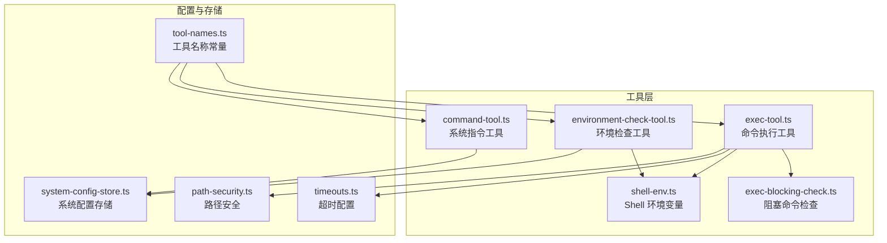
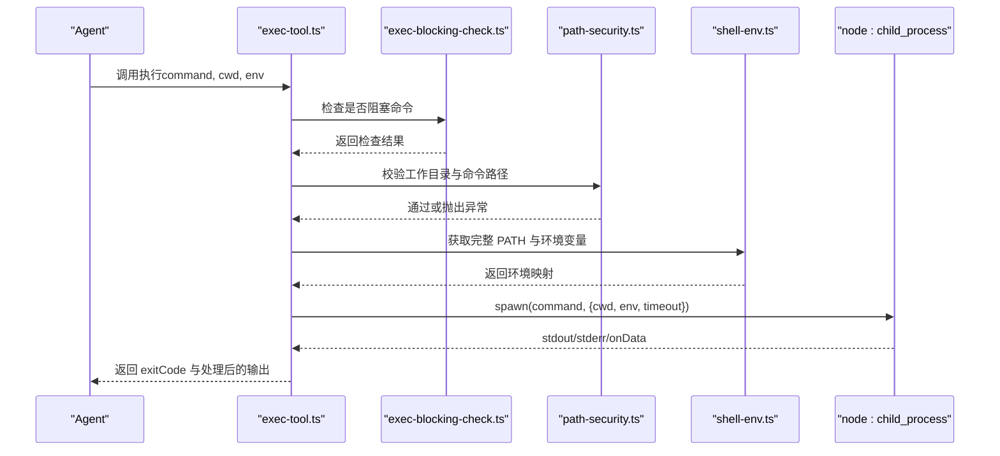
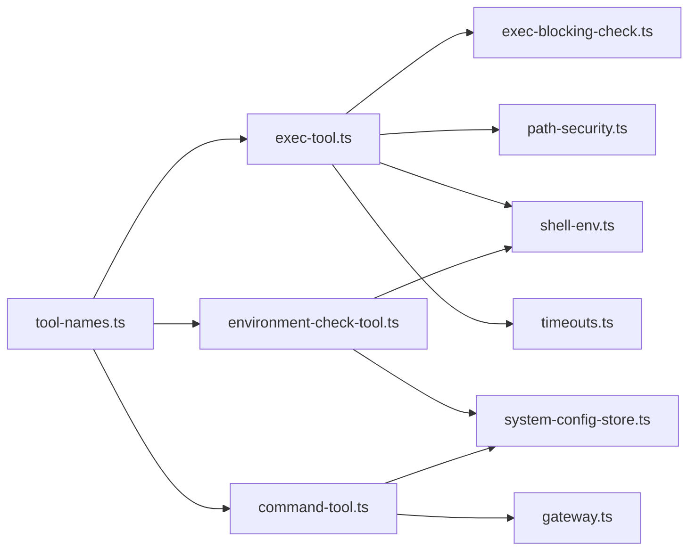

# 命令执行工具

<cite>
**本文引用的文件**
- [exec-tool.ts](file://src/main/tools/exec-tool.ts)
- [environment-check-tool.ts](file://src/main/tools/environment-check-tool.ts)
- [exec-blocking-check.ts](file://src/main/tools/exec-blocking-check.ts)
- [shell-env.ts](file://src/main/tools/shell-env.ts)
- [timeouts.ts](file://src/main/config/timeouts.ts)
- [path-security.ts](file://src/main/utils/path-security.ts)
- [system-config-store.ts](file://src/main/database/system-config-store.ts)
- [TOOL_NAMES.ts](file://src/main/tools/tool-names.ts)
- [command-tool.ts](file://src/main/tools/command-tool.ts)
</cite>

## 目录
1. [简介](#简介)
2. [项目结构](#项目结构)
3. [核心组件](#核心组件)
4. [架构总览](#架构总览)
5. [组件详解](#组件详解)
6. [依赖关系分析](#依赖关系分析)
7. [性能与超时配置](#性能与超时配置)
8. [故障排查指南](#故障排查指南)
9. [结论](#结论)
10. [附录](#附录)

## 简介
本文件面向 史丽慧小助理 的命令执行工具链，系统性阐述以下能力：
- 命令行执行：基于外部 Bash 工具封装，统一超时、输出处理与安全检查。
- 环境变量管理：从登录 Shell 动态获取完整 PATH 与环境变量，解决 Electron 主进程变量不完整问题，并支持缓存与刷新。
- 执行阻塞检查：识别并拦截会阻塞等待用户输入的交互式命令，提供替代建议。
- 安全机制：危险命令黑名单与模式匹配、路径白名单与严格路径检查、工作目录安全校验、Windows 中文编码处理。
- API 接口与参数：工具的输入参数、执行流程、返回结构与错误处理。
- 最佳实践与常见问题：安全执行建议、常见错误与排障步骤。

## 项目结构
命令执行相关模块位于 src/main/tools 下，围绕 exec-tool.ts 为核心，配合环境变量工具、阻塞检查工具与路径安全工具协同工作；超时配置集中于 config/timeouts.ts；环境状态持久化于 system-config-store.ts。

**图表来源**
- [exec-tool.ts:1-529](file://src/main/tools/exec-tool.ts#L1-L529)
- [exec-blocking-check.ts:1-130](file://src/main/tools/exec-blocking-check.ts#L1-L130)
- [shell-env.ts:1-417](file://src/main/tools/shell-env.ts#L1-L417)
- [environment-check-tool.ts:1-318](file://src/main/tools/environment-check-tool.ts#L1-L318)
- [timeouts.ts:1-78](file://src/main/config/timeouts.ts#L1-L78)
- [path-security.ts:1-118](file://src/main/utils/path-security.ts#L1-L118)
- [system-config-store.ts:1-200](file://src/main/database/system-config-store.ts#L1-L200)
- [tool-names.ts:1-106](file://src/main/tools/tool-names.ts#L1-L106)
- [command-tool.ts:1-157](file://src/main/tools/command-tool.ts#L1-L157)

**章节来源**
- [exec-tool.ts:1-529](file://src/main/tools/exec-tool.ts#L1-L529)
- [environment-check-tool.ts:1-318](file://src/main/tools/environment-check-tool.ts#L1-L318)
- [exec-blocking-check.ts:1-130](file://src/main/tools/exec-blocking-check.ts#L1-L130)
- [shell-env.ts:1-417](file://src/main/tools/shell-env.ts#L1-L417)
- [timeouts.ts:1-78](file://src/main/config/timeouts.ts#L1-L78)
- [path-security.ts:1-118](file://src/main/utils/path-security.ts#L1-L118)
- [system-config-store.ts:1-200](file://src/main/database/system-config-store.ts#L1-L200)
- [tool-names.ts:1-106](file://src/main/tools/tool-names.ts#L1-L106)
- [command-tool.ts:1-157](file://src/main/tools/command-tool.ts#L1-L157)

## 核心组件
- 命令执行工具（exec-tool.ts）
  - 基于外部 Bash 工具封装，统一超时（EXEC_TOOL_TIMEOUT）、危险命令拦截、路径安全检查、输出编码处理与空输出提示增强。
  - 动态导入外部模块，包装执行函数，注入阻塞命令检查、工作目录与命令路径安全校验、环境变量注入与 Windows 中文编码处理。
- 环境检查工具（environment-check-tool.ts）
  - 检查 Python（兼容 python3 与 python）是否存在、版本与路径，将结果持久化至系统配置存储，并在必要时将 Python 目录追加到 PATH。
  - 支持刷新环境变量缓存与获取当前状态。
- 阻塞命令检查（exec-blocking-check.ts）
  - 识别会阻塞等待用户输入的交互式命令（如 vim、top、ssh、REPL 等），并提供替代建议。
- Shell 环境变量工具（shell-env.ts）
  - 从登录 Shell 获取完整 PATH 与环境变量，支持缓存与重置；在 macOS 通过登录 shell 加载 .zshrc 等配置；Windows 直接使用当前环境。
- 路径安全工具（path-security.ts）
  - 统一的路径白名单与严格检查，确保只能访问工作区、脚本、Skill、图片、记忆、会话等受控目录。
- 超时配置（timeouts.ts）
  - 统一管理各工具超时，exec-tool 使用 EXEC_TOOL_TIMEOUT（默认 120 秒），环境检查使用 COMMAND_EXECUTION_TIMEOUT（默认 5 秒）。
- 系统指令工具（command-tool.ts）
  - 处理系统级指令（如 /new 清空会话历史），并与 Gateway、SessionManager、BrowserWindow 协同更新 UI。

**章节来源**
- [exec-tool.ts:1-529](file://src/main/tools/exec-tool.ts#L1-L529)
- [environment-check-tool.ts:1-318](file://src/main/tools/environment-check-tool.ts#L1-L318)
- [exec-blocking-check.ts:1-130](file://src/main/tools/exec-blocking-check.ts#L1-L130)
- [shell-env.ts:1-417](file://src/main/tools/shell-env.ts#L1-L417)
- [timeouts.ts:1-78](file://src/main/config/timeouts.ts#L1-L78)
- [path-security.ts:1-118](file://src/main/utils/path-security.ts#L1-L118)
- [command-tool.ts:1-157](file://src/main/tools/command-tool.ts#L1-L157)

## 架构总览
命令执行工具链通过“工具封装 + 安全检查 + 环境注入 + 超时控制”的方式，形成闭环的安全执行通道。

**图表来源**
- [exec-tool.ts:392-528](file://src/main/tools/exec-tool.ts#L392-L528)
- [exec-blocking-check.ts:44-95](file://src/main/tools/exec-blocking-check.ts#L44-L95)
- [path-security.ts:91-117](file://src/main/utils/path-security.ts#L91-L117)
- [shell-env.ts:355-416](file://src/main/tools/shell-env.ts#L355-L416)

## 组件详解

### 命令执行工具（exec-tool.ts）
- 职责
  - 执行 shell 命令，统一超时控制（EXEC_TOOL_TIMEOUT）。
  - 危险命令拦截（黑名单 + 正则模式）。
  - 路径安全检查（严格模式，白名单 + 前缀白名单 + assertPathAllowed）。
  - 输出编码处理（Windows 使用 GBK -> UTF-8 转换）。
  - 空输出提示增强（无输出且无错误时提示“命令执行成功（无输出）”）。
  - 注入完整 Shell 环境变量（登录 shell 获取 + 配置文件补充 + 缓存）。
  - Windows 中文编码处理（设置 CHCP=65001 并在命令前添加 chcp 65001）。
- 关键实现点
  - 动态导入外部 Bash 工具，包装 operations.exec，注入阻塞命令检查、路径安全检查、环境变量注入与超时控制。
  - wrapToolWithSecurity 对工具 execute 进行二次包装，统一安全与环境处理。
  - getExecTools 返回封装后的 AgentTool 数组，供工具注册中心使用。
- API 与参数
  - 输入参数：command（必填），env（可选，未提供时自动注入完整环境变量）。
  - 返回结构：包含 exitCode 的执行结果，以及经处理的输出内容。
- 安全机制
  - 危险命令黑名单与正则匹配。
  - 路径白名单（系统设备文件、系统目录前缀、临时目录环境变量扩展）。
  - 严格路径检查（assertPathAllowed）。
  - 工作目录严格检查（assertPathAllowed）。
- 示例（代码片段路径）
  - 创建工具：[getExecTools:392-528](file://src/main/tools/exec-tool.ts#L392-L528)
  - 包装执行：[wrapToolWithSecurity:317-376](file://src/main/tools/exec-tool.ts#L317-L376)
  - 阻塞命令检查：[isBlockingInteractiveCommand:44-95](file://src/main/tools/exec-blocking-check.ts#L44-L95)
  - 路径安全检查：[checkCommandPathSecurity:88-281](file://src/main/tools/exec-tool.ts#L88-L281)
  - 环境变量注入：[getShellEnvFromLoginShell:355-416](file://src/main/tools/shell-env.ts#L355-L416)
  - 超时控制：[TIMEOUTS.EXEC_TOOL_TIMEOUT](file://src/main/config/timeouts.ts#L36)

**章节来源**
- [exec-tool.ts:1-529](file://src/main/tools/exec-tool.ts#L1-L529)
- [exec-blocking-check.ts:1-130](file://src/main/tools/exec-blocking-check.ts#L1-L130)
- [shell-env.ts:1-417](file://src/main/tools/shell-env.ts#L1-L417)
- [timeouts.ts:1-78](file://src/main/config/timeouts.ts#L1-L78)
- [path-security.ts:1-118](file://src/main/utils/path-security.ts#L1-L118)

### 环境检查工具（environment-check-tool.ts）
- 职责
  - 检查 Python（优先 python3，其次 python）是否存在、版本与路径。
  - 将检查结果保存到系统配置存储（environment_config 表）。
  - 在必要时将 Python 目录追加到 PATH，确保后续工具可直接调用。
  - 支持刷新环境变量缓存与获取当前状态。
- 关键实现点
  - 使用 getShellPathFromLoginShell 获取合并后的 PATH，确保包含用户自定义 PATH。
  - 使用 which/where 与 --version 获取路径与版本信息。
  - 通过 SystemConfigStore 保存环境状态。
  - 支持 refresh 操作重置 shell 环境缓存。
- API 与参数
  - action: check | get_status | refresh。
  - 返回结构：content.text 为人类可读消息，details 中包含 success、data、message 等。
- 示例（代码片段路径）
  - 获取 PATH：[getFullPath:21-31](file://src/main/tools/environment-check-tool.ts#L21-L31)
  - 检查命令：[checkCommand:36-69](file://src/main/tools/environment-check-tool.ts#L36-L69)
  - 检查 Python：[checkPython:74-99](file://src/main/tools/environment-check-tool.ts#L74-L99)
  - 执行逻辑：[execute:118-315](file://src/main/tools/environment-check-tool.ts#L118-L315)
  - 保存配置：[saveEnvironmentConfig:1-200](file://src/main/database/system-config-store.ts#L1-L200)

**章节来源**
- [environment-check-tool.ts:1-318](file://src/main/tools/environment-check-tool.ts#L1-L318)
- [shell-env.ts:284-327](file://src/main/tools/shell-env.ts#L284-L327)
- [system-config-store.ts:1-200](file://src/main/database/system-config-store.ts#L1-L200)

### 阻塞命令检查（exec-blocking-check.ts）
- 职责
  - 识别会阻塞等待用户输入的交互式命令，如 vim、top、ssh、REPL 等。
  - 提供友好的错误提示与替代方案。
- 关键实现点
  - 黑名单命令集合与特殊规则（如编辑器 + 文件名视为阻塞；REPL 无参数视为阻塞；监控工具总是阻塞）。
  - isBlockingInteractiveCommand 返回布尔值；getBlockingCommandSuggestion 返回建议文本。
- 示例（代码片段路径）
  - 阻塞命令列表：[BLOCKING_INTERACTIVE_COMMANDS:18-36](file://src/main/tools/exec-blocking-check.ts#L18-L36)
  - 检查逻辑：[isBlockingInteractiveCommand:44-95](file://src/main/tools/exec-blocking-check.ts#L44-L95)
  - 建议文案：[getBlockingCommandSuggestion:103-129](file://src/main/tools/exec-blocking-check.ts#L103-L129)

**章节来源**
- [exec-blocking-check.ts:1-130](file://src/main/tools/exec-blocking-check.ts#L1-L130)

### Shell 环境变量工具（shell-env.ts）
- 职责
  - 从登录 Shell 获取完整 PATH 与环境变量，解决 Electron 主进程变量不完整问题。
  - 支持缓存与重置缓存（/reload-env）。
  - 解析配置文件（.zshrc/.bashrc/.profile 等）补充环境变量与 PATH。
  - Windows 直接使用当前环境变量。
- 关键实现点
  - getShellPathFromLoginShell：执行 shell -l -c env -0，解析输出，合并配置文件 PATH。
  - getShellEnvFromLoginShell：执行 shell -l -c env -0，解析输出，补充配置文件变量，确保 PATH 合并。
  - resetShellPathCache：重置缓存，支持 /reload-env 刷新。
- 示例（代码片段路径）
  - 获取 PATH：[getShellPathFromLoginShell:284-327](file://src/main/tools/shell-env.ts#L284-L327)
  - 获取环境变量：[getShellEnvFromLoginShell:355-416](file://src/main/tools/shell-env.ts#L355-L416)
  - 重置缓存：[resetShellPathCache:332-336](file://src/main/tools/shell-env.ts#L332-L336)

**章节来源**
- [shell-env.ts:1-417](file://src/main/tools/shell-env.ts#L1-L417)

### 路径安全工具（path-security.ts）
- 职责
  - 统一的路径白名单与严格检查，确保只能访问工作区、脚本、Skill、图片、记忆、会话等受控目录。
- 关键实现点
  - getAllowedDirectories：聚合工作目录、脚本目录、Skill 目录、图片、记忆、会话等绝对路径。
  - isPathAllowed/assertPathAllowed：规范化路径后判断是否在允许范围内，不满足时抛出异常。
- 示例（代码片段路径）
  - 获取允许目录：[getAllowedDirectories:29-45](file://src/main/utils/path-security.ts#L29-L45)
  - 路径断言：[assertPathAllowed:91-117](file://src/main/utils/path-security.ts#L91-L117)

**章节来源**
- [path-security.ts:1-118](file://src/main/utils/path-security.ts#L1-L118)

### 系统指令工具（command-tool.ts）
- 职责
  - 处理系统级指令（如 /new 清空会话历史），并与会话管理、网关与前端通信。
- 关键实现点
  - handleNewCommand：清空会话历史、重置 AgentRuntime、通知前端清空 UI。
- 示例（代码片段路径）
  - 指令处理：[handleNewCommand:84-156](file://src/main/tools/command-tool.ts#L84-L156)

**章节来源**
- [command-tool.ts:1-157](file://src/main/tools/command-tool.ts#L1-L157)

## 依赖关系分析

**图表来源**
- [exec-tool.ts:29-34](file://src/main/tools/exec-tool.ts#L29-L34)
- [environment-check-tool.ts:14-14](file://src/main/tools/environment-check-tool.ts#L14-L14)
- [command-tool.ts:102-109](file://src/main/tools/command-tool.ts#L102-L109)
- [tool-names.ts:8-94](file://src/main/tools/tool-names.ts#L8-L94)

**章节来源**
- [exec-tool.ts:1-529](file://src/main/tools/exec-tool.ts#L1-L529)
- [environment-check-tool.ts:1-318](file://src/main/tools/environment-check-tool.ts#L1-L318)
- [command-tool.ts:1-157](file://src/main/tools/command-tool.ts#L1-L157)
- [tool-names.ts:1-106](file://src/main/tools/tool-names.ts#L1-L106)

## 性能与超时配置
- exec-tool 使用统一超时（EXEC_TOOL_TIMEOUT，默认 120 秒），通过 child_process.spawn 的 timeout 选项实现软超时（结合 AbortSignal）。
- 环境检查使用 COMMAND_EXECUTION_TIMEOUT（默认 5 秒），避免长时间阻塞。
- 超时配置集中于 timeouts.ts，可通过环境变量覆盖部分配置项。
- 建议
  - 对可能长时间运行的命令，优先使用定时任务工具而非 exec-tool。
  - 在 Windows 上注意中文编码转换带来的额外开销，尽量减少大体积输出。

**章节来源**
- [timeouts.ts:1-78](file://src/main/config/timeouts.ts#L1-L78)
- [exec-tool.ts:442-453](file://src/main/tools/exec-tool.ts#L442-L453)

## 故障排查指南
- 危险命令被拦截
  - 现象：执行报错“危险命令被拦截”。
  - 处理：检查命令是否命中黑名单或危险模式，改用非交互式命令或明确参数。
  - 参考：[isDangerousCommand:288-306](file://src/main/tools/exec-tool.ts#L288-L306)
- 阻塞命令被拦截
  - 现象：执行报错“命令被拦截：...是交互式命令，会阻塞等待用户输入”。
  - 处理：根据建议使用非交互式命令替代（如 cat/head/tail 查看文件，ps aux 替代 top）。
  - 参考：[getBlockingCommandSuggestion:103-129](file://src/main/tools/exec-blocking-check.ts#L103-L129)
- 路径访问受限
  - 现象：抛出“安全限制：只能访问配置的目录及其子目录内的文件”。
  - 处理：确认命令涉及的路径在允许目录内，或在系统设置中调整工作目录。
  - 参考：[assertPathAllowed:91-117](file://src/main/utils/path-security.ts#L91-L117)
- 环境变量不完整
  - 现象：某些自定义环境变量（如 API_KEY）缺失导致命令失败。
  - 处理：执行“刷新环境变量”动作，或使用 /reload-env 指令重置缓存后重新检查。
  - 参考：[resetShellPathCache:332-336](file://src/main/tools/shell-env.ts#L332-L336)
- Windows 中文乱码
  - 现象：输出显示乱码。
  - 处理：工具已自动设置 CHCP=65001 并进行 GBK->UTF-8 转换，若仍异常，检查 iconv-lite 是否可用。
  - 参考：[Windows 编码处理:460-498](file://src/main/tools/exec-tool.ts#L460-L498)
- 系统指令 /new 无效
  - 现象：执行 /new 未清空会话。
  - 处理：确认会话 ID 正确，检查会话管理与网关重置逻辑。
  - 参考：[handleNewCommand:84-156](file://src/main/tools/command-tool.ts#L84-L156)

**章节来源**
- [exec-tool.ts:288-306](file://src/main/tools/exec-tool.ts#L288-L306)
- [exec-blocking-check.ts:103-129](file://src/main/tools/exec-blocking-check.ts#L103-L129)
- [path-security.ts:91-117](file://src/main/utils/path-security.ts#L91-L117)
- [shell-env.ts:332-336](file://src/main/tools/shell-env.ts#L332-L336)
- [command-tool.ts:84-156](file://src/main/tools/command-tool.ts#L84-L156)

## 结论
命令执行工具链通过“阻塞命令拦截 + 危险命令过滤 + 路径安全检查 + 登录 Shell 环境注入 + 统一超时控制”的组合拳，实现了在 AI Agent 场景下的安全、可控与可观测的命令执行能力。配合环境检查工具与系统指令工具，可进一步提升开发与运维效率。

## 附录

### API 与参数速查
- exec-tool（命令执行）
  - 输入：command（必填），env（可选，未提供时自动注入完整环境变量）。
  - 返回：包含 exitCode 的执行结果，以及经处理的输出内容。
  - 参考：[getExecTools:392-528](file://src/main/tools/exec-tool.ts#L392-L528)
- environment-check-tool（环境检查）
  - 输入：action ∈ {check, get_status, refresh}。
  - 返回：content.text 为人类可读消息，details.success/data/message。
  - 参考：[execute:118-315](file://src/main/tools/environment-check-tool.ts#L118-L315)
- command-tool（系统指令）
  - 输入：command ∈ {new}。
  - 返回：执行结果与 details。
  - 参考：[handleNewCommand:84-156](file://src/main/tools/command-tool.ts#L84-L156)

### 安全最佳实践
- 优先使用非交互式命令，避免阻塞。
- 严格限制命令路径，确保在允许目录内。
- 使用环境检查工具定期确认依赖可用性。
- 对 Windows 输出进行编码转换，避免乱码。
- 避免执行危险命令（如 rm -rf、mkfs、shutdown 等）。