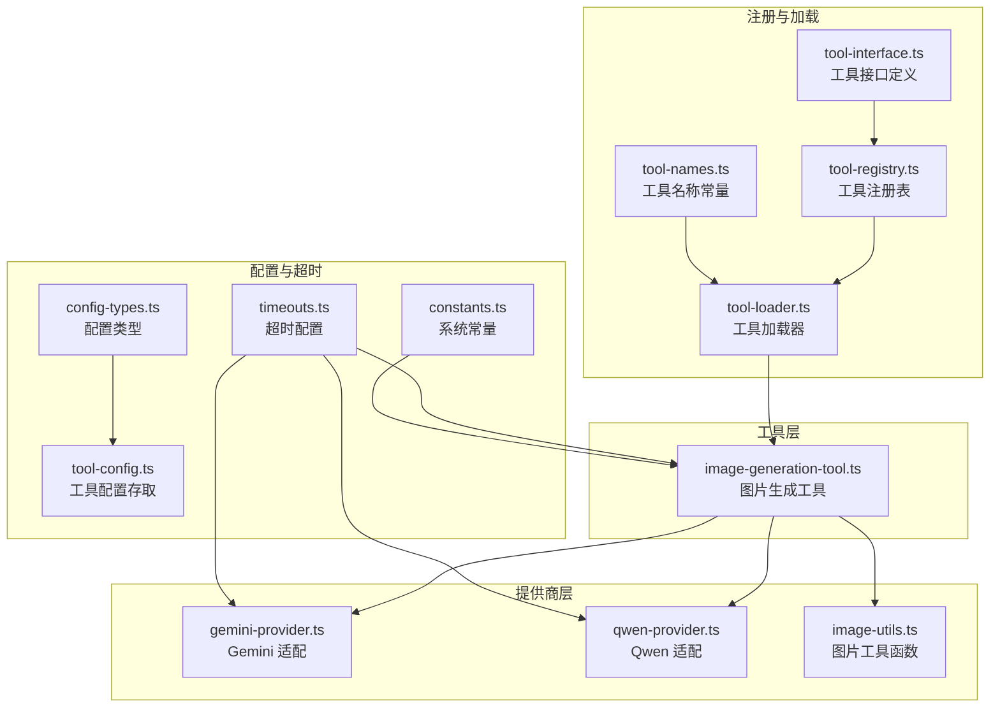
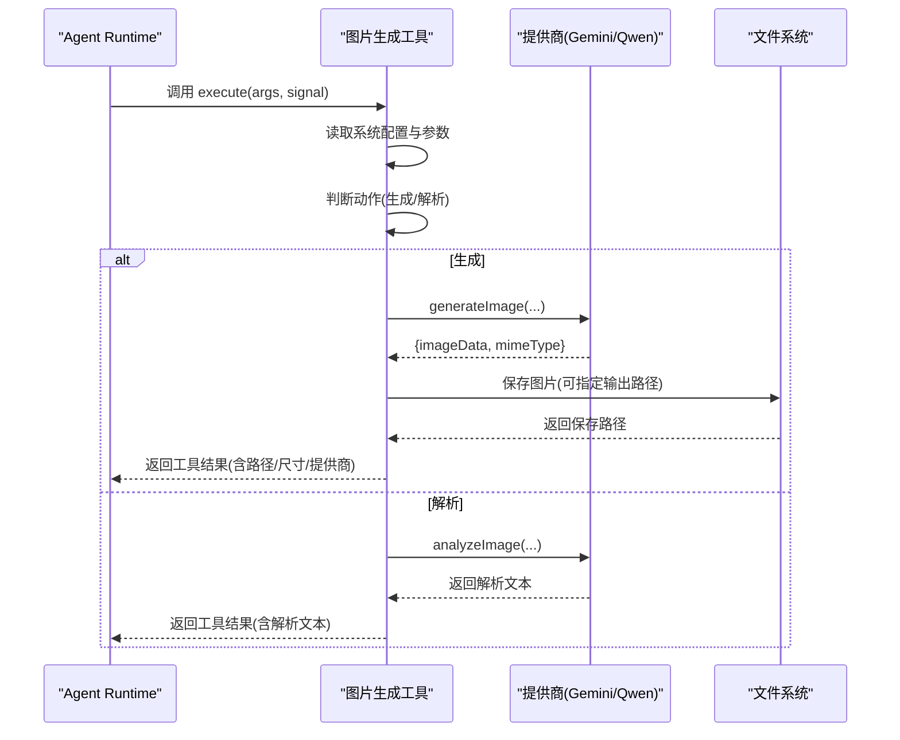
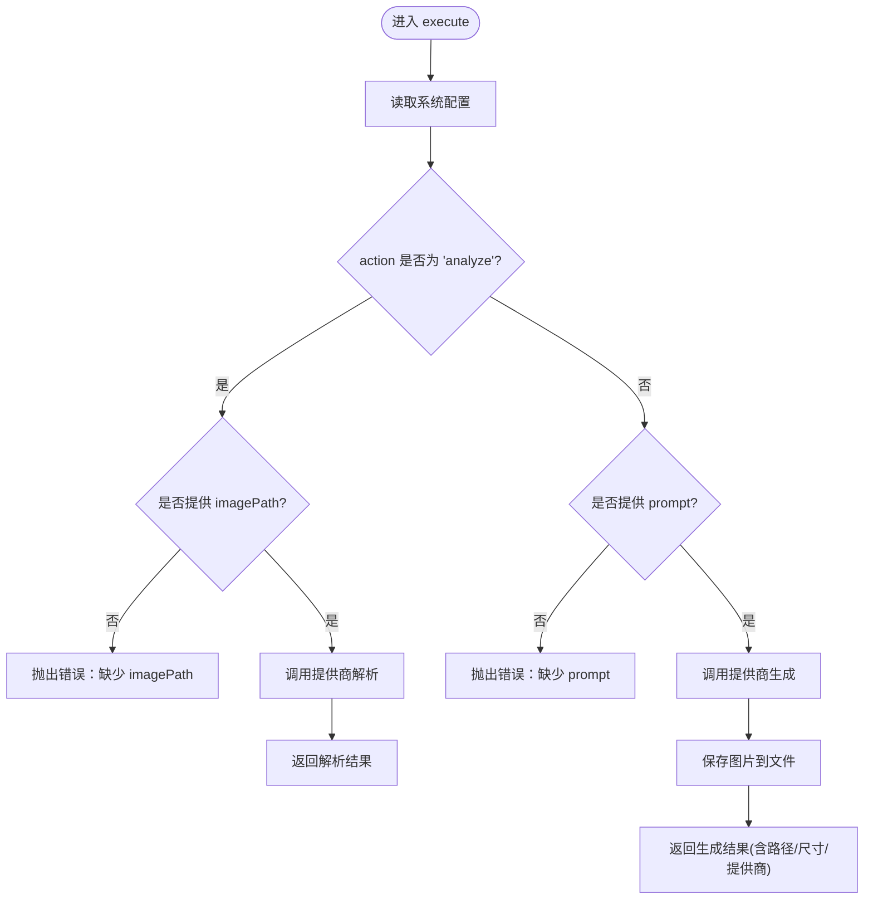
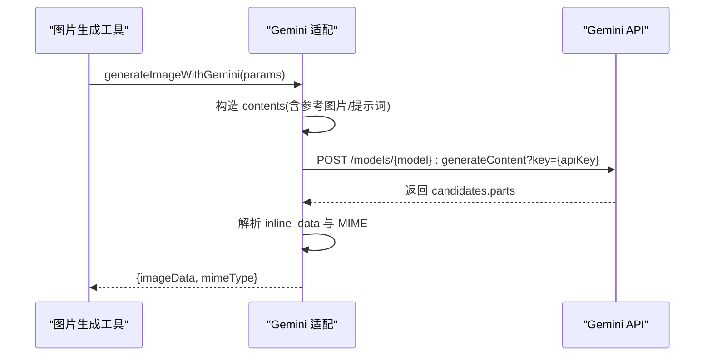
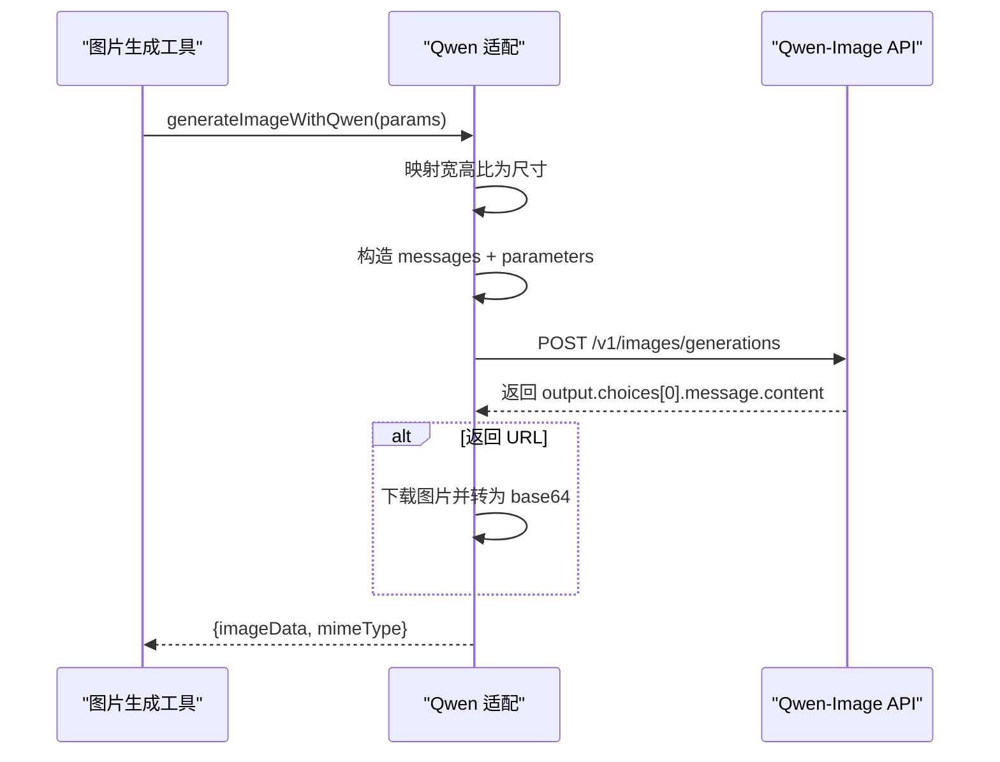
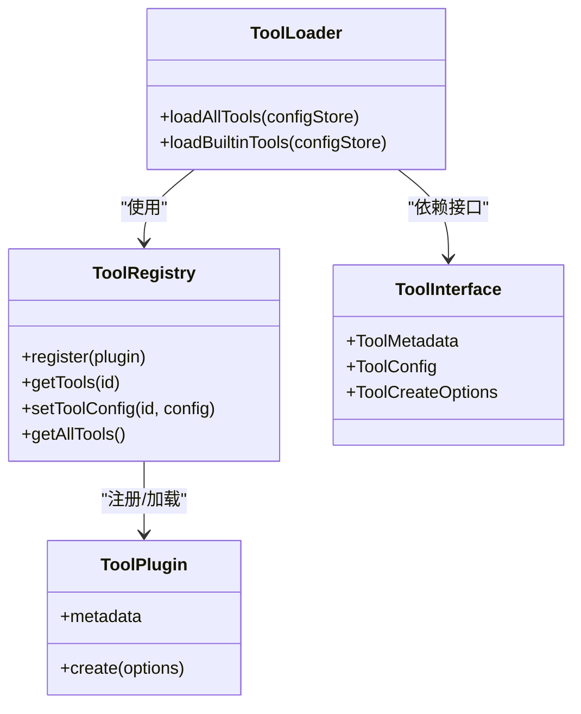
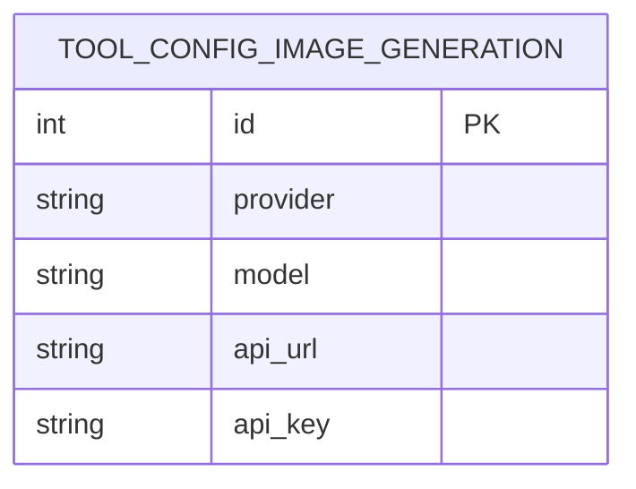
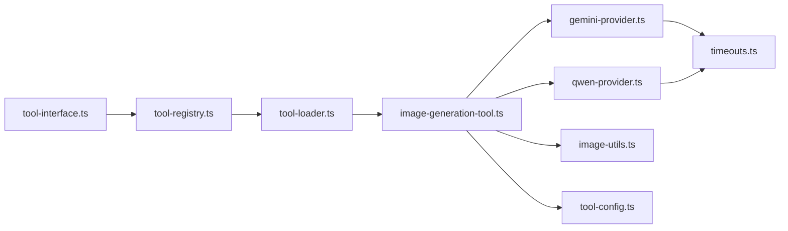

# 图片生成工具

<cite>
**本文引用的文件**
- [image-generation-tool.ts](file://src/main/tools/image-generation-tool.ts)
- [gemini-provider.ts](file://src/main/tools/providers/gemini-provider.ts)
- [qwen-provider.ts](file://src/main/tools/providers/qwen-provider.ts)
- [image-utils.ts](file://src/main/tools/providers/image-utils.ts)
- [tool-loader.ts](file://src/main/tools/registry/tool-loader.ts)
- [tool-registry.ts](file://src/main/tools/registry/tool-registry.ts)
- [tool-interface.ts](file://src/main/tools/registry/tool-interface.ts)
- [tool-names.ts](file://src/main/tools/tool-names.ts)
- [config-types.ts](file://src/main/database/config-types.ts)
- [tool-config.ts](file://src/main/database/tool-config.ts)
- [timeouts.ts](file://src/main/config/timeouts.ts)
- [constants.ts](file://src/main/config/constants.ts)
- [README.md](file://README.md)
</cite>

## 目录
1. [简介](#简介)
2. [项目结构](#项目结构)
3. [核心组件](#核心组件)
4. [架构总览](#架构总览)
5. [详细组件分析](#详细组件分析)
6. [依赖分析](#依赖分析)
7. [性能考虑](#性能考虑)
8. [故障排查指南](#故障排查指南)
9. [结论](#结论)
10. [附录](#附录)

## 简介
本文件面向 DeepBot 的“图片生成工具”，系统性介绍基于 Gemini 与 Qwen 模型的图片生成与图片解析能力，涵盖工具 API、参数配置、模型选择、质量控制与性能优化建议。文档同时提供代码级架构图与流程图，帮助开发者与使用者理解工具的工作原理与最佳实践。

## 项目结构
图片生成工具位于主进程工具体系中，采用“工具 + 提供商 + 工具注册”的分层设计：
- 工具入口：统一的图片生成工具封装，负责参数校验、动作分派、输出保存与错误处理
- 提供商适配：分别对接 Gemini 与 Qwen 的图片生成与解析 API
- 工具注册：通过工具加载器与注册表将工具注入 Agent Runtime

图表来源
- [image-generation-tool.ts:1-364](file://src/main/tools/image-generation-tool.ts#L1-L364)
- [gemini-provider.ts:1-409](file://src/main/tools/providers/gemini-provider.ts#L1-L409)
- [qwen-provider.ts:1-310](file://src/main/tools/providers/qwen-provider.ts#L1-L310)
- [image-utils.ts:1-84](file://src/main/tools/providers/image-utils.ts#L1-L84)
- [tool-loader.ts:1-312](file://src/main/tools/registry/tool-loader.ts#L1-L312)
- [tool-registry.ts:1-328](file://src/main/tools/registry/tool-registry.ts#L1-L328)
- [tool-interface.ts:1-152](file://src/main/tools/registry/tool-interface.ts#L1-L152)
- [tool-names.ts:1-106](file://src/main/tools/tool-names.ts#L1-L106)
- [config-types.ts:1-67](file://src/main/database/config-types.ts#L1-L67)
- [tool-config.ts:1-128](file://src/main/database/tool-config.ts#L1-L128)
- [timeouts.ts:1-78](file://src/main/config/timeouts.ts#L1-L78)
- [constants.ts:1-26](file://src/main/config/constants.ts#L1-L26)

章节来源
- [image-generation-tool.ts:1-364](file://src/main/tools/image-generation-tool.ts#L1-L364)
- [tool-loader.ts:1-312](file://src/main/tools/registry/tool-loader.ts#L1-L312)
- [tool-registry.ts:1-328](file://src/main/tools/registry/tool-registry.ts#L1-L328)
- [tool-interface.ts:1-152](file://src/main/tools/registry/tool-interface.ts#L1-L152)
- [tool-names.ts:1-106](file://src/main/tools/tool-names.ts#L1-L106)
- [config-types.ts:1-67](file://src/main/database/config-types.ts#L1-L67)
- [tool-config.ts:1-128](file://src/main/database/tool-config.ts#L1-L128)
- [timeouts.ts:1-78](file://src/main/config/timeouts.ts#L1-L78)
- [constants.ts:1-26](file://src/main/config/constants.ts#L1-L26)

## 核心组件
- 图片生成工具（AgentTool）
  - 名称与标签：见工具名称常量
  - 参数模式：TypeBox Schema，支持生成与解析两种动作、提示词、宽高比、分辨率、参考图片、输出路径等
  - 执行流程：读取系统配置 → 选择提供商 → 调用生成/解析 → 保存文件 → 返回结果
- 提供商适配
  - Gemini：支持图片生成与图片解析，支持参考图片风格迁移，支持取消信号与超时
  - Qwen：支持图片生成，支持参考图片（最多1张），支持同步 API 与图片下载
- 工具注册与加载
  - 工具加载器按开关加载内置工具，图片生成工具在启用时创建并注入
  - 工具注册表维护插件与工具实例，支持配置与清理
- 配置与工具配置
  - 工具配置类型定义了提供商、模型、API 地址与密钥
  - 工具配置存取提供 SQLite 存储与读取
- 超时与常量
  - 图片生成超时、HTTP 请求超时、命令执行超时等
  - 系统常量用于消息长度、重试次数等

章节来源
- [image-generation-tool.ts:183-364](file://src/main/tools/image-generation-tool.ts#L183-L364)
- [gemini-provider.ts:21-255](file://src/main/tools/providers/gemini-provider.ts#L21-L255)
- [qwen-provider.ts:25-234](file://src/main/tools/providers/qwen-provider.ts#L25-L234)
- [tool-loader.ts:163-167](file://src/main/tools/registry/tool-loader.ts#L163-L167)
- [tool-registry.ts:36-327](file://src/main/tools/registry/tool-registry.ts#L36-L327)
- [config-types.ts:49-66](file://src/main/database/config-types.ts#L49-L66)
- [tool-config.ts:13-66](file://src/main/database/tool-config.ts#L13-L66)
- [timeouts.ts:39-39](file://src/main/config/timeouts.ts#L39-L39)

## 架构总览
图片生成工具的调用链路如下：
- Agent Runtime 调用图片生成工具
- 工具读取系统配置，判断提供商与模型
- 根据动作选择生成或解析
- 生成：调用对应提供商 API，返回 base64 图片数据与 MIME 类型
- 解析：调用提供商图片解析 API，返回文本描述
- 保存：将 base64 数据写入文件，返回保存路径
- 结果：封装为工具结果，包含成功标志、动作、提供商、路径等

图表来源
- [image-generation-tool.ts:189-362](file://src/main/tools/image-generation-tool.ts#L189-L362)
- [gemini-provider.ts:21-255](file://src/main/tools/providers/gemini-provider.ts#L21-L255)
- [qwen-provider.ts:25-234](file://src/main/tools/providers/qwen-provider.ts#L25-L234)

章节来源
- [image-generation-tool.ts:189-362](file://src/main/tools/image-generation-tool.ts#L189-L362)

## 详细组件分析

### 图片生成工具（AgentTool）
- 功能要点
  - 动作：支持“生成”（默认）与“解析”
  - 参数：提示词、宽高比、分辨率、参考图片（最多5张）、输出路径
  - 保存：默认输出目录为用户主目录下的生成图片目录；支持自定义输出路径
  - 错误处理：统一捕获异常，返回标准化错误结果
- 关键流程
  - 配置读取：从系统配置存储读取 API Key、API 地址、模型与提供商
  - 动作分派：根据 action 调用生成或解析
  - 生成：调用提供商生成接口，保存图片，返回路径与元信息
  - 解析：调用提供商解析接口，返回解析文本
- 取消支持：在关键节点检查 AbortSignal，支持用户取消

图表来源
- [image-generation-tool.ts:189-362](file://src/main/tools/image-generation-tool.ts#L189-L362)

章节来源
- [image-generation-tool.ts:28-67](file://src/main/tools/image-generation-tool.ts#L28-L67)
- [image-generation-tool.ts:72-109](file://src/main/tools/image-generation-tool.ts#L72-L109)
- [image-generation-tool.ts:189-362](file://src/main/tools/image-generation-tool.ts#L189-L362)

### Gemini 提供商
- 支持能力
  - 图片生成：支持宽高比与分辨率配置，支持参考图片（最多5张），返回 base64 与 MIME
  - 图片解析：支持自定义提示词，返回文本描述
- 关键实现
  - 请求体构造：contents + generationConfig，支持响应模态与图片配置
  - 取消与超时：通过 AbortSignal 与超时配置，支持软取消
  - 响应解析：兼容 inlineData 字段命名差异，提取图片数据
- 参考图片处理：读取本地图片并转为 base64，最多5张

图表来源
- [gemini-provider.ts:21-255](file://src/main/tools/providers/gemini-provider.ts#L21-L255)

章节来源
- [gemini-provider.ts:21-255](file://src/main/tools/providers/gemini-provider.ts#L21-L255)

### Qwen 提供商
- 支持能力
  - 图片生成：支持宽高比映射到具体尺寸，支持参考图片（最多1张），支持同步 API 与图片下载
  - 图片解析：暂不支持
- 关键实现
  - 请求体：使用新的 Qwen-Image 2.0 API 格式，支持 size、seed 等参数
  - 参考图片：将图片转为 data URI 并拼接到消息内容中
  - 响应处理：支持 URL 下载与 base64 提取
- 取消与超时：通过 AbortSignal 与超时配置，支持软取消

图表来源
- [qwen-provider.ts:25-234](file://src/main/tools/providers/qwen-provider.ts#L25-L234)

章节来源
- [qwen-provider.ts:25-234](file://src/main/tools/providers/qwen-provider.ts#L25-L234)

### 工具注册与加载
- 工具加载器
  - 按开关加载内置工具，图片生成工具在启用时创建
  - 支持从用户目录加载工具配置，用于启用/禁用工具
- 工具注册表
  - 维护插件与工具实例，支持配置、清理与工具列表查询
- 工具接口
  - 定义 ToolPlugin、ToolConfig、ToolCreateOptions 等接口，便于扩展

图表来源
- [tool-loader.ts:57-301](file://src/main/tools/registry/tool-loader.ts#L57-L301)
- [tool-registry.ts:36-327](file://src/main/tools/registry/tool-registry.ts#L36-L327)
- [tool-interface.ts:101-134](file://src/main/tools/registry/tool-interface.ts#L101-L134)

章节来源
- [tool-loader.ts:57-301](file://src/main/tools/registry/tool-loader.ts#L57-L301)
- [tool-registry.ts:36-327](file://src/main/tools/registry/tool-registry.ts#L36-L327)
- [tool-interface.ts:101-134](file://src/main/tools/registry/tool-interface.ts#L101-L134)

### 配置与工具配置
- 配置类型
  - 工具配置：提供商、模型、API 地址、API Key
  - 工作区设置：包含图片目录等
- 工具配置存取
  - 通过 SQLite 存储与读取图片生成工具配置
- 工具名称
  - 统一管理工具名称常量，避免硬编码

图表来源
- [tool-config.ts:13-66](file://src/main/database/tool-config.ts#L13-L66)

章节来源
- [config-types.ts:49-66](file://src/main/database/config-types.ts#L49-L66)
- [tool-config.ts:13-66](file://src/main/database/tool-config.ts#L13-L66)
- [tool-names.ts:28-28](file://src/main/tools/tool-names.ts#L28-L28)

## 依赖分析
- 组件耦合
  - 图片生成工具依赖提供商适配与工具配置存储
  - 提供商适配依赖超时配置与图片工具函数
  - 工具加载器与注册表负责工具生命周期管理
- 外部依赖
  - HTTPS Agent 用于禁用 SSL 验证（开发/代理场景）
  - TypeBox Schema 用于参数校验
  - SQLite 用于工具配置持久化

图表来源
- [image-generation-tool.ts:18-20](file://src/main/tools/image-generation-tool.ts#L18-L20)
- [gemini-provider.ts:9-11](file://src/main/tools/providers/gemini-provider.ts#L9-L11)
- [qwen-provider.ts:13-15](file://src/main/tools/providers/qwen-provider.ts#L13-L15)
- [tool-loader.ts:25-35](file://src/main/tools/registry/tool-loader.ts#L25-L35)
- [tool-registry.ts:30-31](file://src/main/tools/registry/tool-registry.ts#L30-L31)
- [tool-interface.ts:28-29](file://src/main/tools/registry/tool-interface.ts#L28-L29)

章节来源
- [image-generation-tool.ts:18-20](file://src/main/tools/image-generation-tool.ts#L18-L20)
- [gemini-provider.ts:9-11](file://src/main/tools/providers/gemini-provider.ts#L9-L11)
- [qwen-provider.ts:13-15](file://src/main/tools/providers/qwen-provider.ts#L13-L15)
- [tool-loader.ts:25-35](file://src/main/tools/registry/tool-loader.ts#L25-L35)
- [tool-registry.ts:30-31](file://src/main/tools/registry/tool-registry.ts#L30-L31)
- [tool-interface.ts:28-29](file://src/main/tools/registry/tool-interface.ts#L28-L29)

## 性能考虑
- 超时与取消
  - 图片生成超时为 60 秒，HTTP 请求超时为 5 秒，命令执行超时为 5 秒
  - 通过 AbortSignal 支持软取消，避免阻塞主线程
- 取消点
  - 生成与解析请求发送前、参考图片读取过程中、下载图片过程中均检查取消信号
- 取消信号传播
  - 工具执行入口与提供商适配均监听 AbortSignal，及时销毁请求并抛出取消错误
- 资源控制
  - 参考图片数量限制：Gemini 最多 5 张，Qwen 最多 1 张
  - 分辨率与宽高比：Gemini 支持多种比例与 1K/2K/4K；Qwen 通过尺寸映射支持常用比例
- I/O 优化
  - 本地图片读取与 base64 编解码，避免重复 I/O
  - 保存图片时自动创建目录，减少失败重试

章节来源
- [timeouts.ts:39-39](file://src/main/config/timeouts.ts#L39-L39)
- [gemini-provider.ts:34-55](file://src/main/tools/providers/gemini-provider.ts#L34-L55)
- [qwen-provider.ts:87-91](file://src/main/tools/providers/qwen-provider.ts#L87-L91)
- [image-generation-tool.ts:124-131](file://src/main/tools/image-generation-tool.ts#L124-L131)

## 故障排查指南
- 常见错误与定位
  - 未配置工具：检查系统设置中的 API Key、API 地址与模型
  - 未提供必要参数：生成需要 prompt；解析需要 imagePath
  - Qwen 暂不支持解析：解析功能仅 Gemini 支持
  - 取消操作：检查前端是否触发取消，或网络中断导致超时
- 错误返回
  - 工具统一返回标准化错误对象，包含 success=false 与错误信息
- 建议排查步骤
  - 确认提供商与模型匹配：Gemini 支持解析；Qwen 不支持解析
  - 检查网络与超时：适当延长超时或检查代理
  - 检查参考图片路径：确保路径存在且可读
  - 检查输出目录权限：确保可写

章节来源
- [image-generation-tool.ts:340-361](file://src/main/tools/image-generation-tool.ts#L340-L361)
- [gemini-provider.ts:140-208](file://src/main/tools/providers/gemini-provider.ts#L140-L208)
- [qwen-provider.ts:132-187](file://src/main/tools/providers/qwen-provider.ts#L132-L187)

## 结论
DeepBot 的图片生成工具通过统一的 AgentTool 封装与提供商适配，实现了对 Gemini 与 Qwen 的无缝集成。工具具备完善的参数校验、取消支持、错误处理与输出保存能力。在实际使用中，建议根据场景选择合适的提供商与模型，合理设置宽高比与分辨率，并注意参考图片数量与网络超时配置，以获得更稳定与高质量的图片生成体验。

## 附录

### API 与参数说明
- 动作
  - generate：默认动作，生成图片
  - analyze：解析图片生成提示词（仅 Gemini 支持）
- 参数
  - prompt：生成提示词（必填）
  - imagePath：解析图片路径（analyze 时必填）
  - analysisPrompt：自定义解析提示词（可选）
  - aspectRatio：宽高比（默认 16:9）
  - resolution：分辨率（1K/2K/4K，默认 1K）
  - referenceImages：参考图片路径列表（最多5张，Gemini）或最多1张（Qwen）
  - outputPath：输出文件路径（可选）

章节来源
- [image-generation-tool.ts:72-109](file://src/main/tools/image-generation-tool.ts#L72-L109)

### 模型特点与适用场景
- Gemini
  - 特点：支持图片解析、参考图片风格迁移、响应模态多样化
  - 适用：需要解析图片或风格迁移的场景
- Qwen
  - 特点：同步 API、支持参考图片（1张）、生成速度快
  - 适用：快速生成与风格参考的场景

章节来源
- [gemini-provider.ts:1-11](file://src/main/tools/providers/gemini-provider.ts#L1-L11)
- [qwen-provider.ts:1-9](file://src/main/tools/providers/qwen-provider.ts#L1-L9)

### 使用示例（路径指引）
- 生成图片
  - 调用路径：[image-generation-tool.ts:294-304](file://src/main/tools/image-generation-tool.ts#L294-L304)
  - 提供商调用：[gemini-provider.ts:124-208](file://src/main/tools/providers/gemini-provider.ts#L124-L208) 或 [qwen-provider.ts:122-187](file://src/main/tools/providers/qwen-provider.ts#L122-L187)
- 解析图片
  - 调用路径：[image-generation-tool.ts:229-237](file://src/main/tools/image-generation-tool.ts#L229-L237)
  - 提供商调用：[gemini-provider.ts:314-382](file://src/main/tools/providers/gemini-provider.ts#L314-L382)
- 保存图片
  - 调用路径：[image-generation-tool.ts:156-178](file://src/main/tools/image-generation-tool.ts#L156-L178)

章节来源
- [image-generation-tool.ts:156-178](file://src/main/tools/image-generation-tool.ts#L156-L178)
- [gemini-provider.ts:124-208](file://src/main/tools/providers/gemini-provider.ts#L124-L208)
- [qwen-provider.ts:122-187](file://src/main/tools/providers/qwen-provider.ts#L122-L187)
- [gemini-provider.ts:314-382](file://src/main/tools/providers/gemini-provider.ts#L314-L382)