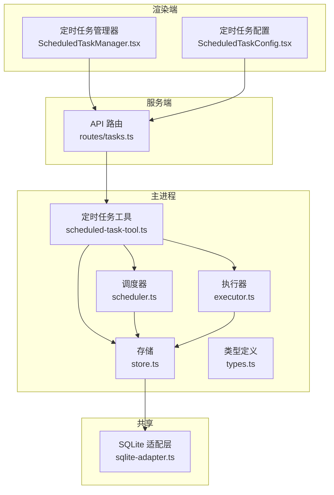
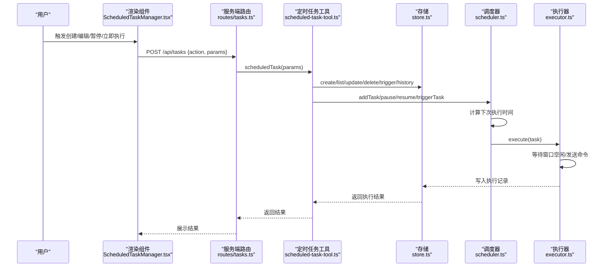
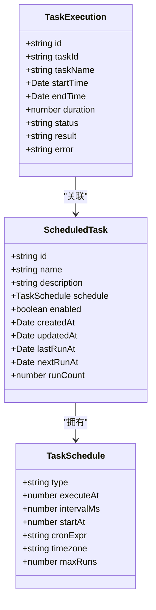
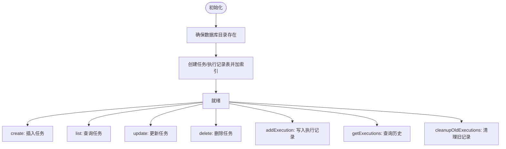
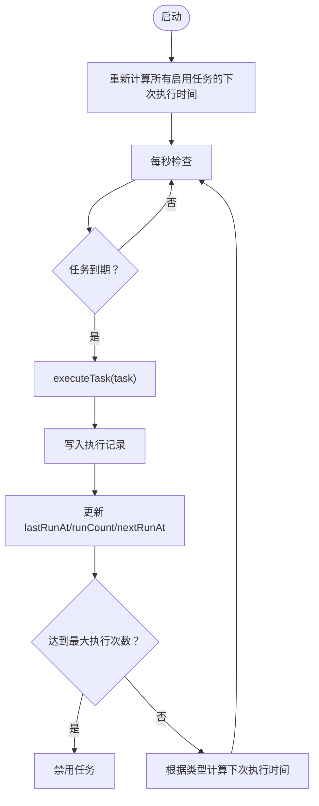
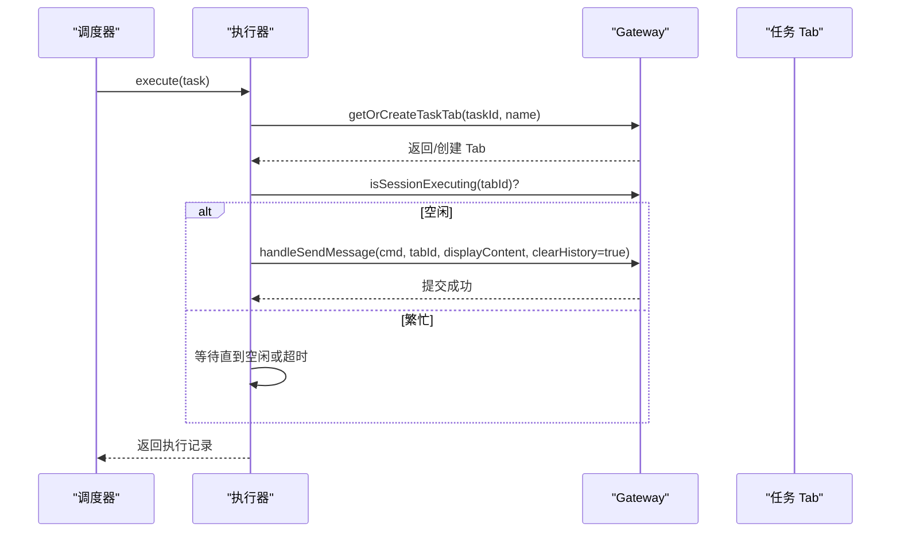
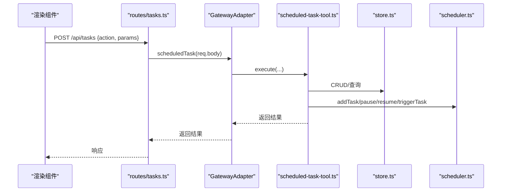
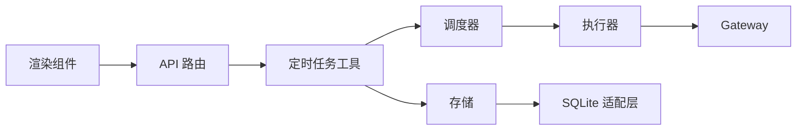

# 定时任务工具

<cite>
**本文档引用的文件**
- [index.ts](file://src/main/scheduled-tasks/index.ts)
- [types.ts](file://src/main/scheduled-tasks/types.ts)
- [scheduler.ts](file://src/main/scheduled-tasks/scheduler.ts)
- [executor.ts](file://src/main/scheduled-tasks/executor.ts)
- [store.ts](file://src/main/scheduled-tasks/store.ts)
- [scheduled-task-tool.ts](file://src/main/tools/scheduled-task-tool.ts)
- [tasks.ts](file://src/server/routes/tasks.ts)
- [ScheduledTaskManager.tsx](file://src/renderer/components/ScheduledTaskManager.tsx)
- [ScheduledTaskConfig.tsx](file://src/renderer/components/settings/ScheduledTaskConfig.tsx)
- [sqlite-adapter.ts](file://src/shared/utils/sqlite-adapter.ts)
- [gateway.ts](file://src/main/gateway.ts)
</cite>

## 目录
1. [简介](#简介)
2. [项目结构](#项目结构)
3. [核心组件](#核心组件)
4. [架构总览](#架构总览)
5. [详细组件分析](#详细组件分析)
6. [依赖关系分析](#依赖关系分析)
7. [性能考量](#性能考量)
8. [故障排查指南](#故障排查指南)
9. [结论](#结论)
10. [附录](#附录)

## 简介
本文件面向 DeepBot 的定时任务工具，系统性阐述基于 Cron 表达式的定时任务能力，涵盖任务创建、调度与执行监控。文档详细说明 API 接口、Cron 配置与任务管理机制，并提供可直接定位到源码的示例路径，帮助开发者快速上手。同时解释任务执行历史、错误处理与重试机制，给出设计模式与性能优化建议。

## 项目结构
定时任务相关代码主要分布在以下位置：
- 主进程定时任务内核：src/main/scheduled-tasks（类型定义、存储、调度器、执行器）
- 工具封装与对外接口：src/main/tools/scheduled-task-tool.ts
- 服务端 API 路由：src/server/routes/tasks.ts
- 渲染端 UI 组件：src/renderer/components 下的定时任务管理组件
- 数据持久化：src/shared/utils/sqlite-adapter.ts

图表来源
- [scheduled-task-tool.ts:128-494](file://src/main/tools/scheduled-task-tool.ts#L128-L494)
- [scheduler.ts:12-322](file://src/main/scheduled-tasks/scheduler.ts#L12-L322)
- [executor.ts:17-170](file://src/main/scheduled-tasks/executor.ts#L17-L170)
- [store.ts:23-364](file://src/main/scheduled-tasks/store.ts#L23-L364)
- [tasks.ts:9-32](file://src/server/routes/tasks.ts#L9-L32)
- [ScheduledTaskManager.tsx:41-571](file://src/renderer/components/ScheduledTaskManager.tsx#L41-L571)
- [ScheduledTaskConfig.tsx:36-358](file://src/renderer/components/settings/ScheduledTaskConfig.tsx#L36-L358)
- [sqlite-adapter.ts:14-102](file://src/shared/utils/sqlite-adapter.ts#L14-L102)

章节来源
- [index.ts:1-9](file://src/main/scheduled-tasks/index.ts#L1-L9)
- [types.ts:1-86](file://src/main/scheduled-tasks/types.ts#L1-L86)
- [store.ts:23-128](file://src/main/scheduled-tasks/store.ts#L23-L128)

## 核心组件
- 类型定义：定义任务、调度配置、执行记录、过滤器与输入输出结构，确保跨模块契约一致。
- 存储层：基于 SQLite 的持久化，提供任务与执行记录的增删改查、索引与清理。
- 调度器：按秒级轮询检查任务到期情况，负责任务启停、手动触发与下次执行时间计算。
- 执行器：在专用 Tab 中执行任务，等待窗口空闲、构建命令、上报执行结果与错误。
- 工具封装：对外暴露统一的 Agent 工具接口，支持创建、列表、暂停/恢复、删除、手动触发、历史查询等。
- API 路由：提供 /api/tasks 的 HTTP 接口，转发到 Gateway Adapter 的定时任务处理逻辑。
- 渲染组件：提供定时任务管理界面，支持编辑内容、编辑调度、暂停/恢复、立即执行、删除与历史查看。

章节来源
- [types.ts:29-86](file://src/main/scheduled-tasks/types.ts#L29-L86)
- [store.ts:133-337](file://src/main/scheduled-tasks/store.ts#L133-L337)
- [scheduler.ts:29-322](file://src/main/scheduled-tasks/scheduler.ts#L29-L322)
- [executor.ts:21-170](file://src/main/scheduled-tasks/executor.ts#L21-L170)
- [scheduled-task-tool.ts:128-494](file://src/main/tools/scheduled-task-tool.ts#L128-L494)
- [tasks.ts:16-29](file://src/server/routes/tasks.ts#L16-L29)
- [ScheduledTaskManager.tsx:51-237](file://src/renderer/components/ScheduledTaskManager.tsx#L51-L237)
- [ScheduledTaskConfig.tsx:42-123](file://src/renderer/components/settings/ScheduledTaskConfig.tsx#L42-L123)

## 架构总览
定时任务从“对话创建”到“执行与监控”的全链路如下：

图表来源
- [ScheduledTaskManager.tsx:51-237](file://src/renderer/components/ScheduledTaskManager.tsx#L51-L237)
- [tasks.ts:16-29](file://src/server/routes/tasks.ts#L16-L29)
- [scheduled-task-tool.ts:171-494](file://src/main/tools/scheduled-task-tool.ts#L171-L494)
- [store.ts:133-337](file://src/main/scheduled-tasks/store.ts#L133-L337)
- [scheduler.ts:67-240](file://src/main/scheduled-tasks/scheduler.ts#L67-L240)
- [executor.ts:86-153](file://src/main/scheduled-tasks/executor.ts#L86-L153)

## 详细组件分析

### 类型与数据模型
- 任务结构包含标识、名称、描述、调度配置、启用状态、时间戳与执行计数。
- 调度配置支持一次性、周期性与 Cron 三种类型；Cron 支持时区与最大执行次数。
- 执行记录包含开始/结束时间、耗时、状态、结果与错误信息。
- 过滤器支持按启用状态与调度类型筛选任务。

图表来源
- [types.ts:8-55](file://src/main/scheduled-tasks/types.ts#L8-L55)

章节来源
- [types.ts:29-86](file://src/main/scheduled-tasks/types.ts#L29-L86)

### 存储与持久化
- 单例模式的 TaskStore 负责任务与执行记录的 CRUD、列表与历史查询。
- 使用 SQLite（node:sqlite 适配层）持久化，采用 WAL 模式提升并发写入性能。
- 初始化时创建任务表与执行记录表，并建立必要索引以加速查询。
- 提供清理旧执行记录的能力，默认保留 30 天。

图表来源
- [store.ts:78-128](file://src/main/scheduled-tasks/store.ts#L78-L128)
- [sqlite-adapter.ts:14-70](file://src/shared/utils/sqlite-adapter.ts#L14-L70)

章节来源
- [store.ts:133-337](file://src/main/scheduled-tasks/store.ts#L133-L337)
- [sqlite-adapter.ts:14-102](file://src/shared/utils/sqlite-adapter.ts#L14-L102)

### 调度器
- 启动后计算所有启用任务的下次执行时间，并以 1 秒为检查周期轮询。
- 对正在执行的任务进行去重标记，避免并发重复执行。
- 支持添加、删除、暂停、恢复、手动触发任务。
- 计算下次执行时间时，对周期性任务强制最小间隔（10 秒），对 Cron 表达式进行时区控制与有效性校验。
- 达到最大执行次数后自动禁用任务；一次性任务执行后也自动禁用。

图表来源
- [scheduler.ts:29-322](file://src/main/scheduled-tasks/scheduler.ts#L29-L322)

章节来源
- [scheduler.ts:29-322](file://src/main/scheduled-tasks/scheduler.ts#L29-L322)

### 执行器
- 通过 Gateway 获取或创建任务专属 Tab，等待窗口空闲（最长等待 5 分钟）。
- 构造明确的系统前缀命令，确保 AI 明确这是一次定时任务执行而非创建新任务。
- 执行成功或失败均记录执行时长、结果或错误信息，并返回标准化的执行记录。

图表来源
- [executor.ts:86-153](file://src/main/scheduled-tasks/executor.ts#L86-L153)
- [gateway.ts:76-82](file://src/main/gateway.ts#L76-L82)

章节来源
- [executor.ts:21-170](file://src/main/scheduled-tasks/executor.ts#L21-L170)
- [gateway.ts:76-82](file://src/main/gateway.ts#L76-L82)

### 工具封装与 API
- 对外提供统一的 Agent 工具接口，支持 create、list、update、updateSchedule、delete、pause、resume、trigger、history 等操作。
- 参数校验与调度解析：支持自然语言描述转为调度配置（如“每隔10秒”、“每天早上9点”、“Cron表达式：0 9 * * *”）。
- 与调度器联动：创建任务后加入调度器；更新调度后重新计算下次执行时间；手动触发异步执行。
- API 路由：/api/tasks 接收请求并通过 Gateway Adapter 调用工具逻辑。

图表来源
- [tasks.ts:16-29](file://src/server/routes/tasks.ts#L16-L29)
- [scheduled-task-tool.ts:171-494](file://src/main/tools/scheduled-task-tool.ts#L171-L494)
- [store.ts:133-337](file://src/main/scheduled-tasks/store.ts#L133-L337)
- [scheduler.ts:67-126](file://src/main/scheduled-tasks/scheduler.ts#L67-L126)

章节来源
- [scheduled-task-tool.ts:128-494](file://src/main/tools/scheduled-task-tool.ts#L128-L494)
- [tasks.ts:9-32](file://src/server/routes/tasks.ts#L9-L32)

### 渲染端组件
- 定时任务管理器：支持编辑任务内容、编辑调度方式、暂停/恢复、立即执行、删除与历史查看。
- 定时任务配置：简化版配置面板，提供相同核心能力。
- 组件通过 API 调用与后端交互，定时刷新以保持状态同步。

章节来源
- [ScheduledTaskManager.tsx:51-237](file://src/renderer/components/ScheduledTaskManager.tsx#L51-L237)
- [ScheduledTaskConfig.tsx:42-123](file://src/renderer/components/settings/ScheduledTaskConfig.tsx#L42-L123)

## 依赖关系分析
- 调度器依赖存储与执行器；执行器依赖 Gateway；工具封装依赖调度器与存储；API 路由依赖工具；UI 组件依赖 API。
- 存储层通过 SQLite 适配层抽象底层差异，保证在不同 Node 版本下的可用性。
- 调度器与执行器之间通过任务状态与执行记录进行松耦合协作。

图表来源
- [ScheduledTaskManager.tsx:51-237](file://src/renderer/components/ScheduledTaskManager.tsx#L51-L237)
- [tasks.ts:16-29](file://src/server/routes/tasks.ts#L16-L29)
- [scheduled-task-tool.ts:171-494](file://src/main/tools/scheduled-task-tool.ts#L171-L494)
- [store.ts:133-337](file://src/main/scheduled-tasks/store.ts#L133-L337)
- [scheduler.ts:29-322](file://src/main/scheduled-tasks/scheduler.ts#L29-L322)
- [executor.ts:21-170](file://src/main/scheduled-tasks/executor.ts#L21-L170)
- [sqlite-adapter.ts:14-102](file://src/shared/utils/sqlite-adapter.ts#L14-L102)

章节来源
- [index.ts:5-9](file://src/main/scheduled-tasks/index.ts#L5-L9)
- [types.ts:1-86](file://src/main/scheduled-tasks/types.ts#L1-L86)

## 性能考量
- 轮询频率：调度器每秒检查一次，平衡实时性与 CPU 开销。
- 并发控制：使用 Set 标记正在执行的任务，避免重复触发。
- 最小间隔：周期性任务强制最小间隔（10 秒），防止过于频繁的执行。
- 数据库：WAL 模式提升写入吞吐；索引加速查询；定期清理历史记录降低表膨胀。
- 窗口等待：执行器等待任务 Tab 空闲最多 5 分钟，避免长时间阻塞。
- 建议：对高频任务可考虑增加最小间隔；对大量历史记录定期清理；在高负载场景下适当降低 UI 刷新频率。

[本节为通用性能建议，无需特定文件引用]

## 故障排查指南
- 调度器启动失败：工具封装提供重试机制与延迟启动，若多次失败会静默处理，不影响用户使用。
- Cron 表达式无效：调度器在计算下次执行时间时捕获异常并返回 null，需检查表达式格式与时区。
- 任务执行失败：执行器记录错误信息与耗时，可在历史记录中查看；检查任务 Tab 是否被关闭或异常。
- 任务被删除：调度器在执行前后均会再次确认任务是否存在，若在执行过程中被删除，仍会保存执行记录。
- 数据库异常：存储层检测并清理孤立的 WAL/SHM 文件，避免锁文件导致的初始化失败。

章节来源
- [scheduled-task-tool.ts:63-85](file://src/main/tools/scheduled-task-tool.ts#L63-L85)
- [scheduler.ts:284-296](file://src/main/scheduled-tasks/scheduler.ts#L284-L296)
- [executor.ts:57-78](file://src/main/scheduled-tasks/executor.ts#L57-L78)
- [store.ts:40-65](file://src/main/scheduled-tasks/store.ts#L40-L65)

## 结论
DeepBot 的定时任务工具以清晰的分层架构实现了从任务创建、调度到执行监控的完整闭环。通过 SQLite 持久化、Cron 表达式与最小间隔约束，系统在易用性与稳定性之间取得良好平衡。配合渲染端组件与 API 路由，用户可通过对话或界面高效管理定时任务。建议在生产环境中结合业务需求合理设置调度策略与清理策略，持续关注执行历史与错误日志以保障任务可靠性。

[本节为总结性内容，无需特定文件引用]

## 附录

### API 接口定义
- 路由：POST /api/tasks
- 请求体字段：action（必填，枚举值见下方），以及各操作所需的参数
- 响应：包含 success、details 与可选的错误信息

操作与参数概览
- create：name、description、schedule（type、executeAt/intervalMs/startAt/cronExpr/timezone/maxRuns）
- list：enabled（可选）
- update：taskId、description
- updateSchedule：taskId、scheduleText（自然语言描述）
- delete：taskId
- pause/resume：taskId
- trigger：taskId
- history：taskId、limit（默认 10）

章节来源
- [tasks.ts:16-29](file://src/server/routes/tasks.ts#L16-L29)
- [scheduled-task-tool.ts:171-494](file://src/main/tools/scheduled-task-tool.ts#L171-L494)

### Cron 配置与调度类型
- once：executeAt（时间戳）
- interval：intervalMs（毫秒）、startAt（可选，首次执行时间）
- cron：cronExpr（表达式）、timezone（默认 Asia/Shanghai）、maxRuns（可选）

章节来源
- [types.ts:8-24](file://src/main/scheduled-tasks/types.ts#L8-L24)
- [scheduler.ts:245-302](file://src/main/scheduled-tasks/scheduler.ts#L245-L302)

### 任务管理机制要点
- 任务创建后加入调度器并计算下次执行时间
- 暂停/恢复：暂停时重置对应 Tab 的运行时；恢复时重置计数并重新计算下次执行时间
- 手动触发：异步执行，不阻塞调度器
- 历史记录：支持按任务查询最近执行记录，便于审计与排障

章节来源
- [scheduled-task-tool.ts:180-463](file://src/main/tools/scheduled-task-tool.ts#L180-L463)
- [store.ts:302-323](file://src/main/scheduled-tasks/store.ts#L302-L323)

### 代码示例路径（不含具体代码内容）
- 创建一次性任务：[scheduled-task-tool.ts:181-219](file://src/main/tools/scheduled-task-tool.ts#L181-L219)
- 创建周期性任务：[scheduled-task-tool.ts:181-219](file://src/main/tools/scheduled-task-tool.ts#L181-L219)
- 创建 Cron 任务：[scheduled-task-tool.ts:181-219](file://src/main/tools/scheduled-task-tool.ts#L181-L219)
- 更新任务调度（自然语言）：[scheduled-task-tool.ts:365-403](file://src/main/tools/scheduled-task-tool.ts#L365-L403)
- 手动触发任务：[scheduled-task-tool.ts:405-427](file://src/main/tools/scheduled-task-tool.ts#L405-L427)
- 查看执行历史：[scheduled-task-tool.ts:429-463](file://src/main/tools/scheduled-task-tool.ts#L429-L463)
- 调度器启动与停止：[scheduled-task-tool.ts:56-86](file://src/main/tools/scheduled-task-tool.ts#L56-L86), [scheduled-task-tool.ts:620-627](file://src/main/tools/scheduled-task-tool.ts#L620-L627)
- 执行器等待与发送命令：[executor.ts:97-153](file://src/main/scheduled-tasks/executor.ts#L97-L153)