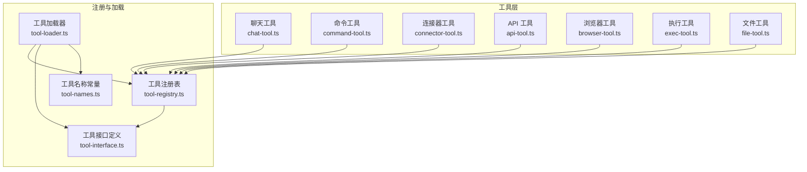
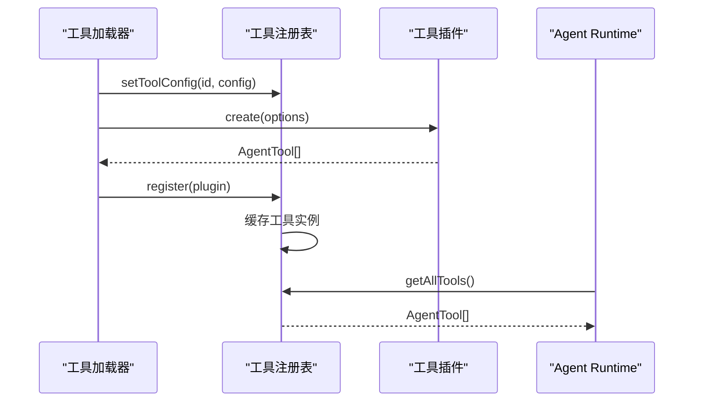
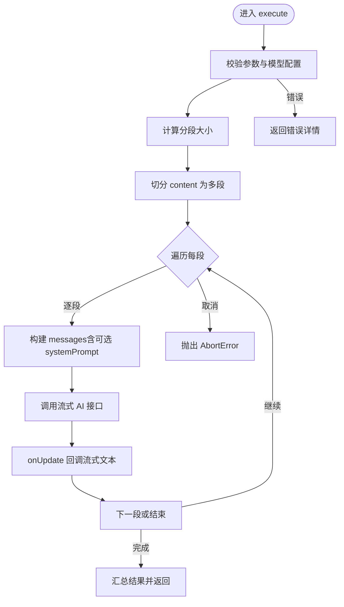
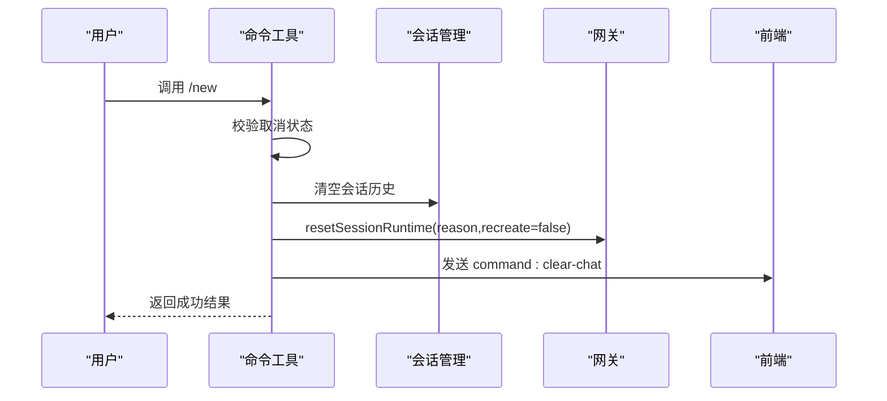
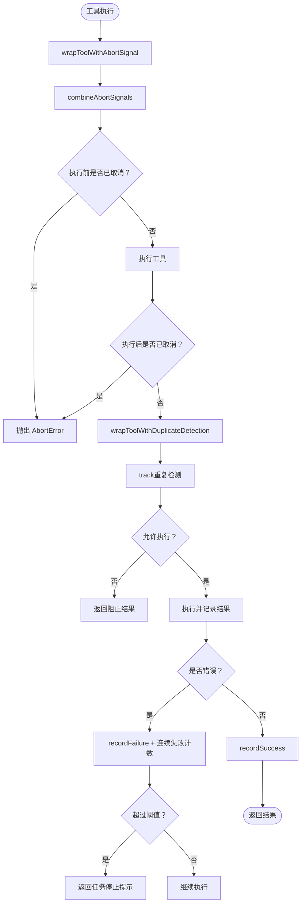
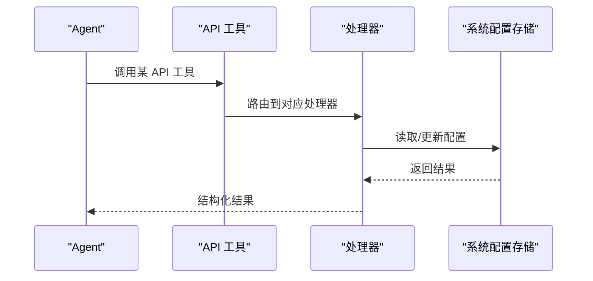
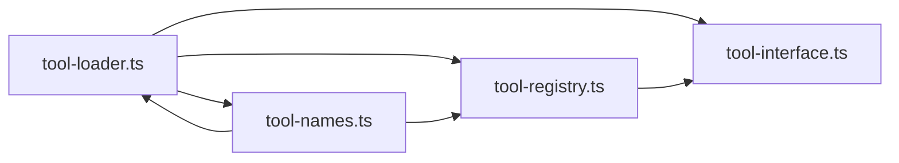

# 实用工具集合

<cite>
**本文档引用的文件**
- [chat-tool.ts](file://src/main/tools/chat-tool.ts)
- [command-tool.ts](file://src/main/tools/command-tool.ts)
- [connector-tool.ts](file://src/main/tools/connector-tool.ts)
- [tool-abort.ts](file://src/main/tools/tool-abort.ts)
- [tool-interface.ts](file://src/main/tools/registry/tool-interface.ts)
- [tool-registry.ts](file://src/main/tools/registry/tool-registry.ts)
- [tool-loader.ts](file://src/main/tools/registry/tool-loader.ts)
- [tool-names.ts](file://src/main/tools/tool-names.ts)
- [api-tool.ts](file://src/main/tools/api-tool.ts)
- [api-tool.schemas.ts](file://src/main/tools/api-tool.schemas.ts)
- [api-tool.handlers.ts](file://src/main/tools/api-tool.handlers.ts)
- [browser-tool.ts](file://src/main/tools/browser-tool.ts)
- [exec-tool.ts](file://src/main/tools/exec-tool.ts)
- [file-tool.ts](file://src/main/tools/file-tool.ts)
</cite>

## 目录
1. [简介](#简介)
2. [项目结构](#项目结构)
3. [核心组件](#核心组件)
4. [架构总览](#架构总览)
5. [详细组件分析](#详细组件分析)
6. [依赖关系分析](#依赖关系分析)
7. [性能考量](#性能考量)
8. [故障排查指南](#故障排查指南)
9. [结论](#结论)
10. [附录](#附录)

## 简介
本文件面向 DeepBot 的“实用工具集合”，系统性梳理聊天工具、命令工具、连接器工具以及工具中止与重复检测机制。文档涵盖各工具的 API 接口、典型使用场景、配置方法、生命周期管理、错误处理与资源清理，并提供最佳实践与扩展开发指南，帮助开发者与使用者高效、安全地使用与二次开发。

## 项目结构
实用工具集合位于 src/main/tools 目录，采用“插件化 + 注册表 + 加载器”的组织方式：
- 插件接口与元数据：定义工具的统一接口、元数据、配置与生命周期回调
- 工具注册表：集中管理插件注册、工具实例缓存与配置
- 工具加载器：负责加载内置工具、读取工具配置、按开关过滤工具
- 具体工具：聊天、命令、连接器、浏览器、执行、文件等工具均实现 ToolPlugin 接口

图表来源
- [tool-loader.ts:1-312](file://src/main/tools/registry/tool-loader.ts#L1-L312)
- [tool-registry.ts:1-328](file://src/main/tools/registry/tool-registry.ts#L1-L328)
- [tool-interface.ts:1-152](file://src/main/tools/registry/tool-interface.ts#L1-L152)
- [tool-names.ts:1-106](file://src/main/tools/tool-names.ts#L1-L106)

章节来源
- [tool-loader.ts:1-312](file://src/main/tools/registry/tool-loader.ts#L1-L312)
- [tool-registry.ts:1-328](file://src/main/tools/registry/tool-registry.ts#L1-L328)
- [tool-interface.ts:1-152](file://src/main/tools/registry/tool-interface.ts#L1-L152)
- [tool-names.ts:1-106](file://src/main/tools/tool-names.ts#L1-L106)

## 核心组件
- 工具接口与元数据：统一的 ToolPlugin 接口，包含 metadata、create、validateConfig、initialize、cleanup 等能力
- 工具注册表：维护插件与工具实例映射，提供配置管理、工具查询、清理等能力
- 工具加载器：集中加载内置工具，读取工具配置，按开关过滤工具，返回 AgentTool 列表
- 工具名称常量：统一管理工具名，避免硬编码，便于跨模块引用

章节来源
- [tool-interface.ts:1-152](file://src/main/tools/registry/tool-interface.ts#L1-L152)
- [tool-registry.ts:1-328](file://src/main/tools/registry/tool-registry.ts#L1-L328)
- [tool-loader.ts:1-312](file://src/main/tools/registry/tool-loader.ts#L1-L312)
- [tool-names.ts:1-106](file://src/main/tools/tool-names.ts#L1-L106)

## 架构总览
工具体系围绕“插件化 + 注册表 + 加载器”展开，工具在运行时被加载并注册，Agent Runtime 通过注册表获取工具列表，执行时支持 AbortSignal 取消与重复检测。

图表来源
- [tool-loader.ts:57-71](file://src/main/tools/registry/tool-loader.ts#L57-L71)
- [tool-registry.ts:46-55](file://src/main/tools/registry/tool-registry.ts#L46-L55)
- [tool-registry.ts:201-209](file://src/main/tools/registry/tool-registry.ts#L201-L209)

章节来源
- [tool-loader.ts:57-71](file://src/main/tools/registry/tool-loader.ts#L57-L71)
- [tool-registry.ts:46-55](file://src/main/tools/registry/tool-registry.ts#L46-L55)
- [tool-registry.ts:201-209](file://src/main/tools/registry/tool-registry.ts#L201-L209)

## 详细组件分析

### 聊天工具（AI 对话）
- 功能概述
  - 调用 AI 模型进行对话、翻译、总结、改写等任务
  - 支持长文本自动分段与流式输出
  - 自动计算分段大小，保留少量重叠以维持上下文连贯
- API 接口
  - 工具名：TOOL_NAMES.CHAT
  - 参数 Schema：prompt（必填）、content（可选）、systemPrompt（可选）、maxChunkSize（可选）
  - 返回：文本内容与执行详情（包含分段数量、当前段、总长度、是否流式）
- 执行流程
  - 校验参数与模型配置
  - 计算分段大小并切分 content
  - 逐段构建 messages（可选 systemPrompt + user 内容）
  - 调用流式 AI 接口，实时回调 onUpdate
  - 汇总结果并返回
- 取消与错误处理
  - 支持 AbortSignal，检测外部取消并抛出标准 AbortError
  - 对常见 API 错误（401/404/超时/空响应）进行友好提示
- 使用场景
  - 需要长文本处理的摘要、翻译、润色
  - 需要流式输出的实时反馈场景
- 配置方法
  - 在系统设置中配置模型提供商、模型 ID、API Key、基础地址、上下文窗口等
  - 可通过 maxChunkSize 覆盖默认分段策略
- 生命周期与资源清理
  - 无持久资源，按次调用即时释放
- 最佳实践
  - 对超长内容合理设置分段大小
  - 使用 systemPrompt 明确角色与风格
  - 结合 onUpdate 实现前端流式渲染

图表来源
- [chat-tool.ts:171-271](file://src/main/tools/chat-tool.ts#L171-L271)

章节来源
- [chat-tool.ts:1-272](file://src/main/tools/chat-tool.ts#L1-L272)

### 命令工具（系统指令）
- 功能概述
  - 执行系统级指令，如 /new 清空会话历史并重置 AgentRuntime 上下文
- API 接口
  - 工具名：TOOL_NAMES.SYSTEM_COMMAND
  - 参数 Schema：command（必填，如 new）
  - 返回：执行结果与详情（success、command、sessionId 等）
- 执行流程
  - 校验取消状态
  - 解析指令并执行对应处理函数
  - /new 指令：清空会话历史、重置 AgentRuntime、通知前端清空 UI
- 错误处理
  - 未知指令返回错误详情与可用指令提示
- 使用场景
  - 快速重置会话上下文，开始全新对话
- 配置方法
  - 无需额外配置，直接调用
- 生命周期与资源清理
  - 无持久资源，按次调用即时释放
- 最佳实践
  - 在需要“干净会话”时使用 /new
  - 与其他工具配合使用，先清空再执行后续任务

图表来源
- [command-tool.ts:42-157](file://src/main/tools/command-tool.ts#L42-L157)

章节来源
- [command-tool.ts:1-157](file://src/main/tools/command-tool.ts#L1-L157)

### 连接器工具（飞书消息/图片/文件）
- 功能概述
  - 在飞书会话中发送文本、图片、文件
  - 支持三种发送目标解析：当前会话、指定 userId/open_id、指定 chatId
  - 统一封装消息、图片、文件发送逻辑
- API 接口
  - 工具名：
    - TOOL_NAMES.FEISHU_SEND_MESSAGE
    - TOOL_NAMES.CONNECTOR_SEND_IMAGE
    - TOOL_NAMES.CONNECTOR_SEND_FILE
  - 共同参数：userId（可选，open_id 或 user_id）、chatId（可选，群组 chat_id）、tabName（可选，按 Tab 名称查找）
  - 文本消息：message（必填）
  - 图片：imagePath（必填，支持 ~ 展开）、caption（可选）
  - 文件：filePath（必填，支持 ~ 展开）、fileName（可选）
- 执行流程
  - 校验 Gateway 初始化与会话 ID
  - 解析目标：优先 chatId → tabName → 当前 connector 会话 → userId/open_id
  - 根据 receiveIdType 调用不同发送路径（open_id 直发或通过 ConnectorManager）
  - 记录日志并返回结果
- 错误处理
  - Gateway 未初始化、文件不存在/非文件、格式不支持、发送失败等均返回带错误详情的结果
  - 附带已配对用户列表提示，辅助选择正确 userId/openId
- 使用场景
  - 自动化向飞书群组或个人发送通知、截图、报告附件
- 配置方法
  - 需要先配置飞书连接器（App ID/Secret），并在系统设置中启用
  - 可通过 api_get_pairing_records 查询已配对用户 openId
- 生命周期与资源清理
  - 无持久资源，按次调用即时释放
- 最佳实践
  - 优先使用 openId 发送个人消息
  - 发送前校验文件存在性与类型
  - 使用 tabName 精确路由到目标会话

```mermaid
flowchart TD
Start(["进入 execute"]) --> Check["校验 Gateway 与会话 ID"]
Check --> Resolve["解析发送目标chatId/tabName/current connector/userId/open_id"]
Resolve --> Send{"发送类型？"}
Send --> |文本| SendText["sendMessageToTarget"]
Send --> |图片| SendImg["sendImageToTarget"]
Send --> |文件| SendFile["sendFileToTarget"]
SendText --> Done["返回结果"]
SendImg --> Done
SendFile --> Done
Resolve --> |错误| Fail["返回错误详情 + 已配对用户提示"]
```

图表来源
- [connector-tool.ts:267-432](file://src/main/tools/connector-tool.ts#L267-L432)

章节来源
- [connector-tool.ts:1-433](file://src/main/tools/connector-tool.ts#L1-L433)

### 工具中止与重复检测
- 功能概述
  - 为工具执行提供 AbortSignal 支持，统一抛出 AbortError
  - 合并多个信号源，支持执行前/后取消检测
  - 操作追踪器：检测重复操作与连续失败，必要时停止任务
- API 接口
  - 包装工具：wrapToolWithAbortSignal(tool, abortSignal)
  - 操作追踪：OperationTracker（track、recordFailure、recordSuccess、clear、getStats）
  - 包装工具：wrapToolWithDuplicateDetection(tool, tracker)
- 执行流程
  - 包装工具：合并信号 → 执行前/后检查 → 异常时区分 AbortError 与其他错误
  - 重复检测：生成唯一键 → 超过重复阈值阻止执行 → 记录失败并统计连续失败
- 错误处理
  - AbortError：由 Agent 识别并停止执行
  - 连续失败过多：返回“任务已停止”提示并给出建议
- 使用场景
  - 需要中断长时间运行的任务
  - 防止重复执行相同操作导致资源浪费或副作用
- 配置方法
  - 通过 AbortController 创建信号，传入工具包装函数
  - 在任务调度中使用 OperationTracker 进行重复与失败控制
- 生命周期与资源清理
  - OperationTracker 在新消息时清空统计
- 最佳实践
  - 为长任务提供 AbortController 并在 UI 中暴露“停止”按钮
  - 对易重复操作（如 read、bash、browser）启用重复检测

图表来源
- [tool-abort.ts:101-144](file://src/main/tools/tool-abort.ts#L101-L144)
- [tool-abort.ts:280-426](file://src/main/tools/tool-abort.ts#L280-L426)

章节来源
- [tool-abort.ts:1-427](file://src/main/tools/tool-abort.ts#L1-L427)

### API 工具（系统配置访问）
- 功能概述
  - 提供查询与设置系统配置的能力，包括工作目录、模型、工具、连接器、配对记录、Tab 列表、名称配置、会话文件路径、日期时间等
  - 仅读操作：查询配置
  - 写操作：更新配置（部分受限）
- API 接口
  - 工具名：TOOL_NAMES.API_GET_CONFIG、TOOL_NAMES.API_SET_MODEL_CONFIG、TOOL_NAMES.API_SET_IMAGE_GENERATION_CONFIG、TOOL_NAMES.API_SET_WEB_SEARCH_CONFIG、TOOL_NAMES.API_SET_TOOL_ENABLED、TOOL_NAMES.API_SET_FEISHU_CONNECTOR_CONFIG、TOOL_NAMES.API_SET_CONNECTOR_ENABLED、TOOL_NAMES.API_GET_PAIRING_RECORDS、TOOL_NAMES.API_APPROVE_PAIRING、TOOL_NAMES.API_REJECT_PAIRING、TOOL_NAMES.API_GET_TABS、TOOL_NAMES.API_GET_NAME、TOOL_NAMES.API_SET_NAME、TOOL_NAMES.API_GET_SESSION_FILE_PATH、TOOL_NAMES.API_GET_DATETIME
  - 参数 Schema：见 api-tool.schemas.ts
- 执行流程
  - 根据工具名路由到对应处理器（handlers）
  - 读取系统配置存储，执行查询或更新
  - 返回结构化结果与详情
- 错误处理
  - 参数校验失败、配置读取/写入异常、权限不足等均返回错误详情
- 使用场景
  - 自动化配置管理、远程诊断与运维
- 配置方法
  - 通过系统设置界面或 API 工具进行配置
- 生命周期与资源清理
  - 无持久资源，按次调用即时释放
- 最佳实践
  - 仅在受信任的环境中启用写操作
  - 使用最小权限原则，避免一次性授予过多配置变更权限

图表来源
- [api-tool.ts:25-219](file://src/main/tools/api-tool.ts#L25-L219)
- [api-tool.schemas.ts:1-258](file://src/main/tools/api-tool.schemas.ts#L1-L258)
- [api-tool.handlers.ts:1-44](file://src/main/tools/api-tool.handlers.ts#L1-L44)

章节来源
- [api-tool.ts:1-220](file://src/main/tools/api-tool.ts#L1-L220)
- [api-tool.schemas.ts:1-258](file://src/main/tools/api-tool.schemas.ts#L1-L258)
- [api-tool.handlers.ts:1-44](file://src/main/tools/api-tool.handlers.ts#L1-L44)

### 浏览器工具（插件）
- 功能概述
  - 基于 agent-browser 控制浏览器，支持打开网页、快照、点击、填充、截图、标签页管理等
  - 使用 @ref 系统进行元素定位，强调“先快照再操作”
- API 接口
  - 工具名：TOOL_NAMES.BROWSER
  - 参数 Schema：action（必填，如 open、snapshot、click、fill、type、press、hover、check、uncheck、select、scroll、scrollintoview、get、screenshot、back、forward、reload、wait、tab、close）、url、ref、text、key、interactive、getType、direction、amount、screenshotPath、fullPage、waitTimeout、tabAction、tabIndex 等
- 执行流程
  - 校验参数合法性与环境要求（Chrome 安装、Docker 模式等）
  - 基于 action 执行相应浏览器操作
  - 返回结果与状态
- 错误处理
  - 元素定位失败、超时、浏览器异常等返回错误详情
- 使用场景
  - 自动化网页操作、信息采集、表单填写、截图归档
- 配置方法
  - 无需额外配置，开箱即用
- 生命周期与资源清理
  - 无持久资源，按次调用即时释放
- 最佳实践
  - 严格遵循“先快照再操作”的流程
  - 使用 @ref 精确定位元素，避免猜测编号

章节来源
- [browser-tool.ts:1-200](file://src/main/tools/browser-tool.ts#L1-L200)

### 执行工具（命令执行）
- 功能概述
  - 执行 shell 命令，统一超时控制（120 秒），拦截危险命令，输出截断
- API 接口
  - 工具名：TOOL_NAMES.BASH（来自加载器返回的工具数组）
  - 参数：command（必填，要执行的命令）
- 执行流程
  - 安全检查：路径白名单、危险命令黑名单/正则匹配
  - 统一超时控制（TIMEOUTS.EXEC_TOOL_TIMEOUT）
  - 执行命令并截断输出
- 错误处理
  - 危险命令拦截、路径不安全、超时、执行失败等均返回错误详情
- 使用场景
  - 系统运维、脚本执行、环境诊断
- 配置方法
  - 通过系统设置界面配置工作目录与脚本目录
- 生命周期与资源清理
  - 无持久资源，按次调用即时释放
- 最佳实践
  - 仅执行受信任的命令
  - 对输出进行必要的截断与过滤

章节来源
- [exec-tool.ts:1-200](file://src/main/tools/exec-tool.ts#L1-L200)

### 文件工具（读写编辑）
- 功能概述
  - 文件读取（read）、写入（write）、编辑（edit），支持参数规范化与安全检查
- API 接口
  - 工具名：TOOL_NAMES.FILE_READ、TOOL_NAMES.FILE_WRITE、TOOL_NAMES.FILE_EDIT
  - 参数：path（必填）、oldText/newText（edit 专用）、file_path/old_string/new_string（Claude 风格参数支持）
- 执行流程
  - 参数规范化（Claude 风格 → pi-coding-agent 风格）
  - 安全检查：路径合法性验证
  - 执行原始工具并返回结果
  - read 工具：对图片 base64 数据进行过滤，对空文件给出明确提示
- 错误处理
  - 路径不合法、文件不存在/不可读、写入失败等返回错误详情
- 使用场景
  - 配置文件读取、日志查看、代码片段编辑
- 配置方法
  - 通过系统设置界面配置工作目录
- 生命周期与资源清理
  - 无持久资源，按次调用即时释放
- 最佳实践
  - 避免读取大文件的二进制内容
  - 对编辑操作提供明确的旧/新文本对比

章节来源
- [file-tool.ts:1-200](file://src/main/tools/file-tool.ts#L1-L200)

## 依赖关系分析
- 工具加载器依赖注册表与接口定义，按开关过滤工具并创建实例
- 工具注册表维护插件与工具实例映射，支持配置读取与清理
- 工具名称常量统一管理工具名，避免硬编码
- 工具实现依赖系统配置存储、错误处理工具、路径工具等

图表来源
- [tool-loader.ts:17-35](file://src/main/tools/registry/tool-loader.ts#L17-L35)
- [tool-registry.ts:27-31](file://src/main/tools/registry/tool-registry.ts#L27-L31)
- [tool-names.ts:8-94](file://src/main/tools/tool-names.ts#L8-L94)

章节来源
- [tool-loader.ts:17-35](file://src/main/tools/registry/tool-loader.ts#L17-L35)
- [tool-registry.ts:27-31](file://src/main/tools/registry/tool-registry.ts#L27-L31)
- [tool-names.ts:8-94](file://src/main/tools/tool-names.ts#L8-L94)

## 性能考量
- 聊天工具
  - 长文本分段与流式输出降低内存峰值，提升交互体验
  - 合理设置分段大小与上下文窗口，平衡成本与效果
- 连接器工具
  - 文件/图片发送前进行存在性与类型校验，避免无效 IO
  - 通过 receiveIdType 选择最优发送路径（open_id vs 会话直发）
- 执行工具
  - 统一超时控制避免长时间阻塞
  - 危险命令拦截减少系统风险与资源消耗
- 工具中止
  - 合并信号源，快速响应取消请求
  - 重复检测与连续失败控制避免无效重试

## 故障排查指南
- 聊天工具
  - 现象：API Key 无效/模型不存在/请求超时/空响应
  - 处理：检查系统设置中的模型配置与网络连通性；适当增大上下文窗口或减小分段大小
- 命令工具
  - 现象：/new 指令失败
  - 处理：确认会话 ID 有效、会话历史目录可写、AgentRuntime 可重置
- 连接器工具
  - 现象：发送失败、找不到目标会话、文件不存在/格式不支持
  - 处理：检查飞书连接器配置与启用状态；确认 userId/openId/chatId/tabName 正确；校验文件路径与类型
- API 工具
  - 现象：配置读取/写入失败
  - 处理：检查系统配置存储权限与 JSON 格式；确认参数 Schema 与取值范围
- 执行工具
  - 现象：命令被拦截、路径不安全、超时
  - 处理：检查危险命令黑名单与路径白名单；调整命令与工作目录
- 工具中止
  - 现象：任务无法停止、重复执行、连续失败
  - 处理：确保 AbortController 正确传递；启用重复检测与失败统计

章节来源
- [chat-tool.ts:150-162](file://src/main/tools/chat-tool.ts#L150-L162)
- [command-tool.ts:137-156](file://src/main/tools/command-tool.ts#L137-L156)
- [connector-tool.ts:291-299](file://src/main/tools/connector-tool.ts#L291-L299)
- [api-tool.schemas.ts:12-258](file://src/main/tools/api-tool.schemas.ts#L12-L258)
- [exec-tool.ts:40-77](file://src/main/tools/exec-tool.ts#L40-L77)
- [tool-abort.ts:134-142](file://src/main/tools/tool-abort.ts#L134-L142)

## 结论
DeepBot 的实用工具集合通过插件化架构实现了高内聚、低耦合的工具体系。聊天、命令、连接器、API、浏览器、执行、文件等工具覆盖了日常操作与系统管理的广泛场景。结合工具中止与重复检测机制，系统在安全性、稳定性与用户体验方面达到了良好平衡。建议在生产环境中严格启用安全检查与配置校验，并通过 API 工具进行集中化配置管理。

## 附录
- 扩展开发指南
  - 新增工具：实现 ToolPlugin 接口，提供 metadata 与 create 方法，返回 AgentTool 或工具数组
  - 配置管理：在工具执行时从用户目录读取配置文件，使用动态 require 加载外部依赖
  - 加载注册：在 tool-loader.ts 的 loadBuiltinTools 中导入并加载新工具
  - 生命周期：实现 initialize/cleanup 以管理资源初始化与清理
  - 取消与重复：使用 wrapToolWithAbortSignal 与 wrapToolWithDuplicateDetection 包装工具
- 最佳实践清单
  - 为长任务提供 AbortController 并在 UI 中暴露“停止”按钮
  - 严格遵循“先快照再操作”的浏览器工具使用规范
  - 对文件读取进行二进制过滤，避免传输大体积数据
  - 使用最小权限原则管理配置变更，避免一次性授予过多权限