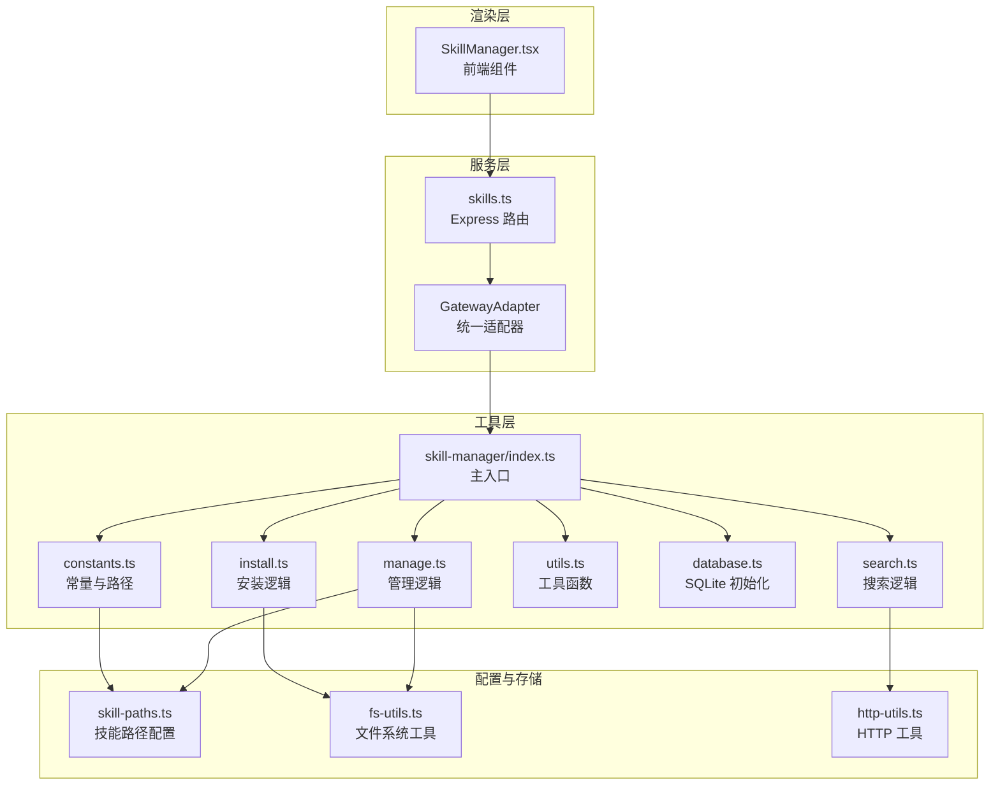
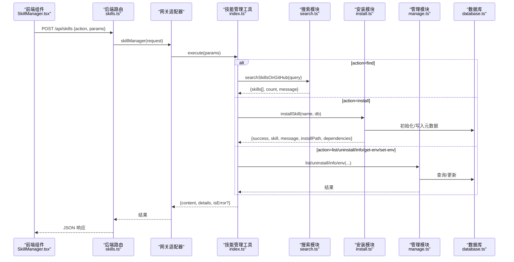
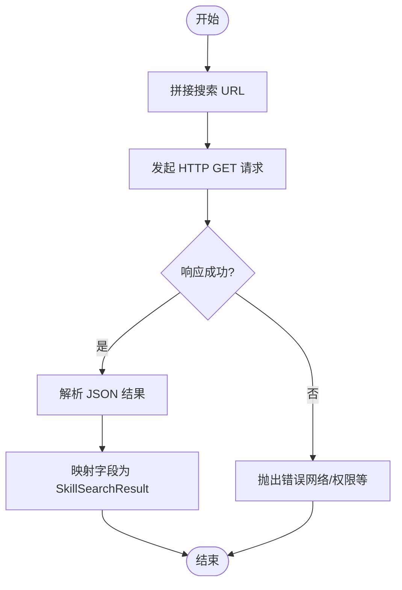
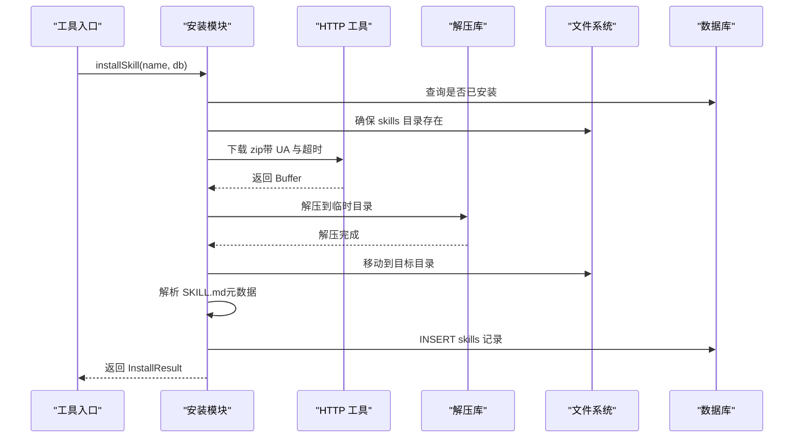
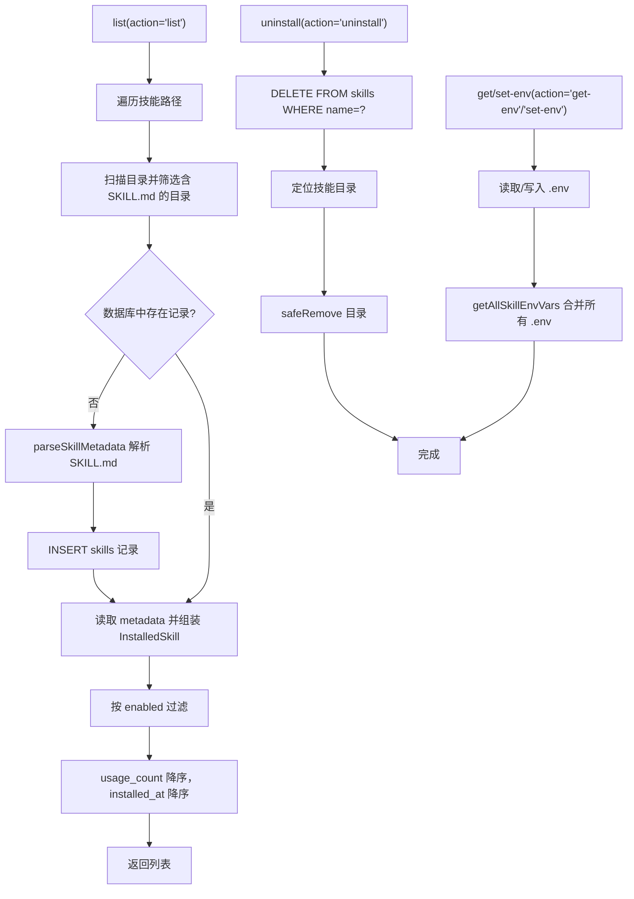
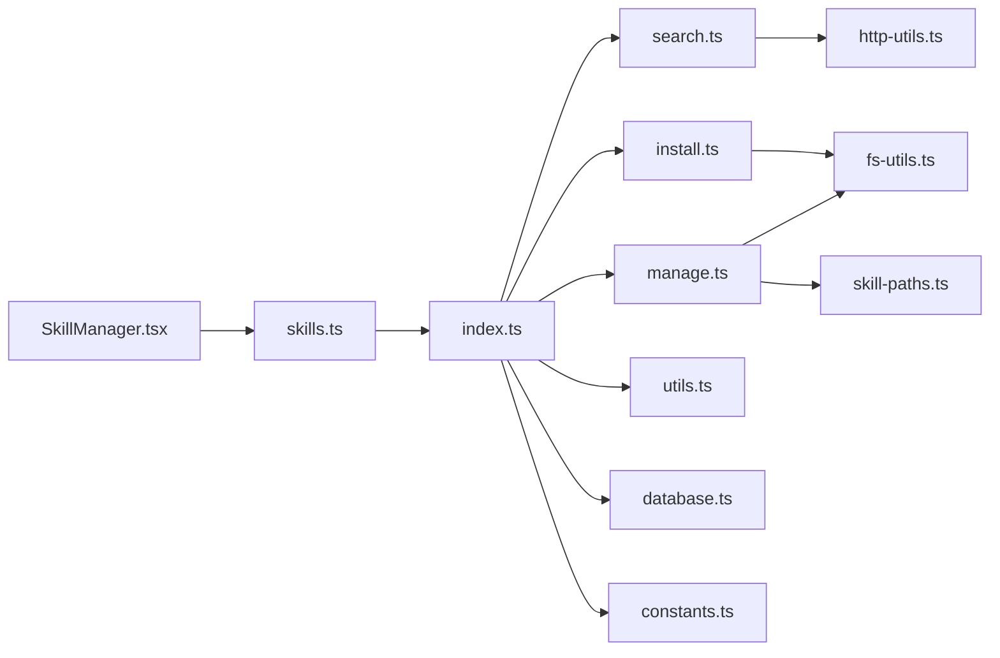

# 技能管理工具

<cite>
**本文引用的文件**
- [src/main/tools/skill-manager/index.ts](file://src/main/tools/skill-manager/index.ts)
- [src/main/tools/skill-manager/manage.ts](file://src/main/tools/skill-manager/manage.ts)
- [src/main/tools/skill-manager/install.ts](file://src/main/tools/skill-manager/install.ts)
- [src/main/tools/skill-manager/search.ts](file://src/main/tools/skill-manager/search.ts)
- [src/main/tools/skill-manager/types.ts](file://src/main/tools/skill-manager/types.ts)
- [src/main/tools/skill-manager/constants.ts](file://src/main/tools/skill-manager/constants.ts)
- [src/main/tools/skill-manager/utils.ts](file://src/main/tools/skill-manager/utils.ts)
- [src/main/tools/skill-manager/database.ts](file://src/main/tools/skill-manager/database.ts)
- [src/main/tools/skill-manager-tool.ts](file://src/main/tools/skill-manager-tool.ts)
- [src/server/routes/skills.ts](file://src/server/routes/skills.ts)
- [src/main/config/skill-paths.ts](file://src/main/config/skill-paths.ts)
- [src/main/tools/tool-names.ts](file://src/main/tools/tool-names.ts)
- [src/renderer/components/SkillManager.tsx](file://src/renderer/components/SkillManager.tsx)
- [src/shared/utils/fs-utils.ts](file://src/shared/utils/fs-utils.ts)
- [src/shared/utils/http-utils.ts](file://src/shared/utils/http-utils.ts)
</cite>

## 目录
1. [简介](#简介)
2. [项目结构](#项目结构)
3. [核心组件](#核心组件)
4. [架构总览](#架构总览)
5. [详细组件分析](#详细组件分析)
6. [依赖分析](#依赖分析)
7. [性能考虑](#性能考虑)
8. [故障排查指南](#故障排查指南)
9. [结论](#结论)
10. [附录](#附录)

## 简介
本文件面向 DeepBot 的“技能管理工具”，系统性阐述基于 Skills 的复杂功能组合体系，覆盖技能安装、搜索、管理与配置机制。文档重点包括：
- API 接口定义与调用方式
- 安装流程与依赖解析
- 版本管理与冲突处理策略
- 配置与环境变量管理
- 前端可视化组件与后端服务集成
- 最佳实践与扩展建议

## 项目结构
技能管理工具由“前端组件 + 后端路由 + 工具实现 + 数据库 + 配置”五部分组成，职责清晰、边界明确。

图表来源
- [src/renderer/components/SkillManager.tsx:1-796](file://src/renderer/components/SkillManager.tsx#L1-L796)
- [src/server/routes/skills.ts:1-38](file://src/server/routes/skills.ts#L1-L38)
- [src/main/tools/skill-manager/index.ts:1-180](file://src/main/tools/skill-manager/index.ts#L1-L180)
- [src/main/tools/skill-manager/install.ts:1-150](file://src/main/tools/skill-manager/install.ts#L1-L150)
- [src/main/tools/skill-manager/search.ts:1-81](file://src/main/tools/skill-manager/search.ts#L1-L81)
- [src/main/tools/skill-manager/manage.ts:1-281](file://src/main/tools/skill-manager/manage.ts#L1-L281)
- [src/main/tools/skill-manager/utils.ts:1-92](file://src/main/tools/skill-manager/utils.ts#L1-L92)
- [src/main/tools/skill-manager/database.ts:1-41](file://src/main/tools/skill-manager/database.ts#L1-L41)
- [src/main/tools/skill-manager/constants.ts:1-35](file://src/main/tools/skill-manager/constants.ts#L1-L35)
- [src/main/config/skill-paths.ts:1-69](file://src/main/config/skill-paths.ts#L1-L69)
- [src/shared/utils/fs-utils.ts:1-162](file://src/shared/utils/fs-utils.ts#L1-L162)
- [src/shared/utils/http-utils.ts:1-200](file://src/shared/utils/http-utils.ts#L1-L200)

章节来源
- [src/main/tools/skill-manager/index.ts:1-180](file://src/main/tools/skill-manager/index.ts#L1-L180)
- [src/main/tools/skill-manager/database.ts:1-41](file://src/main/tools/skill-manager/database.ts#L1-L41)
- [src/main/tools/skill-manager/constants.ts:1-35](file://src/main/tools/skill-manager/constants.ts#L1-L35)
- [src/main/config/skill-paths.ts:1-69](file://src/main/config/skill-paths.ts#L1-L69)
- [src/server/routes/skills.ts:1-38](file://src/server/routes/skills.ts#L1-L38)
- [src/renderer/components/SkillManager.tsx:1-796](file://src/renderer/components/SkillManager.tsx#L1-L796)

## 核心组件
- 技能管理工具主入口：负责参数校验、动作分发、错误处理与结果封装。
- 安装模块：从 ClawHub 下载 zip 并解压，解析元数据，入库。
- 搜索模块：对接 ClawHub 搜索 API，返回可安装技能清单。
- 管理模块：列举、卸载、查看详情、读取/写入 .env 环境变量。
- 数据库模块：SQLite 初始化与索引，维护技能元信息。
- 工具与常量：路径解析、HTTP 请求、文件系统安全操作。
- 前端组件：提供搜索、安装、卸载、详情查看、环境变量编辑的可视化界面。

章节来源
- [src/main/tools/skill-manager/index.ts:27-179](file://src/main/tools/skill-manager/index.ts#L27-L179)
- [src/main/tools/skill-manager/install.ts:22-80](file://src/main/tools/skill-manager/install.ts#L22-L80)
- [src/main/tools/skill-manager/search.ts:29-80](file://src/main/tools/skill-manager/search.ts#L29-L80)
- [src/main/tools/skill-manager/manage.ts:17-281](file://src/main/tools/skill-manager/manage.ts#L17-L281)
- [src/main/tools/skill-manager/database.ts:13-40](file://src/main/tools/skill-manager/database.ts#L13-L40)
- [src/main/tools/skill-manager/utils.ts:28-92](file://src/main/tools/skill-manager/utils.ts#L28-L92)
- [src/main/tools/skill-manager/constants.ts:9-35](file://src/main/tools/skill-manager/constants.ts#L9-L35)
- [src/renderer/components/SkillManager.tsx:45-796](file://src/renderer/components/SkillManager.tsx#L45-L796)

## 架构总览
技能管理采用“工具 + 路由 + 组件”的分层设计：
- 前端通过 API 调用后端路由，路由转发至网关适配器，最终调用技能管理工具。
- 工具内部根据 action 分派到具体功能模块，使用 SQLite 存储元数据，使用 HTTP 工具访问外部服务，使用文件系统工具进行本地操作。
- 技能路径由系统配置统一管理，支持多路径与默认路径。

图表来源
- [src/server/routes/skills.ts:14-34](file://src/server/routes/skills.ts#L14-L34)
- [src/main/tools/skill-manager/index.ts:78-177](file://src/main/tools/skill-manager/index.ts#L78-L177)
- [src/main/tools/skill-manager/search.ts:29-80](file://src/main/tools/skill-manager/search.ts#L29-L80)
- [src/main/tools/skill-manager/install.ts:22-80](file://src/main/tools/skill-manager/install.ts#L22-L80)
- [src/main/tools/skill-manager/manage.ts:17-281](file://src/main/tools/skill-manager/manage.ts#L17-L281)
- [src/main/tools/skill-manager/database.ts:13-40](file://src/main/tools/skill-manager/database.ts#L13-L40)

## 详细组件分析

### 技能管理工具主入口
- 功能：统一入口，定义参数 Schema，分发 action，封装结果与错误。
- 关键点：
  - 参数校验与缺省提示
  - 动作映射：find/install/list/uninstall/info/get-env/set-env
  - 错误捕获与标准化输出
  - 环境变量变更后清理 Shell 缓存

章节来源
- [src/main/tools/skill-manager/index.ts:27-179](file://src/main/tools/skill-manager/index.ts#L27-L179)

### 搜索模块（ClawHub）
- 功能：调用 ClawHub 搜索 API，返回技能清单；对网络异常做用户友好提示。
- 关键点：
  - 请求头与超时控制
  - 异常分类：网络不可达、超时、拒绝等
  - 字段映射：slug 映射为 name，summary 映射为 description

图表来源
- [src/main/tools/skill-manager/search.ts:29-80](file://src/main/tools/skill-manager/search.ts#L29-L80)
- [src/shared/utils/http-utils.ts:136-141](file://src/shared/utils/http-utils.ts#L136-L141)

章节来源
- [src/main/tools/skill-manager/search.ts:29-80](file://src/main/tools/skill-manager/search.ts#L29-L80)

### 安装模块（ClawHub 下载与解压）
- 功能：下载 zip、解压、解析 SKILL.md、入库、返回依赖信息。
- 关键点：
  - 去重：若已安装则报错
  - 路径：确保 skills 目录存在
  - 解压：跨平台使用 adm-zip，处理 zip 内一层子目录
  - 元数据：version/author/repository/tags/requirements
  - 入库：插入 skills 表，含 metadata JSON

图表来源
- [src/main/tools/skill-manager/install.ts:22-80](file://src/main/tools/skill-manager/install.ts#L22-L80)
- [src/main/tools/skill-manager/utils.ts:28-80](file://src/main/tools/skill-manager/utils.ts#L28-L80)
- [src/main/tools/skill-manager/database.ts:22-37](file://src/main/tools/skill-manager/database.ts#L22-L37)
- [src/shared/utils/http-utils.ts:136-141](file://src/shared/utils/http-utils.ts#L136-L141)

章节来源
- [src/main/tools/skill-manager/install.ts:22-80](file://src/main/tools/skill-manager/install.ts#L22-L80)
- [src/main/tools/skill-manager/utils.ts:28-80](file://src/main/tools/skill-manager/utils.ts#L28-L80)

### 管理模块（列表、卸载、详情、环境变量）
- 列举：扫描所有技能路径，匹配 SKILL.md，读取数据库或自动注册，支持按启用状态过滤与排序。
- 卸载：删除数据库记录与文件目录。
- 详情：读取 README、扫描 scripts/references/assets、聚合 requires/tools/dependencies。
- 环境变量：读取/写入 .env，支持 KEY=VALUE 与 export KEY=VALUE 格式，合并所有技能的环境变量。

图表来源
- [src/main/tools/skill-manager/manage.ts:17-281](file://src/main/tools/skill-manager/manage.ts#L17-L281)
- [src/main/tools/skill-manager/utils.ts:28-80](file://src/main/tools/skill-manager/utils.ts#L28-L80)
- [src/main/config/skill-paths.ts:31-41](file://src/main/config/skill-paths.ts#L31-L41)
- [src/shared/utils/fs-utils.ts:150-161](file://src/shared/utils/fs-utils.ts#L150-L161)

章节来源
- [src/main/tools/skill-manager/manage.ts:17-281](file://src/main/tools/skill-manager/manage.ts#L17-L281)

### 数据库与常量
- 数据库：skills 表含唯一 name、版本、启用状态、时间戳、使用计数、仓库地址、metadata JSON；建立索引提升查询效率。
- 常量：技能目录、DB 路径（Docker/非 Docker）、ClawHub 搜索与下载 API。

章节来源
- [src/main/tools/skill-manager/database.ts:22-37](file://src/main/tools/skill-manager/database.ts#L22-L37)
- [src/main/tools/skill-manager/constants.ts:9-35](file://src/main/tools/skill-manager/constants.ts#L9-L35)

### 前端组件（SkillManager）
- 功能：搜索可用技能、安装、卸载、查看详情、编辑环境变量；与后端 API 交互。
- 关键点：
  - tab：已安装/可用
  - 搜索过滤：排除已安装项
  - 安装进度模拟
  - 详情弹窗：展示 description/version/author/repository/installPath/requires/files/readme

章节来源
- [src/renderer/components/SkillManager.tsx:45-796](file://src/renderer/components/SkillManager.tsx#L45-L796)

### 工具与配置
- 路径配置：SystemConfigStore 读取工作区设置，支持多路径与默认路径。
- 文件系统：安全读写、目录存在性判断、递归删除。
- HTTP 工具：统一请求封装、超时与错误处理、自动识别 JSON/text 响应。

章节来源
- [src/main/config/skill-paths.ts:16-68](file://src/main/config/skill-paths.ts#L16-L68)
- [src/shared/utils/fs-utils.ts:19-161](file://src/shared/utils/fs-utils.ts#L19-L161)
- [src/shared/utils/http-utils.ts:45-124](file://src/shared/utils/http-utils.ts#L45-L124)

## 依赖分析
- 外部依赖
  - HTTP：fetch（统一封装在 http-utils 中）
  - ZIP：adm-zip（解压）
  - SQLite：sqlite-adapter（数据库）
- 内部依赖
  - 工具层：index.ts 依赖 search.ts/install.ts/manage.ts/utils.ts/database.ts/constants.ts
  - 路由层：skills.ts 依赖 gatewayAdapter，转发到工具层
  - 配置层：skill-paths.ts 依赖 SystemConfigStore
  - 前端：SkillManager.tsx 依赖后端 skills 路由

图表来源
- [src/main/tools/skill-manager/index.ts:18-22](file://src/main/tools/skill-manager/index.ts#L18-L22)
- [src/main/tools/skill-manager/install.ts:6-15](file://src/main/tools/skill-manager/install.ts#L6-L15)
- [src/main/tools/skill-manager/search.ts:6-8](file://src/main/tools/skill-manager/search.ts#L6-L8)
- [src/main/tools/skill-manager/manage.ts:5-12](file://src/main/tools/skill-manager/manage.ts#L5-L12)
- [src/main/tools/skill-manager/utils.ts:5-8](file://src/main/tools/skill-manager/utils.ts#L5-L8)
- [src/main/tools/skill-manager/database.ts:5-8](file://src/main/tools/skill-manager/database.ts#L5-L8)
- [src/main/tools/skill-manager/constants.ts:5-7](file://src/main/tools/skill-manager/constants.ts#L5-L7)
- [src/server/routes/skills.ts:10-25](file://src/server/routes/skills.ts#L10-L25)
- [src/renderer/components/SkillManager.tsx:8-8](file://src/renderer/components/SkillManager.tsx#L8-L8)

章节来源
- [src/main/tools/skill-manager/index.ts:18-22](file://src/main/tools/skill-manager/index.ts#L18-L22)
- [src/server/routes/skills.ts:10-25](file://src/server/routes/skills.ts#L10-L25)

## 性能考虑
- I/O 优化
  - 扫描技能目录时逐路径遍历，建议限制路径数量与层级深度，必要时引入异步并发扫描。
  - 解压使用临时目录，完成后清理，避免磁盘碎片与残留。
- 网络优化
  - 搜索与下载设置合理超时，失败时快速回退并提示。
  - 下载完成后立即清理临时文件。
- 数据库优化
  - 为 name 与 enabled 建立索引，提升查询与过滤性能。
  - 元数据以 JSON 存储，避免频繁 JOIN。
- 前端体验
  - 安装进度模拟，避免长时间无反馈。
  - 详情弹窗懒加载 README 与文件列表，减少首屏压力。

## 故障排查指南
- 网络问题
  - 搜索失败提示网络不可达：检查代理、防火墙、DNS；确认可访问 ClawHub。
- 安装失败
  - zip 下载为空或解压失败：确认 slug 正确、网络稳定、磁盘空间充足。
  - 元数据缺失：SKILL.md 缺少 YAML frontmatter 或必需字段。
- 卸载失败
  - 目录不存在：确认技能路径配置正确。
- 环境变量
  - .env 写入失败：检查权限与路径；确认技能目录存在。
- 数据库
  - 无法初始化：检查 DB 路径权限与 Docker 挂载。

章节来源
- [src/main/tools/skill-manager/search.ts:65-79](file://src/main/tools/skill-manager/search.ts#L65-L79)
- [src/main/tools/skill-manager/install.ts:76-79](file://src/main/tools/skill-manager/install.ts#L76-L79)
- [src/main/tools/skill-manager/utils.ts:31-41](file://src/main/tools/skill-manager/utils.ts#L31-L41)
- [src/main/tools/skill-manager/manage.ts:123-150](file://src/main/tools/skill-manager/manage.ts#L123-L150)
- [src/main/tools/skill-manager/database.ts:14-16](file://src/main/tools/skill-manager/database.ts#L14-L16)

## 结论
技能管理工具通过“工具 + 路由 + 组件”的清晰分层，实现了从搜索、安装、管理到配置的完整闭环。其设计强调：
- 明确的职责划分与参数约束
- 可靠的错误处理与用户提示
- 可扩展的元数据与多路径配置
- 健壮的文件系统与网络操作

## 附录

### API 接口定义
- 路由：POST /api/skills
- 请求体字段
  - action: find | install | list | enable | disable | uninstall | info | get-env | set-env
  - query: 关键词（find 必填）
  - name: 技能 slug（除 list 外多数 action 必填）
  - enabled: 布尔（list 可选）
  - env: 环境变量文本（set-env 必填）
- 响应
  - 成功：{ success: true, ... }
  - 失败：{ success: false, error: string }

章节来源
- [src/server/routes/skills.ts:14-34](file://src/server/routes/skills.ts#L14-L34)
- [src/main/tools/skill-manager/index.ts:60-76](file://src/main/tools/skill-manager/index.ts#L60-L76)

### 安装流程示例（步骤说明）
- 通过前端点击“安装”
- 调用后端 /api/skills，action=install，携带 name
- 后端调用安装模块：检查重复、下载 zip、解压、解析元数据、入库
- 返回安装结果与依赖信息

章节来源
- [src/renderer/components/SkillManager.tsx:128-163](file://src/renderer/components/SkillManager.tsx#L128-L163)
- [src/main/tools/skill-manager/install.ts:22-80](file://src/main/tools/skill-manager/install.ts#L22-L80)

### 搜索可用技能示例（步骤说明）
- 前端输入关键词并点击“搜索”
- 调用后端 /api/skills，action=find，携带 query
- 后端调用搜索模块：请求 ClawHub，映射结果
- 返回技能列表（已安装项会被前端过滤）

章节来源
- [src/renderer/components/SkillManager.tsx:92-125](file://src/renderer/components/SkillManager.tsx#L92-L125)
- [src/main/tools/skill-manager/search.ts:29-80](file://src/main/tools/skill-manager/search.ts#L29-L80)

### 管理技能配置示例（步骤说明）
- 前端点击“详情”查看 README 与文件列表
- 点击“环境变量”打开编辑弹窗
- 输入 KEY=VALUE，点击保存
- 后端写入 .env，并清理 Shell 缓存

章节来源
- [src/renderer/components/SkillManager.tsx:186-210](file://src/renderer/components/SkillManager.tsx#L186-L210)
- [src/main/tools/skill-manager/manage.ts:155-188](file://src/main/tools/skill-manager/manage.ts#L155-L188)

### 依赖关系与版本管理
- 依赖解析：从 SKILL.md 的 requires.tools 与 requires.dependencies 读取
- 版本管理：从 SKILL.md 读取 version，未提供时默认 1.0.0
- 冲突处理：安装前检查重复；卸载时删除记录与目录；环境变量按技能目录隔离

章节来源
- [src/main/tools/skill-manager/utils.ts:79-80](file://src/main/tools/skill-manager/utils.ts#L79-L80)
- [src/main/tools/skill-manager/install.ts:48-56](file://src/main/tools/skill-manager/install.ts#L48-L56)
- [src/main/tools/skill-manager/manage.ts:123-150](file://src/main/tools/skill-manager/manage.ts#L123-L150)

### 最佳实践
- 开发技能
  - 规范编写 SKILL.md（name/description/version/author/repository/tags/requirements）
  - 将依赖与工具要求写入 requires，便于用户评估
- 用户使用
  - 优先使用前端“搜索”功能，避免重复安装
  - 安装后先查看 README 与依赖，再配置 .env
  - 多路径场景下，合理规划默认路径与工作区设置
- 运维
  - 定期清理不再使用的技能目录
  - Docker 环境下确保 /data/skills 挂载持久化