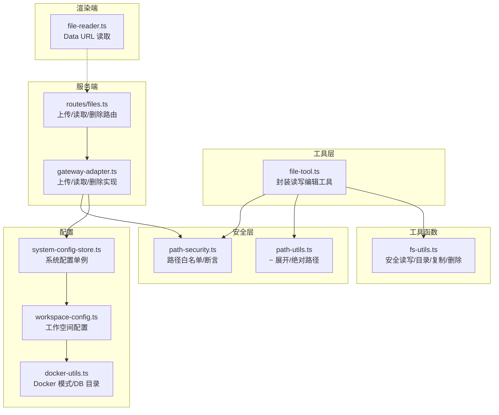
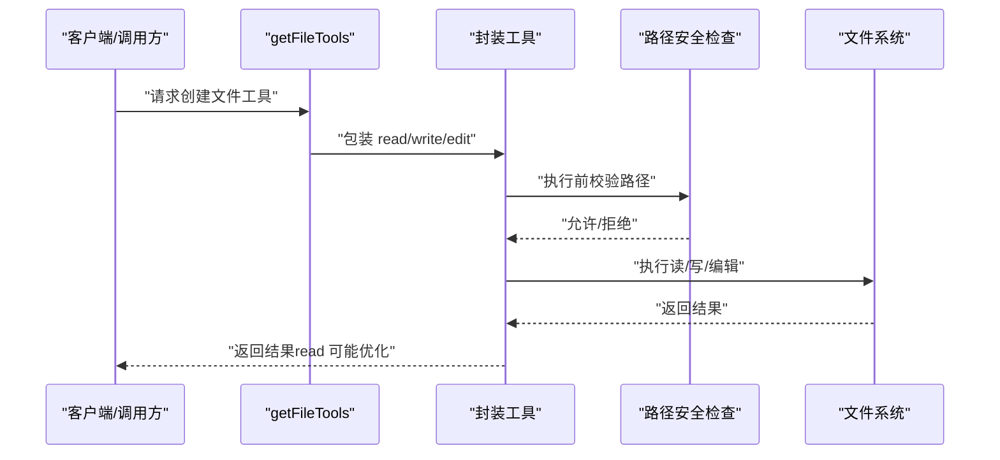
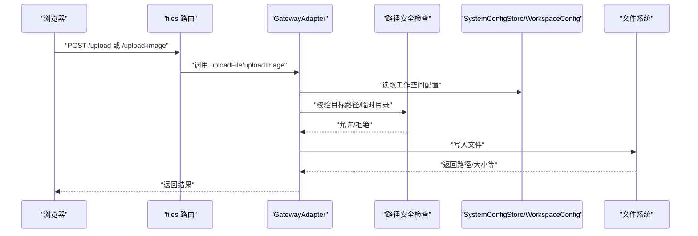
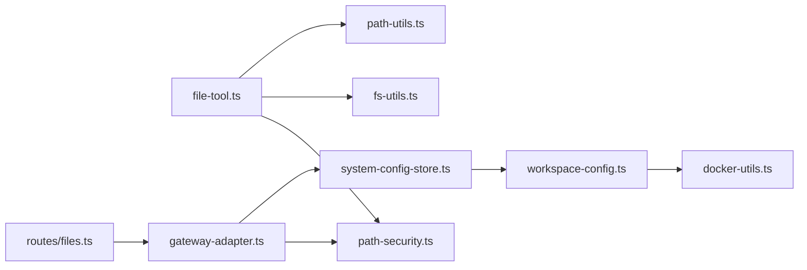

# 文件系统工具

<cite>
**本文引用的文件**
- [src/main/tools/file-tool.ts](file://src/main/tools/file-tool.ts)
- [src/main/utils/path-security.ts](file://src/main/utils/path-security.ts)
- [src/shared/utils/fs-utils.ts](file://src/shared/utils/fs-utils.ts)
- [src/shared/utils/path-utils.ts](file://src/shared/utils/path-utils.ts)
- [src/server/routes/files.ts](file://src/server/routes/files.ts)
- [src/server/gateway-adapter.ts](file://src/server/gateway-adapter.ts)
- [src/main/database/system-config-store.ts](file://src/main/database/system-config-store.ts)
- [src/main/database/workspace-config.ts](file://src/main/database/workspace-config.ts)
- [src/shared/utils/docker-utils.ts](file://src/shared/utils/docker-utils.ts)
- [src/renderer/utils/file-reader.ts](file://src/renderer/utils/file-reader.ts)
</cite>

## 目录
1. [简介](#简介)
2. [项目结构](#项目结构)
3. [核心组件](#核心组件)
4. [架构总览](#架构总览)
5. [详细组件分析](#详细组件分析)
6. [依赖关系分析](#依赖关系分析)
7. [性能考量](#性能考量)
8. [故障排除指南](#故障排除指南)
9. [结论](#结论)
10. [附录](#附录)

## 简介
本文件系统工具为 史丽慧小助理 提供安全可控的文件读写与编辑能力，并通过“白名单目录”机制限制文件访问范围，确保仅能在受信任的工作空间内进行操作。工具链覆盖：
- 文件读取（read）、写入（write）、编辑（edit）
- 路径安全检查与白名单校验
- 参数兼容与结果优化（如图片读取时去除大体积数据）
- Web 侧文件上传、图片读取与临时文件清理的后端适配
- 跨平台路径展开与规范化

## 项目结构
围绕文件系统功能的关键文件分布如下：
- 工具层：src/main/tools/file-tool.ts（封装 pi-coding-agent 的读写编辑工具，增加安全检查与参数兼容）
- 安全层：src/main/utils/path-security.ts（路径白名单、展开与断言）
- 工具函数：src/shared/utils/fs-utils.ts（安全读写、目录创建、复制、删除等）
- 路径工具：src/shared/utils/path-utils.ts（~ 展开、绝对路径解析）
- 服务端路由：src/server/routes/files.ts（上传、图片读取、临时文件删除）
- 网关适配：src/server/gateway-adapter.ts（上传/读取/删除的后端实现与安全校验）
- 配置存储：src/main/database/system-config-store.ts（系统配置单例）
- 工作空间配置：src/main/database/workspace-config.ts（工作目录、脚本、技能、图片、记忆、会话目录）
- Docker 工具：src/shared/utils/docker-utils.ts（Docker 模式判断与 DB 目录）
- 浏览器端工具：src/renderer/utils/file-reader.ts（Data URL 读取）

图表来源
- [src/main/tools/file-tool.ts:193-218](file://src/main/tools/file-tool.ts#L193-L218)
- [src/main/utils/path-security.ts:59-83](file://src/main/utils/path-security.ts#L59-L83)
- [src/shared/utils/path-utils.ts:21-33](file://src/shared/utils/path-utils.ts#L21-L33)
- [src/shared/utils/fs-utils.ts:19-79](file://src/shared/utils/fs-utils.ts#L19-L79)
- [src/server/routes/files.ts:10-106](file://src/server/routes/files.ts#L10-L106)
- [src/server/gateway-adapter.ts:558-720](file://src/server/gateway-adapter.ts#L558-L720)
- [src/main/database/system-config-store.ts:37-70](file://src/main/database/system-config-store.ts#L37-L70)
- [src/main/database/workspace-config.ts:51-89](file://src/main/database/workspace-config.ts#L51-L89)
- [src/shared/utils/docker-utils.ts:10-24](file://src/shared/utils/docker-utils.ts#L10-L24)
- [src/renderer/utils/file-reader.ts:16-23](file://src/renderer/utils/file-reader.ts#L16-L23)

章节来源
- [src/main/tools/file-tool.ts:193-218](file://src/main/tools/file-tool.ts#L193-L218)
- [src/server/routes/files.ts:10-106](file://src/server/routes/files.ts#L10-L106)

## 核心组件
- 文件工具工厂：getFileTools(workspaceDir) 返回三个封装后的工具（read、write、edit），内部通过 assertPathAllowed 进行路径安全检查，并对 read 结果进行优化（如图片读取时去除 base64，仅返回元信息与提示）。
- 路径安全检查：isPathAllowed/ assertPathAllowed 统一校验路径是否位于允许的目录集合内；Docker 模式下跳过检查。
- 工作空间配置：SystemConfigStore + WorkspaceConfig 提供工作目录、脚本目录、技能目录、图片目录、记忆目录、会话目录等，作为白名单来源。
- 服务端文件能力：Express 路由提供上传、图片读取、临时文件删除；GatewayAdapter 实现具体逻辑并复用路径安全检查。

章节来源
- [src/main/tools/file-tool.ts:193-218](file://src/main/tools/file-tool.ts#L193-L218)
- [src/main/utils/path-security.ts:59-117](file://src/main/utils/path-security.ts#L59-L117)
- [src/main/database/system-config-store.ts:37-70](file://src/main/database/system-config-store.ts#L37-L70)
- [src/main/database/workspace-config.ts:51-89](file://src/main/database/workspace-config.ts#L51-L89)
- [src/server/routes/files.ts:10-106](file://src/server/routes/files.ts#L10-L106)
- [src/server/gateway-adapter.ts:558-720](file://src/server/gateway-adapter.ts#L558-L720)

## 架构总览
文件系统工具的调用链路分为两类：
- 工具侧链路：客户端/调用方 -> getFileTools -> 包装工具 -> pi-coding-agent 原始工具 -> 安全检查 -> 返回结果
- 服务端链路：浏览器 -> Express 路由 -> GatewayAdapter -> 安全检查/配置读取 -> 文件系统操作

图表来源
- [src/main/tools/file-tool.ts:148-177](file://src/main/tools/file-tool.ts#L148-L177)
- [src/main/utils/path-security.ts:91-117](file://src/main/utils/path-security.ts#L91-L117)

图表来源
- [src/server/routes/files.ts:14-57](file://src/server/routes/files.ts#L14-L57)
- [src/server/gateway-adapter.ts:630-643](file://src/server/gateway-adapter.ts#L630-L643)
- [src/main/utils/path-security.ts:91-117](file://src/main/utils/path-security.ts#L91-L117)
- [src/main/database/system-config-store.ts:37-70](file://src/main/database/system-config-store.ts#L37-L70)
- [src/main/database/workspace-config.ts:51-89](file://src/main/database/workspace-config.ts#L51-L89)

## 详细组件分析

### 文件工具工厂（getFileTools）
- 职责
  - 确保工作区目录存在
  - 动态导入 pi-coding-agent 的 read/write/edit 工具
  - 包装工具：参数规范化（支持 Claude 风格 file_path/old_string/new_string -> pi-coding-agent 风格 path/oldText/newText）、执行前路径安全检查、read 结果优化
- 参数与返回
  - 输入：workspaceDir（工作区根目录）
  - 输出：AgentTool[]（长度为 3，顺序为 read、write、edit）
- 读取结果优化
  - 若为图片：移除 base64，仅返回类型、大小、状态与提示
  - 若为空文本：根据文件存在性与大小填充占位描述
- 安全要点
  - 所有工具在执行前都会调用 assertPathAllowed
  - Docker 模式下跳过路径检查

章节来源
- [src/main/tools/file-tool.ts:193-218](file://src/main/tools/file-tool.ts#L193-L218)
- [src/main/tools/file-tool.ts:42-69](file://src/main/tools/file-tool.ts#L42-L69)
- [src/main/tools/file-tool.ts:82-138](file://src/main/tools/file-tool.ts#L82-L138)
- [src/main/tools/file-tool.ts:148-177](file://src/main/tools/file-tool.ts#L148-L177)

### 路径安全检查（path-security）
- 白名单目录来源
  - 工作空间目录 workspaceDir
  - 数据库目录（Docker 模式：/data/db；Electron 模式：~/.slhbot）
  - 脚本目录 scriptDir
  - 技能目录 skillDirs[]
  - 图片生成目录 imageDir
  - 记忆目录 memoryDir
  - 会话目录 sessionDir
- 核心流程
  - Docker 模式：跳过检查
  - 展开 ~ 为用户主目录
  - 规范化为绝对路径并比较前缀
  - 任一允许目录满足前缀匹配即放行
- 断言行为
  - 不允许时抛出包含允许目录列表与请求路径的错误信息

章节来源
- [src/main/utils/path-security.ts:29-44](file://src/main/utils/path-security.ts#L29-L44)
- [src/main/utils/path-security.ts:59-83](file://src/main/utils/path-security.ts#L59-L83)
- [src/main/utils/path-security.ts:91-117](file://src/main/utils/path-security.ts#L91-L117)
- [src/main/database/system-config-store.ts:37-70](file://src/main/database/system-config-store.ts#L37-L70)
- [src/main/database/workspace-config.ts:51-89](file://src/main/database/workspace-config.ts#L51-L89)
- [src/shared/utils/docker-utils.ts:10-24](file://src/shared/utils/docker-utils.ts#L10-L24)

### 工具函数（fs-utils）
- ensureDirectoryExists：确保目录存在，不存在则递归创建
- safeReadFile：安全读取，不存在返回默认值，异常也返回默认值
- safeWriteFile：安全写入，自动创建父目录
- isDirectory/isFile：安全判断路径是否为目录/文件
- copyDirectory：递归复制目录
- safeRemove：安全删除（含异常捕获）

章节来源
- [src/shared/utils/fs-utils.ts:19-79](file://src/shared/utils/fs-utils.ts#L19-L79)
- [src/shared/utils/fs-utils.ts:82-162](file://src/shared/utils/fs-utils.ts#L82-L162)

### 路径工具（path-utils）
- expandUserPath：支持 ~ 展开与相对路径解析为绝对路径
- 其他辅助：startsWithTilde、getUserHomeDir

章节来源
- [src/shared/utils/path-utils.ts:21-47](file://src/shared/utils/path-utils.ts#L21-L47)

### 服务端文件路由与适配（files 路由、gateway-adapter）
- 路由
  - POST /upload：上传文件（限制最大 500MB）
  - POST /upload-image：上传图片（限制最大 5MB）
  - GET /read-image：读取图片（基于路径安全检查）
  - DELETE /temp：删除临时文件（仅允许删除工作空间下的 .slhbot/temp/uploads 子树）
- 适配器
  - uploadFile/uploadImage：解析 dataURL，生成唯一文件名，写入工作空间下的临时目录
  - readImage：路径白名单检查 + 读取 + MIME 转换为 Data URL
  - deleteTempFile：校验路径在临时目录内，再删除

章节来源
- [src/server/routes/files.ts:14-103](file://src/server/routes/files.ts#L14-L103)
- [src/server/gateway-adapter.ts:630-643](file://src/server/gateway-adapter.ts#L630-L643)
- [src/server/gateway-adapter.ts:645-682](file://src/server/gateway-adapter.ts#L645-L682)
- [src/server/gateway-adapter.ts:684-720](file://src/server/gateway-adapter.ts#L684-L720)

### 浏览器端文件读取（renderer）
- readFileAsDataURL：将 File 对象读取为 Data URL，便于上传

章节来源
- [src/renderer/utils/file-reader.ts:16-23](file://src/renderer/utils/file-reader.ts#L16-L23)

## 依赖关系分析
- 工具层依赖安全层与工具函数
- 服务端路由依赖网关适配器
- 网关适配器依赖安全层与配置存储
- 配置存储依赖工作空间配置与 Docker 工具

图表来源
- [src/main/tools/file-tool.ts:24-30](file://src/main/tools/file-tool.ts#L24-L30)
- [src/main/utils/path-security.ts:8-10](file://src/main/utils/path-security.ts#L8-L10)
- [src/shared/utils/fs-utils.ts:7-9](file://src/shared/utils/fs-utils.ts#L7-L9)
- [src/shared/utils/path-utils.ts:7-9](file://src/shared/utils/path-utils.ts#L7-L9)
- [src/server/routes/files.ts:7-9](file://src/server/routes/files.ts#L7-L9)
- [src/server/gateway-adapter.ts:566-571](file://src/server/gateway-adapter.ts#L566-L571)
- [src/main/database/system-config-store.ts:11-16](file://src/main/database/system-config-store.ts#L11-L16)
- [src/main/database/workspace-config.ts:5-11](file://src/main/database/workspace-config.ts#L5-L11)
- [src/shared/utils/docker-utils.ts:5-6](file://src/shared/utils/docker-utils.ts#L5-L6)

## 性能考量
- 读取优化：图片读取时移除 base64，避免向 AI 传递大体积数据，降低网络与推理成本
- 目录创建：统一使用 ensureDirectoryExists，避免重复 IO
- 路径检查：白名单前缀匹配 O(1) 检查每个允许目录，整体复杂度 O(k)，k 为允许目录数
- 上传限制：服务端对文件大小进行上限控制，防止异常大文件占用磁盘与带宽

## 故障排除指南
- 路径不在白名单
  - 现象：抛出包含允许目录列表与请求路径的错误
  - 处理：在系统设置中配置工作目录与相关目录，确保请求路径位于允许目录内
  - 参考：[src/main/utils/path-security.ts:91-117](file://src/main/utils/path-security.ts#L91-L117)
- Docker 模式下仍报路径受限
  - 现象：容器内路径被限制
  - 处理：确认 DEEPBOT_DOCKER=true 且挂载了正确的卷；白名单目录在容器内对应 /data/*
  - 参考：[src/shared/utils/docker-utils.ts:10-24](file://src/shared/utils/docker-utils.ts#L10-L24)
- 上传失败（文件过大/格式无效）
  - 现象：返回错误信息
  - 处理：检查文件大小是否超过限制，确认 dataURL 格式正确
  - 参考：[src/server/gateway-adapter.ts:572-596](file://src/server/gateway-adapter.ts#L572-L596)
- 读取图片失败（路径不存在/非图片）
  - 现象：返回错误信息
  - 处理：确认路径存在且为图片文件，检查白名单限制
  - 参考：[src/server/gateway-adapter.ts:657-659](file://src/server/gateway-adapter.ts#L657-L659)
- 删除临时文件失败
  - 现象：返回错误信息
  - 处理：确认路径在工作空间下的 .slhbot/temp/uploads 子树内
  - 参考：[src/server/gateway-adapter.ts:694-701](file://src/server/gateway-adapter.ts#L694-L701)
- 读取结果异常（空文件/图片）
  - 现象：read 返回占位描述或仅文本提示
  - 处理：这是预期行为，避免重复读取同一文件
  - 参考：[src/main/tools/file-tool.ts:82-138](file://src/main/tools/file-tool.ts#L82-L138)

章节来源
- [src/main/utils/path-security.ts:91-117](file://src/main/utils/path-security.ts#L91-L117)
- [src/shared/utils/docker-utils.ts:10-24](file://src/shared/utils/docker-utils.ts#L10-L24)
- [src/server/gateway-adapter.ts:572-596](file://src/server/gateway-adapter.ts#L572-L596)
- [src/server/gateway-adapter.ts:657-659](file://src/server/gateway-adapter.ts#L657-L659)
- [src/server/gateway-adapter.ts:694-701](file://src/server/gateway-adapter.ts#L694-L701)
- [src/main/tools/file-tool.ts:82-138](file://src/main/tools/file-tool.ts#L82-L138)

## 结论
史丽慧小助理 文件系统工具通过“白名单目录 + 路径断言 + 参数兼容 + 结果优化”的设计，在保障安全性的同时提供了简洁易用的文件操作能力。工具链覆盖从 Agent 工具到 Web 上传/读取/删除的完整场景，并在 Docker 与 Electron 两种运行模式下均能稳定工作。

## 附录

### API 一览（服务端）
- POST /files/upload
  - 请求体：fileName, dataUrl, fileSize, fileType
  - 限制：最大 500MB
  - 返回：包含 file.id、path、name、size、type
- POST /files/upload-image
  - 请求体：fileName, dataUrl, fileSize
  - 限制：最大 5MB
  - 返回：包含 image.id、path、name、size、dataUrl
- GET /files/read-image
  - 查询参数：path
  - 返回：包含 data（Data URL）
- DELETE /files/temp
  - 查询参数：path
  - 限制：仅允许删除工作空间下的 .slhbot/temp/uploads 子树

章节来源
- [src/server/routes/files.ts:14-103](file://src/server/routes/files.ts#L14-L103)

### 使用场景与最佳实践
- 文件读取
  - 优先使用 getFileTools 返回的 read 工具，避免直接操作底层路径
  - 对图片读取建议仅做一次，利用 read 的优化提示避免重复读取
- 文件写入/编辑
  - 确保目标路径在白名单目录内
  - 写入前使用 ensureDirectoryExists 确保父目录存在
- 上传与预览
  - 浏览器端使用 readFileAsDataURL 生成 Data URL，再通过 /files/upload-image 预览
  - 上传完成后及时调用 /files/temp 删除临时文件
- Docker 部署
  - 通过挂载卷提供 /data/* 目录，避免在容器内手动修改配置

章节来源
- [src/main/tools/file-tool.ts:193-218](file://src/main/tools/file-tool.ts#L193-L218)
- [src/shared/utils/fs-utils.ts:19-79](file://src/shared/utils/fs-utils.ts#L19-L79)
- [src/renderer/utils/file-reader.ts:16-23](file://src/renderer/utils/file-reader.ts#L16-L23)
- [src/server/routes/files.ts:14-103](file://src/server/routes/files.ts#L14-L103)
- [src/server/gateway-adapter.ts:630-643](file://src/server/gateway-adapter.ts#L630-L643)
- [src/server/gateway-adapter.ts:684-720](file://src/server/gateway-adapter.ts#L684-L720)