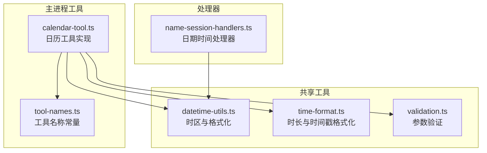
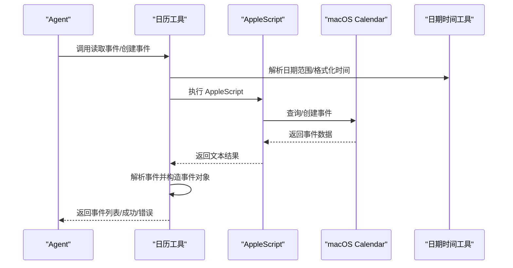
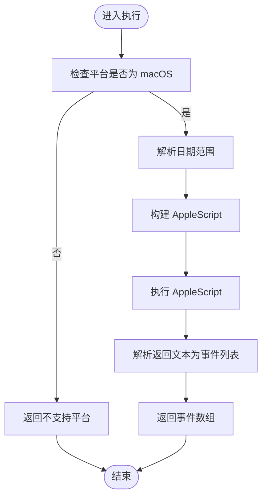
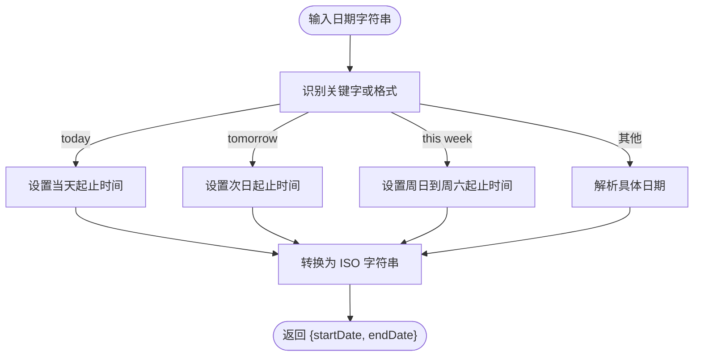
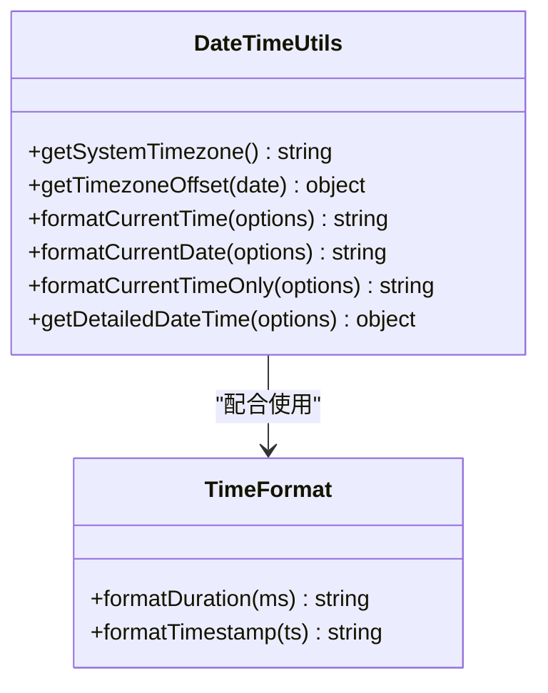
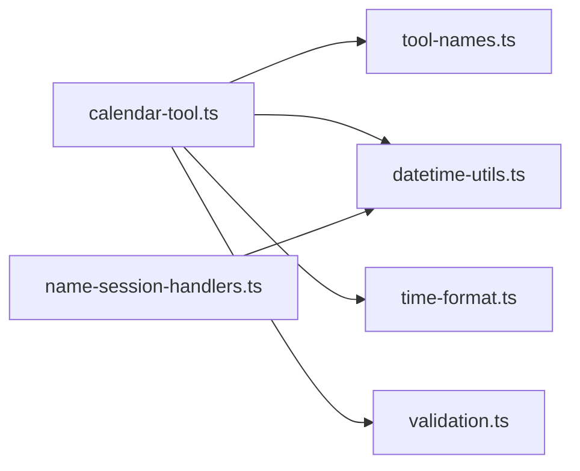

# 日历管理工具

<cite>
**本文引用的文件列表**
- [calendar-tool.ts](file://src/main/tools/calendar-tool.ts)
- [datetime-utils.ts](file://src/shared/utils/datetime-utils.ts)
- [time-format.ts](file://src/shared/utils/time-format.ts)
- [tool-names.ts](file://src/main/tools/tool-names.ts)
- [name-session-handlers.ts](file://src/main/tools/handlers/name-session-handlers.ts)
- [validation.ts](file://src/shared/utils/validation.ts)
- [README.md](file://README.md)
</cite>

## 目录
1. [简介](#简介)
2. [项目结构](#项目结构)
3. [核心组件](#核心组件)
4. [架构总览](#架构总览)
5. [详细组件分析](#详细组件分析)
6. [依赖关系分析](#依赖关系分析)
7. [性能考量](#性能考量)
8. [故障排查指南](#故障排查指南)
9. [结论](#结论)
10. [附录](#附录)

## 简介
本文件面向 史丽慧小助理 的日历管理工具，系统性阐述其时间计算、日期格式化与日程管理能力，覆盖 API 接口定义、参数配置、时间处理机制、时区处理、日期验证与时间戳转换，并提供最佳实践与常见使用场景。日历工具基于 AppleScript 与 macOS Calendar 应用交互，提供“读取日历事件”和“创建日历事件”两大能力，且具备自然语言日期解析与错误处理机制。

## 项目结构
日历工具位于主进程工具模块中，配合共享的日期时间工具与处理器模块共同完成时间格式化、时区获取与日期解析等功能。

图表来源
- [calendar-tool.ts:1-452](file://src/main/tools/calendar-tool.ts#L1-L452)
- [datetime-utils.ts:1-179](file://src/shared/utils/datetime-utils.ts#L1-L179)
- [time-format.ts:1-73](file://src/shared/utils/time-format.ts#L1-L73)
- [tool-names.ts:1-106](file://src/main/tools/tool-names.ts#L1-L106)
- [name-session-handlers.ts:1-361](file://src/main/tools/handlers/name-session-handlers.ts#L1-L361)

章节来源
- [calendar-tool.ts:1-452](file://src/main/tools/calendar-tool.ts#L1-L452)
- [datetime-utils.ts:1-179](file://src/shared/utils/datetime-utils.ts#L1-L179)
- [time-format.ts:1-73](file://src/shared/utils/time-format.ts#L1-L73)
- [tool-names.ts:1-106](file://src/main/tools/tool-names.ts#L1-L106)
- [name-session-handlers.ts:1-361](file://src/main/tools/handlers/name-session-handlers.ts#L1-L361)

## 核心组件
- 日历工具（calendar-tool.ts）
  - 读取日历事件：支持自然语言日期（today/tomorrow/this week）与具体日期范围解析，返回事件列表。
  - 创建日历事件：支持标题、起止时间、地点、备注与日历名称参数。
  - 平台限制：仅 macOS，需授予 Automation 权限。
  - 参数校验：使用 TypeBox Schema 定义参数结构。
- 日期时间工具（datetime-utils.ts）
  - 获取系统时区、计算时区偏移、格式化当前时间/日期/时间（含星期与 12/24 小时制）、输出详细时间信息。
- 时间格式化工具（time-format.ts）
  - 持续时间格式化（毫秒转人类可读）、时间戳格式化（毫秒转“年-月-日 时:分:秒”）。
- 工具名称常量（tool-names.ts）
  - 统一日历工具名称常量，避免硬编码。
- 日期时间处理器（name-session-handlers.ts）
  - 提供“获取日期时间”工具，支持多种格式输出与详细信息返回。
- 参数验证（validation.ts）
  - 提供字符串/数字/布尔的必需与可选参数验证工具。

章节来源
- [calendar-tool.ts:164-451](file://src/main/tools/calendar-tool.ts#L164-L451)
- [datetime-utils.ts:12-179](file://src/shared/utils/datetime-utils.ts#L12-L179)
- [time-format.ts:16-72](file://src/shared/utils/time-format.ts#L16-L72)
- [tool-names.ts:23-25](file://src/main/tools/tool-names.ts#L23-L25)
- [name-session-handlers.ts:272-361](file://src/main/tools/handlers/name-session-handlers.ts#L272-L361)
- [validation.ts:8-72](file://src/shared/utils/validation.ts#L8-L72)

## 架构总览
日历工具通过 AppleScript 与 macOS Calendar 交互，内部封装日期解析与格式化逻辑，并在执行前进行平台与权限检查。日期时间工具与处理器提供统一的时区与格式化能力，确保跨模块一致性。

图表来源
- [calendar-tool.ts:164-451](file://src/main/tools/calendar-tool.ts#L164-L451)
- [datetime-utils.ts:12-179](file://src/shared/utils/datetime-utils.ts#L12-L179)

## 详细组件分析

### 日历工具（读取与创建）
- 读取日历事件
  - 参数
    - dateRange：支持 today、tomorrow、this week、YYYY-MM-DD、YYYY-MM-DD to YYYY-MM-DD。
    - calendarName：可选，限定日历名称。
  - 流程
    - 平台检查（仅 macOS）。
    - 解析日期范围为 ISO 字符串。
    - 构造 AppleScript，遍历日历筛选事件。
    - 解析返回文本为事件对象列表。
  - 输出
    - 成功时返回事件数组与日期范围详情；失败时返回错误信息。
- 创建日历事件
  - 参数
    - title、startDate、endDate（ISO 格式）、location（可选）、notes（可选）、calendarName（可选）。
  - 流程
    - 平台检查（仅 macOS）。
    - 格式化日期为 AppleScript 可识别格式。
    - 构造 AppleScript 创建事件，可选设置地点与备注。
  - 输出
    - 成功时返回创建结果与事件详情；失败时返回错误信息。

图表来源
- [calendar-tool.ts:164-298](file://src/main/tools/calendar-tool.ts#L164-L298)
- [calendar-tool.ts:303-433](file://src/main/tools/calendar-tool.ts#L303-L433)

章节来源
- [calendar-tool.ts:164-451](file://src/main/tools/calendar-tool.ts#L164-L451)

### 日期解析与格式化
- 日期范围解析
  - 支持 today、tomorrow、this week 与具体日期范围。
  - 将输入转换为 ISO 字符串的 startDate 与 endDate。
- AppleScript 日期格式
  - 将 ISO 日期格式化为 "YYYY-MM-DD HH:mm:ss"，供 AppleScript 使用。
- 时区与格式化
  - 通过共享工具获取系统时区与偏移，支持多种格式化选项（locale、hour12、includeWeekday）。

图表来源
- [calendar-tool.ts:114-159](file://src/main/tools/calendar-tool.ts#L114-L159)
- [datetime-utils.ts:12-179](file://src/shared/utils/datetime-utils.ts#L12-L179)

章节来源
- [calendar-tool.ts:114-159](file://src/main/tools/calendar-tool.ts#L114-L159)
- [datetime-utils.ts:12-179](file://src/shared/utils/datetime-utils.ts#L12-L179)

### 时区处理与时间戳转换
- 时区获取
  - 优先使用系统时区（Intl.DateTimeFormat），降级为 Asia/Shanghai。
- 时区偏移
  - 计算 UTC 偏移（小时与分钟），输出符号与字符串形式。
- 时间戳与格式化
  - 提供毫秒时间戳格式化为“年-月-日 时:分:秒”的工具。
  - 提供持续时间格式化（毫秒）为人类可读字符串。

图表来源
- [datetime-utils.ts:12-179](file://src/shared/utils/datetime-utils.ts#L12-L179)
- [time-format.ts:16-72](file://src/shared/utils/time-format.ts#L16-L72)

章节来源
- [datetime-utils.ts:12-179](file://src/shared/utils/datetime-utils.ts#L12-L179)
- [time-format.ts:16-72](file://src/shared/utils/time-format.ts#L16-L72)

### API 接口与参数配置
- 工具名称常量
  - CALENDAR_GET_EVENTS、CALENDAR_CREATE_EVENT。
- 读取事件参数
  - dateRange（必填）、calendarName（可选）。
- 创建事件参数
  - title（必填）、startDate（必填）、endDate（必填）、location（可选）、notes（可选）、calendarName（可选）。
- 日期时间处理器参数
  - format（可选，支持 date、time、datetime、iso、timestamp、full）、timezone（可选）。

章节来源
- [tool-names.ts:23-25](file://src/main/tools/tool-names.ts#L23-L25)
- [calendar-tool.ts:169-176](file://src/main/tools/calendar-tool.ts#L169-L176)
- [calendar-tool.ts:308-327](file://src/main/tools/calendar-tool.ts#L308-L327)
- [name-session-handlers.ts:272-361](file://src/main/tools/handlers/name-session-handlers.ts#L272-L361)

### 最佳实践与常见场景
- 读取今日/明日/本周日程
  - 使用 dateRange 传入 today、tomorrow 或 this week。
- 指定日期范围
  - 使用 "YYYY-MM-DD to YYYY-MM-DD" 形式。
- 指定日历
  - 通过 calendarName 指定日历名称，否则默认读取全部日历。
- 创建会议/提醒
  - 提供标题、起止时间、地点与备注，必要时指定日历名称。
- 时区与本地化
  - 若需特定时区，可在处理器中传入 timezone 参数；日历工具内部使用系统时区进行 AppleScript 日期格式化。

章节来源
- [calendar-tool.ts:168-176](file://src/main/tools/calendar-tool.ts#L168-L176)
- [calendar-tool.ts:307-327](file://src/main/tools/calendar-tool.ts#L307-L327)
- [name-session-handlers.ts:272-361](file://src/main/tools/handlers/name-session-handlers.ts#L272-L361)

## 依赖关系分析
- 日历工具依赖
  - 工具名称常量（tool-names.ts）
  - 日期时间工具（datetime-utils.ts）
  - 时间格式化工具（time-format.ts）
  - 参数验证（validation.ts）
  - 错误处理（错误信息提取）
- 处理器依赖
  - 日期时间工具（datetime-utils.ts）

图表来源
- [calendar-tool.ts:24-31](file://src/main/tools/calendar-tool.ts#L24-L31)
- [tool-names.ts:8-94](file://src/main/tools/tool-names.ts#L8-L94)
- [datetime-utils.ts:12-179](file://src/shared/utils/datetime-utils.ts#L12-L179)
- [time-format.ts:16-72](file://src/shared/utils/time-format.ts#L16-L72)
- [validation.ts:8-72](file://src/shared/utils/validation.ts#L8-L72)
- [name-session-handlers.ts:282-282](file://src/main/tools/handlers/name-session-handlers.ts#L282-L282)

章节来源
- [calendar-tool.ts:24-31](file://src/main/tools/calendar-tool.ts#L24-L31)
- [tool-names.ts:8-94](file://src/main/tools/tool-names.ts#L8-L94)
- [datetime-utils.ts:12-179](file://src/shared/utils/datetime-utils.ts#L12-L179)
- [time-format.ts:16-72](file://src/shared/utils/time-format.ts#L16-L72)
- [validation.ts:8-72](file://src/shared/utils/validation.ts#L8-L72)
- [name-session-handlers.ts:282-282](file://src/main/tools/handlers/name-session-handlers.ts#L282-L282)

## 性能考量
- AppleScript 调用
  - 读取事件时需遍历日历并筛选事件，建议限定日期范围与日历名称以减少查询量。
- 日期解析
  - 日期范围解析为 O(1)，对性能影响极小。
- 格式化
  - 格式化为 AppleScript 日期格式与人类可读字符串均为轻量操作。

[本节为通用指导，无需列出章节来源]

## 故障排查指南
- 平台不支持
  - 现象：返回“仅支持 macOS 平台”。
  - 处理：确保在 macOS 上运行。
- 权限不足
  - 现象：AppleScript 执行报错，提示“not allowed”或“permission”。
  - 处理：前往“系统偏好设置 > 安全性与隐私 > 隐私 > 自动化”，允许 史丽慧小助理 控制 Calendar.app。
- 日期格式错误
  - 现象：解析失败或事件未返回。
  - 处理：确保 dateRange 使用支持的格式（today、tomorrow、this week、YYYY-MM-DD、YYYY-MM-DD to YYYY-MM-DD）。
- 事件创建失败
  - 现象：创建事件返回错误。
  - 处理：检查 startDate/endDate 是否为有效 ISO 格式，calendarName 是否存在。

章节来源
- [calendar-tool.ts:59-86](file://src/main/tools/calendar-tool.ts#L59-L86)
- [calendar-tool.ts:114-159](file://src/main/tools/calendar-tool.ts#L114-L159)
- [calendar-tool.ts:358-360](file://src/main/tools/calendar-tool.ts#L358-L360)

## 结论
史丽慧小助理 的日历管理工具通过 AppleScript 与 macOS Calendar 深度集成，提供简洁可靠的日程读取与创建能力。其自然语言日期解析、统一的时区与格式化工具以及完善的错误处理，使得在 macOS 环境下进行日程管理变得直观高效。建议在实际使用中合理限定日期范围与日历范围，确保权限正确配置，并根据需要选择合适的格式化策略。

[本节为总结性内容，无需列出章节来源]

## 附录

### 常用使用场景与示例路径
- 读取今日日程
  - 参数：dateRange = "today"
  - 示例路径：[calendar-tool.ts:169-176](file://src/main/tools/calendar-tool.ts#L169-L176)
- 读取本周日程
  - 参数：dateRange = "this week"
  - 示例路径：[calendar-tool.ts:169-176](file://src/main/tools/calendar-tool.ts#L169-L176)
- 指定日期范围
  - 参数：dateRange = "2025-01-01 to 2025-01-07"
  - 示例路径：[calendar-tool.ts:169-176](file://src/main/tools/calendar-tool.ts#L169-L176)
- 创建会议
  - 参数：title、startDate、endDate、location、notes、calendarName
  - 示例路径：[calendar-tool.ts:308-327](file://src/main/tools/calendar-tool.ts#L308-L327)
- 获取当前时间（多种格式）
  - 参数：format（date/time/datetime/iso/timestamp/full）、timezone（可选）
  - 示例路径：[name-session-handlers.ts:272-361](file://src/main/tools/handlers/name-session-handlers.ts#L272-L361)

章节来源
- [calendar-tool.ts:169-176](file://src/main/tools/calendar-tool.ts#L169-L176)
- [calendar-tool.ts:308-327](file://src/main/tools/calendar-tool.ts#L308-L327)
- [name-session-handlers.ts:272-361](file://src/main/tools/handlers/name-session-handlers.ts#L272-L361)