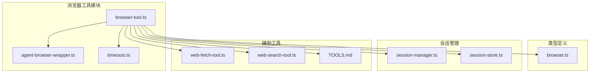
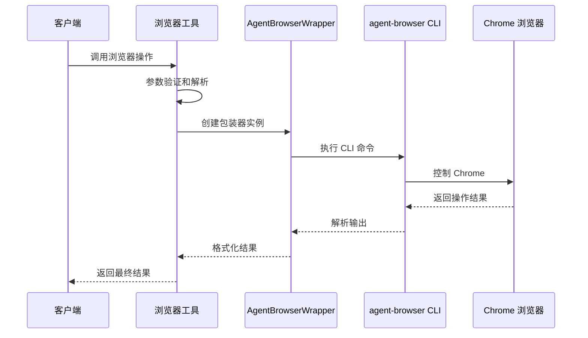
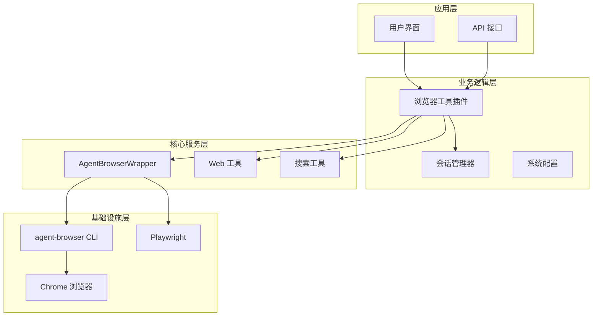
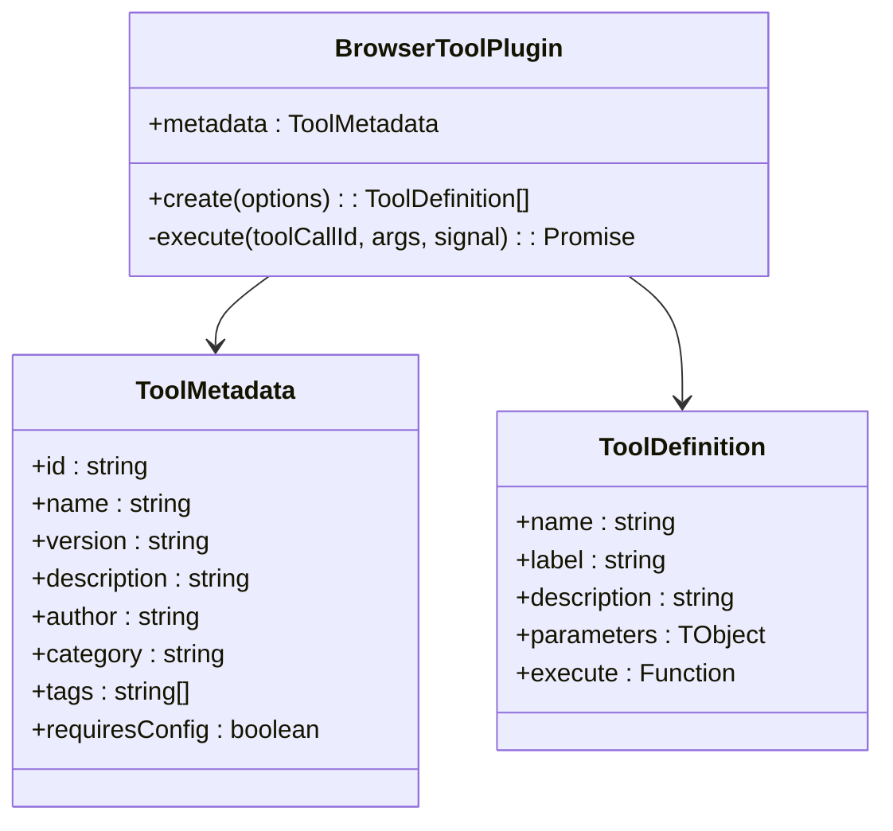
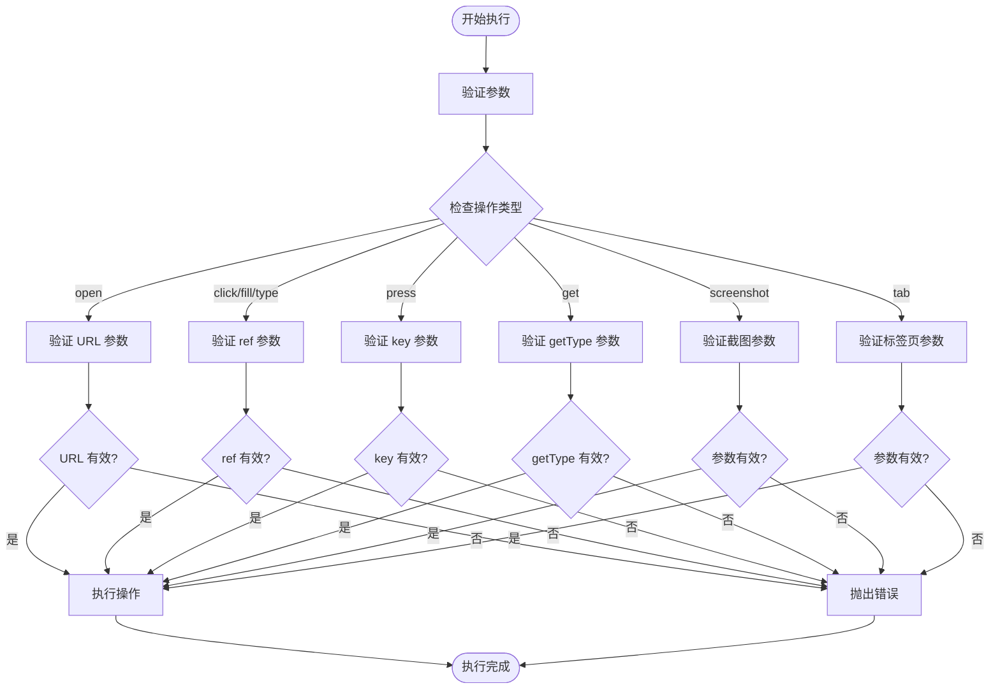
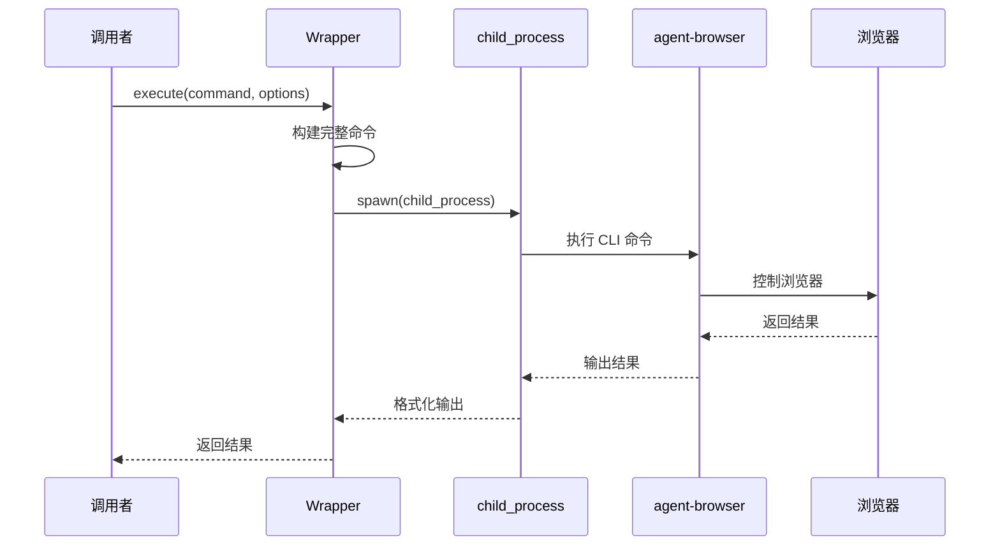
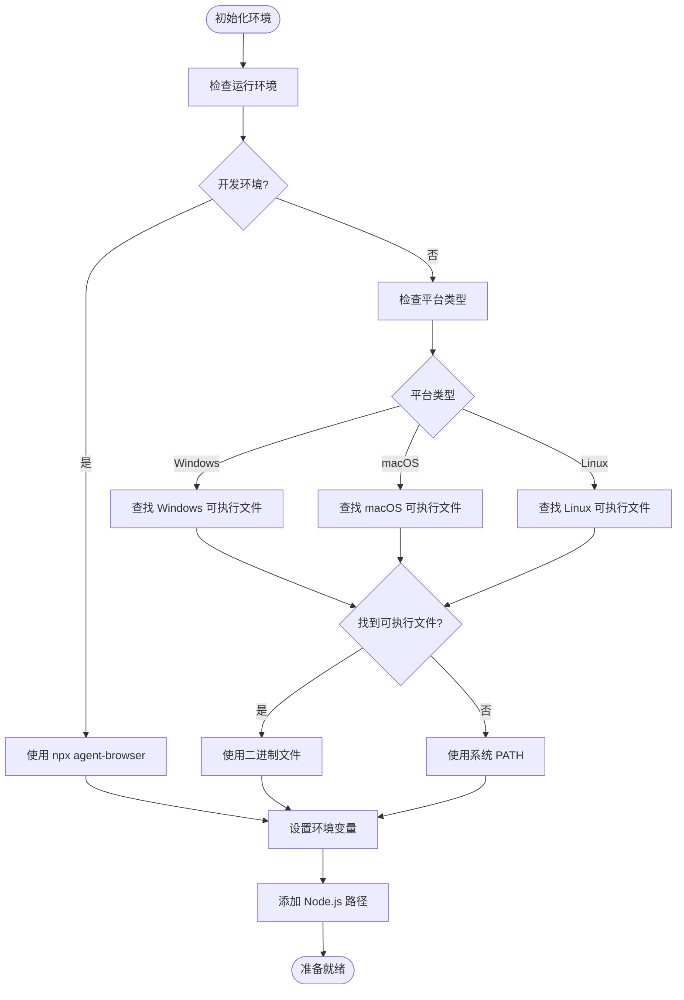
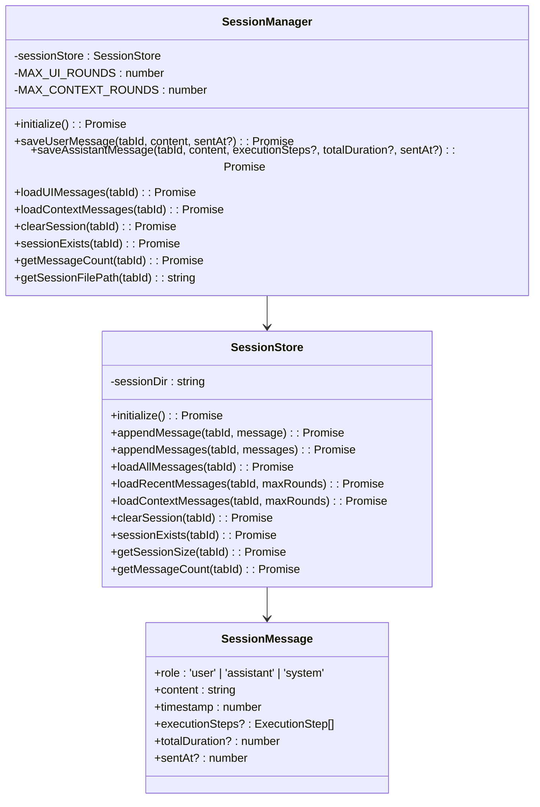
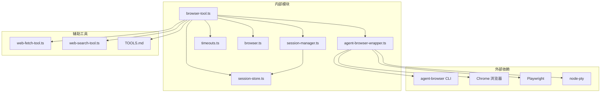

# 浏览器自动化工具

<cite>
**本文档引用的文件**
- [browser-tool.ts](file://src/main/tools/browser-tool.ts)
- [agent-browser-wrapper.ts](file://src/main/browser/agent-browser-wrapper.ts)
- [browser.ts](file://src/types/browser.ts)
- [timeouts.ts](file://src/main/config/timeouts.ts)
- [TOOLS.md](file://src/main/prompts/templates/TOOLS.md)
- [web-fetch-tool.ts](file://src/main/tools/web-fetch-tool.ts)
- [web-search-tool.ts](file://src/main/tools/web-search-tool.ts)
- [session-manager.ts](file://src/main/session/session-manager.ts)
- [session-store.ts](file://src/main/session/session-store.ts)
</cite>

## 目录
1. [简介](#简介)
2. [项目结构](#项目结构)
3. [核心组件](#核心组件)
4. [架构概览](#架构概览)
5. [详细组件分析](#详细组件分析)
6. [依赖关系分析](#依赖关系分析)
7. [性能考虑](#性能考虑)
8. [故障排除指南](#故障排除指南)
9. [结论](#结论)
10. [附录](#附录)

## 简介

史丽慧小助理 浏览器自动化工具是一个基于 Playwright 的网页操作解决方案，提供了完整的浏览器控制功能。该工具支持页面导航、元素交互、截图和内容提取等核心功能，通过 @ref 系统实现精确的元素定位。

### 核心特性

- **零配置开箱即用**：无需额外配置，直接连接系统 Chrome 浏览器
- **@ref 元素定位系统**：使用 @e1、@e2 等唯一标识符精确定位页面元素
- **多平台支持**：支持 macOS、Windows、Linux 操作系统
- **Docker 兼容**：内置 Playwright Chromium 支持容器环境
- **会话管理**：完整的对话历史记录和状态管理

## 项目结构

史丽慧小助理 浏览器工具采用模块化架构设计，主要包含以下核心模块：



**图表来源**
- [browser-tool.ts:1-50](file://src/main/tools/browser-tool.ts#L1-50)
- [agent-browser-wrapper.ts:1-50](file://src/main/browser/agent-browser-wrapper.ts#L1-50)
- [browser.ts:1-50](file://src/types/browser.ts#L1-50)

**章节来源**
- [browser-tool.ts:1-100](file://src/main/tools/browser-tool.ts#L1-L100)
- [agent-browser-wrapper.ts:1-100](file://src/main/browser/agent-browser-wrapper.ts#L1-L100)

## 核心组件

### 浏览器工具插件

浏览器工具插件是整个系统的核心入口，提供了完整的浏览器控制功能。该插件支持 18 种不同的浏览器操作类型，包括页面导航、元素交互、截图等。

#### 支持的操作类型

| 操作类型 | 功能描述 | 必需参数 |
|---------|----------|----------|
| open | 打开网页 URL | url |
| snapshot | 获取页面快照 | interactive (可选) |
| click | 点击元素 | ref |
| fill | 填充输入框 | ref, text |
| type | 输入文本 | ref, text |
| press | 按键操作 | key |
| hover | 鼠标悬停 | ref |
| check/uncheck | 复选框操作 | ref |
| select | 下拉框选择 | ref, text |
| scroll | 页面滚动 | direction, amount |
| get | 获取信息 | getType (text/value/title/url) |
| screenshot | 截图 | screenshotPath (可选), fullPage (可选) |
| tab | 标签页管理 | tabAction, tabIndex (可选) |

#### 核心规则

浏览器工具遵循严格的操作规则以确保稳定性和可靠性：

1. **每次页面变更后必须执行 snapshot**
2. **@ref 是确定性的，指向 snapshot 时的精确元素**
3. **@ref 在页面变化后会失效，必须重新获取**
4. **页面跳转、按钮点击、表单提交后必须重新 snapshot**

**章节来源**
- [browser-tool.ts:29-94](file://src/main/tools/browser-tool.ts#L29-L94)
- [browser-tool.ts:168-213](file://src/main/tools/browser-tool.ts#L168-L213)

### AgentBrowserWrapper 包装器

AgentBrowserWrapper 是浏览器操作的核心封装类，负责与 agent-browser CLI 工具进行交互。

#### 主要功能

- **命令执行**：封装 agent-browser CLI 命令调用
- **输出解析**：解析和格式化 agent-browser 的输出结果
- **超时控制**：集成超时配置管理系统
- **错误处理**：提供详细的错误信息和诊断

#### 支持的方法

| 方法 | 功能描述 | 参数 |
|------|----------|------|
| open | 打开 URL | url: string |
| snapshot | 获取页面快照 | interactive: boolean (默认 true) |
| click | 点击元素 | ref: string |
| fill | 填充输入框 | ref: string, text: string |
| type | 输入文本 | ref: string, text: string |
| screenshot | 截图 | options: {path?, fullPage?} |
| wait | 等待元素 | ref: string, timeout?: number |

**章节来源**
- [agent-browser-wrapper.ts:70-116](file://src/main/browser/agent-browser-wrapper.ts#L70-L116)
- [agent-browser-wrapper.ts:226-417](file://src/main/browser/agent-browser-wrapper.ts#L226-L417)

## 架构概览

史丽慧小助理 浏览器自动化工具采用分层架构设计，确保了良好的可维护性和扩展性。



**图表来源**
- [browser-tool.ts:215-248](file://src/main/tools/browser-tool.ts#L215-L248)
- [agent-browser-wrapper.ts:121-221](file://src/main/browser/agent-browser-wrapper.ts#L121-L221)

### 系统架构



**图表来源**
- [browser-tool.ts:171-181](file://src/main/tools/browser-tool.ts#L171-L181)
- [agent-browser-wrapper.ts:70-77](file://src/main/browser/agent-browser-wrapper.ts#L70-L77)

## 详细组件分析

### 浏览器工具插件架构

浏览器工具插件采用插件化设计，支持动态加载和配置管理。



**图表来源**
- [browser-tool.ts:171-181](file://src/main/tools/browser-tool.ts#L171-L181)
- [browser-tool.ts:183-213](file://src/main/tools/browser-tool.ts#L183-L213)

#### 参数验证系统

浏览器工具实现了严格的参数验证机制，确保每个操作的正确性和安全性。



**图表来源**
- [browser-tool.ts:364-800](file://src/main/tools/browser-tool.ts#L364-L800)

**章节来源**
- [browser-tool.ts:71-166](file://src/main/tools/browser-tool.ts#L71-L166)
- [browser-tool.ts:364-800](file://src/main/tools/browser-tool.ts#L364-L800)

### AgentBrowserWrapper 核心功能

AgentBrowserWrapper 提供了类型安全的浏览器操作接口，封装了复杂的命令执行逻辑。

#### 命令执行流程



**图表来源**
- [agent-browser-wrapper.ts:121-221](file://src/main/browser/agent-browser-wrapper.ts#L121-L221)

#### 环境变量管理

Wrapper 类实现了智能的环境变量管理，确保在不同环境下都能正确执行。



**图表来源**
- [agent-browser-wrapper.ts:82-116](file://src/main/browser/agent-browser-wrapper.ts#L82-L116)
- [agent-browser-wrapper.ts:147-192](file://src/main/browser/agent-browser-wrapper.ts#L147-L192)

**章节来源**
- [agent-browser-wrapper.ts:121-221](file://src/main/browser/agent-browser-wrapper.ts#L121-L221)
- [agent-browser-wrapper.ts:147-192](file://src/main/browser/agent-browser-wrapper.ts#L147-L192)

### 会话管理系统

史丽慧小助理 实现了完整的会话管理功能，支持多 Tab 的独立会话和消息持久化。

#### 会话存储架构



**图表来源**
- [session-manager.ts:17-193](file://src/main/session/session-manager.ts#L17-L193)
- [session-store.ts:46-323](file://src/main/session/session-store.ts#L46-L323)

#### 性能优化策略

会话管理系统采用了多项性能优化策略：

1. **倒序读取优化**：从文件末尾开始读取，减少 I/O 操作
2. **轮次缓存**：智能缓存最近的对话轮次
3. **增量存储**：只追加新消息，避免全量重写
4. **内存管理**：合理控制内存使用，避免内存泄漏

**章节来源**
- [session-manager.ts:17-193](file://src/main/session/session-manager.ts#L17-L193)
- [session-store.ts:146-247](file://src/main/session/session-store.ts#L146-L247)

## 依赖关系分析

史丽慧小助理 浏览器工具的依赖关系清晰明确，遵循了模块化设计原则。



**图表来源**
- [browser-tool.ts:16-25](file://src/main/tools/browser-tool.ts#L16-L25)
- [agent-browser-wrapper.ts:11-17](file://src/main/browser/agent-browser-wrapper.ts#L11-L17)

### 超时配置系统

系统实现了灵活的超时配置机制，支持不同操作类型的差异化超时设置。

#### 超时配置分类

| 超时类型 | 默认值 | 用途 | 说明 |
|---------|--------|------|------|
| BROWSER_DEFAULT_TIMEOUT | 30 秒 | 通用浏览器操作 | 基础超时时间 |
| BROWSER_NAVIGATION_TIMEOUT | 30 秒 | 页面导航 | 导航操作超时 |
| BROWSER_ACTION_TIMEOUT | 10 秒 | 元素操作 | 点击、输入等操作超时 |
| BROWSER_SNAPSHOT_TIMEOUT | 5 秒 | 快照生成 | 页面快照超时 |
| BROWSER_NETWORK_IDLE_TIMEOUT | 3 秒 | 网络空闲 | 等待网络空闲超时 |
| BROWSER_WAIT_NAVIGATION_TIMEOUT | 10 秒 | 等待导航 | 导航等待超时 |

**章节来源**
- [timeouts.ts:9-53](file://src/main/config/timeouts.ts#L9-L53)
- [timeouts.ts:58-77](file://src/main/config/timeouts.ts#L58-L77)

## 性能考虑

史丽慧小助理 浏览器工具在设计时充分考虑了性能优化，采用了多项策略来提升执行效率。

### 性能优化策略

1. **异步操作**：所有浏览器操作都采用异步执行，避免阻塞主线程
2. **智能缓存**：@ref 元素定位结果缓存，减少重复查询
3. **批量处理**：支持批量消息处理，减少 I/O 操作次数
4. **内存管理**：合理的内存使用策略，避免内存泄漏
5. **超时控制**：灵活的超时配置，平衡性能和稳定性

### 最佳实践建议

1. **合理使用 snapshot**：每次页面变更后及时执行 snapshot 获取最新元素列表
2. **避免过度等待**：根据实际需求调整等待时间，避免不必要的超时
3. **批量操作**：将相关的浏览器操作组合在一起执行
4. **资源清理**：及时清理不需要的标签页和会话资源
5. **错误处理**：实现完善的错误处理机制，确保操作的可靠性

## 故障排除指南

### 常见问题及解决方案

#### Chrome 连接问题

**问题描述**：无法连接到 Chrome 浏览器

**解决方案**：
1. 确保 Chrome 已正确启动并监听 9222 端口
2. 检查用户数据目录权限
3. 验证远程调试端口配置
4. 在 Docker 环境中确保 Playwright 已正确安装

#### @ref 元素失效

**问题描述**：@ref 元素在页面变化后失效

**解决方案**：
1. 每次页面变更后立即执行 snapshot
2. 从新的 snapshot 结果中获取新的 @ref
3. 避免在页面变化后继续使用旧的 @ref

#### 超时问题

**问题描述**：浏览器操作超时

**解决方案**：
1. 检查网络连接状态
2. 调整超时配置参数
3. 简化操作流程，避免复杂的页面交互
4. 检查目标元素是否可交互

**章节来源**
- [browser-tool.ts:250-361](file://src/main/tools/browser-tool.ts#L250-L361)
- [agent-browser-wrapper.ts:196-221](file://src/main/browser/agent-browser-wrapper.ts#L196-L221)

### 调试技巧

1. **启用详细日志**：通过日志输出查看详细的执行过程
2. **截图调试**：使用截图功能捕获页面状态
3. **逐步执行**：将复杂操作分解为多个简单步骤
4. **参数验证**：仔细检查每个操作的参数配置
5. **环境检查**：确保运行环境满足要求

## 结论

史丽慧小助理 浏览器自动化工具是一个功能强大、设计合理的网页自动化解决方案。通过采用模块化架构、严格的参数验证和完善的错误处理机制，该工具能够在各种复杂的网页操作场景中提供稳定可靠的服务。

### 主要优势

1. **易用性强**：零配置设计，开箱即用
2. **功能完整**：涵盖网页操作的各个方面
3. **性能优秀**：多项性能优化策略确保高效执行
4. **扩展灵活**：模块化设计支持功能扩展
5. **安全可靠**：完善的错误处理和超时控制

### 适用场景

- **网页数据抓取**：自动化获取网页内容和数据
- **表单自动化**：自动填写和提交各种表单
- **界面测试**：自动化测试网页功能和交互
- **业务流程自动化**：集成到更大的业务自动化流程中
- **内容监控**：定期监控网页内容变化

## 附录

### API 接口说明

#### 浏览器工具 API

| 参数名 | 类型 | 必需 | 描述 |
|--------|------|------|------|
| action | string | 是 | 操作类型 |
| url | string | 否 | 网页 URL |
| ref | string | 否 | 元素引用标识符 |
| text | string | 否 | 文本内容 |
| key | string | 否 | 键盘按键 |
| interactive | boolean | 否 | 快照模式 |
| getType | string | 否 | 获取类型 |
| direction | string | 否 | 滚动方向 |
| amount | number | 否 | 滚动距离 |
| screenshotPath | string | 否 | 截图保存路径 |
| fullPage | boolean | 否 | 是否完整页面 |
| waitTimeout | number | 否 | 等待超时时间 |
| tabAction | string | 否 | 标签页操作 |
| tabIndex | number | 否 | 标签页索引 |

#### 返回结果结构

```json
{
  "content": [
    {
      "type": "text",
      "text": "操作结果描述"
    }
  ],
  "details": {
    "success": true,
    "url": "https://example.com",
    "needsSnapshot": false
  }
}
```

### 使用示例

#### 基础网页浏览

```json
{
  "action": "open",
  "url": "https://www.example.com"
}
```

#### 页面内容提取

```json
{
  "action": "snapshot",
  "interactive": false
}
```

#### 元素交互操作

```json
{
  "action": "click",
  "ref": "@e1"
}
```

#### 表单填写

```json
{
  "action": "fill",
  "ref": "@e2",
  "text": "示例文本"
}
```

### 配置参数

#### 超时配置

| 配置项 | 默认值 | 说明 |
|--------|--------|------|
| BROWSER_DEFAULT_TIMEOUT | 30000 | 通用超时时间 |
| BROWSER_NAVIGATION_TIMEOUT | 30000 | 导航超时时间 |
| BROWSER_ACTION_TIMEOUT | 10000 | 操作超时时间 |
| BROWSER_SNAPSHOT_TIMEOUT | 5000 | 快照超时时间 |

#### 环境配置

- **Chrome 路径**：`/Applications/Google Chrome.app/Contents/MacOS/Google Chrome`
- **用户数据目录**：`~/.slhbot/browser-profile`
- **远程调试端口**：9222
- **Docker 环境**：Playwright Chromium