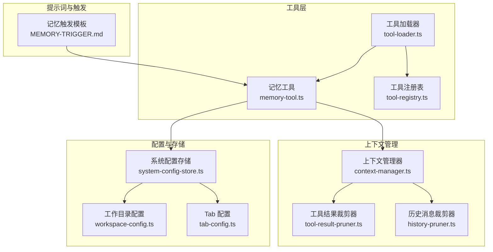
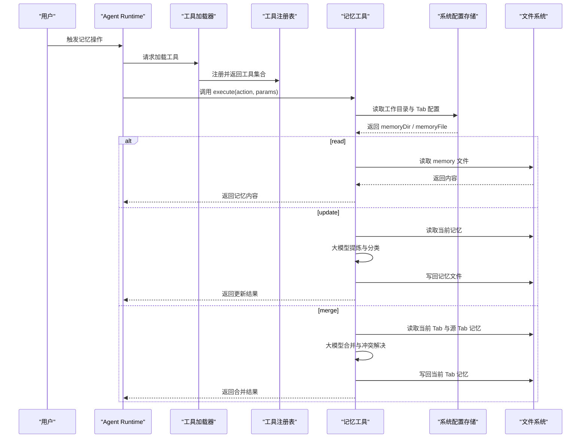
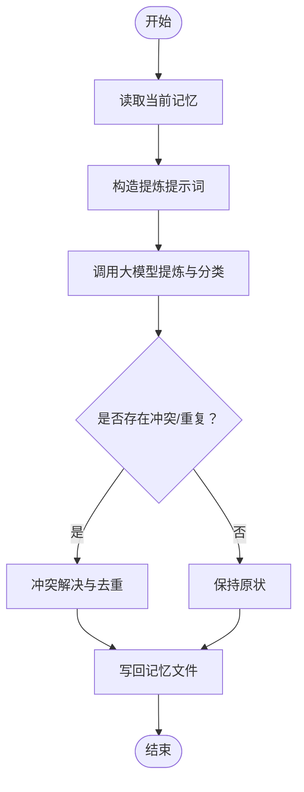
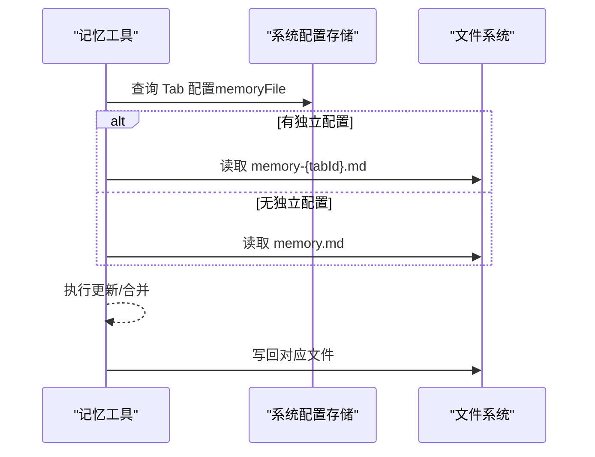
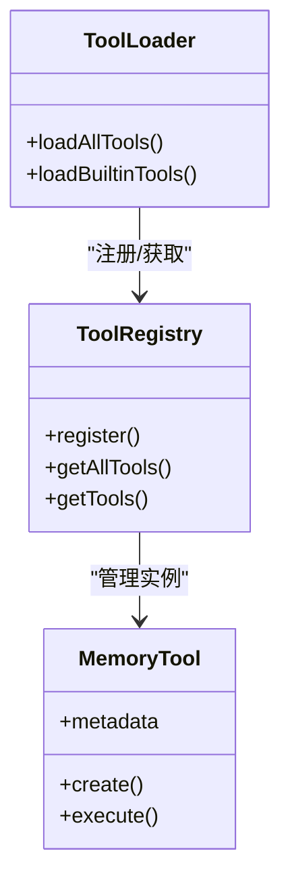
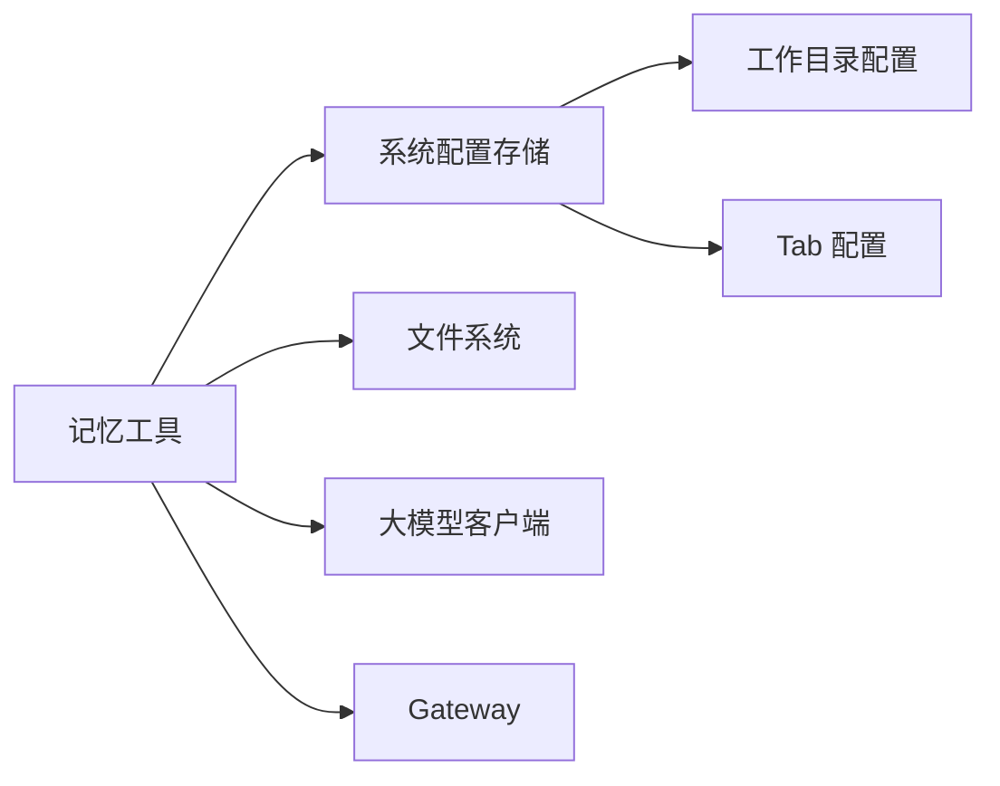

# 记忆管理工具

<cite>
**本文引用的文件**
- [memory-tool.ts](file://src/main/tools/memory-tool.ts)
- [system-config-store.ts](file://src/main/database/system-config-store.ts)
- [workspace-config.ts](file://src/main/database/workspace-config.ts)
- [tab-config.ts](file://src/main/database/tab-config.ts)
- [tool-loader.ts](file://src/main/tools/registry/tool-loader.ts)
- [tool-registry.ts](file://src/main/tools/registry/tool-registry.ts)
- [MEMORY-TRIGGER.md](file://src/main/prompts/templates/MEMORY-TRIGGER.md)
- [context-manager.ts](file://src/main/context/context-manager.ts)
- [tool-result-pruner.ts](file://src/main/context/tool-result-pruner.ts)
- [history-pruner.ts](file://src/main/context/history-pruner.ts)
</cite>

## 目录
1. [简介](#简介)
2. [项目结构](#项目结构)
3. [核心组件](#核心组件)
4. [架构总览](#架构总览)
5. [详细组件分析](#详细组件分析)
6. [依赖关系分析](#依赖关系分析)
7. [性能考量](#性能考量)
8. [故障排查指南](#故障排查指南)
9. [结论](#结论)
10. [附录](#附录)

## 简介
本文件面向 史丽慧小助理 记忆管理工具，系统阐述其全局记忆存储、独立记忆管理与记忆更新机制，涵盖 API 接口、数据结构、存储策略、持久化与恢复、以及最佳实践与性能优化建议。读者可据此实现稳定、可扩展的记忆管理能力，并在多会话/多标签页场景中保持一致的上下文体验。

## 项目结构
记忆管理工具位于主进程工具模块中，围绕“记忆文件”“配置存储”“工具注册”三大支柱构建，辅以上下文压缩与历史裁剪保障性能。

图表来源
- [memory-tool.ts:1-870](file://src/main/tools/memory-tool.ts#L1-L870)
- [tool-loader.ts:1-312](file://src/main/tools/registry/tool-loader.ts#L1-L312)
- [tool-registry.ts:1-328](file://src/main/tools/registry/tool-registry.ts#L1-L328)
- [system-config-store.ts:1-576](file://src/main/database/system-config-store.ts#L1-L576)
- [workspace-config.ts:1-219](file://src/main/database/workspace-config.ts#L1-L219)
- [tab-config.ts:1-218](file://src/main/database/tab-config.ts#L1-L218)
- [context-manager.ts:1-366](file://src/main/context/context-manager.ts#L1-L366)
- [tool-result-pruner.ts:1-448](file://src/main/context/tool-result-pruner.ts#L1-L448)
- [history-pruner.ts:35-61](file://src/main/context/history-pruner.ts#L35-L61)
- [MEMORY-TRIGGER.md:1-302](file://src/main/prompts/templates/MEMORY-TRIGGER.md#L1-L302)

章节来源
- [memory-tool.ts:1-870](file://src/main/tools/memory-tool.ts#L1-L870)
- [tool-loader.ts:1-312](file://src/main/tools/registry/tool-loader.ts#L1-L312)
- [tool-registry.ts:1-328](file://src/main/tools/registry/tool-registry.ts#L1-L328)
- [system-config-store.ts:1-576](file://src/main/database/system-config-store.ts#L1-L576)
- [workspace-config.ts:1-219](file://src/main/database/workspace-config.ts#L1-L219)
- [tab-config.ts:1-218](file://src/main/database/tab-config.ts#L1-L218)
- [context-manager.ts:1-366](file://src/main/context/context-manager.ts#L1-L366)
- [tool-result-pruner.ts:1-448](file://src/main/context/tool-result-pruner.ts#L1-L448)
- [history-pruner.ts:35-61](file://src/main/context/history-pruner.ts#L35-L61)
- [MEMORY-TRIGGER.md:1-302](file://src/main/prompts/templates/MEMORY-TRIGGER.md#L1-L302)

## 核心组件
- 记忆工具（memory-tool.ts）
  - 提供 read/update/merge 三种操作
  - 支持全局 memory.md 与各 Tab 独立 memory 文件
  - 通过大模型进行记忆提炼、分类与去重
  - 支持并发取消信号（AbortSignal）
- 系统配置存储（system-config-store.ts）
  - 统一管理 SQLite 持久化配置
  - 提供工作目录与 Tab 配置读写
- 工作目录配置（workspace-config.ts）
  - 默认记忆目录为 ~/.slhbot/memory
  - Docker 模式下默认 /data/memory
- Tab 配置（tab-config.ts）
  - 记录每个 Tab 的 memory_file 等元信息
- 工具注册与加载（tool-loader.ts、tool-registry.ts）
  - 将记忆工具注入 Agent Runtime
- 上下文管理（context-manager.ts、tool-result-pruner.ts、history-pruner.ts）
  - 在高负载时自动裁剪工具结果与历史消息，保障上下文窗口

章节来源
- [memory-tool.ts:408-787](file://src/main/tools/memory-tool.ts#L408-L787)
- [system-config-store.ts:37-70](file://src/main/database/system-config-store.ts#L37-L70)
- [workspace-config.ts:17-46](file://src/main/database/workspace-config.ts#L17-L46)
- [tab-config.ts:46-64](file://src/main/database/tab-config.ts#L46-L64)
- [tool-loader.ts:109-195](file://src/main/tools/registry/tool-loader.ts#L109-L195)
- [tool-registry.ts:36-55](file://src/main/tools/registry/tool-registry.ts#L36-L55)
- [context-manager.ts:100-303](file://src/main/context/context-manager.ts#L100-L303)
- [tool-result-pruner.ts:249-447](file://src/main/context/tool-result-pruner.ts#L249-L447)
- [history-pruner.ts:46-61](file://src/main/context/history-pruner.ts#L46-L61)

## 架构总览
记忆工具的运行链路如下：

图表来源
- [tool-loader.ts:109-195](file://src/main/tools/registry/tool-loader.ts#L109-L195)
- [tool-registry.ts:201-229](file://src/main/tools/registry/tool-registry.ts#L201-L229)
- [memory-tool.ts:481-782](file://src/main/tools/memory-tool.ts#L481-L782)
- [system-config-store.ts:467-495](file://src/main/database/system-config-store.ts#L467-L495)
- [workspace-config.ts:51-89](file://src/main/database/workspace-config.ts#L51-L89)

## 详细组件分析

### 记忆工具 API 与数据结构
- 操作类型
  - read：读取当前记忆内容
  - update：基于用户消息与上下文提炼并更新记忆
  - merge：将指定 Tab 的记忆合并到当前 Tab
- 参数 Schema
  - action：必填，取值 read/update/merge
  - userMessage：update 必填，表示用户输入
  - context：update 可选，表示执行结果或补充说明
  - updateMainMemory：update 可选，布尔值，控制是否同时更新主记忆与当前 Tab 记忆
  - sourceTabName：merge 可选，目标 Tab 名称；未指定时默认合并主记忆
- 返回结构
  - content：文本内容数组
  - details：包含 memory、length、tabId、oldLength、newLength、success 等字段

章节来源
- [memory-tool.ts:65-88](file://src/main/tools/memory-tool.ts#L65-L88)
- [memory-tool.ts:481-782](file://src/main/tools/memory-tool.ts#L481-L782)

### 存储策略与文件组织
- 默认目录
  - 普通模式：~/.slhbot/memory
  - Docker 模式：/data/memory
- 文件命名
  - 全局：memory.md
  - 独立：memory-{tabId}.md（当 Tab 配置中设置了 memoryFile）
- 目录与文件确保
  - 首次访问时自动创建目录与默认模板文件
  - 读取失败时回退到模板内容

章节来源
- [workspace-config.ts:17-46](file://src/main/database/workspace-config.ts#L17-L46)
- [memory-tool.ts:146-164](file://src/main/tools/memory-tool.ts#L146-L164)
- [memory-tool.ts:170-186](file://src/main/tools/memory-tool.ts#L170-L186)
- [memory-tool.ts:192-203](file://src/main/tools/memory-tool.ts#L192-L203)

### 记忆更新机制（提炼、分类与去重）
- 输入
  - 当前记忆内容
  - userMessage（用户输入）
  - context（可选，执行结果）
- 处理流程
  - 大模型对输入进行语义理解与提炼
  - 自动分类到“角色/用户习惯/错误总结/备忘事项”
  - 冲突检测与解决（保留最新/更清晰表达）
  - 全局去重（同一语义仅保留一条）
- 输出
  - 更新后的完整记忆文件内容
  - 写回对应 memory 文件

图表来源
- [memory-tool.ts:311-401](file://src/main/tools/memory-tool.ts#L311-L401)

章节来源
- [memory-tool.ts:311-401](file://src/main/tools/memory-tool.ts#L311-L401)

### 独立记忆管理（多 Tab）
- Tab 独立记忆
  - 通过 Tab 配置中的 memoryFile 字段启用
  - 读取时优先使用 Tab 独立文件，否则回退到全局 memory.md
- 新建 Tab 继承
  - 为新 Tab 创建 memory 文件时，继承主记忆内容
- 合并策略
  - merge 操作支持将源 Tab 记忆合并到当前 Tab
  - 冲突时当前 Tab 优先级更高
  - 合并后自动去重与分类整理

图表来源
- [memory-tool.ts:114-138](file://src/main/tools/memory-tool.ts#L114-L138)
- [memory-tool.ts:146-164](file://src/main/tools/memory-tool.ts#L146-L164)
- [system-config-store.ts:467-495](file://src/main/database/system-config-store.ts#L467-L495)
- [tab-config.ts:98-110](file://src/main/database/tab-config.ts#L98-L110)

章节来源
- [memory-tool.ts:114-138](file://src/main/tools/memory-tool.ts#L114-L138)
- [memory-tool.ts:146-164](file://src/main/tools/memory-tool.ts#L146-L164)
- [system-config-store.ts:467-495](file://src/main/database/system-config-store.ts#L467-L495)
- [tab-config.ts:98-110](file://src/main/database/tab-config.ts#L98-L110)

### 记忆合并与冲突解决
- 合并输入
  - 当前 Tab 记忆
  - 源 Tab 记忆（或主记忆）
- 合并规则
  - 冲突：当前 Tab 优先级更高
  - 去重：全局去重，保留更清晰表达
  - 分类：严格按 Section 整理
- 输出
  - 合并后的完整记忆文件
  - 写回当前 Tab 并触发系统提示词重新加载

章节来源
- [memory-tool.ts:233-306](file://src/main/tools/memory-tool.ts#L233-L306)
- [memory-tool.ts:521-621](file://src/main/tools/memory-tool.ts#L521-L621)

### 工具集成与生命周期
- 工具加载
  - 工具加载器在启动时注册并创建记忆工具实例
- 工具注册
  - 工具注册表维护插件与实例映射
- 生命周期
  - 工具在 Agent Runtime 中按需调用
  - 支持 AbortSignal 取消

图表来源
- [tool-loader.ts:109-195](file://src/main/tools/registry/tool-loader.ts#L109-L195)
- [tool-registry.ts:36-55](file://src/main/tools/registry/tool-registry.ts#L36-L55)
- [memory-tool.ts:408-438](file://src/main/tools/memory-tool.ts#L408-L438)

章节来源
- [tool-loader.ts:109-195](file://src/main/tools/registry/tool-loader.ts#L109-L195)
- [tool-registry.ts:36-55](file://src/main/tools/registry/tool-registry.ts#L36-L55)
- [memory-tool.ts:408-438](file://src/main/tools/memory-tool.ts#L408-L438)

### 上下文压缩与性能保障
- 自动裁剪策略
  - 工具结果软裁剪（保留首尾，中间省略）
  - 工具结果硬裁剪（替换为占位符）
  - 历史消息按份额裁剪，防止上下文超限
- 阈值与比率
  - 软裁剪阈值：约 70%
  - 硬裁剪阈值：约 85%
- 结果统计
  - 记录节省 token 数、丢弃消息数等指标

章节来源
- [context-manager.ts:100-303](file://src/main/context/context-manager.ts#L100-L303)
- [tool-result-pruner.ts:249-447](file://src/main/context/tool-result-pruner.ts#L249-L447)
- [history-pruner.ts:46-61](file://src/main/context/history-pruner.ts#L46-L61)

## 依赖关系分析
- 记忆工具依赖
  - SystemConfigStore：读取工作目录与 Tab 配置
  - 文件系统：读写 memory 文件
  - 大模型客户端：提炼与合并记忆
  - Gateway：触发系统提示词重新加载
- 配置存储
  - 工作目录配置提供默认与 Docker 模式路径
  - Tab 配置提供独立记忆文件名

图表来源
- [memory-tool.ts:146-164](file://src/main/tools/memory-tool.ts#L146-L164)
- [system-config-store.ts:337-380](file://src/main/database/system-config-store.ts#L337-L380)
- [workspace-config.ts:51-89](file://src/main/database/workspace-config.ts#L51-L89)
- [tab-config.ts:98-110](file://src/main/database/tab-config.ts#L98-L110)

章节来源
- [memory-tool.ts:146-164](file://src/main/tools/memory-tool.ts#L146-L164)
- [system-config-store.ts:337-380](file://src/main/database/system-config-store.ts#L337-L380)
- [workspace-config.ts:51-89](file://src/main/database/workspace-config.ts#L51-L89)
- [tab-config.ts:98-110](file://src/main/database/tab-config.ts#L98-L110)

## 性能考量
- 记忆文件大小限制
  - 写入时对内容长度进行截断，避免超限
- 上下文压缩
  - 自动裁剪工具结果与历史消息，降低 token 使用率
- 大模型调用优化
  - 使用快速模型执行提炼与合并任务
- 并发与取消
  - 支持 AbortSignal，避免长时间阻塞

章节来源
- [memory-tool.ts:210-228](file://src/main/tools/memory-tool.ts#L210-L228)
- [memory-tool.ts:380-394](file://src/main/tools/memory-tool.ts#L380-L394)
- [context-manager.ts:221-273](file://src/main/context/context-manager.ts#L221-L273)

## 故障排查指南
- 记忆文件读取失败
  - 现象：读取异常，回退到模板
  - 排查：检查 memoryDir 权限与磁盘空间
- 记忆文件写入失败
  - 现象：写入异常，抛出错误
  - 排查：确认文件权限、磁盘配额、路径有效性
- 合并冲突与去重异常
  - 现象：合并后仍存在重复或冲突
  - 排查：检查大模型输出格式与提示词一致性
- Tab 独立记忆未生效
  - 现象：始终读取全局 memory.md
  - 排查：确认 Tab 配置中 memoryFile 是否设置且有效
- 上下文超限导致性能下降
  - 现象：推理缓慢或报错
  - 排查：查看上下文压缩统计，调整阈值或减少工具结果长度

章节来源
- [memory-tool.ts:192-203](file://src/main/tools/memory-tool.ts#L192-L203)
- [memory-tool.ts:210-228](file://src/main/tools/memory-tool.ts#L210-L228)
- [memory-tool.ts:521-621](file://src/main/tools/memory-tool.ts#L521-L621)
- [system-config-store.ts:467-495](file://src/main/database/system-config-store.ts#L467-L495)
- [context-manager.ts:100-303](file://src/main/context/context-manager.ts#L100-L303)

## 结论
记忆管理工具通过“全局+独立”的文件组织、“提炼+分类+去重”的更新机制，以及“上下文压缩+取消支持”的性能保障，实现了稳定、可扩展的记忆能力。结合系统配置与工具注册体系，可在多会话与多标签页场景中提供一致的上下文体验。

## 附录

### API 使用示例（路径参考）
- 读取记忆
  - [memory-tool.ts:502-518](file://src/main/tools/memory-tool.ts#L502-L518)
- 更新记忆
  - [memory-tool.ts:623-762](file://src/main/tools/memory-tool.ts#L623-L762)
- 合并记忆
  - [memory-tool.ts:521-621](file://src/main/tools/memory-tool.ts#L521-L621)
- 获取记忆内容（辅助函数）
  - [memory-tool.ts:795-819](file://src/main/tools/memory-tool.ts#L795-L819)

### 触发与使用时机
- 记忆触发模板明确了何时调用 memory 工具、何时调用 api_set_name 工具，以及回复前的自检清单
  - [MEMORY-TRIGGER.md:1-302](file://src/main/prompts/templates/MEMORY-TRIGGER.md#L1-L302)