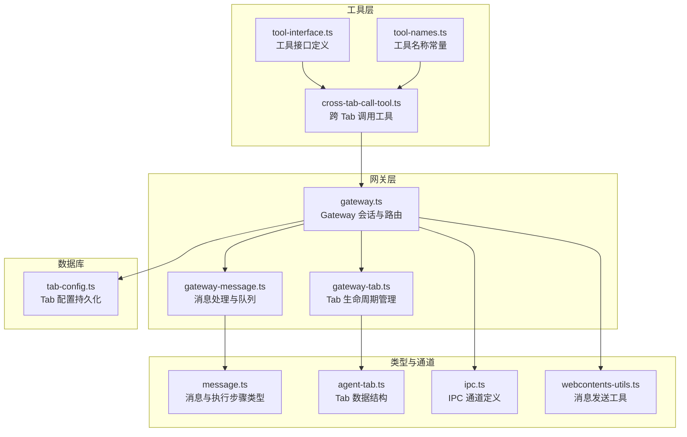
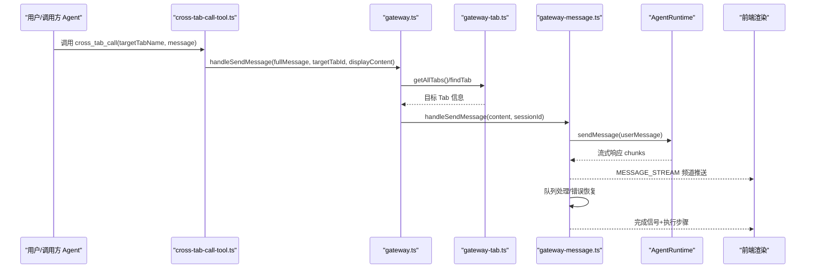
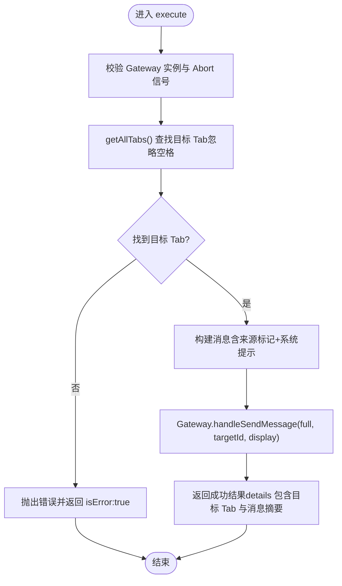
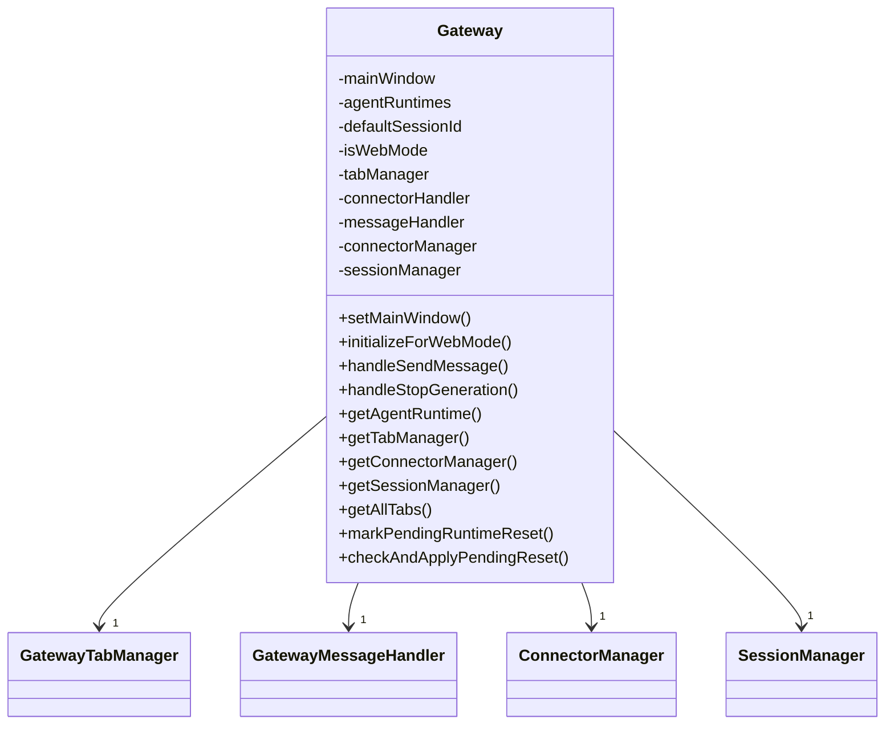
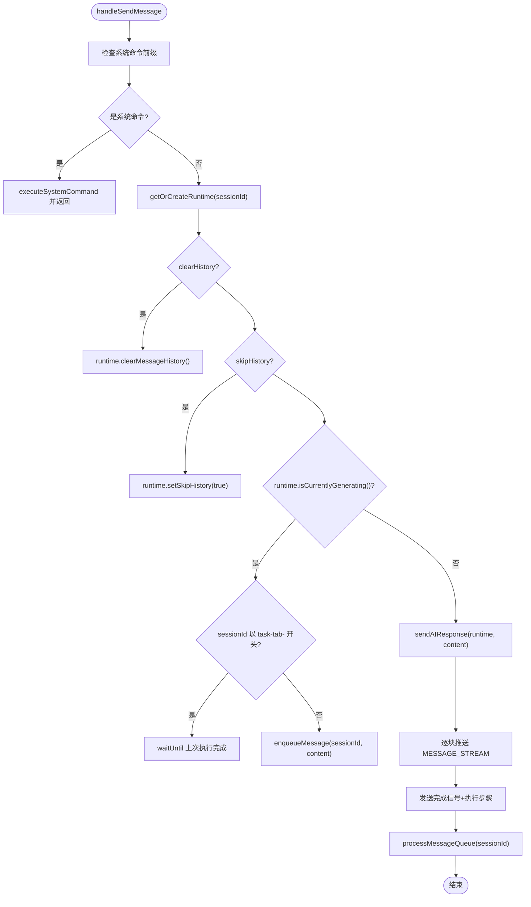
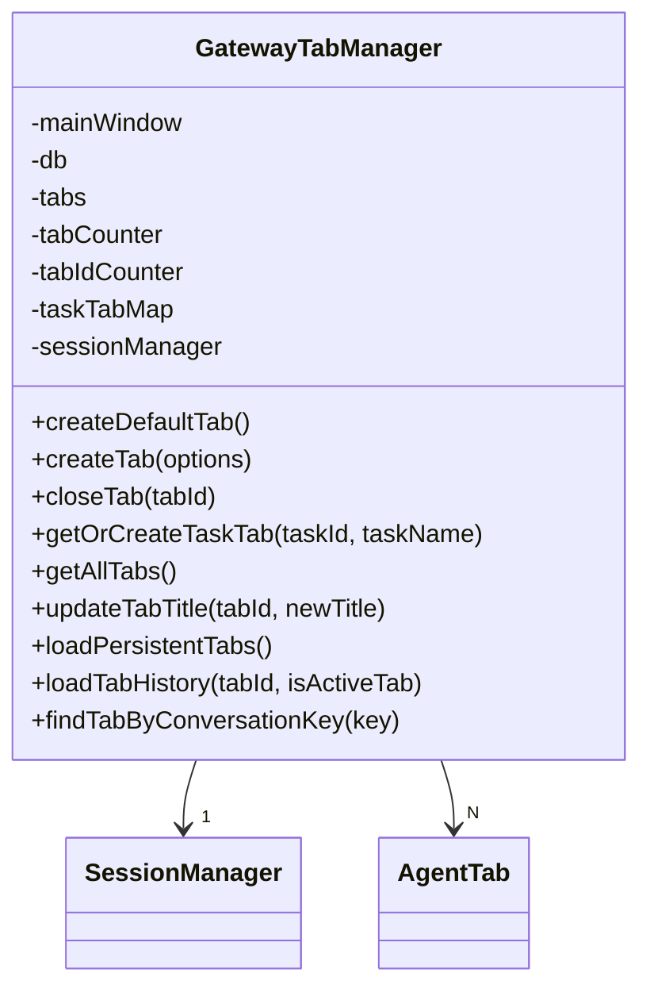
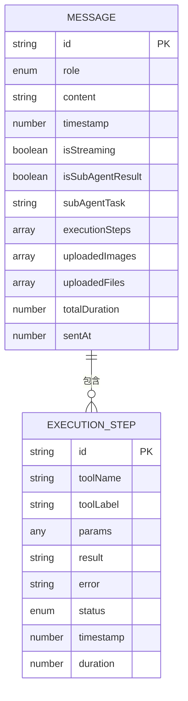
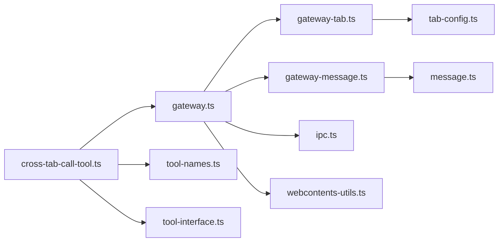

# 跨标签页通信工具

<cite>
**本文档引用的文件**
- [cross-tab-call-tool.ts](file://src/main/tools/cross-tab-call-tool.ts)
- [gateway.ts](file://src/main/gateway.ts)
- [gateway-tab.ts](file://src/main/gateway-tab.ts)
- [gateway-message.ts](file://src/main/gateway-message.ts)
- [message.ts](file://src/types/message.ts)
- [agent-tab.ts](file://src/types/agent-tab.ts)
- [tool-interface.ts](file://src/main/tools/registry/tool-interface.ts)
- [tool-names.ts](file://src/main/tools/tool-names.ts)
- [tab-config.ts](file://src/main/database/tab-config.ts)
- [webcontents-utils.ts](file://src/shared/utils/webcontents-utils.ts)
- [ipc.ts](file://src/types/ipc.ts)
- [TOOLS.md](file://src/main/prompts/templates/TOOLS.md)
</cite>

## 目录
1. [简介](#简介)
2. [项目结构](#项目结构)
3. [核心组件](#核心组件)
4. [架构总览](#架构总览)
5. [详细组件分析](#详细组件分析)
6. [依赖关系分析](#依赖关系分析)
7. [性能考虑](#性能考虑)
8. [故障排查指南](#故障排查指南)
9. [结论](#结论)
10. [附录](#附录)

## 简介
本文件面向 DeepBot 的跨标签页通信工具，系统性阐述 Agent 间消息传递、多 Agent 协作与任务分发机制。文档覆盖 API 接口、消息格式、通信协议、消息队列与负载均衡策略、错误处理与恢复机制，并提供多 Agent 协作的设计模式与最佳实践。

## 项目结构
跨标签页通信工具由“工具层”“网关层”“消息层”“Tab 管理层”“类型与通道定义”五部分协同构成，形成“工具调用 → 网关路由 → 消息队列 → Agent 执行 → 前端渲染”的闭环。

**图表来源**
- [cross-tab-call-tool.ts:1-166](file://src/main/tools/cross-tab-call-tool.ts#L1-L166)
- [gateway.ts:1-796](file://src/main/gateway.ts#L1-L796)
- [gateway-tab.ts:1-796](file://src/main/gateway-tab.ts#L1-L796)
- [gateway-message.ts:1-525](file://src/main/gateway-message.ts#L1-L525)
- [message.ts:1-80](file://src/types/message.ts#L1-L80)
- [agent-tab.ts:1-87](file://src/types/agent-tab.ts#L1-L87)
- [tool-interface.ts:1-152](file://src/main/tools/registry/tool-interface.ts#L1-L152)
- [tool-names.ts:1-106](file://src/main/tools/tool-names.ts#L1-L106)
- [tab-config.ts:1-218](file://src/main/database/tab-config.ts#L1-L218)
- [webcontents-utils.ts:1-145](file://src/shared/utils/webcontents-utils.ts#L1-L145)
- [ipc.ts:1-470](file://src/types/ipc.ts#L1-L470)

**章节来源**
- [cross-tab-call-tool.ts:1-166](file://src/main/tools/cross-tab-call-tool.ts#L1-L166)
- [gateway.ts:1-796](file://src/main/gateway.ts#L1-L796)
- [gateway-tab.ts:1-796](file://src/main/gateway-tab.ts#L1-L796)
- [gateway-message.ts:1-525](file://src/main/gateway-message.ts#L1-L525)
- [message.ts:1-80](file://src/types/message.ts#L1-L80)
- [agent-tab.ts:1-87](file://src/types/agent-tab.ts#L1-L87)
- [tool-interface.ts:1-152](file://src/main/tools/registry/tool-interface.ts#L1-L152)
- [tool-names.ts:1-106](file://src/main/tools/tool-names.ts#L1-L106)
- [tab-config.ts:1-218](file://src/main/database/tab-config.ts#L1-L218)
- [webcontents-utils.ts:1-145](file://src/shared/utils/webcontents-utils.ts#L1-L145)
- [ipc.ts:1-470](file://src/types/ipc.ts#L1-L470)

## 核心组件
- 跨标签页调用工具：负责解析参数、定位目标 Tab、构建消息并调用 Gateway 发送。
- Gateway：统一会话管理、消息路由、连接器与消息处理器依赖注入、Tab 管理器集成。
- 消息处理器：实现消息队列、并发控制、流式响应、错误恢复与自动重试。
- Tab 管理器：负责 Tab 生命周期、历史加载、欢迎消息、持久化与标题更新。
- 类型与通道：定义消息结构、执行步骤、IPC 通道、WebContents 发送工具。
- 数据库：Tab 配置持久化，支持标题、类型、会话键、任务/连接器绑定等。

**章节来源**
- [cross-tab-call-tool.ts:1-166](file://src/main/tools/cross-tab-call-tool.ts#L1-L166)
- [gateway.ts:1-796](file://src/main/gateway.ts#L1-L796)
- [gateway-message.ts:1-525](file://src/main/gateway-message.ts#L1-L525)
- [gateway-tab.ts:1-796](file://src/main/gateway-tab.ts#L1-L796)
- [message.ts:1-80](file://src/types/message.ts#L1-L80)
- [agent-tab.ts:1-87](file://src/types/agent-tab.ts#L1-L87)
- [ipc.ts:1-470](file://src/types/ipc.ts#L1-L470)
- [webcontents-utils.ts:1-145](file://src/shared/utils/webcontents-utils.ts#L1-L145)
- [tab-config.ts:1-218](file://src/main/database/tab-config.ts#L1-L218)

## 架构总览
跨标签页通信采用“工具 → 网关 → 消息队列 → Agent 执行 → 前端流式渲染”的链路，支持异步双向协作与自动排队。

**图表来源**
- [cross-tab-call-tool.ts:69-124](file://src/main/tools/cross-tab-call-tool.ts#L69-L124)
- [gateway.ts:479-482](file://src/main/gateway.ts#L479-L482)
- [gateway-tab.ts:766-772](file://src/main/gateway-tab.ts#L766-L772)
- [gateway-message.ts:76-160](file://src/main/gateway-message.ts#L76-L160)
- [ipc.ts:8-16](file://src/types/ipc.ts#L8-L16)

**章节来源**
- [cross-tab-call-tool.ts:69-124](file://src/main/tools/cross-tab-call-tool.ts#L69-L124)
- [gateway.ts:479-482](file://src/main/gateway.ts#L479-L482)
- [gateway-tab.ts:766-772](file://src/main/gateway-tab.ts#L766-L772)
- [gateway-message.ts:76-160](file://src/main/gateway-message.ts#L76-L160)
- [ipc.ts:8-16](file://src/types/ipc.ts#L8-L16)

## 详细组件分析

### 跨标签页调用工具（cross-tab-call-tool）
- 职责：接收目标 Tab 名称与消息内容，定位目标 Tab，构建带来源标记的消息，调用 Gateway 发送。
- 关键点：
  - 参数校验与空值处理
  - 目标 Tab 查找（忽略空格的规范化匹配）
  - 消息构造：包含来源标记与系统提示，明确“除非明确要求回复，否则不回复”
  - 异步发送：调用 Gateway 的 handleSendMessage，不等待结果
  - 返回结构：包含成功/失败状态、目标 Tab 信息与原始消息摘要

**图表来源**
- [cross-tab-call-tool.ts:69-143](file://src/main/tools/cross-tab-call-tool.ts#L69-L143)

**章节来源**
- [cross-tab-call-tool.ts:1-166](file://src/main/tools/cross-tab-call-tool.ts#L1-L166)
- [TOOL_NAMES:83-84](file://src/main/tools/tool-names.ts#L83-L84)

### Gateway（会话与路由）
- 职责：管理会话生命周期、路由消息到 AgentRuntime、处理流式响应、管理多个 AgentRuntime 实例（每个 Tab 一个）、注入依赖（Tab、消息、连接器处理器）。
- 关键点：
  - 依赖注入：Tab 管理器、消息处理器、连接器处理器、SessionManager
  - 会话管理：按 sessionId 管理 AgentRuntime，支持重置与延迟重置
  - Web 模式：提供虚拟窗口初始化，适配无 BrowserWindow 场景
  - 工具依赖：向 cross-tab-call-tool 注入 Gateway 实例

**图表来源**
- [gateway.ts:33-138](file://src/main/gateway.ts#L33-L138)

**章节来源**
- [gateway.ts:1-796](file://src/main/gateway.ts#L1-L796)

### 消息处理与队列（gateway-message.ts）
- 职责：处理用户消息发送、管理消息队列（每个会话独立队列）、并发控制、流式响应、错误检测与自动恢复。
- 关键点：
  - 队列模型：Map<sessionId, MessageQueueItem[]>，Set<processingSessions>
  - 并发控制：Agent 正在生成时，普通 Tab 消息入队；定时任务 Tab 等待上一次执行完成
  - 流式响应：逐块推送 MESSAGE_STREAM，完成后发送完成信号与执行步骤
  - 错误恢复：识别 AI 连接错误与 Agent 状态错误，自动清理缓存、停止生成、重试或发送用户友好错误
  - 队列处理：递归处理队列，支持跨 Tab 消息的特殊显示逻辑

**图表来源**
- [gateway-message.ts:76-160](file://src/main/gateway-message.ts#L76-L160)
- [gateway-message.ts:288-371](file://src/main/gateway-message.ts#L288-L371)

**章节来源**
- [gateway-message.ts:1-525](file://src/main/gateway-message.ts#L1-L525)

### Tab 生命周期管理（gateway-tab.ts）
- 职责：创建/关闭/查询 Tab、持久化加载、欢迎消息、历史加载、标题更新、任务专属 Tab、连接器 Tab 的消息队列。
- 关键点：
  - 默认 Tab 创建与欢迎消息策略
  - 持久化：SQLite 表 agent_tabs，支持标题、类型、任务/连接器绑定、内存文件等
  - 任务 Tab：锁定状态，避免误关闭
  - 连接器 Tab：支持 PendingMessage 队列与进度提醒定时器
  - 标题更新：同步持久化与前端通知

**图表来源**
- [gateway-tab.ts:26-796](file://src/main/gateway-tab.ts#L26-L796)
- [tab-config.ts:46-93](file://src/main/database/tab-config.ts#L46-L93)

**章节来源**
- [gateway-tab.ts:1-796](file://src/main/gateway-tab.ts#L1-L796)
- [tab-config.ts:1-218](file://src/main/database/tab-config.ts#L1-L218)

### 消息类型与 IPC 通道（message.ts, ipc.ts, webcontents-utils.ts）
- 消息类型：Message、ExecutionStep、UploadedImage/File 等，支持执行步骤、上传附件、总执行时间、发送时间戳等。
- IPC 通道：MESSAGE_STREAM、MESSAGE_ERROR、EXECUTION_STEP_UPDATE 等，统一前端渲染。
- WebContents 工具：封装安全发送、广播到窗口/内容、创建发送器等。

**图表来源**
- [message.ts:49-70](file://src/types/message.ts#L49-L70)
- [message.ts:15-25](file://src/types/message.ts#L15-L25)

**章节来源**
- [message.ts:1-80](file://src/types/message.ts#L1-L80)
- [ipc.ts:8-16](file://src/types/ipc.ts#L8-L16)
- [webcontents-utils.ts:1-145](file://src/shared/utils/webcontents-utils.ts#L1-L145)

### 工具接口与命名（tool-interface.ts, tool-names.ts）
- 工具接口：ToolPlugin、ToolMetadata、ToolConfig、ToolCreateOptions 等，统一工具开发规范。
- 工具名称：集中管理 TOOL_NAMES，避免硬编码，便于跨模块引用。

**章节来源**
- [tool-interface.ts:1-152](file://src/main/tools/registry/tool-interface.ts#L1-L152)
- [tool-names.ts:1-106](file://src/main/tools/tool-names.ts#L1-L106)

## 依赖关系分析

**图表来源**
- [cross-tab-call-tool.ts:1-166](file://src/main/tools/cross-tab-call-tool.ts#L1-L166)
- [gateway.ts:1-796](file://src/main/gateway.ts#L1-L796)
- [gateway-tab.ts:1-796](file://src/main/gateway-tab.ts#L1-L796)
- [gateway-message.ts:1-525](file://src/main/gateway-message.ts#L1-L525)
- [message.ts:1-80](file://src/types/message.ts#L1-L80)
- [ipc.ts:1-470](file://src/types/ipc.ts#L1-L470)
- [webcontents-utils.ts:1-145](file://src/shared/utils/webcontents-utils.ts#L1-L145)
- [tab-config.ts:1-218](file://src/main/database/tab-config.ts#L1-L218)
- [tool-names.ts:1-106](file://src/main/tools/tool-names.ts#L1-L106)
- [tool-interface.ts:1-152](file://src/main/tools/registry/tool-interface.ts#L1-L152)

**章节来源**
- [cross-tab-call-tool.ts:1-166](file://src/main/tools/cross-tab-call-tool.ts#L1-L166)
- [gateway.ts:1-796](file://src/main/gateway.ts#L1-L796)
- [gateway-tab.ts:1-796](file://src/main/gateway-tab.ts#L1-L796)
- [gateway-message.ts:1-525](file://src/main/gateway-message.ts#L1-L525)
- [message.ts:1-80](file://src/types/message.ts#L1-L80)
- [ipc.ts:1-470](file://src/types/ipc.ts#L1-L470)
- [webcontents-utils.ts:1-145](file://src/shared/utils/webcontents-utils.ts#L1-L145)
- [tab-config.ts:1-218](file://src/main/database/tab-config.ts#L1-L218)
- [tool-names.ts:1-106](file://src/main/tools/tool-names.ts#L1-L106)
- [tool-interface.ts:1-152](file://src/main/tools/registry/tool-interface.ts#L1-L152)

## 性能考虑
- 队列并发控制：普通 Tab 消息在 Agent 正在生成时入队，避免并发冲突；定时任务 Tab 等待上次执行完成，防止资源争用。
- 流式推送：逐块推送 MESSAGE_STREAM，降低前端渲染压力，提升交互体验。
- 自动恢复：检测 AI 连接错误与 Agent 状态错误，自动清理缓存、停止生成、重试，减少人工干预。
- 延迟重置：支持延迟重置 AgentRuntime，避免中断正在进行的任务，提高稳定性。
- 持久化与历史加载：Tab 历史消息按需加载，避免一次性加载大量数据。

[本节为通用指导，无需具体文件引用]

## 故障排查指南
- 目标 Tab 不存在：工具会在查找目标 Tab 时抛错，检查 Tab 名称是否正确且已创建。
- 消息发送失败：查看 Gateway 的错误日志与返回的错误详情，确认目标 Tab 是否可用、消息是否被取消。
- Agent 正在生成：普通 Tab 消息会入队等待；若长时间未处理，检查是否有错误导致队列停滞。
- AI 连接错误：系统会自动清理缓存并尝试重试；若失败，建议检查网络与模型配置。
- 前端无响应：确认 MESSAGE_STREAM 频道监听正常，检查 WebContents 可用性。

**章节来源**
- [cross-tab-call-tool.ts:98-100](file://src/main/tools/cross-tab-call-tool.ts#L98-L100)
- [gateway-message.ts:246-283](file://src/main/gateway-message.ts#L246-L283)
- [webcontents-utils.ts:20-37](file://src/shared/utils/webcontents-utils.ts#L20-L37)

## 结论
跨标签页通信工具通过“工具层 → 网关层 → 消息队列 → Agent 执行 → 前端流式渲染”的完整链路，实现了异步双向协作、自动排队与错误恢复。其设计兼顾了易用性与可靠性，适合多 Agent 协作与复杂任务分发场景。

[本节为总结，无需具体文件引用]

## 附录

### API 接口与消息格式
- 工具名称：cross_tab_call（见工具名称常量）
- 参数结构（TypeBox Schema）：
  - targetTabName: 目标 Tab 名称（字符串）
  - message: 要发送的消息内容（字符串）
  - senderTabName: 发送者 Tab 名称（可选，由系统注入）
- 返回结构：
  - content: 文本内容数组
  - details: 包含 success、targetTabName、targetTabId、message、senderName 等
  - isError: 失败时为 true

**章节来源**
- [cross-tab-call-tool.ts:34-44](file://src/main/tools/cross-tab-call-tool.ts#L34-L44)
- [cross-tab-call-tool.ts:129-143](file://src/main/tools/cross-tab-call-tool.ts#L129-L143)
- [tool-names.ts:83-84](file://src/main/tools/tool-names.ts#L83-L84)

### 通信协议与消息通道
- IPC 通道：
  - MESSAGE_STREAM：流式消息推送
  - MESSAGE_ERROR：错误推送
  - EXECUTION_STEP_UPDATE：执行步骤更新
  - TAB_CREATED/TAB_UPDATED/TAB_HISTORY_LOADED：Tab 生命周期事件
- 前端接收：通过 WebContents 安全发送，避免窗口/内容销毁导致的异常。

**章节来源**
- [ipc.ts:8-16](file://src/types/ipc.ts#L8-L16)
- [webcontents-utils.ts:50-61](file://src/shared/utils/webcontents-utils.ts#L50-L61)

### 多 Agent 协作与任务分发最佳实践
- 使用场景：
  - Tab 之间互相发送消息（如“市场分析助理”发消息给“产品经理”）
  - 请求其他 Agent 协助（将任务委托给专门的 Agent）
  - 多 Agent 对话协作（不同 Agent 之间互相交流）
- 使用要点：
  - 调用 cross_tab_call 后立即返回“✅ 消息已发送”，不要说“等待回复”
  - 若目标 Tab 正在处理任务，消息会自动排队
  - 目标 Tab 需要主动使用 cross_tab_call 发送回复消息
  - 消息会自动标记来源（如“[来自 市场分析助理]”）

**章节来源**
- [TOOLS.md:1186-1280](file://src/main/prompts/templates/TOOLS.md#L1186-L1280)