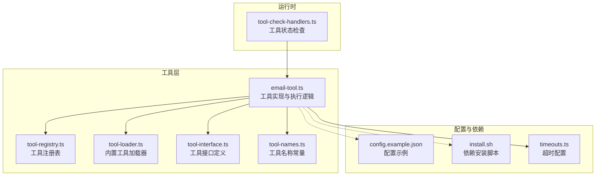
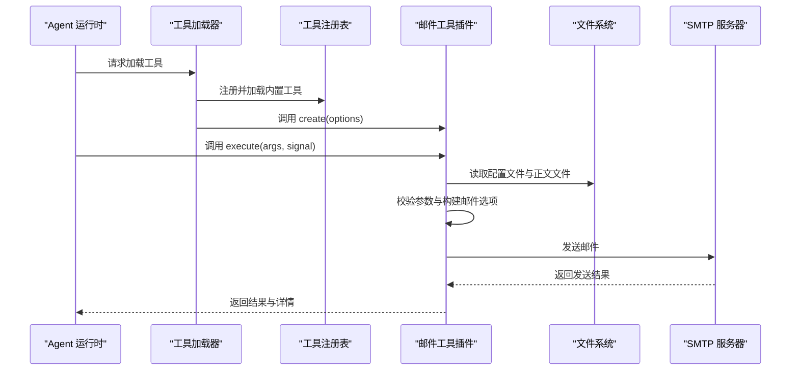
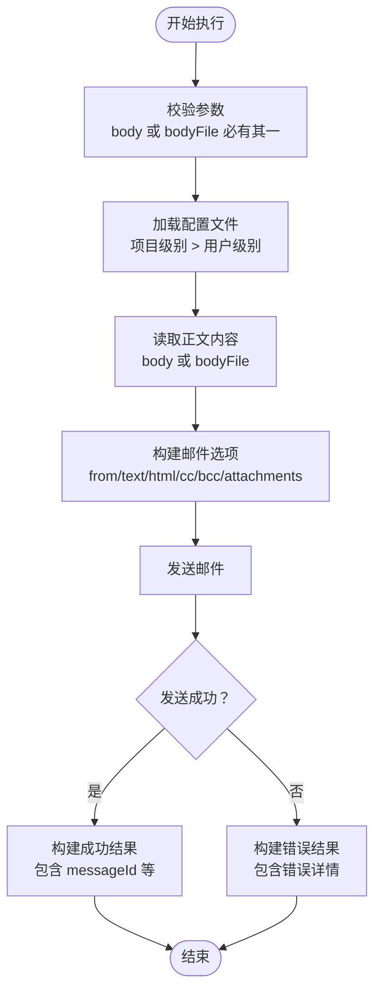
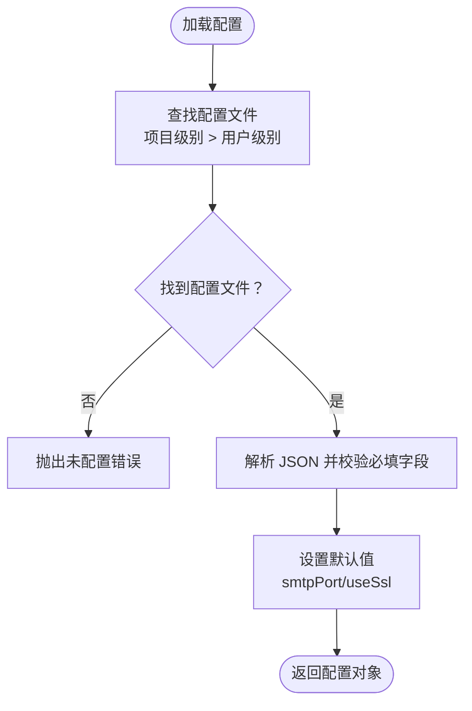
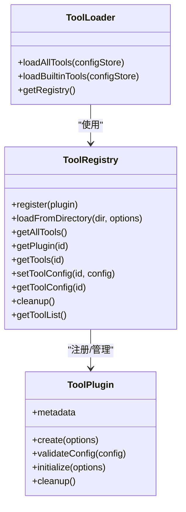

# 邮件发送工具

<cite>
**本文引用的文件**
- [email-tool.ts](file://src/main/tools/email-tool.ts)
- [README.md](file://src/main/tools/email-tool/README.md)
- [USAGE.md](file://src/main/tools/email-tool/USAGE.md)
- [config.example.json](file://src/main/tools/email-tool/config.example.json)
- [install.sh](file://src/main/tools/email-tool/install.sh)
- [tool-loader.ts](file://src/main/tools/registry/tool-loader.ts)
- [tool-registry.ts](file://src/main/tools/registry/tool-registry.ts)
- [tool-interface.ts](file://src/main/tools/registry/tool-interface.ts)
- [tool-names.ts](file://src/main/tools/tool-names.ts)
- [timeouts.ts](file://src/main/config/timeouts.ts)
- [tool-check-handlers.ts](file://src/main/tools/handlers/tool-check-handlers.ts)
</cite>

## 目录
1. [简介](#简介)
2. [项目结构](#项目结构)
3. [核心组件](#核心组件)
4. [架构总览](#架构总览)
5. [详细组件分析](#详细组件分析)
6. [依赖关系分析](#依赖关系分析)
7. [性能考量](#性能考量)
8. [故障排除指南](#故障排除指南)
9. [结论](#结论)
10. [附录](#附录)

## 简介
本文件面向 DeepBot 的“邮件发送工具”，系统化阐述基于 SMTP 的邮件发送能力，涵盖配置设置、API 接口、认证方式、附件处理、错误处理与安全配置，并提供可操作的使用示例与故障排除指引。该工具以内置工具形式集成，采用“工具代码在项目内、配置与依赖在用户目录”的架构，运行时动态加载依赖，避免打包到主应用，降低体积与耦合度。

## 项目结构
邮件工具位于 DeepBot 主工程的工具目录中，核心文件如下：
- 工具实现：src/main/tools/email-tool.ts
- 工具文档与使用示例：src/main/tools/email-tool/README.md、USAGE.md
- 配置示例：config.example.json
- 依赖安装脚本：install.sh
- 工具注册与加载：tool-loader.ts、tool-registry.ts、tool-interface.ts、tool-names.ts
- 超时配置：timeouts.ts
- 工具状态检查：tool-check-handlers.ts

图表来源
- [email-tool.ts:1-405](file://src/main/tools/email-tool.ts#L1-L405)
- [tool-loader.ts:1-312](file://src/main/tools/registry/tool-loader.ts#L1-L312)
- [tool-registry.ts:1-328](file://src/main/tools/registry/tool-registry.ts#L1-L328)
- [tool-interface.ts:1-152](file://src/main/tools/registry/tool-interface.ts#L1-L152)
- [tool-names.ts:1-106](file://src/main/tools/tool-names.ts#L1-L106)
- [timeouts.ts:1-78](file://src/main/config/timeouts.ts#L1-L78)
- [config.example.json:1-9](file://src/main/tools/email-tool/config.example.json#L1-L9)
- [install.sh:1-56](file://src/main/tools/email-tool/install.sh#L1-L56)
- [tool-check-handlers.ts:1-113](file://src/main/tools/handlers/tool-check-handlers.ts#L1-L113)

章节来源
- [email-tool.ts:1-405](file://src/main/tools/email-tool.ts#L1-L405)
- [README.md:1-317](file://src/main/tools/email-tool/README.md#L1-L317)
- [USAGE.md:1-147](file://src/main/tools/email-tool/USAGE.md#L1-L147)
- [config.example.json:1-9](file://src/main/tools/email-tool/config.example.json#L1-L9)
- [install.sh:1-56](file://src/main/tools/email-tool/install.sh#L1-L56)
- [tool-loader.ts:1-312](file://src/main/tools/registry/tool-loader.ts#L1-L312)
- [tool-registry.ts:1-328](file://src/main/tools/registry/tool-registry.ts#L1-L328)
- [tool-interface.ts:1-152](file://src/main/tools/registry/tool-interface.ts#L1-L152)
- [tool-names.ts:1-106](file://src/main/tools/tool-names.ts#L1-L106)
- [timeouts.ts:1-78](file://src/main/config/timeouts.ts#L1-L78)
- [tool-check-handlers.ts:1-113](file://src/main/tools/handlers/tool-check-handlers.ts#L1-L113)

## 核心组件
- 工具插件与元数据：定义工具 ID、名称、描述、分类、标签、是否需要配置等；在工具实现中导出插件对象。
- 参数 Schema：对 send_email 工具的输入参数进行类型约束与描述，包括收件人、主题、正文（文本或 HTML）、正文文件、是否 HTML、附件、抄送、密送等。
- 配置加载：按“项目级别 > 用户级别”的顺序查找配置文件，校验必填字段并设置默认值（端口、SSL）。
- 传输器创建：基于配置创建 SMTP 传输器，设置超时时间。
- 执行流程：参数校验、正文读取（支持 body 或 bodyFile）、正文换行符处理、构建邮件选项（含 CC/BCC/附件）、发送邮件、结果封装与错误处理。
- 取消支持：监听 AbortSignal，必要时关闭传输器连接。
- 错误处理：针对认证失败、超时、连接被拒绝等常见错误给出提示与建议。

章节来源
- [email-tool.ts:24-59](file://src/main/tools/email-tool.ts#L24-L59)
- [email-tool.ts:64-129](file://src/main/tools/email-tool.ts#L64-L129)
- [email-tool.ts:134-148](file://src/main/tools/email-tool.ts#L134-L148)
- [email-tool.ts:174-400](file://src/main/tools/email-tool.ts#L174-L400)

## 架构总览
邮件工具属于 DeepBot 的“内置工具”，通过工具注册表与加载器统一管理。工具实现中按需读取用户目录下的配置文件与依赖，运行时动态加载 nodemailer，避免打包进主应用。

图表来源
- [tool-loader.ts:109-301](file://src/main/tools/registry/tool-loader.ts#L109-L301)
- [tool-registry.ts:46-194](file://src/main/tools/registry/tool-registry.ts#L46-L194)
- [email-tool.ts:165-400](file://src/main/tools/email-tool.ts#L165-L400)

## 详细组件分析

### 组件：邮件工具插件与执行流程
- 插件元数据：包含工具 ID、名称、版本、描述、作者、分类、标签、是否需要配置等。
- 参数 Schema：对 to、subject、body/bodyFile、html、attachments、cc、bcc 进行约束与描述。
- 执行流程要点：
  - 参数校验：必须提供 body 或 bodyFile，二者不可同时出现；若提供 bodyFile，需存在且可读。
  - 配置加载：按优先级查找配置文件，校验必填字段并设置默认值。
  - 正文处理：支持 CLI 传入的转义字符替换为换行、回车、制表符。
  - 邮件选项：根据 html 字段决定 text 或 html；支持 cc/bcc；支持附件（basename 与 path）。
  - 取消支持：监听 AbortSignal，必要时关闭传输器。
  - 结果封装：成功返回文本结果与详情（含 messageId、收件人、主题等）；失败返回错误详情与 isError 标记。

图表来源
- [email-tool.ts:174-400](file://src/main/tools/email-tool.ts#L174-L400)

章节来源
- [email-tool.ts:153-400](file://src/main/tools/email-tool.ts#L153-L400)

### 组件：配置加载与认证
- 配置文件查找顺序：项目级别（工作区）> 用户级别（用户目录）。
- 必填字段校验：user、password、smtpServer。
- 默认值设置：smtpPort 默认 465；useSsl 默认 true。
- 认证方式：使用 user/password；常见邮箱服务商使用授权码而非登录密码。
- 超时设置：SMTP 传输器使用统一的 HTTP 请求超时配置。

图表来源
- [email-tool.ts:76-129](file://src/main/tools/email-tool.ts#L76-L129)
- [timeouts.ts:28](file://src/main/config/timeouts.ts#L28)

章节来源
- [email-tool.ts:76-129](file://src/main/tools/email-tool.ts#L76-L129)
- [timeouts.ts:28](file://src/main/config/timeouts.ts#L28)

### 组件：附件处理与路径展开
- 附件路径支持“~”符号展开，不存在的附件会跳过并记录警告。
- 附件对象包含文件名与本地路径，便于 nodemailer 读取。

章节来源
- [email-tool.ts:274-293](file://src/main/tools/email-tool.ts#L274-L293)

### 组件：错误处理与常见问题
- 认证失败：提示检查 SMTP 服务是否启用、授权码是否正确。
- 连接超时：提示检查网络、服务器地址与端口、防火墙。
- 连接被拒绝：提示确认服务器地址与端口（某些服务商使用 587+STARTTLS）。
- 工具状态检查：提供独立的检查函数，返回配置是否存在、路径、错误信息。

章节来源
- [email-tool.ts:361-399](file://src/main/tools/email-tool.ts#L361-L399)
- [tool-check-handlers.ts:56-113](file://src/main/tools/handlers/tool-check-handlers.ts#L56-L113)

### 组件：安装与依赖管理
- 依赖安装脚本：自动检测 pnpm/npm，创建工具目录，初始化 package.json 并安装 nodemailer。
- 手动安装：支持在用户目录初始化并安装依赖。
- 依赖位置：~/.deepbot/tools/email-tool/node_modules/。

章节来源
- [install.sh:1-56](file://src/main/tools/email-tool/install.sh#L1-L56)
- [README.md:15-54](file://src/main/tools/email-tool/README.md#L15-L54)

### 组件：API 接口与使用示例
- 工具名称：send_email（常量定义于工具名称常量文件）。
- 参数说明：见参数表格与配置字段说明。
- 使用示例：纯文本邮件、HTML 邮件、带附件、带抄送/密送、从文件读取正文等。

章节来源
- [tool-names.ts:42-44](file://src/main/tools/tool-names.ts#L42-L44)
- [README.md:198-221](file://src/main/tools/email-tool/README.md#L198-L221)
- [README.md:145-196](file://src/main/tools/email-tool/README.md#L145-L196)

## 依赖关系分析
- 工具加载链路：工具加载器导入邮件工具插件，调用 create 创建工具实例；工具注册表负责注册与管理。
- 工具接口：工具实现遵循统一的 ToolPlugin 接口，具备 metadata、create、validateConfig、initialize、cleanup 等能力。
- 工具命名：统一使用常量定义工具名称，避免硬编码。
- 超时配置：工具使用统一的 HTTP 请求超时配置，保证一致的超时行为。

图表来源
- [tool-interface.ts:101-134](file://src/main/tools/registry/tool-interface.ts#L101-L134)
- [tool-registry.ts:36-310](file://src/main/tools/registry/tool-registry.ts#L36-L310)
- [tool-loader.ts:40-311](file://src/main/tools/registry/tool-loader.ts#L40-L311)

章节来源
- [tool-loader.ts:17-35](file://src/main/tools/registry/tool-loader.ts#L17-L35)
- [tool-registry.ts:26-328](file://src/main/tools/registry/tool-registry.ts#L26-L328)
- [tool-interface.ts:1-152](file://src/main/tools/registry/tool-interface.ts#L1-L152)
- [tool-names.ts:1-106](file://src/main/tools/tool-names.ts#L1-L106)

## 性能考量
- 超时控制：SMTP 传输器使用统一的 HTTP 请求超时配置，避免长时间阻塞。
- 取消支持：监听 AbortSignal，必要时关闭传输器连接，提升交互体验。
- 依赖按需加载：依赖安装在用户目录，不打包进主应用，减少主应用体积与启动时间。
- 附件处理：仅对存在的附件进行添加，避免无效 IO。

章节来源
- [timeouts.ts:28](file://src/main/config/timeouts.ts#L28)
- [email-tool.ts:295-304](file://src/main/tools/email-tool.ts#L295-L304)
- [email-tool.ts:274-293](file://src/main/tools/email-tool.ts#L274-L293)

## 故障排除指南
- 未配置：提示创建配置文件，优先用户级别配置。
- 依赖未安装：提示运行安装脚本或手动安装 nodemailer。
- 认证失败：检查 SMTP 服务是否启用、授权码是否正确且未过期。
- 连接超时：检查网络、服务器地址与端口、防火墙。
- 连接被拒绝：确认服务器地址与端口（某些服务商使用 587+STARTTLS）。
- 工具状态检查：可通过工具状态检查函数快速判断配置是否存在与有效。

章节来源
- [email-tool.ts:115-129](file://src/main/tools/email-tool.ts#L115-L129)
- [README.md:222-250](file://src/main/tools/email-tool/README.md#L222-L250)
- [tool-check-handlers.ts:56-113](file://src/main/tools/handlers/tool-check-handlers.ts#L56-L113)

## 结论
DeepBot 的邮件发送工具以“内置工具 + 用户目录配置/依赖”的方式实现，具备良好的可扩展性与安全性。通过统一的工具接口、注册表与加载器，工具能够在运行时按需加载依赖并执行邮件发送任务。配合完善的错误处理与常见问题提示，能够满足大多数 SMTP 邮件发送场景的需求。

## 附录

### 配置参数与认证方式
- 配置文件位置（优先级）：项目级别（工作区）> 用户级别（用户目录）
- 必填字段：user、password、smtpServer
- 默认值：smtpPort=465，useSsl=true
- 认证方式：user/password（常见邮箱服务商使用授权码）

章节来源
- [email-tool.ts:76-129](file://src/main/tools/email-tool.ts#L76-L129)
- [README.md:68-79](file://src/main/tools/email-tool/README.md#L68-L79)

### API 接口与参数说明
- 工具名称：send_email
- 参数：
  - to：收件人邮箱（多个用逗号分隔）
  - subject：邮件主题
  - body：邮件正文（与 bodyFile 二选一）
  - bodyFile：邮件正文文件路径（与 body 二选一）
  - html：是否发送 HTML 邮件（默认 false）
  - attachments：附件文件路径数组
  - cc：抄送邮箱（多个用逗号分隔）
  - bcc：密送邮箱（多个用逗号分隔）

章节来源
- [email-tool.ts:27-59](file://src/main/tools/email-tool.ts#L27-L59)
- [README.md:198-221](file://src/main/tools/email-tool/README.md#L198-L221)

### 安全配置建议
- 不在代码中硬编码密码，使用配置文件
- 保护配置文件权限（建议 600）
- 使用授权码而非登录密码
- 定期更换授权码
- 不将配置文件提交到版本控制

章节来源
- [README.md:251-257](file://src/main/tools/email-tool/README.md#L251-L257)

### 使用示例（路径引用）
- 基本用法（纯文本/HTML 邮件）：参见 [README.md:145-164](file://src/main/tools/email-tool/README.md#L145-L164)
- 高级用法（附件、抄送/密送、正文文件）：参见 [README.md:166-196](file://src/main/tools/email-tool/README.md#L166-L196)
- 快速开始与安装依赖：参见 [USAGE.md:3-41](file://src/main/tools/email-tool/USAGE.md#L3-L41)