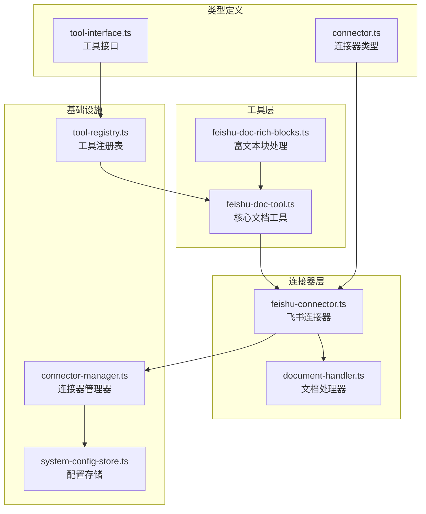
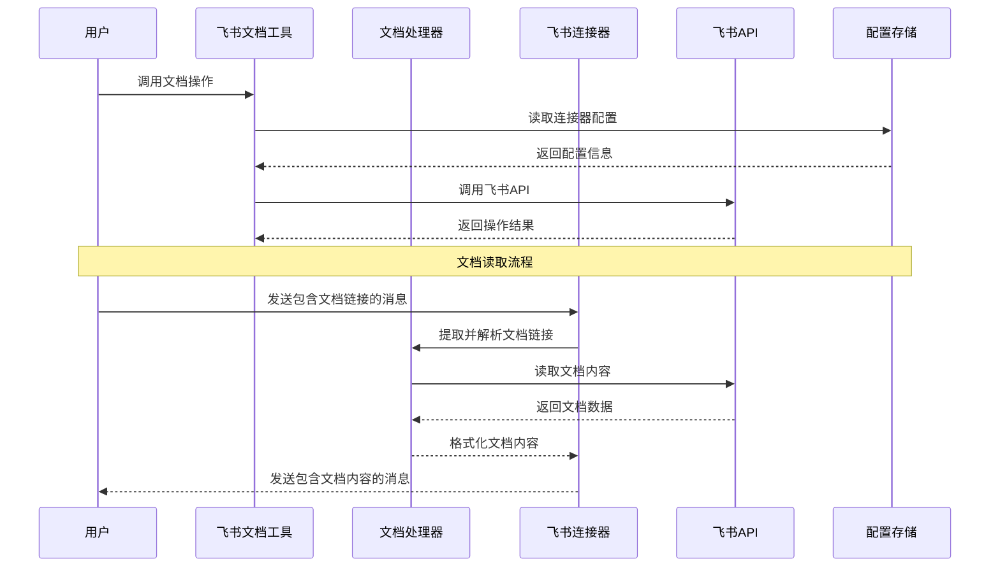
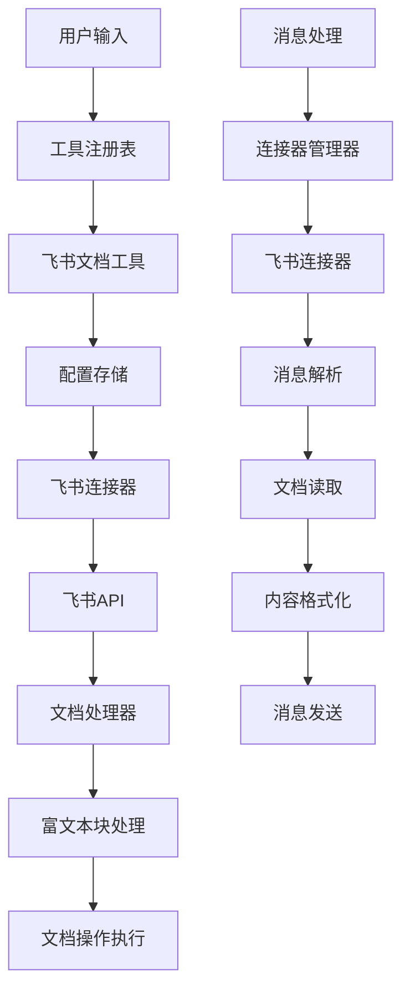
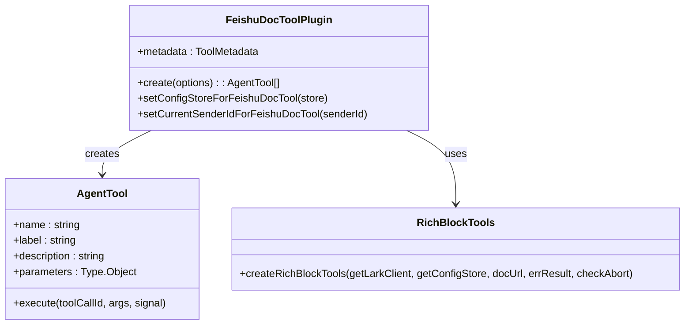
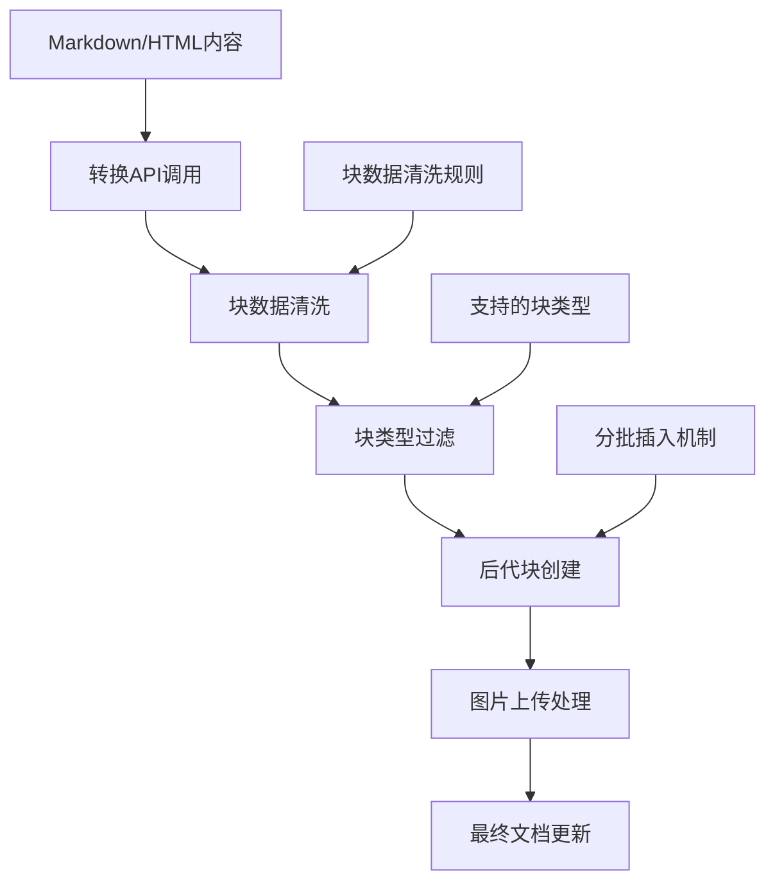
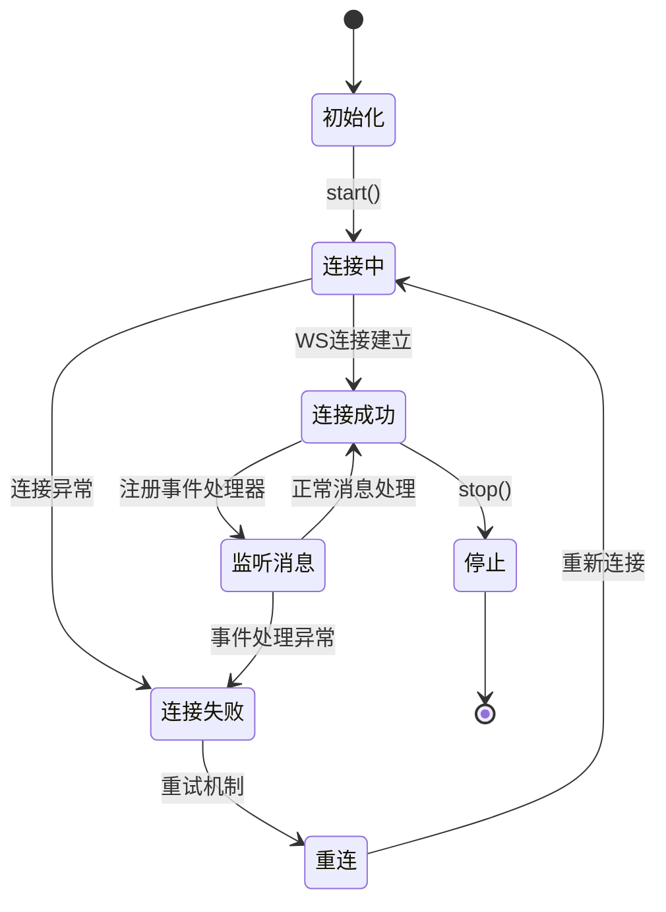
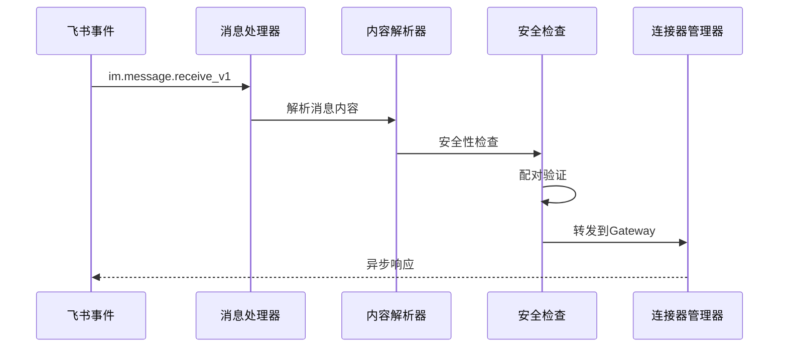
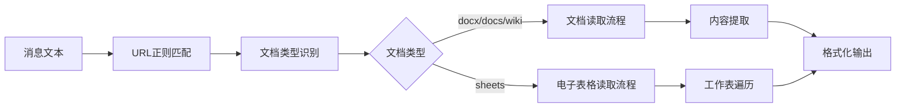
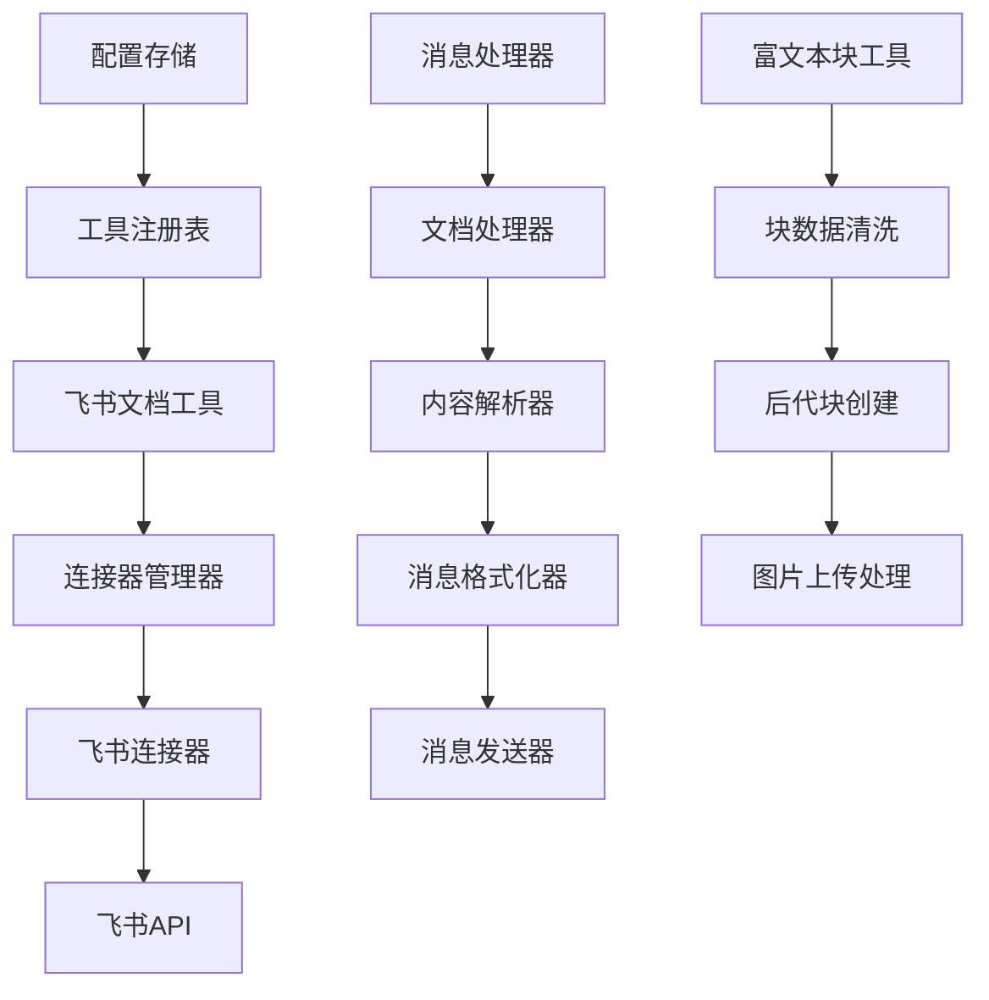
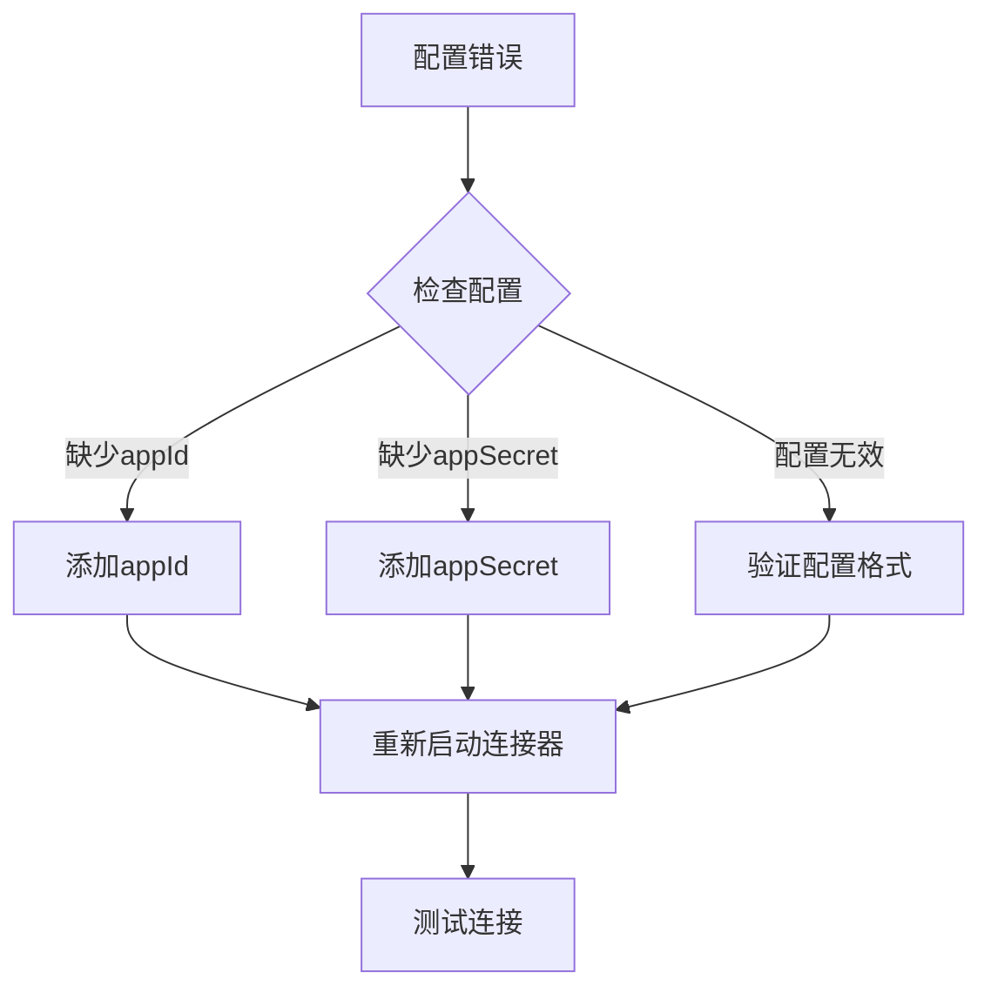

# 飞书文档工具

<cite>
**本文档引用的文件**
- [feishu-doc-tool.ts](file://src/main/tools/feishu-doc-tool.ts)
- [feishu-doc-rich-blocks.ts](file://src/main/tools/feishu-doc-rich-blocks.ts)
- [document-handler.ts](file://src/main/connectors/feishu/document-handler.ts)
- [feishu-connector.ts](file://src/main/connectors/feishu/feishu-connector.ts)
- [connector-manager.ts](file://src/main/connectors/connector-manager.ts)
- [system-config-store.ts](file://src/main/database/system-config-store.ts)
- [tool-interface.ts](file://src/main/tools/registry/tool-interface.ts)
- [tool-registry.ts](file://src/main/tools/registry/tool-registry.ts)
- [connector.ts](file://src/types/connector.ts)
</cite>

## 目录
1. [简介](#简介)
2. [项目结构](#项目结构)
3. [核心组件](#核心组件)
4. [架构概览](#架构概览)
5. [详细组件分析](#详细组件分析)
6. [依赖关系分析](#依赖关系分析)
7. [性能考虑](#性能考虑)
8. [故障排除指南](#故障排除指南)
9. [结论](#结论)

## 简介

史丽慧小助理 飞书文档工具是一个强大的自动化工具集，专为深度集成飞书云文档而设计。该工具提供了完整的文档操作能力，包括文档读取、编辑、内容同步、权限管理和协作机制。

### 主要功能特性

- **文档操作**: 创建、读取、更新、删除飞书云文档
- **内容处理**: 支持富文本块插入、Markdown/HTML转换、复杂文档结构管理
- **权限管理**: 自动协作者添加、权限控制、安全配对机制
- **协作功能**: 文档评论、版本控制、增量更新
- **集成能力**: 与飞书连接器无缝集成，支持实时消息处理

## 项目结构

飞书文档工具采用模块化架构设计，主要分布在以下目录结构中：



**图表来源**
- [feishu-doc-tool.ts:1-552](file://src/main/tools/feishu-doc-tool.ts#L1-L552)
- [feishu-connector.ts:1-994](file://src/main/connectors/feishu/feishu-connector.ts#L1-L994)

**章节来源**
- [feishu-doc-tool.ts:1-50](file://src/main/tools/feishu-doc-tool.ts#L1-L50)
- [feishu-connector.ts:1-50](file://src/main/connectors/feishu/feishu-connector.ts#L1-L50)

## 核心组件

### 飞书文档工具 (FeishuDocTool)

核心文档操作工具，提供以下主要功能：

- **文档创建**: 支持指定文件夹创建新文档
- **信息获取**: 获取文档基本信息和纯文本内容
- **块管理**: 获取所有块、更新块内容、删除块
- **评论功能**: 在文档中添加全文评论
- **文件操作**: 下载云空间文件
- **富文本插入**: 支持复杂文档结构的批量插入

### 飞书文档处理器 (FeishuDocumentHandler)

专门负责飞书文档内容的读取和解析：

- **URL提取**: 从消息中提取飞书文档链接
- **文档读取**: 支持docx、docs、wiki、sheets等多种文档类型
- **内容解析**: 将飞书文档转换为可处理的文本格式
- **格式化输出**: 将读取的内容格式化为消息附加内容

### 飞书连接器 (FeishuConnector)

负责与飞书平台的实时通信：

- **WebSocket连接**: 使用官方SDK建立长连接
- **消息处理**: 解析和处理飞书消息
- **权限管理**: 实现配对机制和权限控制
- **媒体文件处理**: 支持图片和文件的下载和上传

**章节来源**
- [feishu-doc-tool.ts:159-552](file://src/main/tools/feishu-doc-tool.ts#L159-L552)
- [document-handler.ts:23-369](file://src/main/connectors/feishu/document-handler.ts#L23-L369)
- [feishu-connector.ts:28-150](file://src/main/connectors/feishu/feishu-connector.ts#L28-L150)

## 架构概览

飞书文档工具采用分层架构设计，确保功能模块的清晰分离和高内聚低耦合：



**图表来源**
- [feishu-doc-tool.ts:89-114](file://src/main/tools/feishu-doc-tool.ts#L89-L114)
- [document-handler.ts:66-93](file://src/main/connectors/feishu/document-handler.ts#L66-L93)
- [feishu-connector.ts:368-577](file://src/main/connectors/feishu/feishu-connector.ts#L368-L577)

### 数据流架构



**图表来源**
- [tool-registry.ts:36-209](file://src/main/tools/registry/tool-registry.ts#L36-L209)
- [connector-manager.ts:21-168](file://src/main/connectors/connector-manager.ts#L21-L168)

**章节来源**
- [connector-manager.ts:130-168](file://src/main/connectors/connector-manager.ts#L130-L168)
- [system-config-store.ts:445-463](file://src/main/database/system-config-store.ts#L445-L463)

## 详细组件分析

### 飞书文档工具实现

#### 核心工具插件结构



**图表来源**
- [feishu-doc-tool.ts:159-552](file://src/main/tools/feishu-doc-tool.ts#L159-L552)
- [tool-interface.ts:101-134](file://src/main/tools/registry/tool-interface.ts#L101-L134)

#### 文档操作API

工具提供了完整的文档操作API：

1. **创建文档**: `feishu_doc_create`
2. **获取文档信息**: `feishu_doc_get`
3. **获取所有块**: `feishu_doc_get_blocks`
4. **更新块内容**: `feishu_doc_update_block`
5. **删除块**: `feishu_doc_delete_blocks`
6. **添加评论**: `feishu_doc_add_comment`
7. **删除文档**: `feishu_doc_delete_file`
8. **下载文件**: `feishu_drive_download`
9. **插入富文本**: `feishu_doc_insert_rich_blocks`

#### 富文本块处理机制



**图表来源**
- [feishu-doc-rich-blocks.ts:201-291](file://src/main/tools/feishu-doc-rich-blocks.ts#L201-L291)
- [feishu-doc-rich-blocks.ts:434-442](file://src/main/tools/feishu-doc-rich-blocks.ts#L434-L442)

**章节来源**
- [feishu-doc-tool.ts:171-552](file://src/main/tools/feishu-doc-tool.ts#L171-L552)
- [feishu-doc-rich-blocks.ts:375-591](file://src/main/tools/feishu-doc-rich-blocks.ts#L375-L591)

### 飞书连接器实现

#### WebSocket连接管理



**图表来源**
- [feishu-connector.ts:103-150](file://src/main/connectors/feishu/feishu-connector.ts#L103-L150)
- [feishu-connector.ts:181-233](file://src/main/connectors/feishu/feishu-connector.ts#L181-L233)

#### 消息处理流程



**图表来源**
- [feishu-connector.ts:134-146](file://src/main/connectors/feishu/feishu-connector.ts#L134-L146)
- [feishu-connector.ts:368-577](file://src/main/connectors/feishu/feishu-connector.ts#L368-L577)

**章节来源**
- [feishu-connector.ts:88-176](file://src/main/connectors/feishu/feishu-connector.ts#L88-L176)
- [feishu-connector.ts:368-577](file://src/main/connectors/feishu/feishu-connector.ts#L368-L577)

### 文档处理器实现

#### 文档类型支持

文档处理器支持多种飞书文档类型：

| 文档类型 | 支持情况 | 特殊处理 |
|---------|---------|---------|
| docx | ✅ 完全支持 | 标准文档读取 |
| docs | ✅ 完全支持 | 文档格式转换 |
| wiki | ✅ 完全支持 | 维基格式处理 |
| sheets | ✅ 部分支持 | 工作表数据读取 |

#### URL解析机制



**图表来源**
- [document-handler.ts:40-61](file://src/main/connectors/feishu/document-handler.ts#L40-L61)
- [document-handler.ts:50-61](file://src/main/connectors/feishu/document-handler.ts#L50-L61)

**章节来源**
- [document-handler.ts:23-369](file://src/main/connectors/feishu/document-handler.ts#L23-L369)

## 依赖关系分析

### 组件依赖图

```mermaid
graph TB
subgraph "外部依赖"
A[@larksuiteoapi/node-sdk]
B[TypeBox]
C[Node.js FS模块]
D[Node.js OS模块]
end
subgraph "内部模块"
E[SystemConfigStore]
F[ConnectorManager]
G[Logger]
H[ErrorHandler]
end
subgraph "核心工具"
I[FeishuDocTool]
J[FeishuDocumentHandler]
K[FeishuConnector]
L[RichBlockTools]
end
A --> I
A --> J
A --> K
B --> I
C --> I
D --> I
E --> I
F --> K
G --> I
H --> I
I --> L
J --> K
K --> F
```

**图表来源**
- [feishu-doc-tool.ts:17-24](file://src/main/tools/feishu-doc-tool.ts#L17-L24)
- [feishu-connector.ts:11-25](file://src/main/connectors/feishu/feishu-connector.ts#L11-L25)

### 数据流依赖



**图表来源**
- [system-config-store.ts:445-463](file://src/main/database/system-config-store.ts#L445-L463)
- [connector-manager.ts:130-168](file://src/main/connectors/connector-manager.ts#L130-L168)

**章节来源**
- [tool-registry.ts:36-209](file://src/main/tools/registry/tool-registry.ts#L36-L209)
- [connector-manager.ts:21-168](file://src/main/connectors/connector-manager.ts#L21-L168)

## 性能考虑

### 缓存策略

飞书文档工具实现了多层次的缓存机制：

1. **客户端缓存**: Lark Client实例缓存，避免重复创建
2. **配置缓存**: 配置变更时自动失效
3. **消息去重**: 基于消息ID和内容的双重去重机制
4. **内存优化**: 限制去重缓存大小，防止内存泄漏

### 批处理机制

富文本块插入支持分批处理：

- **批量大小**: 最大1000个块
- **分批策略**: 按顶层块分组处理
- **错误隔离**: 单个批次失败不影响其他批次

### 异步处理

- **消息处理**: 使用`setImmediate`实现异步处理
- **文件下载**: 支持中断和取消操作
- **并发控制**: 合理的并发请求限制

## 故障排除指南

### 常见问题及解决方案

#### 权限相关问题

| 问题类型 | 错误代码 | 解决方案 |
|---------|---------|---------|
| 文档读取权限不足 | 99991663 | 添加`docx:document:readonly`权限 |
| 文档写入权限不足 | 99991663 | 添加`docx:document`权限 |
| 云空间文件权限不足 | 99991663 | 添加`drive:drive`权限 |
| 评论权限不足 | 99991663 | 添加`docs:document.comment:create`权限 |

#### 配置相关问题



**图表来源**
- [feishu-connector.ts:74-80](file://src/main/connectors/feishu/feishu-connector.ts#L74-L80)
- [feishu-doc-tool.ts:94-97](file://src/main/tools/feishu-doc-tool.ts#L94-L97)

#### 性能问题排查

1. **连接器健康检查**
   - 使用`healthCheck()`方法检查连接状态
   - 监控WebSocket连接稳定性
   - 检查消息处理延迟

2. **内存使用监控**
   - 监控去重缓存大小
   - 检查文件下载缓存
   - 监控客户端实例数量

3. **API调用限制**
   - 检查飞书API配额
   - 监控请求频率
   - 实施适当的重试机制

**章节来源**
- [feishu-connector.ts:235-248](file://src/main/connectors/feishu/feishu-connector.ts#L235-L248)
- [feishu-doc-tool.ts:121-128](file://src/main/tools/feishu-doc-tool.ts#L121-L128)

### 调试技巧

1. **启用详细日志**
   - 在开发环境中启用详细日志输出
   - 监控API调用响应
   - 跟踪消息处理流程

2. **配置验证**
   - 使用`validateConfig()`方法验证配置
   - 检查连接器状态
   - 监控错误计数

3. **性能监控**
   - 监控工具执行时间
   - 检查内存使用情况
   - 分析API调用耗时

## 结论

史丽慧小助理 飞书文档工具提供了一个完整、健壮且高效的飞书文档操作解决方案。通过模块化的架构设计和丰富的功能特性，该工具能够满足各种复杂的文档处理需求。

### 主要优势

1. **功能完整性**: 覆盖了飞书文档操作的所有核心场景
2. **架构清晰**: 分层设计确保了良好的可维护性和扩展性
3. **性能优化**: 多层次缓存和异步处理机制
4. **安全性**: 完善的权限管理和配对机制
5. **易用性**: 简洁的API设计和详细的错误处理

### 未来发展方向

1. **功能扩展**: 支持更多飞书文档类型和格式
2. **性能优化**: 进一步优化大数据量处理能力
3. **监控增强**: 添加更详细的性能监控和告警机制
4. **用户体验**: 改进错误提示和调试信息

该工具为史丽慧小助理生态系统提供了强大的文档处理能力，是实现AI驱动文档协作的重要基础设施。