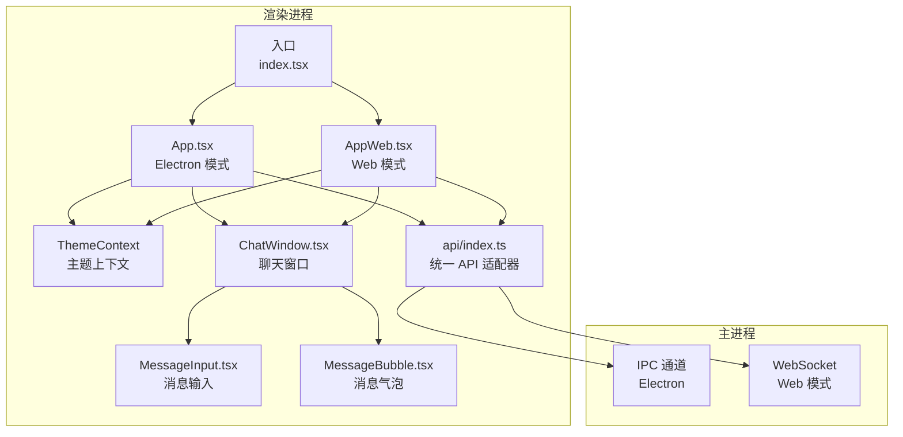
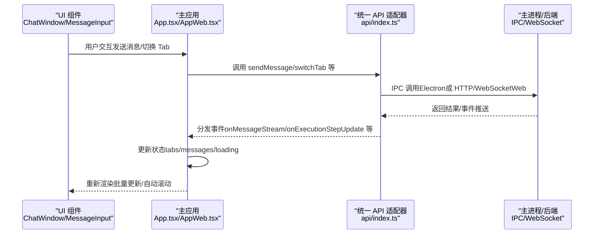
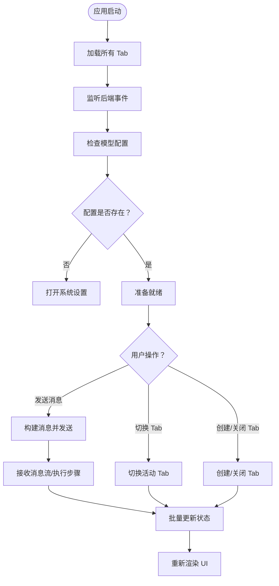
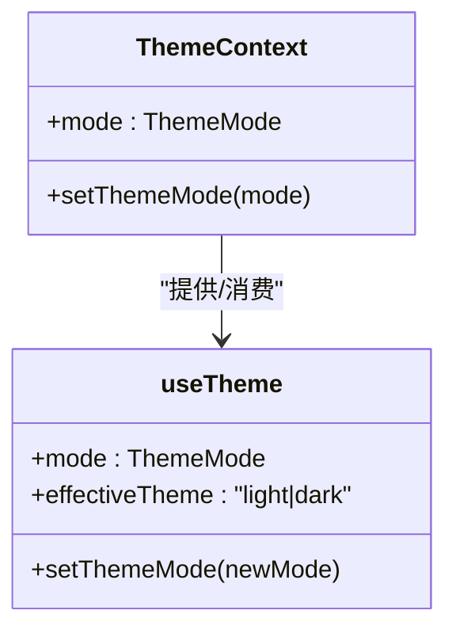
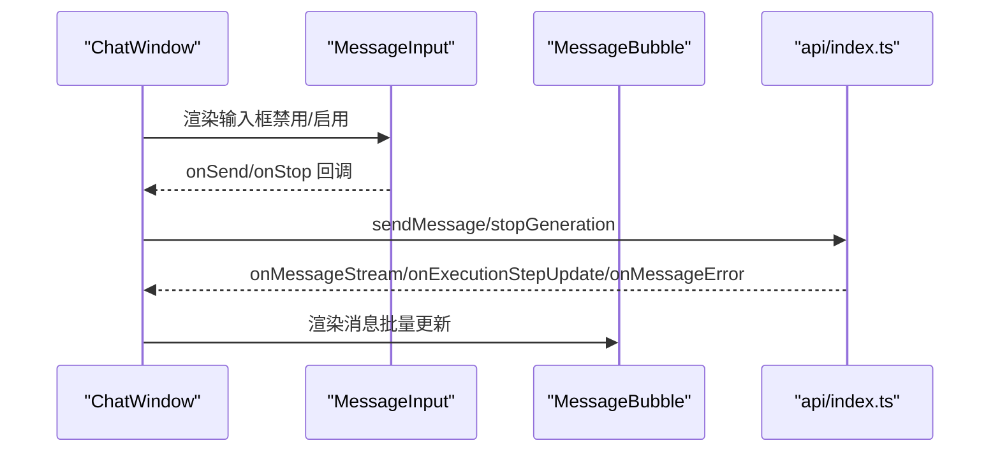
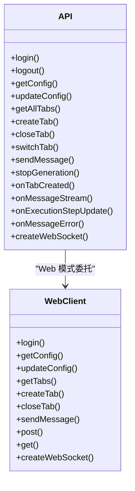
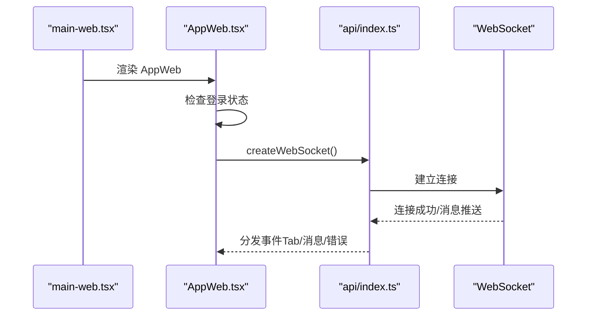
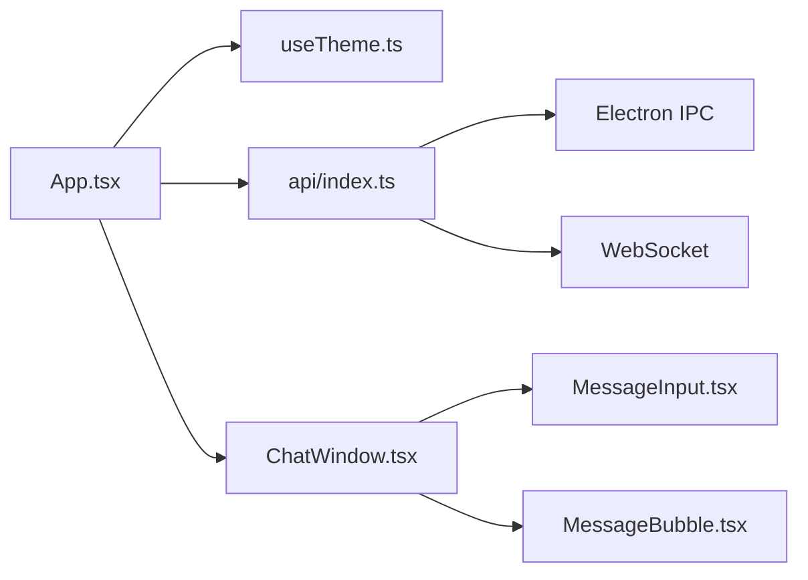

# React 应用结构

<cite>
**本文档引用的文件**
- [App.tsx](file://src/renderer/App.tsx)
- [useTheme.ts](file://src/renderer/hooks/useTheme.ts)
- [index.tsx](file://src/renderer/index.tsx)
- [main-web.tsx](file://src/renderer/main-web.tsx)
- [AppWeb.tsx](file://src/renderer/AppWeb.tsx)
- [ChatWindow.tsx](file://src/renderer/components/ChatWindow.tsx)
- [MessageInput.tsx](file://src/renderer/components/MessageInput.tsx)
- [MessageBubble.tsx](file://src/renderer/components/MessageBubble.tsx)
- [api/index.ts](file://src/renderer/api/index.ts)
- [update-store.ts](file://src/renderer/utils/update-store.ts)
</cite>

## 目录
1. [简介](#简介)
2. [项目结构](#项目结构)
3. [核心组件](#核心组件)
4. [架构概览](#架构概览)
5. [详细组件分析](#详细组件分析)
6. [依赖关系分析](#依赖关系分析)
7. [性能考量](#性能考量)
8. [故障排除指南](#故障排除指南)
9. [结论](#结论)

## 简介
本文件深入解析 DeepBot React 应用的结构与实现，重点围绕主应用组件 App.tsx 的架构设计，涵盖主题管理、状态管理、组件通信机制、启动流程、组件层次结构与数据流向。同时提供主题上下文的实现原理与使用方法、组件状态管理最佳实践与性能优化技巧，以及应用初始化过程与错误处理机制。

## 项目结构
DeepBot 采用 Electron + React 架构，渲染进程入口根据环境变量选择 App 或 AppWeb 组件，形成统一的 API 适配层以支持 IPC（Electron）与 HTTP/WebSocket（Web）两种通信模式。核心模块包括：
- 主应用组件：App.tsx（Electron 模式）与 AppWeb.tsx（Web 模式）
- 主题管理：useTheme Hook 与 ThemeContext
- 统一 API 适配器：api/index.ts
- 核心 UI 组件：ChatWindow、MessageInput、MessageBubble
- 启动入口：index.tsx（根据 MODE 选择 App/AppWeb）

**图表来源**
- [index.tsx:15-20](file://src/renderer/index.tsx#L15-L20)
- [App.tsx:18-22](file://src/renderer/App.tsx#L18-L22)
- [AppWeb.tsx:17-22](file://src/renderer/AppWeb.tsx#L17-L22)
- [api/index.ts:6-7](file://src/renderer/api/index.ts#L6-L7)

**章节来源**
- [index.tsx:15-20](file://src/renderer/index.tsx#L15-L20)
- [App.tsx:18-22](file://src/renderer/App.tsx#L18-L22)
- [AppWeb.tsx:17-22](file://src/renderer/AppWeb.tsx#L17-L22)
- [api/index.ts:6-7](file://src/renderer/api/index.ts#L6-L7)

## 核心组件
本节聚焦主应用组件 App.tsx 的架构设计与实现要点，包括主题管理、状态管理、组件通信与数据流。

- 主题上下文与 Hook
  - ThemeContext：提供 mode 与 setThemeMode，贯穿整个应用树。
  - useTheme：封装主题模式持久化、自动切换与 DOM 应用逻辑。
- 状态管理
  - Tabs 管理：tabs、activeTabId、messages、isLoading 等。
  - 事件驱动：通过 api.on* 监听后端事件，实时更新状态。
  - 优化策略：requestAnimationFrame 批量更新、tabsRef 引用最新状态避免闭包陷阱。
- 组件通信
  - ChatWindow 作为容器组件，向下传递 props 并接收回调。
  - MessageInput 通过 ref 暴露 focus 方法，便于 ChatWindow 控制焦点。
  - MessageBubble 通过自定义比较函数减少不必要的重渲染。
- 启动流程
  - 加载 Tabs、监听事件、检查模型配置、初始化待授权计数。
  - Electron 模式：通过 IPC 与主进程通信；Web 模式：通过 HTTP/WebSocket 与后端通信。
- 错误处理
  - 对 Gateway 未初始化进行延迟重试。
  - 对模型配置缺失进行提示与系统设置弹窗。
  - 对消息流错误进行统一处理与展示。

**章节来源**
- [App.tsx:18-22](file://src/renderer/App.tsx#L18-L22)
- [useTheme.ts:31-62](file://src/renderer/hooks/useTheme.ts#L31-L62)
- [ChatWindow.tsx:32-47](file://src/renderer/components/ChatWindow.tsx#L32-L47)
- [MessageInput.tsx:20-33](file://src/renderer/components/MessageInput.tsx#L20-L33)
- [MessageBubble.tsx:142-216](file://src/renderer/components/MessageBubble.tsx#L142-L216)

## 架构概览
本节展示应用的整体架构与数据流，强调统一 API 适配器在不同运行环境下的作用。

**图表来源**
- [App.tsx:613-685](file://src/renderer/App.tsx#L613-L685)
- [AppWeb.tsx:613-678](file://src/renderer/AppWeb.tsx#L613-L678)
- [api/index.ts:277-287](file://src/renderer/api/index.ts#L277-L287)
- [api/index.ts:385-398](file://src/renderer/api/index.ts#L385-L398)

## 详细组件分析

### 主应用组件 App.tsx
App.tsx 是 Electron 模式的核心，负责：
- 主题上下文提供者：ThemeContext.Provider 包裹整个应用树。
- Tabs 管理：加载、创建、关闭、切换 Tab，并维护当前 Tab 的消息与加载状态。
- 事件监听：Tab 创建/更新/清空、历史加载、消息流、执行步骤更新、错误处理等。
- 模型配置检查：首次进入时检查模型配置，缺失时提示并打开系统设置。
- 消息发送：构建消息内容（含图片/文件路径），调用 api.sendMessage 并处理错误。
- 自动更新：监听更新可用事件，通过 update-store.ts 保证 SystemSettings 挂载前不丢失更新信息。

**图表来源**
- [App.tsx:47-132](file://src/renderer/App.tsx#L47-L132)
- [App.tsx:134-141](file://src/renderer/App.tsx#L134-L141)
- [App.tsx:250-297](file://src/renderer/App.tsx#L250-L297)
- [App.tsx:613-685](file://src/renderer/App.tsx#L613-L685)

**章节来源**
- [App.tsx:24-738](file://src/renderer/App.tsx#L24-L738)
- [update-store.ts:14-32](file://src/renderer/utils/update-store.ts#L14-L32)

### 主题上下文与 Hook
- ThemeContext：提供 mode 与 setThemeMode，供任意层级组件消费。
- useTheme：
  - 从 localStorage 读取主题偏好，默认深色。
  - effectiveTheme 根据 mode 计算实际生效主题。
  - 自动模式按小时切换 light/dark。
  - setThemeMode 更新状态并持久化。

**图表来源**
- [App.tsx:18-22](file://src/renderer/App.tsx#L18-L22)
- [useTheme.ts:31-62](file://src/renderer/hooks/useTheme.ts#L31-L62)

**章节来源**
- [App.tsx:18-22](file://src/renderer/App.tsx#L18-L22)
- [useTheme.ts:31-62](file://src/renderer/hooks/useTheme.ts#L31-L62)

### ChatWindow 组件
- 负责聊天界面的布局与交互，包括：
  - Tab 标签栏、消息列表、输入框、加载指示器。
  - 自动滚动与手动滚动的智能控制，避免误判。
  - 分页加载优化：初始只显示最近 20 条消息，向上滚动加载更多。
  - 消息初始化状态与空状态处理。
  - 连接器 Tab 的特殊处理（不显示输入框）。

**图表来源**
- [ChatWindow.tsx:32-509](file://src/renderer/components/ChatWindow.tsx#L32-L509)
- [MessageInput.tsx:25-444](file://src/renderer/components/MessageInput.tsx#L25-L444)
- [MessageBubble.tsx:218-556](file://src/renderer/components/MessageBubble.tsx#L218-L556)
- [api/index.ts:385-398](file://src/renderer/api/index.ts#L385-L398)

**章节来源**
- [ChatWindow.tsx:32-509](file://src/renderer/components/ChatWindow.tsx#L32-L509)
- [MessageInput.tsx:25-444](file://src/renderer/components/MessageInput.tsx#L25-L444)
- [MessageBubble.tsx:218-556](file://src/renderer/components/MessageBubble.tsx#L218-L556)

### 统一 API 适配器
- 根据运行环境自动选择 IPC（Electron）或 HTTP/WebSocket（Web）。
- 提供统一的事件监听接口：onTabCreated/onMessageStream/onExecutionStepUpdate 等。
- Web 模式下维护 WebSocket 连接与事件分发，支持批量订阅 Tab。
- 提供认证、配置管理、消息发送、文件上传等能力。

**图表来源**
- [api/index.ts:20-550](file://src/renderer/api/index.ts#L20-L550)

**章节来源**
- [api/index.ts:20-550](file://src/renderer/api/index.ts#L20-L550)

### Web 模式入口与登录流程
- main-web.tsx：直接渲染 AppWeb。
- AppWeb.tsx：
  - 登录状态检查与 WebSocket 建立。
  - 登录成功后统一处理事件监听与 Tab 订阅。
  - 被踢出事件处理与遮罩层提示。

**图表来源**
- [main-web.tsx:9-13](file://src/renderer/main-web.tsx#L9-L13)
- [AppWeb.tsx:20-783](file://src/renderer/AppWeb.tsx#L20-L783)
- [api/index.ts:412-486](file://src/renderer/api/index.ts#L412-L486)

**章节来源**
- [main-web.tsx:9-13](file://src/renderer/main-web.tsx#L9-L13)
- [AppWeb.tsx:20-783](file://src/renderer/AppWeb.tsx#L20-L783)
- [api/index.ts:412-486](file://src/renderer/api/index.ts#L412-L486)

## 依赖关系分析
- 组件耦合与内聚
  - App.tsx 作为状态中心，高内聚地管理 Tabs、消息与加载状态，低耦合地通过 props 与事件与子组件通信。
  - ChatWindow 作为容器组件，聚合 MessageInput 与 MessageBubble，职责清晰。
- 直接与间接依赖
  - App.tsx 直接依赖 useTheme、api/index.ts、各 UI 组件。
  - ChatWindow 依赖 api/index.ts 与 UI 组件。
  - api/index.ts 在 Web 模式下依赖 WebSocket，在 Electron 模式下依赖 IPC。
- 外部依赖与集成点
  - Electron 模式：通过 window.electron.ipcRenderer.invoke 与主进程通信。
  - Web 模式：通过 HTTP 与 WebSocket 与后端通信。
- 接口契约与实现细节
  - 统一 API 适配器对外暴露一致的接口，内部根据环境选择实现。
  - 事件监听器通过 Map/Set 存储，支持注册与清理。

**图表来源**
- [App.tsx:5-16](file://src/renderer/App.tsx#L5-L16)
- [useTheme.ts:10-14](file://src/renderer/hooks/useTheme.ts#L10-L14)
- [api/index.ts:6-7](file://src/renderer/api/index.ts#L6-L7)

**章节来源**
- [App.tsx:5-16](file://src/renderer/App.tsx#L5-L16)
- [useTheme.ts:10-14](file://src/renderer/hooks/useTheme.ts#L10-L14)
- [api/index.ts:6-7](file://src/renderer/api/index.ts#L6-L7)

## 性能考量
- 批量更新与重渲染优化
  - 使用 requestAnimationFrame 将多次状态更新合并为一次重渲染，减少抖动与卡顿。
  - MessageBubble 通过自定义比较函数（arePropsEqual）避免不必要的重渲染。
- 滚动与分页加载
  - ChatWindow 使用 MutationObserver 与自动滚动结合，避免重复滚动。
  - 分页加载：初始只渲染最近 N 条消息，向上滚动时增量加载，保持 UI 流畅。
- 事件监听与内存管理
  - 统一在 useEffect 中注册事件监听并在清理函数中移除，防止内存泄漏。
  - tabsRef 保存最新 tabs 状态，避免闭包陷阱导致的状态陈旧。
- 主题切换与 DOM 更新
  - useTheme 在自动模式下按分钟轮询切换，避免频繁 DOM 操作。

**章节来源**
- [App.tsx:374-506](file://src/renderer/App.tsx#L374-L506)
- [MessageBubble.tsx:142-216](file://src/renderer/components/MessageBubble.tsx#L142-L216)
- [ChatWindow.tsx:166-302](file://src/renderer/components/ChatWindow.tsx#L166-L302)
- [useTheme.ts:45-54](file://src/renderer/hooks/useTheme.ts#L45-L54)

## 故障排除指南
- Gateway 未初始化
  - 现象：加载 Tabs 时抛出“Gateway 未初始化”错误。
  - 处理：App.tsx 中捕获错误并延迟 500ms 重试，确保主进程初始化完成。
- 模型配置缺失
  - 现象：首次进入或配置变更后，系统提示未配置模型。
  - 处理：自动打开系统设置并添加系统提示消息，引导用户配置。
- 消息流错误
  - 现象：消息流推送过程中出现错误。
  - 处理：统一捕获 onMessageError，生成系统提示消息并关闭加载状态。
- 自动更新丢失
  - 现象：SystemSettings 尚未挂载时，自动更新信息丢失。
  - 处理：通过 update-store.ts 提供单例存储与监听器，保证信息不丢失。

**章节来源**
- [App.tsx:124-131](file://src/renderer/App.tsx#L124-L131)
- [App.tsx:271-297](file://src/renderer/App.tsx#L271-L297)
- [App.tsx:577-604](file://src/renderer/App.tsx#L577-L604)
- [update-store.ts:14-32](file://src/renderer/utils/update-store.ts#L14-L32)

## 结论
DeepBot React 应用通过统一的 API 适配器实现了跨平台一致性，借助主题上下文与 Hook 提供了灵活的主题管理，通过事件驱动与批量更新策略保障了良好的用户体验。组件间职责清晰、耦合度低，配合分页加载与滚动优化，使应用在复杂交互场景下仍能保持流畅与稳定。建议在后续迭代中进一步完善错误边界与日志上报，增强可观测性与可维护性。