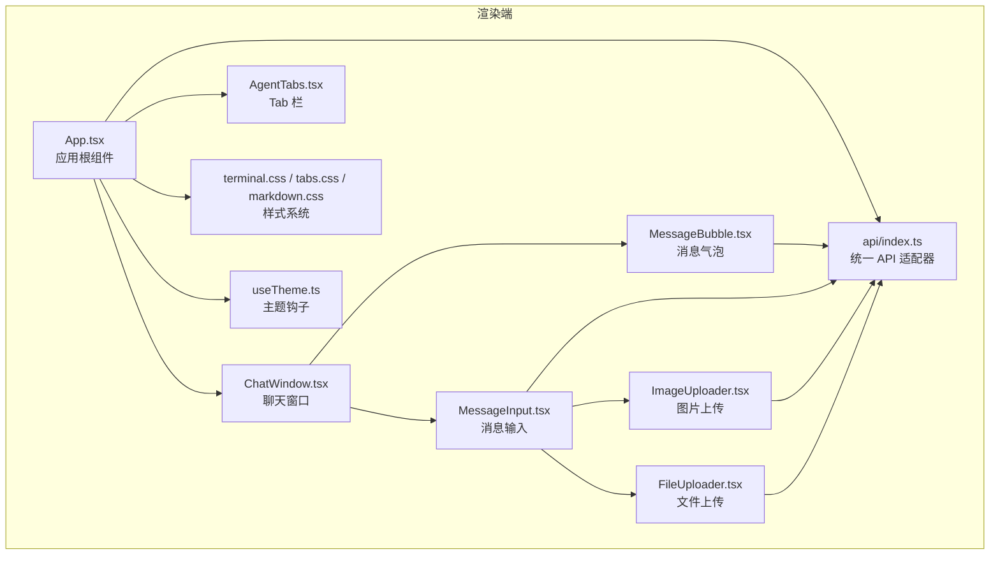
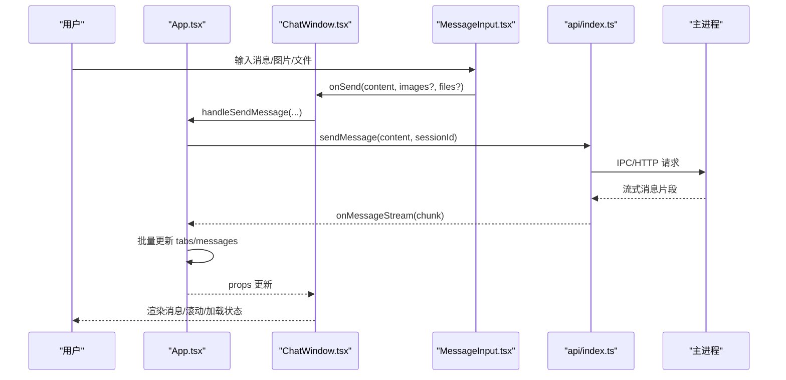
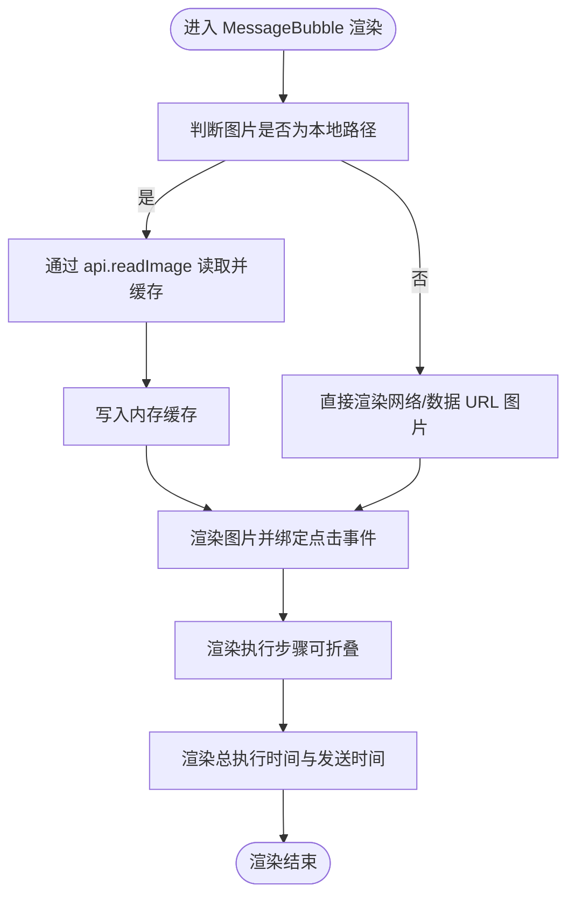
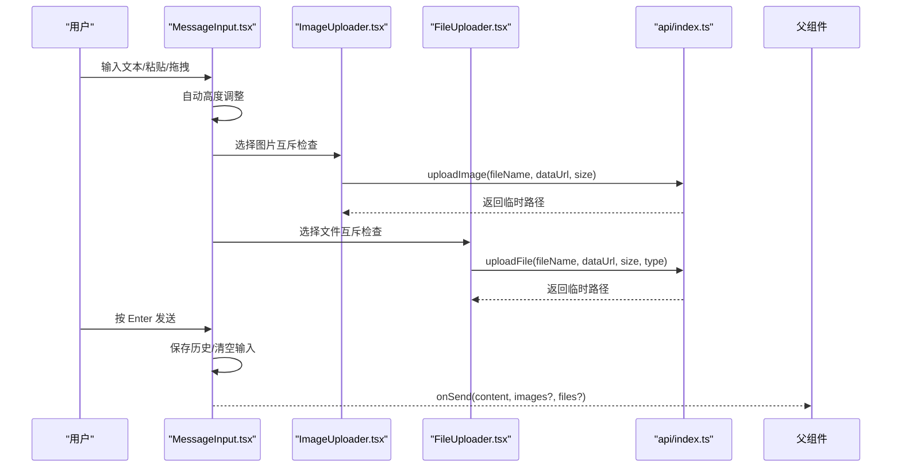
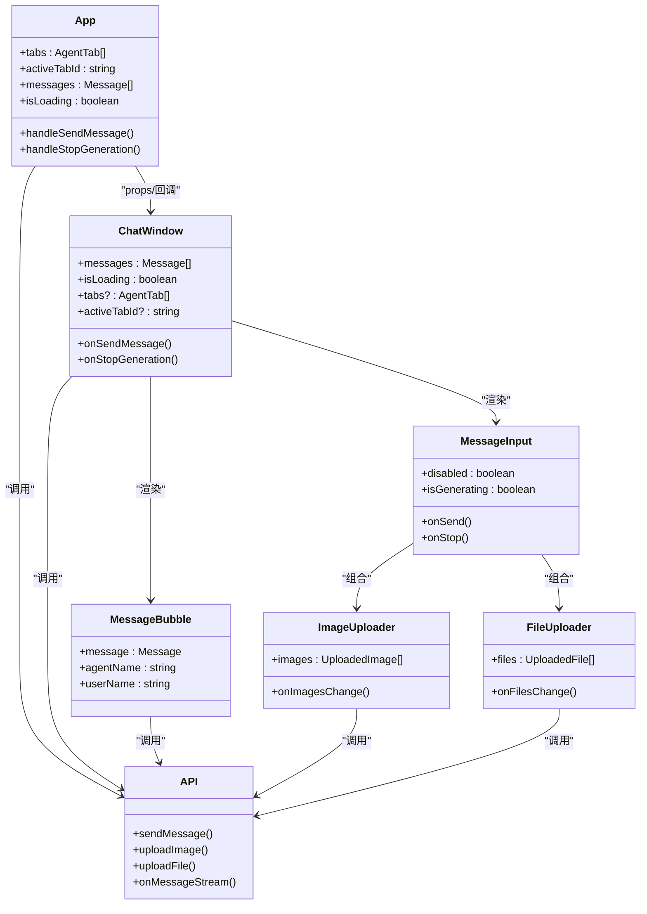

# UI 组件详解

<cite>
**本文引用的文件**
- [ChatWindow.tsx](file://src/renderer/components/ChatWindow.tsx)
- [MessageBubble.tsx](file://src/renderer/components/MessageBubble.tsx)
- [MessageInput.tsx](file://src/renderer/components/MessageInput.tsx)
- [App.tsx](file://src/renderer/App.tsx)
- [ImageUploader.tsx](file://src/renderer/components/ImageUploader.tsx)
- [FileUploader.tsx](file://src/renderer/components/FileUploader.tsx)
- [terminal.css](file://src/renderer/styles/terminal.css)
- [tabs.css](file://src/renderer/styles/tabs.css)
- [markdown.css](file://src/renderer/styles/markdown.css)
- [useTheme.ts](file://src/renderer/hooks/useTheme.ts)
- [AgentTabs.tsx](file://src/renderer/components/AgentTabs.tsx)
- [api/index.ts](file://src/renderer/api/index.ts)
- [file-reader.ts](file://src/renderer/utils/file-reader.ts)
- [Tooltip.tsx](file://src/renderer/components/Tooltip.tsx)
- [message.ts](file://src/types/message.ts)
- [version.ts](file://src/shared/constants/version.ts)
</cite>

## 目录
1. [简介](#简介)
2. [项目结构](#项目结构)
3. [核心组件](#核心组件)
4. [架构总览](#架构总览)
5. [组件详细分析](#组件详细分析)
6. [依赖关系分析](#依赖关系分析)
7. [性能考量](#性能考量)
8. [故障排查指南](#故障排查指南)
9. [结论](#结论)
10. [附录](#附录)

## 简介
本文件面向 史丽慧小助理 的 UI 组件系统，围绕聊天窗口、消息气泡、消息输入等核心组件进行深入解析。内容覆盖组件属性接口、事件处理与状态管理、组件间通信机制、数据传递方式、定制与扩展指南、响应式设计与样式系统、可访问性与用户体验优化等方面，帮助开发者快速理解并高效扩展 UI 能力。

## 项目结构
史丽慧小助理 的渲染端采用 React + TypeScript 构建，UI 组件集中在 src/renderer/components 目录，样式位于 src/renderer/styles，主题与平台能力通过 hooks 与工具模块提供，类型定义位于 src/types，常量位于 src/shared。

图表来源
- [App.tsx](file://src/renderer/App.tsx)
- [ChatWindow.tsx](file://src/renderer/components/ChatWindow.tsx)
- [MessageBubble.tsx](file://src/renderer/components/MessageBubble.tsx)
- [MessageInput.tsx](file://src/renderer/components/MessageInput.tsx)
- [ImageUploader.tsx](file://src/renderer/components/ImageUploader.tsx)
- [FileUploader.tsx](file://src/renderer/components/FileUploader.tsx)
- [AgentTabs.tsx](file://src/renderer/components/AgentTabs.tsx)
- [terminal.css](file://src/renderer/styles/terminal.css)
- [tabs.css](file://src/renderer/styles/tabs.css)
- [markdown.css](file://src/renderer/styles/markdown.css)
- [useTheme.ts](file://src/renderer/hooks/useTheme.ts)
- [api/index.ts](file://src/renderer/api/index.ts)

章节来源
- [App.tsx](file://src/renderer/App.tsx)
- [ChatWindow.tsx](file://src/renderer/components/ChatWindow.tsx)
- [MessageBubble.tsx](file://src/renderer/components/MessageBubble.tsx)
- [MessageInput.tsx](file://src/renderer/components/MessageInput.tsx)
- [ImageUploader.tsx](file://src/renderer/components/ImageUploader.tsx)
- [FileUploader.tsx](file://src/renderer/components/FileUploader.tsx)
- [AgentTabs.tsx](file://src/renderer/components/AgentTabs.tsx)
- [terminal.css](file://src/renderer/styles/terminal.css)
- [tabs.css](file://src/renderer/styles/tabs.css)
- [markdown.css](file://src/renderer/styles/markdown.css)
- [useTheme.ts](file://src/renderer/hooks/useTheme.ts)
- [api/index.ts](file://src/renderer/api/index.ts)

## 核心组件
- 聊天窗口 ChatWindow：承载消息列表、输入区、Tab 栏、顶部控制区；负责滚动、分页加载、初始化状态、Tab 名称与锁定态展示等。
- 消息气泡 MessageBubble：渲染单条消息，支持 Markdown、图片/文件展示、执行步骤折叠展开、总执行时间显示。
- 消息输入 MessageInput：提供输入框、发送/停止按钮、图片/文件上传、命令提示、历史记录、自动高度调整。
- 上传组件 ImageUploader / FileUploader：分别处理图片与文件上传，含互斥逻辑、预览、删除、大小与数量限制。
- 统一 API 适配器 api：根据运行环境（Electron/Web）自动选择 IPC 或 HTTP/WebSocket 通道，封装事件监听与消息推送。
- 样式系统 terminal.css / tabs.css / markdown.css：终端风格主题、滚动条、代码块、列表、链接、执行步骤等样式。
- 主题钩子 useTheme：支持 light/dark/auto 三种模式，持久化与自动切换。
- 类型与常量：message.ts 定义消息与执行步骤结构；version.ts 提供 MAX_TABS 等常量。

章节来源
- [ChatWindow.tsx](file://src/renderer/components/ChatWindow.tsx)
- [MessageBubble.tsx](file://src/renderer/components/MessageBubble.tsx)
- [MessageInput.tsx](file://src/renderer/components/MessageInput.tsx)
- [ImageUploader.tsx](file://src/renderer/components/ImageUploader.tsx)
- [FileUploader.tsx](file://src/renderer/components/FileUploader.tsx)
- [api/index.ts](file://src/renderer/api/index.ts)
- [terminal.css](file://src/renderer/styles/terminal.css)
- [tabs.css](file://src/renderer/styles/tabs.css)
- [markdown.css](file://src/renderer/styles/markdown.css)
- [useTheme.ts](file://src/renderer/hooks/useTheme.ts)
- [message.ts](file://src/types/message.ts)
- [version.ts](file://src/shared/constants/version.ts)

## 架构总览
UI 采用“应用根组件驱动 + 组件分层”的架构：App.tsx 作为状态与事件中枢，协调 ChatWindow、MessageBubble、MessageInput 等子组件；通过 api 统一适配器与主进程交互，实现消息流式推送、执行步骤更新、Tab 管理、文件上传等能力。

图表来源
- [App.tsx](file://src/renderer/App.tsx)
- [ChatWindow.tsx](file://src/renderer/components/ChatWindow.tsx)
- [MessageInput.tsx](file://src/renderer/components/MessageInput.tsx)
- [api/index.ts](file://src/renderer/api/index.ts)

## 组件详细分析

### 聊天窗口 ChatWindow
- 职责
  - 管理消息列表、加载状态、滚动行为与分页加载。
  - 维护 Tab 列表与活动 Tab，根据 Tab 类型决定是否显示输入区。
  - 与 api 交互获取 Tab 名称、监听历史加载、消息清除、名称配置更新等事件。
- 关键属性
  - messages: Message[]，onSendMessage/onStopGeneration，isLoading/isLocked，tabs/activeTabId/onTab* 系列回调。
- 状态与滚动
  - autoScroll：自动滚动到底部；用户手动滚动时暂停自动滚动，回到底部时恢复。
  - 分页加载：displayCount 控制当前显示数量，hasMoreMessages 判断是否可加载更多。
  - MutationObserver：监听消息容器 DOM 变化，触发自动滚动。
- 初始化与空态
  - 根据 activeTabId 与 messages 长度动态显示“初始化提示”或“空状态”。
- 输入区条件
  - connector 类型 Tab 不显示输入区；受 isLoading/isLocked/isInitializing 影响禁用状态。
- 顶部控制与徽章
  - 支持打开技能管理器、定时任务管理器、系统设置；系统设置按钮带待授权计数徽章。

章节来源
- [ChatWindow.tsx](file://src/renderer/components/ChatWindow.tsx)
- [App.tsx](file://src/renderer/App.tsx)
- [api/index.ts](file://src/renderer/api/index.ts)
- [version.ts](file://src/shared/constants/version.ts)

### 消息气泡 MessageBubble
- 职责
  - 渲染单条消息，支持 Markdown（含 GFM）、图片/文件展示、执行步骤折叠/展开、总执行时间与发送时间。
- 关键属性
  - message: Message，agentName/userName/isConnectorTab。
- 图片加载与预览
  - 本地图片通过 api.readImage 读取并缓存；点击图片在 Electron 使用系统应用打开，Web 模式转 Blob URL 新窗口打开。
- 执行步骤
  - 支持展开/折叠单个步骤与全部展开；错误优先显示错误框，无错误时显示结果框。
- 性能优化
  - React.memo + 自定义比较函数 arePropsEqual，避免无关消息重渲染。
- Markdown 渲染
  - 自定义渲染规则，保持终端风格，支持代码块、列表、链接、图片等。

图表来源
- [MessageBubble.tsx](file://src/renderer/components/MessageBubble.tsx)
- [api/index.ts](file://src/renderer/api/index.ts)

章节来源
- [MessageBubble.tsx](file://src/renderer/components/MessageBubble.tsx)
- [message.ts](file://src/types/message.ts)
- [api/index.ts](file://src/renderer/api/index.ts)

### 消息输入 MessageInput
- 职责
  - 提供输入框、发送/停止按钮、图片/文件上传、命令提示、历史记录、自动高度调整。
- 关键属性
  - onSend/onStop/disabled/isGenerating/userName/disableStop/isConnectorTab。
- 命令提示
  - 以 / 开头的命令（new/history/memory/stop）自动提示与选择，支持上下键与 Tab/Enter 选择。
- 历史记录
  - 上下键在首行/末行触发历史记录浏览；临时内容保存与恢复。
- 上传组件集成
  - 内嵌 ImageUploader 与 FileUploader，支持互斥（图片与文件不可同时上传）。
- 自动高度与滚动
  - 根据内容高度动态调整，最大高度 120px，超限显示垂直滚动条。
- Ref 暴露
  - forwardRef 暴露 focus 方法给父组件。

图表来源
- [MessageInput.tsx](file://src/renderer/components/MessageInput.tsx)
- [ImageUploader.tsx](file://src/renderer/components/ImageUploader.tsx)
- [FileUploader.tsx](file://src/renderer/components/FileUploader.tsx)
- [api/index.ts](file://src/renderer/api/index.ts)

章节来源
- [MessageInput.tsx](file://src/renderer/components/MessageInput.tsx)
- [ImageUploader.tsx](file://src/renderer/components/ImageUploader.tsx)
- [FileUploader.tsx](file://src/renderer/components/FileUploader.tsx)
- [file-reader.ts](file://src/renderer/utils/file-reader.ts)
- [api/index.ts](file://src/renderer/api/index.ts)

### 上传组件 ImageUploader / FileUploader
- 图片上传
  - 限制数量与大小，默认最多 5 张、每张最大 5MB；支持点击/拖拽；预览与删除；上传成功后返回临时路径。
- 文件上传
  - 限制数量与大小，默认最多 5 个、每个最大 500MB；支持点击上传；预览与删除。
- 互斥逻辑
  - 若已上传图片，则禁止上传文件；若已上传文件，则禁止上传图片。
- 临时文件清理
  - 删除时通过 api.deleteTempFile 清理临时文件。

章节来源
- [ImageUploader.tsx](file://src/renderer/components/ImageUploader.tsx)
- [FileUploader.tsx](file://src/renderer/components/FileUploader.tsx)
- [api/index.ts](file://src/renderer/api/index.ts)

### 统一 API 适配器 api
- 环境适配
  - Electron 模式使用 window.electron.ipcRenderer.invoke；Web 模式使用 HTTP/WebSocket。
- 事件系统
  - onMessageStream/onExecutionStepUpdate/onMessageError 等事件监听；Web 模式通过 WebSocket 分发事件。
- Tab 管理
  - getAllTabs/createTab/closeTab/switchTab；Web 模式支持 subscribeTab 订阅指定 Tab。
- 文件与图片
  - uploadFile/uploadImage/readImage/deleteTempFile/openPath/selectFolder 等。
- 认证与配置
  - login/logout/getConfig/updateConfig/getModelConfig/saveModelConfig 等。

章节来源
- [api/index.ts](file://src/renderer/api/index.ts)

### 样式系统与主题
- 主题
  - useTheme 提供 light/dark/auto 三种模式，自动模式按时间段切换；主题持久化于 localStorage。
- 样式文件
  - terminal.css：终端风格主题变量、滚动条、消息行、提示符、输入框、按钮、加载动画、执行步骤、空状态等。
  - tabs.css：Tab 栏样式，支持锁定态 Tab。
  - markdown.css：Markdown 内容渲染样式，强调紧凑排版与代码高亮。
- 响应式
  - 样式文件包含媒体查询，适配移动端阅读体验。

章节来源
- [useTheme.ts](file://src/renderer/hooks/useTheme.ts)
- [terminal.css](file://src/renderer/styles/terminal.css)
- [tabs.css](file://src/renderer/styles/tabs.css)
- [markdown.css](file://src/renderer/styles/markdown.css)

### 组件间通信与数据流
- App.tsx 作为中枢
  - 维护 tabs/messages/loading 状态；监听流式消息与执行步骤更新；处理发送消息、停止生成、Tab 切换/创建/关闭。
- ChatWindow 与 MessageBubble
  - ChatWindow 传入 messages 与回调；MessageBubble 接收单条消息与渲染上下文。
- MessageInput 与上传组件
  - 通过 onSend 将内容与附件传递给父组件；上传组件通过 api 与主进程交互。
- 事件驱动
  - api.onMessageStream 等事件驱动 UI 更新，使用 requestAnimationFrame 批量更新减少重渲染。

章节来源
- [App.tsx](file://src/renderer/App.tsx)
- [ChatWindow.tsx](file://src/renderer/components/ChatWindow.tsx)
- [MessageBubble.tsx](file://src/renderer/components/MessageBubble.tsx)
- [MessageInput.tsx](file://src/renderer/components/MessageInput.tsx)
- [api/index.ts](file://src/renderer/api/index.ts)

## 依赖关系分析

图表来源
- [App.tsx](file://src/renderer/App.tsx)
- [ChatWindow.tsx](file://src/renderer/components/ChatWindow.tsx)
- [MessageBubble.tsx](file://src/renderer/components/MessageBubble.tsx)
- [MessageInput.tsx](file://src/renderer/components/MessageInput.tsx)
- [ImageUploader.tsx](file://src/renderer/components/ImageUploader.tsx)
- [FileUploader.tsx](file://src/renderer/components/FileUploader.tsx)
- [api/index.ts](file://src/renderer/api/index.ts)

## 性能考量
- 消息渲染优化
  - MessageBubble 使用 React.memo + 自定义比较函数，避免无关消息重渲染。
  - ChatWindow 使用 MutationObserver 触发自动滚动，仅在内容高度变化时滚动，减少抖动。
- 分页加载
  - ChatWindow 采用分页策略，初始仅显示最近 N 条消息，滚动至顶部时再加载更多，降低首屏压力。
- 批量更新
  - App.tsx 使用 requestAnimationFrame 批量更新 tabs/messages，减少频繁重渲染。
- 上传性能
  - 图片/文件上传前进行互斥与大小校验，避免无效请求；图片读取与缓存减少重复加载。
- 滚动与布局
  - 终端样式中滚动条与行高经过优化，提升长消息列表的滚动体验。

[本节为通用指导，无需列出具体文件来源]

## 故障排查指南
- 模型未配置导致发送失败
  - 现象：发送消息后出现系统提示，要求配置模型。
  - 处理：App.tsx 在发送前检查模型配置，未配置时弹出系统设置并提示。
  - 参考
    - [App.tsx](file://src/renderer/App.tsx)
- WebSocket/IPC 连接异常
  - 现象：消息不更新、事件不触发。
  - 处理：确认 api.createWebSocket 或 IPC 是否正常；检查 onMessageStream/onExecutionStepUpdate 等事件监听是否注册。
  - 参考
    - [api/index.ts](file://src/renderer/api/index.ts)
- 图片无法打开或显示失败
  - 现象：点击图片无反应或显示加载失败。
  - 处理：Electron 模式优先系统应用打开；Web 模式降级为新窗口打开 Blob URL；检查 api.readImage 与 openPath 返回值。
  - 参考
    - [MessageBubble.tsx](file://src/renderer/components/MessageBubble.tsx)
    - [api/index.ts](file://src/renderer/api/index.ts)
- 上传冲突
  - 现象：已上传图片/文件时仍提示互斥。
  - 处理：确认 ImageUploader/FileUploader 的 hasImages/hasFiles 参数是否正确传递。
  - 参考
    - [ImageUploader.tsx](file://src/renderer/components/ImageUploader.tsx)
    - [FileUploader.tsx](file://src/renderer/components/FileUploader.tsx)

章节来源
- [App.tsx](file://src/renderer/App.tsx)
- [MessageBubble.tsx](file://src/renderer/components/MessageBubble.tsx)
- [api/index.ts](file://src/renderer/api/index.ts)
- [ImageUploader.tsx](file://src/renderer/components/ImageUploader.tsx)
- [FileUploader.tsx](file://src/renderer/components/FileUploader.tsx)

## 结论
史丽慧小助理 UI 组件系统以 ChatWindow 为核心，结合 MessageBubble、MessageInput 与上传组件，形成完整的聊天交互闭环；通过统一 API 适配器实现跨环境一致性；借助样式系统与主题钩子提供一致的终端风格与良好可访问性。组件间通过 props 与事件实现松耦合通信，配合批量更新与分页加载等优化策略，兼顾性能与用户体验。

[本节为总结性内容，无需列出具体文件来源]

## 附录

### 组件定制与扩展指南
- 新增消息类型
  - 在 message.ts 中扩展 Message/ExecutionStep 接口，确保下游组件兼容。
  - 参考
    - [message.ts](file://src/types/message.ts)
- 自定义样式
  - 在 terminal.css/tabs.css/markdown.css 中新增或覆盖变量与选择器，注意与主题变量保持一致。
  - 参考
    - [terminal.css](file://src/renderer/styles/terminal.css)
    - [tabs.css](file://src/renderer/styles/tabs.css)
    - [markdown.css](file://src/renderer/styles/markdown.css)
- 新增命令
  - 在 MessageInput.availableCommands 中添加新命令，注意与历史记录与发送流程的集成。
  - 参考
    - [MessageInput.tsx](file://src/renderer/components/MessageInput.tsx)
- 新增上传类型
  - 在 ImageUploader/FileUploader 中调整限制与互斥逻辑，必要时扩展类型定义。
  - 参考
    - [ImageUploader.tsx](file://src/renderer/components/ImageUploader.tsx)
    - [FileUploader.tsx](file://src/renderer/components/FileUploader.tsx)
- 主题扩展
  - 在 useTheme 中增加新的主题模式或切换逻辑，确保 localStorage 持久化。
  - 参考
    - [useTheme.ts](file://src/renderer/hooks/useTheme.ts)

### 可访问性与用户体验优化
- 键盘操作
  - MessageInput 支持 Enter 发送、Shift+Enter 换行、上下键浏览历史、命令提示选择；建议补充键盘快捷键提示。
- 触控友好
  - 上传按钮与删除按钮尺寸适中，建议增加触摸反馈与焦点状态。
- 无障碍
  - 为按钮与输入框提供明确的 aria-label/title；图片点击打开新窗口时提供可读的标题。
- 响应式
  - 样式文件已包含移动端适配，建议进一步优化窄屏下的消息气泡与输入区布局。

[本节为通用指导，无需列出具体文件来源]