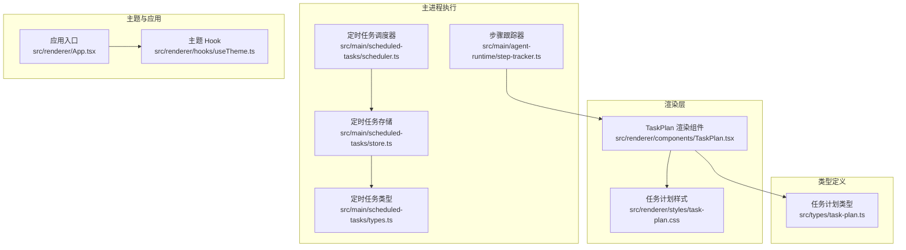
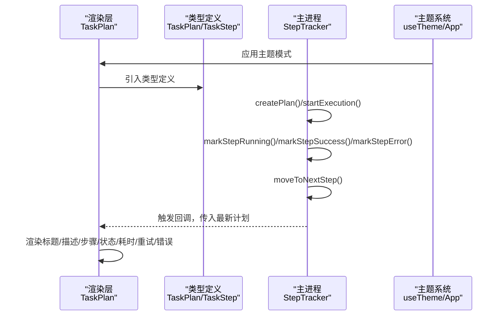
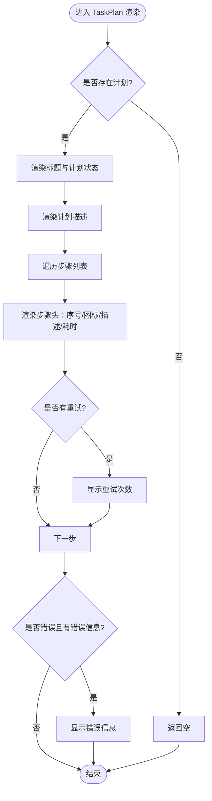
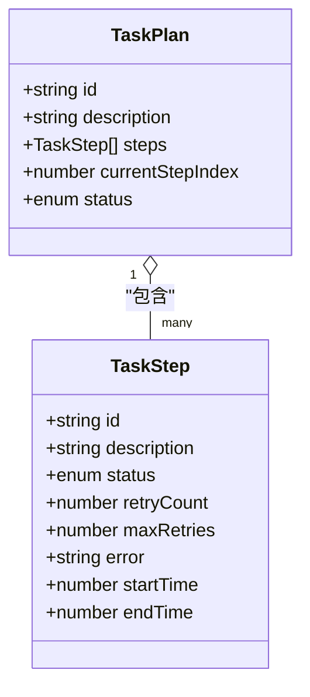
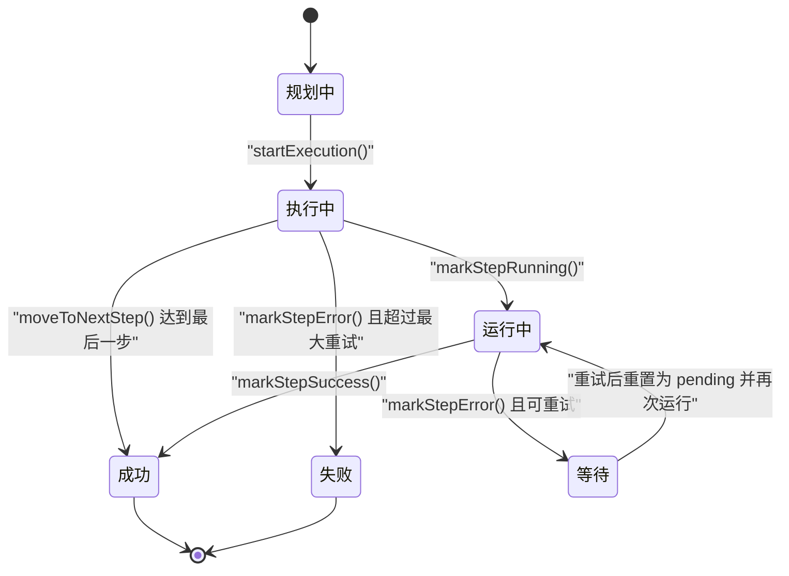
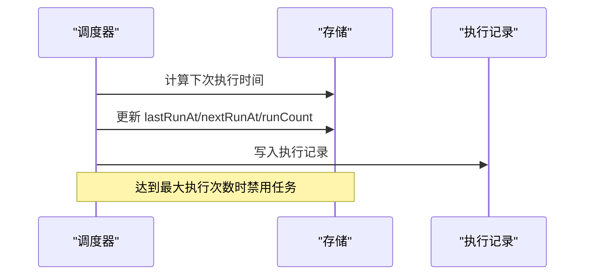
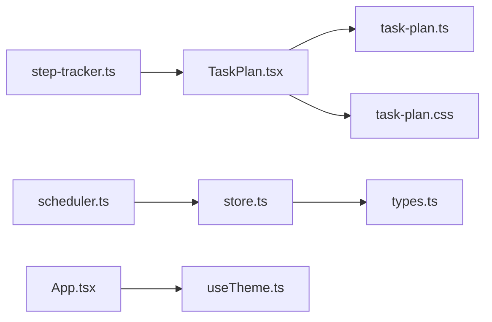

# 任务计划组件

<cite>
**本文引用的文件**
- [TaskPlan.tsx](file://src/renderer/components/TaskPlan.tsx)
- [task-plan.css](file://src/renderer/styles/task-plan.css)
- [task-plan.ts](file://src/types/task-plan.ts)
- [step-tracker.ts](file://src/main/agent-runtime/step-tracker.ts)
- [scheduler.ts](file://src/main/scheduled-tasks/scheduler.ts)
- [store.ts](file://src/main/scheduled-tasks/store.ts)
- [types.ts](file://src/main/scheduled-tasks/types.ts)
- [useTheme.ts](file://src/renderer/hooks/useTheme.ts)
- [App.tsx](file://src/renderer/App.tsx)
</cite>

## 目录
1. [简介](#简介)
2. [项目结构](#项目结构)
3. [核心组件](#核心组件)
4. [架构总览](#架构总览)
5. [详细组件分析](#详细组件分析)
6. [依赖分析](#依赖分析)
7. [性能考虑](#性能考虑)
8. [故障排查指南](#故障排查指南)
9. [结论](#结论)
10. [附录](#附录)

## 简介
本文件系统性阐述 史丽慧小助理 的“任务计划”组件，聚焦于 TaskPlan 渲染组件与其背后的状态机与执行流程，涵盖以下关键主题：
- 任务分解与层级关系：如何将复杂任务拆解为有序子步骤，并在 UI 中清晰呈现。
- 执行顺序与状态流转：从规划、执行、成功、失败的完整生命周期。
- 并行与串行：当前实现为串行顺序执行，后续可扩展为并行或混合模式。
- 实时状态更新：基于状态机的增量更新与 UI 即时反馈。
- 交互能力：任务详情查看、状态修改与执行控制（当前以串行为主，未来可扩展）。
- 配置与样式：组件配置项、CSS 类名体系与主题支持。
- 设计原则与体验优化：信息层次、视觉反馈、可读性与无障碍。

## 项目结构
与任务计划相关的核心文件分布如下：
- 渲染层：TaskPlan 渲染组件与样式文件
- 类型定义：任务计划与步骤的数据模型
- 执行状态机：主进程中的步骤跟踪器
- 定时任务：与“任务计划”概念互补的定时任务模块（可复用其调度与持久化能力）

图表来源
- [TaskPlan.tsx:1-106](file://src/renderer/components/TaskPlan.tsx#L1-L106)
- [task-plan.css:1-150](file://src/renderer/styles/task-plan.css#L1-L150)
- [task-plan.ts:1-23](file://src/types/task-plan.ts#L1-L23)
- [step-tracker.ts:1-199](file://src/main/agent-runtime/step-tracker.ts#L1-L199)
- [scheduler.ts:195-225](file://src/main/scheduled-tasks/scheduler.ts#L195-L225)
- [store.ts:1-364](file://src/main/scheduled-tasks/store.ts#L1-L364)
- [types.ts:1-86](file://src/main/scheduled-tasks/types.ts#L1-L86)
- [useTheme.ts:1-64](file://src/renderer/hooks/useTheme.ts#L1-L64)
- [App.tsx:1-200](file://src/renderer/App.tsx#L1-L200)

章节来源
- [TaskPlan.tsx:1-106](file://src/renderer/components/TaskPlan.tsx#L1-L106)
- [task-plan.css:1-150](file://src/renderer/styles/task-plan.css#L1-L150)
- [task-plan.ts:1-23](file://src/types/task-plan.ts#L1-L23)
- [step-tracker.ts:1-199](file://src/main/agent-runtime/step-tracker.ts#L1-L199)
- [scheduler.ts:195-225](file://src/main/scheduled-tasks/scheduler.ts#L195-L225)
- [store.ts:1-364](file://src/main/scheduled-tasks/store.ts#L1-L364)
- [types.ts:1-86](file://src/main/scheduled-tasks/types.ts#L1-L86)
- [useTheme.ts:1-64](file://src/renderer/hooks/useTheme.ts#L1-L64)
- [App.tsx:1-200](file://src/renderer/App.tsx#L1-L200)

## 核心组件
- 渲染组件：TaskPlan 渲染组件负责接收任务计划对象并将其可视化为带状态的步骤列表，包含标题、描述、步骤序号、状态图标、耗时、重试次数与错误信息等。
- 类型定义：TaskPlan 与 TaskStep 描述了计划的结构、状态枚举与时间戳字段；StepTracker 在主进程中维护这些状态并提供状态变更方法。
- 样式体系：task-plan.css 通过语义化的类名组织布局与状态高亮，支持主题切换下的视觉一致性。
- 主题支持：useTheme 提供浅色/深色/自动模式，App 将主题应用到根节点，影响所有组件的配色与对比度。

章节来源
- [TaskPlan.tsx:12-105](file://src/renderer/components/TaskPlan.tsx#L12-L105)
- [task-plan.ts:5-22](file://src/types/task-plan.ts#L5-L22)
- [task-plan.css:5-150](file://src/renderer/styles/task-plan.css#L5-L150)
- [useTheme.ts:22-43](file://src/renderer/hooks/useTheme.ts#L22-L43)
- [App.tsx:18-27](file://src/renderer/App.tsx#L18-L27)

## 架构总览
任务计划的运行链路由“主进程状态机 + 渲染层展示”构成：
- 主进程：StepTracker 负责创建计划、启动执行、推进步骤、标记成功/失败与重试、更新计划状态。
- 渲染层：TaskPlan 接收计划对象，按状态渲染步骤列表，显示耗时、重试与错误信息。
- 主题系统：useTheme 控制主题模式，App 将模式应用到根节点，影响样式变量。

图表来源
- [TaskPlan.tsx:12-105](file://src/renderer/components/TaskPlan.tsx#L12-L105)
- [task-plan.ts:5-22](file://src/types/task-plan.ts#L5-L22)
- [step-tracker.ts:48-197](file://src/main/agent-runtime/step-tracker.ts#L48-L197)
- [useTheme.ts:22-43](file://src/renderer/hooks/useTheme.ts#L22-L43)
- [App.tsx:18-27](file://src/renderer/App.tsx#L18-L27)

## 详细组件分析

### 渲染组件：TaskPlan
- 功能要点
  - 接收计划对象，若为空则不渲染。
  - 格式化耗时：毫秒与秒两种单位自动切换。
  - 状态图标映射：等待、运行中、成功、失败。
  - 计划状态标签：规划中、执行中、已完成、失败。
  - 步骤渲染：序号、状态图标、描述、耗时、重试次数、错误信息。
  - 当前步骤高亮：通过类名标识当前步骤，增强导航感。

图表来源
- [TaskPlan.tsx:12-105](file://src/renderer/components/TaskPlan.tsx#L12-L105)

章节来源
- [TaskPlan.tsx:12-105](file://src/renderer/components/TaskPlan.tsx#L12-L105)
- [task-plan.css:53-150](file://src/renderer/styles/task-plan.css#L53-L150)

### 数据模型：TaskPlan 与 TaskStep
- TaskPlan 字段
  - id、description、steps、currentStepIndex、status
- TaskStep 字段
  - id、description、status、retryCount、maxRetries、error、startTime、endTime
- 状态枚举
  - 计划：planning、executing、completed、failed
  - 步骤：pending、running、success、error

图表来源
- [task-plan.ts:5-22](file://src/types/task-plan.ts#L5-L22)

章节来源
- [task-plan.ts:5-22](file://src/types/task-plan.ts#L5-L22)

### 执行状态机：StepTracker（主进程）
- 职责
  - 创建计划、启动执行、推进步骤、标记成功/失败与重试、更新计划状态、清理与查询。
- 关键方法
  - createPlan：生成唯一计划与步骤 ID，初始化状态为 planning。
  - startExecution：将计划状态置为 executing。
  - markStepRunning/markStepSuccess/markStepError：更新当前步骤状态、时间戳与错误信息；错误时递增重试计数并判定是否可重试。
  - moveToNextStep：推进 currentStepIndex，若超出步骤数则置计划状态为 completed。
  - hasActivePlan/clearPlan/getCurrentPlan：查询与清理当前计划。
  - setOnPlanUpdate：订阅计划更新回调，驱动渲染层刷新。

图表来源
- [step-tracker.ts:48-197](file://src/main/agent-runtime/step-tracker.ts#L48-L197)

章节来源
- [step-tracker.ts:34-199](file://src/main/agent-runtime/step-tracker.ts#L34-L199)

### 定时任务模块（与任务计划的关系）
- 定时任务存储与调度：提供任务的持久化、执行历史记录、下次执行时间计算与最大执行次数控制。
- 与任务计划的协同：定时任务可触发业务流程，流程内部使用 StepTracker 管理步骤状态，TaskPlan 渲染步骤列表；二者在职责上互补。

图表来源
- [scheduler.ts:195-225](file://src/main/scheduled-tasks/scheduler.ts#L195-L225)
- [store.ts:133-230](file://src/main/scheduled-tasks/store.ts#L133-L230)

章节来源
- [scheduler.ts:195-225](file://src/main/scheduled-tasks/scheduler.ts#L195-L225)
- [store.ts:133-230](file://src/main/scheduled-tasks/store.ts#L133-L230)
- [types.ts:8-55](file://src/main/scheduled-tasks/types.ts#L8-L55)

### 样式与主题
- 样式组织
  - 任务计划容器、头部、描述、步骤列表、步骤项、当前步骤高亮、状态色块、动画脉冲、重试与错误信息等。
- 主题支持
  - useTheme 提供 light/dark/auto 三种模式，App 将模式写入根节点属性，影响 CSS 变量与配色。
  - 任务计划状态色块随主题变化而适配，保证在不同模式下的可读性。

章节来源
- [task-plan.css:5-150](file://src/renderer/styles/task-plan.css#L5-L150)
- [useTheme.ts:22-43](file://src/renderer/hooks/useTheme.ts#L22-L43)
- [App.tsx:18-27](file://src/renderer/App.tsx#L18-L27)

## 依赖分析
- 组件耦合
  - TaskPlan 依赖类型定义与样式；通过回调或状态更新与主进程解耦。
  - StepTracker 独立于 UI，仅通过回调暴露状态变更。
- 外部依赖
  - 定时任务模块与任务计划模块在职责上互补，可复用其调度与持久化能力。

图表来源
- [TaskPlan.tsx:1-106](file://src/renderer/components/TaskPlan.tsx#L1-L106)
- [task-plan.ts:1-23](file://src/types/task-plan.ts#L1-L23)
- [task-plan.css:1-150](file://src/renderer/styles/task-plan.css#L1-L150)
- [step-tracker.ts:1-199](file://src/main/agent-runtime/step-tracker.ts#L1-L199)
- [scheduler.ts:195-225](file://src/main/scheduled-tasks/scheduler.ts#L195-L225)
- [store.ts:1-364](file://src/main/scheduled-tasks/store.ts#L1-L364)
- [types.ts:1-86](file://src/main/scheduled-tasks/types.ts#L1-L86)
- [useTheme.ts:1-64](file://src/renderer/hooks/useTheme.ts#L1-L64)
- [App.tsx:1-200](file://src/renderer/App.tsx#L1-L200)

## 性能考虑
- 渲染层面
  - 步骤列表采用简单循环渲染，建议在步骤数量较多时引入虚拟滚动或分页。
  - 状态更新通过回调触发，避免不必要的重渲染。
- 主进程层面
  - StepTracker 仅维护当前计划对象，内存占用低；注意在完成或失败后及时清理。
  - 若扩展为并行执行，需引入并发控制与资源上限，防止过度竞争。
- 样式层面
  - 使用 CSS 动画（脉冲）时注意在低端设备上的性能表现，必要时提供关闭选项。

## 故障排查指南
- 问题：任务计划不显示
  - 检查传入的计划对象是否为 null 或未初始化。
  - 确认渲染层已正确引入类型与样式。
- 问题：状态不更新
  - 确认主进程 StepTracker 已调用 startExecution、markStepRunning、markStepSuccess、markStepError、moveToNextStep 等方法。
  - 确认 setOnPlanUpdate 回调已正确绑定，且渲染层监听到更新。
- 问题：主题不生效
  - 检查 useTheme 是否正确应用到根节点，App 是否在挂载时设置主题。
- 问题：错误信息未显示
  - 确认步骤状态为 error 且包含错误文本；检查渲染层的错误信息条件分支。

章节来源
- [TaskPlan.tsx:12-105](file://src/renderer/components/TaskPlan.tsx#L12-L105)
- [step-tracker.ts:41-43](file://src/main/agent-runtime/step-tracker.ts#L41-L43)
- [useTheme.ts:22-43](file://src/renderer/hooks/useTheme.ts#L22-L43)
- [App.tsx:18-27](file://src/renderer/App.tsx#L18-L27)

## 结论
- TaskPlan 渲染组件提供了清晰、直观的任务计划可视化，结合 StepTracker 的状态机，实现了从规划到执行再到完成/失败的完整闭环。
- 当前实现为串行执行，具备良好的可读性与可维护性；未来可扩展为并行或混合模式，同时保持 UI 的一致体验。
- 主题系统与样式体系完善，便于在不同环境下提供一致的视觉反馈与无障碍体验。

## 附录
- 交互与控制建议（扩展方向）
  - 支持暂停/恢复：在 StepTracker 中增加暂停状态与恢复逻辑。
  - 支持跳过步骤：允许用户跳过当前步骤并推进到下一步。
  - 支持重试控制：在 UI 中提供“立即重试”按钮，调用 StepTracker 的重试逻辑。
  - 支持并行执行：引入任务图（DAG），按依赖关系调度多个步骤并行执行。
- 配置与样式定制
  - 组件配置项：计划对象、是否显示耗时、是否显示重试、是否显示错误等可通过 props 扩展。
  - 样式定制：通过 CSS 变量与类名体系，支持主题切换与品牌化定制。
- 主题支持
  - 使用 useTheme 管理主题模式，App 将模式应用到根节点，影响所有组件的配色与对比度。