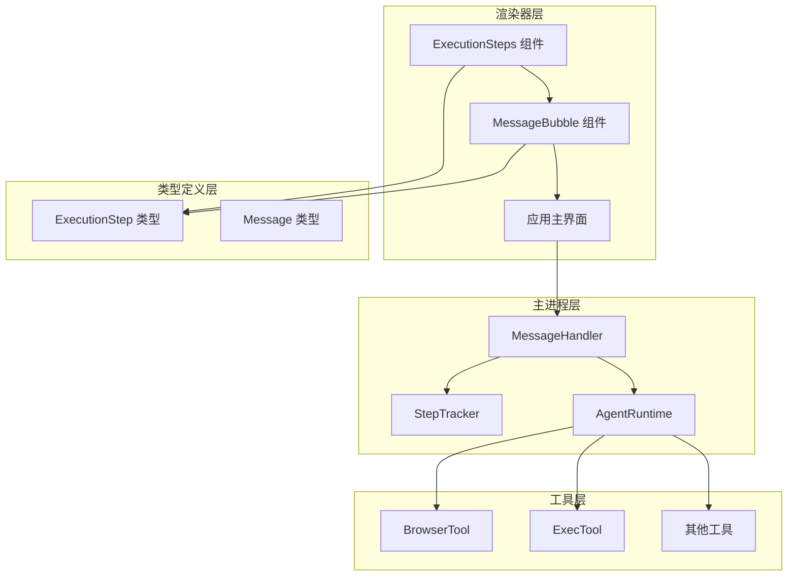
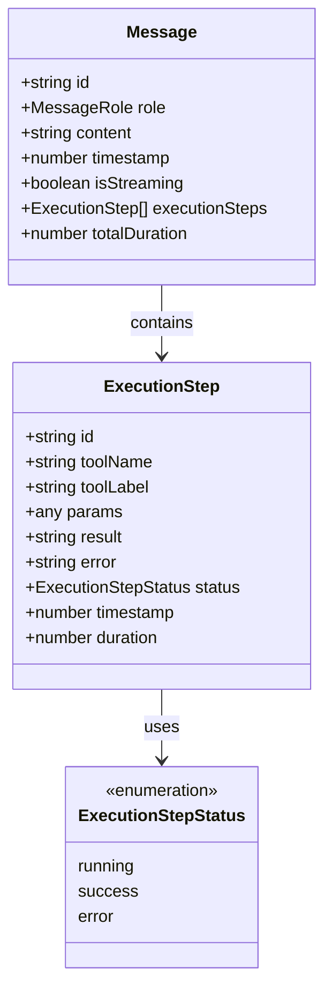
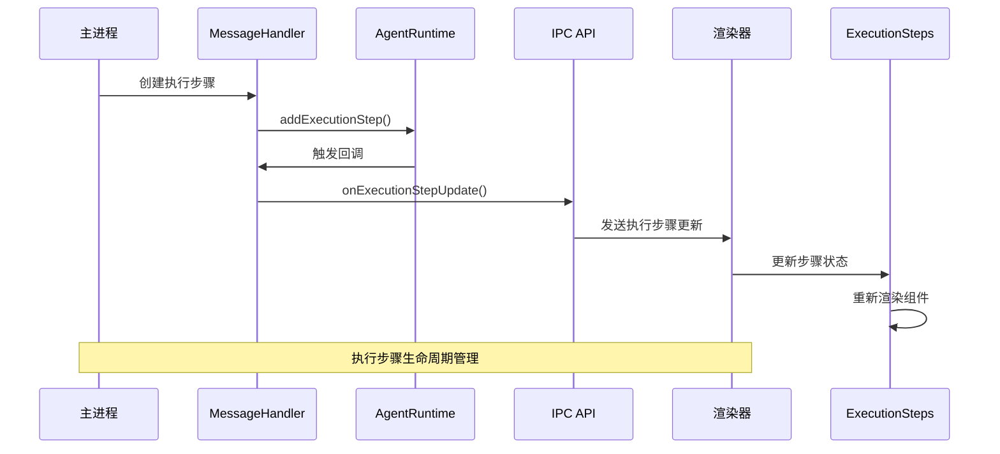
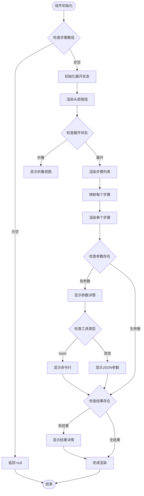
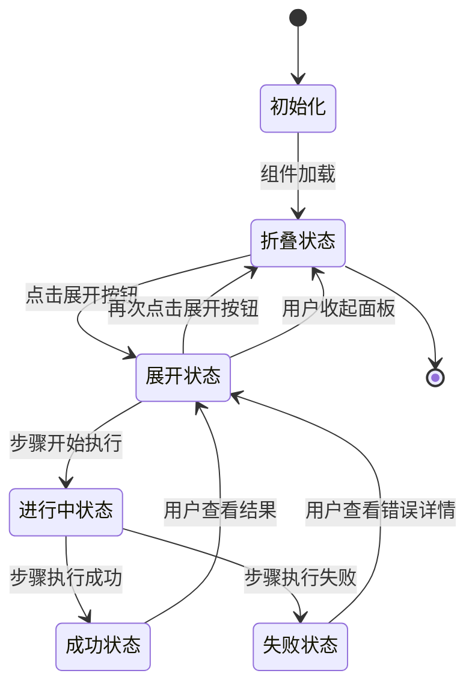
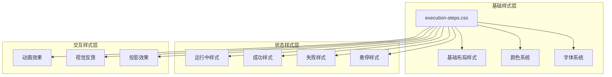
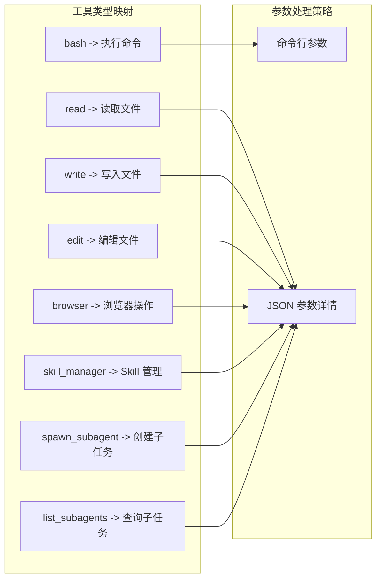
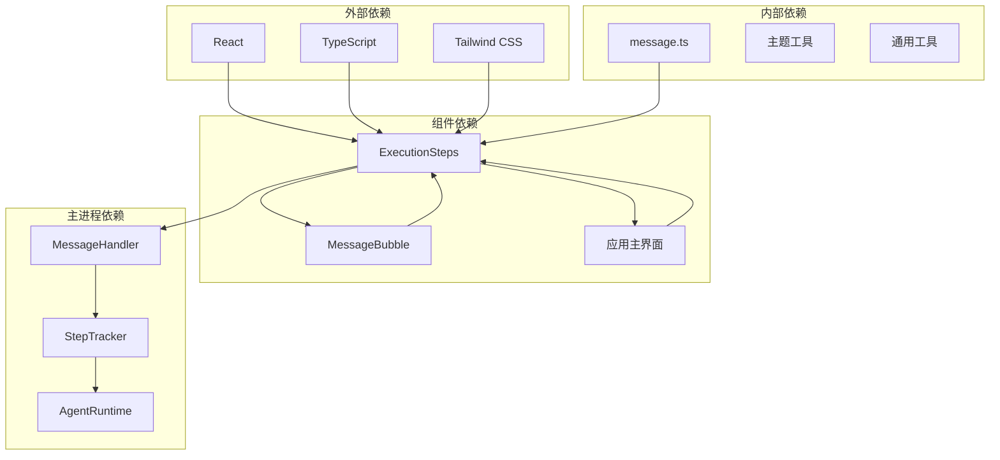

# 执行步骤组件

<cite>
**本文档引用的文件**
- [ExecutionSteps.tsx](file://src/renderer/components/ExecutionSteps.tsx)
- [execution-steps.css](file://src/renderer/styles/execution-steps.css)
- [message.ts](file://src/types/message.ts)
- [message-handler.ts](file://src/main/agent-runtime/message-handler.ts)
- [App.tsx](file://src/renderer/App.tsx)
- [AppWeb.tsx](file://src/renderer/AppWeb.tsx)
- [MessageBubble.tsx](file://src/renderer/components/MessageBubble.tsx)
- [step-tracker.ts](file://src/main/agent-runtime/step-tracker.ts)
- [exec-tool.ts](file://src/main/tools/exec-tool.ts)
- [browser-tool.ts](file://src/main/tools/browser-tool.ts)
</cite>

## 目录
1. [简介](#简介)
2. [项目结构](#项目结构)
3. [核心组件](#核心组件)
4. [架构概览](#架构概览)
5. [详细组件分析](#详细组件分析)
6. [依赖关系分析](#依赖关系分析)
7. [性能考虑](#性能考虑)
8. [故障排除指南](#故障排除指南)
9. [结论](#结论)

## 简介

执行步骤组件（ExecutionSteps）是 DeepBot 应用中的核心可视化组件，专门用于展示 AI Agent 在执行任务过程中调用的各种工具步骤。该组件提供了直观的执行过程可视化，包括步骤状态跟踪、进度指示、参数详情查看和结果输出展示等功能。

组件设计的核心理念是通过清晰的视觉层次和状态标识，让用户能够实时了解 Agent 的执行状态，包括正在进行中的步骤、已完成的步骤以及失败的步骤。同时，组件支持步骤详情的展开查看，便于用户深入了解每个工具调用的具体参数和执行结果。

## 项目结构

执行步骤组件位于渲染器（renderer）层，与主进程（main）的 Agent 运行时紧密协作。整体架构采用分层设计，确保了组件的可维护性和扩展性。

**图表来源**
- [ExecutionSteps.tsx:1-122](file://src/renderer/components/ExecutionSteps.tsx#L1-L122)
- [message.ts:15-25](file://src/types/message.ts#L15-L25)
- [message-handler.ts:63-82](file://src/main/agent-runtime/message-handler.ts#L63-L82)

**章节来源**
- [ExecutionSteps.tsx:1-122](file://src/renderer/components/ExecutionSteps.tsx#L1-L122)
- [message.ts:15-25](file://src/types/message.ts#L15-L25)

## 核心组件

### ExecutionStep 数据模型

执行步骤组件基于标准化的数据模型，确保了组件的灵活性和可扩展性。数据模型定义了步骤的基本属性、状态管理和时间追踪功能。

**图表来源**
- [message.ts:15-25](file://src/types/message.ts#L15-L25)
- [message.ts:49-70](file://src/types/message.ts#L49-L70)

组件支持以下核心功能：
- **步骤状态管理**：实时跟踪步骤的执行状态（进行中、已完成、失败）
- **参数详情展示**：支持复杂参数的 JSON 格式化显示
- **结果输出查看**：提供结果内容的展开/折叠查看
- **时长统计**：自动计算和显示步骤执行时长
- **工具标签映射**：将技术性的工具名称转换为用户友好的显示名称

**章节来源**
- [message.ts:15-25](file://src/types/message.ts#L15-L25)
- [ExecutionSteps.tsx:27-39](file://src/renderer/components/ExecutionSteps.tsx#L27-L39)

## 架构概览

执行步骤组件的架构采用了事件驱动的设计模式，通过主进程和渲染器之间的消息传递实现数据同步。

**图表来源**
- [message-handler.ts:63-82](file://src/main/agent-runtime/message-handler.ts#L63-L82)
- [App.tsx:511-575](file://src/renderer/App.tsx#L511-L575)

架构特点：
- **双向数据流**：主进程负责步骤状态变更，渲染器负责状态展示
- **事件驱动**：通过 IPC 事件实现组件间的解耦
- **状态一致性**：确保主进程和渲染器的状态保持同步
- **增量更新**：支持部分更新，避免不必要的完整重渲染

**章节来源**
- [message-handler.ts:47-82](file://src/main/agent-runtime/message-handler.ts#L47-L82)
- [App.tsx:511-575](file://src/renderer/App.tsx#L511-L575)

## 详细组件分析

### 组件结构设计

ExecutionSteps 组件采用简洁而功能丰富的设计，通过合理的布局和状态管理实现了良好的用户体验。

**图表来源**
- [ExecutionSteps.tsx:12-121](file://src/renderer/components/ExecutionSteps.tsx#L12-L121)

### 状态管理系统

组件实现了完整的状态管理机制，支持步骤状态的动态更新和视觉反馈。

**图表来源**
- [ExecutionSteps.tsx:58-70](file://src/renderer/components/ExecutionSteps.tsx#L58-L70)

状态特性：
- **进行中状态**：蓝色渐变背景，显示旋转动画
- **成功状态**：绿色渐变背景，显示对勾图标
- **失败状态**：红色渐变背景，显示叉号图标
- **动态时长计算**：根据状态变化自动计算执行时长

**章节来源**
- [ExecutionSteps.tsx:58-121](file://src/renderer/components/ExecutionSteps.tsx#L58-L121)

### 样式系统设计

组件采用了模块化的样式系统，支持主题适配和响应式设计。

**图表来源**
- [execution-steps.css:5-296](file://src/renderer/styles/execution-steps.css#L5-L296)

样式特点：
- **渐变背景**：每种状态都有独特的渐变背景
- **边框标识**：左侧边框颜色区分步骤状态
- **阴影效果**：提供层次感和深度感
- **动画过渡**：平滑的状态切换和展开/折叠动画
- **响应式设计**：适配不同屏幕尺寸

**章节来源**
- [execution-steps.css:5-296](file://src/renderer/styles/execution-steps.css#L5-L296)

### 工具集成机制

组件支持多种工具类型的集成，通过工具名称映射提供用户友好的显示效果。

**图表来源**
- [ExecutionSteps.tsx:27-39](file://src/renderer/components/ExecutionSteps.tsx#L27-L39)

工具特性：
- **bash 工具**：直接显示命令行内容，使用等宽字体
- **其他工具**：显示 JSON 格式的参数详情
- **智能截断**：长结果内容自动截断显示
- **错误高亮**：失败状态下的错误信息高亮显示

**章节来源**
- [ExecutionSteps.tsx:73-114](file://src/renderer/components/ExecutionSteps.tsx#L73-L114)

## 依赖关系分析

执行步骤组件的依赖关系体现了清晰的分层架构和职责分离。

**图表来源**
- [ExecutionSteps.tsx:5-6](file://src/renderer/components/ExecutionSteps.tsx#L5-L6)
- [message-handler.ts:22](file://src/main/agent-runtime/message-handler.ts#L22)

依赖特点：
- **低耦合设计**：组件间通过接口通信，减少直接依赖
- **类型安全**：完整的 TypeScript 类型定义确保编译时安全
- **主题适配**：支持动态主题切换和自定义样式
- **性能优化**：避免不必要的重渲染和内存泄漏

**章节来源**
- [ExecutionSteps.tsx:5-6](file://src/renderer/components/ExecutionSteps.tsx#L5-L6)
- [message-handler.ts:22](file://src/main/agent-runtime/message-handler.ts#L22)

## 性能考虑

执行步骤组件在设计时充分考虑了性能优化，确保在大量步骤数据下的流畅体验。

### 渲染优化策略

组件采用了多项渲染优化技术：

1. **条件渲染**：空步骤数组时直接返回 null，避免不必要的 DOM 创建
2. **状态缓存**：使用 useState 缓存展开状态，减少重复计算
3. **格式化函数**：独立的格式化函数避免在渲染过程中创建新函数
4. **工具标签映射**：预定义的映射表避免运行时查找开销

### 内存管理

组件实现了有效的内存管理机制：

- **事件清理**：组件卸载时自动清理事件监听器
- **状态重置**：组件销毁时重置所有状态变量
- **引用优化**：避免创建不必要的对象副本

### 数据处理优化

- **增量更新**：只更新发生变化的步骤，避免全量重渲染
- **防抖处理**：频繁的状态更新通过防抖机制合并
- **懒加载**：步骤详情采用懒加载，仅在需要时渲染

**章节来源**
- [ExecutionSteps.tsx:15-17](file://src/renderer/components/ExecutionSteps.tsx#L15-L17)
- [MessageBubble.tsx:178-216](file://src/renderer/components/MessageBubble.tsx#L178-L216)

## 故障排除指南

### 常见问题及解决方案

#### 步骤状态不更新

**问题现象**：执行步骤状态变化但界面未反映

**可能原因**：
1. IPC 事件未正确接收
2. 状态更新回调未设置
3. 组件未正确订阅状态变化

**解决方案**：
1. 检查主进程的执行步骤回调设置
2. 验证 IPC 事件的正确传输
3. 确认组件的订阅机制正常工作

#### 样式显示异常

**问题现象**：组件样式错乱或显示不正确

**可能原因**：
1. CSS 样式冲突
2. 主题配置错误
3. 动画效果异常

**解决方案**：
1. 检查样式文件的正确加载
2. 验证主题配置的完整性
3. 禁用动画效果进行调试

#### 性能问题

**问题现象**：大量步骤时界面卡顿

**可能原因**：
1. 渲染节点过多
2. 频繁的状态更新
3. 大量的 DOM 操作

**解决方案**：
1. 实施虚拟滚动
2. 优化状态更新频率
3. 减少不必要的 DOM 操作

**章节来源**
- [App.tsx:511-575](file://src/renderer/App.tsx#L511-L575)
- [execution-steps.css:269-296](file://src/renderer/styles/execution-steps.css#L269-L296)

## 结论

执行步骤组件作为 DeepBot 的核心可视化组件，成功实现了以下目标：

### 设计成就

1. **直观的可视化展示**：通过颜色编码和图标系统，用户可以快速理解执行状态
2. **完整的状态管理**：支持步骤的全生命周期管理，从创建到完成
3. **灵活的工具集成**：支持多种工具类型的参数展示和结果查看
4. **优秀的性能表现**：通过多项优化技术确保在大数据量下的流畅体验

### 技术亮点

- **事件驱动架构**：通过 IPC 事件实现组件间的解耦和同步
- **模块化样式系统**：支持主题适配和自定义样式
- **智能状态处理**：自动计算执行时长和状态转换
- **响应式设计**：适配不同屏幕尺寸和设备类型

### 未来发展方向

1. **增强的交互功能**：添加步骤详情的高级过滤和搜索功能
2. **性能进一步优化**：实施虚拟滚动和更精细的状态缓存
3. **扩展的工具支持**：增加更多工具类型的专用展示模板
4. **更好的错误处理**：提供更详细的错误诊断和恢复机制

执行步骤组件不仅满足了当前的功能需求，还为未来的功能扩展和技术演进奠定了坚实的基础。其设计原则和实现模式可以作为其他类似组件开发的参考模板。