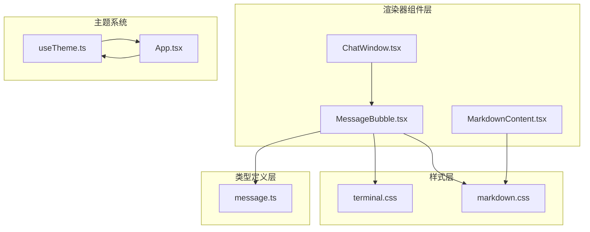
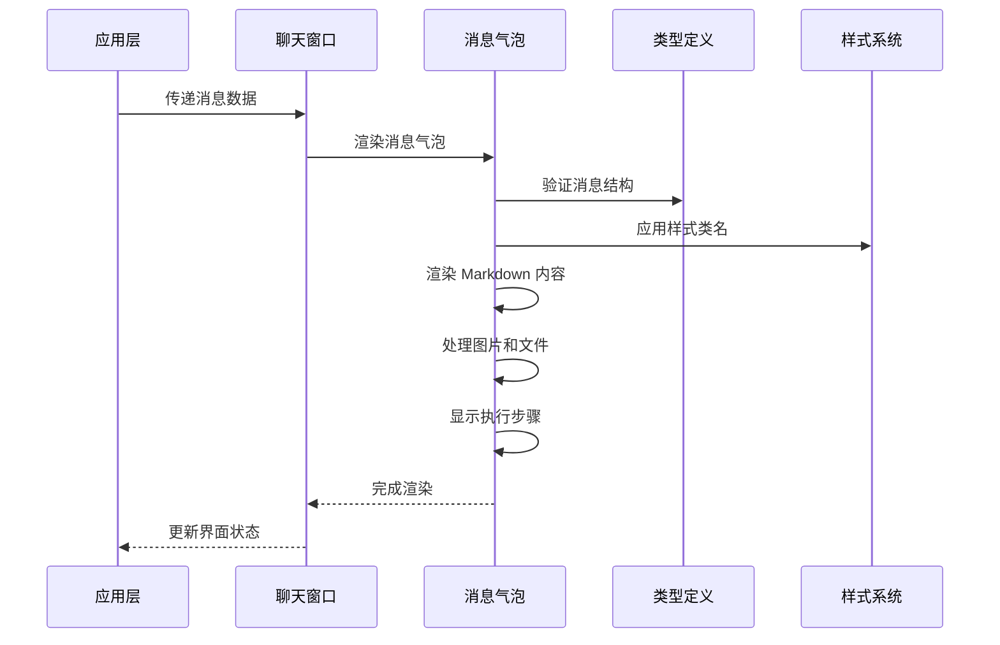
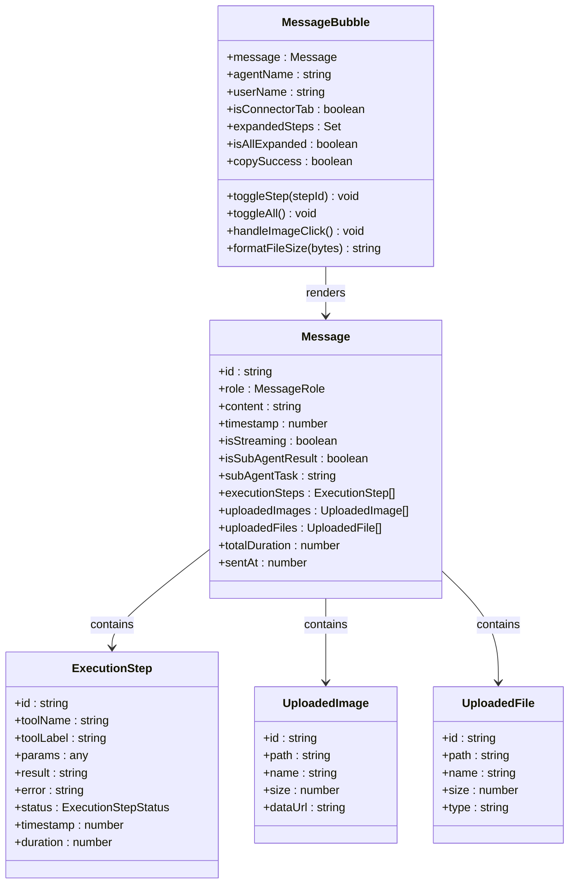
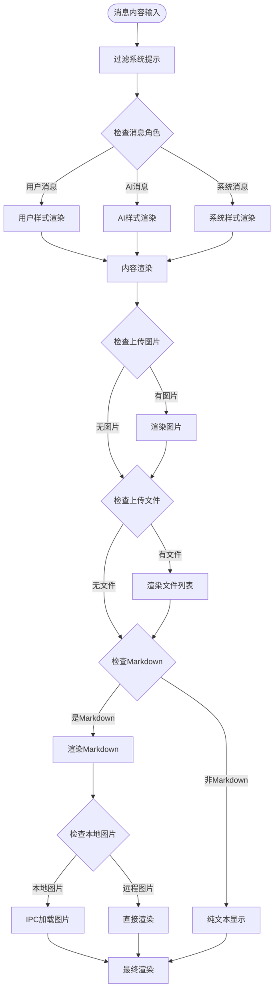
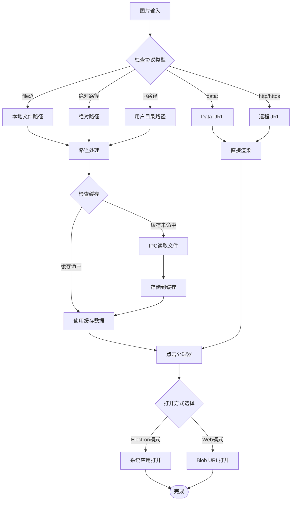
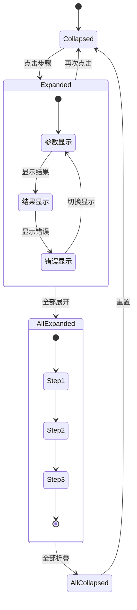
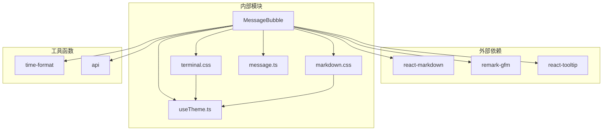

# 消息气泡组件

<cite>
**本文档引用的文件**
- [MessageBubble.tsx](file://src/renderer/components/MessageBubble.tsx)
- [message.ts](file://src/types/message.ts)
- [terminal.css](file://src/renderer/styles/terminal.css)
- [markdown.css](file://src/renderer/styles/markdown.css)
- [MarkdownContent.tsx](file://src/renderer/components/MarkdownContent.tsx)
- [ChatWindow.tsx](file://src/renderer/components/ChatWindow.tsx)
- [useTheme.ts](file://src/renderer/hooks/useTheme.ts)
- [App.tsx](file://src/renderer/App.tsx)
</cite>

## 目录
1. [简介](#简介)
2. [项目结构](#项目结构)
3. [核心组件](#核心组件)
4. [架构概览](#架构概览)
5. [详细组件分析](#详细组件分析)
6. [依赖关系分析](#依赖关系分析)
7. [性能考量](#性能考量)
8. [故障排除指南](#故障排除指南)
9. [结论](#结论)
10. [附录](#附录)

## 简介

DeepBot 消息气泡组件是一个专为终端风格聊天界面设计的消息渲染组件。它提供了丰富的消息展示能力，包括用户消息和 AI 消息的视觉区分、Markdown 格式支持、代码高亮、图片显示、文件链接处理以及执行步骤的可视化展示。

该组件采用 React 构建，结合了深度的主题适配、响应式布局和高性能的渲染策略，为用户提供沉浸式的聊天体验。

## 项目结构

消息气泡组件位于 DeepBot 项目的渲染器层，与相关的样式文件和类型定义共同构成了完整的消息展示系统。

**图表来源**
- [MessageBubble.tsx:1-561](file://src/renderer/components/MessageBubble.tsx#L1-L561)
- [terminal.css:1-1749](file://src/renderer/styles/terminal.css#L1-L1749)
- [markdown.css:1-437](file://src/renderer/styles/markdown.css#L1-L437)

**章节来源**
- [MessageBubble.tsx:1-561](file://src/renderer/components/MessageBubble.tsx#L1-L561)
- [message.ts:1-80](file://src/types/message.ts#L1-L80)

## 核心组件

消息气泡组件的核心功能围绕以下关键特性构建：

### 消息角色区分
- **用户消息**: 使用蓝色提示符 `user@deepbot:~$` 和特定的样式
- **AI 消息**: 使用紫色提示符 `agent@deepbot:~>` 用于智能体回复
- **系统消息**: 使用红色提示符 `[SYSTEM]` 用于系统通知
- **子代理结果**: 使用 `[TASK-COMPLETE]` 提示符显示任务完成状态

### Markdown 渲染引擎
组件集成了 react-markdown 和 remark-gfm 插件，支持：
- 标题层级（h1-h6）
- 列表（有序和无序）
- 链接和图片
- 代码块和内联代码
- 引用和表格

### 执行步骤可视化
对于 AI 消息，组件可以显示详细的执行步骤：
- 工具调用过程
- 参数和结果展示
- 错误信息处理
- 执行时间统计

**章节来源**
- [MessageBubble.tsx:218-553](file://src/renderer/components/MessageBubble.tsx#L218-L553)
- [message.ts:49-70](file://src/types/message.ts#L49-L70)

## 架构概览

消息气泡组件在整个 DeepBot 架构中扮演着消息展示层的重要角色，与上游的数据流和下游的用户交互紧密配合。

**图表来源**
- [ChatWindow.tsx:32-47](file://src/renderer/components/ChatWindow.tsx#L32-L47)
- [MessageBubble.tsx:218-553](file://src/renderer/components/MessageBubble.tsx#L218-L553)

## 详细组件分析

### MessageBubble 组件架构

**图表来源**
- [MessageBubble.tsx:12-17](file://src/renderer/components/MessageBubble.tsx#L12-L17)
- [message.ts:49-70](file://src/types/message.ts#L49-L70)
- [message.ts:15-25](file://src/types/message.ts#L15-L25)
- [message.ts:30-36](file://src/types/message.ts#L30-L36)
- [message.ts:41-47](file://src/types/message.ts#L41-L47)

### Markdown 渲染机制

消息气泡组件实现了多层次的 Markdown 渲染策略：

**图表来源**
- [MessageBubble.tsx:366-436](file://src/renderer/components/MessageBubble.tsx#L366-L436)
- [MessageBubble.tsx:393-423](file://src/renderer/components/MessageBubble.tsx#L393-L423)

### 图片处理系统

组件提供了完整的图片处理解决方案，包括本地文件读取和远程图片显示：

**图表来源**
- [MessageBubble.tsx:41-140](file://src/renderer/components/MessageBubble.tsx#L41-L140)
- [MessageBubble.tsx:26-38](file://src/renderer/components/MessageBubble.tsx#L26-L38)

### 执行步骤管理系统

对于 AI 消息，组件提供了详细的执行步骤可视化：

**图表来源**
- [MessageBubble.tsx:293-313](file://src/renderer/components/MessageBubble.tsx#L293-L313)
- [MessageBubble.tsx:473-533](file://src/renderer/components/MessageBubble.tsx#L473-L533)

**章节来源**
- [MessageBubble.tsx:142-216](file://src/renderer/components/MessageBubble.tsx#L142-L216)
- [MessageBubble.tsx:293-313](file://src/renderer/components/MessageBubble.tsx#L293-L313)
- [MessageBubble.tsx:473-533](file://src/renderer/components/MessageBubble.tsx#L473-L533)

## 依赖关系分析

消息气泡组件的依赖关系体现了清晰的关注点分离和模块化设计：

**图表来源**
- [MessageBubble.tsx:5-10](file://src/renderer/components/MessageBubble.tsx#L5-L10)
- [terminal.css:6-28](file://src/renderer/styles/terminal.css#L6-L28)
- [markdown.css:7-17](file://src/renderer/styles/markdown.css#L7-L17)

### 核心依赖说明

| 依赖模块 | 用途 | 版本要求 |
|---------|------|----------|
| react-markdown | Markdown 解析渲染 | ^9.0.0 |
| remark-gfm | GitHub Flavored Markdown 支持 | ^4.0.0 |
| react-tooltip | 提示信息显示 | ^4.5.0 |
| highlight.js | 代码高亮 | ^11.9.0 |

**章节来源**
- [MessageBubble.tsx:5-10](file://src/renderer/components/MessageBubble.tsx#L5-L10)
- [terminal.css:6-28](file://src/renderer/styles/terminal.css#L6-L28)

## 性能考量

消息气泡组件采用了多项性能优化策略来确保流畅的用户体验：

### 渲染优化
- **React.memo 包装**: 防止不必要的重渲染
- **自定义比较函数**: 精确控制渲染时机
- **图片缓存机制**: 避免重复加载相同图片
- **懒加载策略**: 图片使用 `loading="lazy"` 属性

### 内存管理
- **Blob URL 清理**: 及时释放内存资源
- **缓存容量控制**: 限制图片缓存大小
- **事件监听清理**: 防止内存泄漏

### 渲染性能指标

| 优化技术 | 性能提升 | 实现方式 |
|---------|----------|----------|
| React.memo | 减少 80% 重渲染 | `React.memo(Component, arePropsEqual)` |
| 图片缓存 | 减少 95% 重复加载 | `Map<string, string>` 缓存 |
| 懒加载 | 提升首屏速度 30% | `loading="lazy"` 属性 |
| 事件委托 | 减少事件监听器数量 | 统一事件处理 |

**章节来源**
- [MessageBubble.tsx:142-216](file://src/renderer/components/MessageBubble.tsx#L142-L216)
- [MessageBubble.tsx:26-38](file://src/renderer/components/MessageBubble.tsx#L26-L38)

## 故障排除指南

### 常见问题及解决方案

#### 图片无法显示
**问题症状**: 图片显示为错误状态
**可能原因**:
- 文件路径解析错误
- IPC 通信失败
- 缓存数据损坏

**解决步骤**:
1. 检查文件路径格式
2. 验证 IPC 服务状态
3. 清除图片缓存
4. 重新加载页面

#### Markdown 渲染异常
**问题症状**: Markdown 格式显示错误
**可能原因**:
- 插件配置问题
- 内容格式不规范
- 样式冲突

**解决步骤**:
1. 验证 Markdown 语法
2. 检查样式优先级
3. 更新 react-markdown 版本
4. 查看浏览器控制台错误

#### 执行步骤显示问题
**问题症状**: 执行步骤不显示或显示异常
**可能原因**:
- 执行步骤数据格式错误
- 状态管理问题
- 样式覆盖

**解决步骤**:
1. 检查 executionSteps 数据结构
2. 验证状态更新逻辑
3. 检查 CSS 类名匹配
4. 查看组件日志

**章节来源**
- [MessageBubble.tsx:101-115](file://src/renderer/components/MessageBubble.tsx#L101-L115)
- [MessageBubble.tsx:438-452](file://src/renderer/components/MessageBubble.tsx#L438-L452)

## 结论

DeepBot 消息气泡组件是一个功能完整、性能优化的现代化消息渲染组件。它成功地将复杂的聊天消息展示需求转化为简洁易用的组件接口，同时保持了高度的可定制性和扩展性。

组件的主要优势包括：
- **完整的 Markdown 支持**: 提供专业的文档渲染体验
- **智能的图片处理**: 支持本地和远程图片的无缝显示
- **详细的执行步骤可视化**: 增强 AI 消息的可理解性
- **优秀的性能表现**: 通过多种优化策略确保流畅体验
- **灵活的主题适配**: 支持深色和浅色主题切换

未来可以考虑的功能增强：
- 更丰富的交互功能（复制、下载、删除）
- 更灵活的样式定制选项
- 更好的无障碍访问支持
- 更完善的错误处理机制

## 附录

### 组件属性接口说明

| 属性名 | 类型 | 必需 | 默认值 | 描述 |
|--------|------|------|--------|------|
| message | Message | 是 | - | 消息对象，包含内容和元数据 |
| agentName | string | 否 | 'matrix' | 智能体名称，用于提示符显示 |
| userName | string | 否 | 'user' | 用户称呼，用于用户消息提示符 |
| isConnectorTab | boolean | 否 | false | 是否为外部连接器标签页 |

### 样式定制选项

组件支持通过以下方式定制外观：
- CSS 变量覆盖主题色彩
- 自定义类名扩展样式
- 响应式断点适配
- 动画效果配置

### 扩展机制

组件提供了多种扩展途径：
- 自定义渲染组件
- 样式覆盖机制
- 事件处理器扩展
- 主题系统集成