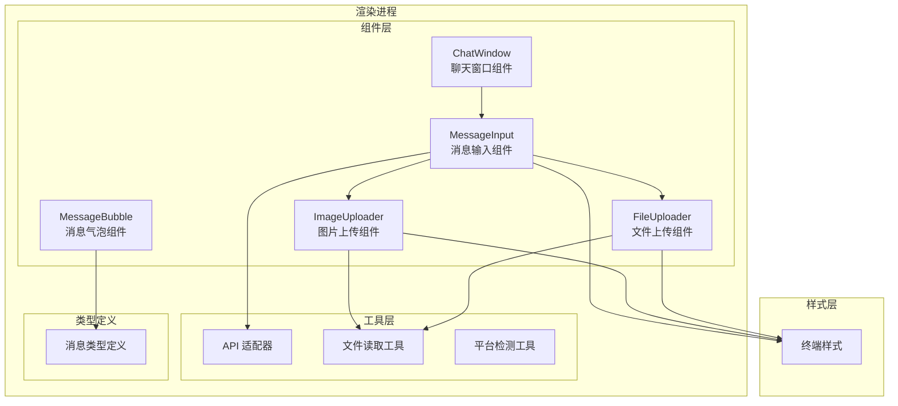
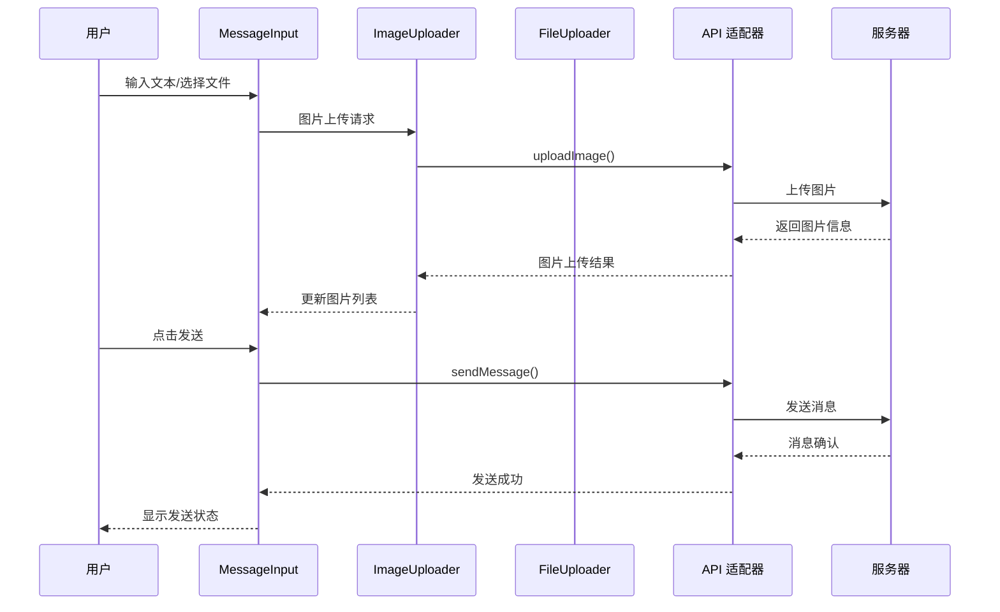
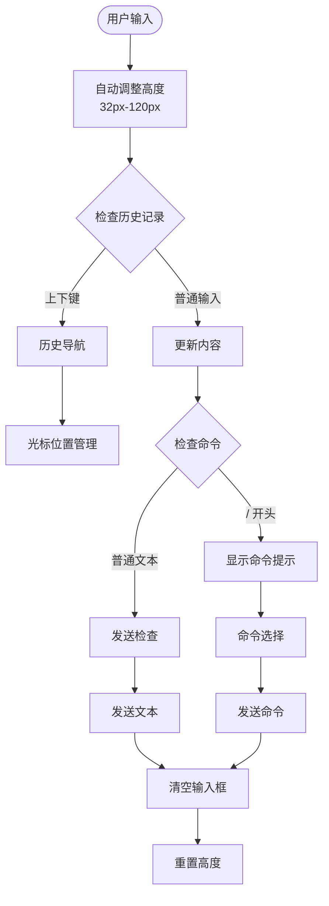
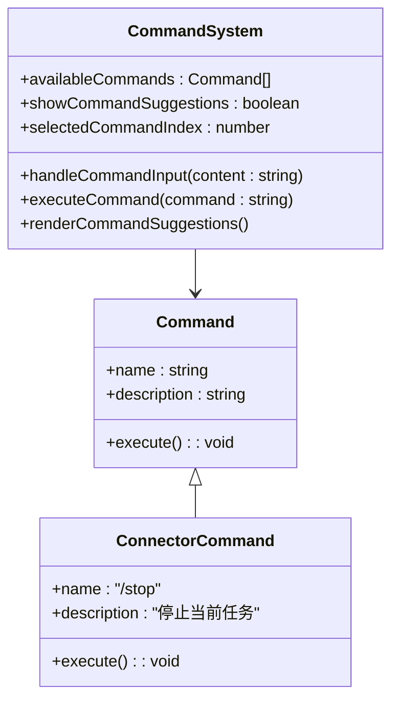
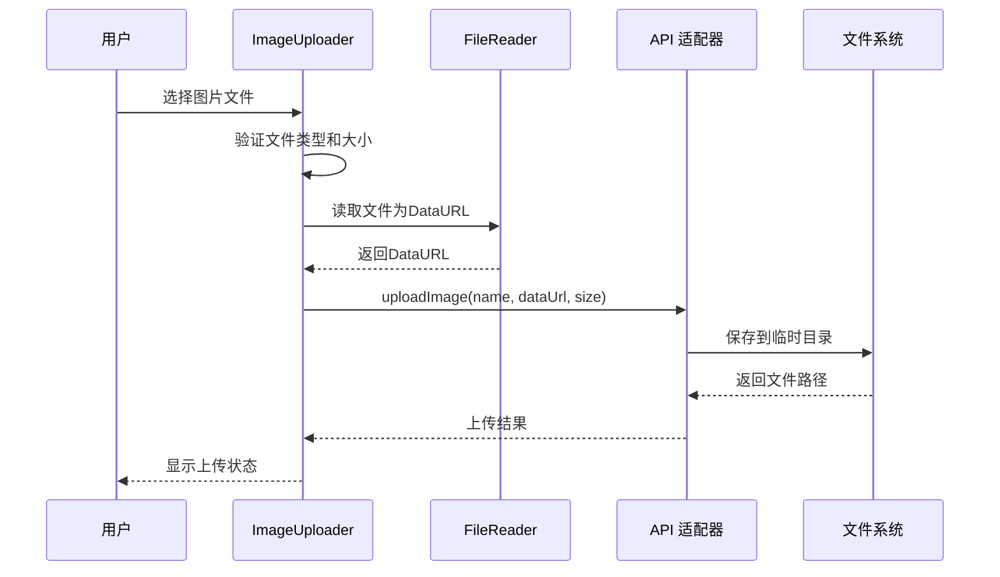
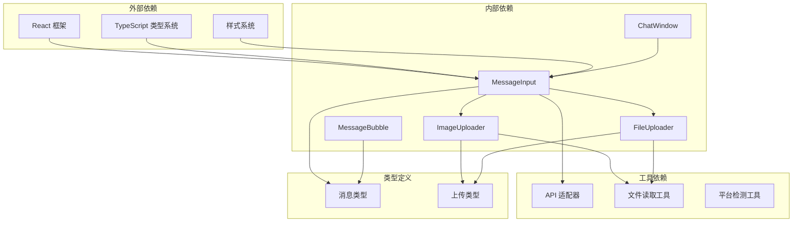

# 消息输入组件

<cite>
**本文档引用的文件**
- [MessageInput.tsx](file://src/renderer/components/MessageInput.tsx)
- [ImageUploader.tsx](file://src/renderer/components/ImageUploader.tsx)
- [FileUploader.tsx](file://src/renderer/components/FileUploader.tsx)
- [message.ts](file://src/types/message.ts)
- [index.tsx](file://src/renderer/index.tsx)
- [App.tsx](file://src/renderer/App.tsx)
- [AppWeb.tsx](file://src/renderer/AppWeb.tsx)
- [ChatWindow.tsx](file://src/renderer/components/ChatWindow.tsx)
- [MessageBubble.tsx](file://src/renderer/components/MessageBubble.tsx)
- [platform.ts](file://src/renderer/utils/platform.ts)
- [terminal.css](file://src/renderer/styles/terminal.css)
- [file-reader.ts](file://src/renderer/utils/file-reader.ts)
- [api/index.ts](file://src/renderer/api/index.ts)
</cite>

## 目录
1. [简介](#简介)
2. [项目结构](#项目结构)
3. [核心组件](#核心组件)
4. [架构概览](#架构概览)
5. [详细组件分析](#详细组件分析)
6. [依赖关系分析](#依赖关系分析)
7. [性能考量](#性能考量)
8. [故障排除指南](#故障排除指南)
9. [结论](#结论)

## 简介

史丽慧小助理 消息输入组件是一个功能丰富的终端风格输入控件，专为 AI 聊天应用设计。该组件提供了完整的消息输入体验，包括文本输入、多媒体附件上传、智能命令提示、键盘快捷键支持和完善的错误处理机制。

组件采用现代化的 React 架构，支持 Electron 和 Web 两种运行环境，具备响应式设计和良好的用户体验。通过精心设计的组件体系，实现了高度可定制化的输入界面，满足不同场景下的使用需求。

## 项目结构

消息输入组件位于 史丽慧小助理 应用的渲染进程部分，采用模块化设计，与其他核心组件协同工作：



**图表来源**
- [MessageInput.tsx:1-445](file://src/renderer/components/MessageInput.tsx#L1-L445)
- [ImageUploader.tsx:1-242](file://src/renderer/components/ImageUploader.tsx#L1-L242)
- [FileUploader.tsx:1-238](file://src/renderer/components/FileUploader.tsx#L1-L238)

**章节来源**
- [MessageInput.tsx:1-445](file://src/renderer/components/MessageInput.tsx#L1-L445)
- [index.tsx:1-21](file://src/renderer/index.tsx#L1-L21)

## 核心组件

### MessageInput 组件

MessageInput 是整个消息输入系统的核心组件，负责处理用户输入、管理上传的媒体文件，并提供完整的交互体验。

#### 主要功能特性

1. **智能文本输入处理**
   - 自动调整文本框高度（32px-120px）
   - 多行编辑支持和智能换行
   - 历史记录管理和上下键导航

2. **命令系统**
   - 内置命令提示和自动补全
   - 支持 `/new`、`/memory`、`/history` 等系统命令
   - 连接器 Tab 特殊支持 `/stop` 命令

3. **多媒体上传**
   - 图片上传（最多5张，每张最大5MB）
   - 文件上传（最多5个，每个最大500MB）
   - 实时预览和删除功能

4. **键盘快捷键**
   - Enter 发送消息，Shift+Enter 换行
   - Tab 命令补全，上下箭头历史导航
   - Esc 关闭命令提示

#### 组件接口

```typescript
interface MessageInputProps {
  onSend: (content: string, images?: UploadedImage[], files?: UploadedFile[]) => void;
  onStop: () => void;
  disabled?: boolean;
  isGenerating?: boolean;
  userName?: string;
  disableStop?: boolean;
  isConnectorTab?: boolean;
}

export interface MessageInputRef {
  focus: () => void;
}
```

**章节来源**
- [MessageInput.tsx:10-33](file://src/renderer/components/MessageInput.tsx#L10-L33)
- [MessageInput.tsx:20-24](file://src/renderer/components/MessageInput.tsx#L20-L24)

### 上传组件系统

#### ImageUploader 组件

图片上传组件提供完整的图片处理能力：

- **文件验证**：类型检查（image/*）、大小限制（≤5MB）
- **实时预览**：缩略图显示和删除功能
- **互斥控制**：与文件上传的互斥检查
- **进度反馈**：上传状态和错误提示

#### FileUploader 组件

文件上传组件专注于大文件处理：

- **容量限制**：最多5个文件，每个最大500MB
- **格式支持**：通用文件类型支持
- **元数据显示**：文件名和大小信息
- **删除管理**：一键删除上传的文件

**章节来源**
- [ImageUploader.tsx:16-34](file://src/renderer/components/ImageUploader.tsx#L16-L34)
- [FileUploader.tsx:16-34](file://src/renderer/components/FileUploader.tsx#L16-L34)

## 架构概览

消息输入组件采用分层架构设计，确保各组件职责清晰、耦合度低：



**图表来源**
- [MessageInput.tsx:140-170](file://src/renderer/components/MessageInput.tsx#L140-L170)
- [ImageUploader.tsx:37-103](file://src/renderer/components/ImageUploader.tsx#L37-L103)
- [FileUploader.tsx:37-97](file://src/renderer/components/FileUploader.tsx#L37-L97)

**章节来源**
- [api/index.ts:298-311](file://src/renderer/api/index.ts#L298-L311)

## 详细组件分析

### 文本输入处理机制

MessageInput 组件实现了智能的文本输入处理，包括自动高度调整和历史记录管理：



**图表来源**
- [MessageInput.tsx:76-93](file://src/renderer/components/MessageInput.tsx#L76-L93)
- [MessageInput.tsx:274-331](file://src/renderer/components/MessageInput.tsx#L274-L331)

#### 历史记录管理

组件内置了完整的命令历史管理系统：

- **历史存储**：最多保存最近的输入记录
- **去重机制**：避免重复历史记录
- **系统命令过滤**：不保存系统命令到历史
- **上下键导航**：支持快速访问历史记录

**章节来源**
- [MessageInput.tsx:39-42](file://src/renderer/components/MessageInput.tsx#L39-L42)
- [MessageInput.tsx:143-149](file://src/renderer/components/MessageInput.tsx#L143-L149)

### 命令系统实现

MessageInput 组件提供了强大的命令系统，支持智能提示和自动补全：



**图表来源**
- [MessageInput.tsx:52-58](file://src/renderer/components/MessageInput.tsx#L52-L58)
- [MessageInput.tsx:95-117](file://src/renderer/components/MessageInput.tsx#L95-L117)

#### 命令类型

组件支持以下命令类型：

1. **基础命令**
   - `/new`：清空会话历史，开始新对话
   - `/memory`：查看和管理记忆
   - `/history`：查看对话历史统计

2. **连接器命令**
   - `/stop`：停止当前正在执行的任务（仅连接器 Tab）

**章节来源**
- [MessageInput.tsx:52-58](file://src/renderer/components/MessageInput.tsx#L52-L58)
- [MessageInput.tsx:172-258](file://src/renderer/components/MessageInput.tsx#L172-L258)

### 上传功能详解

#### 图片上传流程



**图表来源**
- [ImageUploader.tsx:37-103](file://src/renderer/components/ImageUploader.tsx#L37-L103)
- [file-reader.ts:16-23](file://src/renderer/utils/file-reader.ts#L16-L23)

#### 文件上传机制

文件上传组件提供了大文件处理能力：

- **批量上传**：支持多文件同时上传
- **进度跟踪**：实时显示上传状态
- **错误处理**：完善的错误提示和重试机制
- **内存管理**：及时清理临时文件引用

**章节来源**
- [FileUploader.tsx:37-97](file://src/renderer/components/FileUploader.tsx#L37-L97)
- [ImageUploader.tsx:105-117](file://src/renderer/components/ImageUploader.tsx#L105-L117)

### 键盘快捷键系统

MessageInput 组件实现了全面的键盘快捷键支持：

| 快捷键 | 功能 | 说明 |
|--------|------|------|
| Enter | 发送消息 | 普通发送，Shift+Enter 换行 |
| Shift+Enter | 新行 | 在当前位置插入换行符 |
| Tab | 命令补全 | 自动补全当前选中的命令 |
| ↑/↓ | 历史导航 | 上下键浏览历史记录 |
| Escape | 关闭提示 | 关闭命令提示框 |

**章节来源**
- [MessageInput.tsx:172-258](file://src/renderer/components/MessageInput.tsx#L172-L258)

## 依赖关系分析

消息输入组件的依赖关系体现了清晰的分层架构：



**图表来源**
- [MessageInput.tsx:5-8](file://src/renderer/components/MessageInput.tsx#L5-L8)
- [ImageUploader.tsx:10-14](file://src/renderer/components/ImageUploader.tsx#L10-L14)
- [FileUploader.tsx:10-14](file://src/renderer/components/FileUploader.tsx#L10-L14)

**章节来源**
- [message.ts:29-47](file://src/types/message.ts#L29-L47)

## 性能考量

### 内存管理

消息输入组件采用了多项内存优化策略：

1. **图片预览缓存**
   - 使用 Data URL 缓存减少重复计算
   - 及时清理临时文件引用
   - 支持图片预览的懒加载

2. **状态管理优化**
   - 使用 React Hooks 管理组件状态
   - 避免不必要的重渲染
   - 合理的状态更新策略

3. **文件上传优化**
   - 分块上传大文件
   - 进度条实时更新
   - 错误重试机制

### 渲染性能

组件通过以下方式优化渲染性能：

- **虚拟滚动**：大量历史记录的高效显示
- **防抖处理**：输入事件的节流处理
- **条件渲染**：根据状态动态显示组件
- **CSS 动画**：硬件加速的过渡效果

## 故障排除指南

### 常见问题及解决方案

#### 上传失败问题

**问题症状**：图片或文件上传失败，出现错误提示

**可能原因**：
1. 文件类型不支持
2. 文件大小超出限制
3. 网络连接异常
4. 服务器存储空间不足

**解决步骤**：
1. 检查文件类型是否符合要求
2. 确认文件大小在限制范围内
3. 验证网络连接稳定性
4. 查看服务器存储状态

#### 命令执行问题

**问题症状**：命令无法执行或执行结果异常

**排查方法**：
1. 检查命令拼写是否正确
2. 确认当前 Tab 类型支持该命令
3. 验证系统权限设置
4. 查看命令执行日志

#### 输入框无响应

**问题症状**：输入框无法获得焦点或响应输入

**解决方法**：
1. 检查组件是否被禁用
2. 确认父组件状态正常
3. 验证键盘事件绑定
4. 检查 CSS 样式冲突

**章节来源**
- [ImageUploader.tsx:41-51](file://src/renderer/components/ImageUploader.tsx#L41-L51)
- [FileUploader.tsx:40-51](file://src/renderer/components/FileUploader.tsx#L40-L51)

## 结论

史丽慧小助理 消息输入组件是一个功能完善、架构清晰的现代化输入控件。通过精心设计的组件体系和完善的错误处理机制，为用户提供了优秀的聊天输入体验。

组件的主要优势包括：

1. **功能完整性**：涵盖了现代聊天应用所需的所有核心功能
2. **用户体验优秀**：智能提示、快捷键支持、实时预览等功能提升使用效率
3. **架构设计合理**：清晰的组件分离和依赖管理
4. **性能优化到位**：内存管理和渲染优化确保流畅体验
5. **跨平台支持**：Electron 和 Web 环境的统一适配

通过持续的优化和维护，消息输入组件将继续为 史丽慧小助理 提供稳定可靠的基础功能，支撑整个 AI 聊天应用的成功运行。